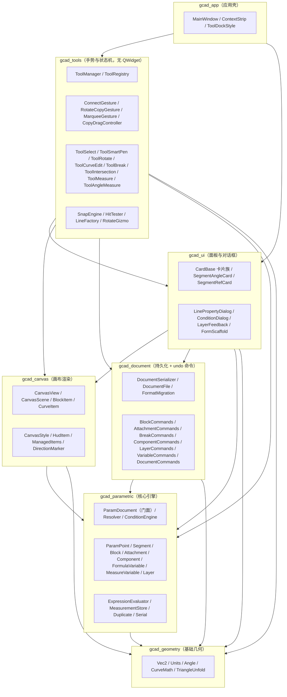

# ARCHITECTURE —— 模块分层与外部依赖

> 2026-09-02 依据 `CMakeLists.txt` 实际依赖声明实扫生成（`target_link_libraries`，CMakeLists.txt:118-375）。
> 分层单向依赖由 `python tools/check_layering.py` 把关（已进 ctest 为 `check_layering` 测试）。

## 模块分层依赖图

依赖方向 = `target_link_libraries` 实际声明，单向向下，下层绝不反向依赖上层。

**依赖链**：`gcad_geometry` → `gcad_parametric` → `gcad_canvas` / `gcad_document` → `gcad_ui` → `gcad_tools` → `gcad_app`。主程序与全部测试通过链接库获得源码。

## 当前系统依赖的外部中间件

| 中间件 | 用途 | 引入方式 |
|--------|------|----------|
| Qt 6.x（Widgets / Svg / Test / OpenGLWidgets / WidgetsPrivate） | 全部 UI、画布、测试 | `find_package(Qt6)`（CMakeLists.txt:25,384） |
| miniz 3.0.2 | 文档 ZIP 压缩（DocumentSerializer） | FetchContent（CMakeLists.txt:29-36） |
| ElaWidgetTools（GIT_TAG aa1856b8） | 主题化界面（ElaWindow/ElaTabBar/ElaLineEdit 等） | FetchContent + add_subdirectory（CMakeLists.txt:43-58） |
| spdlog v1.17.0 | 日志 | FetchContent（CMakeLists.txt:70-76） |
| Tracy v0.14.0（TRACY_ON_DEMAND=ON） | 性能剖析 | FetchContent（CMakeLists.txt:83-90） |

**无数据库、无网络服务、无运行时外部进程**——纯桌面应用，全部中间件为构建期依赖。
