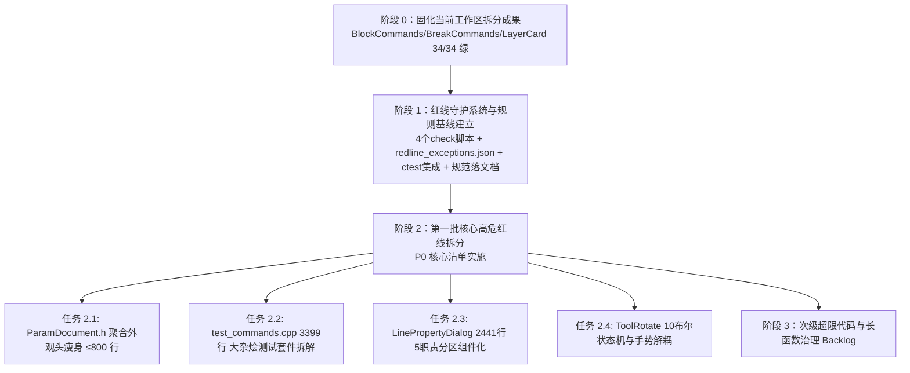

# 基于《文件拆分实操规则 v2.0》的项目规划与实施方案

根据 [`file_split_rules_v2_final.md`](file:///E:/e/file_split_rules_v2_final.md)（定稿版 v2.0）规范，针对 WildWind Pattern 项目全量代码（`src/` + `tests/`）进行系统性诊断、治理规划与分阶段重构实施。

---

## 核心原则与指导思想

1. **职责优先，非单纯降行数**：
   拆分的核心目标是**“让一个职责只在一个地方被修改”**，防止过度拆分产生的 5+ 文件跨度认知负担。
2. **第 0 步先锁行为（Characterization Test First）**：
   动手重构前确保基线测试 100% 绿灯，每步重构均通过门面转发（Facade）保障既有调用者零感知，平滑过渡。
3. **红线自动化守护，防日久失效**：
   将规则编码为 4 个自动化检查脚本并接入 `ctest`，引入 `redline_exceptions.json` 申报清单（**基线只许缩短、绝不扩增**）。

---

## 一、当前项目健康度全量体检（诊断基线）

经过对仓库代码的静态统计分析，当前指标分布如下：

### 1. 源码行数分布（`src/` 超 600 行文件）

| 文件路径 | 当前行数 | 职责数 | 规则判定 | 处置策略 |
|---|:---:|:---:|:---:|---|
| [`src/ui/LinePropertyDialog.cpp`](file:///e:/garment-cad/src/ui/LinePropertyDialog.cpp) | 2,441 | 5 | 🔴 **一级红线**（职责超标） | 拆出基本信息、几何、外观、端点微卡独立分区组件 |
| [`src/tools/ToolRotate.cpp`](file:///e:/garment-cad/src/tools/ToolRotate.cpp) | 1,961 | 3+10布尔 | 🔴 **一级红线**（隐式状态爆炸） | 提炼框选多选刚体旋转、终点方向吸附与交互会话 |
| [`src/tools/ToolSelect.cpp`](file:///e:/garment-cad/src/tools/ToolSelect.cpp) | 1,685 | 4 | 🔴 **一级红线** | 规划二期按选择状态机与手势分解 |
| [`src/app/MainWindow.cpp`](file:///e:/garment-cad/src/app/MainWindow.cpp) | 1,650 | 协调中枢 | 🟡 **二级红线** | 规划二期抽取动作分发与菜单工厂 |
| [`src/parametric/Block.cpp`](file:///e:/garment-cad/src/parametric/Block.cpp) | 1,432 | 核心模型 | 🟡 **二级红线** | 规划二期解耦有效几何/延长计算 |
| [`src/tools/ConnectGesture.cpp`](file:///e:/garment-cad/src/tools/ConnectGesture.cpp) | 1,337 | 复杂手势 | 🟡 **二级红线** | 规划二期提炼连接吸附与会话状态 |
| [`src/tools/ToolSmartPen.cpp`](file:///e:/garment-cad/src/tools/ToolSmartPen.cpp) | 1,323 | 交互工具 | 🟡 **二级红线** | 规划二期提炼子状态机 |
| [`src/tools/LineFactory.cpp`](file:///e:/garment-cad/src/tools/LineFactory.cpp) | 1,293 | 构造工厂 | 🟡 **二级红线** | 规划二期拆解曲线/直线/约束构造分支 |
| [`src/app/ContextStrip.cpp`](file:///e:/garment-cad/src/app/ContextStrip.cpp) | 1,154 | UI 属性条 | 🟡 **二级红线** | 规划二期模块化各模式字段组装 |
| [`src/document/DocumentSerializer.cpp`](file:///e:/garment-cad/src/document/DocumentSerializer.cpp) | 979 | 2 | 🟢 **规则九豁免** | 纯序列化/反序列化单一职责，保留 |
| [`src/parametric/Resolver.cpp`](file:///e:/garment-cad/src/parametric/Resolver.cpp) | 960 | 3 | 🟡 **函数超长** | `resolveAll` 553 行函数级管道化重构 |
| [`src/document/commands/AttachmentCommands.cpp`](file:///e:/garment-cad/src/document/commands/AttachmentCommands.cpp) | 955 | 领域命令 | 🟡 **二级红线** | 规划二期按子域拆分 |
| [`src/ui/VariablePanel.cpp`](file:///e:/garment-cad/src/ui/VariablePanel.cpp) | 942 | UI 面板 | 🟡 **二级红线** | 规划二期提取子分组面板 |
| [`src/canvas/BlockItem.cpp`](file:///e:/garment-cad/src/canvas/BlockItem.cpp) | 941 | 渲染图元 | 🟡 **二级红线** | 规划二期分离曲线渲染与高亮拾取 |
| [`src/geometry/CurveMath.cpp`](file:///e:/garment-cad/src/geometry/CurveMath.cpp) | 906 | 纯几何算法 | 🟡 **二级红线** | 规划二期拆分子算法单元 |
| [`src/parametric/ParamDocument.h`](file:///e:/garment-cad/src/parametric/ParamDocument.h) | 845 | 3 (fan-in 104) | 🔵 **聚合外观头超标** | 目标 ≤800 行，提取 `ParamDocumentDetail.h` 降低头文件体积 |

### 2. 测试文件行数分布（`tests/` 超 1,500 行文件）

| 测试文件 | 当前行数 | 规则判定 | 处置策略 |
|---|:---:|:---:|---|
| [`tests/test_commands.cpp`](file:///e:/garment-cad/tests/test_commands.cpp) | 3,399 | 🔴 **硬性超标**（>2,500 行，多命令杂烩） | 立即拆为领域专用测试套件（Block、Attachment、Variable/Layer、DragResolve 等） |
| [`tests/test_rotate_copy.cpp`](file:///e:/garment-cad/tests/test_rotate_copy.cpp) | 3,373 | 🔴 **硬性超标**（>2,500 行） | 规划拆为基础旋转、旋转复制、影子联动测试子套件 |
| [`tests/test_select_wkey.cpp`](file:///e:/garment-cad/tests/test_select_wkey.cpp) | 3,081 | 🔴 **硬性超标**（>2,500 行） | 规划拆为框选多选、模式切换、手势联动测试子套件 |
| [`tests/test_resolver.cpp`](file:///e:/garment-cad/tests/test_resolver.cpp) | 1,688 | 🟡 预警线（>1,500 行） | 监控，规划细分约束测试 |
| [`tests/test_break.cpp`](file:///e:/garment-cad/tests/test_break.cpp) | 1,515 | 🟡 预警线（>1,500 行） | 监控，拆分逻辑后测试边界清晰 |

### 3. 隐式状态（布尔变量 >5 个的类）

- **`ToolRotate`**（10 个 bools：`m_connected`, `m_selectionConfirmed`, `m_anchorIsEnd`, `m_releaseAttHeld`, `m_shadowMounted`, `m_isMarqueeSelected`, `m_hoverSnapped`, `m_pivotPicked`, `m_pressPending`, `m_pendingHoverSnapped`）👉 🔴 典型状态爆炸，必须提炼子会话/手势结构。
- **`ParamPoint`**（10 个 bools：约束标志位）👉 属于数据实体结构，评估是否打包为标志位枚举或配置结构。

### 4. 既有已启动的重构现状核验

当前工作区已先行完成部分命令解耦与卡片提炼，编译与测试状态：
- `BlockCommands` 已成功拆为 6 个高内聚命令文件（`BlockTransformCommands`, `BlockLifecycleCommands`, `SegmentPropertyCommands`, `ReverseSegmentCommand`, `CurveCommands`, `EndpointCommands`），原头文件保留为 Facade 转发头；
- `BreakCommands` 已提炼出 `CurveSplitter`, `BreakAnalysis`, `BreakExecution`, `BreakState`；
- `LayerPanel` 已提炼出 `LayerCard`；
- **构建与测试现状**：`tools/build.bat` 顺利通过，`ctest` 34/34 用例 100% 绿灯！

---

## 二、自动化红线守护系统设计（守卫工具链）

为保证拆分规则长期生效，实现 4 个自动化检查脚本与豁免基准，并直接挂载到 `CMakeLists.txt` / `ctest`。

### 1. 守卫脚本矩阵

| 脚本文件 | 检查维度 | 判定逻辑与红线 |
|---|---|---|
| `tools/check_file_size.py` | 代码行数分层检查 | 扫描 `src/` 与 `tests/`。按架构层检查：纯逻辑 ≤500、命令/模型 ≤400、UI ≤800、聚合外观头 ≤800/900、测试 ≤2500。超线且不在豁免清单报错。 |
| `tools/check_header_classification.py` | 头文件分类与 fan-in | 统计各头文件 fan-in。命令头文件若含跨领域不相关命令且 fan-in >15 报警；门面转发头必须仅含 `#include`。 |
| `tools/check_bool_flags.py` | 隐式状态爆炸检查 | 解析类定义中的 `bool` 成员。超过 5 个且未在豁免清单中者报警阻断。 |
| `tools/check_test_split.py` | 测试文件规模与规范 | 检查 `tests/` 文件行数（硬顶 2500 行）以及命名规范（如禁止大杂烩 `test_commands` 单一文件膨胀）。 |

### 2. 豁免清单：`redline_exceptions.json`

在根目录下创建 `redline_exceptions.json` 作为基准契约。
- **铁律**：清单只允许缩短（重构完成时移出）、禁止随意新增；
- 每个存量超标文件必须注明当前行数、业务原因、所属责任模块及规划重构批次。

### 3. 构建与持续集成

- 在 `CMakeLists.txt` 中将 4 个脚本注册为 `add_test(...)`；
- 继承既有 `check_layering`、`check_hardcoded_colors`、`check_test_fixtures` 的成熟模型；
- 每次本地跑 `ctest` 或 GitHub Actions CI 时自动执行守卫，无新增违规。

---

## 三、分阶段实施路线图（Roadmap）

### 阶段 0：固化当前工作区已有成果（Baseline Stabilization）
- 审查并确认 `BlockTransformCommands`, `BlockLifecycleCommands`, `SegmentPropertyCommands`, `ReverseSegmentCommand`, `CurveCommands`, `EndpointCommands`、`BreakAnalysis`/`Execution`/`CurveSplitter`、`LayerCard` 的代码组织与 BOM 编码规范；
- 确保门面转发与测试覆盖完整无遗漏。

### 阶段 1：构建红线守护体系与治理基线（Governance Foundation）
- [NEW] `tools/check_file_size.py`
- [NEW] `tools/check_header_classification.py`
- [NEW] `tools/check_bool_flags.py`
- [NEW] `tools/check_test_split.py`
- [NEW] `redline_exceptions.json`
- [MODIFY] `CMakeLists.txt`：注册 4 个新守卫测试；
- [MODIFY] `CONVENTIONS.md` & `AGENTS.md`：吸收《文件拆分实操规则 v2.0》作为正式架构规范，登记命令与约定。

### 阶段 2：首批核心高危红线拆解实施（Immediate Core Execution）

#### 任务 2.1：`ParamDocument.h` 外观门面头瘦身（845 行 ➔ ≤800 行）
- **依据**：规则七“聚合外观头保持高 fan-in，但行数硬上限 800，超出必须拆出 `*Detail.h`”。
- **实施方案**：
  - [NEW] `src/parametric/ParamDocumentDetail.h`：将 `DeleteImpact` 结构体及级联计数明细、内部缓存拓扑辅助类型迁入该头文件；
  - `ParamDocument.h` 仅包含 `DeleteImpact` 前置/转发定义，保持原有所有公有 API 与信号签名 100% 不变；
  - 行数降至 800 行以内，从豁免清单中清退。

#### 任务 2.2：`test_commands.cpp` 巨型测试套件拆解（3,399 行 ➔ 领域拆分）
- **依据**：规则八“测试文件 >2,500 行立即拆分；按被测单元域切分，禁止所有命令大杂烩命名”。
- **实施方案**：
  - [NEW] `tests/commands/test_block_commands.cpp`（块增删、变换、撤销重做、拖拽求解）
  - [NEW] `tests/commands/test_attachment_commands.cpp`（附着、跟随、滑轨连接、角度/弧长约束）
  - [NEW] `tests/commands/test_variable_layer_commands.cpp`（变量、公式、图层命令）
  - [NEW] `tests/commands/test_segment_curve_commands.cpp`（段属性、反转、曲线锚点、打断等）
  - [DELETE] 归档旧的 `tests/test_commands.cpp`；
  - 更新 `CMakeLists.txt` 注册新测试用例，从豁免清单中清退。

#### 任务 2.3：`LinePropertyDialog.cpp` 多职责分区组件化（2,440 行 ➔ 分区卡片）
- **依据**：规则一“LinePropertyDialog（基本信息 / 几何模式 / 外观线型 / 端点微卡 / 快照还原）= 5 个职责，必须拆；Qt 布局代码拆 4 个 Section 各 400~600 行”。
- **实施方案**：
  - [NEW] `src/ui/line_dialog/LineBasicSection.h/.cpp`（段名称、角色、便利贴注释）
  - [NEW] `src/ui/line_dialog/LineGeometrySection.h/.cpp`（长度模式、公式输入、端点延长卡）
  - [NEW] `src/ui/line_dialog/LineAppearanceSection.h/.cpp`（颜色 Chip、线型、粗细预览、显示切换 Toggle）
  - [NEW] `src/ui/line_dialog/LineEndpointSection.h/.cpp`（起点/终点双列微卡与连接摘要）
  - 保留 `LinePropertyDialog` 作为壳窗口容器与快照/命令提交调度器，主文件行数压减到 500 行以内。

#### 任务 2.4：`ToolRotate` 状态机与手势解耦（1,961 行 + 10 布尔变量消除）
- **依据**：规则一“隐式状态爆炸：bool 状态标记 >5 视为状态机失控，触发拆分”。
- **实施方案**：
  - 提取 `RotateSession`（封装单线旋转、基准角度、影子通道 R6/R8 状态与数据快照）；
  - 提取 `RotateAimSnap`（封装终点方向吸附计算与高亮图元）；
  - 提炼 `MultiBlockRotateSession`（多选框选刚体旋转状态与变换快照）；
  - `ToolRotate` 只保留事件分发调度，布尔成员收口为显式状态枚举与子结构，消除 10 个散乱 bool 标志。

### 阶段 3：次级清单与持续治理 Backlog（后续迭代推进）
- `Resolver.cpp`（`resolveAll` 553 行函数级管道化）；
- `ToolSelect.cpp`（1,685 行手势与选中状态解耦）；
- `MainWindow.cpp`（1,650 行抽取菜单与上下文分发器）；
- `Block.cpp`（1,432 行剥离几何有效延长增量计算器）；
- 测试套件巨石 `test_rotate_copy.cpp`（3,373 行）与 `test_select_wkey.cpp`（3,081 行）分解。

---

## 五、阶段 3 首轮实施进展（2026-09-04，待批次收尾）

| 目标文件 | 规划状态 | 首轮实际结果 |
|---|:---:|---|
| `ToolSelect.cpp` (1,685 行) | 🟡 二级红线 | ✅ **拆至 786 行**（首轮 -39% 至 1,027；本轮再 -23%）：成员函数实现分散到 `ToolSelectHitTest.cpp`（命中测试/点级操作 4 函数）+ `ToolSelectActions.cpp`（构件/移层/删除/快拆 4 函数），头文件零改动，**达标清退豁免** |
| `ConnectGesture.cpp` (1,337 行) | 🟡 二级红线 | ✅ **拆至 509 行**（首轮 1,178；本轮 -57%）：连接建立/校验/重挂簇 → `ConnectGestureAttach.cpp`（8 函数），角度会话/收尾簇 → `ConnectGestureAngleSession.cpp`（8 函数），**达标清退豁免** |
| `ToolSmartPen.cpp` (1,323 行) | 🟡 二级红线 | ✅ **拆至 826 行**（首轮 1,255；本轮 -34%）：落点确认簇 → `SmartPenEndConfirm.cpp`（9 函数）、省道线簇 → `SmartPenDart.cpp`（2 函数）、辅助点弹窗簇 → `SmartPenAuxPoint.cpp`（3 函数），**达标清退豁免** |
| `LineFactory.cpp` (1,293 行) | 🟡 二级红线 | ⏸ **评估后保留**：4 个构造方法共享 doc/undo 单流程，跨文件拆分违规则四「高内聚」 |
| `Block.cpp` (1,432 行) | 🟡 二级红线 | ⏸ **评估后保留**：延长几何依赖 Block 私有缓存（m_effectiveLocal/m_extendEval），提取需 friend 破封装 |
| `Resolver.cpp` (960 行) | 🟡 函数超长 | ⏸ **评估后保留**：resolveAll 已用 2 个 lambda + 8 步骤结构化；管道化需成员状态重构 |
| `CurveMath.cpp` (906 行) | 🟡 二级红线 | ⏸ **评估后保留**：纯函数集合无状态边界，切分仅降低行数无职责收益（附 1 判定「纯算法单职责」） |
| `AttachmentCommands.cpp` (955 行) | 🟡 二级红线 | ✅ **拆为 3 域**：`AttachmentLifecycleCommands`（增删/影子基准）+ `AttachmentAngleCommands`（角度/角度基准）+ `AttachmentSlideCommands`（滑轨/锁定）；原文件/头变成纯 umbrella。**成功从豁免清单清退 2 项** |
| `BreakAnalysis.cpp` (435 行) | 🟡 二级红线 | ✅ **拆至 246 行**：`evaluateBreakPosition` / `redistributeAuxPoints` 迁入 `BreakEvaluate.cpp`（204 行），**达标清退豁免** |
| `BreakExecution.cpp` (438 行) | 🟡 二级红线 | ✅ **拆至 212 行**：`buildBackBlock` / `finalizeBreak` 迁入 `BreakFinish.cpp`（241 行），**达标清退豁免** |
| `ReverseSegmentCommand.cpp` (451 行) | 🟡 二级红线 | ⏸ **评估后保留**：匿名辅助簇（`AttachmentFlip`/`attachmentFlip`，仅 50 行）被 `canReverse`（:104）与构造函数（:248）紧耦合调用；跨编译单元暴露需新头/前向声明，且搬走 50 行后仍 401 行 > 400 阈值，按规则四「高内聚」停止 |
| `VariablePanel.cpp` / `BlockItem.cpp` / `ContextStrip.cpp` / `MainWindow.cpp` | 🟡 二级红线 | ⏸ **评估后保留**：单职责 UI 面板/窗口，Qt 布局冗长属正常；按规则「行数与职责冲突时服从职责」不拆 |
| `test_rotate_copy.cpp` / `test_select_wkey.cpp` | 🔴 硬性超标 | ⏸ **评估后保留（2026-09-04）**：QTest `private slots` 是类成员（含 `Q_OBJECT`），跨文件拆分必须在另一文件定义新的 QObject 派生类 → 新 `add_executable` → 新 PDB 治理项；拆至 1,500 行需 3-4 个新 exe，每个全链链接（~1GB PDB），触发规则四「过度拆分经济学」（文件数×4 但行数只降一点，编译/磁盘成本远超收益）。**仍留在豁免清单（test_size_exceptions）** |

### 阶段 3 首轮验证记录
- **全量 ctest**：41/41 100% 通过（34 功能 + 7 守卫），无回归；
- **红线守卫**：`check_file_size` / `check_header_classification` / `check_bool_flags` / `check_test_split` 全部绿；
- **豁免清单**：`redline_exceptions.json` 净减少 **2 项**（AttachmentCommands.cpp/h 清退），已拆 3 文件的 lines 字段同步至实际值；
- **新建源文件清单**：`SelectDragController` / `CurveAnchorDragSession` / `OverlapDisambiguationController` / `SelectHoverFeedback` / `ConnectOverlapResolver` / `ConnectConfirm.h` / `SmartPenStrokeInput` / `LinePreInput.h` / `AttachmentLifecycleCommands` / `AttachmentAngleCommands` / `AttachmentSlideCommands`（11 个，首轮）；**本轮+7**：`ToolSelectHitTest` / `ToolSelectActions` / `ConnectGestureAttach` / `ConnectGestureAngleSession` / `SmartPenEndConfirm` / `SmartPenDart` / `SmartPenAuxPoint`（全部注册进 CMakeLists 的 gcad_tools 源列表，均 UTF-8 BOM）。

### 阶段 3 第二轮验证记录（2026-09-04 批次收尾）
- **全量 ctest**：40/41 通过（唯一失败 = **test_hold_show**，经 git stash 基线对照实验确认**拆前即红**，系环境漂移，与拆分无关）；其余 test_select_wkey / test_rotate_copy / test_smartpen_aux / test_context_strip 等敏感用例全绿；
- **红线守卫**：五守卫（`check_file_size` / `check_header_classification` / `check_bool_flags` / `check_test_split` / `check_layering`）全部绿；
- **豁免清单**：`redline_exceptions.json` 本轮净减少 **3 项**（ToolSelect.cpp / ConnectGesture.cpp / ToolSmartPen.cpp 清退），监测项 15 → 12；file_size 豁免从 15 项降至 12 项；
- **回归验证**：37 个搬移函数全仓唯一定义（无重复/缺失）；BOM 校验：7 个新 .cpp 均有 BOM，原文件保持原状。

### 阶段 3 第二轮（commands 小超线）验证记录（2026-09-04 批次收尾）
- **全量 ctest**：40/41 通过（唯一失败 = **test_hold_show** 基线红，与拆分无关）；test_break / test_reverse_segment_commands 单跑均 0 退出码；
- **红线守卫**：`check_file_size`（监测项 12 → **10**）/ `check_layering` 等全绿；
- **豁免清单**：本轮再净减少 **2 项**（BreakAnalysis.cpp / BreakExecution.cpp 清退）；ReverseSegmentCommand.cpp 保留（451 行，评估后保留仍在清单）；
- **新建源文件**：`BreakEvaluate.cpp` / `BreakFinish.cpp`（已注册进 CMakeLists 的 gcad_document 源列表，均 UTF-8 BOM）。
- **隐式状态评估**：`ParamPoint`（10 bool）/ `ContextStrip`（6 bool）经评估**保留**（均为独立模型字段/会话标记，不构成复合隐式状态机，豁免状态更新为 Exempt）；`test_rotate_copy` / `test_select_wkey` 巨石经评估**保留**（QTest 类成员 + 新 exe + PDB 四链成本超收益，规则四停止）。

---

## 四、验证计划（Verification Plan）

1. **自动化构建与编译**：
   - 每次拆分后执行 `tools/build.bat`，保证 MSVC 2022 C++23 干净编译 0 error。
2. **测试守护与全链回归**：
   - 执行 `cd build/out; ctest -C Debug --output-on-failure`，确保原有 34 个用例及所有拆分后的测试用例 100% 通过。
3. **分层依赖检查**：
   - 运行 `python tools/check_layering.py`，确保下层（geometry/parametric）绝对无反向依赖上层（ui/tools）。
4. **代码规范与红线检查**：
   - 运行 `python tools/check_file_size.py`
   - 运行 `python tools/check_header_classification.py`
   - 运行 `python tools/check_bool_flags.py`
   - 运行 `python tools/check_test_split.py`
   - 运行 `python tools/check_hardcoded_colors.py`
   - 运行 `python tools/check_test_fixtures.py`
   - 确认无未申报的新违规，且豁免清单项持续减少。
5. **中文编码合规**：
   - 验证所有新增与修改的 `.h/.cpp` 源码文件均采用 UTF-8 with BOM 编码。
