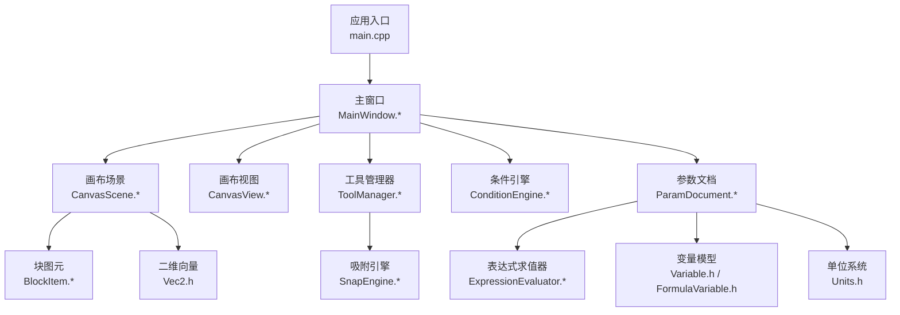
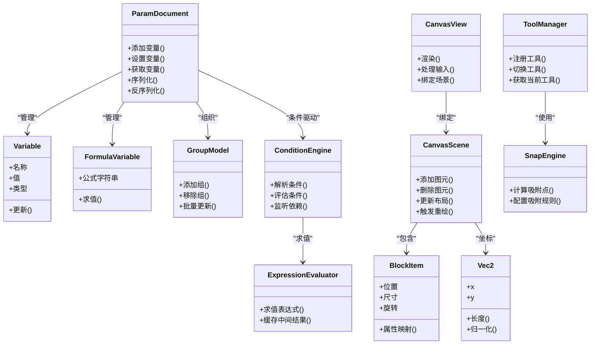
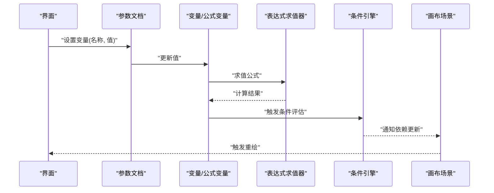
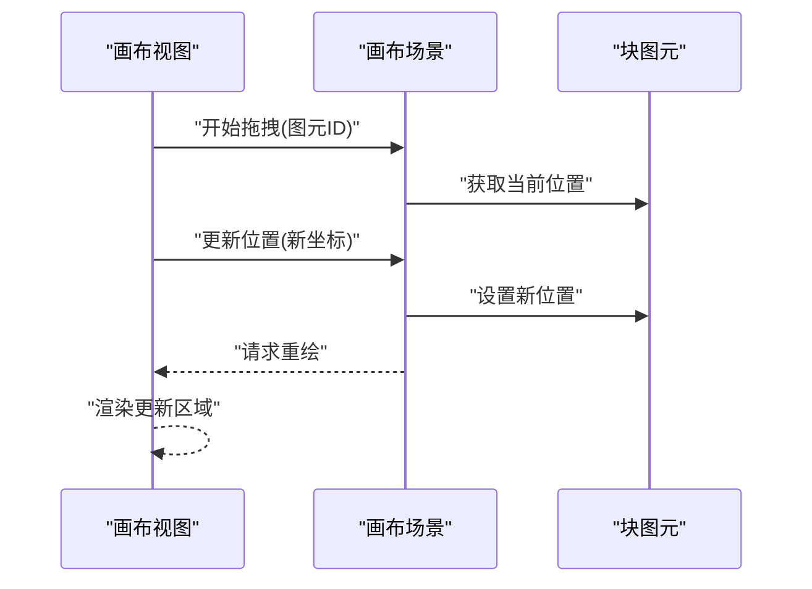
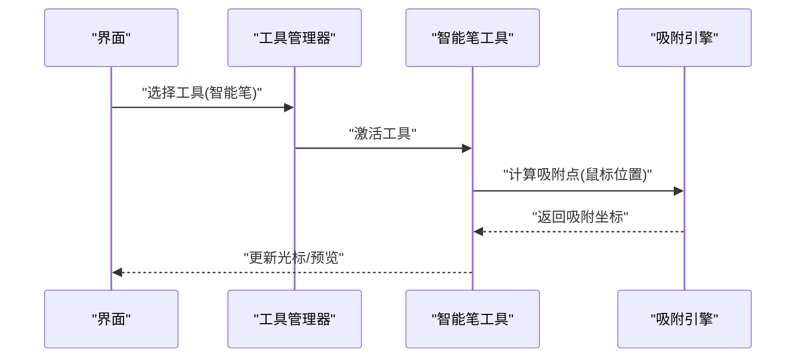
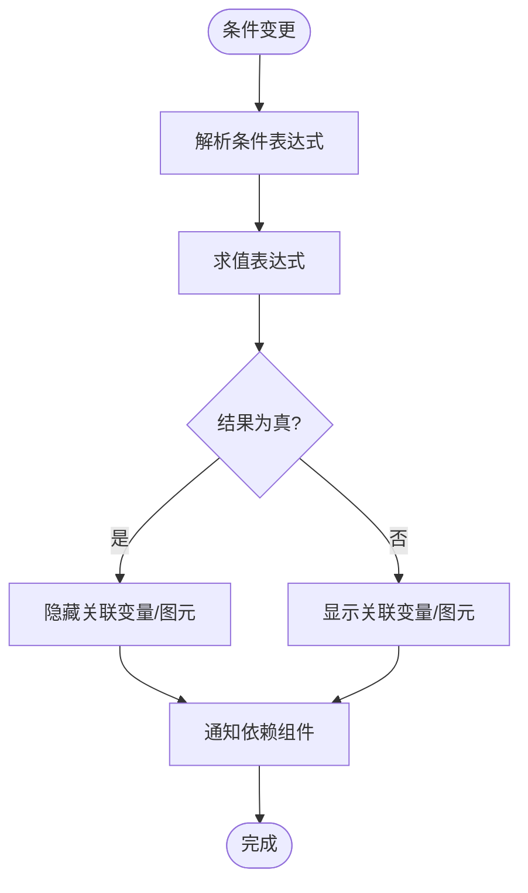
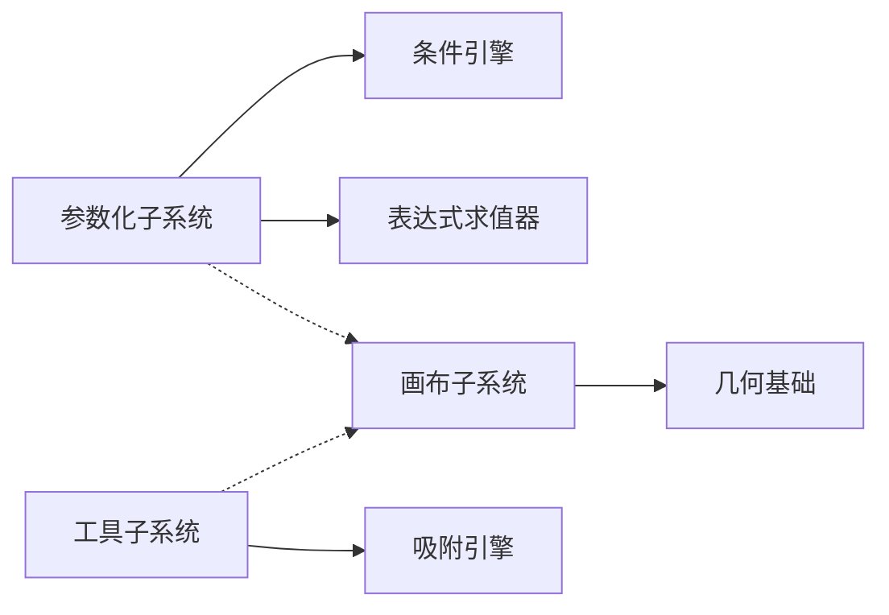

# API参考

<cite>
**本文引用的文件**   
- [src/main.cpp](file://src/main.cpp)
- [src/app/MainWindow.h](file://src/app/MainWindow.h)
- [src/app/MainWindow.cpp](file://src/app/MainWindow.cpp)
- [src/canvas/CanvasScene.h](file://src/canvas/CanvasScene.h)
- [src/canvas/CanvasScene.cpp](file://src/canvas/CanvasScene.cpp)
- [src/canvas/CanvasView.h](file://src/canvas/CanvasView.h)
- [src/canvas/CanvasView.cpp](file://src/canvas/CanvasView.cpp)
- [src/canvas/BlockItem.h](file://src/canvas/BlockItem.h)
- [src/canvas/BlockItem.cpp](file://src/canvas/BlockItem.cpp)
- [src/tools/ToolManager.h](file://src/tools/ToolManager.h)
- [src/tools/ToolManager.cpp](file://src/tools/ToolManager.cpp)
- [src/tools/Tool.h](file://src/tools/Tool.h)
- [src/tools/SnapEngine.h](file://src/tools/SnapEngine.h)
- [src/tools/SnapEngine.cpp](file://src/tools/SnapEngine.cpp)
- [src/parametric/ConditionEngine.h](file://src/parametric/ConditionEngine.h)
- [src/parametric/ConditionEngine.cpp](file://src/parametric/ConditionEngine.cpp)
- [src/parametric/ParamDocument.h](file://src/parametric/ParamDocument.h)
- [src/parametric/ParamDocument.cpp](file://src/parametric/ParamDocument.cpp)
- [src/parametric/ExpressionEvaluator.h](file://src/parametric/ExpressionEvaluator.h)
- [src/parametric/ExpressionEvaluator.cpp](file://src/parametric/ExpressionEvaluator.cpp)
- [src/parametric/Variable.h](file://src/parametric/Variable.h)
- [src/parametric/FormulaVariable.h](file://src/parametric/FormulaVariable.h)
- [src/parametric/Segment.h](file://src/parametric/Segment.h)
- [src/parametric/GroupModel.h](file://src/parametric/GroupModel.h)
- [src/parametric/GroupModel.cpp](file://src/parametric/GroupModel.cpp)
- [src/geometry/Vec2.h](file://src/geometry/Vec2.h)
- [src/geometry/Units.h](file://src/geometry/Units.h)
</cite>

## 目录
1. [简介](#简介)
2. [项目结构](#项目结构)
3. [核心组件](#核心组件)
4. [架构总览](#架构总览)
5. [详细组件分析](#详细组件分析)
6. [依赖关系分析](#依赖关系分析)
7. [性能考虑](#性能考虑)
8. [故障排查指南](#故障排查指南)
9. [结论](#结论)
10. [附录](#附录)

## 简介
本API参考文档面向服装CAD系统的扩展与集成，重点覆盖以下四类接口：
- 参数化数据API（变量、公式、分组、序列化）
- 画布场景API（视图、场景、图元、动画）
- 工具管理API（工具注册、选择、吸附引擎）
- 条件引擎API（条件解析、表达式求值、依赖求解）

说明：
- 当前仓库为桌面端C++实现，未提供HTTP/Web API。本文档将“API”定义为模块间稳定可调用的公共接口（类、方法、数据结构），并给出调用序列、错误处理策略、性能建议与调试方法。
- 若需对外暴露HTTP接口，可在现有模块之上封装REST服务层；本文档在相应章节提供扩展指引。

## 项目结构
- 应用入口与主窗口负责初始化UI与子系统。
- 画布子系统提供场景渲染、交互与动画能力。
- 工具子系统提供工具生命周期管理与吸附计算。
- 参数化子系统提供变量、公式、条件、分组与序列化能力。
- 几何基础类型提供向量与单位换算。

**图表来源** 
- [src/main.cpp](file://src/main.cpp)
- [src/app/MainWindow.h](file://src/app/MainWindow.h)
- [src/canvas/CanvasScene.h](file://src/canvas/CanvasScene.h)
- [src/canvas/CanvasView.h](file://src/canvas/CanvasView.h)
- [src/tools/ToolManager.h](file://src/tools/ToolManager.h)
- [src/parametric/ConditionEngine.h](file://src/parametric/ConditionEngine.h)
- [src/parametric/ParamDocument.h](file://src/parametric/ParamDocument.h)
- [src/canvas/BlockItem.h](file://src/canvas/BlockItem.h)
- [src/tools/SnapEngine.h](file://src/tools/SnapEngine.h)
- [src/parametric/ExpressionEvaluator.h](file://src/parametric/ExpressionEvaluator.h)
- [src/geometry/Vec2.h](file://src/geometry/Vec2.h)
- [src/geometry/Units.h](file://src/geometry/Units.h)

**章节来源**
- [src/main.cpp](file://src/main.cpp)
- [src/app/MainWindow.h](file://src/app/MainWindow.h)
- [src/app/MainWindow.cpp](file://src/app/MainWindow.cpp)

## 核心组件
- 参数化数据API
  - 变量与公式：支持基本变量与公式变量，提供读写与依赖更新。
  - 分组模型：对变量进行分组管理，支持批量操作与状态同步。
  - 序列化：文档级序列化/反序列化，便于保存与加载。
- 画布场景API
  - 场景与视图：场景负责对象集合与布局，视图负责绘制与事件分发。
  - 图元：块图元代表服装裁片等可编辑对象，支持变换与属性。
  - 动画：场景动画驱动视图刷新。
- 工具管理API
  - 工具注册与切换：集中管理可用工具与当前激活工具。
  - 吸附引擎：基于几何规则的智能对齐与捕捉。
- 条件引擎API
  - 条件解析：解析条件表达式，评估布尔结果。
  - 表达式求值：通用表达式求值器，支持变量引用与函数。
  - 依赖求解：按依赖顺序重算，避免循环依赖。

**章节来源**
- [src/parametric/Variable.h](file://src/parametric/Variable.h)
- [src/parametric/FormulaVariable.h](file://src/parametric/FormulaVariable.h)
- [src/parametric/GroupModel.h](file://src/parametric/GroupModel.h)
- [src/parametric/GroupModel.cpp](file://src/parametric/GroupModel.cpp)
- [src/parametric/ParamDocument.h](file://src/parametric/ParamDocument.h)
- [src/parametric/ParamDocument.cpp](file://src/parametric/ParamDocument.cpp)
- [src/canvas/CanvasScene.h](file://src/canvas/CanvasScene.h)
- [src/canvas/CanvasScene.cpp](file://src/canvas/CanvasScene.cpp)
- [src/canvas/CanvasView.h](file://src/canvas/CanvasView.h)
- [src/canvas/CanvasView.cpp](file://src/canvas/CanvasView.cpp)
- [src/canvas/BlockItem.h](file://src/canvas/BlockItem.h)
- [src/canvas/BlockItem.cpp](file://src/canvas/BlockItem.cpp)
- [src/tools/ToolManager.h](file://src/tools/ToolManager.h)
- [src/tools/ToolManager.cpp](file://src/tools/ToolManager.cpp)
- [src/tools/SnapEngine.h](file://src/tools/SnapEngine.h)
- [src/tools/SnapEngine.cpp](file://src/tools/SnapEngine.cpp)
- [src/parametric/ConditionEngine.h](file://src/parametric/ConditionEngine.h)
- [src/parametric/ConditionEngine.cpp](file://src/parametric/ConditionEngine.cpp)
- [src/parametric/ExpressionEvaluator.h](file://src/parametric/ExpressionEvaluator.h)
- [src/parametric/ExpressionEvaluator.cpp](file://src/parametric/ExpressionEvaluator.cpp)

## 架构总览
下图展示各子系统之间的调用关系与数据流向。参数化子系统通过条件引擎与表达式求值器驱动变更传播；画布子系统依赖几何基础类型；工具子系统通过吸附引擎增强交互体验。

**图表来源** 
- [src/parametric/ParamDocument.h](file://src/parametric/ParamDocument.h)
- [src/parametric/Variable.h](file://src/parametric/Variable.h)
- [src/parametric/FormulaVariable.h](file://src/parametric/FormulaVariable.h)
- [src/parametric/GroupModel.h](file://src/parametric/GroupModel.h)
- [src/parametric/ConditionEngine.h](file://src/parametric/ConditionEngine.h)
- [src/parametric/ExpressionEvaluator.h](file://src/parametric/ExpressionEvaluator.h)
- [src/canvas/CanvasScene.h](file://src/canvas/CanvasScene.h)
- [src/canvas/CanvasView.h](file://src/canvas/CanvasView.h)
- [src/canvas/BlockItem.h](file://src/canvas/BlockItem.h)
- [src/tools/ToolManager.h](file://src/tools/ToolManager.h)
- [src/tools/SnapEngine.h](file://src/tools/SnapEngine.h)
- [src/geometry/Vec2.h](file://src/geometry/Vec2.h)

## 详细组件分析

### 参数化数据API
- 目标
  - 提供稳定的变量、公式、分组与序列化接口，支撑参数驱动的服装裁片生成。
- 关键类与方法
  - 变量与公式变量：定义变量名、类型、值与公式字符串；提供更新与求值接口。
  - 分组模型：支持分组增删与批量更新，便于界面侧联动。
  - 参数文档：聚合变量与分组，提供序列化/反序列化能力。
- 数据流
  - 用户修改变量或公式 → 表达式求值器重新计算 → 条件引擎评估依赖 → 通知相关组件更新。
- 错误处理
  - 非法表达式返回错误码；循环依赖检测并抛出异常；序列化失败记录日志。
- 性能优化
  - 表达式求值缓存中间结果；按需增量重算；批量更新合并通知。
- 示例调用序列（变量更新到视图刷新）

**图表来源** 
- [src/parametric/ParamDocument.h](file://src/parametric/ParamDocument.h)
- [src/parametric/Variable.h](file://src/parametric/Variable.h)
- [src/parametric/FormulaVariable.h](file://src/parametric/FormulaVariable.h)
- [src/parametric/ExpressionEvaluator.h](file://src/parametric/ExpressionEvaluator.h)
- [src/parametric/ConditionEngine.h](file://src/parametric/ConditionEngine.h)
- [src/canvas/CanvasScene.h](file://src/canvas/CanvasScene.h)

**章节来源**
- [src/parametric/ParamDocument.h](file://src/parametric/ParamDocument.h)
- [src/parametric/ParamDocument.cpp](file://src/parametric/ParamDocument.cpp)
- [src/parametric/Variable.h](file://src/parametric/Variable.h)
- [src/parametric/FormulaVariable.h](file://src/parametric/FormulaVariable.h)
- [src/parametric/GroupModel.h](file://src/parametric/GroupModel.h)
- [src/parametric/GroupModel.cpp](file://src/parametric/GroupModel.cpp)
- [src/parametric/ExpressionEvaluator.h](file://src/parametric/ExpressionEvaluator.h)
- [src/parametric/ExpressionEvaluator.cpp](file://src/parametric/ExpressionEvaluator.cpp)
- [src/parametric/ConditionEngine.h](file://src/parametric/ConditionEngine.h)
- [src/parametric/ConditionEngine.cpp](file://src/parametric/ConditionEngine.cpp)

### 画布场景API
- 目标
  - 提供场景对象管理、视图渲染与交互事件处理。
- 关键类与方法
  - 画布场景：管理图元集合、布局与重绘。
  - 画布视图：绑定场景，处理鼠标/键盘事件，执行绘制。
  - 块图元：表示裁片对象，支持位置、尺寸、旋转与属性。
- 数据流
  - 视图接收输入 → 场景更新图元状态 → 触发重绘 → 视图渲染。
- 错误处理
  - 无效图元索引返回错误；渲染异常捕获并回退到安全模式。
- 性能优化
  - 增量更新可见区域；批处理绘制命令；延迟重绘合并。
- 示例调用序列（拖拽移动图元）

**图表来源** 
- [src/canvas/CanvasView.h](file://src/canvas/CanvasView.h)
- [src/canvas/CanvasScene.h](file://src/canvas/CanvasScene.h)
- [src/canvas/BlockItem.h](file://src/canvas/BlockItem.h)

**章节来源**
- [src/canvas/CanvasScene.h](file://src/canvas/CanvasScene.h)
- [src/canvas/CanvasScene.cpp](file://src/canvas/CanvasScene.cpp)
- [src/canvas/CanvasView.h](file://src/canvas/CanvasView.h)
- [src/canvas/CanvasView.cpp](file://src/canvas/CanvasView.cpp)
- [src/canvas/BlockItem.h](file://src/canvas/BlockItem.h)
- [src/canvas/BlockItem.cpp](file://src/canvas/BlockItem.cpp)

### 工具管理API
- 目标
  - 统一管理工具的注册、切换与行为，结合吸附引擎提升绘图效率。
- 关键类与方法
  - 工具管理器：注册工具、切换当前工具、查询工具信息。
  - 吸附引擎：根据规则计算吸附点，支持距离阈值与优先级。
- 数据流
  - 用户选择工具 → 管理器激活工具 → 视图事件交由工具处理 → 吸附引擎辅助定位。
- 错误处理
  - 未知工具ID返回错误；吸附规则冲突时降级为最近点。
- 性能优化
  - 吸附计算缓存最近命中；批量吸附预处理。
- 示例调用序列（选择智能笔工具）

**图表来源** 
- [src/tools/ToolManager.h](file://src/tools/ToolManager.h)
- [src/tools/Tool.h](file://src/tools/Tool.h)
- [src/tools/SnapEngine.h](file://src/tools/SnapEngine.h)

**章节来源**
- [src/tools/ToolManager.h](file://src/tools/ToolManager.h)
- [src/tools/ToolManager.cpp](file://src/tools/ToolManager.cpp)
- [src/tools/Tool.h](file://src/tools/Tool.h)
- [src/tools/SnapEngine.h](file://src/tools/SnapEngine.h)
- [src/tools/SnapEngine.cpp](file://src/tools/SnapEngine.cpp)

### 条件引擎API
- 目标
  - 解析与评估条件表达式，驱动参数化更新与视图联动。
- 关键类与方法
  - 条件引擎：解析条件、评估布尔结果、监听依赖变化。
  - 表达式求值器：通用表达式求值，支持变量引用与函数。
- 数据流
  - 条件变更 → 解析表达式 → 求值 → 通知依赖组件 → 触发重算。
- 错误处理
  - 语法错误返回错误码；运行时异常捕获并记录上下文。
- 性能优化
  - 表达式AST缓存；依赖图增量更新；短路求值。
- 示例调用序列（条件驱动变量隐藏）

**图表来源** 
- [src/parametric/ConditionEngine.h](file://src/parametric/ConditionEngine.h)
- [src/parametric/ExpressionEvaluator.h](file://src/parametric/ExpressionEvaluator.h)

**章节来源**
- [src/parametric/ConditionEngine.h](file://src/parametric/ConditionEngine.h)
- [src/parametric/ConditionEngine.cpp](file://src/parametric/ConditionEngine.cpp)
- [src/parametric/ExpressionEvaluator.h](file://src/parametric/ExpressionEvaluator.h)
- [src/parametric/ExpressionEvaluator.cpp](file://src/parametric/ExpressionEvaluator.cpp)

## 依赖关系分析
- 耦合度
  - 参数化子系统与条件引擎强耦合（依赖解析与求值）。
  - 画布子系统与几何基础类型弱耦合（仅使用向量与单位）。
  - 工具子系统与吸附引擎松耦合（规则可插拔）。
- 外部依赖
  - 无网络依赖；图形库由平台GUI框架提供。
- 循环依赖
  - 通过接口抽象与事件通知避免循环依赖。

**图表来源** 
- [src/parametric/ParamDocument.h](file://src/parametric/ParamDocument.h)
- [src/parametric/ConditionEngine.h](file://src/parametric/ConditionEngine.h)
- [src/parametric/ExpressionEvaluator.h](file://src/parametric/ExpressionEvaluator.h)
- [src/canvas/CanvasScene.h](file://src/canvas/CanvasScene.h)
- [src/tools/ToolManager.h](file://src/tools/ToolManager.h)
- [src/tools/SnapEngine.h](file://src/tools/SnapEngine.h)
- [src/geometry/Vec2.h](file://src/geometry/Vec2.h)

**章节来源**
- [src/parametric/ParamDocument.h](file://src/parametric/ParamDocument.h)
- [src/canvas/CanvasScene.h](file://src/canvas/CanvasScene.h)
- [src/tools/ToolManager.h](file://src/tools/ToolManager.h)

## 性能考虑
- 参数化更新
  - 使用增量重算与缓存减少重复求值；批量更新合并通知。
- 画布渲染
  - 视口裁剪与增量重绘；绘制命令批处理；延迟加载大图元。
- 工具与吸附
  - 吸附结果缓存与阈值优化；避免频繁几何计算。
- 内存管理
  - 对象池复用图元与工具实例；及时释放临时对象。

[本节为通用指导，不直接分析具体文件]

## 故障排查指南
- 常见问题
  - 表达式求值失败：检查语法与变量存在性；查看错误码与上下文。
  - 循环依赖：识别依赖环并重构公式；启用循环检测日志。
  - 渲染异常：回退到安全模式；检查图元边界与坐标系。
  - 吸附不准确：调整阈值与优先级；验证几何数据一致性。
- 调试建议
  - 启用详细日志输出；使用断点跟踪关键路径；导出参数快照对比。
- 监控方法
  - 统计求值次数与耗时；记录渲染帧率与重绘区域大小。

**章节来源**
- [src/parametric/ExpressionEvaluator.h](file://src/parametric/ExpressionEvaluator.h)
- [src/parametric/ConditionEngine.h](file://src/parametric/ConditionEngine.h)
- [src/canvas/CanvasScene.h](file://src/canvas/CanvasScene.h)
- [src/tools/SnapEngine.h](file://src/tools/SnapEngine.h)

## 结论
本参考文档系统化梳理了服装CAD系统的四大核心API域：参数化数据、画布场景、工具管理与条件引擎。通过清晰的接口定义、数据流与错误处理策略，开发者可在此基础上扩展功能或构建上层服务。建议在集成时遵循性能优化与调试建议，确保系统稳定高效。

[本节为总结性内容，不直接分析具体文件]

## 附录
- 向后兼容性与弃用迁移
  - 保持变量命名与类型稳定；新增字段默认值兼容旧版本。
  - 废弃接口保留适配器层，逐步引导迁移至新API。
- HTTP扩展指引（如需）
  - 在现有模块之上封装REST控制器；统一认证与限流中间件；错误码标准化。
- 协议特定示例
  - 由于当前为桌面端实现，未提供HTTP示例；可按上述接口映射为REST资源。

[本节为补充说明，不直接分析具体文件]