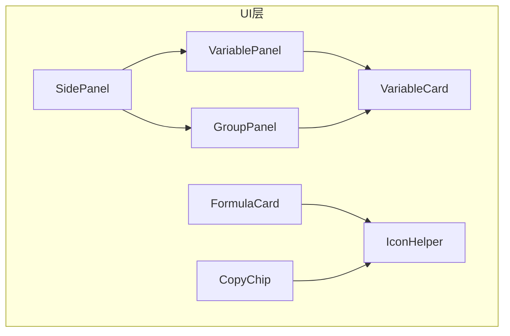
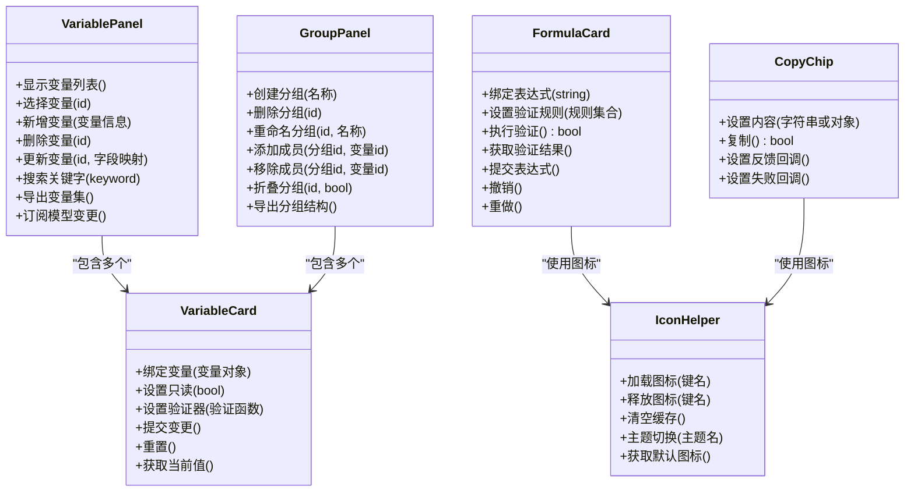
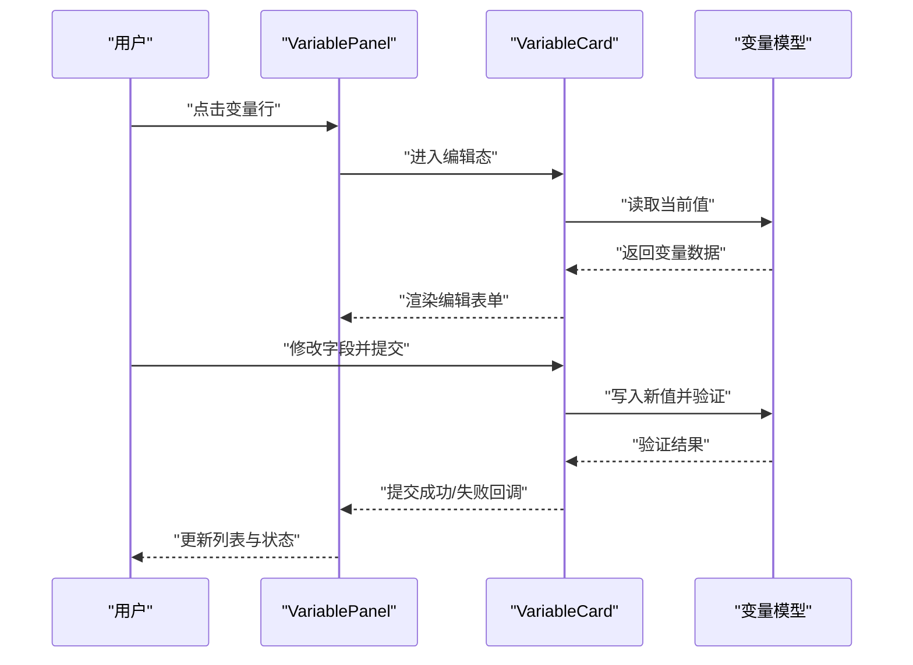
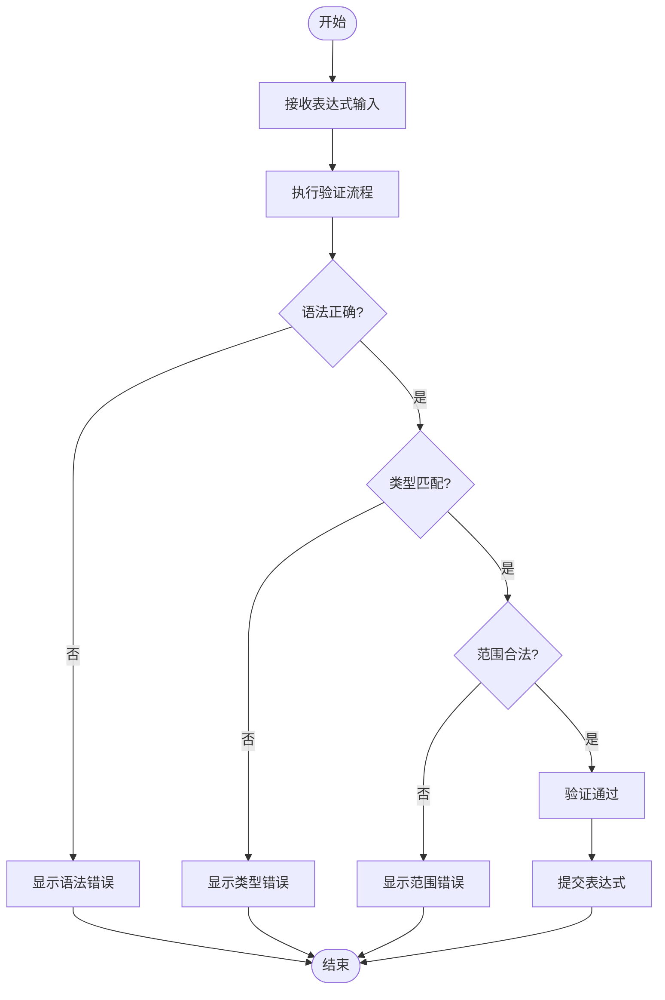
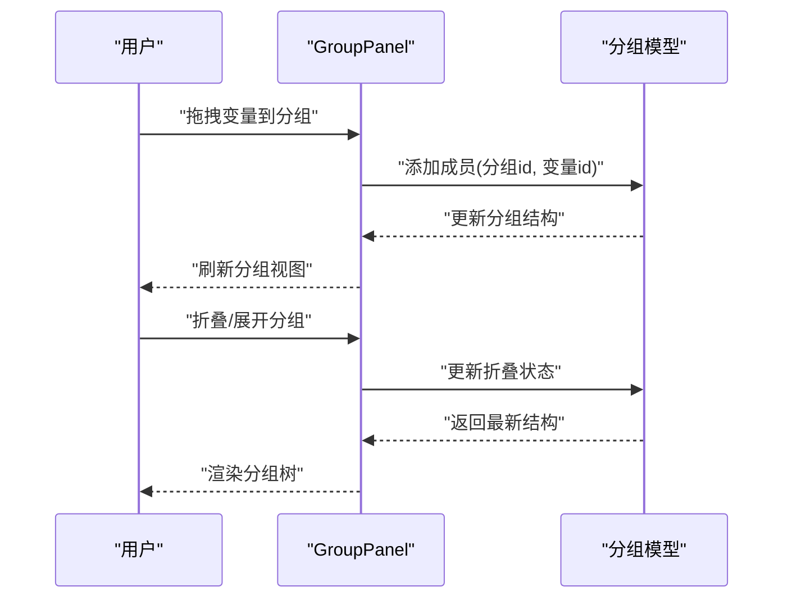
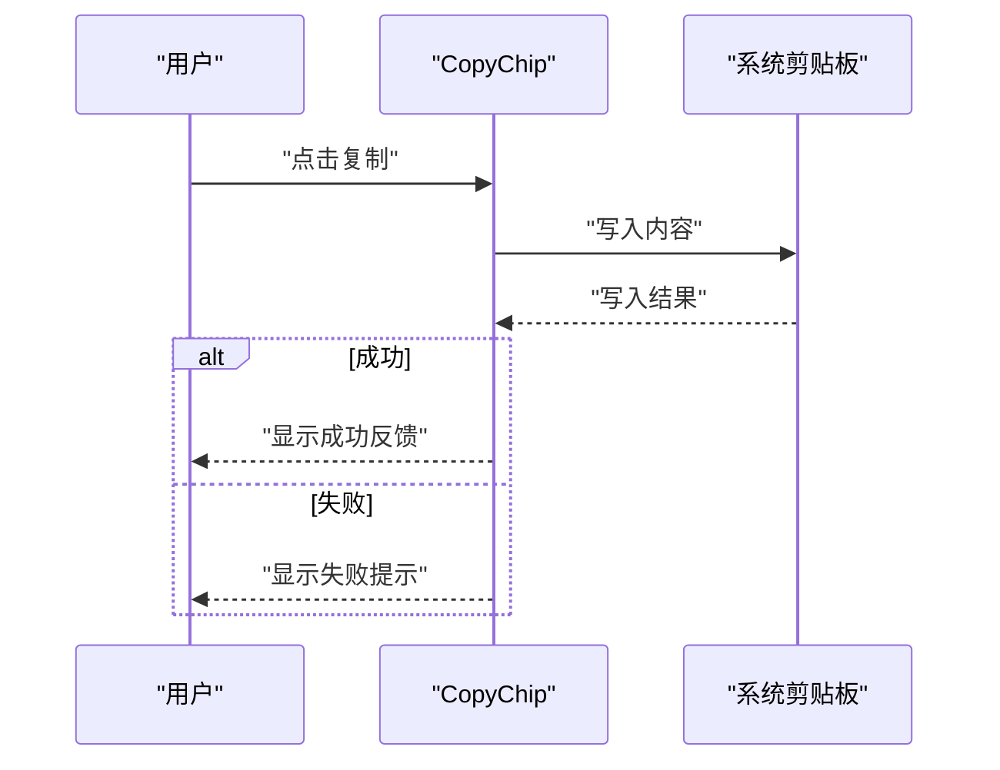
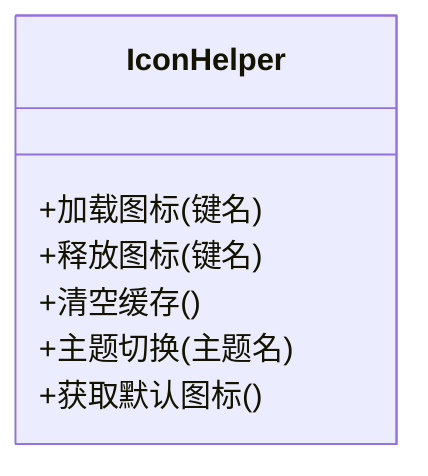
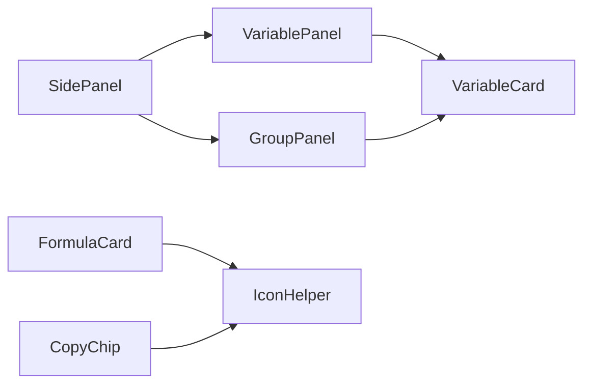

# UI组件API

<cite>
**本文引用的文件**
- [VariablePanel.h](file://src/ui/VariablePanel.h)
- [VariablePanel.cpp](file://src/ui/VariablePanel.cpp)
- [FormulaCard.h](file://src/ui/FormulaCard.h)
- [FormulaCard.cpp](file://src/ui/FormulaCard.cpp)
- [GroupPanel.h](file://src/ui/GroupPanel.h)
- [GroupPanel.cpp](file://src/ui/GroupPanel.cpp)
- [CopyChip.h](file://src/ui/CopyChip.h)
- [CopyChip.cpp](file://src/ui/CopyChip.cpp)
- [IconHelper.h](file://src/ui/IconHelper.h)
- [IconHelper.cpp](file://src/ui/IconHelper.cpp)
- [VariableCard.h](file://src/ui/VariableCard.h)
- [VariableCard.cpp](file://src/ui/VariableCard.cpp)
- [SidePanel.h](file://src/ui/SidePanel.h)
- [SidePanel.cpp](file://src/ui/SidePanel.cpp)
</cite>

## 目录
1. [简介](#简介)
2. [项目结构](#项目结构)
3. [核心组件](#核心组件)
4. [架构总览](#架构总览)
5. [详细组件分析](#详细组件分析)
6. [依赖分析](#依赖分析)
7. [性能考虑](#性能考虑)
8. [故障排查指南](#故障排查指南)
9. [结论](#结论)
10. [附录：自定义UI组件开发指南](#附录自定义ui组件开发指南)

## 简介
本文件面向服装CAD系统的UI层，系统化梳理并记录以下组件的API与使用方式：
- VariablePanel：变量显示与操作面板
- FormulaCard：公式编辑与验证卡片
- GroupPanel：组管理界面组件
- CopyChip：复制功能芯片
- IconHelper：图标管理工具

同时提供自定义UI组件开发指南（样式定制、事件处理、响应式设计），以及组件组合模式与数据绑定的最佳实践。

## 项目结构
UI相关代码位于 src/ui 目录，按功能模块划分头文件与实现文件，便于维护与扩展。核心UI组件包括：
- 变量面板与卡片：VariablePanel、VariableCard
- 公式卡片：FormulaCard
- 组管理面板：GroupPanel
- 复制芯片：CopyChip
- 图标工具：IconHelper
- 侧边容器：SidePanel

图表来源
- [VariablePanel.h](file://src/ui/VariablePanel.h)
- [VariablePanel.cpp](file://src/ui/VariablePanel.cpp)
- [VariableCard.h](file://src/ui/VariableCard.h)
- [VariableCard.cpp](file://src/ui/VariableCard.cpp)
- [FormulaCard.h](file://src/ui/FormulaCard.h)
- [FormulaCard.cpp](file://src/ui/FormulaCard.cpp)
- [GroupPanel.h](file://src/ui/GroupPanel.h)
- [GroupPanel.cpp](file://src/ui/GroupPanel.cpp)
- [CopyChip.h](file://src/ui/CopyChip.h)
- [CopyChip.cpp](file://src/ui/CopyChip.cpp)
- [IconHelper.h](file://src/ui/IconHelper.h)
- [IconHelper.cpp](file://src/ui/IconHelper.cpp)
- [SidePanel.h](file://src/ui/SidePanel.h)
- [SidePanel.cpp](file://src/ui/SidePanel.cpp)

章节来源
- [VariablePanel.h](file://src/ui/VariablePanel.h)
- [VariablePanel.cpp](file://src/ui/VariablePanel.cpp)
- [FormulaCard.h](file://src/ui/FormulaCard.h)
- [FormulaCard.cpp](file://src/ui/FormulaCard.cpp)
- [GroupPanel.h](file://src/ui/GroupPanel.h)
- [GroupPanel.cpp](file://src/ui/GroupPanel.cpp)
- [CopyChip.h](file://src/ui/CopyChip.h)
- [CopyChip.cpp](file://src/ui/CopyChip.cpp)
- [IconHelper.h](file://src/ui/IconHelper.h)
- [IconHelper.cpp](file://src/ui/IconHelper.cpp)
- [VariableCard.h](file://src/ui/VariableCard.h)
- [VariableCard.cpp](file://src/ui/VariableCard.cpp)
- [SidePanel.h](file://src/ui/SidePanel.h)
- [SidePanel.cpp](file://src/ui/SidePanel.cpp)

## 核心组件
本节概述各组件的职责与对外接口要点，帮助快速定位API位置与用法。

- VariablePanel
  - 职责：展示参数化变量列表，支持增删改查、批量操作、状态同步。
  - 关键能力：变量项渲染、选中态管理、与底层模型的数据绑定、错误提示。
  - 典型交互：点击变量行进入编辑；拖拽排序；右键菜单；搜索过滤。

- FormulaCard
  - 职责：单条公式的编辑与校验，提供即时反馈与错误定位。
  - 关键能力：表达式输入、语法高亮（可选）、实时验证、结果预览、撤销重做。
  - 典型交互：输入变更触发验证；非法表达式高亮；提交后回写模型。

- GroupPanel
  - 职责：变量分组管理与可视化组织。
  - 关键能力：创建/删除/重命名分组；成员增删；折叠展开；权限控制（可选）。
  - 典型交互：拖拽变量到分组；分组内排序；批量移动。

- CopyChip
  - 职责：轻量复制控件，支持文本或结构化数据的复制。
  - 关键能力：一键复制、复制成功反馈、剪贴板兼容性处理。
  - 典型交互：点击复制；失败重试；平台差异适配。

- IconHelper
  - 职责：集中管理图标资源与绘制逻辑。
  - 关键能力：图标加载、缓存、主题切换、尺寸适配。
  - 典型交互：通过键值获取图标；按需刷新；异常兜底。

章节来源
- [VariablePanel.h](file://src/ui/VariablePanel.h)
- [VariablePanel.cpp](file://src/ui/VariablePanel.cpp)
- [FormulaCard.h](file://src/ui/FormulaCard.h)
- [FormulaCard.cpp](file://src/ui/FormulaCard.cpp)
- [GroupPanel.h](file://src/ui/GroupPanel.h)
- [GroupPanel.cpp](file://src/ui/GroupPanel.cpp)
- [CopyChip.h](file://src/ui/CopyChip.h)
- [CopyChip.cpp](file://src/ui/CopyChip.cpp)
- [IconHelper.h](file://src/ui/IconHelper.h)
- [IconHelper.cpp](file://src/ui/IconHelper.cpp)

## 架构总览
UI层采用“面板-卡片”的组合模式，以数据驱动视图更新。VariablePanel与GroupPanel作为容器，VariableCard与FormulaCard作为可复用单元，IconHelper提供统一图标服务。

图表来源
- [VariablePanel.h](file://src/ui/VariablePanel.h)
- [VariablePanel.cpp](file://src/ui/VariablePanel.cpp)
- [VariableCard.h](file://src/ui/VariableCard.h)
- [VariableCard.cpp](file://src/ui/VariableCard.cpp)
- [FormulaCard.h](file://src/ui/FormulaCard.h)
- [FormulaCard.cpp](file://src/ui/FormulaCard.cpp)
- [GroupPanel.h](file://src/ui/GroupPanel.h)
- [GroupPanel.cpp](file://src/ui/GroupPanel.cpp)
- [CopyChip.h](file://src/ui/CopyChip.h)
- [CopyChip.cpp](file://src/ui/CopyChip.cpp)
- [IconHelper.h](file://src/ui/IconHelper.h)
- [IconHelper.cpp](file://src/ui/IconHelper.cpp)

## 详细组件分析

### VariablePanel：变量显示与操作接口
- 设计要点
  - 数据绑定：与变量模型保持双向同步，变更自动刷新。
  - 交互：单选/多选、搜索过滤、排序、分页（大数据量时）。
  - 错误处理：无效输入提示、冲突检测、恢复机制。
- 主要接口能力
  - 列表渲染与更新：根据模型增量更新，避免全量重绘。
  - 变量操作：新增、编辑、删除、批量移动至分组。
  - 状态管理：选中态、编辑态、只读态、禁用态。
  - 事件总线：对外暴露选择变更、编辑完成、删除确认等信号。
- 性能优化
  - 虚拟滚动（大列表）
  - 防抖搜索与去抖输入
  - 懒加载与按需渲染

图表来源
- [VariablePanel.h](file://src/ui/VariablePanel.h)
- [VariablePanel.cpp](file://src/ui/VariablePanel.cpp)
- [VariableCard.h](file://src/ui/VariableCard.h)
- [VariableCard.cpp](file://src/ui/VariableCard.cpp)

章节来源
- [VariablePanel.h](file://src/ui/VariablePanel.h)
- [VariablePanel.cpp](file://src/ui/VariablePanel.cpp)
- [VariableCard.h](file://src/ui/VariableCard.h)
- [VariableCard.cpp](file://src/ui/VariableCard.cpp)

### FormulaCard：公式编辑与验证API
- 设计要点
  - 表达式解析：支持基础运算、函数调用、变量引用。
  - 验证策略：语法检查、类型检查、范围约束、依赖解析。
  - 用户体验：即时反馈、错误定位、撤销重做、历史版本。
- 主要接口能力
  - 绑定表达式与验证规则
  - 执行验证并返回结果
  - 提交表达式并回写模型
  - 撤销/重做栈管理
- 错误处理
  - 语法错误分类（词法、语义）
  - 运行时错误（除零、越界）
  - 用户提示与修复建议

图表来源
- [FormulaCard.h](file://src/ui/FormulaCard.h)
- [FormulaCard.cpp](file://src/ui/FormulaCard.cpp)

章节来源
- [FormulaCard.h](file://src/ui/FormulaCard.h)
- [FormulaCard.cpp](file://src/ui/FormulaCard.cpp)

### GroupPanel：组管理界面组件接口
- 设计要点
  - 分组树形结构：支持多级分组与折叠展开。
  - 成员管理：拖拽增删、批量操作、冲突解决。
  - 权限控制：只读/编辑/管理员角色。
- 主要接口能力
  - 分组CRUD：创建、删除、重命名、查询
  - 成员管理：添加、移除、排序、迁移
  - 状态同步：折叠态、选中态、可见性
  - 导出导入：分组结构与成员关系序列化

图表来源
- [GroupPanel.h](file://src/ui/GroupPanel.h)
- [GroupPanel.cpp](file://src/ui/GroupPanel.cpp)

章节来源
- [GroupPanel.h](file://src/ui/GroupPanel.h)
- [GroupPanel.cpp](file://src/ui/GroupPanel.cpp)

### CopyChip：复制功能
- 设计要点
  - 跨平台兼容：Windows/macOS/Linux剪贴板差异处理
  - 反馈机制：成功提示、失败重试、超时处理
  - 数据安全：敏感信息脱敏、格式校验
- 主要接口能力
  - 设置内容（字符串或结构化对象）
  - 执行复制并返回结果
  - 注册成功/失败回调
  - 主题与尺寸适配

图表来源
- [CopyChip.h](file://src/ui/CopyChip.h)
- [CopyChip.cpp](file://src/ui/CopyChip.cpp)

章节来源
- [CopyChip.h](file://src/ui/CopyChip.h)
- [CopyChip.cpp](file://src/ui/CopyChip.cpp)

### IconHelper：图标管理API
- 设计要点
  - 资源管理：图标加载、缓存、释放
  - 主题支持：多主题切换、动态替换
  - 性能优化：懒加载、预加载、内存回收
- 主要接口能力
  - 加载图标（键名）
  - 释放图标（键名）
  - 清空缓存
  - 主题切换
  - 获取默认图标

图表来源
- [IconHelper.h](file://src/ui/IconHelper.h)
- [IconHelper.cpp](file://src/ui/IconHelper.cpp)

章节来源
- [IconHelper.h](file://src/ui/IconHelper.h)
- [IconHelper.cpp](file://src/ui/IconHelper.cpp)

## 依赖分析
组件间依赖关系清晰，遵循单一职责与低耦合原则：
- VariablePanel与GroupPanel依赖VariableCard进行单项渲染
- FormulaCard与CopyChip依赖IconHelper提供图标资源
- SidePanel作为容器承载VariablePanel与GroupPanel

图表来源
- [SidePanel.h](file://src/ui/SidePanel.h)
- [SidePanel.cpp](file://src/ui/SidePanel.cpp)
- [VariablePanel.h](file://src/ui/VariablePanel.h)
- [VariablePanel.cpp](file://src/ui/VariablePanel.cpp)
- [GroupPanel.h](file://src/ui/GroupPanel.h)
- [GroupPanel.cpp](file://src/ui/GroupPanel.cpp)
- [VariableCard.h](file://src/ui/VariableCard.h)
- [VariableCard.cpp](file://src/ui/VariableCard.cpp)
- [FormulaCard.h](file://src/ui/FormulaCard.h)
- [FormulaCard.cpp](file://src/ui/FormulaCard.cpp)
- [CopyChip.h](file://src/ui/CopyChip.h)
- [CopyChip.cpp](file://src/ui/CopyChip.cpp)
- [IconHelper.h](file://src/ui/IconHelper.h)
- [IconHelper.cpp](file://src/ui/IconHelper.cpp)

章节来源
- [SidePanel.h](file://src/ui/SidePanel.h)
- [SidePanel.cpp](file://src/ui/SidePanel.cpp)
- [VariablePanel.h](file://src/ui/VariablePanel.h)
- [VariablePanel.cpp](file://src/ui/VariablePanel.cpp)
- [GroupPanel.h](file://src/ui/GroupPanel.h)
- [GroupPanel.cpp](file://src/ui/GroupPanel.cpp)
- [VariableCard.h](file://src/ui/VariableCard.h)
- [VariableCard.cpp](file://src/ui/VariableCard.cpp)
- [FormulaCard.h](file://src/ui/FormulaCard.h)
- [FormulaCard.cpp](file://src/ui/FormulaCard.cpp)
- [CopyChip.h](file://src/ui/CopyChip.h)
- [CopyChip.cpp](file://src/ui/CopyChip.cpp)
- [IconHelper.h](file://src/ui/IconHelper.h)
- [IconHelper.cpp](file://src/ui/IconHelper.cpp)

## 性能考虑
- 列表渲染优化：VariablePanel在大数据量场景下建议使用虚拟滚动与增量更新。
- 输入防抖：FormulaCard与VariableCard对高频输入进行防抖处理，减少验证开销。
- 图标缓存：IconHelper对已加载图标进行内存缓存，避免重复I/O。
- 异步操作：CopyChip的剪贴板操作应异步执行，避免阻塞UI线程。
- 内存管理：及时释放不再使用的图标与临时对象，防止内存泄漏。

## 故障排查指南
- 变量面板无响应
  - 检查数据绑定是否正确
  - 确认模型变更信号是否发出
  - 查看控制台错误日志
- 公式验证失败
  - 验证表达式语法与类型
  - 检查变量依赖是否存在
  - 查看验证规则配置
- 复制功能异常
  - 检查剪贴板权限
  - 确认内容格式合法性
  - 重试机制是否生效
- 图标显示异常
  - 检查图标键名是否正确
  - 确认主题资源路径
  - 清理图标缓存后重试

章节来源
- [VariablePanel.h](file://src/ui/VariablePanel.h)
- [VariablePanel.cpp](file://src/ui/VariablePanel.cpp)
- [FormulaCard.h](file://src/ui/FormulaCard.h)
- [FormulaCard.cpp](file://src/ui/FormulaCard.cpp)
- [CopyChip.h](file://src/ui/CopyChip.h)
- [CopyChip.cpp](file://src/ui/CopyChip.cpp)
- [IconHelper.h](file://src/ui/IconHelper.h)
- [IconHelper.cpp](file://src/ui/IconHelper.cpp)

## 结论
本文档系统梳理了服装CAD系统UI层核心组件的API与设计模式，涵盖变量面板、公式卡片、组管理、复制功能与图标管理。通过清晰的架构图与流程图，帮助开发者快速理解组件职责与交互流程。结合性能优化与故障排查建议，为高质量UI开发提供了实用指导。

## 附录：自定义UI组件开发指南

### 样式定制
- 主题系统：通过IconHelper实现主题切换，支持动态资源替换。
- 样式分离：将样式与逻辑解耦，便于维护与测试。
- 响应式布局：使用弹性布局与自适应尺寸，适配不同屏幕密度。

### 事件处理
- 事件冒泡：合理设计事件传播机制，避免不必要的处理。
- 事件节流：对高频事件进行节流处理，提升性能。
- 错误捕获：全局错误捕获与用户友好提示。

### 响应式设计
- 断点管理：定义合理的断点策略，适配桌面与移动端。
- 内容优先级：在小屏设备上优先显示核心内容。
- 交互优化：触摸友好的交互设计与手势支持。

### 组件组合模式
- 容器组件：如VariablePanel、GroupPanel负责布局与状态管理。
- 展示组件：如VariableCard、FormulaCard专注于数据展示与交互。
- 工具组件：如IconHelper、CopyChip提供通用能力。

### 数据绑定最佳实践
- 单向数据流：明确数据流向，避免循环依赖。
- 不可变更新：使用不可变数据结构，便于状态比较与撤销。
- 增量更新：仅更新变化部分，提升渲染性能。
- 错误边界：在数据绑定层捕获并处理异常，保证稳定性。

章节来源
- [VariablePanel.h](file://src/ui/VariablePanel.h)
- [VariablePanel.cpp](file://src/ui/VariablePanel.cpp)
- [FormulaCard.h](file://src/ui/FormulaCard.h)
- [FormulaCard.cpp](file://src/ui/FormulaCard.cpp)
- [GroupPanel.h](file://src/ui/GroupPanel.h)
- [GroupPanel.cpp](file://src/ui/GroupPanel.cpp)
- [CopyChip.h](file://src/ui/CopyChip.h)
- [CopyChip.cpp](file://src/ui/CopyChip.cpp)
- [IconHelper.h](file://src/ui/IconHelper.h)
- [IconHelper.cpp](file://src/ui/IconHelper.cpp)
- [VariableCard.h](file://src/ui/VariableCard.h)
- [VariableCard.cpp](file://src/ui/VariableCard.cpp)
- [SidePanel.h](file://src/ui/SidePanel.h)
- [SidePanel.cpp](file://src/ui/SidePanel.cpp)