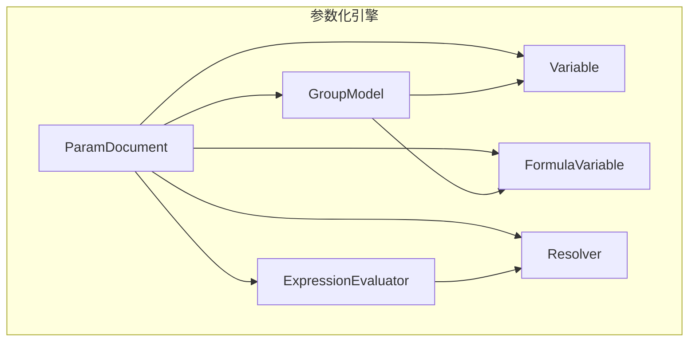
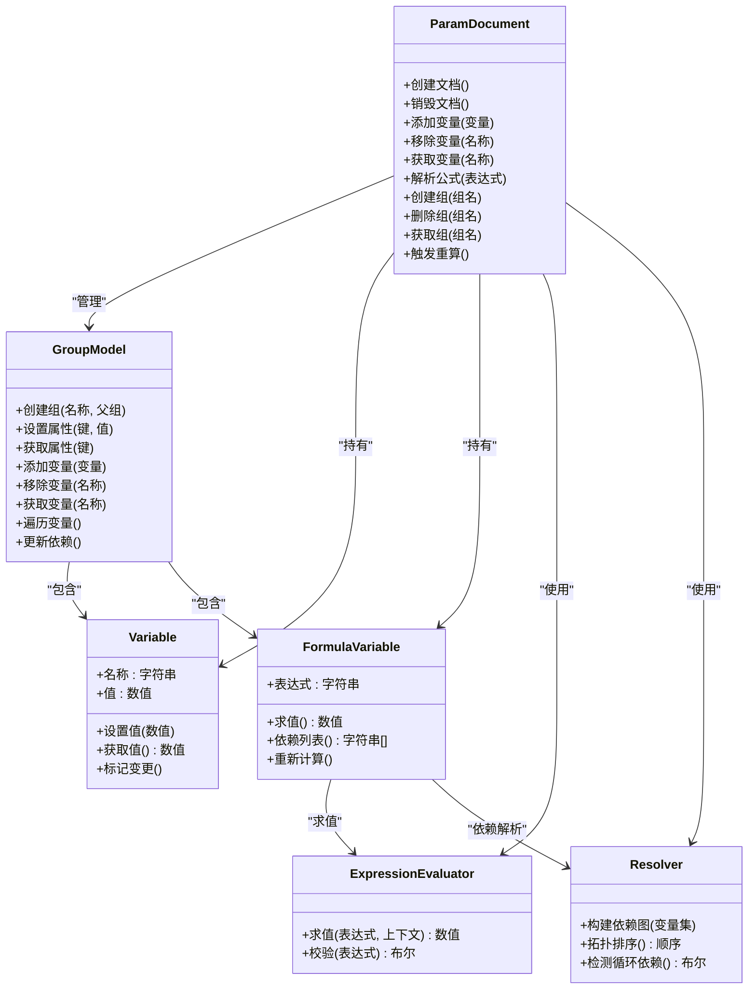
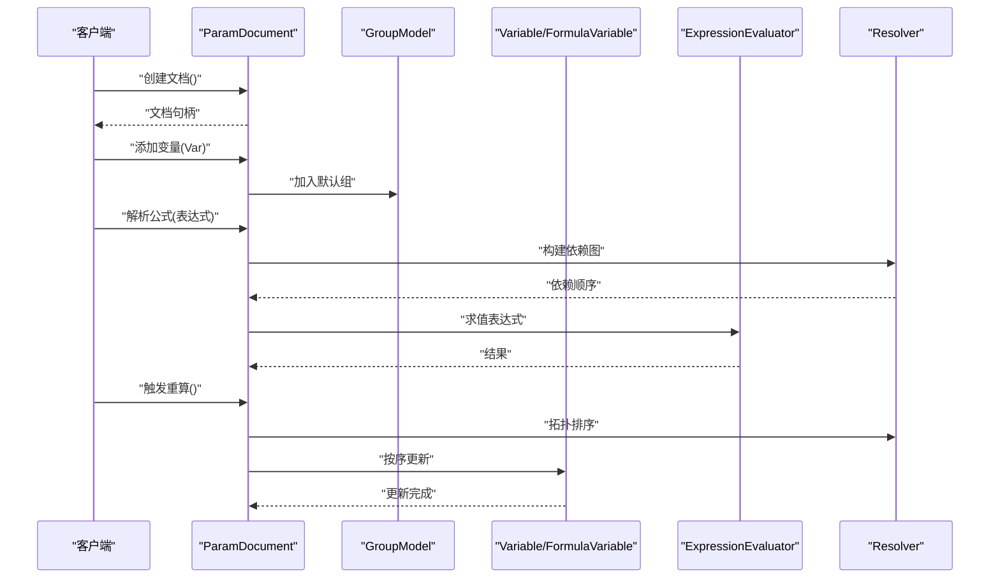
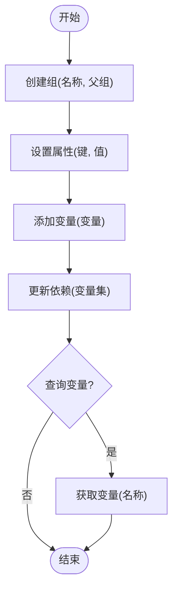
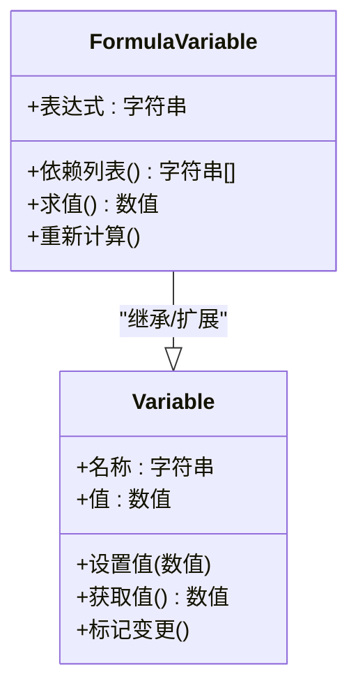
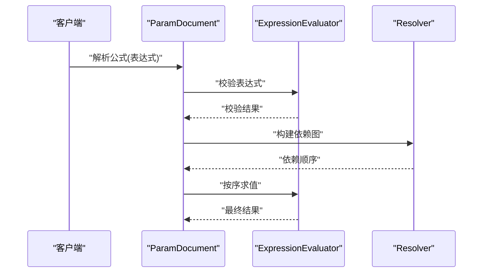
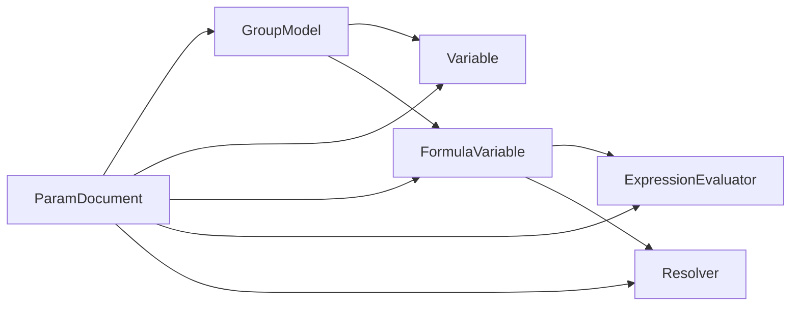

# 参数化API

<cite>
**本文引用的文件**   
- [ParamDocument.h](file://src/parametric/ParamDocument.h)
- [ParamDocument.cpp](file://src/parametric/ParamDocument.cpp)
- [GroupModel.h](file://src/parametric/GroupModel.h)
- [GroupModel.cpp](file://src/parametric/GroupModel.cpp)
- [Variable.h](file://src/parametric/Variable.h)
- [FormulaVariable.h](file://src/parametric/FormulaVariable.h)
- [ExpressionEvaluator.h](file://src/parametric/ExpressionEvaluator.h)
- [ExpressionEvaluator.cpp](file://src/parametric/ExpressionEvaluator.cpp)
- [Resolver.h](file://src/parametric/Resolver.h)
- [Resolver.cpp](file://src/parametric/Resolver.cpp)
</cite>

## 目录
1. [简介](#简介)
2. [项目结构](#项目结构)
3. [核心组件](#核心组件)
4. [架构总览](#架构总览)
5. [详细组件分析](#详细组件分析)
6. [依赖关系分析](#依赖关系分析)
7. [性能考虑](#性能考虑)
8. [故障排查指南](#故障排查指南)
9. [结论](#结论)
10. [附录](#附录)

## 简介
本文件为服装CAD系统的参数化引擎提供详细的API文档，聚焦以下目标：
- ParamDocument类的公共接口：文档创建、变量管理、公式解析与组操作。
- GroupModel的API：组的创建、管理与属性设置。
- Variable与FormulaVariable的数据结构与操作方法。
- 参数验证、依赖关系解析与表达式求值的API调用示例。
- 错误处理策略与性能优化建议。

该文档面向开发者与集成者，既提供高层概览，也给出代码级细节与图示，帮助快速理解并正确使用参数化引擎。

## 项目结构
参数化引擎位于 src/parametric 目录，核心文件包括：
- 文档与模型：ParamDocument、GroupModel
- 变量与公式：Variable、FormulaVariable
- 表达式与依赖：ExpressionEvaluator、Resolver
- 其他辅助：Attachment、Block、ConditionEngine、Serial等（不在本次API范围）

图表来源
- [ParamDocument.h](file://src/parametric/ParamDocument.h)
- [GroupModel.h](file://src/parametric/GroupModel.h)
- [Variable.h](file://src/parametric/Variable.h)
- [FormulaVariable.h](file://src/parametric/FormulaVariable.h)
- [ExpressionEvaluator.h](file://src/parametric/ExpressionEvaluator.h)
- [Resolver.h](file://src/parametric/Resolver.h)

章节来源
- [ParamDocument.h](file://src/parametric/ParamDocument.h)
- [GroupModel.h](file://src/parametric/GroupModel.h)
- [Variable.h](file://src/parametric/Variable.h)
- [FormulaVariable.h](file://src/parametric/FormulaVariable.h)
- [ExpressionEvaluator.h](file://src/parametric/ExpressionEvaluator.h)
- [Resolver.h](file://src/parametric/Resolver.h)

## 核心组件
- ParamDocument：参数化文档的入口，负责变量注册、公式解析、组管理与生命周期控制。
- GroupModel：表示一个逻辑分组，包含变量集合、属性与依赖图维护。
- Variable：基础变量类型，承载名称、值与基本元数据。
- FormulaVariable：基于表达式的变量，支持依赖解析与表达式求值。
- ExpressionEvaluator：表达式求值器，将字符串表达式转换为可计算结果。
- Resolver：依赖解析器，构建变量间的依赖图并进行拓扑排序。

章节来源
- [ParamDocument.h](file://src/parametric/ParamDocument.h)
- [GroupModel.h](file://src/parametric/GroupModel.h)
- [Variable.h](file://src/parametric/Variable.h)
- [FormulaVariable.h](file://src/parametric/FormulaVariable.h)
- [ExpressionEvaluator.h](file://src/parametric/ExpressionEvaluator.h)
- [Resolver.h](file://src/parametric/Resolver.h)

## 架构总览
参数化引擎采用“文档-组-变量”的分层设计：
- ParamDocument作为顶层容器，协调多个GroupModel与变量集合。
- GroupModel管理一组相关变量，维护局部依赖与属性。
- Variable与FormulaVariable构成变量体系，后者通过ExpressionEvaluator与Resolver实现动态求值与依赖更新。

图表来源
- [ParamDocument.h](file://src/parametric/ParamDocument.h)
- [GroupModel.h](file://src/parametric/GroupModel.h)
- [Variable.h](file://src/parametric/Variable.h)
- [FormulaVariable.h](file://src/parametric/FormulaVariable.h)
- [ExpressionEvaluator.h](file://src/parametric/ExpressionEvaluator.h)
- [Resolver.h](file://src/parametric/Resolver.h)

## 详细组件分析

### ParamDocument API
- 文档创建与销毁
  - 创建：初始化内部状态、默认组与变量容器。
  - 销毁：释放资源、清理依赖图与缓存。
- 变量管理
  - 添加/移除变量：支持命名空间隔离与冲突检查。
  - 获取变量：按名称查找，返回引用或空指针。
- 公式解析
  - 解析表达式：校验语法、构建依赖、缓存求值结果。
  - 触发重算：当变量变更时，按依赖顺序更新相关公式变量。
- 组操作
  - 创建/删除/获取组：维护组层次结构与变量归属。
  - 批量操作：对组内变量进行统一更新或查询。

图表来源
- [ParamDocument.h](file://src/parametric/ParamDocument.h)
- [ParamDocument.cpp](file://src/parametric/ParamDocument.cpp)
- [GroupModel.h](file://src/parametric/GroupModel.h)
- [ExpressionEvaluator.h](file://src/parametric/ExpressionEvaluator.h)
- [Resolver.h](file://src/parametric/Resolver.h)

章节来源
- [ParamDocument.h](file://src/parametric/ParamDocument.h)
- [ParamDocument.cpp](file://src/parametric/ParamDocument.cpp)

### GroupModel API
- 组的创建与管理
  - 创建组：指定名称与可选父组，建立层级关系。
  - 删除组：递归清理子组与变量引用。
  - 获取组：按路径或名称定位。
- 属性设置与读取
  - 设置属性：键值对形式，支持类型约束与默认值。
  - 获取属性：按键查询，缺失时返回默认或空。
- 变量管理
  - 添加/移除变量：维护组内变量集合与索引。
  - 遍历变量：迭代访问组内所有变量。
- 依赖更新
  - 更新依赖：在变量变更时重建局部依赖图。

图表来源
- [GroupModel.h](file://src/parametric/GroupModel.h)
- [GroupModel.cpp](file://src/parametric/GroupModel.cpp)

章节来源
- [GroupModel.h](file://src/parametric/GroupModel.h)
- [GroupModel.cpp](file://src/parametric/GroupModel.cpp)

### Variable 与 FormulaVariable 数据结构与方法
- Variable
  - 字段：名称、值、元数据（如单位、精度）。
  - 方法：设置值、获取值、标记变更。
- FormulaVariable
  - 字段：表达式、依赖列表、缓存结果。
  - 方法：求值、依赖列表、重新计算。

图表来源
- [Variable.h](file://src/parametric/Variable.h)
- [FormulaVariable.h](file://src/parametric/FormulaVariable.h)

章节来源
- [Variable.h](file://src/parametric/Variable.h)
- [FormulaVariable.h](file://src/parametric/FormulaVariable.h)

### 表达式求值与依赖解析
- ExpressionEvaluator
  - 功能：将表达式字符串解析为可执行结构，并在给定上下文中求值。
  - 接口：求值、校验。
- Resolver
  - 功能：根据变量依赖构建有向无环图，进行拓扑排序与循环依赖检测。
  - 接口：构建依赖图、拓扑排序、检测循环依赖。

图表来源
- [ExpressionEvaluator.h](file://src/parametric/ExpressionEvaluator.h)
- [ExpressionEvaluator.cpp](file://src/parametric/ExpressionEvaluator.cpp)
- [Resolver.h](file://src/parametric/Resolver.h)
- [Resolver.cpp](file://src/parametric/Resolver.cpp)

章节来源
- [ExpressionEvaluator.h](file://src/parametric/ExpressionEvaluator.h)
- [ExpressionEvaluator.cpp](file://src/parametric/ExpressionEvaluator.cpp)
- [Resolver.h](file://src/parametric/Resolver.h)
- [Resolver.cpp](file://src/parametric/Resolver.cpp)

## 依赖关系分析
- 组件耦合
  - ParamDocument强依赖GroupModel、Variable、FormulaVariable、ExpressionEvaluator与Resolver。
  - GroupModel弱依赖Variable与FormulaVariable，便于扩展新变量类型。
- 外部依赖
  - 表达式求值可能依赖数学库或自定义函数注册机制。
  - 依赖解析需高效图算法实现。
- 潜在循环依赖
  - 通过Resolver的检测机制避免变量间循环依赖。

图表来源
- [ParamDocument.h](file://src/parametric/ParamDocument.h)
- [GroupModel.h](file://src/parametric/GroupModel.h)
- [Variable.h](file://src/parametric/Variable.h)
- [FormulaVariable.h](file://src/parametric/FormulaVariable.h)
- [ExpressionEvaluator.h](file://src/parametric/ExpressionEvaluator.h)
- [Resolver.h](file://src/parametric/Resolver.h)

章节来源
- [ParamDocument.h](file://src/parametric/ParamDocument.h)
- [GroupModel.h](file://src/parametric/GroupModel.h)
- [Variable.h](file://src/parametric/Variable.h)
- [FormulaVariable.h](file://src/parametric/FormulaVariable.h)
- [ExpressionEvaluator.h](file://src/parametric/ExpressionEvaluator.h)
- [Resolver.h](file://src/parametric/Resolver.h)

## 性能考虑
- 表达式求值缓存
  - 对FormulaVariable的结果进行缓存，仅在依赖变化时重新计算。
- 依赖图增量更新
  - 使用增量拓扑排序减少全量重算开销。
- 批量操作优化
  - 对组内变量的批量更新合并为一次依赖重建。
- 内存管理
  - 及时释放不再使用的变量与组，避免内存泄漏。
- 线程安全
  - 在多线程环境下对共享状态加锁或使用无锁数据结构。

[本节为通用指导，不直接分析具体文件]

## 故障排查指南
- 常见错误
  - 表达式语法错误：检查表达式合法性与函数可用性。
  - 循环依赖：查看依赖图是否存在环，调整变量定义顺序。
  - 变量未定义：确保表达式中引用的变量已注册。
- 调试建议
  - 启用详细日志输出，记录依赖解析与求值过程。
  - 使用最小化用例复现问题，逐步缩小范围。
- 恢复策略
  - 回滚到上一个稳定状态，修复后重新应用变更。

章节来源
- [ExpressionEvaluator.h](file://src/parametric/ExpressionEvaluator.h)
- [Resolver.h](file://src/parametric/Resolver.h)

## 结论
本API文档系统性地介绍了服装CAD系统参数化引擎的核心组件与接口，涵盖ParamDocument、GroupModel、Variable、FormulaVariable、ExpressionEvaluator与Resolver。通过清晰的架构图、序列图与流程图，帮助开发者快速理解并正确使用这些接口。同时提供了性能优化与故障排查建议，确保在实际项目中稳定高效地运行。

[本节为总结性内容，不直接分析具体文件]

## 附录
- 术语表
  - 变量：可被表达式引用的基本数据单元。
  - 公式变量：基于表达式动态计算的变量。
  - 依赖图：变量间依赖关系的有向图。
  - 拓扑排序：依赖图的线性化顺序，用于确定计算次序。
- 参考文件
  - 所有API定义与实现均位于src/paramatic目录下，详见各文件源码。

[本节为补充信息，不直接分析具体文件]