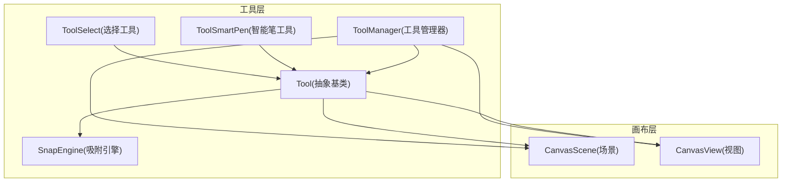
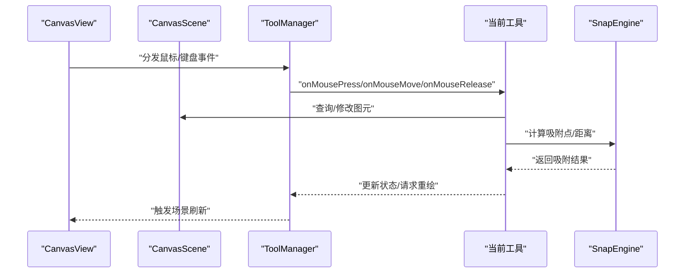
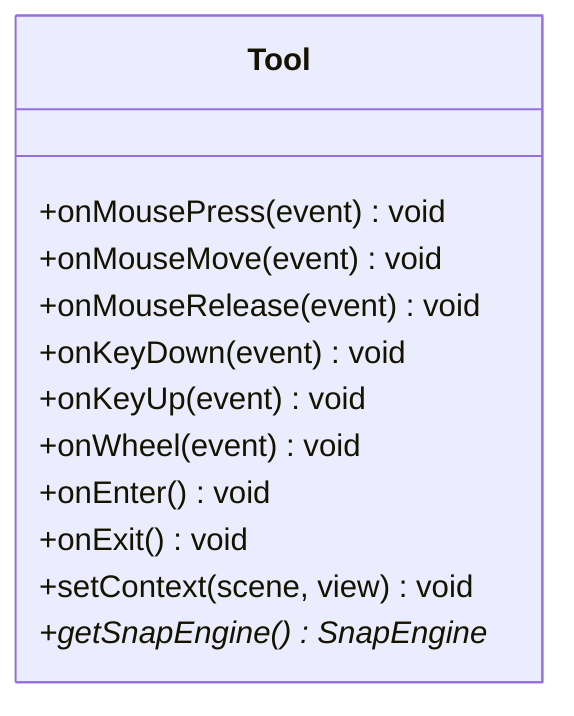
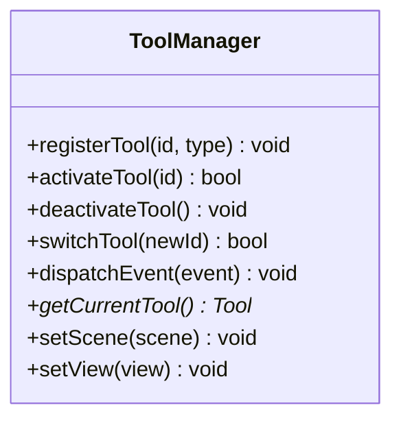
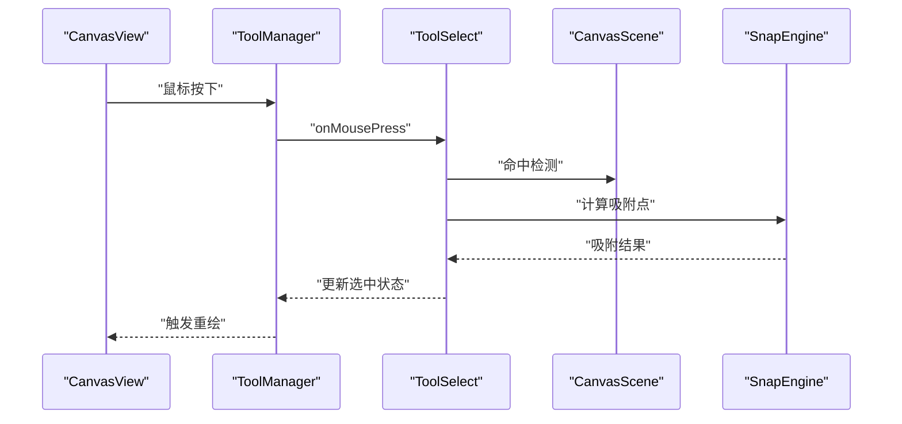
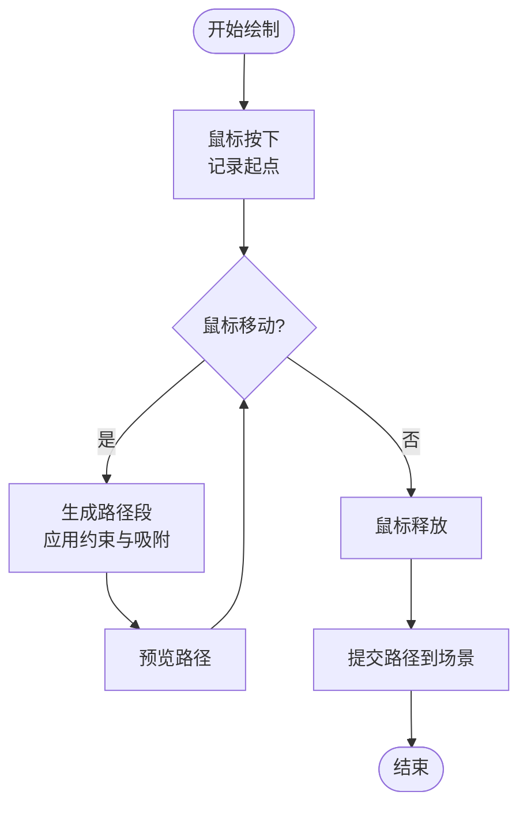
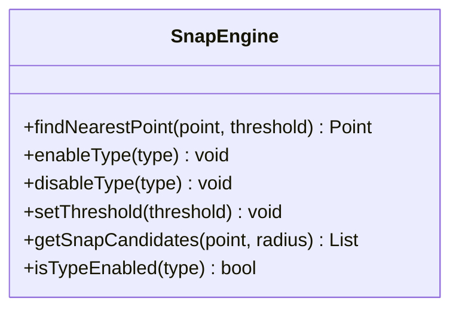
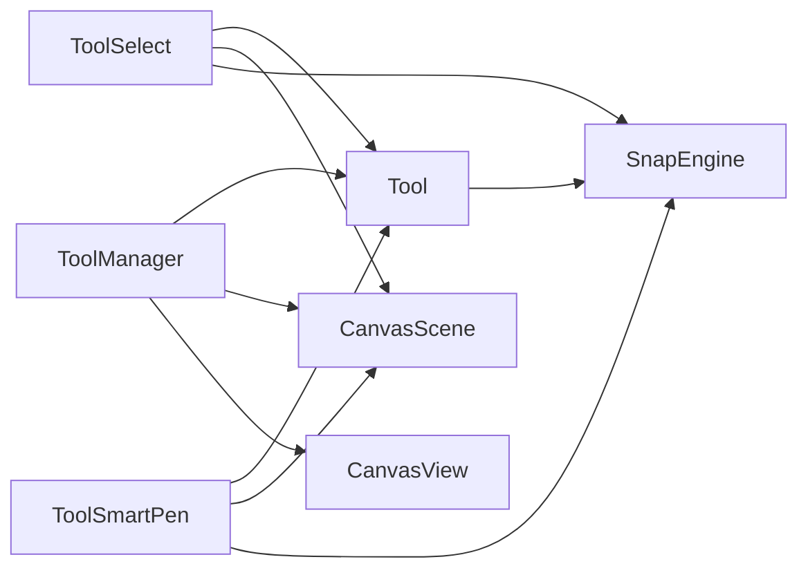

# 工具API

<cite>
**本文档引用的文件**   
- [Tool.h](file://src/tools/Tool.h)
- [ToolManager.h](file://src/tools/ToolManager.h)
- [ToolManager.cpp](file://src/tools/ToolManager.cpp)
- [ToolSelect.h](file://src/tools/ToolSelect.h)
- [ToolSelect.cpp](file://src/tools/ToolSelect.cpp)
- [ToolSmartPen.h](file://src/tools/ToolSmartPen.h)
- [ToolSmartPen.cpp](file://src/tools/ToolSmartPen.cpp)
- [SnapEngine.h](file://src/tools/SnapEngine.h)
- [SnapEngine.cpp](file://src/tools/SnapEngine.cpp)
- [CanvasScene.h](file://src/canvas/CanvasScene.h)
- [CanvasView.h](file://src/canvas/CanvasView.h)
</cite>

## 目录
1. [简介](#简介)
2. [项目结构](#项目结构)
3. [核心组件](#核心组件)
4. [架构总览](#架构总览)
5. [详细组件分析](#详细组件分析)
6. [依赖关系分析](#依赖关系分析)
7. [性能考虑](#性能考虑)
8. [故障排查指南](#故障排查指南)
9. [结论](#结论)
10. [附录](#附录)

## 简介
本文件为服装CAD系统的“工具系统”提供完整的API文档，覆盖以下方面：
- ToolManager的工具注册、激活与管理接口
- Tool基类的抽象接口与实现要求
- ToolSelect选择工具与ToolSmartPen智能笔工具的特定API
- SnapEngine的吸附功能与配置选项
- 自定义工具开发完整指南（生命周期、事件处理、与画布集成）
- 工具扩展最佳实践与性能优化建议

## 项目结构
工具系统位于 src/tools 目录下，核心文件包括：
- Tool.h：定义工具基类抽象接口
- ToolManager.{h,cpp}：工具管理器，负责注册、激活、切换与生命周期管理
- ToolSelect.{h,cpp}：选择工具实现
- ToolSmartPen.{h,cpp}：智能笔工具实现
- SnapEngine.{h,cpp}：吸附引擎，提供几何吸附能力

**图示来源**
- [Tool.h](file://src/tools/Tool.h)
- [ToolManager.h](file://src/tools/ToolManager.h)
- [ToolManager.cpp](file://src/tools/ToolManager.cpp)
- [ToolSelect.h](file://src/tools/ToolSelect.h)
- [ToolSelect.cpp](file://src/tools/ToolSelect.cpp)
- [ToolSmartPen.h](file://src/tools/ToolSmartPen.h)
- [ToolSmartPen.cpp](file://src/tools/ToolSmartPen.cpp)
- [SnapEngine.h](file://src/tools/SnapEngine.h)
- [SnapEngine.cpp](file://src/tools/SnapEngine.cpp)
- [CanvasScene.h](file://src/canvas/CanvasScene.h)
- [CanvasView.h](file://src/canvas/CanvasView.h)

**章节来源**
- [Tool.h](file://src/tools/Tool.h)
- [ToolManager.h](file://src/tools/ToolManager.h)
- [ToolManager.cpp](file://src/tools/ToolManager.cpp)
- [ToolSelect.h](file://src/tools/ToolSelect.h)
- [ToolSelect.cpp](file://src/tools/ToolSelect.cpp)
- [ToolSmartPen.h](file://src/tools/ToolSmartPen.h)
- [ToolSmartPen.cpp](file://src/tools/ToolSmartPen.cpp)
- [SnapEngine.h](file://src/tools/SnapEngine.h)
- [SnapEngine.cpp](file://src/tools/SnapEngine.cpp)
- [CanvasScene.h](file://src/canvas/CanvasScene.h)
- [CanvasView.h](file://src/canvas/CanvasView.h)

## 核心组件
本节概述工具系统的核心组件及其职责：
- Tool：所有工具的抽象基类，定义统一的事件回调与生命周期钩子
- ToolManager：集中管理工具实例的注册、激活、切换与销毁
- ToolSelect：用于选择、移动、缩放与编辑图元的选择工具
- ToolSmartPen：智能笔工具，支持智能绘制、约束与自动吸附
- SnapEngine：吸附引擎，提供点、线、端点、中点等吸附能力与阈值配置

**章节来源**
- [Tool.h](file://src/tools/Tool.h)
- [ToolManager.h](file://src/tools/ToolManager.h)
- [ToolManager.cpp](file://src/tools/ToolManager.cpp)
- [ToolSelect.h](file://src/tools/ToolSelect.h)
- [ToolSelect.cpp](file://src/tools/ToolSelect.cpp)
- [ToolSmartPen.h](file://src/tools/ToolSmartPen.h)
- [ToolSmartPen.cpp](file://src/tools/ToolSmartPen.cpp)
- [SnapEngine.h](file://src/tools/SnapEngine.h)
- [SnapEngine.cpp](file://src/tools/SnapEngine.cpp)

## 架构总览
工具系统与画布层的交互遵循“事件驱动 + 职责分离”的架构模式：
- 输入事件由 CanvasView 捕获并转发给当前激活的 Tool
- Tool 通过 ToolManager 获取上下文（如 CanvasScene），进行图元操作
- SnapEngine 在 Tool 内部或 ToolManager 层面被调用，提供吸附计算
- 工具之间通过 ToolManager 进行状态切换与资源协调

**图示来源**
- [CanvasView.h](file://src/canvas/CanvasView.h)
- [CanvasScene.h](file://src/canvas/CanvasScene.h)
- [ToolManager.h](file://src/tools/ToolManager.h)
- [ToolManager.cpp](file://src/tools/ToolManager.cpp)
- [Tool.h](file://src/tools/Tool.h)
- [SnapEngine.h](file://src/tools/SnapEngine.h)
- [SnapEngine.cpp](file://src/tools/SnapEngine.cpp)

## 详细组件分析

### Tool 基类（抽象接口与实现要求）
- 设计目标：为所有工具提供统一的抽象接口，确保事件处理、生命周期管理与画布交互的一致性
- 关键职责：
  - 定义鼠标、键盘、滚轮等事件回调
  - 提供 onEnter/onExit 等生命周期钩子
  - 暴露与 CanvasScene/CanvasView 的交互方法
  - 与 SnapEngine 集成以支持吸附
- 实现要求：
  - 子类必须实现必要的事件回调（如按下、移动、释放）
  - 避免在回调中进行耗时计算，必要时异步或延迟处理
  - 保持工具状态的可恢复性，便于撤销/重做
  - 正确处理坐标变换（屏幕坐标与场景坐标转换）

**图示来源**
- [Tool.h](file://src/tools/Tool.h)

**章节来源**
- [Tool.h](file://src/tools/Tool.h)

### ToolManager（工具注册、激活与管理）
- 设计目标：集中管理工具的生命周期与切换逻辑，保证同一时刻仅有一个活跃工具
- 关键接口：
  - 注册工具：将具体工具类与标识符绑定
  - 激活工具：根据标识符激活指定工具
  - 切换工具：安全地退出当前工具并进入新工具
  - 事件分发：将输入事件转发给当前激活工具
  - 上下文注入：向工具注入 CanvasScene/CanvasView 引用
- 注意事项：
  - 工具注册应在应用启动阶段完成
  - 激活前需校验工具是否存在且可激活
  - 切换时需清理旧工具状态，初始化新工具环境

**图示来源**
- [ToolManager.h](file://src/tools/ToolManager.h)
- [ToolManager.cpp](file://src/tools/ToolManager.cpp)

**章节来源**
- [ToolManager.h](file://src/tools/ToolManager.h)
- [ToolManager.cpp](file://src/tools/ToolManager.cpp)

### ToolSelect（选择工具）
- 功能概述：用于选择、移动、旋转、缩放与编辑图元
- 关键API：
  - 选择命中检测：基于光标位置判断是否命中图元
  - 拖拽操作：支持图元的平移与变形
  - 多选支持：结合修饰键（Shift/Ctrl）进行多选
  - 属性面板联动：选中后更新UI属性
- 事件处理：
  - onMousePress：开始选择或拖拽
  - onMouseMove：实时预览与吸附
  - onMouseRelease：确认操作并提交到场景

**图示来源**
- [ToolSelect.h](file://src/tools/ToolSelect.h)
- [ToolSelect.cpp](file://src/tools/ToolSelect.cpp)
- [CanvasScene.h](file://src/canvas/CanvasScene.h)
- [SnapEngine.h](file://src/tools/SnapEngine.h)

**章节来源**
- [ToolSelect.h](file://src/tools/ToolSelect.h)
- [ToolSelect.cpp](file://src/tools/ToolSelect.cpp)

### ToolSmartPen（智能笔工具）
- 功能概述：智能绘制曲线/路径，支持约束、自动闭合与吸附
- 关键API：
  - 绘制起点：记录首点并建立绘制上下文
  - 连续绘制：根据鼠标移动生成平滑路径
  - 约束模式：水平/垂直/角度锁定
  - 吸附增强：端点、中点、交点吸附
  - 提交绘制：将路径转换为图元并加入场景
- 事件处理：
  - onMousePress：开始绘制
  - onMouseMove：实时预览路径与吸附提示
  - onMouseRelease：结束绘制并提交

**图示来源**
- [ToolSmartPen.h](file://src/tools/ToolSmartPen.h)
- [ToolSmartPen.cpp](file://src/tools/ToolSmartPen.cpp)
- [SnapEngine.h](file://src/tools/SnapEngine.h)

**章节来源**
- [ToolSmartPen.h](file://src/tools/ToolSmartPen.h)
- [ToolSmartPen.cpp](file://src/tools/ToolSmartPen.cpp)

### SnapEngine（吸附引擎）
- 功能概述：提供几何吸附能力，支持点、线、端点、中点、交点等吸附类型
- 配置选项：
  - 吸附阈值：控制吸附灵敏度
  - 吸附类型开关：启用/禁用特定吸附类型
  - 吸附优先级：当多个吸附候选时决定最终结果
- 关键API：
  - findNearestPoint：查找最近吸附点
  - enableType/disableType：动态配置吸附类型
  - setThreshold：设置吸附阈值
  - getSnapCandidates：获取候选吸附点列表

**图示来源**
- [SnapEngine.h](file://src/tools/SnapEngine.h)
- [SnapEngine.cpp](file://src/tools/SnapEngine.cpp)

**章节来源**
- [SnapEngine.h](file://src/tools/SnapEngine.h)
- [SnapEngine.cpp](file://src/tools/SnapEngine.cpp)

## 依赖关系分析
工具系统内部依赖关系如下：
- ToolManager 依赖 Tool 抽象接口与 CanvasScene/CanvasView
- ToolSelect 与 ToolSmartPen 继承自 Tool 并依赖 CanvasScene 与 SnapEngine
- SnapEngine 独立于具体工具，提供通用吸附能力

**图示来源**
- [ToolManager.h](file://src/tools/ToolManager.h)
- [ToolManager.cpp](file://src/tools/ToolManager.cpp)
- [Tool.h](file://src/tools/Tool.h)
- [ToolSelect.h](file://src/tools/ToolSelect.h)
- [ToolSelect.cpp](file://src/tools/ToolSelect.cpp)
- [ToolSmartPen.h](file://src/tools/ToolSmartPen.h)
- [ToolSmartPen.cpp](file://src/tools/ToolSmartPen.cpp)
- [SnapEngine.h](file://src/tools/SnapEngine.h)
- [SnapEngine.cpp](file://src/tools/SnapEngine.cpp)
- [CanvasScene.h](file://src/canvas/CanvasScene.h)
- [CanvasView.h](file://src/canvas/CanvasView.h)

**章节来源**
- [ToolManager.h](file://src/tools/ToolManager.h)
- [ToolManager.cpp](file://src/tools/ToolManager.cpp)
- [Tool.h](file://src/tools/Tool.h)
- [ToolSelect.h](file://src/tools/ToolSelect.h)
- [ToolSelect.cpp](file://src/tools/ToolSelect.cpp)
- [ToolSmartPen.h](file://src/tools/ToolSmartPen.h)
- [ToolSmartPen.cpp](file://src/tools/ToolSmartPen.cpp)
- [SnapEngine.h](file://src/tools/SnapEngine.h)
- [SnapEngine.cpp](file://src/tools/SnapEngine.cpp)
- [CanvasScene.h](file://src/canvas/CanvasScene.h)
- [CanvasView.h](file://src/canvas/CanvasView.h)

## 性能考虑
- 事件处理优化：
  - 避免在鼠标事件中执行复杂计算，使用增量更新与延迟渲染
  - 合理使用缓存机制，减少重复计算
- 吸附性能：
  - 合理设置吸附阈值，平衡精度与性能
  - 对大规模场景使用空间索引加速吸附查询
- 工具切换：
  - 懒加载工具实例，按需创建与销毁
  - 工具间共享只读数据，减少内存占用
- 渲染优化：
  - 使用脏矩形更新，仅重绘受影响区域
  - 批量提交图元变更，减少场景刷新次数

[本节为通用性能指导，不直接分析具体文件]

## 故障排查指南
常见问题与解决方案：
- 工具未响应事件：
  - 检查 ToolManager 是否正确激活目标工具
  - 确认 CanvasView 的事件分发链是否完整
- 吸附不准确：
  - 调整 SnapEngine 的阈值与吸附类型
  - 验证坐标变换是否正确（屏幕坐标与场景坐标）
- 内存泄漏：
  - 确保工具在 onExit 中释放资源
  - 避免循环引用导致对象无法销毁
- 性能问题：
  - 使用性能分析工具定位热点函数
  - 优化算法复杂度，避免O(n^2)操作

**章节来源**
- [ToolManager.h](file://src/tools/ToolManager.h)
- [ToolManager.cpp](file://src/tools/ToolManager.cpp)
- [SnapEngine.h](file://src/tools/SnapEngine.h)
- [SnapEngine.cpp](file://src/tools/SnapEngine.cpp)
- [CanvasView.h](file://src/canvas/CanvasView.h)

## 结论
工具系统通过抽象基类、管理器与专用工具的组合，提供了灵活可扩展的绘图与编辑能力。SnapEngine 的解耦设计使得吸附功能可复用且易于配置。遵循本文档的API规范与最佳实践，开发者可以快速构建高质量的自定义工具。

[本节为总结性内容，不直接分析具体文件]

## 附录

### 自定义工具开发指南
- 步骤概览：
  1. 继承 Tool 基类并实现必要的事件回调
  2. 在 ToolManager 中注册新工具
  3. 实现与 CanvasScene 的交互逻辑
  4. 集成 SnapEngine 提供吸附能力
  5. 处理工具生命周期（onEnter/onExit）
- 事件处理最佳实践：
  - 区分按下、移动、释放等不同阶段
  - 实时更新预览效果，提升用户体验
  - 正确处理坐标变换与边界条件
- 与画布集成方式：
  - 通过 ToolManager 获取 CanvasScene 引用
  - 使用 CanvasView 进行视图级操作（如缩放、平移）
  - 利用信号槽机制与UI组件联动

[本节为概念性指导，不直接分析具体文件]

### 工具扩展最佳实践
- 单一职责：每个工具专注于特定功能
- 状态管理：维护清晰的状态机，避免状态混乱
- 错误处理：提供友好的错误提示与恢复机制
- 测试策略：为工具编写单元测试与集成测试
- 文档化：为公共API提供清晰的注释与示例

[本节为概念性指导，不直接分析具体文件]