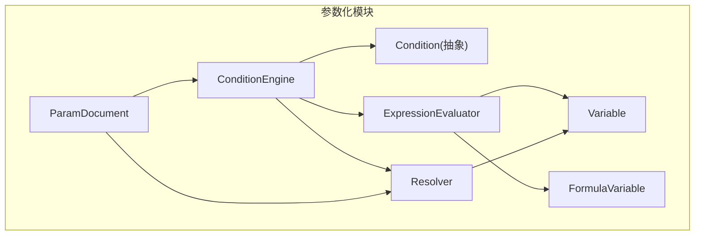
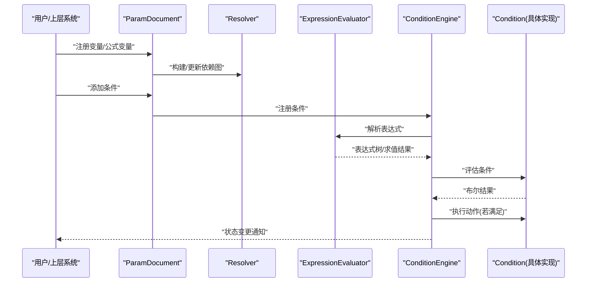
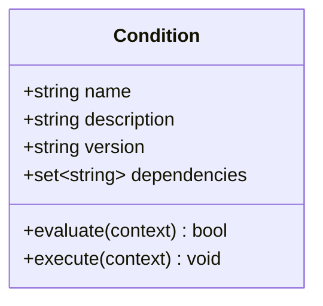
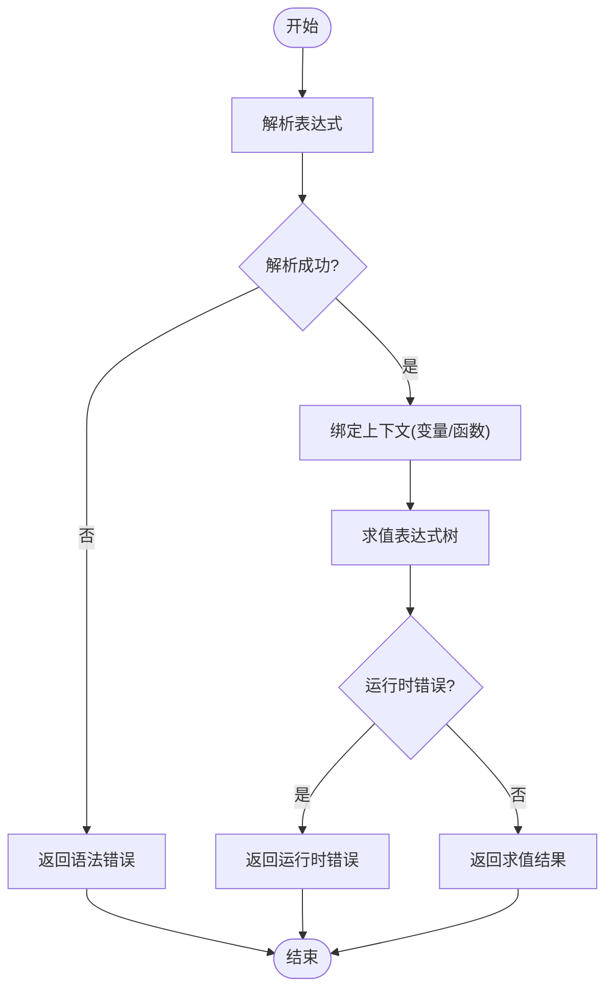
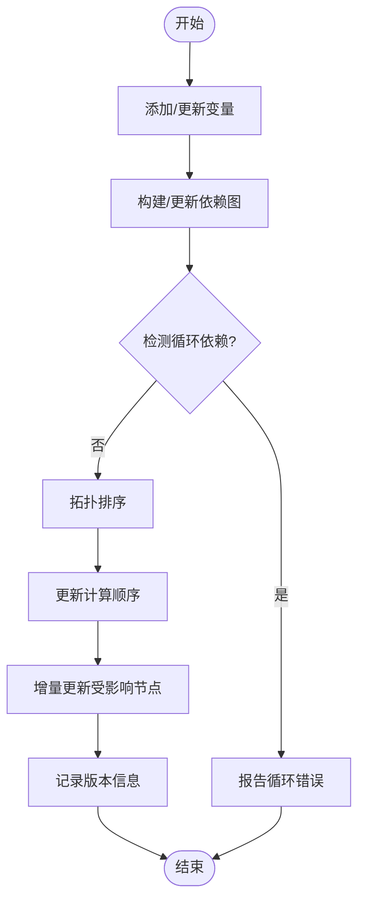
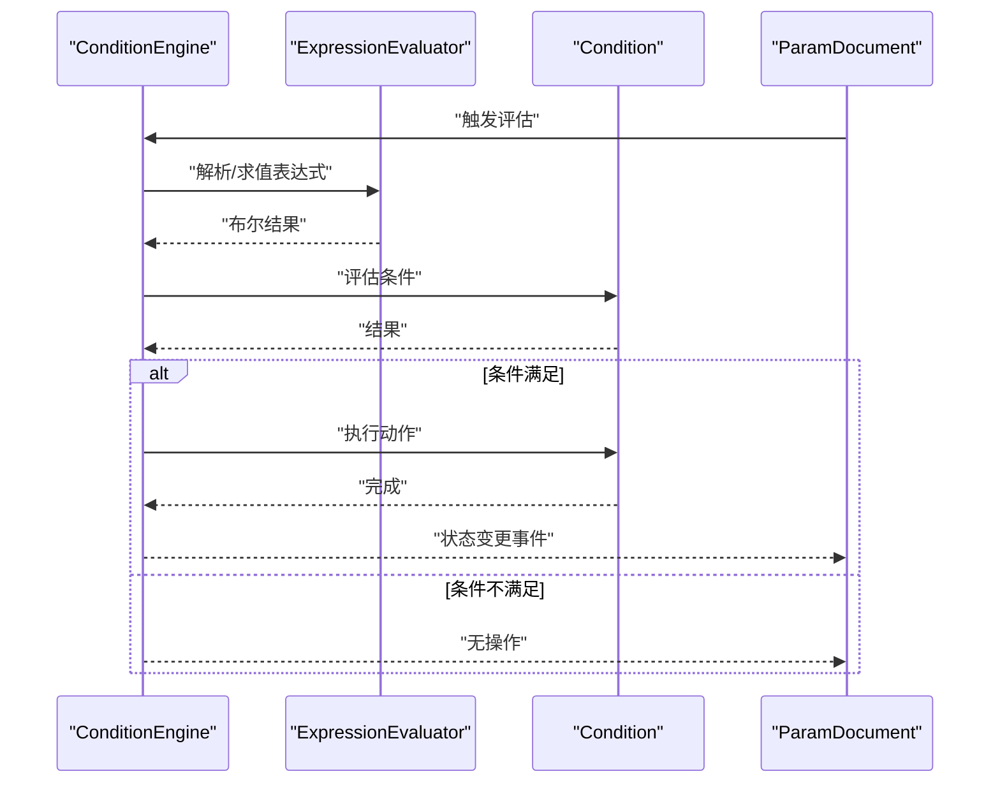
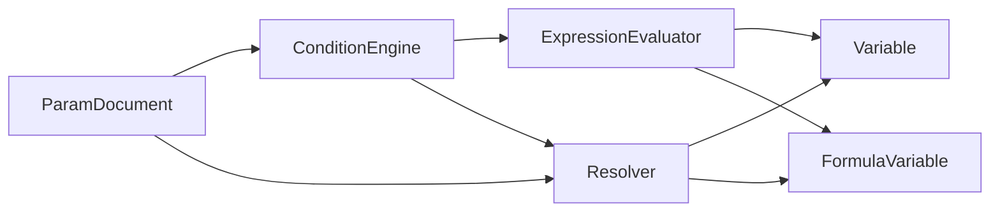

# 条件引擎API

<cite>
**本文引用的文件**   
- [ConditionEngine.h](file://src/parametric/ConditionEngine.h)
- [ConditionEngine.cpp](file://src/parametric/ConditionEngine.cpp)
- [ExpressionEvaluator.h](file://src/parametric/ExpressionEvaluator.h)
- [ExpressionEvaluator.cpp](file://src/parametric/ExpressionEvaluator.cpp)
- [Resolver.h](file://src/parametric/Resolver.h)
- [Resolver.cpp](file://src/parametric/Resolver.cpp)
- [Condition.h](file://src/parametric/Condition.h)
- [Variable.h](file://src/parametric/Variable.h)
- [FormulaVariable.h](file://src/parametric/FormulaVariable.h)
- [ParamDocument.h](file://src/parametric/ParamDocument.h)
- [test_expression.cpp](file://tests/test_expression.cpp)
- [test_resolver.cpp](file://tests/test_resolver.cpp)
</cite>

## 目录
1. [简介](#简介)
2. [项目结构](#项目结构)
3. [核心组件](#核心组件)
4. [架构总览](#架构总览)
5. [详细组件分析](#详细组件分析)
6. [依赖关系分析](#依赖关系分析)
7. [性能考虑](#性能考虑)
8. [故障排查指南](#故障排查指南)
9. [结论](#结论)
10. [附录](#附录)

## 简介
本文件为服装CAD系统的“条件引擎”提供全面的API文档，覆盖以下方面：
- Condition抽象类与条件定义、评估和执行接口
- ExpressionEvaluator表达式计算API
- Resolver依赖解析机制与版本管理功能
- 条件逻辑编写指南、性能优化技巧与调试方法
- 复杂条件表达式的构建示例与错误处理策略
- 条件引擎与参数化系统的集成方式

该引擎用于在参数化建模过程中动态评估条件表达式，驱动几何或属性的变化，确保模型在不同参数组合下保持一致性与可预测性。

## 项目结构
条件引擎位于参数化模块中，核心文件包括：
- 条件抽象与执行：ConditionEngine、Condition
- 表达式求值：ExpressionEvaluator
- 依赖解析与版本管理：Resolver
- 变量与公式变量：Variable、FormulaVariable
- 文档集成：ParamDocument
- 测试用例：test_expression.cpp、test_resolver.cpp

图表来源
- [ConditionEngine.h](file://src/parametric/ConditionEngine.h)
- [ConditionEngine.cpp](file://src/parametric/ConditionEngine.cpp)
- [ExpressionEvaluator.h](file://src/parametric/ExpressionEvaluator.h)
- [ExpressionEvaluator.cpp](file://src/parametric/ExpressionEvaluator.cpp)
- [Resolver.h](file://src/parametric/Resolver.h)
- [Resolver.cpp](file://src/parametric/Resolver.cpp)
- [Condition.h](file://src/parametric/Condition.h)
- [Variable.h](file://src/parametric/Variable.h)
- [FormulaVariable.h](file://src/parametric/FormulaVariable.h)
- [ParamDocument.h](file://src/parametric/ParamDocument.h)

章节来源
- [ConditionEngine.h](file://src/parametric/ConditionEngine.h)
- [ConditionEngine.cpp](file://src/parametric/ConditionEngine.cpp)
- [ExpressionEvaluator.h](file://src/parametric/ExpressionEvaluator.h)
- [ExpressionEvaluator.cpp](file://src/parametric/ExpressionEvaluator.cpp)
- [Resolver.h](file://src/parametric/Resolver.h)
- [Resolver.cpp](file://src/parametric/Resolver.cpp)
- [Condition.h](file://src/parametric/Condition.h)
- [Variable.h](file://src/parametric/Variable.h)
- [FormulaVariable.h](file://src/parametric/FormulaVariable.h)
- [ParamDocument.h](file://src/parametric/ParamDocument.h)

## 核心组件
本节概述条件引擎的核心组件及其职责：
- Condition抽象类：定义条件的统一接口，支持名称、描述、版本、依赖声明、评估与执行等能力。
- ExpressionEvaluator：负责表达式解析与求值，支持变量引用、函数调用、运算符与类型转换。
- Resolver：维护变量与公式变量的依赖图，进行拓扑排序、循环检测、增量更新与版本管理。
- Variable与FormulaVariable：基础变量与基于公式的变量，前者直接存储值，后者通过表达式计算值。
- ParamDocument：参数化文档，集中管理变量集合、条件集合与生命周期事件。

章节来源
- [Condition.h](file://src/parametric/Condition.h)
- [ConditionEngine.h](file://src/parametric/ConditionEngine.h)
- [ConditionEngine.cpp](file://src/parametric/ConditionEngine.cpp)
- [ExpressionEvaluator.h](file://src/parametric/ExpressionEvaluator.h)
- [ExpressionEvaluator.cpp](file://src/parametric/ExpressionEvaluator.cpp)
- [Resolver.h](file://src/parametric/Resolver.h)
- [Resolver.cpp](file://src/parametric/Resolver.cpp)
- [Variable.h](file://src/parametric/Variable.h)
- [FormulaVariable.h](file://src/parametric/FormulaVariable.h)
- [ParamDocument.h](file://src/parametric/ParamDocument.h)

## 架构总览
条件引擎的整体交互流程如下：
- 用户或系统通过ParamDocument注册变量与条件。
- Resolver构建并维护依赖图，保证变量与公式变量的计算顺序正确。
- ExpressionEvaluator对条件中的表达式进行解析与求值。
- ConditionEngine协调条件评估与执行，触发相应的动作（如更新属性、几何等）。

图表来源
- [ParamDocument.h](file://src/parametric/ParamDocument.h)
- [Resolver.h](file://src/parametric/Resolver.h)
- [Resolver.cpp](file://src/parametric/Resolver.cpp)
- [ExpressionEvaluator.h](file://src/parametric/ExpressionEvaluator.h)
- [ExpressionEvaluator.cpp](file://src/parametric/ExpressionEvaluator.cpp)
- [ConditionEngine.h](file://src/parametric/ConditionEngine.h)
- [ConditionEngine.cpp](file://src/parametric/ConditionEngine.cpp)
- [Condition.h](file://src/parametric/Condition.h)

## 详细组件分析

### Condition抽象类与条件接口
- 设计目标：为所有条件提供统一的抽象接口，便于扩展新的条件类型。
- 关键能力：
  - 条件元数据：名称、描述、版本、创建时间等。
  - 依赖声明：列出条件所依赖的变量或公式变量。
  - 评估接口：根据当前变量状态返回布尔结果。
  - 执行接口：当条件满足时执行相应动作（例如更新属性、触发生命周期事件）。
- 使用建议：
  - 将复杂的业务逻辑封装在具体条件实现中，保持评估函数的轻量与纯函数特性。
  - 明确依赖声明，避免隐式耦合，提升可维护性与可测试性。

图表来源
- [Condition.h](file://src/parametric/Condition.h)

章节来源
- [Condition.h](file://src/parametric/Condition.h)

### ExpressionEvaluator表达式计算API
- 设计目标：提供安全、高效的表达式解析与求值能力，支持变量引用、函数调用、运算符与类型转换。
- 关键能力：
  - 表达式解析：将字符串表达式转换为内部表达式树。
  - 上下文绑定：注入变量与函数到求值上下文中。
  - 求值执行：按依赖顺序计算表达式，返回数值或布尔结果。
  - 错误处理：语法错误、运行时错误（除零、类型不匹配）的统一处理。
- 使用建议：
  - 预编译常用表达式以减少重复解析开销。
  - 限制表达式复杂度，避免深层嵌套与递归调用。
  - 对输入进行白名单校验，防止非法函数或变量访问。

图表来源
- [ExpressionEvaluator.h](file://src/parametric/ExpressionEvaluator.h)
- [ExpressionEvaluator.cpp](file://src/parametric/ExpressionEvaluator.cpp)

章节来源
- [ExpressionEvaluator.h](file://src/parametric/ExpressionEvaluator.h)
- [ExpressionEvaluator.cpp](file://src/parametric/ExpressionEvaluator.cpp)

### Resolver依赖解析与版本管理
- 设计目标：维护变量与公式变量的依赖关系，确保计算顺序正确，支持增量更新与版本控制。
- 关键能力：
  - 依赖图构建：根据变量与公式变量的依赖声明构建有向无环图。
  - 拓扑排序：确定安全的计算顺序，避免循环依赖。
  - 循环检测：在添加/修改依赖时检测并报告循环。
  - 增量更新：仅重新计算受影响的节点，提高性能。
  - 版本管理：记录变量与公式的版本，支持回滚与比较。
- 使用建议：
  - 显式声明依赖，避免隐式读取全局状态。
  - 在批量更新前锁定依赖图，减少中间状态不一致。
  - 利用版本信息实现差异同步与撤销重做。

图表来源
- [Resolver.h](file://src/parametric/Resolver.h)
- [Resolver.cpp](file://src/parametric/Resolver.cpp)

章节来源
- [Resolver.h](file://src/parametric/Resolver.h)
- [Resolver.cpp](file://src/parametric/Resolver.cpp)

### ConditionEngine条件执行引擎
- 设计目标：协调条件评估与执行，管理条件生命周期，与参数化系统集成。
- 关键能力：
  - 条件注册：添加、移除、查询条件。
  - 评估调度：根据依赖顺序评估条件，缓存结果。
  - 执行触发：条件满足时执行对应动作，支持异步与事务。
  - 事件通知：向订阅者广播条件状态变化。
- 使用建议：
  - 将条件评估与执行分离，便于测试与调试。
  - 使用批处理模式减少频繁的状态变更通知。
  - 对执行动作进行幂等设计，避免重复执行导致副作用。

图表来源
- [ConditionEngine.h](file://src/parametric/ConditionEngine.h)
- [ConditionEngine.cpp](file://src/parametric/ConditionEngine.cpp)
- [ExpressionEvaluator.h](file://src/parametric/ExpressionEvaluator.h)
- [ExpressionEvaluator.cpp](file://src/parametric/ExpressionEvaluator.cpp)
- [Condition.h](file://src/parametric/Condition.h)
- [ParamDocument.h](file://src/parametric/ParamDocument.h)

章节来源
- [ConditionEngine.h](file://src/parametric/ConditionEngine.h)
- [ConditionEngine.cpp](file://src/parametric/ConditionEngine.cpp)

### 变量与公式变量
- Variable：基础变量，直接存储值，支持类型与范围约束。
- FormulaVariable：基于公式的变量，其值由表达式计算得出，依赖其他变量。
- 使用建议：
  - 优先使用FormulaVariable表达复杂逻辑，保持Variable简单稳定。
  - 为FormulaVariable设置合理的默认值与边界检查。

章节来源
- [Variable.h](file://src/parametric/Variable.h)
- [FormulaVariable.h](file://src/parametric/FormulaVariable.h)

### 与参数化文档的集成
- ParamDocument作为中心化管理器，负责：
  - 变量与公式变量的注册与生命周期管理。
  - 条件的注册与调度。
  - 依赖图的构建与维护。
  - 事件总线，向UI或其他子系统广播状态变更。
- 集成要点：
  - 在文档加载时初始化变量与条件。
  - 在用户编辑时增量更新依赖图与表达式。
  - 在保存/导出时序列化变量、公式与条件。

章节来源
- [ParamDocument.h](file://src/parametric/ParamDocument.h)

## 依赖关系分析
条件引擎各组件之间的依赖关系如下：
- ConditionEngine依赖ExpressionEvaluator进行表达式求值，依赖Resolver进行依赖管理与版本控制。
- ExpressionEvaluator依赖Variable与FormulaVariable获取变量值。
- Resolver依赖Variable与FormulaVariable构建依赖图。
- ParamDocument聚合上述组件，提供统一入口。

图表来源
- [ParamDocument.h](file://src/parametric/ParamDocument.h)
- [ConditionEngine.h](file://src/parametric/ConditionEngine.h)
- [ExpressionEvaluator.h](file://src/parametric/ExpressionEvaluator.h)
- [Resolver.h](file://src/parametric/Resolver.h)
- [Variable.h](file://src/parametric/Variable.h)
- [FormulaVariable.h](file://src/parametric/FormulaVariable.h)

章节来源
- [ParamDocument.h](file://src/parametric/ParamDocument.h)
- [ConditionEngine.h](file://src/parametric/ConditionEngine.h)
- [ExpressionEvaluator.h](file://src/parametric/ExpressionEvaluator.h)
- [Resolver.h](file://src/parametric/Resolver.h)
- [Variable.h](file://src/parametric/Variable.h)
- [FormulaVariable.h](file://src/parametric/FormulaVariable.h)

## 性能考虑
- 表达式预编译：对常用表达式进行缓存，避免重复解析。
- 增量更新：仅重新计算受影响的变量与条件，减少不必要的计算。
- 依赖图优化：定期清理无用依赖，避免图膨胀。
- 批量操作：合并多次变量更新，减少事件广播频率。
- 内存管理：及时释放不再使用的表达式树与中间结果。

[本节为通用指导，无需特定文件来源]

## 故障排查指南
常见问题与解决思路：
- 表达式语法错误：检查表达式字符串格式，确认变量名与函数名正确。
- 循环依赖：使用Resolver的检测功能定位循环，调整依赖声明。
- 运行时错误：检查除零、类型不匹配、空引用等问题。
- 性能问题：分析依赖图复杂度，优化表达式与条件逻辑。
- 状态不一致：确保依赖图更新与事件广播的顺序正确。

调试建议：
- 启用详细日志，记录表达式解析与求值过程。
- 使用单元测试验证表达式与条件逻辑。
- 可视化依赖图，辅助定位问题。

章节来源
- [test_expression.cpp](file://tests/test_expression.cpp)
- [test_resolver.cpp](file://tests/test_resolver.cpp)

## 结论
条件引擎为服装CAD系统提供了强大的条件逻辑处理能力，通过Condition抽象、ExpressionEvaluator表达式求值与Resolver依赖管理，实现了灵活、高效且可维护的条件系统。遵循本文档的使用指南与最佳实践，可以有效提升系统的稳定性与性能。

[本节为总结，无需特定文件来源]

## 附录
- 条件逻辑编写指南：
  - 保持评估函数简洁，避免副作用。
  - 明确依赖声明，避免隐式耦合。
  - 使用白名单限制可用函数与变量。
- 复杂条件表达式构建示例：
  - 组合多个变量与运算符，形成复合条件。
  - 使用函数封装常用逻辑，提高可读性。
- 错误处理策略：
  - 区分语法错误与运行时错误，提供清晰的错误信息。
  - 在关键路径上进行异常捕获与恢复。

[本节为补充内容，无需特定文件来源]