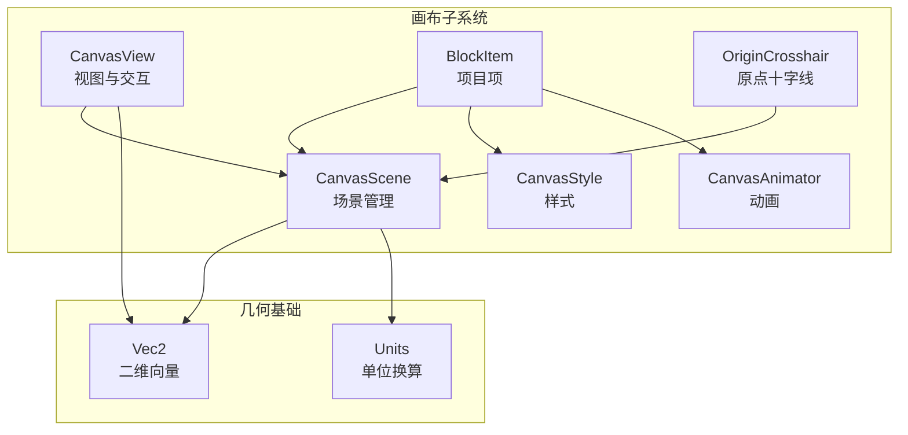
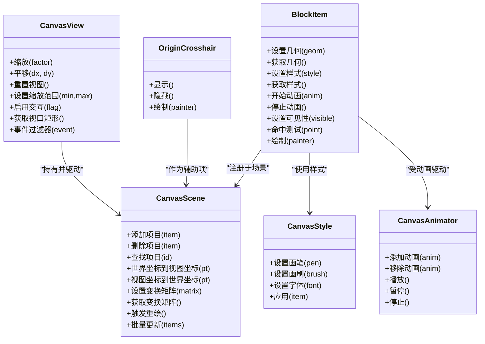
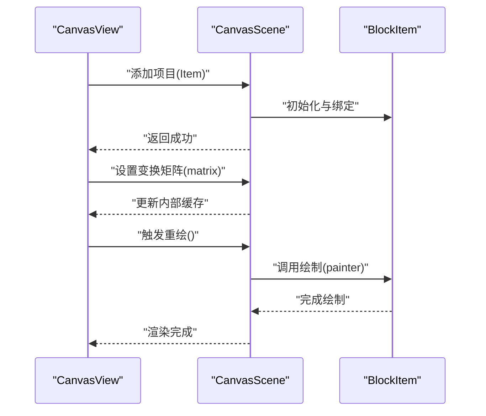
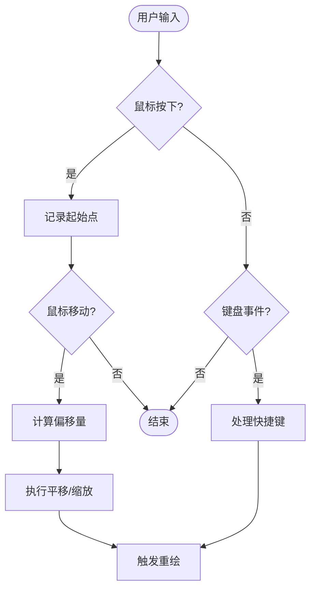
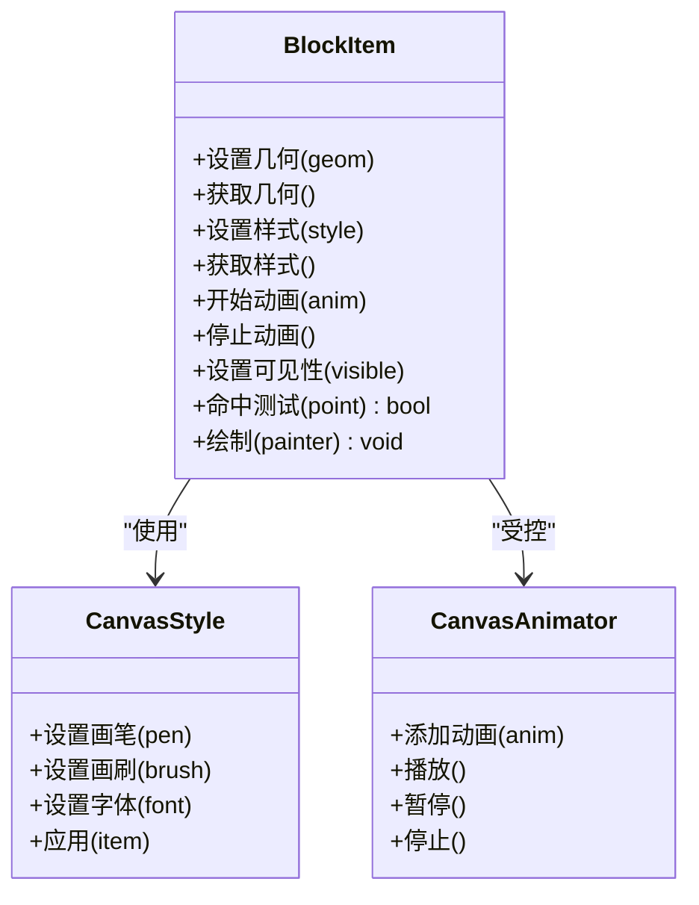
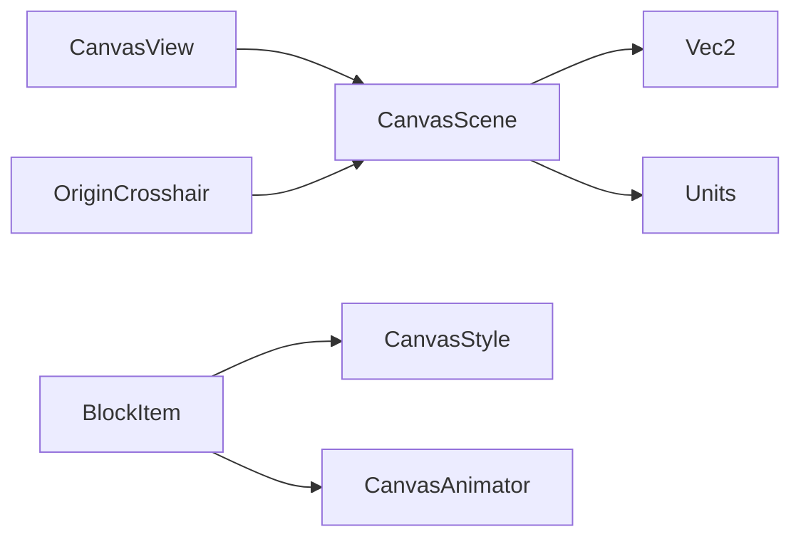

# 画布API

<cite>
**本文引用的文件**   
- [CanvasScene.h](file://src/canvas/CanvasScene.h)
- [CanvasScene.cpp](file://src/canvas/CanvasScene.cpp)
- [CanvasView.h](file://src/canvas/CanvasView.h)
- [CanvasView.cpp](file://src/canvas/CanvasView.cpp)
- [BlockItem.h](file://src/canvas/BlockItem.h)
- [BlockItem.cpp](file://src/canvas/BlockItem.cpp)
- [CanvasStyle.h](file://src/canvas/CanvasStyle.h)
- [CanvasStyle.cpp](file://src/canvas/CanvasStyle.cpp)
- [CanvasAnimator.h](file://src/canvas/CanvasAnimator.h)
- [CanvasAnimator.cpp](file://src/canvas/CanvasAnimator.cpp)
- [OriginCrosshair.h](file://src/canvas/OriginCrosshair.h)
- [OriginCrosshair.cpp](file://src/canvas/OriginCrosshair.cpp)
- [Vec2.h](file://src/geometry/Vec2.h)
- [Units.h](file://src/geometry/Units.h)
</cite>

## 目录
1. [简介](#简介)
2. [项目结构](#项目结构)
3. [核心组件](#核心组件)
4. [架构总览](#架构总览)
5. [详细组件分析](#详细组件分析)
6. [依赖关系分析](#依赖关系分析)
7. [性能考量](#性能考量)
8. [故障排查指南](#故障排查指南)
9. [结论](#结论)
10. [附录](#附录)

## 简介
本文件为服装CAD系统的画布系统提供全面的API文档，重点覆盖以下三类核心接口：
- CanvasScene：场景管理、项目添加与删除、坐标变换与渲染控制。
- CanvasView：视图操作（缩放、平移）、交互事件处理。
- BlockItem：项目操作（几何绘制、样式设置、动画控制）。

同时给出画布事件处理、性能优化与内存管理的最佳实践，并提供常用操作模式的代码示例路径，便于快速上手与集成。

## 项目结构
画布相关代码集中在 src/canvas 目录，配合 geometry 中的基础类型（如 Vec2、Units）以及 UI 工具（如 OriginCrosshair）共同构成完整的画布子系统。

图表来源
- [CanvasScene.h](file://src/canvas/CanvasScene.h)
- [CanvasView.h](file://src/canvas/CanvasView.h)
- [BlockItem.h](file://src/canvas/BlockItem.h)
- [CanvasAnimator.h](file://src/canvas/CanvasAnimator.h)
- [CanvasStyle.h](file://src/canvas/CanvasStyle.h)
- [OriginCrosshair.h](file://src/canvas/OriginCrosshair.h)
- [Vec2.h](file://src/geometry/Vec2.h)
- [Units.h](file://src/geometry/Units.h)

章节来源
- [CanvasScene.h](file://src/canvas/CanvasScene.h)
- [CanvasView.h](file://src/canvas/CanvasView.h)
- [BlockItem.h](file://src/canvas/BlockItem.h)
- [CanvasStyle.h](file://src/canvas/CanvasStyle.h)
- [CanvasAnimator.h](file://src/canvas/CanvasAnimator.h)
- [OriginCrosshair.h](file://src/canvas/OriginCrosshair.h)
- [Vec2.h](file://src/geometry/Vec2.h)
- [Units.h](file://src/geometry/Units.h)

## 核心组件
- CanvasScene
  - 职责：维护场景图元集合、提供添加/删除/查找接口；管理视图变换矩阵；协调渲染流程；暴露坐标变换能力（世界坐标与视图坐标互转）。
  - 关键能力：项目生命周期管理、可见性控制、层级排序、批量更新、渲染区域裁剪。
- CanvasView
  - 职责：承载QGraphicsView或等效视图容器；处理鼠标/键盘事件；实现缩放、平移、框选等交互；驱动重绘与视口更新。
  - 关键能力：视图变换矩阵、滚轮缩放、拖拽平移、事件过滤与转发。
- BlockItem
  - 职责：表示一个可绘制的图形项目；封装几何数据、样式属性、动画状态；提供绘制回调与命中测试。
  - 关键能力：几何构建（点、线、曲线、多边形等）、样式（颜色、线宽、填充）、动画（位移、旋转、透明度渐变）。
- CanvasStyle
  - 职责：集中管理画笔、画刷、字体、阴影等绘图样式；提供默认样式与主题切换。
- CanvasAnimator
  - 职责：驱动BlockItem的动画帧更新；支持缓动函数、时间轴与循环播放。
- OriginCrosshair
  - 职责：在场景中绘制原点十字线，辅助定位与对齐。

章节来源
- [CanvasScene.h](file://src/canvas/CanvasScene.h)
- [CanvasView.h](file://src/canvas/CanvasView.h)
- [BlockItem.h](file://src/canvas/BlockItem.h)
- [CanvasStyle.h](file://src/canvas/CanvasStyle.h)
- [CanvasAnimator.h](file://src/canvas/CanvasAnimator.h)
- [OriginCrosshair.h](file://src/canvas/OriginCrosshair.h)

## 架构总览
画布子系统采用“场景-视图-项”的经典分层：CanvasView负责用户交互与视图变换，CanvasScene负责场景内容与渲染调度，BlockItem作为具体图元承载几何与样式。CanvasStyle与CanvasAnimator分别提供样式与动画能力，OriginCrosshair作为辅助项增强定位体验。

图表来源
- [CanvasScene.h](file://src/canvas/CanvasScene.h)
- [CanvasView.h](file://src/canvas/CanvasView.h)
- [BlockItem.h](file://src/canvas/BlockItem.h)
- [CanvasStyle.h](file://src/canvas/CanvasStyle.h)
- [CanvasAnimator.h](file://src/canvas/CanvasAnimator.h)
- [OriginCrosshair.h](file://src/canvas/OriginCrosshair.h)

## 详细组件分析

### CanvasScene 场景管理API
- 场景管理
  - 添加项目：将BlockItem注册到场景，建立父子关系与渲染顺序。
  - 删除项目：从场景移除并释放资源，必要时通知观察者。
  - 查找项目：按ID或类型检索项目，支持批量查询。
- 坐标变换
  - 世界坐标与视图坐标互转：基于当前变换矩阵进行转换，用于命中测试与交互定位。
  - 变换矩阵：设置/获取视图变换，支持缩放、旋转、平移的组合。
- 渲染控制
  - 触发重绘：标记需要更新的区域或直接刷新全图。
  - 批量更新：对多个项目进行合并更新，减少重绘次数。
  - 可见性与层级：控制项目显示与Z序，影响命中测试与绘制顺序。

图表来源
- [CanvasScene.h](file://src/canvas/CanvasScene.h)
- [CanvasView.h](file://src/canvas/CanvasView.h)
- [BlockItem.h](file://src/canvas/BlockItem.h)

章节来源
- [CanvasScene.h](file://src/canvas/CanvasScene.h)
- [CanvasScene.cpp](file://src/canvas/CanvasScene.cpp)

### CanvasView 视图操作API
- 缩放与平移
  - 缩放：以中心或指定点为基准进行缩放，支持最小/最大缩放限制。
  - 平移：按像素增量移动视图，保持交互流畅。
  - 重置视图：恢复初始缩放与位置。
- 交互事件处理
  - 鼠标事件：按下、移动、释放、双击、滚轮等。
  - 键盘事件：快捷键与命令触发。
  - 事件过滤：拦截与转发事件，实现框选、吸附、对齐等功能。
- 视口与重绘
  - 获取视口矩形：用于裁剪与增量更新。
  - 强制刷新：在数据变更后主动触发重绘。

图表来源
- [CanvasView.h](file://src/canvas/CanvasView.h)
- [CanvasView.cpp](file://src/canvas/CanvasView.cpp)

章节来源
- [CanvasView.h](file://src/canvas/CanvasView.h)
- [CanvasView.cpp](file://src/canvas/CanvasView.cpp)

### BlockItem 项目操作API
- 几何绘制
  - 设置几何：支持点、线段、折线、曲线、多边形等基本形状。
  - 获取几何：读取当前几何数据，用于编辑与导出。
- 样式设置
  - 画笔与画刷：设置线条颜色、宽度、虚线样式与填充颜色、图案。
  - 字体与文本：设置文本内容、字体、对齐方式。
  - 阴影与效果：可选的阴影、模糊等视觉效果。
- 动画控制
  - 开始/停止动画：驱动位移、旋转、透明度变化等。
  - 动画参数：时长、缓动函数、循环模式。
- 交互与命中
  - 命中测试：判断点是否落在项目区域内。
  - 可见性：控制显示与隐藏。
  - 绘制回调：自定义绘制逻辑，提升灵活性。

图表来源
- [BlockItem.h](file://src/canvas/BlockItem.h)
- [CanvasStyle.h](file://src/canvas/CanvasStyle.h)
- [CanvasAnimator.h](file://src/canvas/CanvasAnimator.h)

章节来源
- [BlockItem.h](file://src/canvas/BlockItem.h)
- [BlockItem.cpp](file://src/canvas/BlockItem.cpp)
- [CanvasStyle.h](file://src/canvas/CanvasStyle.h)
- [CanvasStyle.cpp](file://src/canvas/CanvasStyle.cpp)
- [CanvasAnimator.h](file://src/canvas/CanvasAnimator.h)
- [CanvasAnimator.cpp](file://src/canvas/CanvasAnimator.cpp)

### OriginCrosshair 原点十字线
- 功能：在场景中绘制原点十字线，辅助定位与对齐。
- 控制：显示/隐藏、绘制回调。
- 使用：作为辅助项添加到场景，不影响业务项目的交互。

章节来源
- [OriginCrosshair.h](file://src/canvas/OriginCrosshair.h)
- [OriginCrosshair.cpp](file://src/canvas/OriginCrosshair.cpp)

## 依赖关系分析
- CanvasView 依赖 CanvasScene 进行场景管理与渲染调度。
- BlockItem 依赖 CanvasStyle 与 CanvasAnimator 提供样式与动画能力。
- CanvasScene 依赖 Vec2 与 Units 进行坐标与单位处理。
- OriginCrosshair 作为辅助项依赖 CanvasScene 的渲染管线。

图表来源
- [CanvasView.h](file://src/canvas/CanvasView.h)
- [CanvasScene.h](file://src/canvas/CanvasScene.h)
- [BlockItem.h](file://src/canvas/BlockItem.h)
- [CanvasStyle.h](file://src/canvas/CanvasStyle.h)
- [CanvasAnimator.h](file://src/canvas/CanvasAnimator.h)
- [OriginCrosshair.h](file://src/canvas/OriginCrosshair.h)
- [Vec2.h](file://src/geometry/Vec2.h)
- [Units.h](file://src/geometry/Units.h)

章节来源
- [CanvasView.h](file://src/canvas/CanvasView.h)
- [CanvasScene.h](file://src/canvas/CanvasScene.h)
- [BlockItem.h](file://src/canvas/BlockItem.h)
- [CanvasStyle.h](file://src/canvas/CanvasStyle.h)
- [CanvasAnimator.h](file://src/canvas/CanvasAnimator.h)
- [OriginCrosshair.h](file://src/canvas/OriginCrosshair.h)
- [Vec2.h](file://src/geometry/Vec2.h)
- [Units.h](file://src/geometry/Units.h)

## 性能考量
- 批量更新：对多个项目变更使用批量更新接口，减少重绘次数。
- 增量重绘：仅更新视口内可见区域，避免全图重绘。
- 变换缓存：缓存变换矩阵与几何边界，降低重复计算。
- 动画节流：限制动画帧率与更新频率，避免CPU占用过高。
- 内存管理：及时释放不再使用的项目与样式对象，避免内存泄漏。
- 事件过滤：在CanvasView层过滤不必要的事件，减少主线程压力。

[本节为通用指导，不直接分析具体文件]

## 故障排查指南
- 项目未显示
  - 检查项目可见性设置与层级顺序。
  - 确认项目已正确添加到场景且未被遮挡。
- 坐标转换异常
  - 验证变换矩阵是否正确设置。
  - 检查世界坐标与视图坐标转换逻辑。
- 动画卡顿
  - 调整动画帧率与缓动函数。
  - 减少复杂几何与样式效果。
- 内存增长
  - 确保删除项目时释放资源。
  - 避免创建大量临时对象。

章节来源
- [CanvasScene.cpp](file://src/canvas/CanvasScene.cpp)
- [CanvasView.cpp](file://src/canvas/CanvasView.cpp)
- [BlockItem.cpp](file://src/canvas/BlockItem.cpp)

## 结论
本API文档围绕CanvasScene、CanvasView与BlockItem三大核心组件展开，提供了场景管理、视图交互与项目操作的完整接口说明。通过合理的性能优化与内存管理策略，可构建高效稳定的服装CAD画布系统。建议在实际开发中结合示例代码路径进行快速验证与集成。

[本节为总结性内容，不直接分析具体文件]

## 附录
- 常用操作模式示例路径
  - 场景中添加项目：参考 [CanvasScene.h](file://src/canvas/CanvasScene.h) 与 [CanvasScene.cpp](file://src/canvas/CanvasScene.cpp) 中的添加接口。
  - 视图缩放与平移：参考 [CanvasView.h](file://src/canvas/CanvasView.h) 与 [CanvasView.cpp](file://src/canvas/CanvasView.cpp) 中的缩放与平移方法。
  - 项目几何与样式设置：参考 [BlockItem.h](file://src/canvas/BlockItem.h) 与 [BlockItem.cpp](file://src/canvas/BlockItem.cpp) 中的几何与样式接口。
  - 动画控制：参考 [CanvasAnimator.h](file://src/canvas/CanvasAnimator.h) 与 [CanvasAnimator.cpp](file://src/canvas/CanvasAnimator.cpp) 中的动画方法。
  - 原点十字线：参考 [OriginCrosshair.h](file://src/canvas/OriginCrosshair.h) 与 [OriginCrosshair.cpp](file://src/canvas/OriginCrosshair.cpp)。

[本节为附录信息，不直接分析具体文件]