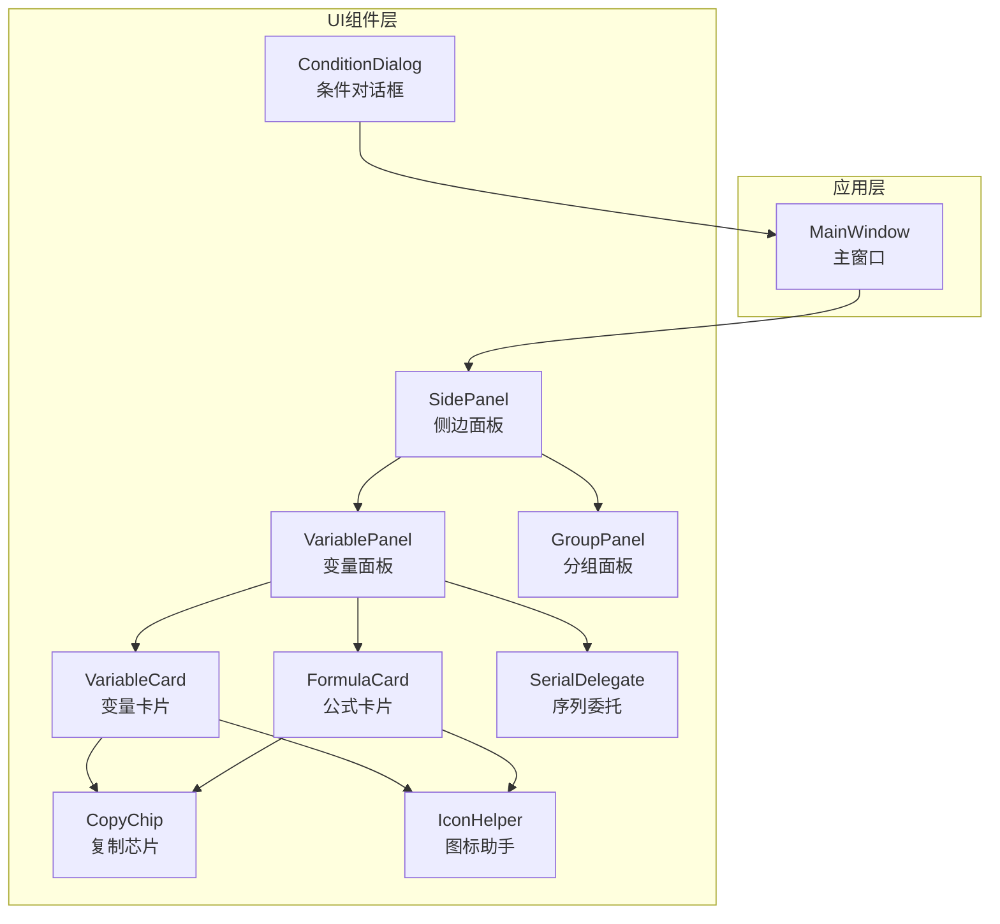
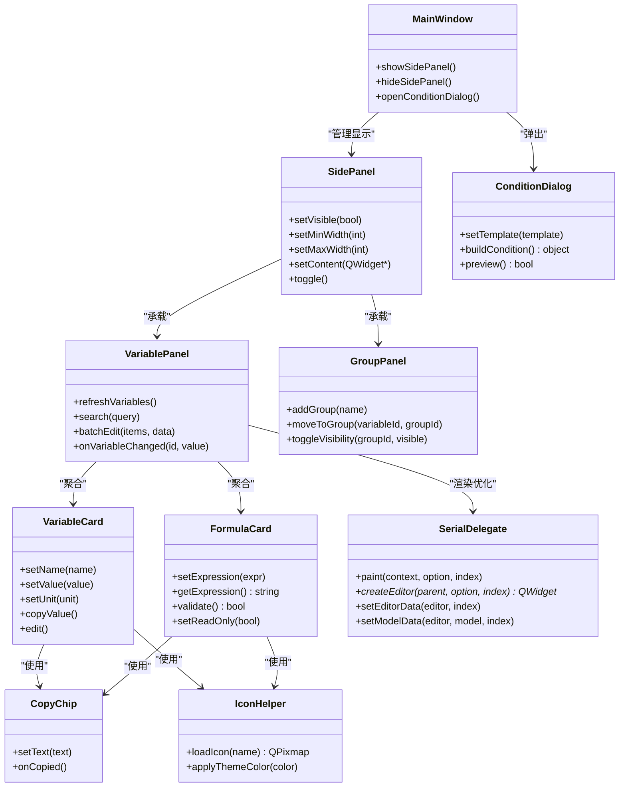
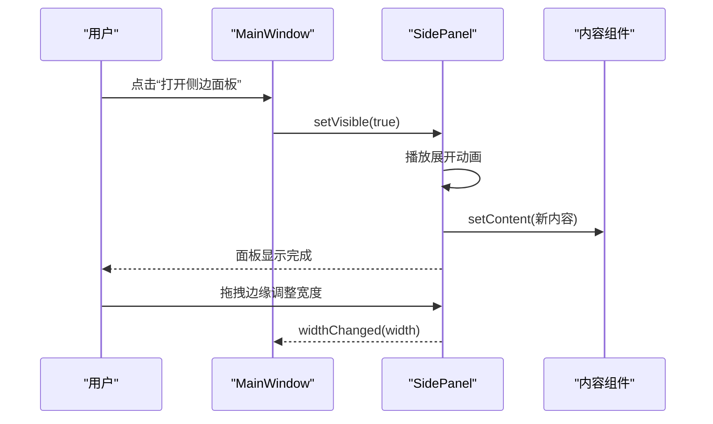
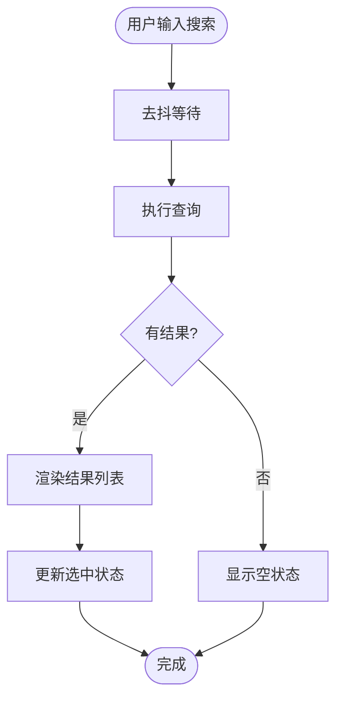
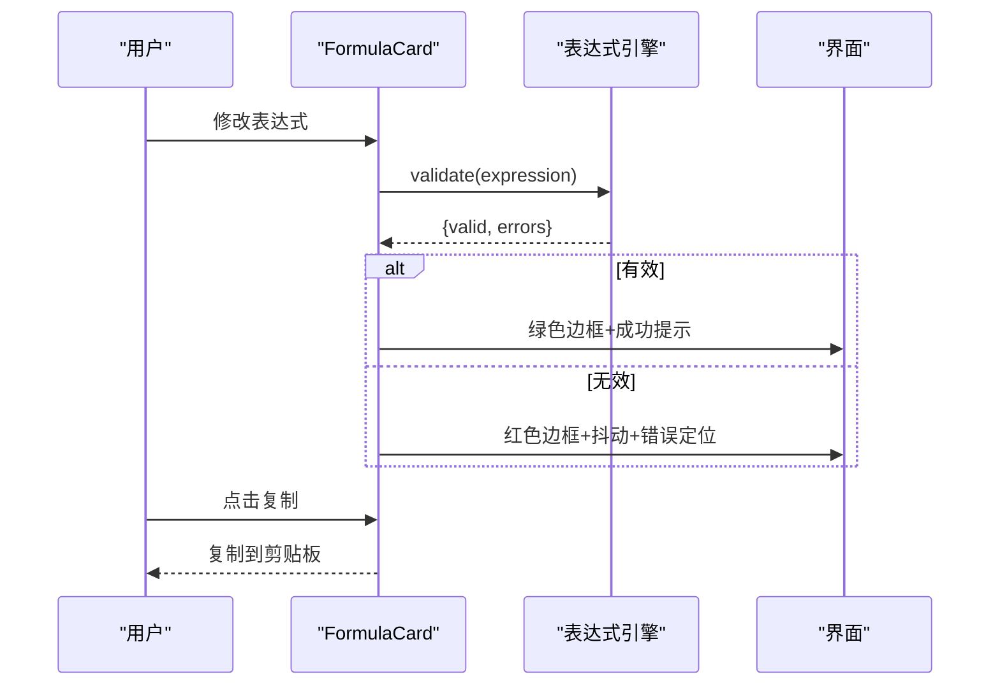
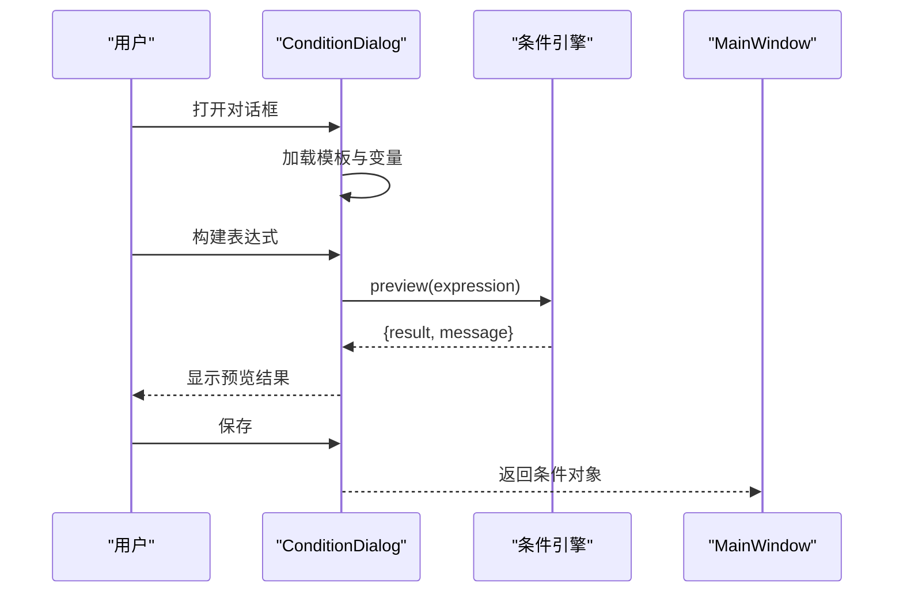
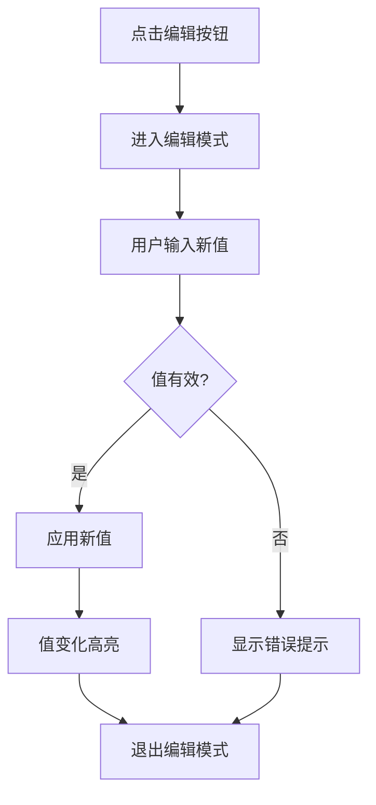
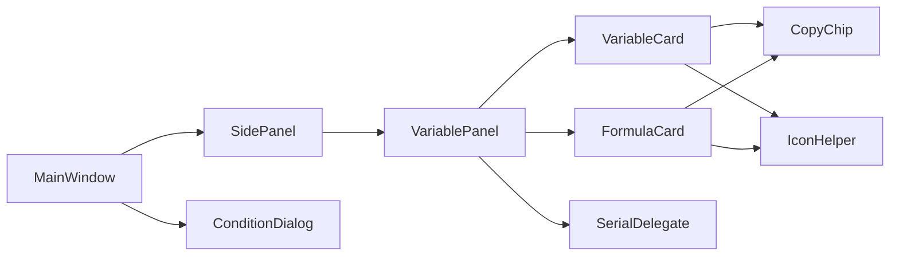

# UI组件

<cite>
**本文引用的文件**   
- [SidePanel.h](file://src/ui/SidePanel.h)
- [SidePanel.cpp](file://src/ui/SidePanel.cpp)
- [VariablePanel.h](file://src/ui/VariablePanel.h)
- [VariablePanel.cpp](file://src/ui/VariablePanel.cpp)
- [FormulaCard.h](file://src/ui/FormulaCard.h)
- [FormulaCard.cpp](file://src/ui/FormulaCard.cpp)
- [ConditionDialog.h](file://src/ui/ConditionDialog.h)
- [ConditionDialog.cpp](file://src/ui/ConditionDialog.cpp)
- [VariableCard.h](file://src/ui/VariableCard.h)
- [VariableCard.cpp](file://src/ui/VariableCard.cpp)
- [GroupPanel.h](file://src/ui/GroupPanel.h)
- [GroupPanel.cpp](file://src/ui/GroupPanel.cpp)
- [CopyChip.h](file://src/ui/CopyChip.h)
- [CopyChip.cpp](file://src/ui/CopyChip.cpp)
- [IconHelper.h](file://src/ui/IconHelper.h)
- [IconHelper.cpp](file://src/ui/IconHelper.cpp)
- [SerialDelegate.h](file://src/ui/SerialDelegate.h)
- [SerialDelegate.cpp](file://src/ui/SerialDelegate.cpp)
- [MainWindow.h](file://src/app/MainWindow.h)
- [MainWindow.cpp](file://src/app/MainWindow.cpp)
</cite>

## 目录
1. [简介](#简介)
2. [项目结构](#项目结构)
3. [核心组件](#核心组件)
4. [架构总览](#架构总览)
5. [详细组件分析](#详细组件分析)
6. [依赖关系分析](#依赖关系分析)
7. [性能与可访问性](#性能与可访问性)
8. [故障排查指南](#故障排查指南)
9. [结论](#结论)
10. [附录：使用示例与演示](#附录使用示例与演示)

## 简介
本文件面向服装CAD应用中的UI组件，系统性描述侧边面板、变量面板、公式卡片、条件对话框等组件的视觉外观、行为模式、用户交互、属性/事件/插槽（或信号槽）、样式与主题定制、响应式布局、跨浏览器/平台兼容性与性能优化。文档同时给出组件组合模式以及与主窗口和其他UI元素的集成方式，并提供基于源码路径的使用示例定位，便于快速上手与二次开发。

## 项目结构
UI相关代码集中在 src/ui 目录，按功能模块组织：
- SidePanel：通用侧边面板容器，负责显示/隐藏、尺寸调整与内容区域管理
- VariablePanel：变量列表与编辑面板，承载多个 VariableCard
- FormulaCard：公式展示与编辑卡片，支持表达式输入与校验反馈
- ConditionDialog：条件编辑对话框，用于创建/编辑条件规则
- VariableCard：单个变量的可视化卡片，提供名称、值、单位、操作按钮
- GroupPanel：分组面板，用于对变量进行分组管理与批量操作
- CopyChip：复制芯片控件，用于快速复制文本或参数
- IconHelper：图标资源加载与渲染辅助
- SerialDelegate：表格/列表委托，用于自定义绘制与编辑行为

**图表来源** 
- [MainWindow.h](file://src/app/MainWindow.h)
- [MainWindow.cpp](file://src/app/MainWindow.cpp)
- [SidePanel.h](file://src/ui/SidePanel.h)
- [VariablePanel.h](file://src/ui/VariablePanel.h)
- [FormulaCard.h](file://src/ui/FormulaCard.h)
- [ConditionDialog.h](file://src/ui/ConditionDialog.h)
- [VariableCard.h](file://src/ui/VariableCard.h)
- [GroupPanel.h](file://src/ui/GroupPanel.h)
- [CopyChip.h](file://src/ui/CopyChip.h)
- [IconHelper.h](file://src/ui/IconHelper.h)
- [SerialDelegate.h](file://src/ui/SerialDelegate.h)

**章节来源**
- [MainWindow.h](file://src/app/MainWindow.h)
- [MainWindow.cpp](file://src/app/MainWindow.cpp)
- [SidePanel.h](file://src/ui/SidePanel.h)
- [VariablePanel.h](file://src/ui/VariablePanel.h)
- [FormulaCard.h](file://src/ui/FormulaCard.h)
- [ConditionDialog.h](file://src/ui/ConditionDialog.h)
- [VariableCard.h](file://src/ui/VariableCard.h)
- [GroupPanel.h](file://src/ui/GroupPanel.h)
- [CopyChip.h](file://src/ui/CopyChip.h)
- [IconHelper.h](file://src/ui/IconHelper.h)
- [SerialDelegate.h](file://src/ui/SerialDelegate.h)

## 核心组件
本节概述各UI组件的职责边界、对外接口与典型交互流程。

- 侧边面板（SidePanel）
  - 职责：作为可折叠/可拖拽的面板容器，承载右侧或左侧内容区；管理可见性、宽度、停靠位置与动画过渡
  - 关键特性：最小/最大宽度限制、平滑展开收起、内容自适应、键盘导航支持
  - 典型交互：点击切换按钮、拖拽边缘调整宽度、快捷键显示/隐藏

- 变量面板（VariablePanel）
  - 职责：展示与管理所有变量，提供搜索、筛选、分组、批量编辑能力
  - 关键特性：虚拟滚动（大数据量）、状态指示（有效/无效/未计算）、错误提示
  - 典型交互：双击编辑、右键菜单、拖放排序、多选操作

- 公式卡片（FormulaCard）
  - 职责：以卡片形式展示并编辑单个公式，提供语法高亮、实时校验、错误定位
  - 关键特性：只读/编辑模式切换、历史撤销/重做、粘贴解析
  - 典型交互：输入变更触发校验、错误时抖动提示、成功时绿色边框

- 条件对话框（ConditionDialog）
  - 职责：创建/编辑条件表达式，支持逻辑运算符与变量引用
  - 关键特性：模板化条件片段、自动补全、预览结果
  - 典型交互：选择变量与运算符、构建表达式树、保存/取消

- 变量卡片（VariableCard）
  - 职责：单变量可视化，包含名称、当前值、单位、操作按钮（编辑、复制、重置）
  - 关键特性：值变化高亮、单位切换、快捷复制
  - 典型交互：点击编辑、长按复制、悬停提示

- 分组面板（GroupPanel）
  - 职责：对变量进行分组管理，支持组内批量操作与可见性控制
  - 关键特性：组折叠/展开、拖拽入组、权限/可见性标记
  - 典型交互：新建组、移动变量、导出组配置

- 复制芯片（CopyChip）
  - 职责：提供一键复制文本到剪贴板，带成功反馈
  - 关键特性：防抖、失败重试、无障碍标签

- 图标助手（IconHelper）
  - 职责：统一加载与缩放图标资源，保证一致性
  - 关键特性：矢量/位图适配、主题色注入

- 序列委托（SerialDelegate）
  - 职责：在表格/列表中自定义绘制与编辑行为，提升性能与体验
  - 关键特性：按需绘制、编辑器复用、键盘事件处理

**章节来源**
- [SidePanel.h](file://src/ui/SidePanel.h)
- [SidePanel.cpp](file://src/ui/SidePanel.cpp)
- [VariablePanel.h](file://src/ui/VariablePanel.h)
- [VariablePanel.cpp](file://src/ui/VariablePanel.cpp)
- [FormulaCard.h](file://src/ui/FormulaCard.h)
- [FormulaCard.cpp](file://src/ui/FormulaCard.cpp)
- [ConditionDialog.h](file://src/ui/ConditionDialog.h)
- [ConditionDialog.cpp](file://src/ui/ConditionDialog.cpp)
- [VariableCard.h](file://src/ui/VariableCard.h)
- [VariableCard.cpp](file://src/ui/VariableCard.cpp)
- [GroupPanel.h](file://src/ui/GroupPanel.h)
- [GroupPanel.cpp](file://src/ui/GroupPanel.cpp)
- [CopyChip.h](file://src/ui/CopyChip.h)
- [CopyChip.cpp](file://src/ui/CopyChip.cpp)
- [IconHelper.h](file://src/ui/IconHelper.h)
- [IconHelper.cpp](file://src/ui/IconHelper.cpp)
- [SerialDelegate.h](file://src/ui/SerialDelegate.h)
- [SerialDelegate.cpp](file://src/ui/SerialDelegate.cpp)

## 架构总览
UI组件采用分层架构：主窗口协调各面板，侧边面板作为容器承载变量面板与分组面板；变量面板聚合多个变量卡片与公式卡片；条件对话框由主窗口弹出；图标助手与复制芯片为通用工具；序列委托用于列表渲染优化。

**图表来源** 
- [MainWindow.h](file://src/app/MainWindow.h)
- [SidePanel.h](file://src/ui/SidePanel.h)
- [VariablePanel.h](file://src/ui/VariablePanel.h)
- [FormulaCard.h](file://src/ui/FormulaCard.h)
- [ConditionDialog.h](file://src/ui/ConditionDialog.h)
- [VariableCard.h](file://src/ui/VariableCard.h)
- [GroupPanel.h](file://src/ui/GroupPanel.h)
- [CopyChip.h](file://src/ui/CopyChip.h)
- [IconHelper.h](file://src/ui/IconHelper.h)
- [SerialDelegate.h](file://src/ui/SerialDelegate.h)

## 详细组件分析

### 侧边面板（SidePanel）
- 视觉外观：圆角容器、阴影、标题栏与关闭/折叠按钮；内容区自适应高度
- 行为模式：支持滑入/滑出动画、拖拽调整宽度、键盘焦点管理
- 用户交互：点击切换、拖拽边缘、快捷键显示/隐藏
- 属性/特征：最小/最大宽度、是否可调整大小、停靠位置（左/右）
- 事件/信号：visibleChanged、widthChanged、contentResized
- 插槽/方法：setVisible、setMinWidth、setMaxWidth、setContent、toggle
- 样式与主题：背景色、边框半径、阴影强度、标题栏样式
- 响应式设计：根据屏幕宽度自动切换折叠策略
- 可访问性：ARIA标签、键盘导航、焦点顺序
- 动画与过渡：QPropertyAnimation或等效实现，缓动函数可调
- 性能：延迟加载内容、避免频繁重绘
- 兼容性：跨平台一致的外观与行为

**图表来源** 
- [MainWindow.cpp](file://src/app/MainWindow.cpp)
- [SidePanel.cpp](file://src/ui/SidePanel.cpp)

**章节来源**
- [SidePanel.h](file://src/ui/SidePanel.h)
- [SidePanel.cpp](file://src/ui/SidePanel.cpp)

### 变量面板（VariablePanel）
- 视觉外观：列表/网格视图、搜索框、筛选器、批量操作栏
- 行为模式：数据绑定、增量刷新、错误状态提示
- 用户交互：搜索、筛选、多选、拖放、右键菜单
- 属性/特征：数据源、分页/虚拟滚动、排序字段
- 事件/信号：variableSelected、variableUpdated、batchActionTriggered
- 插槽/方法：refreshVariables、search、batchEdit、setDataSource
- 样式与主题：行高、选中态颜色、错误高亮
- 响应式设计：小屏切换为卡片布局
- 可访问性：表格语义、键盘导航、屏幕阅读器支持
- 动画与过渡：新增项淡入、删除项滑出
- 性能：懒加载、去抖搜索、批量更新合并

**图表来源** 
- [VariablePanel.cpp](file://src/ui/VariablePanel.cpp)

**章节来源**
- [VariablePanel.h](file://src/ui/VariablePanel.h)
- [VariablePanel.cpp](file://src/ui/VariablePanel.cpp)

### 公式卡片（FormulaCard）
- 视觉外观：标题、表达式输入区、校验状态指示、操作按钮
- 行为模式：只读/编辑切换、实时校验、撤销/重做
- 用户交互：输入变更、粘贴解析、点击复制
- 属性/特征：表达式字符串、只读标志、校验回调
- 事件/信号：expressionChanged、validationResult、copied
- 插槽/方法：setExpression、getExpression、validate、setReadOnly
- 样式与主题：字体、颜色、错误抖动动画
- 响应式设计：窄屏自动换行与按钮折叠
- 可访问性：输入框标签、错误提示朗读
- 动画与过渡：校验失败抖动、成功边框变色
- 性能：增量解析、缓存中间结果

**图表来源** 
- [FormulaCard.cpp](file://src/ui/FormulaCard.cpp)

**章节来源**
- [FormulaCard.h](file://src/ui/FormulaCard.h)
- [FormulaCard.cpp](file://src/ui/FormulaCard.cpp)

### 条件对话框（ConditionDialog）
- 视觉外观：表单式布局、变量选择器、运算符下拉、表达式预览
- 行为模式：模板加载、自动补全、预览计算
- 用户交互：选择变量与运算符、构建表达式、保存/取消
- 属性/特征：模板对象、变量列表、预览回调
- 事件/信号：conditionBuilt、previewResult、saved
- 插槽/方法：setTemplate、buildCondition、preview、save
- 样式与主题：表单样式、错误提示样式
- 响应式设计：移动端堆叠布局
- 可访问性：表单标签、必填提示、键盘导航
- 动画与过渡：模态遮罩淡入、结果预览渐显
- 性能：预览计算节流、缓存变量元数据

**图表来源** 
- [ConditionDialog.cpp](file://src/ui/ConditionDialog.cpp)

**章节来源**
- [ConditionDialog.h](file://src/ui/ConditionDialog.h)
- [ConditionDialog.cpp](file://src/ui/ConditionDialog.cpp)

### 变量卡片（VariableCard）
- 视觉外观：名称、值、单位、操作按钮（编辑、复制、重置）
- 行为模式：值变化高亮、单位切换、复制反馈
- 用户交互：点击编辑、长按复制、悬停提示
- 属性/特征：名称、值、单位、只读标志
- 事件/信号：valueChanged、copied、edited
- 插槽/方法：setName、setValue、setUnit、copyValue、edit
- 样式与主题：值高亮颜色、按钮图标
- 响应式设计：小屏隐藏单位或折叠按钮
- 可访问性：按钮标签、复制成功提示
- 动画与过渡：值变化闪烁、复制成功弹跳
- 性能：避免频繁重绘，合并更新

**图表来源** 
- [VariableCard.cpp](file://src/ui/VariableCard.cpp)

**章节来源**
- [VariableCard.h](file://src/ui/VariableCard.h)
- [VariableCard.cpp](file://src/ui/VariableCard.cpp)

### 分组面板（GroupPanel）
- 视觉外观：树形结构、组名、成员列表、操作按钮
- 行为模式：组折叠/展开、拖拽入组、批量可见性控制
- 用户交互：新建组、移动变量、导出配置
- 属性/特征：组列表、成员映射、可见性状态
- 事件/信号：groupCreated、variableMoved、visibilityChanged
- 插槽/方法：addGroup、moveToGroup、toggleVisibility、exportConfig
- 样式与主题：组头样式、成员行样式
- 响应式设计：移动端改为列表
- 可访问性：树节点语义、键盘导航
- 动画与过渡：折叠展开动画、拖拽高亮
- 性能：惰性加载成员、批量更新

**章节来源**
- [GroupPanel.h](file://src/ui/GroupPanel.h)
- [GroupPanel.cpp](file://src/ui/GroupPanel.cpp)

### 复制芯片（CopyChip）
- 视觉外观：小型按钮/标签，带复制图标
- 行为模式：点击复制文本到剪贴板，成功反馈
- 用户交互：点击、长按复制
- 属性/特征：文本内容、成功提示文案
- 事件/信号：copied
- 插槽/方法：setText、onCopied
- 样式与主题：图标颜色、背景色
- 响应式设计：小屏隐藏文案仅保留图标
- 可访问性：aria-label、键盘焦点
- 动画与过渡：成功弹跳、短暂高亮
- 性能：防抖重复点击

**章节来源**
- [CopyChip.h](file://src/ui/CopyChip.h)
- [CopyChip.cpp](file://src/ui/CopyChip.cpp)

### 图标助手（IconHelper）
- 职责：统一加载与缩放图标资源，保证一致性
- 关键特性：矢量/位图适配、主题色注入
- 插槽/方法：loadIcon、applyThemeColor

**章节来源**
- [IconHelper.h](file://src/ui/IconHelper.h)
- [IconHelper.cpp](file://src/ui/IconHelper.cpp)

### 序列委托（SerialDelegate）
- 职责：在表格/列表中自定义绘制与编辑行为，提升性能与体验
- 关键特性：按需绘制、编辑器复用、键盘事件处理
- 插槽/方法：paint、createEditor、setEditorData、setModelData

**章节来源**
- [SerialDelegate.h](file://src/ui/SerialDelegate.h)
- [SerialDelegate.cpp](file://src/ui/SerialDelegate.cpp)

## 依赖关系分析
- 松耦合设计：各组件通过信号/槽或回调通信，减少直接依赖
- 数据流向：主窗口协调面板显示，面板聚合子组件，子组件向上广播事件
- 外部依赖：表达式/条件引擎、剪贴板服务、图标资源系统
- 潜在循环依赖：避免面板间直接互相持有指针，使用事件总线或主窗口中转

**图表来源** 
- [MainWindow.h](file://src/app/MainWindow.h)
- [SidePanel.h](file://src/ui/SidePanel.h)
- [VariablePanel.h](file://src/ui/VariablePanel.h)
- [FormulaCard.h](file://src/ui/FormulaCard.h)
- [ConditionDialog.h](file://src/ui/ConditionDialog.h)
- [VariableCard.h](file://src/ui/VariableCard.h)
- [CopyChip.h](file://src/ui/CopyChip.h)
- [IconHelper.h](file://src/ui/IconHelper.h)
- [SerialDelegate.h](file://src/ui/SerialDelegate.h)

**章节来源**
- [MainWindow.h](file://src/app/MainWindow.h)
- [SidePanel.h](file://src/ui/SidePanel.h)
- [VariablePanel.h](file://src/ui/VariablePanel.h)
- [FormulaCard.h](file://src/ui/FormulaCard.h)
- [ConditionDialog.h](file://src/ui/ConditionDialog.h)
- [VariableCard.h](file://src/ui/VariableCard.h)
- [CopyChip.h](file://src/ui/CopyChip.h)
- [IconHelper.h](file://src/ui/IconHelper.h)
- [SerialDelegate.h](file://src/ui/SerialDelegate.h)

## 性能与可访问性
- 性能优化建议
  - 使用虚拟滚动与懒加载，避免一次性渲染大量变量卡片
  - 合并高频更新（如输入去抖、批量提交）
  - 重用编辑器实例，减少创建销毁开销
  - 图标资源预加载与缓存
  - 动画使用硬件加速，避免阻塞主线程
- 可访问性合规
  - 为所有交互元素提供语义化标签与Aria属性
  - 确保键盘可达性与焦点顺序合理
  - 错误提示需被屏幕阅读器朗读
  - 颜色对比度符合WCAG标准
  - 提供高对比度主题与字体缩放支持

[本节为通用指导，不直接分析具体文件]

## 故障排查指南
- 常见问题与解决
  - 侧边面板无法显示：检查可见性设置与父容器布局
  - 变量面板数据不更新：确认数据源绑定与刷新调用
  - 公式校验失败：检查表达式语法与变量引用
  - 条件对话框预览无结果：验证模板与变量元数据
  - 复制失败：检查剪贴板权限与平台差异
- 调试技巧
  - 启用日志输出，记录关键事件与状态变更
  - 使用性能分析工具定位卡顿点
  - 模拟极端数据量测试渲染性能
  - 多平台交叉验证外观与行为

**章节来源**
- [SidePanel.cpp](file://src/ui/SidePanel.cpp)
- [VariablePanel.cpp](file://src/ui/VariablePanel.cpp)
- [FormulaCard.cpp](file://src/ui/FormulaCard.cpp)
- [ConditionDialog.cpp](file://src/ui/ConditionDialog.cpp)
- [CopyChip.cpp](file://src/ui/CopyChip.cpp)

## 结论
本UI组件体系以清晰的职责划分与松耦合设计为基础，提供了丰富的交互能力与良好的可扩展性。通过合理的样式定制、响应式布局与可访问性支持，能够满足不同设备与用户需求。建议在后续迭代中持续优化性能与用户体验，完善主题系统与国际化支持。

[本节为总结，不直接分析具体文件]

## 附录：使用示例与演示
- 侧边面板使用
  - 在主窗口中创建并显示侧边面板，设置内容与宽度限制
  - 参考路径：[MainWindow.cpp](file://src/app/MainWindow.cpp)、[SidePanel.cpp](file://src/ui/SidePanel.cpp)
- 变量面板集成
  - 绑定数据源，实现搜索与批量编辑
  - 参考路径：[VariablePanel.cpp](file://src/ui/VariablePanel.cpp)
- 公式卡片编辑
  - 设置表达式，处理校验与复制
  - 参考路径：[FormulaCard.cpp](file://src/ui/FormulaCard.cpp)
- 条件对话框弹出
  - 从主窗口打开对话框，传递模板与变量
  - 参考路径：[MainWindow.cpp](file://src/app/MainWindow.cpp)、[ConditionDialog.cpp](file://src/ui/ConditionDialog.cpp)
- 变量卡片交互
  - 编辑值、复制、单位切换
  - 参考路径：[VariableCard.cpp](file://src/ui/VariableCard.cpp)
- 分组面板管理
  - 新建组、移动变量、批量可见性控制
  - 参考路径：[GroupPanel.cpp](file://src/ui/GroupPanel.cpp)
- 复制芯片与图标助手
  - 复制文本到剪贴板，加载与应用图标
  - 参考路径：[CopyChip.cpp](file://src/ui/CopyChip.cpp)、[IconHelper.cpp](file://src/ui/IconHelper.cpp)
- 序列委托优化
  - 自定义绘制与编辑行为，提升列表性能
  - 参考路径：[SerialDelegate.cpp](file://src/ui/SerialDelegate.cpp)

[本节为使用指引，不直接分析具体文件]