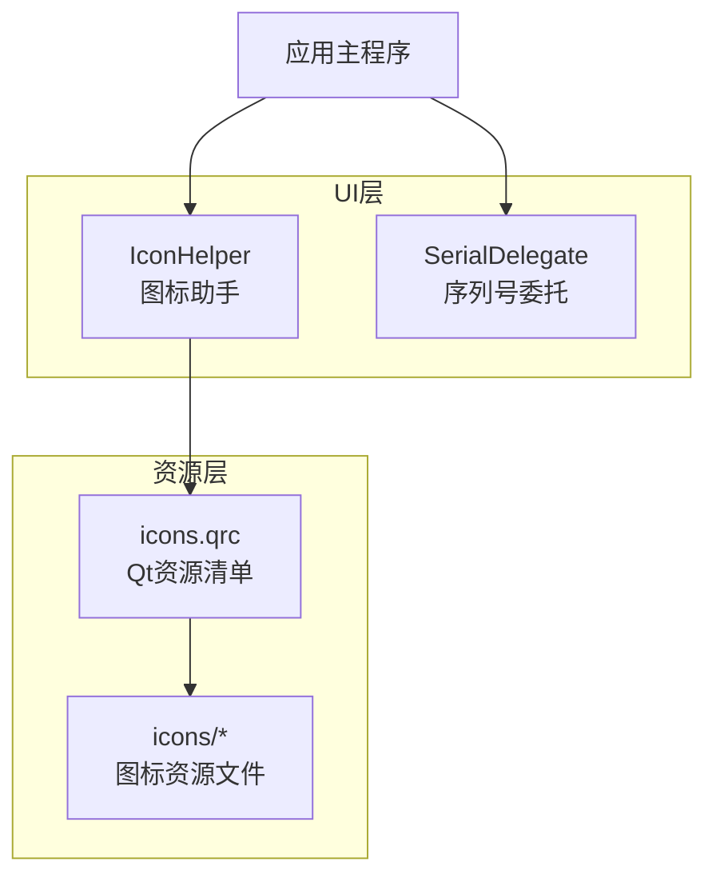
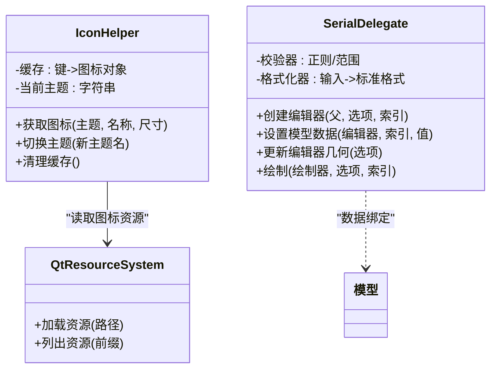
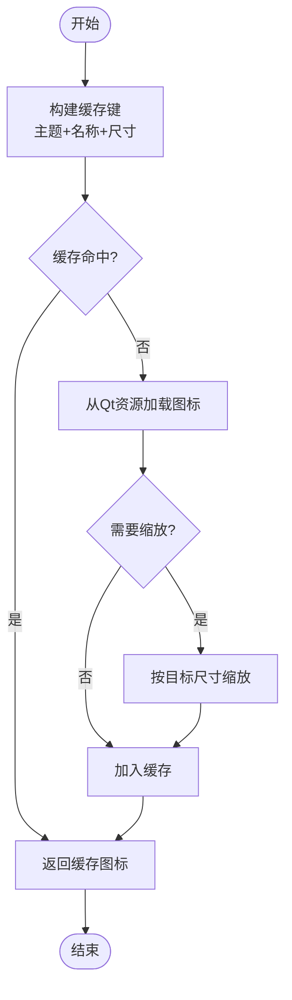
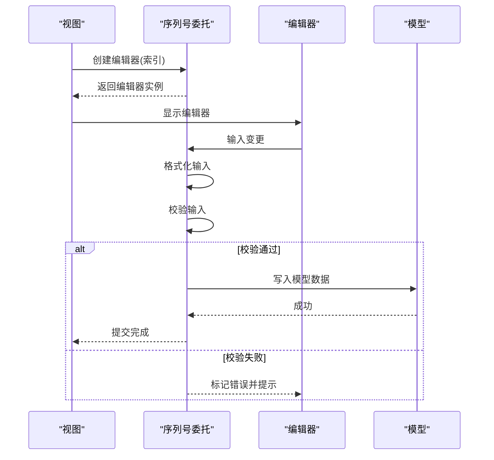
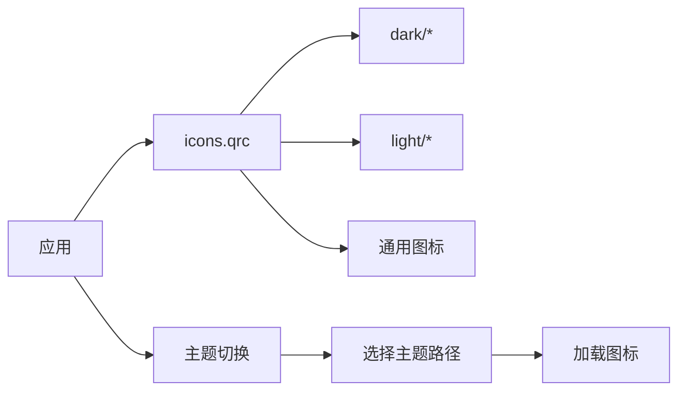
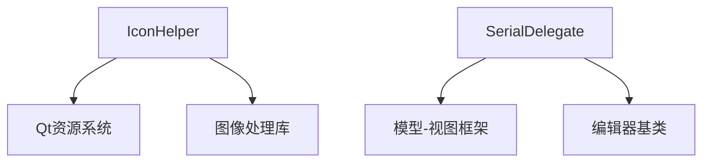

# UI辅助工具

<cite>
**本文引用的文件**   
- [IconHelper.h](file://src/ui/IconHelper.h)
- [IconHelper.cpp](file://src/ui/IconHelper.cpp)
- [SerialDelegate.h](file://src/ui/SerialDelegate.h)
- [SerialDelegate.cpp](file://src/ui/SerialDelegate.cpp)
- [icons.qrc](file://resources/icons.qrc)
</cite>

## 目录
1. [简介](#简介)
2. [项目结构](#项目结构)
3. [核心组件](#核心组件)
4. [架构总览](#架构总览)
5. [详细组件分析](#详细组件分析)
6. [依赖关系分析](#依赖关系分析)
7. [性能考虑](#性能考虑)
8. [故障排查指南](#故障排查指南)
9. [结论](#结论)
10. [附录](#附录)

## 简介
本文件面向UI辅助工具组件，聚焦以下目标：
- 图标管理系统的架构、资源组织与动态加载机制
- 序列号委托的实现原理、数据绑定与编辑能力
- 图标主题切换、尺寸适配与多分辨率支持
- 序列号格式化、验证与批量处理
- 扩展接口与自定义开发指南
- 性能优化与资源缓存策略

该文档以代码级为依据，结合架构图与流程图，帮助开发者快速理解并扩展相关功能。

## 项目结构
UI辅助工具主要位于 src/ui 目录，包含图标助手与序列号委托两个关键模块；图标资源集中管理于 resources/icons 并通过 Qt 资源系统注册。

图表来源
- [IconHelper.h](file://src/ui/IconHelper.h)
- [IconHelper.cpp](file://src/ui/IconHelper.cpp)
- [SerialDelegate.h](file://src/ui/SerialDelegate.h)
- [SerialDelegate.cpp](file://src/ui/SerialDelegate.cpp)
- [icons.qrc](file://resources/icons.qrc)

章节来源
- [IconHelper.h](file://src/ui/IconHelper.h)
- [IconHelper.cpp](file://src/ui/IconHelper.cpp)
- [SerialDelegate.h](file://src/ui/SerialDelegate.h)
- [SerialDelegate.cpp](file://src/ui/SerialDelegate.cpp)
- [icons.qrc](file://resources/icons.qrc)

## 核心组件
- 图标助手（IconHelper）
  - 负责图标资源的统一获取、主题切换、尺寸适配与缓存
  - 通过 Qt 资源系统加载图标，支持按主题路径前缀选择不同资源
  - 提供统一的API供界面控件使用，避免分散的资源访问逻辑
- 序列号委托（SerialDelegate）
  - 为表格或列表中的序列号字段提供编辑器与校验器
  - 实现输入格式化、合法性校验、撤销/重做集成
  - 支持批量编辑与数据绑定到模型

章节来源
- [IconHelper.h](file://src/ui/IconHelper.h)
- [IconHelper.cpp](file://src/ui/IconHelper.cpp)
- [SerialDelegate.h](file://src/ui/SerialDelegate.h)
- [SerialDelegate.cpp](file://src/ui/SerialDelegate.cpp)

## 架构总览
图标管理与序列号编辑在UI层解耦，分别承担“资源呈现”和“数据交互”职责。图标资源由Qt资源系统集中管理，委托通过模型-视图模式与业务数据交互。

图表来源
- [IconHelper.h](file://src/ui/IconHelper.h)
- [IconHelper.cpp](file://src/ui/IconHelper.cpp)
- [SerialDelegate.h](file://src/ui/SerialDelegate.h)
- [SerialDelegate.cpp](file://src/ui/SerialDelegate.cpp)

## 详细组件分析

### 图标助手（IconHelper）
- 设计要点
  - 主题切换：通过主题名前缀动态选择资源路径，如 dark/light 主题
  - 尺寸适配：根据DPI与显示缩放自动调整图标尺寸，保证清晰度
  - 多分辨率：支持 @2x/@3x 等后缀资源，优先匹配最佳分辨率
  - 缓存策略：对已加载的图标进行内存缓存，减少重复IO与解码开销
- 典型流程
  - 请求图标 -> 计算缓存键（主题+名称+尺寸）-> 命中则返回 -> 未命中则从资源加载并缓存

图表来源
- [IconHelper.cpp](file://src/ui/IconHelper.cpp)

章节来源
- [IconHelper.h](file://src/ui/IconHelper.h)
- [IconHelper.cpp](file://src/ui/IconHelper.cpp)

### 序列号委托（SerialDelegate）
- 设计要点
  - 数据绑定：基于模型索引读写数据，确保与视图同步
  - 编辑器：提供行内编辑器（如 QLineEdit），支持即时反馈
  - 格式化：将用户输入转换为标准序列号格式（如补零、分隔符）
  - 验证：内置校验器，拒绝非法输入并给出提示
  - 批量处理：支持选中多行后统一修改，提升效率
- 交互时序

图表来源
- [SerialDelegate.cpp](file://src/ui/SerialDelegate.cpp)

章节来源
- [SerialDelegate.h](file://src/ui/SerialDelegate.h)
- [SerialDelegate.cpp](file://src/ui/SerialDelegate.cpp)

### 图标资源组织与动态加载
- 资源组织
  - 所有图标集中在 resources/icons 目录
  - 通过 icons.qrc 声明资源路径与别名，便于跨平台打包与访问
- 动态加载
  - 运行时根据主题与尺寸动态选择资源
  - 支持热切换主题，无需重启应用

图表来源
- [icons.qrc](file://resources/icons.qrc)

章节来源
- [icons.qrc](file://resources/icons.qrc)

## 依赖关系分析
- IconHelper 依赖 Qt 资源系统与图像缩放能力
- SerialDelegate 依赖模型-视图框架与编辑器基类
- 两者均不直接耦合业务逻辑，保持高内聚低耦合

图表来源
- [IconHelper.h](file://src/ui/IconHelper.h)
- [IconHelper.cpp](file://src/ui/IconHelper.cpp)
- [SerialDelegate.h](file://src/ui/SerialDelegate.h)
- [SerialDelegate.cpp](file://src/ui/SerialDelegate.cpp)

章节来源
- [IconHelper.h](file://src/ui/IconHelper.h)
- [IconHelper.cpp](file://src/ui/IconHelper.cpp)
- [SerialDelegate.h](file://src/ui/SerialDelegate.h)
- [SerialDelegate.cpp](file://src/ui/SerialDelegate.cpp)

## 性能考虑
- 图标缓存
  - 使用键值缓存避免重复解码与缩放
  - 合理设置缓存上限与淘汰策略，防止内存膨胀
- 按需加载
  - 延迟加载大图标，仅在可见区域或首次使用时加载
- 批量操作
  - 序列号批量编辑时合并模型更新，减少信号触发次数
- 资源瘦身
  - 按主题与分辨率拆分资源，减少包体大小
- 渲染优化
  - 避免在主线程执行耗时解码，必要时异步加载

[本节为通用指导，不直接分析具体文件]

## 故障排查指南
- 图标不显示或主题切换无效
  - 检查 icons.qrc 中路径是否正确
  - 确认主题命名与路径前缀一致
  - 查看缓存是否被异常清空
- 序列号输入无法保存
  - 检查校验规则是否过于严格
  - 确认模型索引与权限设置正确
  - 查看编辑器返回值与模型写入回调
- 性能问题
  - 监控缓存命中率与内存占用
  - 评估批量操作的粒度与频率

章节来源
- [IconHelper.cpp](file://src/ui/IconHelper.cpp)
- [SerialDelegate.cpp](file://src/ui/SerialDelegate.cpp)

## 结论
图标助手与序列号委托在UI层提供了稳定、可扩展的基础能力。通过资源集中管理、主题切换、尺寸适配与缓存策略，保证了良好的用户体验与性能表现。序列号委托在数据绑定、格式化与验证方面具备完善的交互闭环，适合在复杂表单与表格场景中使用。

[本节为总结性内容，不直接分析具体文件]

## 附录
- 扩展接口建议
  - 为图标助手增加插件式主题加载器，支持外部主题包
  - 为序列号委托提供可插拔的校验器与格式化器
- 最佳实践
  - 统一图标命名规范，便于自动化生成与检索
  - 序列号规则集中配置，便于全局维护与版本升级

[本节为概念性内容，不直接分析具体文件]