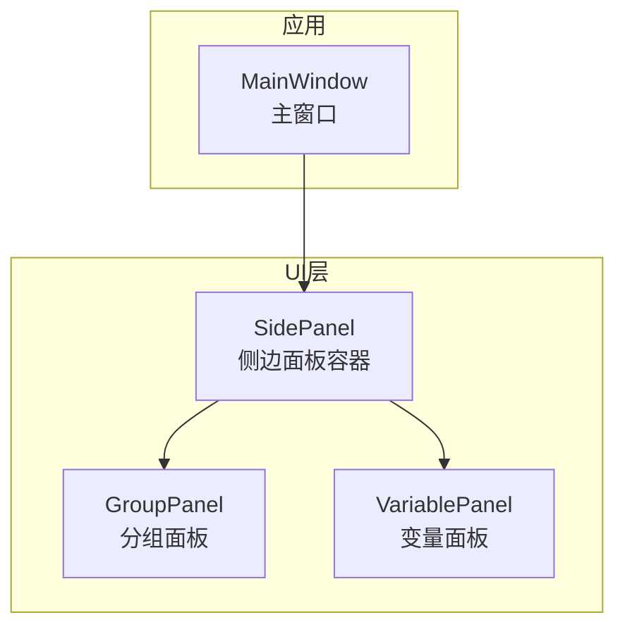
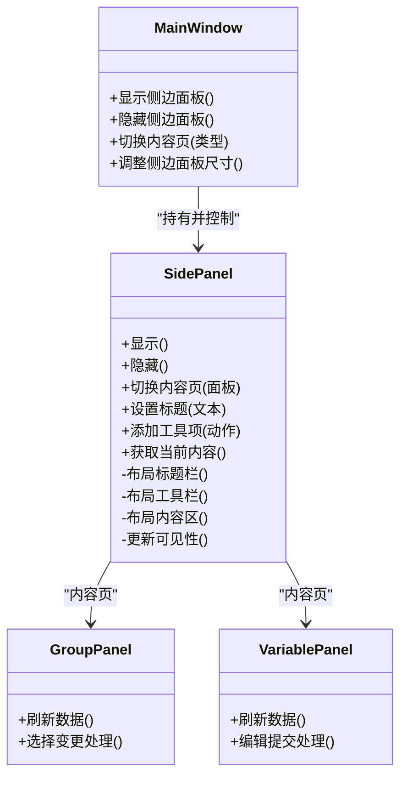
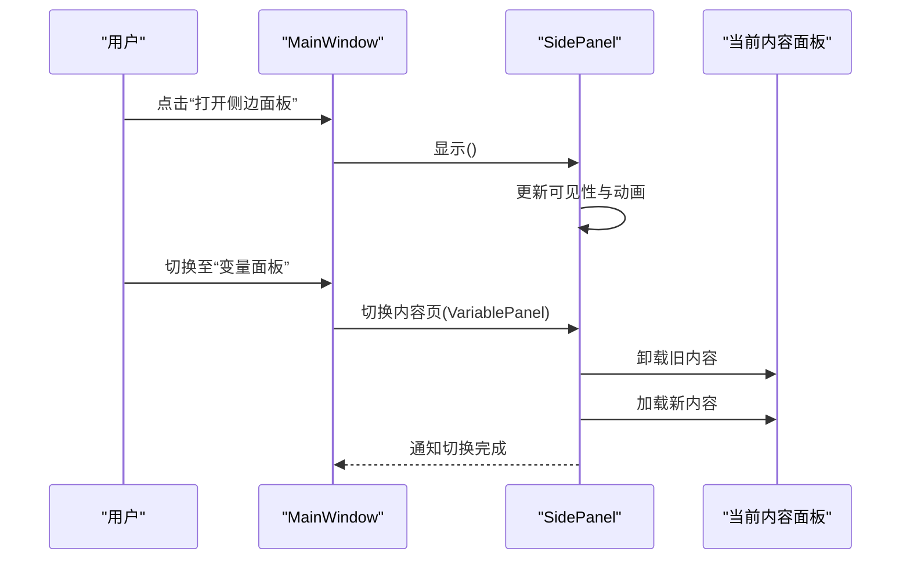
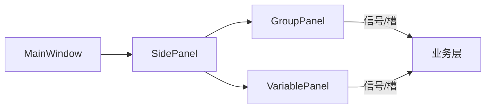

# 侧边面板

<cite>
**本文引用的文件**   
- [SidePanel.h](file://src/ui/SidePanel.h)
- [SidePanel.cpp](file://src/ui/SidePanel.cpp)
- [GroupPanel.h](file://src/ui/GroupPanel.h)
- [GroupPanel.cpp](file://src/ui/GroupPanel.cpp)
- [VariablePanel.h](file://src/ui/VariablePanel.h)
- [VariablePanel.cpp](file://src/ui/VariablePanel.cpp)
- [MainWindow.h](file://src/app/MainWindow.h)
- [MainWindow.cpp](file://src/app/MainWindow.cpp)
</cite>

## 目录
1. [简介](#简介)
2. [项目结构](#项目结构)
3. [核心组件](#核心组件)
4. [架构总览](#架构总览)
5. [详细组件分析](#详细组件分析)
6. [依赖关系分析](#依赖关系分析)
7. [性能考量](#性能考量)
8. [故障排查指南](#故障排查指南)
9. [结论](#结论)
10. [附录](#附录)

## 简介
本文件为“侧边面板”组件的完整技术文档，面向开发者与使用者，系统阐述其整体布局、导航结构、用户交互模式、显示/隐藏逻辑、内容切换机制与状态管理。同时覆盖标题栏、工具栏与功能区域的实现要点，提供样式定制与主题适配建议，并说明与其他UI组件的通信机制和数据绑定方式。最后给出响应式设计与移动端适配的实践指导。

## 项目结构
侧边面板位于 UI 层，由通用容器 SidePanel 与多个具体面板（如 GroupPanel、VariablePanel）组成。主窗口 MainWindow 负责承载与调度侧边面板的显示与切换。

图表来源
- [MainWindow.h](file://src/app/MainWindow.h)
- [MainWindow.cpp](file://src/app/MainWindow.cpp)
- [SidePanel.h](file://src/ui/SidePanel.h)
- [SidePanel.cpp](file://src/ui/SidePanel.cpp)
- [GroupPanel.h](file://src/ui/GroupPanel.h)
- [GroupPanel.cpp](file://src/ui/GroupPanel.cpp)
- [VariablePanel.h](file://src/ui/VariablePanel.h)
- [VariablePanel.cpp](file://src/ui/VariablePanel.cpp)

章节来源
- [SidePanel.h](file://src/ui/SidePanel.h)
- [SidePanel.cpp](file://src/ui/SidePanel.cpp)
- [GroupPanel.h](file://src/ui/GroupPanel.h)
- [GroupPanel.cpp](file://src/ui/GroupPanel.cpp)
- [VariablePanel.h](file://src/ui/VariablePanel.h)
- [VariablePanel.cpp](file://src/ui/VariablePanel.cpp)
- [MainWindow.h](file://src/app/MainWindow.h)
- [MainWindow.cpp](file://src/app/MainWindow.cpp)

## 核心组件
- SidePanel：侧边面板容器，负责标题栏、工具栏、内容区布局以及显示/隐藏动画与事件转发。
- GroupPanel：分组相关内容的展示与操作面板，作为 SidePanel 的内容页之一。
- VariablePanel：变量相关内容的展示与操作面板，作为 SidePanel 的内容页之一。
- MainWindow：主窗口，持有 SidePanel 实例，提供切换、停靠、尺寸约束等能力。

章节来源
- [SidePanel.h](file://src/ui/SidePanel.h)
- [SidePanel.cpp](file://src/ui/SidePanel.cpp)
- [GroupPanel.h](file://src/ui/GroupPanel.h)
- [GroupPanel.cpp](file://src/ui/GroupPanel.cpp)
- [VariablePanel.h](file://src/ui/VariablePanel.h)
- [VariablePanel.cpp](file://src/ui/VariablePanel.cpp)
- [MainWindow.h](file://src/app/MainWindow.h)
- [MainWindow.cpp](file://src/app/MainWindow.cpp)

## 架构总览
侧边面板采用“容器 + 内容页”的分层设计。SidePanel 作为统一容器，对外暴露显示/隐藏、切换内容页、设置标题与工具项等接口；内部通过布局管理器组织标题栏、工具栏与内容区。具体业务面板（GroupPanel、VariablePanel）以插件化方式注入到 SidePanel 中，实现关注点分离与可扩展性。

图表来源
- [MainWindow.h](file://src/app/MainWindow.h)
- [MainWindow.cpp](file://src/app/MainWindow.cpp)
- [SidePanel.h](file://src/ui/SidePanel.h)
- [SidePanel.cpp](file://src/ui/SidePanel.cpp)
- [GroupPanel.h](file://src/ui/GroupPanel.h)
- [GroupPanel.cpp](file://src/ui/GroupPanel.cpp)
- [VariablePanel.h](file://src/ui/VariablePanel.h)
- [VariablePanel.cpp](file://src/ui/VariablePanel.cpp)

## 详细组件分析

### SidePanel 容器
- 布局结构
  - 标题栏：显示面板名称、可包含最小化/关闭按钮。
  - 工具栏：放置常用操作按钮或下拉菜单。
  - 内容区：承载具体业务面板（GroupPanel、VariablePanel）。
- 显示/隐藏逻辑
  - 提供统一的显示与隐藏接口，内部维护可见状态，并通过动画过渡提升用户体验。
  - 支持键盘快捷键触发显示/隐藏。
- 内容切换机制
  - 通过切换内容区子控件实现页面切换，切换时自动更新标题与工具栏。
  - 支持懒加载与缓存策略，避免重复初始化开销。
- 状态管理
  - 维护当前激活面板、标题文本、工具项集合、可见性等状态。
  - 对外暴露信号/槽或回调，用于通知外部状态变化。
- 样式与主题
  - 提供样式表入口，允许自定义颜色、字体、间距等。
  - 支持跟随系统主题或应用主题切换。

图表来源
- [MainWindow.h](file://src/app/MainWindow.h)
- [MainWindow.cpp](file://src/app/MainWindow.cpp)
- [SidePanel.h](file://src/ui/SidePanel.h)
- [SidePanel.cpp](file://src/ui/SidePanel.cpp)

章节来源
- [SidePanel.h](file://src/ui/SidePanel.h)
- [SidePanel.cpp](file://src/ui/SidePanel.cpp)

### GroupPanel 分组面板
- 职责：展示与管理分组信息，支持列表/树形视图、筛选与排序。
- 交互：选中项变更、批量操作、上下文菜单。
- 数据绑定：与模型/文档层通过信号/槽或回调进行双向绑定。
- 样式：支持行高、图标、选中态样式定制。

章节来源
- [GroupPanel.h](file://src/ui/GroupPanel.h)
- [GroupPanel.cpp](file://src/ui/GroupPanel.cpp)

### VariablePanel 变量面板
- 职责：展示变量定义、表达式与计算结果，支持编辑与校验。
- 交互：单元格编辑、撤销/重做、错误提示。
- 数据绑定：与参数化文档或表达式引擎联动，实时刷新。
- 样式：支持语法高亮、错误标记、主题适配。

章节来源
- [VariablePanel.h](file://src/ui/VariablePanel.h)
- [VariablePanel.cpp](file://src/ui/VariablePanel.cpp)

### MainWindow 主窗口集成
- 职责：创建并持有 SidePanel，提供全局快捷键、停靠与尺寸管理。
- 集成点：在窗口布局中嵌入 SidePanel，监听用户操作并调用 SidePanel 接口。
- 主题：与应用主题同步，确保侧边面板风格一致。

章节来源
- [MainWindow.h](file://src/app/MainWindow.h)
- [MainWindow.cpp](file://src/app/MainWindow.cpp)

## 依赖关系分析
- SidePanel 依赖 Qt 布局与控件体系，组合 GroupPanel 与 VariablePanel 作为内容页。
- MainWindow 依赖 SidePanel 的公共接口，不直接访问内容页细节。
- 各面板与业务层（如参数化文档、表达式引擎）通过解耦的信号/槽或回调通信，降低耦合度。

图表来源
- [MainWindow.h](file://src/app/MainWindow.h)
- [MainWindow.cpp](file://src/app/MainWindow.cpp)
- [SidePanel.h](file://src/ui/SidePanel.h)
- [SidePanel.cpp](file://src/ui/SidePanel.cpp)
- [GroupPanel.h](file://src/ui/GroupPanel.h)
- [GroupPanel.cpp](file://src/ui/GroupPanel.cpp)
- [VariablePanel.h](file://src/ui/VariablePanel.h)
- [VariablePanel.cpp](file://src/ui/VariablePanel.cpp)

章节来源
- [SidePanel.h](file://src/ui/SidePanel.h)
- [SidePanel.cpp](file://src/ui/SidePanel.cpp)
- [GroupPanel.h](file://src/ui/GroupPanel.h)
- [GroupPanel.cpp](file://src/ui/GroupPanel.cpp)
- [VariablePanel.h](file://src/ui/VariablePanel.h)
- [VariablePanel.cpp](file://src/ui/VariablePanel.cpp)
- [MainWindow.h](file://src/app/MainWindow.h)
- [MainWindow.cpp](file://src/app/MainWindow.cpp)

## 性能考量
- 懒加载与缓存：仅在切换时加载内容页，已加载面板保持状态，减少重复初始化。
- 渲染优化：大列表使用虚拟滚动或分页加载，避免一次性构建过多控件。
- 动画节流：显示/隐藏动画使用硬件加速，必要时限制帧率。
- 事件去抖：高频输入（如搜索、过滤）采用防抖与节流策略。
- 内存管理：及时释放不再使用的临时对象，避免内存泄漏。

## 故障排查指南
- 面板无法显示
  - 检查可见状态与父窗口层级是否正确。
  - 确认动画未阻塞主线程。
- 内容切换异常
  - 验证切换前后标题与工具栏是否同步更新。
  - 检查内容页生命周期（构造/析构）是否被正确管理。
- 数据不同步
  - 核对信号/槽连接是否建立，回调是否被触发。
  - 确认数据源变更事件是否广播。
- 样式错乱
  - 检查样式表优先级与继承规则。
  - 验证主题切换后样式资源是否重新加载。

章节来源
- [SidePanel.h](file://src/ui/SidePanel.h)
- [SidePanel.cpp](file://src/ui/SidePanel.cpp)
- [GroupPanel.h](file://src/ui/GroupPanel.h)
- [GroupPanel.cpp](file://src/ui/GroupPanel.cpp)
- [VariablePanel.h](file://src/ui/VariablePanel.h)
- [VariablePanel.cpp](file://src/ui/VariablePanel.cpp)
- [MainWindow.h](file://src/app/MainWindow.h)
- [MainWindow.cpp](file://src/app/MainWindow.cpp)

## 结论
侧边面板通过容器与内容页的清晰分层，实现了灵活的显示/隐藏、内容切换与状态管理。配合统一的样式与主题机制，能够良好地融入整体 UI 风格。建议在后续迭代中持续优化性能与可访问性，完善单元测试与回归测试，确保扩展性与稳定性。

## 附录
- 响应式设计建议
  - 根据屏幕宽度动态调整侧边面板宽度与折叠行为。
  - 在小屏设备上优先保留关键操作，次要功能收纳至二级菜单。
- 移动端适配
  - 使用手势滑入/滑出替代按钮切换。
  - 增大触控区域，优化触摸反馈。
- 主题适配方案
  - 基于调色板与样式表实现明暗主题切换。
  - 提供默认与自定义主题配置文件，便于品牌化定制。
- 与其他组件通信
  - 通过信号/槽或事件总线进行松耦合通信。
  - 对复杂数据交换建议使用序列化格式（如 JSON）进行跨模块传递。