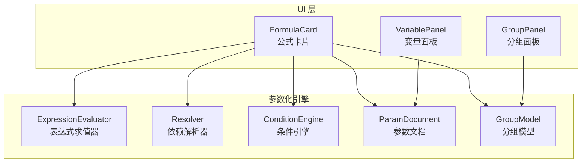
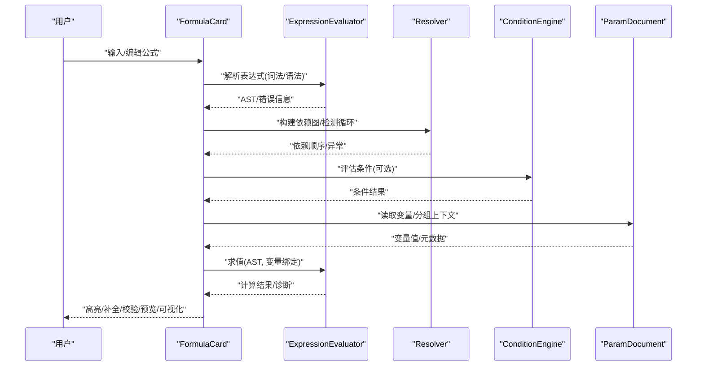
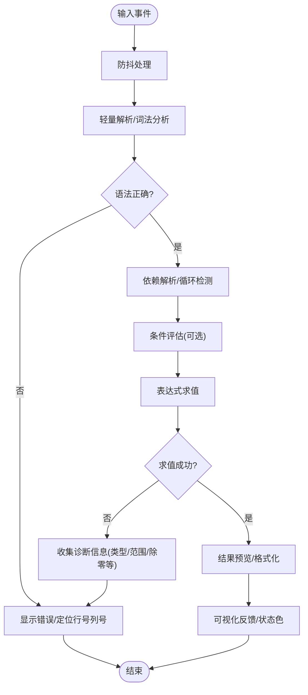
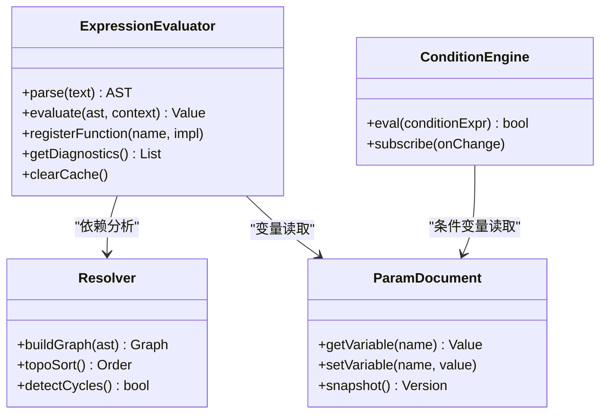
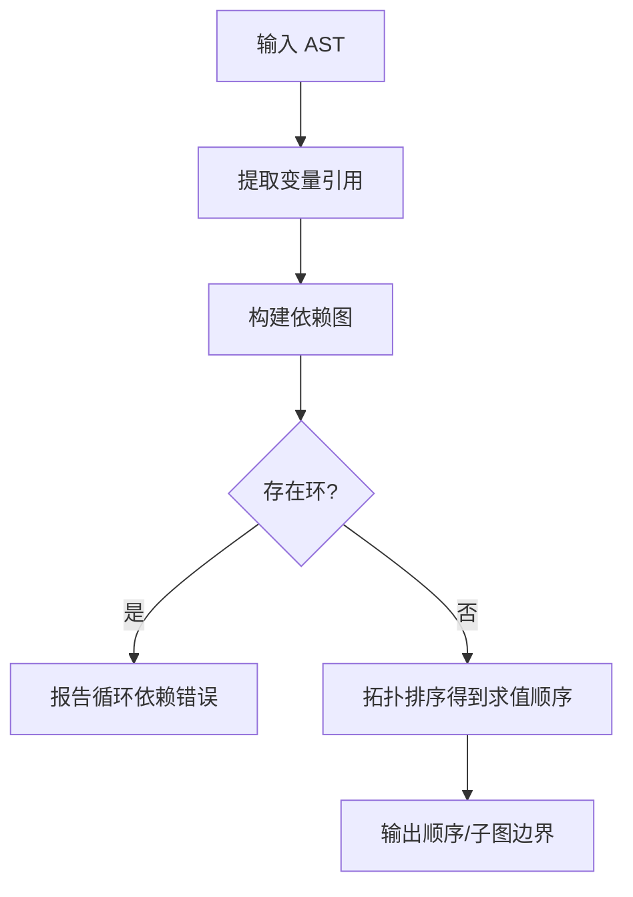
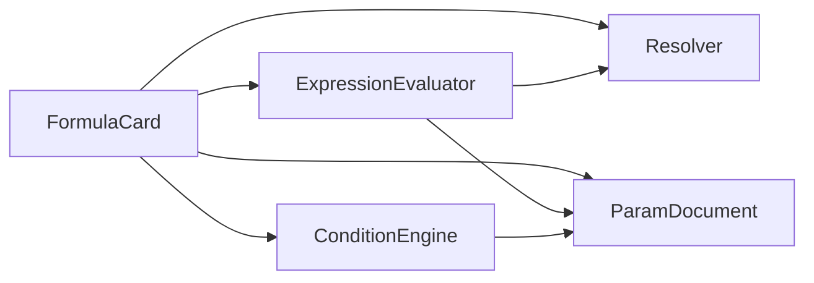

# 公式卡片

<cite>
**本文引用的文件**   
- [FormulaCard.h](file://src/ui/FormulaCard.h)
- [FormulaCard.cpp](file://src/ui/FormulaCard.cpp)
- [ExpressionEvaluator.h](file://src/parametric/ExpressionEvaluator.h)
- [ExpressionEvaluator.cpp](file://src/parametric/ExpressionEvaluator.cpp)
- [Resolver.h](file://src/parametric/Resolver.h)
- [Resolver.cpp](file://src/parametric/Resolver.cpp)
- [ConditionEngine.h](file://src/parametric/ConditionEngine.h)
- [ConditionEngine.cpp](file://src/parametric/ConditionEngine.cpp)
- [Variable.h](file://src/parametric/Variable.h)
- [ParamDocument.h](file://src/parametric/ParamDocument.h)
- [GroupModel.h](file://src/parametric/GroupModel.h)
- [test_expression.cpp](file://tests/test_expression.cpp)
- [test_resolver.cpp](file://tests/test_resolver.cpp)
</cite>

## 目录
1. [简介](#简介)
2. [项目结构](#项目结构)
3. [核心组件](#核心组件)
4. [架构总览](#架构总览)
5. [详细组件分析](#详细组件分析)
6. [依赖关系分析](#依赖关系分析)
7. [性能考虑](#性能考虑)
8. [故障排查指南](#故障排查指南)
9. [结论](#结论)
10. [附录](#附录)

## 简介
本文件为“公式卡片”组件的完整技术文档，聚焦于公式输入框的语法高亮、自动补全与实时验证；记录公式解析器集成、错误检测与调试信息展示；提供公式模板库、常用函数参考与示例代码；说明计算结果预览与可视化反馈；并覆盖版本管理与变更历史追踪、性能监控与优化建议。该组件位于 UI 层（src/ui），通过参数化引擎（src/parametric）完成表达式解析、求值与条件约束，测试用例位于 tests 目录。

## 项目结构
公式卡片相关代码主要分布在以下模块：
- UI 层：FormulaCard（公式卡片）、VariablePanel/GroupPanel（变量与分组面板）
- 参数化引擎：ExpressionEvaluator（表达式求值）、Resolver（依赖解析）、ConditionEngine（条件引擎）、ParamDocument（文档级状态）、GroupModel（分组模型）
- 测试：test_expression、test_resolver

图表来源
- [FormulaCard.h](file://src/ui/FormulaCard.h)
- [FormulaCard.cpp](file://src/ui/FormulaCard.cpp)
- [ExpressionEvaluator.h](file://src/parametric/ExpressionEvaluator.h)
- [ExpressionEvaluator.cpp](file://src/parametric/ExpressionEvaluator.cpp)
- [Resolver.h](file://src/parametric/Resolver.h)
- [Resolver.cpp](file://src/parametric/Resolver.cpp)
- [ConditionEngine.h](file://src/parametric/ConditionEngine.h)
- [ConditionEngine.cpp](file://src/parametric/ConditionEngine.cpp)
- [ParamDocument.h](file://src/parametric/ParamDocument.h)
- [GroupModel.h](file://src/parametric/GroupModel.h)

章节来源
- [FormulaCard.h](file://src/ui/FormulaCard.h)
- [FormulaCard.cpp](file://src/ui/FormulaCard.cpp)
- [ExpressionEvaluator.h](file://src/parametric/ExpressionEvaluator.h)
- [ExpressionEvaluator.cpp](file://src/parametric/ExpressionEvaluator.cpp)
- [Resolver.h](file://src/parametric/Resolver.h)
- [Resolver.cpp](file://src/parametric/Resolver.cpp)
- [ConditionEngine.h](file://src/parametric/ConditionEngine.h)
- [ConditionEngine.cpp](file://src/parametric/ConditionEngine.cpp)
- [ParamDocument.h](file://src/parametric/ParamDocument.h)
- [GroupModel.h](file://src/parametric/GroupModel.h)

## 核心组件
- 公式卡片（FormulaCard）
  - 负责公式输入框的交互：语法高亮、自动补全、实时校验、错误提示、结果预览与可视化反馈。
  - 与表达式求值器、依赖解析器、条件引擎和文档/分组模型交互，实现即时计算与联动更新。
- 表达式求值器（ExpressionEvaluator）
  - 负责词法/语法解析、符号表构建、表达式树生成与求值。
  - 支持内置函数、变量替换、单位换算与数值精度控制。
- 依赖解析器（Resolver）
  - 基于变量引用构建依赖图，进行拓扑排序与循环依赖检测。
  - 提供增量重算能力，减少不必要的重新求值。
- 条件引擎（ConditionEngine）
  - 解析并执行条件表达式，驱动可见性、启用状态与分支逻辑。
- 参数文档（ParamDocument）与分组模型（GroupModel）
  - 管理全局变量、分组与版本快照，支撑撤销/重做与变更历史追踪。

章节来源
- [FormulaCard.h](file://src/ui/FormulaCard.h)
- [FormulaCard.cpp](file://src/ui/FormulaCard.cpp)
- [ExpressionEvaluator.h](file://src/parametric/ExpressionEvaluator.h)
- [ExpressionEvaluator.cpp](file://src/parametric/ExpressionEvaluator.cpp)
- [Resolver.h](file://src/parametric/Resolver.h)
- [Resolver.cpp](file://src/parametric/Resolver.cpp)
- [ConditionEngine.h](file://src/parametric/ConditionEngine.h)
- [ConditionEngine.cpp](file://src/parametric/ConditionEngine.cpp)
- [ParamDocument.h](file://src/parametric/ParamDocument.h)
- [GroupModel.h](file://src/parametric/GroupModel.h)

## 架构总览
公式卡片作为 UI 入口，将用户输入转换为表达式请求，交由解析器与求值器处理，最终回写结果与状态到 UI。

图表来源
- [FormulaCard.cpp](file://src/ui/FormulaCard.cpp)
- [ExpressionEvaluator.cpp](file://src/parametric/ExpressionEvaluator.cpp)
- [Resolver.cpp](file://src/parametric/Resolver.cpp)
- [ConditionEngine.cpp](file://src/parametric/ConditionEngine.cpp)
- [ParamDocument.h](file://src/parametric/ParamDocument.h)

## 详细组件分析

### 公式卡片（FormulaCard）
- 功能要点
  - 语法高亮：基于表达式 AST 或词法单元对关键字、函数名、变量名、运算符着色。
  - 自动补全：根据当前光标位置与上下文，提供变量、函数、常量与模板片段补全。
  - 实时验证：在输入过程中触发轻量级解析与类型检查，即时反馈错误与警告。
  - 结果预览：显示最近一次成功求值的结果，支持单位与格式转换。
  - 可视化反馈：以颜色、图标或迷你图表展示状态（有效/无效/计算中/被条件隐藏等）。
- 交互流程
  - 输入事件 -> 防抖 -> 解析 -> 依赖分析 -> 条件判断 -> 求值 -> 渲染预览与提示。
- 关键接口（概念性描述）
  - 设置/获取公式文本
  - 注册变量与函数补全项
  - 订阅求值结果与错误事件
  - 切换主题与高亮样式
  - 导出/导入公式与模板

图表来源
- [FormulaCard.cpp](file://src/ui/FormulaCard.cpp)
- [ExpressionEvaluator.cpp](file://src/parametric/ExpressionEvaluator.cpp)
- [Resolver.cpp](file://src/parametric/Resolver.cpp)
- [ConditionEngine.cpp](file://src/parametric/ConditionEngine.cpp)

章节来源
- [FormulaCard.h](file://src/ui/FormulaCard.h)
- [FormulaCard.cpp](file://src/ui/FormulaCard.cpp)

### 表达式求值器（ExpressionEvaluator）
- 职责
  - 词法分析、语法分析、AST 构建、符号表管理、函数注册、求值与误差控制。
- 关键点
  - 内置函数集：数学、几何、字符串、日期时间、条件与聚合函数。
  - 变量绑定：从 ParamDocument/GroupModel 注入上下文变量。
  - 错误分类：语法错误、语义错误（未定义符号/类型不匹配）、运行时错误（除零/越界）。
  - 性能：AST 缓存、增量求值、表达式去重与短路求值。

图表来源
- [ExpressionEvaluator.h](file://src/parametric/ExpressionEvaluator.h)
- [ExpressionEvaluator.cpp](file://src/parametric/ExpressionEvaluator.cpp)
- [Resolver.h](file://src/parametric/Resolver.h)
- [Resolver.cpp](file://src/parametric/Resolver.cpp)
- [ConditionEngine.h](file://src/parametric/ConditionEngine.h)
- [ConditionEngine.cpp](file://src/parametric/ConditionEngine.cpp)
- [ParamDocument.h](file://src/parametric/ParamDocument.h)

章节来源
- [ExpressionEvaluator.h](file://src/parametric/ExpressionEvaluator.h)
- [ExpressionEvaluator.cpp](file://src/parametric/ExpressionEvaluator.cpp)
- [Resolver.h](file://src/parametric/Resolver.h)
- [Resolver.cpp](file://src/parametric/Resolver.cpp)
- [ConditionEngine.h](file://src/parametric/ConditionEngine.h)
- [ConditionEngine.cpp](file://src/parametric/ConditionEngine.cpp)
- [ParamDocument.h](file://src/parametric/ParamDocument.h)

### 依赖解析器（Resolver）
- 职责
  - 从 AST 提取变量引用，构建依赖有向无环图（DAG），输出安全求值顺序。
- 关键点
  - 循环依赖检测：发现后返回明确错误路径与冲突节点。
  - 增量更新：仅重算受影响子图，降低开销。
  - 作用域感知：区分局部变量与全局变量，避免命名冲突。

图表来源
- [Resolver.cpp](file://src/parametric/Resolver.cpp)
- [Resolver.h](file://src/parametric/Resolver.h)

章节来源
- [Resolver.h](file://src/parametric/Resolver.h)
- [Resolver.cpp](file://src/parametric/Resolver.cpp)

### 条件引擎（ConditionEngine）
- 职责
  - 解析条件表达式，返回布尔结果，驱动 UI 可见性与启用状态。
- 关键点
  - 条件缓存：相同表达式与变量组合复用结果。
  - 监听变化：当依赖变量改变时自动重算。

章节来源
- [ConditionEngine.h](file://src/parametric/ConditionEngine.h)
- [ConditionEngine.cpp](file://src/parametric/ConditionEngine.cpp)

### 变量与文档（Variable / ParamDocument / GroupModel）
- Variable：变量元数据（名称、类型、默认值、单位、取值范围、可见性等）。
- ParamDocument：文档级变量容器、版本快照、撤销/重做、批量操作。
- GroupModel：分组维度下的变量组织与继承关系。

章节来源
- [Variable.h](file://src/parametric/Variable.h)
- [ParamDocument.h](file://src/parametric/ParamDocument.h)
- [GroupModel.h](file://src/parametric/GroupModel.h)

### 测试与回归（tests）
- test_expression：覆盖表达式解析、求值、错误分类与边界情况。
- test_resolver：覆盖依赖图构建、循环检测与增量重算。

章节来源
- [test_expression.cpp](file://tests/test_expression.cpp)
- [test_resolver.cpp](file://tests/test_resolver.cpp)

## 依赖关系分析
- 耦合度
  - FormulaCard 强依赖 ExpressionEvaluator、Resolver、ConditionEngine 与 ParamDocument。
  - ExpressionEvaluator 依赖 Resolver 与 ParamDocument。
  - ConditionEngine 依赖 ParamDocument。
- 内聚性
  - 各组件职责清晰：UI 交互、解析求值、依赖分析、条件判断、文档管理。
- 外部依赖
  - 可能涉及 UI 框架（Qt）用于高亮与补全；数值库用于高精度计算（如有）。

图表来源
- [FormulaCard.h](file://src/ui/FormulaCard.h)
- [ExpressionEvaluator.h](file://src/parametric/ExpressionEvaluator.h)
- [Resolver.h](file://src/parametric/Resolver.h)
- [ConditionEngine.h](file://src/parametric/ConditionEngine.h)
- [ParamDocument.h](file://src/parametric/ParamDocument.h)

章节来源
- [FormulaCard.h](file://src/ui/FormulaCard.h)
- [ExpressionEvaluator.h](file://src/parametric/ExpressionEvaluator.h)
- [Resolver.h](file://src/parametric/Resolver.h)
- [ConditionEngine.h](file://src/parametric/ConditionEngine.h)
- [ParamDocument.h](file://src/parametric/ParamDocument.h)

## 性能考虑
- 输入侧
  - 防抖与节流：限制高频输入触发的解析频率。
  - 增量解析：仅对变更片段重建 AST 子树。
- 求值侧
  - AST 缓存：相同表达式复用结果。
  - 依赖最小重算：基于 Resolver 输出的顺序与边界，仅重算受影响节点。
  - 短路求值：条件表达式尽早返回。
- 内存与并发
  - 对象池：重用 AST 节点与临时对象。
  - 异步求值：后台线程计算，主线程仅渲染。
- 监控指标
  - 解析耗时、求值耗时、缓存命中率、错误率、CPU 占用。

[本节为通用指导，无需源码引用]

## 故障排查指南
- 常见问题
  - 语法错误：检查括号匹配、运算符优先级、函数签名。
  - 未定义变量：确认变量已注册且作用域可见。
  - 类型不匹配：确保操作数类型兼容。
  - 循环依赖：查看 Resolver 的错误路径，调整引用关系。
  - 除零/越界：增加边界保护与默认值。
- 调试信息
  - 错误消息包含：错误类型、位置（行/列）、上下文表达式片段、推荐修复。
  - 诊断日志：解析阶段、依赖阶段、求值阶段的中间状态。
- 复现步骤
  - 使用最小可复现公式与变量集，逐步缩小问题范围。
  - 借助单元测试模板快速构造用例。

章节来源
- [test_expression.cpp](file://tests/test_expression.cpp)
- [test_resolver.cpp](file://tests/test_resolver.cpp)

## 结论
公式卡片通过 UI 与参数化引擎的紧密协作，实现了强大的公式编辑体验：语法高亮、智能补全、实时校验、结果预览与可视化反馈。借助解析器与条件引擎，系统能够高效、可靠地处理复杂依赖与动态条件。配合版本管理与性能监控，可在大规模公式场景中保持稳定与高性能。

[本节为总结，无需源码引用]

## 附录

### 公式模板库（建议）
- 几何尺寸：周长、面积、对角线、角度换算
- 工程参数：公差、倒角、圆角、材料厚度
- 统计与聚合：均值、方差、分位数、阈值判定
- 条件分支：按变量区间选择不同计算公式

[本节为概念性内容，无需源码引用]

### 常用函数参考（建议）
- 数学：abs、sqrt、pow、sin、cos、tan、asin、acos、atan、round、ceil、floor
- 逻辑：if、and、or、not、max、min、clamp
- 字符串：concat、length、replace、substring、trim
- 日期时间：now、dateDiff、formatDate
- 单位换算：mm_to_in、cm_to_m、deg_to_rad

[本节为概念性内容，无需源码引用]

### 示例代码（概念性）
- 基础求值：输入简单算术表达式，验证结果与错误提示
- 变量引用：引用文档变量并进行单位换算
- 条件分支：根据变量区间选择不同公式
- 循环依赖检测：故意构造环并观察错误路径

[本节为概念性内容，无需源码引用]

### 版本管理与变更历史追踪
- 版本快照：每次提交保存公式与变量快照，支持对比与回滚
- 变更审计：记录修改人、时间、差异摘要
- 合并策略：冲突检测与自动/手动合并

[本节为概念性内容，无需源码引用]

### 性能监控与优化建议
- 指标采集：解析/求值耗时、缓存命中率、错误率
- 热点识别：频繁重算的表达式与变量
- 优化手段：AST 缓存、增量求值、异步计算、表达式简化

[本节为概念性内容，无需源码引用]