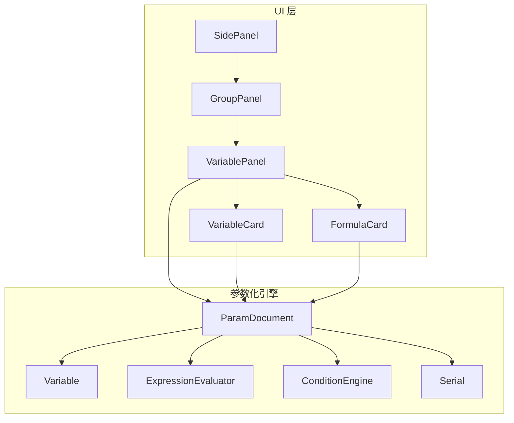
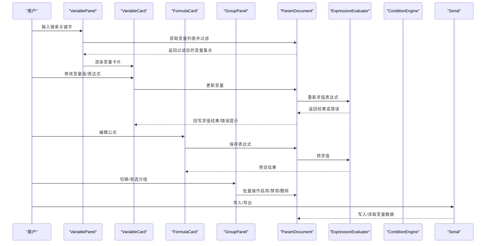
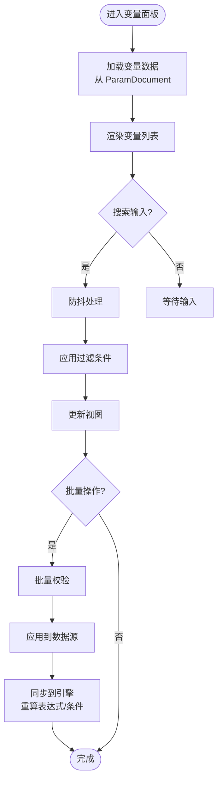
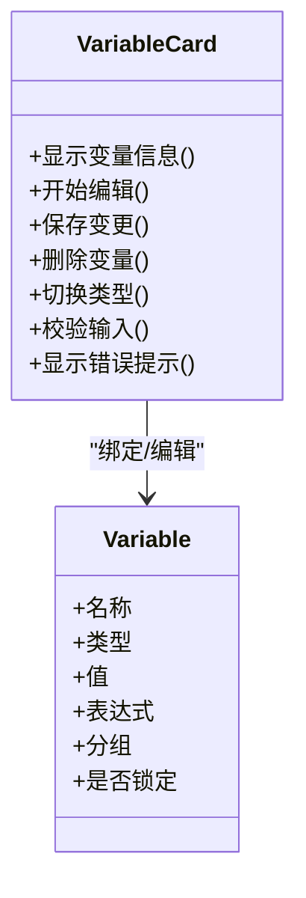
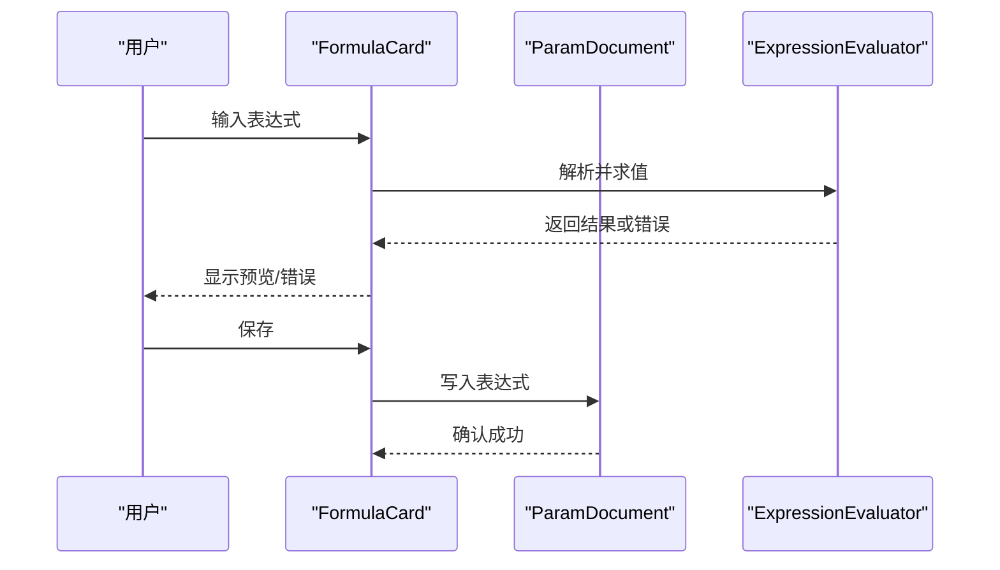
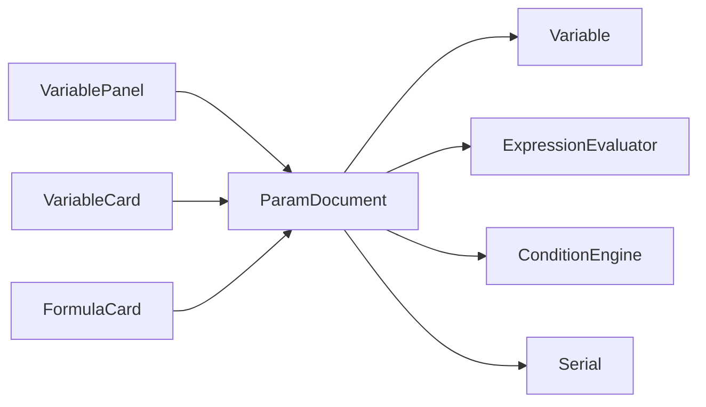

# 变量面板

<cite>
**本文引用的文件**   
- [VariablePanel.h](file://src/ui/VariablePanel.h)
- [VariablePanel.cpp](file://src/ui/VariablePanel.cpp)
- [VariableCard.h](file://src/ui/VariableCard.h)
- [VariableCard.cpp](file://src/ui/VariableCard.cpp)
- [FormulaCard.h](file://src/ui/FormulaCard.h)
- [FormulaCard.cpp](file://src/ui/FormulaCard.cpp)
- [GroupPanel.h](file://src/ui/GroupPanel.h)
- [GroupPanel.cpp](file://src/ui/GroupPanel.cpp)
- [SidePanel.h](file://src/ui/SidePanel.h)
- [SidePanel.cpp](file://src/ui/SidePanel.cpp)
- [Variable.h](file://src/parametric/Variable.h)
- [ParamDocument.h](file://src/parametric/ParamDocument.h)
- [ParamDocument.cpp](file://src/parametric/ParamDocument.cpp)
- [ExpressionEvaluator.h](file://src/parametric/ExpressionEvaluator.h)
- [ExpressionEvaluator.cpp](file://src/parametric/ExpressionEvaluator.cpp)
- [ConditionEngine.h](file://src/parametric/ConditionEngine.h)
- [ConditionEngine.cpp](file://src/parametric/ConditionEngine.cpp)
- [Serial.h](file://src/parametric/Serial.h)
- [Serial.cpp](file://src/parametric/Serial.cpp)
</cite>

## 目录
1. [简介](#简介)
2. [项目结构](#项目结构)
3. [核心组件](#核心组件)
4. [架构总览](#架构总览)
5. [详细组件分析](#详细组件分析)
6. [依赖关系分析](#依赖关系分析)
7. [性能考虑](#性能考虑)
8. [故障排查指南](#故障排查指南)
9. [结论](#结论)
10. [附录](#附录)

## 简介
本文件为“变量面板”组件的完整技术文档，面向前端与后端开发者，覆盖以下主题：
- 变量列表展示逻辑、搜索过滤与批量操作
- 变量卡片的创建、编辑、删除与排序机制
- 变量类型支持与验证规则、错误提示
- 变量与参数化引擎的数据同步机制
- 变量导入/导出功能与格式支持
- 性能优化策略与大数量变量的处理方案

## 项目结构
变量面板位于 UI 层（src/ui），与参数化引擎（src/parametric）通过数据模型与序列化模块交互。关键文件包括：
- 面板容器与布局：SidePanel、GroupPanel
- 变量列表与卡片：VariablePanel、VariableCard、FormulaCard
- 数据模型与引擎：ParamDocument、Variable、ExpressionEvaluator、ConditionEngine
- 序列化：Serial

**图表来源**
- [SidePanel.h](file://src/ui/SidePanel.h)
- [GroupPanel.h](file://src/ui/GroupPanel.h)
- [VariablePanel.h](file://src/ui/VariablePanel.h)
- [VariableCard.h](file://src/ui/VariableCard.h)
- [FormulaCard.h](file://src/ui/FormulaCard.h)
- [ParamDocument.h](file://src/parametric/ParamDocument.h)
- [Variable.h](file://src/parametric/Variable.h)
- [ExpressionEvaluator.h](file://src/parametric/ExpressionEvaluator.h)
- [ConditionEngine.h](file://src/parametric/ConditionEngine.h)
- [Serial.h](file://src/parametric/Serial.h)

**章节来源**
- [SidePanel.h](file://src/ui/SidePanel.h)
- [GroupPanel.h](file://src/ui/GroupPanel.h)
- [VariablePanel.h](file://src/ui/VariablePanel.h)
- [VariableCard.h](file://src/ui/VariableCard.h)
- [FormulaCard.h](file://src/ui/FormulaCard.h)
- [ParamDocument.h](file://src/parametric/ParamDocument.h)
- [Variable.h](file://src/parametric/Variable.h)
- [ExpressionEvaluator.h](file://src/parametric/ExpressionEvaluator.h)
- [ConditionEngine.h](file://src/parametric/ConditionEngine.h)
- [Serial.h](file://src/parametric/Serial.h)

## 核心组件
- 变量面板（VariablePanel）
  - 负责变量列表渲染、搜索过滤、批量选择与操作、拖拽排序、分页/虚拟化（视实现而定）
  - 与 ParamDocument 通信，执行增删改查与重排
- 变量卡片（VariableCard）
  - 单条变量的行内编辑、校验反馈、快捷操作（复制、删除、锁定等）
- 公式卡片（FormulaCard）
  - 表达式编辑与求值预览，联动 ExpressionEvaluator
- 分组面板（GroupPanel）
  - 变量分组展示与切换，支持分组级批量操作
- 侧边栏（SidePanel）
  - 承载多个面板（含变量面板），管理可见性与状态

**章节来源**
- [VariablePanel.h](file://src/ui/VariablePanel.h)
- [VariablePanel.cpp](file://src/ui/VariablePanel.cpp)
- [VariableCard.h](file://src/ui/VariableCard.h)
- [VariableCard.cpp](file://src/ui/VariableCard.cpp)
- [FormulaCard.h](file://src/ui/FormulaCard.h)
- [FormulaCard.cpp](file://src/ui/FormulaCard.cpp)
- [GroupPanel.h](file://src/ui/GroupPanel.h)
- [GroupPanel.cpp](file://src/ui/GroupPanel.cpp)
- [SidePanel.h](file://src/ui/SidePanel.h)
- [SidePanel.cpp](file://src/ui/SidePanel.cpp)

## 架构总览
变量面板采用“视图-模型-引擎”分层：
- 视图层：VariablePanel、VariableCard、FormulaCard、GroupPanel、SidePanel
- 模型层：ParamDocument（变量集合、分组、元数据）、Variable（变量定义）
- 引擎层：ExpressionEvaluator（表达式求值）、ConditionEngine（条件计算）、Serial（导入/导出）

**图表来源**
- [VariablePanel.cpp](file://src/ui/VariablePanel.cpp)
- [VariableCard.cpp](file://src/ui/VariableCard.cpp)
- [FormulaCard.cpp](file://src/ui/FormulaCard.cpp)
- [GroupPanel.cpp](file://src/ui/GroupPanel.cpp)
- [ParamDocument.cpp](file://src/parametric/ParamDocument.cpp)
- [ExpressionEvaluator.cpp](file://src/parametric/ExpressionEvaluator.cpp)
- [ConditionEngine.cpp](file://src/parametric/ConditionEngine.cpp)
- [Serial.cpp](file://src/parametric/Serial.cpp)

## 详细组件分析

### 变量面板（VariablePanel）
- 列表展示
  - 基于数据源（ParamDocument）构建可滚动列表，支持虚拟滚动以应对大数量变量
  - 支持按名称、类型、分组、是否被引用等维度筛选
- 搜索过滤
  - 提供防抖搜索框，匹配字段包括变量名、别名、描述、所属分组
  - 支持多条件组合过滤（如仅显示未使用变量、仅显示表达式变量）
- 批量操作
  - 支持全选/反选、按分组批量启用/禁用、批量删除、批量移动到其他分组
  - 批量操作前进行一致性校验（如循环依赖检测）
- 排序机制
  - 支持手动拖拽排序，内部维护顺序索引；变更触发重排事件并持久化
- 与引擎同步
  - 对变量增删改时，调用 ParamDocument 接口，必要时触发表达式重算与条件刷新

**图表来源**
- [VariablePanel.cpp](file://src/ui/VariablePanel.cpp)
- [ParamDocument.cpp](file://src/parametric/ParamDocument.cpp)

**章节来源**
- [VariablePanel.h](file://src/ui/VariablePanel.h)
- [VariablePanel.cpp](file://src/ui/VariablePanel.cpp)
- [ParamDocument.h](file://src/parametric/ParamDocument.h)
- [ParamDocument.cpp](file://src/parametric/ParamDocument.cpp)

### 变量卡片（VariableCard）
- 创建与编辑
  - 新建变量时默认类型为数值型，支持切换为字符串、布尔、表达式等
  - 行内编辑：值输入框、单位/精度设置、表达式编辑器（当类型为表达式）
- 验证规则
  - 必填校验（名称唯一性、非空）
  - 类型约束（数值范围、字符串长度、布尔合法值）
  - 表达式合法性检查（语法树构建失败提示）
- 错误提示
  - 实时高亮错误字段，显示具体错误原因（如“超出范围”、“表达式语法错误”）
- 删除与锁定
  - 删除前检查是否被其他表达式或条件引用，若存在则给出警告
  - 锁定后禁止编辑，但允许查看

**图表来源**
- [VariableCard.h](file://src/ui/VariableCard.h)
- [VariableCard.cpp](file://src/ui/VariableCard.cpp)
- [Variable.h](file://src/parametric/Variable.h)

**章节来源**
- [VariableCard.h](file://src/ui/VariableCard.h)
- [VariableCard.cpp](file://src/ui/VariableCard.cpp)
- [Variable.h](file://src/parametric/Variable.h)

### 公式卡片（FormulaCard）
- 表达式编辑
  - 支持函数、运算符、变量引用、常量
  - 实时语法高亮与自动补全（可选）
- 求值预览
  - 在编辑过程中调用 ExpressionEvaluator 进行预求值，展示结果或错误
- 依赖检测
  - 检测循环依赖，阻止非法保存

**图表来源**
- [FormulaCard.cpp](file://src/ui/FormulaCard.cpp)
- [ExpressionEvaluator.cpp](file://src/parametric/ExpressionEvaluator.cpp)
- [ParamDocument.cpp](file://src/parametric/ParamDocument.cpp)

**章节来源**
- [FormulaCard.h](file://src/ui/FormulaCard.h)
- [FormulaCard.cpp](file://src/ui/FormulaCard.cpp)
- [ExpressionEvaluator.h](file://src/parametric/ExpressionEvaluator.h)
- [ExpressionEvaluator.cpp](file://src/parametric/ExpressionEvaluator.cpp)

### 分组面板（GroupPanel）
- 分组管理
  - 新增/重命名/删除分组
  - 将变量移动到不同分组
- 批量操作
  - 对分组内变量统一启用/禁用、批量删除、批量导出

**章节来源**
- [GroupPanel.h](file://src/ui/GroupPanel.h)
- [GroupPanel.cpp](file://src/ui/GroupPanel.cpp)

### 侧边栏（SidePanel）
- 承载变量面板与其他面板
- 管理面板切换与状态保持

**章节来源**
- [SidePanel.h](file://src/ui/SidePanel.h)
- [SidePanel.cpp](file://src/ui/SidePanel.cpp)

## 依赖关系分析
变量面板与参数化引擎之间的耦合点集中在数据读写与求值：
- 数据读写：VariablePanel/VariableCard/FormulaCard 通过 ParamDocument 访问 Variable 集合
- 求值与条件：ExpressionEvaluator、ConditionEngine 由 ParamDocument 调度
- 序列化：Serial 提供导入/导出能力

**图表来源**
- [VariablePanel.h](file://src/ui/VariablePanel.h)
- [VariableCard.h](file://src/ui/VariableCard.h)
- [FormulaCard.h](file://src/ui/FormulaCard.h)
- [ParamDocument.h](file://src/parametric/ParamDocument.h)
- [Variable.h](file://src/parametric/Variable.h)
- [ExpressionEvaluator.h](file://src/parametric/ExpressionEvaluator.h)
- [ConditionEngine.h](file://src/parametric/ConditionEngine.h)
- [Serial.h](file://src/parametric/Serial.h)

**章节来源**
- [ParamDocument.h](file://src/parametric/ParamDocument.h)
- [ParamDocument.cpp](file://src/parametric/ParamDocument.cpp)
- [Variable.h](file://src/parametric/Variable.h)
- [ExpressionEvaluator.h](file://src/parametric/ExpressionEvaluator.h)
- [ConditionEngine.h](file://src/parametric/ConditionEngine.h)
- [Serial.h](file://src/parametric/Serial.h)

## 性能考虑
- 列表渲染
  - 使用虚拟滚动/分页，避免一次性渲染大量节点
  - 对搜索过滤结果进行增量更新，减少重绘
- 搜索与过滤
  - 防抖与节流，降低高频输入导致的频繁查询
  - 索引加速：对常用字段建立倒排索引（名称、分组、类型）
- 表达式求值
  - 缓存求值结果，仅在依赖变化时重算
  - 异步求值，避免阻塞 UI 线程
- 批量操作
  - 合并多次变更为一个事务，减少引擎重算次数
- 内存管理
  - 及时释放不再使用的卡片实例，避免内存泄漏
- 大数量变量处理
  - 懒加载分组数据，按需展开
  - 分片加载与增量同步

[本节为通用性能建议，不直接分析具体文件]

## 故障排查指南
- 常见问题
  - 表达式语法错误：检查函数名、括号匹配、变量引用是否存在
  - 循环依赖：系统应拒绝保存并提示涉及的变量链
  - 类型不匹配：确保表达式返回值与目标变量类型一致
  - 导入失败：检查文件格式与字段完整性
- 定位方法
  - 查看变量卡片的错误提示区域
  - 打开表达式预览面板，观察求值结果与错误堆栈
  - 使用 Serial 模块的导入日志定位问题行
- 恢复步骤
  - 撤销最近一次批量操作
  - 清理无效表达式并逐步重建依赖
  - 重新导入备份文件

**章节来源**
- [ExpressionEvaluator.cpp](file://src/parametric/ExpressionEvaluator.cpp)
- [ConditionEngine.cpp](file://src/parametric/ConditionEngine.cpp)
- [Serial.cpp](file://src/parametric/Serial.cpp)

## 结论
变量面板作为参数化设计的重要入口，提供了直观的变量管理与编辑体验。通过与参数化引擎的深度集成，实现了表达式求值、条件计算与序列化能力。建议在大规模变量场景下优先采用虚拟滚动、缓存与异步求值等策略，以提升交互流畅度与稳定性。

[本节为总结，不直接分析具体文件]

## 附录
- 变量类型支持
  - 数值型：整数、浮点数，支持单位与精度
  - 字符串：文本内容，支持长度限制
  - 布尔：开关选项
  - 表达式：基于变量与函数的数学表达式
- 验证规则
  - 名称唯一性、非空校验
  - 类型约束与范围检查
  - 表达式语法与依赖检查
- 导入/导出格式
  - JSON：结构化存储，包含变量定义、分组、表达式与元数据
  - CSV：表格形式，适合批量编辑与外部工具处理
  - XML：可扩展标记，便于与现有系统集成

[本节为概念性说明，不直接分析具体文件]