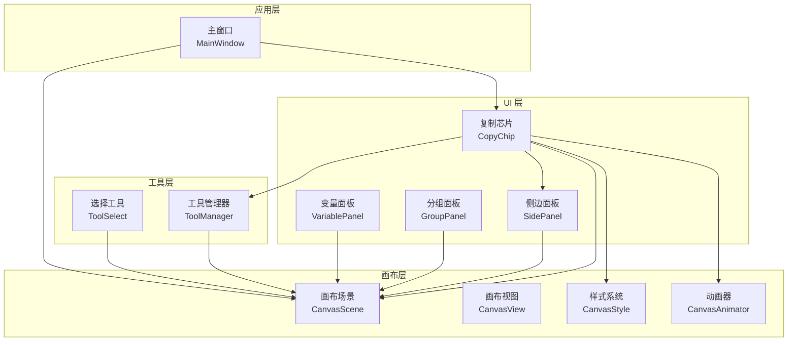
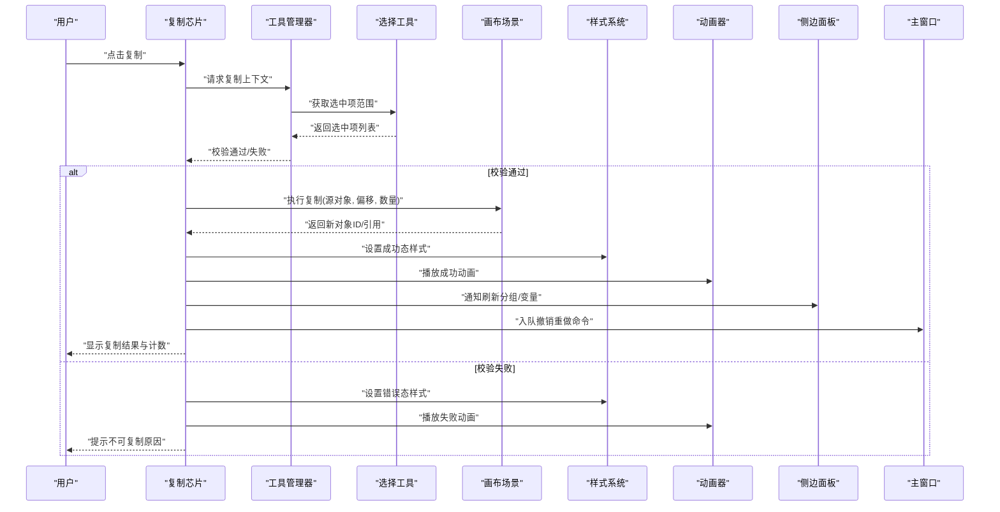
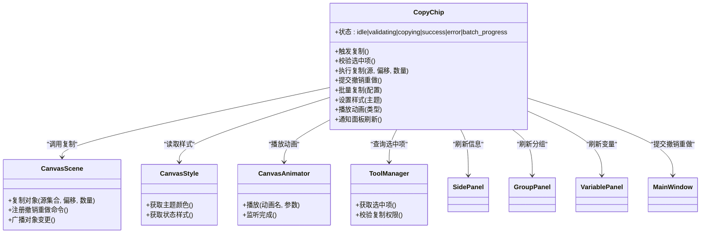
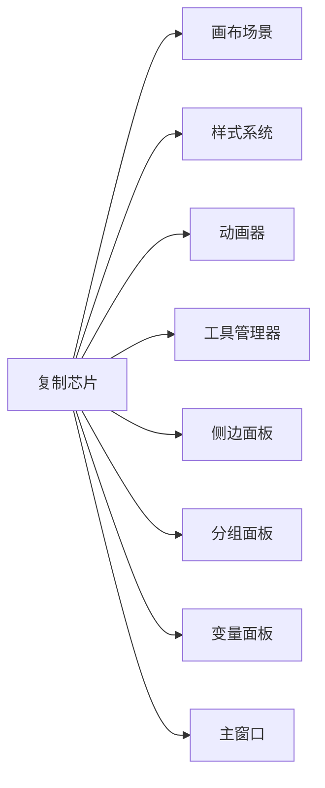

# 复制芯片

<cite>
**本文引用的文件**   
- [CopyChip.h](file://src/ui/CopyChip.h)
- [CopyChip.cpp](file://src/ui/CopyChip.cpp)
- [CanvasStyle.h](file://src/canvas/CanvasStyle.h)
- [CanvasStyle.cpp](file://src/canvas/CanvasStyle.cpp)
- [CanvasScene.h](file://src/canvas/CanvasScene.h)
- [CanvasScene.cpp](file://src/canvas/CanvasScene.cpp)
- [CanvasAnimator.h](file://src/canvas/CanvasAnimator.h)
- [CanvasAnimator.cpp](file://src/canvas/CanvasAnimator.cpp)
- [ToolManager.h](file://src/tools/ToolManager.h)
- [ToolManager.cpp](file://src/tools/ToolManager.cpp)
- [ToolSelect.h](file://src/tools/ToolSelect.h)
- [ToolSelect.cpp](file://src/tools/ToolSelect.cpp)
- [SidePanel.h](file://src/ui/SidePanel.h)
- [SidePanel.cpp](file://src/ui/SidePanel.cpp)
- [GroupPanel.h](file://src/ui/GroupPanel.h)
- [GroupPanel.cpp](file://src/ui/GroupPanel.cpp)
- [VariablePanel.h](file://src/ui/VariablePanel.h)
- [VariablePanel.cpp](file://src/ui/VariablePanel.cpp)
- [MainWindow.h](file://src/app/MainWindow.h)
- [MainWindow.cpp](file://src/app/MainWindow.cpp)
</cite>

## 目录
1. [简介](#简介)
2. [项目结构](#项目结构)
3. [核心组件](#核心组件)
4. [架构总览](#架构总览)
5. [详细组件分析](#详细组件分析)
6. [依赖关系分析](#依赖关系分析)
7. [性能考虑](#性能考虑)
8. [故障排查指南](#故障排查指南)
9. [结论](#结论)
10. [附录](#附录)

## 简介
本文件为“复制芯片”组件提供系统化、可操作的技术文档。内容覆盖视觉设计、动画与交互反馈、复制触发机制、数据传递与状态更新、样式定制与主题适配、可访问性支持、复制历史与撤销重做、批量操作，以及与场景、工具面板、侧边栏等组件的数据绑定和事件通信。同时给出性能优化与内存管理策略，帮助开发者快速集成并扩展该能力。

## 项目结构
复制芯片位于 UI 层，与画布场景、样式系统、动画器、工具管理器及侧边面板协作完成复制任务。关键位置如下：
- UI 层：复制芯片控件及其相关卡片/面板
- 画布层：场景、视图、样式、动画器
- 工具层：选择工具与工具管理器
- 应用层：主窗口协调全局状态

图表来源
- [CopyChip.h](file://src/ui/CopyChip.h)
- [CanvasScene.h](file://src/canvas/CanvasScene.h)
- [CanvasStyle.h](file://src/canvas/CanvasStyle.h)
- [CanvasAnimator.h](file://src/canvas/CanvasAnimator.h)
- [ToolManager.h](file://src/tools/ToolManager.h)
- [ToolSelect.h](file://src/tools/ToolSelect.h)
- [SidePanel.h](file://src/ui/SidePanel.h)
- [GroupPanel.h](file://src/ui/GroupPanel.h)
- [VariablePanel.h](file://src/ui/VariablePanel.h)
- [MainWindow.h](file://src/app/MainWindow.h)

章节来源
- [CopyChip.h](file://src/ui/CopyChip.h)
- [CanvasScene.h](file://src/canvas/CanvasScene.h)
- [CanvasStyle.h](file://src/canvas/CanvasStyle.h)
- [CanvasAnimator.h](file://src/canvas/CanvasAnimator.h)
- [ToolManager.h](file://src/tools/ToolManager.h)
- [ToolSelect.h](file://src/tools/ToolSelect.h)
- [SidePanel.h](file://src/ui/SidePanel.h)
- [GroupPanel.h](file://src/ui/GroupPanel.h)
- [VariablePanel.h](file://src/ui/VariablePanel.h)
- [MainWindow.h](file://src/app/MainWindow.h)

## 核心组件
- 复制芯片（CopyChip）
  - 职责：提供复制入口、展示复制结果、承载交互反馈与动画提示、维护复制历史与撤销重做栈、支持批量复制。
  - 关键能力：触发复制、数据封装与校验、状态同步、样式与主题适配、可访问性标签、动画反馈。
- 画布场景（CanvasScene）
  - 职责：对象集合与坐标变换、选中项管理、复制目标对象的序列化/反序列化、撤销重做命令注册。
- 样式系统（CanvasStyle）
  - 职责：颜色、圆角、阴影、字体等主题资源；为复制芯片提供高亮、禁用态、成功态等视觉状态。
- 动画器（CanvasAnimator）
  - 职责：为复制成功、失败、批量进度等提供过渡动画与缓动效果。
- 工具管理器（ToolManager）与选择工具（ToolSelect）
  - 职责：维护当前工具上下文、选中项范围、复制前校验（如是否允许复制）。
- 侧边面板（SidePanel）、分组面板（GroupPanel）、变量面板（VariablePanel）
  - 职责：与复制芯片联动，展示复制后的分组/变量映射或变更摘要。
- 主窗口（MainWindow）
  - 职责：全局快捷键、菜单命令、撤销重做栈的顶层协调。

章节来源
- [CopyChip.h](file://src/ui/CopyChip.h)
- [CopyChip.cpp](file://src/ui/CopyChip.cpp)
- [CanvasScene.h](file://src/canvas/CanvasScene.h)
- [CanvasScene.cpp](file://src/canvas/CanvasScene.cpp)
- [CanvasStyle.h](file://src/canvas/CanvasStyle.h)
- [CanvasStyle.cpp](file://src/canvas/CanvasStyle.cpp)
- [CanvasAnimator.h](file://src/canvas/CanvasAnimator.h)
- [CanvasAnimator.cpp](file://src/canvas/CanvasAnimator.cpp)
- [ToolManager.h](file://src/tools/ToolManager.h)
- [ToolManager.cpp](file://src/tools/ToolManager.cpp)
- [ToolSelect.h](file://src/tools/ToolSelect.h)
- [ToolSelect.cpp](file://src/tools/ToolSelect.cpp)
- [SidePanel.h](file://src/ui/SidePanel.h)
- [SidePanel.cpp](file://src/ui/SidePanel.cpp)
- [GroupPanel.h](file://src/ui/GroupPanel.h)
- [GroupPanel.cpp](file://src/ui/GroupPanel.cpp)
- [VariablePanel.h](file://src/ui/VariablePanel.h)
- [VariablePanel.cpp](file://src/ui/VariablePanel.cpp)
- [MainWindow.h](file://src/app/MainWindow.h)
- [MainWindow.cpp](file://src/app/MainWindow.cpp)

## 架构总览
复制芯片通过事件与信号槽机制与场景、样式、动画、工具进行解耦协作。典型流程：用户点击复制芯片 → 工具管理器校验选中项 → 场景执行复制并生成新对象 → 动画器播放成功反馈 → 侧边面板刷新分组/变量信息 → 主窗口记录撤销重做条目。

图表来源
- [CopyChip.h](file://src/ui/CopyChip.h)
- [ToolManager.h](file://src/tools/ToolManager.h)
- [ToolSelect.h](file://src/tools/ToolSelect.h)
- [CanvasScene.h](file://src/canvas/CanvasScene.h)
- [CanvasStyle.h](file://src/canvas/CanvasStyle.h)
- [CanvasAnimator.h](file://src/canvas/CanvasAnimator.h)
- [SidePanel.h](file://src/ui/SidePanel.h)
- [MainWindow.h](file://src/app/MainWindow.h)

## 详细组件分析

### 复制芯片（CopyChip）
- 视觉设计与主题适配
  - 支持默认/深色/高对比度主题；根据 CanvasStyle 动态切换颜色、圆角、阴影与图标。
  - 状态色板：默认、悬停、按下、禁用、成功、失败、加载中。
- 动画与交互反馈
  - 点击时缩放/位移微动效；成功时弹跳+对勾；失败抖动；批量复制显示进度条。
  - 使用 CanvasAnimator 统一控制时长与缓动曲线。
- 复制触发机制
  - 按钮点击、键盘快捷键、右键菜单、拖拽到芯片三种触发方式。
  - 前置校验：存在选中项、选中项可复制、无只读锁定、满足约束条件。
- 数据传递与状态更新
  - 输入：源对象集合、偏移向量、复制数量、是否保留关联。
  - 输出：新对象集合、复制统计、错误码。
  - 内部状态：idle、validating、copying、success、error、batch_progress。
- 历史记录与撤销重做
  - 每次复制生成一个 Command，包含“创建副本”与“删除副本”两个子操作，支持批量合并。
  - 撤销/重做由主窗口命令栈统一管理，复制芯片仅负责提交与回滚回调。
- 批量操作
  - 支持 N 次复制与网格布局复制；计算每份偏移，避免重复分配。
  - 批量过程中保持原子性：失败则全部回滚。
- 可访问性
  - 提供无障碍标签、屏幕阅读器提示、键盘导航、焦点顺序与高亮边框。
- 与其他组件的数据绑定与事件通信
  - 订阅 ToolManager 的选中项变化；向 CanvasScene 发起复制请求；接收 CanvasAnimator 的动画完成事件；向 SidePanel/GroupPanel/VariablePanel 广播变更。

图表来源
- [CopyChip.h](file://src/ui/CopyChip.h)
- [CanvasScene.h](file://src/canvas/CanvasScene.h)
- [CanvasStyle.h](file://src/canvas/CanvasStyle.h)
- [CanvasAnimator.h](file://src/canvas/CanvasAnimator.h)
- [ToolManager.h](file://src/tools/ToolManager.h)
- [SidePanel.h](file://src/ui/SidePanel.h)
- [GroupPanel.h](file://src/ui/GroupPanel.h)
- [VariablePanel.h](file://src/ui/VariablePanel.h)
- [MainWindow.h](file://src/app/MainWindow.h)

章节来源
- [CopyChip.h](file://src/ui/CopyChip.h)
- [CopyChip.cpp](file://src/ui/CopyChip.cpp)

### 画布场景（CanvasScene）
- 复制实现要点
  - 深拷贝/浅拷贝策略：几何体深拷贝，引用型属性按策略处理。
  - 偏移与对齐：支持相对偏移、网格吸附、旋转后坐标修正。
  - 批量优化：一次性分配内存，减少重复插入开销。
- 撤销重做
  - 将复制操作包装为命令，保存旧状态快照与新对象 ID 映射。
- 事件广播
  - 复制完成后广播对象变更，驱动视图重绘与面板刷新。

章节来源
- [CanvasScene.h](file://src/canvas/CanvasScene.h)
- [CanvasScene.cpp](file://src/canvas/CanvasScene.cpp)

### 样式系统（CanvasStyle）
- 主题资源
  - 颜色、阴影、圆角、字体族/大小、图标路径。
- 状态样式
  - 默认/悬停/按下/禁用/成功/失败/加载中的样式表。
- 动态切换
  - 主题变更时自动更新所有依赖控件。

章节来源
- [CanvasStyle.h](file://src/canvas/CanvasStyle.h)
- [CanvasStyle.cpp](file://src/canvas/CanvasStyle.cpp)

### 动画器（CanvasAnimator）
- 动画类型
  - 成功弹跳、失败抖动、批量进度条、淡入淡出。
- 性能
  - 复用动画实例、限制并发动画数、帧率自适应。

章节来源
- [CanvasAnimator.h](file://src/canvas/CanvasAnimator.h)
- [CanvasAnimator.cpp](file://src/canvas/CanvasAnimator.cpp)

### 工具管理器（ToolManager）与选择工具（ToolSelect）
- 选中项管理
  - 维护选中集合、单选/多选模式、跨组选择。
- 复制权限校验
  - 检查只读、锁定、依赖关系、约束引擎规则。

章节来源
- [ToolManager.h](file://src/tools/ToolManager.h)
- [ToolManager.cpp](file://src/tools/ToolManager.cpp)
- [ToolSelect.h](file://src/tools/ToolSelect.h)
- [ToolSelect.cpp](file://src/tools/ToolSelect.cpp)

### 侧边面板（SidePanel）、分组面板（GroupPanel）、变量面板（VariablePanel）
- 与复制芯片联动
  - 复制成功后刷新分组树、变量映射、依赖图。
  - 支持一键展开/折叠、差异高亮。

章节来源
- [SidePanel.h](file://src/ui/SidePanel.h)
- [SidePanel.cpp](file://src/ui/SidePanel.cpp)
- [GroupPanel.h](file://src/ui/GroupPanel.h)
- [GroupPanel.cpp](file://src/ui/GroupPanel.cpp)
- [VariablePanel.h](file://src/ui/VariablePanel.h)
- [VariablePanel.cpp](file://src/ui/VariablePanel.cpp)

### 主窗口（MainWindow）
- 全局快捷键与菜单
  - 复制快捷键、撤销/重做快捷键、批量复制对话框入口。
- 撤销重做栈
  - 集中管理命令栈，保证跨组件一致性。

章节来源
- [MainWindow.h](file://src/app/MainWindow.h)
- [MainWindow.cpp](file://src/app/MainWindow.cpp)

## 依赖关系分析
复制芯片对外依赖较少，主要依赖场景、样式、动画、工具管理与面板。耦合点集中在：
- 与 CanvasScene 的复制接口契约
- 与 CanvasStyle 的主题资源访问
- 与 CanvasAnimator 的动画事件回调
- 与 ToolManager/ToolSelect 的选中项与权限校验
- 与 SidePanel/GroupPanel/VariablePanel 的刷新事件

图表来源
- [CopyChip.h](file://src/ui/CopyChip.h)
- [CanvasScene.h](file://src/canvas/CanvasScene.h)
- [CanvasStyle.h](file://src/canvas/CanvasStyle.h)
- [CanvasAnimator.h](file://src/canvas/CanvasAnimator.h)
- [ToolManager.h](file://src/tools/ToolManager.h)
- [ToolSelect.h](file://src/tools/ToolSelect.h)
- [SidePanel.h](file://src/ui/SidePanel.h)
- [GroupPanel.h](file://src/ui/GroupPanel.h)
- [VariablePanel.h](file://src/ui/VariablePanel.h)
- [MainWindow.h](file://src/app/MainWindow.h)

章节来源
- [CopyChip.h](file://src/ui/CopyChip.h)
- [CanvasScene.h](file://src/canvas/CanvasScene.h)
- [CanvasStyle.h](file://src/canvas/CanvasStyle.h)
- [CanvasAnimator.h](file://src/canvas/CanvasAnimator.h)
- [ToolManager.h](file://src/tools/ToolManager.h)
- [ToolSelect.h](file://src/tools/ToolSelect.h)
- [SidePanel.h](file://src/ui/SidePanel.h)
- [GroupPanel.h](file://src/ui/GroupPanel.h)
- [VariablePanel.h](file://src/ui/VariablePanel.h)
- [MainWindow.h](file://src/app/MainWindow.h)

## 性能考虑
- 内存管理
  - 批量复制时使用预分配容器与对象池，减少频繁分配/释放。
  - 深拷贝时按需克隆，避免不必要的几何数据复制。
- 渲染与动画
  - 限制并发动画数量，优先播放关键反馈动画。
  - 使用增量重绘与脏矩形，避免全量刷新。
- 撤销重做
  - 合并相邻复制命令，降低历史栈体积。
  - 延迟序列化大对象，仅在需要时构建快照。
- I/O 与事件
  - 面板刷新采用去抖与节流，避免高频事件风暴。
  - 事件总线采用轻量消息队列，避免阻塞主线程。

[本节为通用指导，不直接分析具体文件]

## 故障排查指南
- 常见问题
  - 复制无效：检查选中项是否为空、是否存在只读/锁定、约束引擎是否拒绝。
  - 动画卡顿：确认动画器队列长度、帧率设置、是否有过多并发动画。
  - 面板未刷新：确认事件是否发出、面板订阅是否正确、数据模型是否更新。
  - 撤销重做异常：检查命令是否成对注册、快照是否完整、ID 映射是否一致。
- 调试建议
  - 启用日志开关，打印复制前后对象 ID 与数量。
  - 在关键节点设置断点：校验、复制、动画、面板刷新、命令入栈。
  - 使用性能分析工具定位热点函数与内存峰值。

章节来源
- [CopyChip.cpp](file://src/ui/CopyChip.cpp)
- [CanvasScene.cpp](file://src/canvas/CanvasScene.cpp)
- [CanvasAnimator.cpp](file://src/canvas/CanvasAnimator.cpp)
- [ToolManager.cpp](file://src/tools/ToolManager.cpp)
- [ToolSelect.cpp](file://src/tools/ToolSelect.cpp)
- [SidePanel.cpp](file://src/ui/SidePanel.cpp)
- [GroupPanel.cpp](file://src/ui/GroupPanel.cpp)
- [VariablePanel.cpp](file://src/ui/VariablePanel.cpp)
- [MainWindow.cpp](file://src/app/MainWindow.cpp)

## 结论
复制芯片作为 UI 层的复制中枢，通过与场景、样式、动画、工具与面板的协同，实现了稳定、高效且友好的复制体验。遵循本文档的设计与实践，可在保证性能与可维护性的前提下，快速扩展更多复制策略与交互形态。

[本节为总结，不直接分析具体文件]

## 附录
- 术语
  - 复制芯片：提供复制操作的 UI 控件与逻辑载体
  - 撤销重做：基于命令模式的版本控制机制
  - 主题适配：根据系统/应用主题动态调整样式
  - 可访问性：面向辅助技术的无障碍支持
- 最佳实践
  - 始终先校验再复制，确保幂等性与一致性
  - 批量操作需原子化，失败即回滚
  - 动画与 UI 反馈及时但不阻塞主线程
  - 面板刷新去抖，避免频繁重绘

[本节为补充说明，不直接分析具体文件]