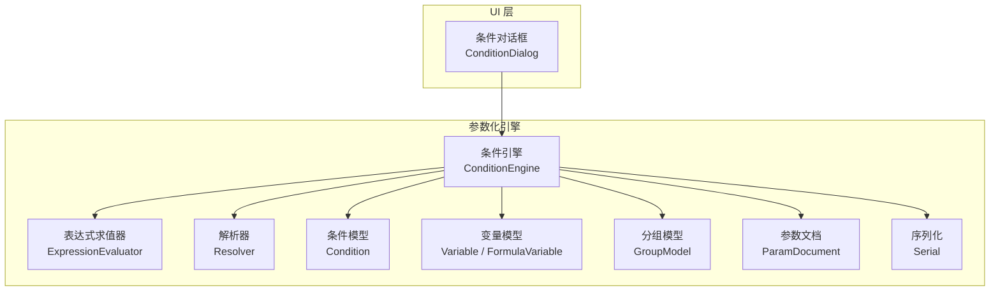
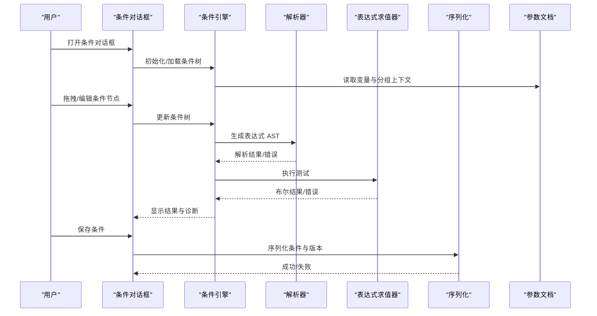
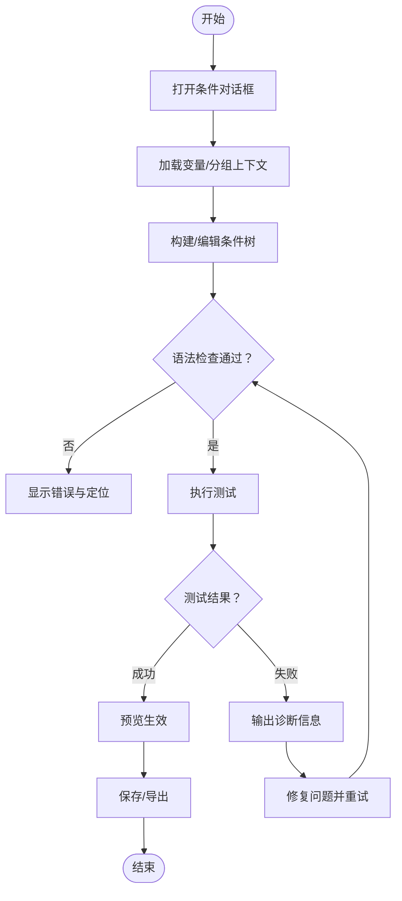
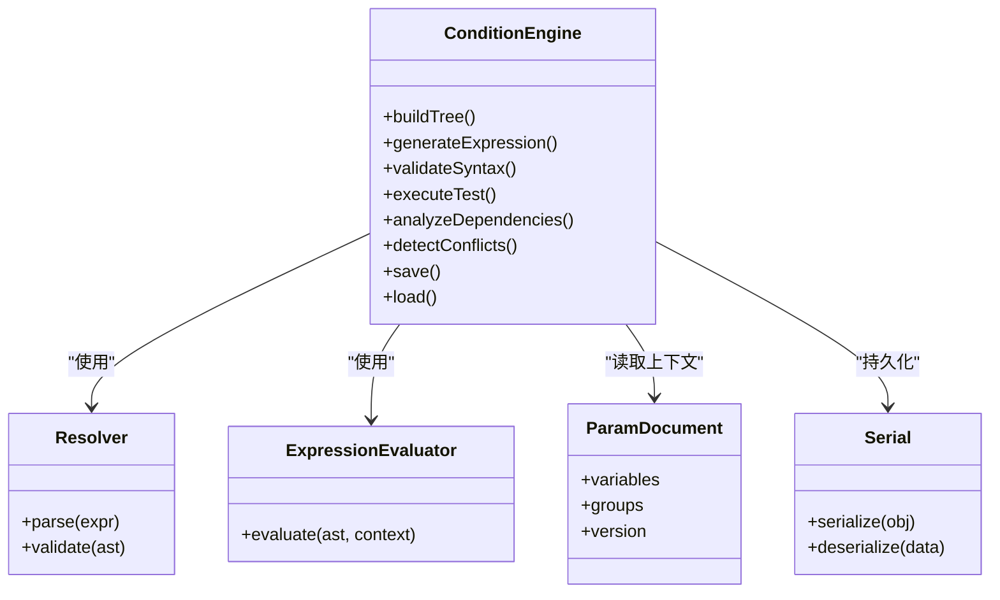
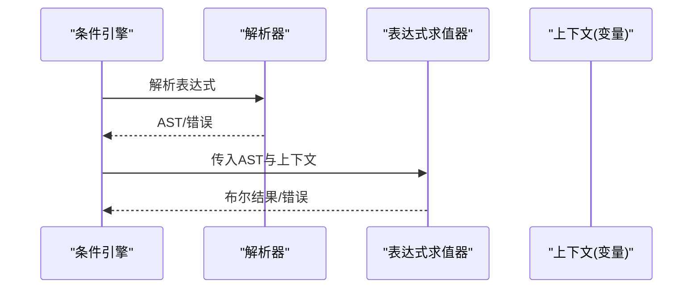
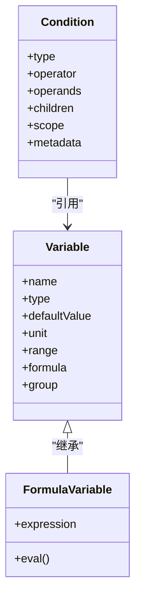
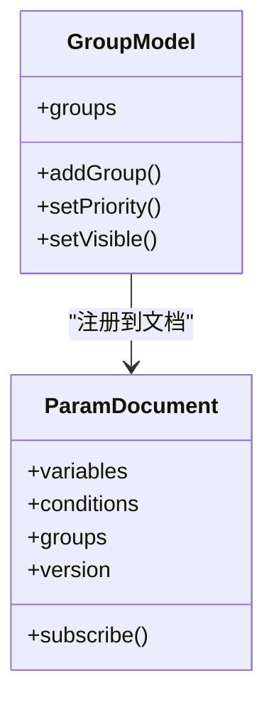
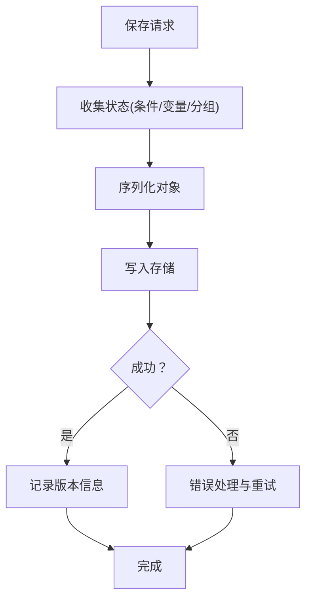
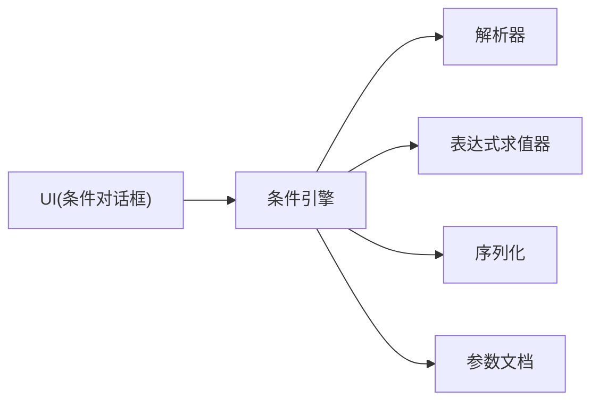

# 条件对话框

<cite>
**本文引用的文件**   
- [ConditionDialog.h](file://src/ui/ConditionDialog.h)
- [ConditionDialog.cpp](file://src/ui/ConditionDialog.cpp)
- [Condition.h](file://src/parametric/Condition.h)
- [ConditionEngine.h](file://src/parametric/ConditionEngine.h)
- [ConditionEngine.cpp](file://src/parametric/ConditionEngine.cpp)
- [ExpressionEvaluator.h](file://src/parametric/ExpressionEvaluator.h)
- [ExpressionEvaluator.cpp](file://src/parametric/ExpressionEvaluator.cpp)
- [Variable.h](file://src/parametric/Variable.h)
- [FormulaVariable.h](file://src/parametric/FormulaVariable.h)
- [GroupModel.h](file://src/parametric/GroupModel.h)
- [GroupModel.cpp](file://src/parametric/GroupModel.cpp)
- [ParamDocument.h](file://src/parametric/ParamDocument.h)
- [ParamDocument.cpp](file://src/parametric/ParamDocument.cpp)
- [Serial.h](file://src/parametric/Serial.h)
- [Serial.cpp](file://src/parametric/Serial.cpp)
- [Resolver.h](file://src/parametric/Resolver.h)
- [Resolver.cpp](file://src/parametric/Resolver.cpp)
</cite>

## 目录
1. [简介](#简介)
2. [项目结构](#项目结构)
3. [核心组件](#核心组件)
4. [架构总览](#架构总览)
5. [详细组件分析](#详细组件分析)
6. [依赖关系分析](#依赖关系分析)
7. [性能考虑](#性能考虑)
8. [故障排查指南](#故障排查指南)
9. [结论](#结论)
10. [附录](#附录)

## 简介
本文件面向“条件对话框”组件，系统性说明其图形化界面、逻辑运算符支持、嵌套条件结构、表达式生成与语法检查、执行测试、模板库与预设规则、依赖分析与冲突检测、保存加载与版本控制、以及调试与错误诊断能力。文档以代码为依据，结合架构图与流程图帮助读者快速理解并正确使用该组件。

## 项目结构
条件对话框位于 UI 层（ui），与参数化引擎（parametric）中的条件模型、表达式求值器、解析器、序列化等模块紧密协作。整体采用分层设计：UI 负责交互与可视化；业务层负责条件构建、校验与求值；数据层负责持久化与版本管理。

图表来源
- [ConditionDialog.h](file://src/ui/ConditionDialog.h)
- [ConditionEngine.h](file://src/parametric/ConditionEngine.h)
- [ExpressionEvaluator.h](file://src/parametric/ExpressionEvaluator.h)
- [Resolver.h](file://src/parametric/Resolver.h)
- [Condition.h](file://src/parametric/Condition.h)
- [Variable.h](file://src/parametric/Variable.h)
- [FormulaVariable.h](file://src/parametric/FormulaVariable.h)
- [GroupModel.h](file://src/parametric/GroupModel.h)
- [ParamDocument.h](file://src/parametric/ParamDocument.h)
- [Serial.h](file://src/parametric/Serial.h)

章节来源
- [ConditionDialog.h](file://src/ui/ConditionDialog.h)
- [ConditionEngine.h](file://src/parametric/ConditionEngine.h)
- [ExpressionEvaluator.h](file://src/parametric/ExpressionEvaluator.h)
- [Resolver.h](file://src/parametric/Resolver.h)
- [Condition.h](file://src/parametric/Condition.h)
- [Variable.h](file://src/parametric/Variable.h)
- [FormulaVariable.h](file://src/parametric/FormulaVariable.h)
- [GroupModel.h](file://src/parametric/GroupModel.h)
- [ParamDocument.h](file://src/parametric/ParamDocument.h)
- [Serial.h](file://src/parametric/Serial.h)

## 核心组件
- 条件对话框（UI）：提供图形化条件构建器，支持拖拽、可视化连接、实时预览与测试。
- 条件引擎（业务）：负责条件树构建、依赖分析、冲突检测、表达式生成、语法检查与求值执行。
- 表达式求值器（计算）：对生成的表达式进行安全求值，返回布尔结果或错误信息。
- 解析器（解析）：将用户输入或中间表示转换为可执行的表达式 AST。
- 条件模型（数据）：描述条件节点、运算符、子条件、作用域与元数据。
- 变量模型（数据）：定义变量类型、取值范围、单位与公式。
- 分组模型（组织）：管理条件分组、可见性与优先级。
- 参数文档（上下文）：承载当前文档的变量集合、条件集合与版本信息。
- 序列化（持久化）：负责条件的保存、加载、迁移与版本兼容。

章节来源
- [ConditionDialog.h](file://src/ui/ConditionDialog.h)
- [ConditionEngine.h](file://src/parametric/ConditionEngine.h)
- [ExpressionEvaluator.h](file://src/parametric/ExpressionEvaluator.h)
- [Resolver.h](file://src/parametric/Resolver.h)
- [Condition.h](file://src/parametric/Condition.h)
- [Variable.h](file://src/parametric/Variable.h)
- [FormulaVariable.h](file://src/parametric/FormulaVariable.h)
- [GroupModel.h](file://src/parametric/GroupModel.h)
- [ParamDocument.h](file://src/parametric/ParamDocument.h)
- [Serial.h](file://src/parametric/Serial.h)

## 架构总览
条件对话框通过条件引擎协调表达式求值、解析与序列化，形成“可视化构建—语法校验—执行测试—持久化”的闭环。

图表来源
- [ConditionDialog.h](file://src/ui/ConditionDialog.h)
- [ConditionEngine.h](file://src/parametric/ConditionEngine.h)
- [ExpressionEvaluator.h](file://src/parametric/ExpressionEvaluator.h)
- [Resolver.h](file://src/parametric/Resolver.h)
- [ParamDocument.h](file://src/parametric/ParamDocument.h)
- [Serial.h](file://src/parametric/Serial.h)

## 详细组件分析

### 条件对话框（UI）
- 功能要点
  - 图形化条件构建器：节点面板、画布、连线、属性面板。
  - 逻辑运算符支持：与、或、非、比较运算符（数值/字符串/布尔）。
  - 嵌套条件结构：支持任意深度的子条件组合与作用域隔离。
  - 实时预览与测试：修改后即时生成表达式并执行测试。
  - 模板库与预设：常用条件模板一键插入，支持自定义规则扩展。
  - 依赖分析与冲突检测：高亮未解析变量、循环依赖、互斥规则。
  - 保存/加载/版本控制：自动增量保存、历史版本对比与回滚。
  - 调试与诊断：错误定位、表达式展开、执行路径追踪。

- 关键交互流程
  - 新建/编辑条件：选择变量与运算符，设置阈值与逻辑组合。
  - 测试执行：触发求值器，展示结果与错误详情。
  - 保存导出：序列化为文档内嵌或外部文件，附带版本标签。

章节来源
- [ConditionDialog.h](file://src/ui/ConditionDialog.h)
- [ConditionDialog.cpp](file://src/ui/ConditionDialog.cpp)

### 条件引擎（业务）
- 职责
  - 维护条件树与依赖图。
  - 生成表达式 AST，调用解析器与求值器。
  - 执行依赖分析与冲突检测。
  - 协调保存/加载与版本管理。

- 关键能力
  - 表达式生成：将条件树转换为表达式字符串/AST。
  - 语法检查：基于解析器的规则集验证合法性。
  - 执行测试：注入变量值，运行求值器并返回结果。
  - 依赖分析：构建变量到条件的映射，检测循环引用。
  - 冲突检测：识别互斥条件、覆盖规则与优先级问题。

图表来源
- [ConditionEngine.h](file://src/parametric/ConditionEngine.h)
- [ConditionEngine.cpp](file://src/parametric/ConditionEngine.cpp)
- [Resolver.h](file://src/parametric/Resolver.h)
- [ExpressionEvaluator.h](file://src/parametric/ExpressionEvaluator.h)
- [ParamDocument.h](file://src/parametric/ParamDocument.h)
- [Serial.h](file://src/parametric/Serial.h)

章节来源
- [ConditionEngine.h](file://src/parametric/ConditionEngine.h)
- [ConditionEngine.cpp](file://src/parametric/ConditionEngine.cpp)

### 表达式求值器与解析器
- 解析器
  - 将表达式字符串解析为 AST。
  - 校验语法与语义（变量存在性、类型匹配）。
- 求值器
  - 在给定上下文中执行 AST，返回布尔结果。
  - 提供错误码与诊断消息。

图表来源
- [Resolver.h](file://src/parametric/Resolver.h)
- [Resolver.cpp](file://src/parametric/Resolver.cpp)
- [ExpressionEvaluator.h](file://src/parametric/ExpressionEvaluator.h)
- [ExpressionEvaluator.cpp](file://src/parametric/ExpressionEvaluator.cpp)

章节来源
- [Resolver.h](file://src/parametric/Resolver.h)
- [Resolver.cpp](file://src/parametric/Resolver.cpp)
- [ExpressionEvaluator.h](file://src/parametric/ExpressionEvaluator.h)
- [ExpressionEvaluator.cpp](file://src/parametric/ExpressionEvaluator.cpp)

### 条件模型与变量模型
- 条件模型
  - 节点类型：根、分支（与/或）、叶子（比较/函数）。
  - 属性：运算符、操作数、子节点、作用域、元数据。
- 变量模型
  - 变量名、类型、默认值、单位、取值范围、公式。
  - 分组归属与可见性。

图表来源
- [Condition.h](file://src/parametric/Condition.h)
- [Variable.h](file://src/parametric/Variable.h)
- [FormulaVariable.h](file://src/parametric/FormulaVariable.h)

章节来源
- [Condition.h](file://src/parametric/Condition.h)
- [Variable.h](file://src/parametric/Variable.h)
- [FormulaVariable.h](file://src/parametric/FormulaVariable.h)

### 分组模型与参数文档
- 分组模型
  - 管理条件分组、优先级、可见性策略。
- 参数文档
  - 聚合变量、条件、分组与版本信息。
  - 提供统一访问接口与变更通知。

图表来源
- [GroupModel.h](file://src/parametric/GroupModel.h)
- [GroupModel.cpp](file://src/parametric/GroupModel.cpp)
- [ParamDocument.h](file://src/parametric/ParamDocument.h)
- [ParamDocument.cpp](file://src/parametric/ParamDocument.cpp)

章节来源
- [GroupModel.h](file://src/parametric/GroupModel.h)
- [GroupModel.cpp](file://src/parametric/GroupModel.cpp)
- [ParamDocument.h](file://src/parametric/ParamDocument.h)
- [ParamDocument.cpp](file://src/parametric/ParamDocument.cpp)

### 序列化与版本控制
- 序列化
  - 将条件树、分组、变量与元数据序列化为结构化数据。
  - 支持增量保存与差异合并。
- 版本控制
  - 记录版本号、时间戳、变更摘要。
  - 支持历史版本对比与回滚。

图表来源
- [Serial.h](file://src/parametric/Serial.h)
- [Serial.cpp](file://src/parametric/Serial.cpp)
- [ParamDocument.h](file://src/parametric/ParamDocument.h)

章节来源
- [Serial.h](file://src/parametric/Serial.h)
- [Serial.cpp](file://src/parametric/Serial.cpp)
- [ParamDocument.h](file://src/parametric/ParamDocument.h)

## 依赖关系分析
- 组件耦合
  - UI 仅依赖条件引擎接口，保持松耦合。
  - 条件引擎集中编排解析器、求值器、序列化与文档上下文。
- 依赖方向
  - UI → 条件引擎 → 解析器/求值器/序列化/文档
- 潜在风险
  - 循环依赖：需通过依赖分析提前发现。
  - 版本不兼容：序列化需向前兼容。

图表来源
- [ConditionDialog.h](file://src/ui/ConditionDialog.h)
- [ConditionEngine.h](file://src/parametric/ConditionEngine.h)
- [Resolver.h](file://src/parametric/Resolver.h)
- [ExpressionEvaluator.h](file://src/parametric/ExpressionEvaluator.h)
- [Serial.h](file://src/parametric/Serial.h)
- [ParamDocument.h](file://src/parametric/ParamDocument.h)

章节来源
- [ConditionDialog.h](file://src/ui/ConditionDialog.h)
- [ConditionEngine.h](file://src/parametric/ConditionEngine.h)
- [Resolver.h](file://src/parametric/Resolver.h)
- [ExpressionEvaluator.h](file://src/parametric/ExpressionEvaluator.h)
- [Serial.h](file://src/parametric/Serial.h)
- [ParamDocument.h](file://src/parametric/ParamDocument.h)

## 性能考虑
- 表达式缓存：对稳定表达式 AST 进行缓存，避免重复解析。
- 增量求值：仅对受影响的条件子树重新求值。
- 批量操作：合并多次编辑为一次提交，减少重算次数。
- 异步执行：耗时测试与序列化在后台线程执行，避免阻塞 UI。
- 内存管理：及时释放临时 AST 与中间结果，限制最大深度。

[本节为通用指导，无需特定文件来源]

## 故障排查指南
- 常见错误
  - 语法错误：变量名不存在、类型不匹配、括号不闭合。
  - 运行时错误：除零、越界、空引用。
  - 依赖冲突：循环依赖、互斥条件、优先级覆盖。
- 诊断步骤
  - 查看解析错误位置与消息。
  - 展开表达式 AST，定位问题节点。
  - 检查变量上下文与分组可见性。
  - 使用测试模式逐步验证子条件。
- 修复建议
  - 修正变量引用与类型。
  - 调整逻辑组合与作用域。
  - 解除循环依赖与冲突规则。

章节来源
- [ConditionEngine.h](file://src/parametric/ConditionEngine.h)
- [ExpressionEvaluator.h](file://src/parametric/ExpressionEvaluator.h)
- [Resolver.h](file://src/parametric/Resolver.h)

## 结论
条件对话框通过清晰的层次结构与模块化设计，实现了从可视化构建到执行测试、从依赖分析到持久化版本的完整工作流。借助解析器与求值器，系统确保表达式的正确性与高效执行；通过序列化与版本控制，保障数据的可追溯与可恢复。建议在复杂场景中优先使用依赖分析与冲突检测，结合调试工具快速定位问题，提升建模效率与稳定性。

[本节为总结性内容，无需特定文件来源]

## 附录
- 术语表
  - 条件树：由根、分支与叶子组成的有向无环图。
  - 表达式 AST：抽象语法树，表示可执行的表达式结构。
  - 依赖图：变量与条件之间的引用关系图。
  - 冲突：互斥、覆盖、循环引用等不一致状态。
- 最佳实践
  - 使用分组管理条件优先级与可见性。
  - 尽量复用模板与预设规则。
  - 定期保存并创建版本快照。
  - 在大型项目中拆分条件模块，降低耦合。

[本节为概念性内容，无需特定文件来源]