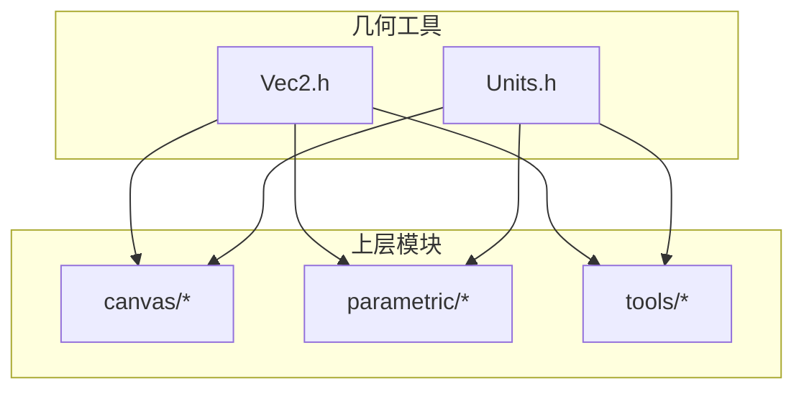
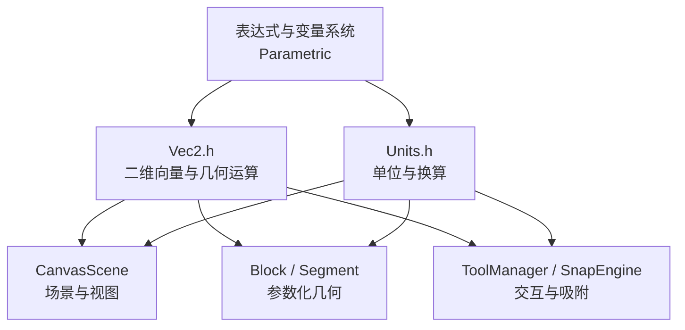
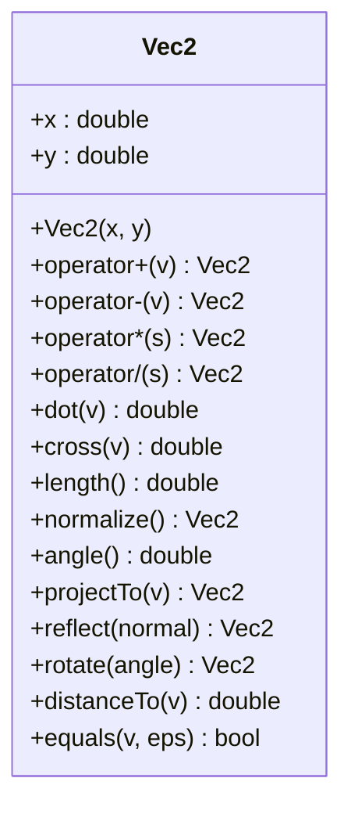
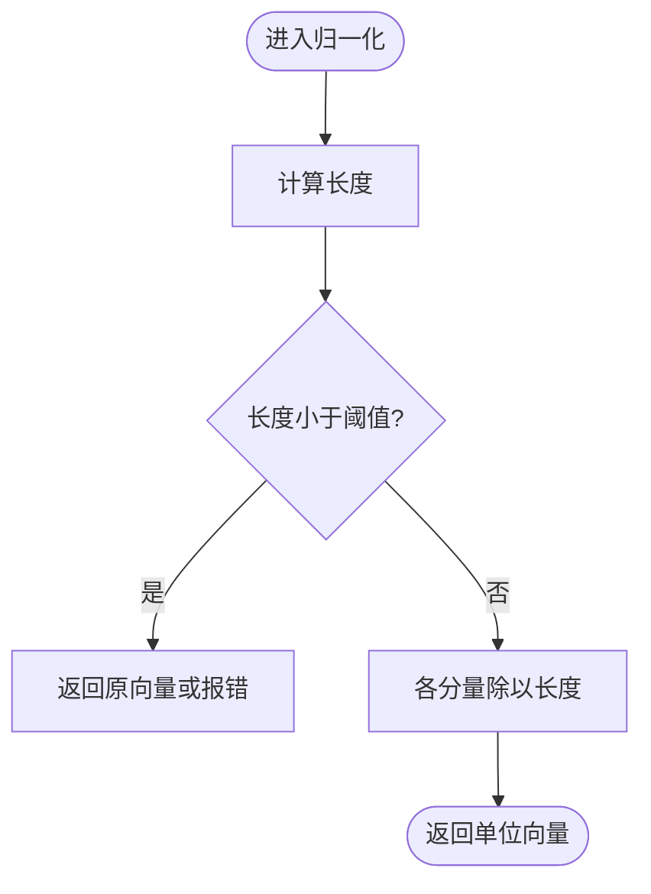
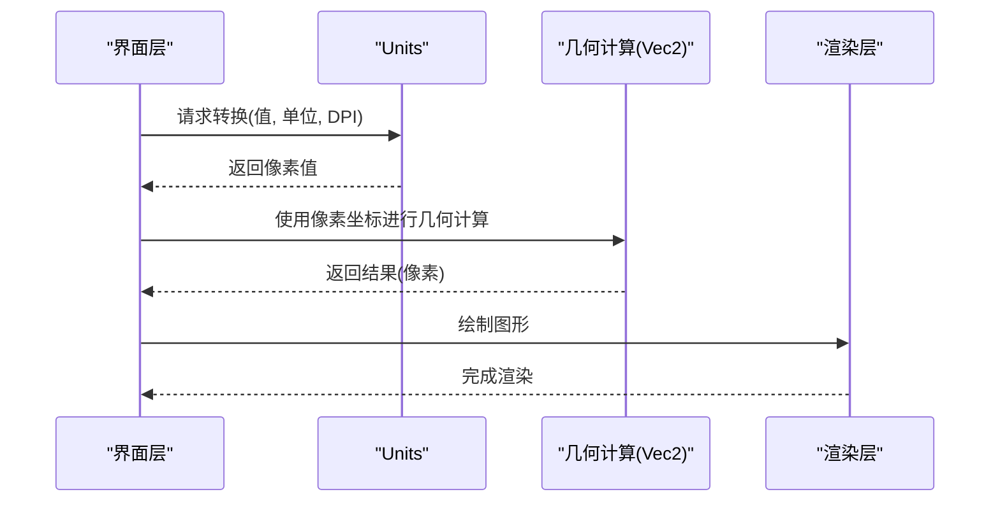
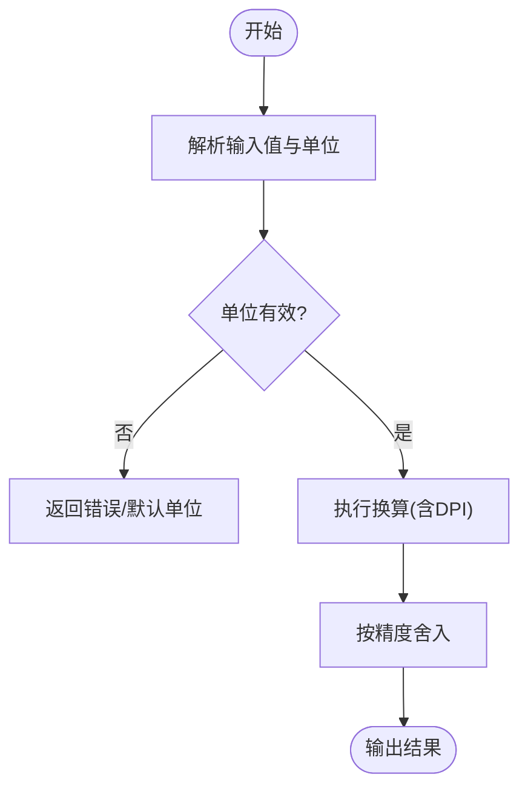
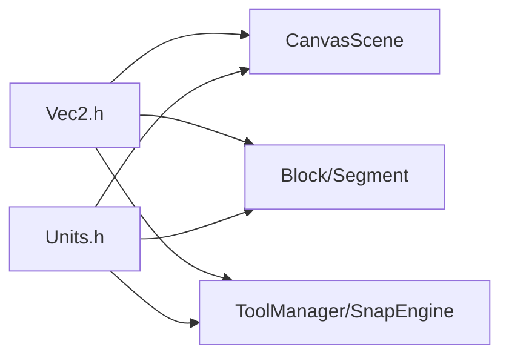

# 几何工具

<cite>
**本文引用的文件**   
- [Vec2.h](file://src/geometry/Vec2.h)
- [Units.h](file://src/geometry/Units.h)
</cite>

## 目录
1. [简介](#简介)
2. [项目结构](#项目结构)
3. [核心组件](#核心组件)
4. [架构总览](#架构总览)
5. [详细组件分析](#详细组件分析)
6. [依赖关系分析](#依赖关系分析)
7. [性能考虑](#性能考虑)
8. [故障排查指南](#故障排查指南)
9. [结论](#结论)
10. [附录](#附录)

## 简介
本文件为几何工具库的权威文档，聚焦二维向量类 Vec2 与单位转换系统 Units 的实现细节。内容涵盖数学运算、坐标变换、精度处理、与其他模块的集成方式以及性能优化建议。读者可据此在 CAD/图形系统中安全高效地使用向量和单位换算能力，并掌握浮点精度与数值稳定性的最佳实践。

## 项目结构
几何工具位于 src/geometry 目录下，包含两个头文件：
- Vec2.h：定义二维向量类型及其常用数学操作
- Units.h：定义单位枚举与换算接口

图表来源
- [Vec2.h](file://src/geometry/Vec2.h)
- [Units.h](file://src/geometry/Units.h)

章节来源
- [Vec2.h](file://src/geometry/Vec2.h)
- [Units.h](file://src/geometry/Units.h)

## 核心组件
- Vec2：二维向量类型，提供加减乘除、点积、叉积、长度、归一化、角度、投影、旋转等基础几何运算，支持与标量及单位的组合运算。
- Units：单位系统与换算器，提供毫米、英寸、厘米等单位间的转换函数与常量，确保跨模块数据一致性。

章节来源
- [Vec2.h](file://src/geometry/Vec2.h)
- [Units.h](file://src/geometry/Units.h)

## 架构总览
Vec2 作为几何计算的基础数据类型，被 canvas、parametric、tools 等模块广泛使用；Units 作为统一度量入口，贯穿显示、建模与导出流程。二者共同构成“数值表达 + 单位语义”的最小闭环。

图表来源
- [Vec2.h](file://src/geometry/Vec2.h)
- [Units.h](file://src/geometry/Units.h)

## 详细组件分析

### Vec2 二维向量
- 设计目标
  - 以最小开销承载二维点/向量
  - 提供直观的运算符重载与常用几何方法
  - 与 Units 协同，支持带单位或无单位的数值运算
- 关键能力
  - 算术运算：加、减、数乘、数除
  - 几何运算：点积、叉积、模长、归一化、夹角、投影、反射、旋转
  - 比较与判定：相等（含容差）、零向量判断、象限/方向判定
  - 坐标变换：平移、缩放、旋转变换矩阵应用
  - 精度控制：EPS 容差、舍入到指定小数位、避免除零
- 典型用法
  - 构造：从坐标、极坐标、单位向量
  - 组合：链式调用实现复杂变换
  - 与单位：将像素坐标转换为物理单位，或将物理单位映射回屏幕坐标

图表来源
- [Vec2.h](file://src/geometry/Vec2.h)

章节来源
- [Vec2.h](file://src/geometry/Vec2.h)

#### 数学运算与精度处理要点
- 点积与叉积用于夹角、投影、碰撞检测与面积计算
- 归一化前检查长度是否接近零，避免 NaN/Inf
- 角度计算建议使用 atan2(y, x) 以获得全象限正确结果
- 比较时使用 EPS 容差，避免直接 ==
- 多次累积运算时注意误差放大，必要时阶段性重规范化

图表来源
- [Vec2.h](file://src/geometry/Vec2.h)

### Units 单位转换系统
- 设计目标
  - 统一物理单位与显示单位之间的转换
  - 提供清晰的 API 与常量，避免硬编码
- 关键能力
  - 单位枚举：如毫米(mm)、英寸(in)、厘米(cm)等
  - 换算函数：toPixels(value, unit, dpi), toPhysical(value, unit), fromPixels(value, unit, dpi)
  - 精度策略：输出保留小数位数、四舍五入规则
  - DPI/分辨率感知：适配不同屏幕密度
- 典型用法
  - 输入：用户以 mm 输入尺寸
  - 内部：转为物理单位参与几何计算
  - 输出：根据 DPI 渲染为像素坐标

图表来源
- [Units.h](file://src/geometry/Units.h)

章节来源
- [Units.h](file://src/geometry/Units.h)

#### 单位换算流程

图表来源
- [Units.h](file://src/geometry/Units.h)

## 依赖关系分析
- Vec2 与 Units 之间无强耦合，但通过上层模块协作形成“数值 + 单位”的统一语义
- 常见依赖路径
  - CanvasScene 使用 Vec2 表示点/向量，使用 Units 做像素与物理单位互转
  - Parametric Block/Segment 使用 Vec2 描述几何形状，Units 保证尺寸一致性
  - ToolManager/SnapEngine 使用 Vec2 进行吸附与拾取，Units 影响吸附阈值与显示精度

图表来源
- [Vec2.h](file://src/geometry/Vec2.h)
- [Units.h](file://src/geometry/Units.h)

章节来源
- [Vec2.h](file://src/geometry/Vec2.h)
- [Units.h](file://src/geometry/Units.h)

## 性能考虑
- 避免不必要的对象拷贝：尽量使用 const 引用传递 Vec2
- 批量运算：对大量点进行 SIMD/循环展开优化（若编译器支持）
- 缓存中间结果：重复使用的法线、单位向量应缓存
- 减少分支：在热路径上合并条件判断，降低分支预测失败
- 精度与速度权衡：在高频路径使用近似函数（如快速倒数平方根），在非关键路径使用高精度
- DPI/单位换算缓存：相同 DPI 下的换算表可缓存以提升性能

[本节为通用指导，不直接分析具体文件]

## 故障排查指南
- 常见问题
  - 归一化失败：长度为零导致 NaN/Inf，需增加长度阈值保护
  - 角度异常：使用 acos 可能因浮点误差越界，建议改用 atan2
  - 单位不一致：混用像素与物理单位导致尺寸错误，应在边界处统一转换
  - 精度漂移：多次累加导致误差，定期重规范化或使用 Kahan 求和
- 定位手段
  - 断言与日志：在关键路径添加 EPS 容差断言
  - 单元测试：覆盖极端输入（零向量、负值、极大/极小值）
  - 可视化校验：将中间结果绘制到画布，直观检查偏差

章节来源
- [Vec2.h](file://src/geometry/Vec2.h)
- [Units.h](file://src/geometry/Units.h)

## 结论
Vec2 与 Units 构成了几何工具库的核心基石：前者提供高效准确的二维几何运算，后者确保跨模块的单位一致性与可配置精度。遵循本文的最佳实践，可在 CAD/图形应用中实现稳定、高性能且易维护的几何子系统。

[本节为总结性内容，不直接分析具体文件]

## 附录
- 实用示例（以路径引用代替代码片段）
  - 向量基本操作：参考 [Vec2.h](file://src/geometry/Vec2.h)
  - 点积/叉积与夹角：参考 [Vec2.h](file://src/geometry/Vec2.h)
  - 投影与反射：参考 [Vec2.h](file://src/geometry/Vec2.h)
  - 旋转变换：参考 [Vec2.h](file://src/geometry/Vec2.h)
  - 单位换算流程：参考 [Units.h](file://src/geometry/Units.h)
  - DPI 与像素转换：参考 [Units.h](file://src/geometry/Units.h)
- 最佳实践清单
  - 始终使用 EPS 容差比较浮点数
  - 归一化前检查长度
  - 角度计算优先使用 atan2
  - 在模块边界统一单位转换
  - 对热点路径进行性能剖析与优化

[本节为补充信息，不直接分析具体文件]