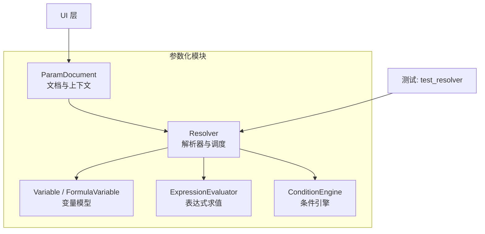
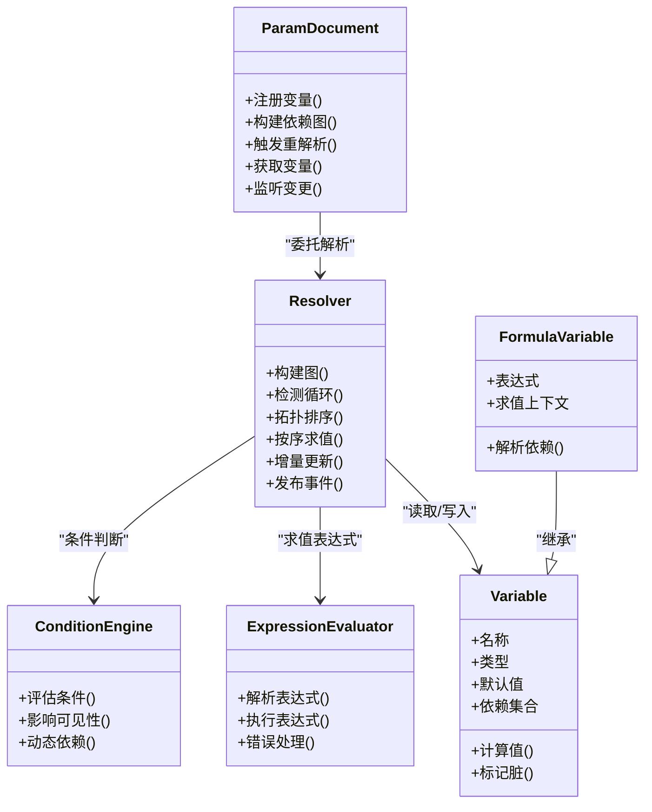
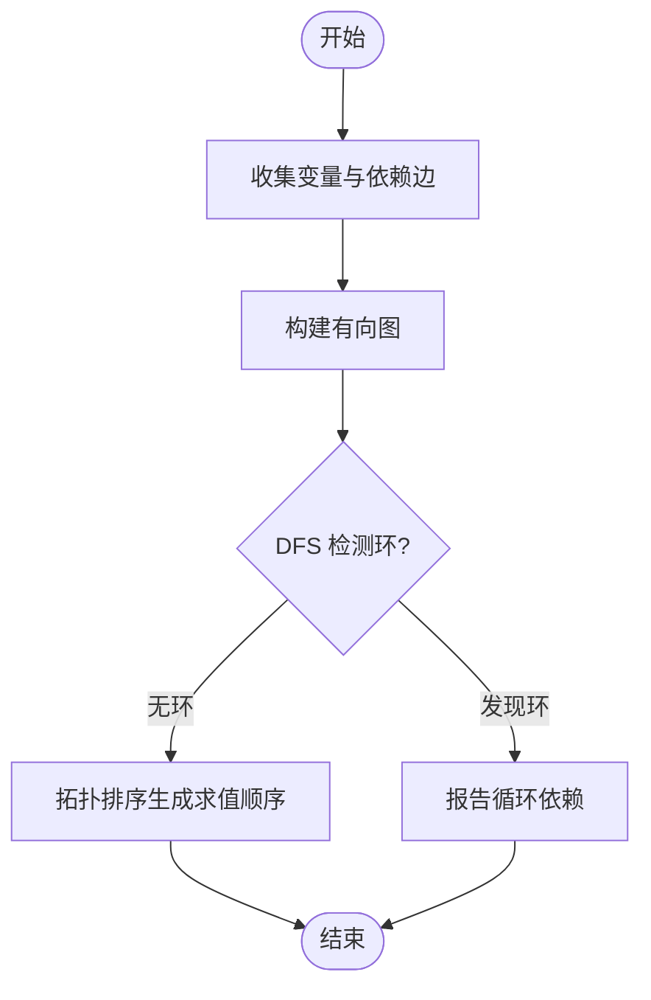
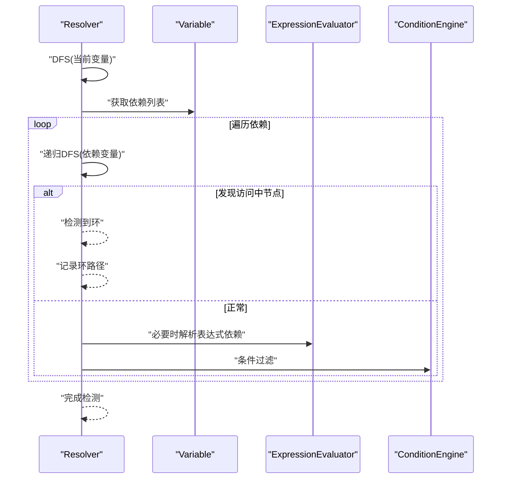
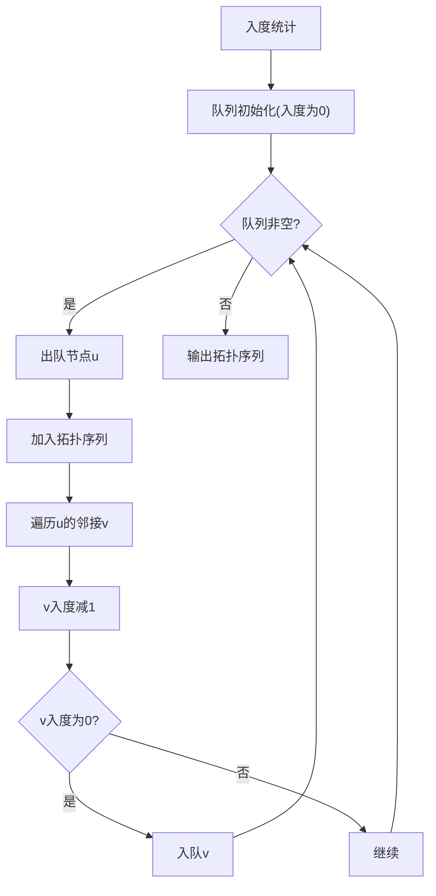
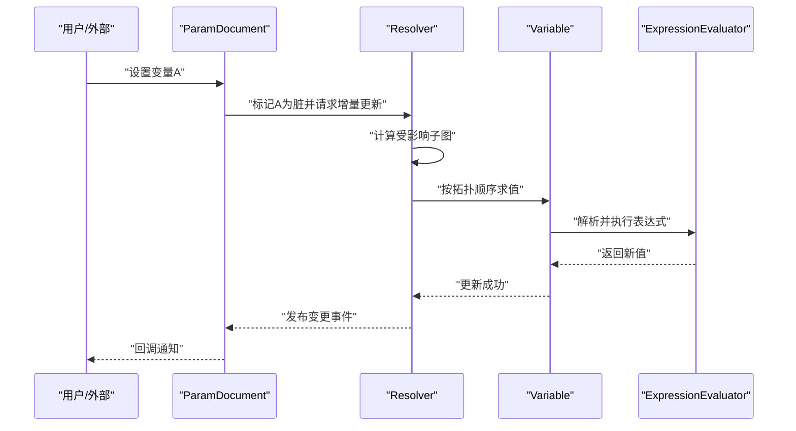
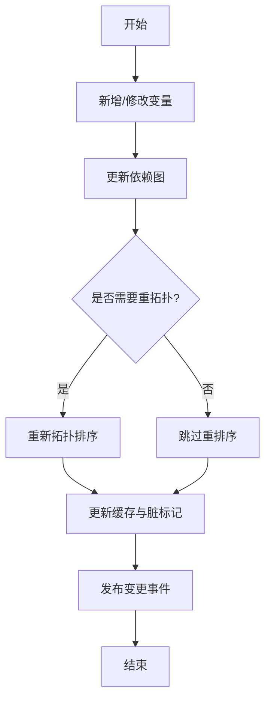
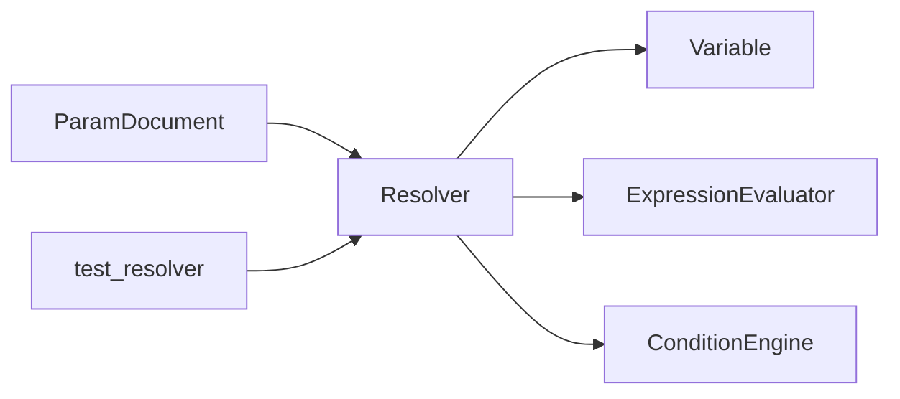

# 依赖解析系统

<cite>
**本文引用的文件**   
- [ParamDocument.h](file://src/parametric/ParamDocument.h)
- [ParamDocument.cpp](file://src/parametric/ParamDocument.cpp)
- [Resolver.h](file://src/parametric/Resolver.h)
- [Resolver.cpp](file://src/parametric/Resolver.cpp)
- [Variable.h](file://src/parametric/Variable.h)
- [FormulaVariable.h](file://src/parametric/FormulaVariable.h)
- [ExpressionEvaluator.h](file://src/parametric/ExpressionEvaluator.h)
- [ExpressionEvaluator.cpp](file://src/parametric/ExpressionEvaluator.cpp)
- [ConditionEngine.h](file://src/parametric/ConditionEngine.h)
- [ConditionEngine.cpp](file://src/parametric/ConditionEngine.cpp)
- [test_resolver.cpp](file://tests/test_resolver.cpp)
</cite>

## 目录
1. [简介](#简介)
2. [项目结构](#项目结构)
3. [核心组件](#核心组件)
4. [架构总览](#架构总览)
5. [详细组件分析](#详细组件分析)
6. [依赖关系分析](#依赖关系分析)
7. [性能考量](#性能考量)
8. [故障排查指南](#故障排查指南)
9. [结论](#结论)
10. [附录](#附录)

## 简介
本技术文档围绕参数化设计中的“依赖解析系统”展开，重点阐述以下方面：
- 参数依赖图的构建算法与数据结构
- 循环依赖检测策略
- 拓扑排序与求值顺序控制
- 变量解析的顺序控制、延迟求值与增量更新机制
- 依赖关系的建立、维护与销毁流程
- 复杂依赖场景的处理、冲突解决与性能优化
- 解析器配置项、扩展点与自定义解析逻辑
- 依赖分析的可视化与调试方法

该文档面向希望深入理解并扩展依赖解析系统的开发者，同时为使用者提供清晰的实践指导。

## 项目结构
依赖解析系统位于 parametric 模块中，核心文件包括：
- 文档与上下文管理：ParamDocument
- 解析器与调度：Resolver
- 变量模型：Variable、FormulaVariable
- 表达式求值：ExpressionEvaluator
- 条件引擎：ConditionEngine
- 测试用例：test_resolver

**图示来源** 
- [ParamDocument.h](file://src/parametric/ParamDocument.h)
- [Resolver.h](file://src/parametric/Resolver.h)
- [Variable.h](file://src/parametric/Variable.h)
- [FormulaVariable.h](file://src/parametric/FormulaVariable.h)
- [ExpressionEvaluator.h](file://src/parametric/ExpressionEvaluator.h)
- [ConditionEngine.h](file://src/parametric/ConditionEngine.h)
- [test_resolver.cpp](file://tests/test_resolver.cpp)

**章节来源**
- [ParamDocument.h](file://src/parametric/ParamDocument.h)
- [Resolver.h](file://src/parametric/Resolver.h)
- [Variable.h](file://src/parametric/Variable.h)
- [FormulaVariable.h](file://src/parametric/FormulaVariable.h)
- [ExpressionEvaluator.h](file://src/parametric/ExpressionEvaluator.h)
- [ConditionEngine.h](file://src/parametric/ConditionEngine.h)
- [test_resolver.cpp](file://tests/test_resolver.cpp)

## 核心组件
- ParamDocument：负责参数文档的生命周期、变量注册、依赖图管理与全局上下文（如命名空间、作用域）的维护。
- Resolver：实现依赖图的构建、循环依赖检测、拓扑排序、求值顺序控制、增量更新与事件通知。
- Variable/FormulaVariable：表示可被表达式引用的变量，支持类型、默认值、依赖声明、脏标记与缓存。
- ExpressionEvaluator：解析并执行表达式，支持函数调用、常量、变量引用与错误处理。
- ConditionEngine：基于条件的分支与可见性控制，影响依赖图结构与求值路径。

**章节来源**
- [ParamDocument.h](file://src/parametric/ParamDocument.h)
- [Resolver.h](file://src/parametric/Resolver.h)
- [Variable.h](file://src/parametric/Variable.h)
- [FormulaVariable.h](file://src/parametric/FormulaVariable.h)
- [ExpressionEvaluator.h](file://src/parametric/ExpressionEvaluator.h)
- [ConditionEngine.h](file://src/parametric/ConditionEngine.h)

## 架构总览
依赖解析系统采用“文档-解析器-变量-求值器-条件引擎”的分层架构。文档层暴露接口供上层使用；解析器协调变量与求值器，完成依赖图构建与求值；条件引擎在运行时动态影响依赖关系。

**图示来源** 
- [ParamDocument.h](file://src/parametric/ParamDocument.h)
- [Resolver.h](file://src/parametric/Resolver.h)
- [Variable.h](file://src/parametric/Variable.h)
- [FormulaVariable.h](file://src/parametric/FormulaVariable.h)
- [ExpressionEvaluator.h](file://src/parametric/ExpressionEvaluator.h)
- [ConditionEngine.h](file://src/parametric/ConditionEngine.h)

## 详细组件分析

### 依赖图构建算法
- 输入：变量集合及其依赖声明（显式或从表达式推导）。
- 步骤：
  - 遍历所有变量，收集其依赖边，形成有向图。
  - 对每个变量进行深度优先搜索（DFS），记录访问状态以检测环。
  - 将无环图转换为拓扑序列，作为后续求值顺序。
- 复杂度：O(V+E)，V 为变量数，E 为依赖边数。
- 关键点：
  - 支持动态添加/删除变量与依赖边。
  - 条件引擎可在求值前过滤不可见变量，从而改变图结构。

**图示来源** 
- [Resolver.h](file://src/parametric/Resolver.h)
- [Resolver.cpp](file://src/parametric/Resolver.cpp)

**章节来源**
- [Resolver.h](file://src/parametric/Resolver.h)
- [Resolver.cpp](file://src/parametric/Resolver.cpp)

### 循环依赖检测
- 策略：在 DFS 过程中维护三种状态（未访问、访问中、已访问），若遇到“访问中”节点则判定存在环。
- 输出：包含环路径的诊断信息，便于定位问题变量。
- 处理：抛出异常或返回错误码，阻止无效图进入求值阶段。

**图示来源** 
- [Resolver.h](file://src/parametric/Resolver.h)
- [Resolver.cpp](file://src/parametric/Resolver.cpp)
- [ExpressionEvaluator.h](file://src/parametric/ExpressionEvaluator.h)
- [ConditionEngine.h](file://src/parametric/ConditionEngine.h)

**章节来源**
- [Resolver.h](file://src/parametric/Resolver.h)
- [Resolver.cpp](file://src/parametric/Resolver.cpp)

### 拓扑排序与求值顺序控制
- 算法：Kahn 算法或 DFS 后序逆序生成拓扑序列。
- 顺序控制：
  - 根变量（无依赖）先求值。
  - 叶子变量（被其他变量依赖）后求值。
  - 条件分支影响部分变量的可见性与求值路径。
- 结果：保证每次求值时，依赖变量在其消费者之前已完成计算。

**图示来源** 
- [Resolver.h](file://src/parametric/Resolver.h)
- [Resolver.cpp](file://src/parametric/Resolver.cpp)

**章节来源**
- [Resolver.h](file://src/parametric/Resolver.h)
- [Resolver.cpp](file://src/parametric/Resolver.cpp)

### 变量解析的顺序控制、延迟求值与增量更新
- 顺序控制：依据拓扑序列依次求值，确保依赖满足。
- 延迟求值：
  - 变量值按需计算，避免不必要的开销。
  - 支持惰性解析表达式，仅在首次访问或依赖变化时求值。
- 增量更新：
  - 当某变量值变化时，仅重新计算受影响的下游变量。
  - 通过脏标记与依赖传播实现最小化重算范围。
- 事件通知：
  - 变量更新后发出事件，驱动 UI 或其他子系统刷新。

**图示来源** 
- [ParamDocument.h](file://src/parametric/ParamDocument.h)
- [Resolver.h](file://src/parametric/Resolver.h)
- [Variable.h](file://src/parametric/Variable.h)
- [ExpressionEvaluator.h](file://src/parametric/ExpressionEvaluator.h)

**章节来源**
- [ParamDocument.h](file://src/parametric/ParamDocument.h)
- [Resolver.h](file://src/parametric/Resolver.h)
- [Variable.h](file://src/parametric/Variable.h)
- [ExpressionEvaluator.h](file://src/parametric/ExpressionEvaluator.h)

### 依赖关系的建立、维护与销毁
- 建立：
  - 显式声明依赖或通过表达式解析隐式推导。
  - 条件引擎根据运行时状态动态调整依赖边。
- 维护：
  - 变量增删改时更新依赖图与拓扑序列。
  - 脏标记与缓存失效策略保证一致性。
- 销毁：
  - 释放变量资源，清理依赖边与缓存。
  - 解除事件订阅，避免悬挂指针或内存泄漏。

**图示来源** 
- [ParamDocument.h](file://src/parametric/ParamDocument.h)
- [Resolver.h](file://src/parametric/Resolver.h)
- [Variable.h](file://src/parametric/Variable.h)

**章节来源**
- [ParamDocument.h](file://src/parametric/ParamDocument.h)
- [Resolver.h](file://src/parametric/Resolver.h)
- [Variable.h](file://src/parametric/Variable.h)

### 复杂依赖场景与冲突解决
- 多源依赖：同一变量被多个上游变量依赖，需确保所有上游一致后再求值。
- 条件分支：不同条件下依赖图不同，需在求值前评估条件以确定有效路径。
- 冲突解决：
  - 优先级策略：定义变量优先级，冲突时选择高优先级路径。
  - 回退策略：当主路径失败时尝试备用表达式或默认值。
- 示例参考：测试用例展示了常见复杂场景与预期行为。

**章节来源**
- [test_resolver.cpp](file://tests/test_resolver.cpp)

### 解析器的配置选项、扩展点与自定义解析逻辑
- 配置项：
  - 是否启用严格模式（禁止隐式依赖推断）
  - 最大递归深度限制
  - 日志级别与诊断输出
  - 条件引擎策略（例如短路求值）
- 扩展点：
  - 自定义变量类型与求值器
  - 自定义依赖推导规则
  - 自定义错误处理与恢复策略
- 自定义解析逻辑：
  - 通过注入表达式求值器实现领域特定函数
  - 通过条件引擎扩展分支逻辑

**章节来源**
- [Resolver.h](file://src/parametric/Resolver.h)
- [ExpressionEvaluator.h](file://src/parametric/ExpressionEvaluator.h)
- [ConditionEngine.h](file://src/parametric/ConditionEngine.h)

### 依赖分析的可视化工具与调试方法
- 可视化：
  - 导出依赖图为 DOT/GML 格式，使用 Graphviz 渲染
  - 在 UI 中高亮显示环路与关键路径
- 调试：
  - 打印拓扑序列与求值顺序
  - 输出脏标记传播轨迹
  - 捕获表达式求值过程中的中间结果与错误堆栈

[本节为概念性内容，不直接分析具体文件]

## 依赖关系分析
- 组件耦合：
  - Resolver 强依赖 Variable、ExpressionEvaluator、ConditionEngine
  - ParamDocument 聚合 Resolver 并提供高层 API
- 外部依赖：
  - 表达式解析库（由 ExpressionEvaluator 封装）
  - 图形库（用于可视化，可选）
- 潜在循环依赖：
  - 代码层面应避免模块间循环导入
  - 运行时依赖图必须无环

**图示来源** 
- [ParamDocument.h](file://src/parametric/ParamDocument.h)
- [Resolver.h](file://src/parametric/Resolver.h)
- [Variable.h](file://src/parametric/Variable.h)
- [ExpressionEvaluator.h](file://src/parametric/ExpressionEvaluator.h)
- [ConditionEngine.h](file://src/parametric/ConditionEngine.h)
- [test_resolver.cpp](file://tests/test_resolver.cpp)

**章节来源**
- [ParamDocument.h](file://src/parametric/ParamDocument.h)
- [Resolver.h](file://src/parametric/Resolver.h)
- [Variable.h](file://src/parametric/Variable.h)
- [ExpressionEvaluator.h](file://src/parametric/ExpressionEvaluator.h)
- [ConditionEngine.h](file://src/parametric/ConditionEngine.h)
- [test_resolver.cpp](file://tests/test_resolver.cpp)

## 性能考量
- 时间复杂度：依赖图构建 O(V+E)，拓扑排序 O(V+E)，增量更新仅影响受影响子图。
- 空间复杂度：存储图结构 O(V+E)，缓存与脏标记 O(V)。
- 优化建议：
  - 批量更新变量以减少多次重拓扑
  - 使用增量缓存与懒加载减少重复求值
  - 条件引擎短路求值降低不必要计算
  - 合理划分变量粒度，避免过细导致图过大

[本节提供通用指导，不直接分析具体文件]

## 故障排查指南
- 常见问题：
  - 循环依赖：检查变量依赖声明与表达式引用
  - 求值顺序错误：确认拓扑序列与脏标记传播
  - 表达式解析失败：查看错误消息与上下文变量
- 调试步骤：
  - 启用详细日志，输出依赖图与求值过程
  - 使用测试用例复现问题，逐步缩小范围
  - 导出依赖图进行离线分析

**章节来源**
- [Resolver.h](file://src/parametric/Resolver.h)
- [Resolver.cpp](file://src/parametric/Resolver.cpp)
- [ExpressionEvaluator.h](file://src/parametric/ExpressionEvaluator.h)
- [test_resolver.cpp](file://tests/test_resolver.cpp)

## 结论
依赖解析系统通过严谨的图构建、环检测与拓扑排序，实现了稳定高效的变量求值与增量更新。结合条件引擎与可扩展的表达式求值器，能够灵活应对复杂的参数化设计需求。通过合理的配置与调试手段，开发者可以构建高性能、易维护的参数化应用。

[本节为总结性内容，不直接分析具体文件]

## 附录
- 术语表：
  - 依赖图：变量之间的有向边集合
  - 拓扑序列：满足依赖约束的线性顺序
  - 脏标记：变量值失效的标志位
  - 增量更新：仅重算受影响部分的更新策略
- 最佳实践：
  - 明确变量依赖，避免隐式耦合
  - 合理使用条件分支，控制依赖图规模
  - 利用测试用例覆盖边界与异常路径

[本节为补充信息，不直接分析具体文件]