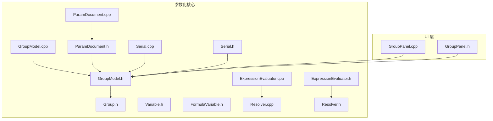
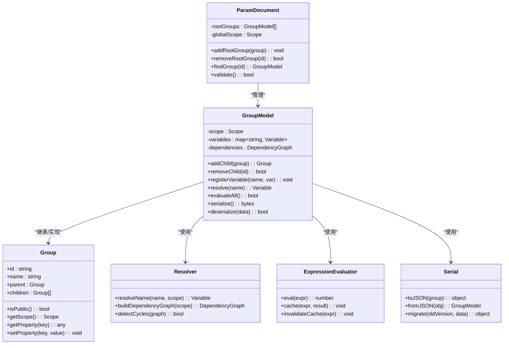
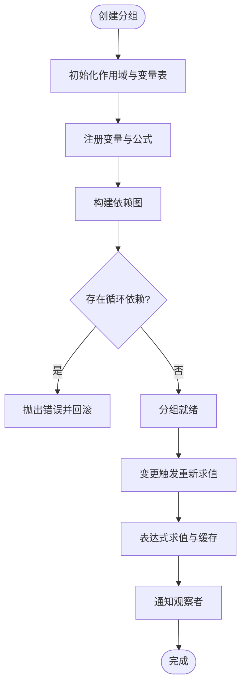
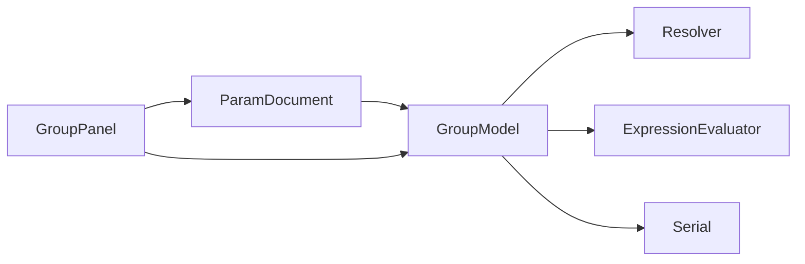

# 分组模型

<cite>
**本文引用的文件**   
- [Group.h](file://src/parametric/Group.h)
- [GroupModel.cpp](file://src/parametric/GroupModel.cpp)
- [GroupModel.h](file://src/parametric/GroupModel.h)
- [ParamDocument.cpp](file://src/parametric/ParamDocument.cpp)
- [ParamDocument.h](file://src/parametric/ParamDocument.h)
- [Serial.cpp](file://src/parametric/Serial.cpp)
- [Serial.h](file://src/parametric/Serial.h)
- [Variable.h](file://src/parametric/Variable.h)
- [FormulaVariable.h](file://src/parametric/FormulaVariable.h)
- [ExpressionEvaluator.cpp](file://src/parametric/ExpressionEvaluator.cpp)
- [ExpressionEvaluator.h](file://src/parametric/ExpressionEvaluator.h)
- [Resolver.cpp](file://src/parametric/Resolver.cpp)
- [Resolver.h](file://src/parametric/Resolver.h)
- [GroupPanel.cpp](file://src/ui/GroupPanel.cpp)
- [GroupPanel.h](file://src/ui/GroupPanel.h)
</cite>

## 目录
1. [简介](#简介)
2. [项目结构](#项目结构)
3. [核心组件](#核心组件)
4. [架构总览](#架构总览)
5. [详细组件分析](#详细组件分析)
6. [依赖关系分析](#依赖关系分析)
7. [性能考量](#性能考量)
8. [故障排查指南](#故障排查指南)
9. [结论](#结论)
10. [附录](#附录)

## 简介
本技术文档围绕“分组模型”展开，系统阐述分组的层次结构、继承与依赖管理、作用域与命名空间、变量可见性规则，以及创建、修改、删除、复制等操作的实现细节。同时给出序列化格式、版本兼容性与数据迁移策略，并提供最佳实践与常见问题解决方案，帮助开发者与使用者高效、安全地构建与维护参数化设计中的分组体系。

## 项目结构
与分组模型直接相关的代码主要位于 parametric 模块与 ui 模块：
- parametric/Group.h：定义分组抽象接口与基础能力
- parametric/GroupModel.*：分组模型的实现，包含层次组织、作用域、依赖解析、生命周期管理等
- parametric/ParamDocument.*：文档级容器，负责分组集合管理与全局上下文
- parametric/Serial.*：分组与变量的序列化/反序列化
- parametric/Variable.h / FormulaVariable.h：变量与公式变量定义
- parametric/ExpressionEvaluator.*：表达式求值器
- parametric/Resolver.*：名称解析与依赖图构建
- ui/GroupPanel.*：分组面板的 UI 交互层

图表来源
- [Group.h](file://src/parametric/Group.h)
- [GroupModel.cpp](file://src/parametric/GroupModel.cpp)
- [GroupModel.h](file://src/parametric/GroupModel.h)
- [ParamDocument.cpp](file://src/parametric/ParamDocument.cpp)
- [ParamDocument.h](file://src/parametric/ParamDocument.h)
- [Serial.cpp](file://src/parametric/Serial.cpp)
- [Serial.h](file://src/parametric/Serial.h)
- [Variable.h](file://src/parametric/Variable.h)
- [FormulaVariable.h](file://src/parametric/FormulaVariable.h)
- [ExpressionEvaluator.cpp](file://src/parametric/ExpressionEvaluator.cpp)
- [ExpressionEvaluator.h](file://src/parametric/ExpressionEvaluator.h)
- [Resolver.cpp](file://src/parametric/Resolver.cpp)
- [Resolver.h](file://src/parametric/Resolver.h)
- [GroupPanel.cpp](file://src/ui/GroupPanel.cpp)
- [GroupPanel.h](file://src/ui/GroupPanel.h)

章节来源
- [Group.h](file://src/parametric/Group.h)
- [GroupModel.h](file://src/parametric/GroupModel.h)
- [GroupModel.cpp](file://src/parametric/GroupModel.cpp)
- [ParamDocument.h](file://src/parametric/ParamDocument.h)
- [ParamDocument.cpp](file://src/parametric/ParamDocument.cpp)
- [Serial.h](file://src/parametric/Serial.h)
- [Serial.cpp](file://src/parametric/Serial.cpp)
- [Variable.h](file://src/parametric/Variable.h)
- [FormulaVariable.h](file://src/parametric/FormulaVariable.h)
- [ExpressionEvaluator.h](file://src/parametric/ExpressionEvaluator.h)
- [ExpressionEvaluator.cpp](file://src/parametric/ExpressionEvaluator.cpp)
- [Resolver.h](file://src/parametric/Resolver.h)
- [Resolver.cpp](file://src/parametric/Resolver.cpp)
- [GroupPanel.h](file://src/ui/GroupPanel.h)
- [GroupPanel.cpp](file://src/ui/GroupPanel.cpp)

## 核心组件
- 分组抽象（Group）：定义分组的基本能力与接口，如标识、名称、层级关系、可见性、属性访问等。
- 分组模型（GroupModel）：实现分组的具体行为，包括子分组管理、变量注册与作用域、依赖解析、事件通知、序列化支持等。
- 文档容器（ParamDocument）：维护所有根分组、全局命名空间、跨分组引用与一致性校验。
- 序列化（Serial）：提供分组与变量的序列化/反序列化接口，支持版本字段与兼容性检查。
- 变量与公式变量（Variable, FormulaVariable）：描述变量类型、取值、表达式与求值依赖。
- 表达式求值器（ExpressionEvaluator）：对公式进行解析、缓存与求值，处理错误与循环依赖检测。
- 名称解析器（Resolver）：基于作用域链解析变量名，构建依赖图，支持前向声明与延迟绑定。
- UI 面板（GroupPanel）：提供分组的可视化编辑、拖拽重排、批量操作与实时预览。

章节来源
- [Group.h](file://src/parametric/Group.h)
- [GroupModel.h](file://src/parametric/GroupModel.h)
- [GroupModel.cpp](file://src/parametric/GroupModel.cpp)
- [ParamDocument.h](file://src/parametric/ParamDocument.h)
- [ParamDocument.cpp](file://src/parametric/ParamDocument.cpp)
- [Serial.h](file://src/parametric/Serial.h)
- [Serial.cpp](file://src/parametric/Serial.cpp)
- [Variable.h](file://src/parametric/Variable.h)
- [FormulaVariable.h](file://src/parametric/FormulaVariable.h)
- [ExpressionEvaluator.h](file://src/parametric/ExpressionEvaluator.h)
- [ExpressionEvaluator.cpp](file://src/parametric/ExpressionEvaluator.cpp)
- [Resolver.h](file://src/parametric/Resolver.h)
- [Resolver.cpp](file://src/parametric/Resolver.cpp)
- [GroupPanel.h](file://src/ui/GroupPanel.h)
- [GroupPanel.cpp](file://src/ui/GroupPanel.cpp)

## 架构总览
分组模型采用分层容器与独立解析器的组合架构：
- 分层容器：GroupModel 作为节点，维护父子关系与变量表；ParamDocument 作为根容器，协调全局状态。
- 解析与求值：Resolver 负责名称解析与依赖图构建；ExpressionEvaluator 负责表达式求值与缓存。
- 序列化：Serial 将分组树与变量表序列化为稳定格式，支持版本字段与迁移钩子。
- UI 集成：GroupPanel 通过信号槽与 GroupModel/ParamDocument 交互，驱动视图更新。

图表来源
- [Group.h](file://src/parametric/Group.h)
- [GroupModel.h](file://src/parametric/GroupModel.h)
- [GroupModel.cpp](file://src/parametric/GroupModel.cpp)
- [ParamDocument.h](file://src/parametric/ParamDocument.h)
- [ParamDocument.cpp](file://src/parametric/ParamDocument.cpp)
- [Resolver.h](file://src/parametric/Resolver.h)
- [Resolver.cpp](file://src/parametric/Resolver.cpp)
- [ExpressionEvaluator.h](file://src/parametric/ExpressionEvaluator.h)
- [ExpressionEvaluator.cpp](file://src/parametric/ExpressionEvaluator.cpp)
- [Serial.h](file://src/parametric/Serial.h)
- [Serial.cpp](file://src/parametric/Serial.cpp)

## 详细组件分析

### 分组抽象与模型（Group / GroupModel）
- 层次结构：GroupModel 维护父子关系，形成树形结构；每个节点拥有独立的作用域与变量表。
- 继承关系：Group 定义通用接口，GroupModel 实现具体行为，便于扩展自定义分组类型。
- 依赖管理：GroupModel 内部维护依赖图，支持增量更新与循环依赖检测。
- 作用域规则：变量按作用域链查找，子作用域可遮蔽父作用域同名变量；公开变量可通过限定名访问。
- 命名空间管理：支持以点号分隔的路径访问（如 groupA.groupB.var），避免命名冲突。
- 生命周期：创建时初始化作用域与依赖图；销毁时清理缓存与订阅。

图表来源
- [GroupModel.h](file://src/parametric/GroupModel.h)
- [GroupModel.cpp](file://src/parametric/GroupModel.cpp)
- [Resolver.h](file://src/parametric/Resolver.h)
- [Resolver.cpp](file://src/parametric/Resolver.cpp)
- [ExpressionEvaluator.h](file://src/parametric/ExpressionEvaluator.h)
- [ExpressionEvaluator.cpp](file://src/parametric/ExpressionEvaluator.cpp)

章节来源
- [Group.h](file://src/parametric/Group.h)
- [GroupModel.h](file://src/parametric/GroupModel.h)
- [GroupModel.cpp](file://src/parametric/GroupModel.cpp)

### 文档容器（ParamDocument）
- 根分组管理：维护多个根分组，提供查找、添加、删除接口。
- 全局作用域：提供全局命名空间，供所有分组共享常量或配置。
- 一致性校验：在保存或求值前执行完整性检查，确保引用有效、无循环依赖。

章节来源
- [ParamDocument.h](file://src/parametric/ParamDocument.h)
- [ParamDocument.cpp](file://src/parametric/ParamDocument.cpp)

### 名称解析与依赖图（Resolver）
- 名称解析：基于作用域链解析变量名，支持限定名与别名。
- 依赖图构建：从表达式中提取依赖项，生成有向图。
- 循环检测：拓扑排序检测环，失败时返回明确错误信息。

章节来源
- [Resolver.h](file://src/parametric/Resolver.h)
- [Resolver.cpp](file://src/parametric/Resolver.cpp)

### 表达式求值（ExpressionEvaluator）
- 表达式解析：将字符串表达式转换为可执行单元。
- 缓存机制：对常用表达式结果进行缓存，提升性能。
- 错误处理：捕获语法错误、运行时异常，并上报调用方。

章节来源
- [ExpressionEvaluator.h](file://src/parametric/ExpressionEvaluator.h)
- [ExpressionEvaluator.cpp](file://src/parametric/ExpressionEvaluator.cpp)

### 序列化与迁移（Serial）
- 序列化格式：JSON 风格的结构体，包含分组元数据、变量表、依赖图与版本字段。
- 版本兼容：通过 version 字段判断旧格式，提供迁移函数将旧数据转换为新结构。
- 数据迁移：支持字段重命名、默认值注入、结构重组等迁移步骤。

章节来源
- [Serial.h](file://src/parametric/Serial.h)
- [Serial.cpp](file://src/parametric/Serial.cpp)

### UI 交互（GroupPanel）
- 分组树展示：递归渲染分组树，支持展开/折叠。
- 拖拽重排：支持分组间的拖拽移动，自动更新父子关系与作用域。
- 批量操作：支持多选、复制、粘贴、删除等操作。
- 实时预览：监听分组变化，实时更新变量值与依赖状态。

章节来源
- [GroupPanel.h](file://src/ui/GroupPanel.h)
- [GroupPanel.cpp](file://src/ui/GroupPanel.cpp)

## 依赖关系分析
分组模型的核心依赖如下：
- GroupModel 依赖 Resolver 进行名称解析与依赖图构建。
- GroupModel 依赖 ExpressionEvaluator 进行表达式求值与缓存。
- GroupModel 依赖 Serial 进行持久化与迁移。
- ParamDocument 聚合多个 GroupModel，提供全局协调。
- UI 层通过 GroupPanel 与 GroupModel/ParamDocument 交互。

图表来源
- [GroupModel.h](file://src/parametric/GroupModel.h)
- [Resolver.h](file://src/parametric/Resolver.h)
- [ExpressionEvaluator.h](file://src/parametric/ExpressionEvaluator.h)
- [Serial.h](file://src/parametric/Serial.h)
- [ParamDocument.h](file://src/parametric/ParamDocument.h)
- [GroupPanel.h](file://src/ui/GroupPanel.h)

章节来源
- [GroupModel.h](file://src/parametric/GroupModel.h)
- [Resolver.h](file://src/parametric/Resolver.h)
- [ExpressionEvaluator.h](file://src/parametric/ExpressionEvaluator.h)
- [Serial.h](file://src/parametric/Serial.h)
- [ParamDocument.h](file://src/parametric/ParamDocument.h)
- [GroupPanel.h](file://src/ui/GroupPanel.h)

## 性能考量
- 依赖图增量更新：仅在受影响的子树重新求值，避免全量计算。
- 表达式缓存：对重复表达式结果进行缓存，减少解析开销。
- 懒加载作用域：按需构建子作用域，降低内存占用。
- 批量操作合并：UI 层的多次变更合并为一次重算，减少抖动。

[本节为通用指导，不直接分析具体文件]

## 故障排查指南
- 循环依赖检测：当出现循环引用时，Resolver 会抛出明确错误；建议检查表达式中的自引用与间接引用。
- 作用域遮蔽：子作用域变量遮蔽父作用域同名变量，导致未预期结果；建议使用限定名访问。
- 序列化版本不匹配：打开旧文件时报错，需先运行迁移流程；检查 version 字段与迁移函数。
- 表达式求值失败：检查语法错误与变量未定义；查看 ExpressionEvaluator 的错误日志。
- UI 不同步：确认信号槽连接正常，必要时手动触发刷新。

章节来源
- [Resolver.cpp](file://src/parametric/Resolver.cpp)
- [ExpressionEvaluator.cpp](file://src/parametric/ExpressionEvaluator.cpp)
- [Serial.cpp](file://src/parametric/Serial.cpp)
- [GroupPanel.cpp](file://src/ui/GroupPanel.cpp)

## 结论
分组模型通过清晰的层次结构与独立解析器，实现了强大的作用域与依赖管理能力。结合稳定的序列化格式与迁移策略，确保了数据的长期可维护性。遵循本文的最佳实践与故障排查建议，可有效提升开发效率与系统稳定性。

[本节为总结，不直接分析具体文件]

## 附录

### 使用示例
- 创建嵌套分组：在父分组下添加子分组，设置可见性与属性，注册变量与公式。
- 设置分组属性：通过键值对设置元数据，如标签、颜色、说明等。
- 管理组间依赖：通过限定名引用其他分组的变量，构建跨分组依赖图。
- 复制与粘贴：复制分组树结构，保留变量与依赖关系，调整命名以避免冲突。
- 序列化与迁移：导出 JSON 文件，升级版本后运行迁移脚本，验证数据一致性。

[本节为概念性内容，不直接分析具体文件]

### 最佳实践
- 合理划分作用域：将相关变量集中在同一分组，减少跨作用域引用。
- 避免循环依赖：在设计阶段审查依赖图，及时消除环。
- 使用限定名：提高可读性与可维护性，避免歧义。
- 版本化管理：每次重大变更增加版本号，提供迁移路径。
- 单元测试覆盖：对关键分组与表达式编写测试用例，确保正确性。

[本节为通用指导，不直接分析具体文件]