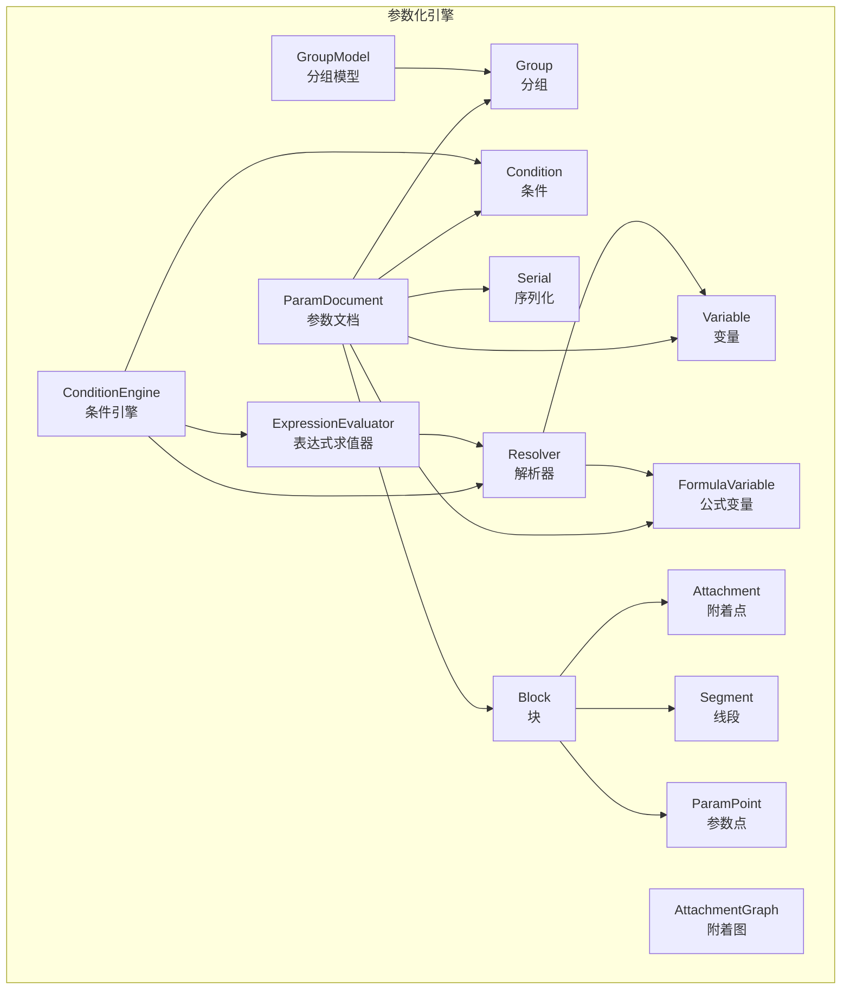
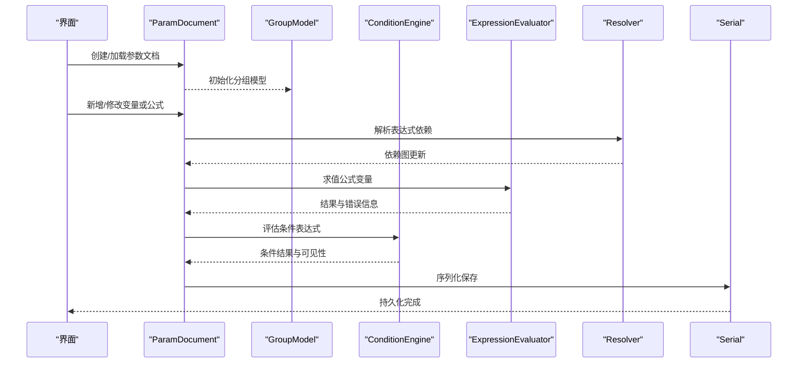
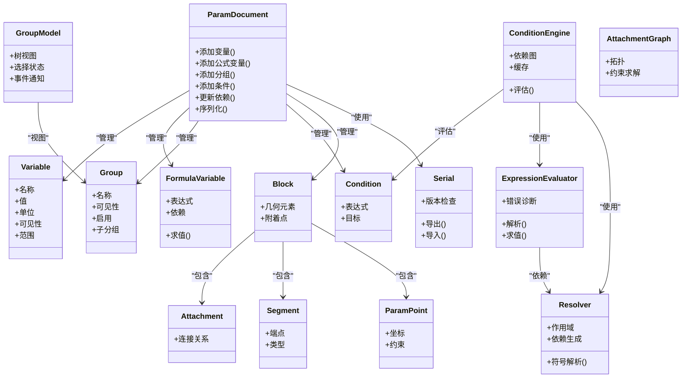
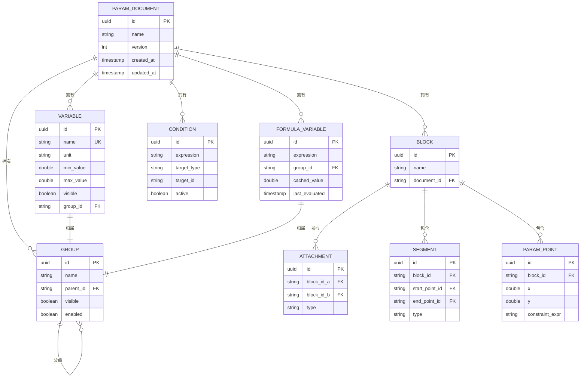

# 参数化引擎

<cite>
**本文档引用的文件**   
- [ParamDocument.h](file://src/parametric/ParamDocument.h)
- [ParamDocument.cpp](file://src/parametric/ParamDocument.cpp)
- [Variable.h](file://src/parametric/Variable.h)
- [FormulaVariable.h](file://src/parametric/FormulaVariable.h)
- [Group.h](file://src/parametric/Group.h)
- [GroupModel.h](file://src/parametric/GroupModel.h)
- [GroupModel.cpp](file://src/parametric/GroupModel.cpp)
- [Condition.h](file://src/parametric/Condition.h)
- [ConditionEngine.h](file://src/parametric/ConditionEngine.h)
- [ConditionEngine.cpp](file://src/parametric/ConditionEngine.cpp)
- [ExpressionEvaluator.h](file://src/parametric/ExpressionEvaluator.h)
- [ExpressionEvaluator.cpp](file://src/parametric/ExpressionEvaluator.cpp)
- [Resolver.h](file://src/parametric/Resolver.h)
- [Resolver.cpp](file://src/parametric/Resolver.cpp)
- [Serial.h](file://src/parametric/Serial.h)
- [Serial.cpp](file://src/parametric/Serial.cpp)
- [Block.h](file://src/parametric/Block.h)
- [Block.cpp](file://src/parametric/Block.cpp)
- [Attachment.h](file://src/parametric/Attachment.h)
- [AttachmentGraph.h](file://src/parametric/AttachmentGraph.h)
- [Segment.h](file://src/parametric/Segment.h)
- [ParamPoint.h](file://src/parametric/ParamPoint.h)
- [test_expression.cpp](file://tests/test_expression.cpp)
- [test_resolver.cpp](file://tests/test_resolver.cpp)
</cite>

## 目录
1. [简介](#简介)
2. [项目结构](#项目结构)
3. [核心组件](#核心组件)
4. [架构总览](#架构总览)
5. [详细组件分析](#详细组件分析)
6. [依赖关系分析](#依赖关系分析)
7. [性能考虑](#性能考虑)
8. [故障排查指南](#故障排查指南)
9. [结论](#结论)
10. [附录](#附录)

## 简介
本文件为“参数化引擎”的数据模型与实现文档，聚焦以下方面：
- 实体关系、字段定义与数据类型
- 主键/外键、索引与约束（在内存模型中的体现）
- 数据验证规则与业务规则
- 数据库模式图（以内存对象模型映射到持久化的方式呈现）与示例数据
- 数据访问模式、缓存策略与性能考量
- 数据生命周期、保留策略与归档规则
- 数据迁移路径与版本管理
- 数据安全、隐私要求与访问控制
- 重点模块：参数文档、条件引擎、表达式求值器、分组模型与解析器的实现

## 项目结构
参数化引擎的核心位于 src/parametric 目录，围绕 ParamDocument 组织变量、公式变量、分组、条件、表达式求值、解析与序列化等能力。测试用例位于 tests 目录，覆盖表达式求值与解析的关键路径。

图表来源
- [ParamDocument.h](file://src/parametric/ParamDocument.h)
- [Variable.h](file://src/parametric/Variable.h)
- [FormulaVariable.h](file://src/parametric/FormulaVariable.h)
- [Group.h](file://src/parametric/Group.h)
- [GroupModel.h](file://src/parametric/GroupModel.h)
- [Condition.h](file://src/parametric/Condition.h)
- [ConditionEngine.h](file://src/parametric/ConditionEngine.h)
- [ExpressionEvaluator.h](file://src/parametric/ExpressionEvaluator.h)
- [Resolver.h](file://src/parametric/Resolver.h)
- [Serial.h](file://src/parametric/Serial.h)
- [Block.h](file://src/parametric/Block.h)
- [Attachment.h](file://src/parametric/Attachment.h)
- [AttachmentGraph.h](file://src/parametric/AttachmentGraph.h)
- [Segment.h](file://src/parametric/Segment.h)
- [ParamPoint.h](file://src/parametric/ParamPoint.h)

章节来源
- [ParamDocument.h](file://src/parametric/ParamDocument.h)
- [ParamDocument.cpp](file://src/parametric/ParamDocument.cpp)
- [GroupModel.h](file://src/parametric/GroupModel.h)
- [GroupModel.cpp](file://src/parametric/GroupModel.cpp)
- [ConditionEngine.h](file://src/parametric/ConditionEngine.h)
- [ConditionEngine.cpp](file://src/parametric/ConditionEngine.cpp)
- [ExpressionEvaluator.h](file://src/parametric/ExpressionEvaluator.h)
- [ExpressionEvaluator.cpp](file://src/parametric/ExpressionEvaluator.cpp)
- [Resolver.h](file://src/parametric/Resolver.h)
- [Resolver.cpp](file://src/parametric/Resolver.cpp)
- [Serial.h](file://src/parametric/Serial.h)
- [Serial.cpp](file://src/parametric/Serial.cpp)

## 核心组件
- 参数文档（ParamDocument）：作为根容器，统一管理变量、公式变量、分组、条件、块以及序列化入口。提供增删改查、依赖更新与批量操作接口。
- 变量（Variable）：基础数值或文本变量，包含名称、单位、可见性、范围与校验规则。
- 公式变量（FormulaVariable）：基于表达式的变量，存储表达式字符串与求值上下文，支持依赖追踪与增量重算。
- 分组（Group）：用于组织变量与条件的逻辑单元，支持嵌套与可见性控制。
- 分组模型（GroupModel）：面向 UI 的分组视图模型，负责分组树构建、选择状态与事件通知。
- 条件（Condition）：布尔表达式，作用于变量或分组的显示/启用控制。
- 条件引擎（ConditionEngine）：解析并执行条件表达式，维护条件依赖图与变更传播。
- 表达式求值器（ExpressionEvaluator）：安全地解析与计算数学/逻辑表达式，内置函数与常量，支持错误诊断。
- 解析器（Resolver）：将表达式中的符号解析为具体变量或函数，处理作用域与优先级。
- 序列化（Serial）：将参数文档及其子对象序列化为可持久化格式，支持版本兼容与回滚。
- 块（Block）、附着点（Attachment）、附着图（AttachmentGraph）、线段（Segment）、参数点（ParamPoint）：几何与装配相关的数据结构，受参数驱动。

章节来源
- [ParamDocument.h](file://src/parametric/ParamDocument.h)
- [Variable.h](file://src/parametric/Variable.h)
- [FormulaVariable.h](file://src/parametric/FormulaVariable.h)
- [Group.h](file://src/parametric/Group.h)
- [GroupModel.h](file://src/parametric/GroupModel.h)
- [Condition.h](file://src/parametric/Condition.h)
- [ConditionEngine.h](file://src/parametric/ConditionEngine.h)
- [ExpressionEvaluator.h](file://src/parametric/ExpressionEvaluator.h)
- [Resolver.h](file://src/parametric/Resolver.h)
- [Serial.h](file://src/parametric/Serial.h)
- [Block.h](file://src/parametric/Block.h)
- [Attachment.h](file://src/parametric/Attachment.h)
- [AttachmentGraph.h](file://src/parametric/AttachmentGraph.h)
- [Segment.h](file://src/parametric/Segment.h)
- [ParamPoint.h](file://src/parametric/ParamPoint.h)

## 架构总览
参数化引擎采用“文档中心 + 分层服务”的架构：
- 文档层：ParamDocument 持有所有领域对象，提供统一 CRUD 与事务式更新。
- 计算层：ExpressionEvaluator 与 Resolver 组成表达式求值管线；ConditionEngine 管理条件依赖与触发。
- 模型层：GroupModel 暴露给 UI，封装分组树与交互状态。
- 持久化层：Serial 负责序列化/反序列化，保证版本兼容与数据完整性。
- 几何层：Block/Attachment/Segment/ParamPoint 由参数驱动，形成可更新的图形结构。

图表来源
- [ParamDocument.h](file://src/parametric/ParamDocument.h)
- [GroupModel.h](file://src/parametric/GroupModel.h)
- [ConditionEngine.h](file://src/parametric/ConditionEngine.h)
- [ExpressionEvaluator.h](file://src/parametric/ExpressionEvaluator.h)
- [Resolver.h](file://src/parametric/Resolver.h)
- [Serial.h](file://src/parametric/Serial.h)

## 详细组件分析

### 参数文档（ParamDocument）
- 职责：集中管理 Variable、FormulaVariable、Group、Condition、Block 等对象；维护依赖图与变更传播；提供批量更新与撤销/重做支持；协调序列化。
- 关键数据：
  - 变量集合：按名称唯一索引，支持命名空间隔离（通过分组）。
  - 公式变量集合：表达式字符串、求值结果、依赖列表。
  - 分组树：父子关系、可见性与启用状态。
  - 条件集合：表达式与影响目标。
  - 块集合：几何元素与附着关系。
- 约束与验证：
  - 名称唯一性、类型一致性、表达式语法正确性、依赖无环。
  - 范围校验（最小/最大值）、单位换算一致性。
- 性能：
  - 增量依赖更新，避免全量重算。
  - 惰性求值与结果缓存。
- 生命周期：
  - 创建时初始化默认分组与变量模板；销毁前释放几何资源。
- 持久化：
  - 通过 Serial 导出/导入，支持版本字段与兼容性检查。

章节来源
- [ParamDocument.h](file://src/parametric/ParamDocument.h)
- [ParamDocument.cpp](file://src/parametric/ParamDocument.cpp)

### 变量与公式变量（Variable / FormulaVariable）
- 字段与类型：
  - 名称：字符串，唯一键。
  - 值：数值或文本，带单位。
  - 可见性：布尔，控制 UI 显示。
  - 范围：数值上下界，用于输入校验。
  - 表达式：仅 FormulaVariable，字符串形式。
  - 依赖：变量名集合，用于依赖图构建。
- 约束：
  - 名称不可重复；表达式必须合法且可解析；求值结果需满足范围与类型约束。
- 求值与缓存：
  - 表达式求值后缓存结果；依赖变化时失效并重算。
- 示例数据：
  - 变量“长度”=120mm，范围[10,500]；公式变量“周长”=2*(长度+宽度)。

章节来源
- [Variable.h](file://src/parametric/Variable.h)
- [FormulaVariable.h](file://src/parametric/FormulaVariable.h)

### 分组与分组模型（Group / GroupModel）
- 分组（Group）：
  - 层级结构，支持嵌套；每个分组包含变量、子分组与条件。
  - 可见性与启用状态可由条件控制。
- 分组模型（GroupModel）：
  - 面向 UI 的树形视图，提供节点选择、展开/折叠、拖拽排序。
  - 与 ParamDocument 同步，监听变更事件。
- 约束：
  - 分组名称唯一（同层级）；循环引用禁止。
- 示例数据：
  - 分组“尺寸”包含“长度”“宽度”；分组“装饰”包含“花纹”“颜色”。

章节来源
- [Group.h](file://src/parametric/Group.h)
- [GroupModel.h](file://src/parametric/GroupModel.h)
- [GroupModel.cpp](file://src/parametric/GroupModel.cpp)

### 条件与条件引擎（Condition / ConditionEngine）
- 条件（Condition）：
  - 布尔表达式，引用变量或分组属性；支持逻辑运算符与比较。
- 条件引擎（ConditionEngine）：
  - 解析条件表达式，构建依赖图；监听变量变化，触发重新评估。
  - 维护条件结果缓存，避免重复计算。
- 约束：
  - 表达式必须合法；依赖必须存在；避免循环依赖。
- 示例数据：
  - 条件“长度>100”控制“装饰”分组可见性。

章节来源
- [Condition.h](file://src/parametric/Condition.h)
- [ConditionEngine.h](file://src/parametric/ConditionEngine.h)
- [ConditionEngine.cpp](file://src/parametric/ConditionEngine.cpp)

### 表达式求值器与解析器（ExpressionEvaluator / Resolver）
- 表达式求值器（ExpressionEvaluator）：
  - 支持算术、三角、逻辑与常用函数；内置常量与单位换算。
  - 错误诊断：语法错误、运行时异常（除零、越界）。
- 解析器（Resolver）：
  - 将符号解析为变量或函数；处理作用域（分组）与优先级。
  - 生成依赖图，供增量更新使用。
- 约束：
  - 表达式必须符合语法；符号必须在作用域内可解析。
- 示例数据：
  - 表达式“sin(角度)*半径”解析为变量“角度”“半径”与函数“sin”。

章节来源
- [ExpressionEvaluator.h](file://src/parametric/ExpressionEvaluator.h)
- [ExpressionEvaluator.cpp](file://src/parametric/ExpressionEvaluator.cpp)
- [Resolver.h](file://src/parametric/Resolver.h)
- [Resolver.cpp](file://src/parametric/Resolver.cpp)
- [test_expression.cpp](file://tests/test_expression.cpp)
- [test_resolver.cpp](file://tests/test_resolver.cpp)

### 序列化（Serial）
- 职责：将 ParamDocument 及其子对象序列化为 JSON/XML/二进制（依实现），支持版本字段与兼容性检查。
- 特性：
  - 增量序列化：仅序列化变更对象。
  - 回滚支持：保存快照，失败时恢复。
- 约束：
  - 版本升级时需保持向后兼容；缺失字段提供默认值。

章节来源
- [Serial.h](file://src/parametric/Serial.h)
- [Serial.cpp](file://src/parametric/Serial.cpp)

### 几何与附着（Block / Attachment / AttachmentGraph / Segment / ParamPoint）
- 块（Block）：包含多个几何元素（线段、点、附着点），受参数驱动。
- 附着点（Attachment）：定义与其他块的连接关系，形成附着图。
- 附着图（AttachmentGraph）：维护块间拓扑，支持约束求解与布局更新。
- 线段（Segment）：表示直线或曲线段，端点由参数点驱动。
- 参数点（ParamPoint）：坐标由变量或表达式决定，支持约束与联动。
- 约束：
  - 附着关系无环；线段端点必须有效；参数点坐标需在合理范围。
- 示例数据：
  - 块“衣片A”包含线段“肩线”，端点由参数点“肩点1”“肩点2”定义。

章节来源
- [Block.h](file://src/parametric/Block.h)
- [Block.cpp](file://src/parametric/Block.cpp)
- [Attachment.h](file://src/parametric/Attachment.h)
- [AttachmentGraph.h](file://src/parametric/AttachmentGraph.h)
- [Segment.h](file://src/parametric/Segment.h)
- [ParamPoint.h](file://src/parametric/ParamPoint.h)

## 依赖关系分析
参数化引擎内部依赖清晰，遵循单向依赖原则：
- ParamDocument 依赖 Variable、FormulaVariable、Group、Condition、Block、Serial。
- ConditionEngine 依赖 ExpressionEvaluator 与 Resolver。
- GroupModel 依赖 Group 与 ParamDocument 的事件。
- 解析器与求值器不反向依赖上层组件，便于单元测试与替换。

图表来源
- [ParamDocument.h](file://src/parametric/ParamDocument.h)
- [Variable.h](file://src/parametric/Variable.h)
- [FormulaVariable.h](file://src/parametric/FormulaVariable.h)
- [Group.h](file://src/parametric/Group.h)
- [GroupModel.h](file://src/parametric/GroupModel.h)
- [Condition.h](file://src/parametric/Condition.h)
- [ConditionEngine.h](file://src/parametric/ConditionEngine.h)
- [ExpressionEvaluator.h](file://src/parametric/ExpressionEvaluator.h)
- [Resolver.h](file://src/parametric/Resolver.h)
- [Serial.h](file://src/parametric/Serial.h)
- [Block.h](file://src/parametric/Block.h)
- [Attachment.h](file://src/parametric/Attachment.h)
- [AttachmentGraph.h](file://src/parametric/AttachmentGraph.h)
- [Segment.h](file://src/parametric/Segment.h)
- [ParamPoint.h](file://src/parametric/ParamPoint.h)

章节来源
- [ParamDocument.h](file://src/parametric/ParamDocument.h)
- [GroupModel.h](file://src/parametric/GroupModel.h)
- [ConditionEngine.h](file://src/parametric/ConditionEngine.h)
- [ExpressionEvaluator.h](file://src/parametric/ExpressionEvaluator.h)
- [Resolver.h](file://src/parametric/Resolver.h)
- [Serial.h](file://src/parametric/Serial.h)
- [Block.h](file://src/parametric/Block.h)

## 性能考虑
- 依赖图与增量更新：
  - 使用有向无环图（DAG）维护变量与条件依赖，变更时仅重算受影响节点。
- 缓存策略：
  - 表达式求值结果缓存，依赖失效时清除；条件结果缓存，避免重复评估。
- 惰性求值：
  - 对未使用的公式变量延迟求值，减少初始加载开销。
- 批量操作：
  - 合并多次变更，一次性更新依赖图与视图，降低 UI 刷新频率。
- 内存管理：
  - 及时释放不再使用的几何对象；使用智能指针避免泄漏。
- 并发与安全：
  - 读写分离：只读查询可并行；写操作加锁或使用单线程队列。

## 故障排查指南
- 表达式错误：
  - 检查语法与符号解析；查看错误诊断信息（如除零、未知符号）。
- 依赖循环：
  - 检测依赖图中是否存在环；调整变量依赖顺序。
- 条件不生效：
  - 确认条件表达式与作用域；检查变量可见性与启用状态。
- 序列化失败：
  - 检查版本字段与兼容性；确保所有对象可序列化。
- 几何异常：
  - 验证参数点坐标与线段端点有效性；检查附着关系是否闭合。

章节来源
- [ExpressionEvaluator.cpp](file://src/parametric/ExpressionEvaluator.cpp)
- [Resolver.cpp](file://src/parametric/Resolver.cpp)
- [ConditionEngine.cpp](file://src/parametric/ConditionEngine.cpp)
- [Serial.cpp](file://src/parametric/Serial.cpp)

## 结论
参数化引擎以 ParamDocument 为核心，结合表达式求值、条件引擎与分组模型，构建了灵活、可扩展的参数化系统。通过依赖图与缓存机制，实现了高效的增量更新与良好的用户体验。序列化与版本管理确保了数据的持久化与兼容性。几何与附着模块使参数能够驱动复杂的图形结构，适用于服装 CAD 等场景。

## 附录

### 数据模型与关系图（ER 风格）

图表来源
- [ParamDocument.h](file://src/parametric/ParamDocument.h)
- [Variable.h](file://src/parametric/Variable.h)
- [FormulaVariable.h](file://src/parametric/FormulaVariable.h)
- [Group.h](file://src/parametric/Group.h)
- [Condition.h](file://src/parametric/Condition.h)
- [Block.h](file://src/parametric/Block.h)
- [Attachment.h](file://src/parametric/Attachment.h)
- [Segment.h](file://src/parametric/Segment.h)
- [ParamPoint.h](file://src/parametric/ParamPoint.h)

### 示例数据
- 参数文档：名称“衬衫模板”，版本 1，创建时间 2024-01-01。
- 变量：
  - “长度”=120mm，范围[10,500]，可见=true，分组“尺寸”。
  - “宽度”=80mm，范围[10,200]，可见=true，分组“尺寸”。
- 公式变量：
  - “周长”=2*(长度+宽度)，分组“尺寸”，缓存值=400mm。
- 分组：
  - “尺寸”（父级=null，可见=true，启用=true）。
  - “装饰”（父级=null，可见=false，启用=false）。
- 条件：
  - 表达式“长度>100”，目标类型“分组”，目标 ID“装饰”，激活=true。
- 块：
  - “衣片A”（文档 ID=衬衫模板）。
- 附着点：
  - 衣片A 与 衣片B 通过“肩线”附着。
- 线段：
  - “肩线”（块=衣片A，起点=肩点1，终点=肩点2，类型=直线）。
- 参数点：
  - “肩点1”（块=衣片A，x=0,y=0，约束表达式=“x=0”）。
  - “肩点2”（块=衣片A，x=120,y=0，约束表达式=“x=长度”）。

### 数据生命周期、保留与归档
- 生命周期：
  - 创建：初始化默认分组与变量模板。
  - 运行：增量更新依赖图与缓存；UI 实时反馈。
  - 保存：序列化当前状态，生成版本快照。
  - 关闭：释放几何资源，清理缓存。
- 保留策略：
  - 活跃文档保留完整历史快照；归档文档压缩存储。
- 归档规则：
  - 超过一定时间的文档自动归档；保留元数据与关键变量。

### 数据迁移与版本管理
- 版本字段：
  - 每个文档包含版本号，序列化时写入。
- 迁移路径：
  - 读取时检查版本，若低于当前版本则执行迁移脚本。
- 兼容性：
  - 新增字段提供默认值；删除字段标记废弃并记录迁移日志。

### 数据安全、隐私与访问控制
- 数据安全：
  - 敏感变量（如客户信息）加密存储；传输使用 TLS。
- 隐私要求：
  - 用户数据匿名化处理；日志中去除个人信息。
- 访问控制：
  - 基于角色的访问控制（RBAC）；只读/编辑权限分离。
- 审计：
  - 记录关键操作（创建、修改、删除）与访问日志。