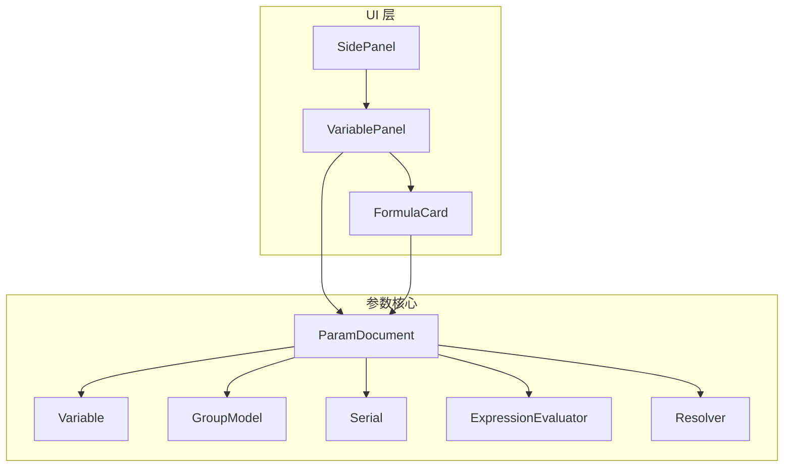
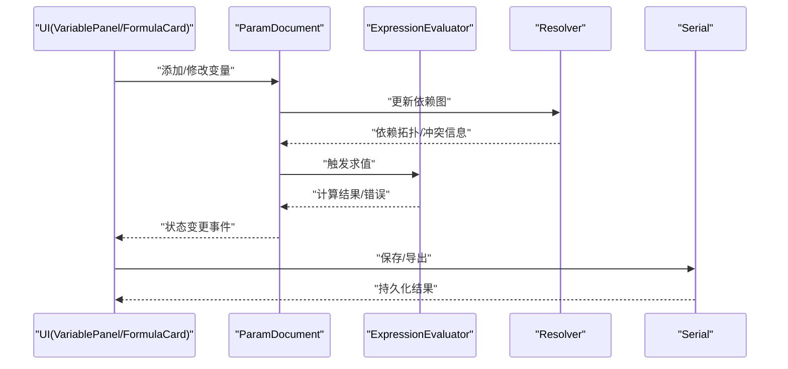
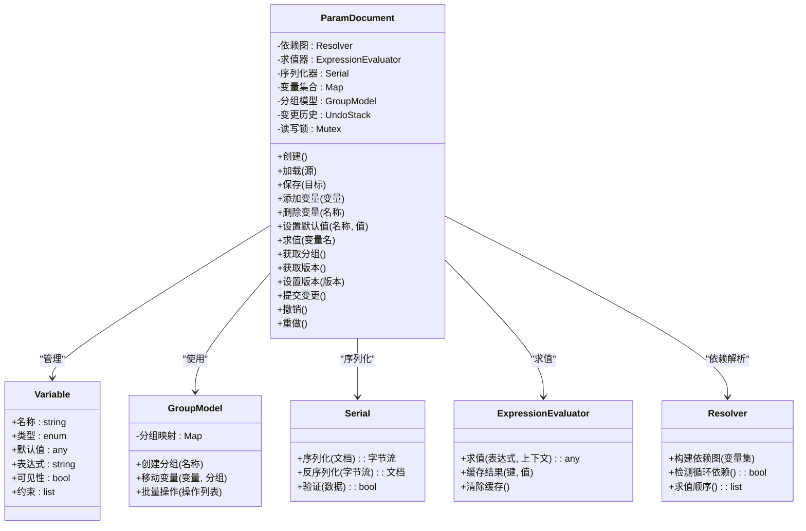
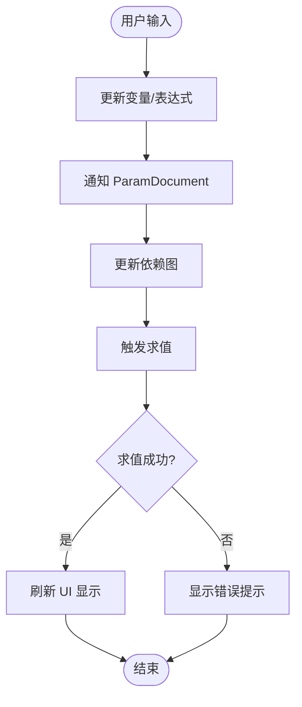
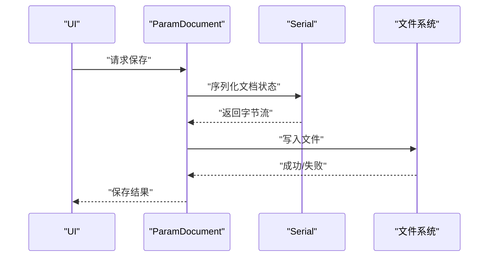
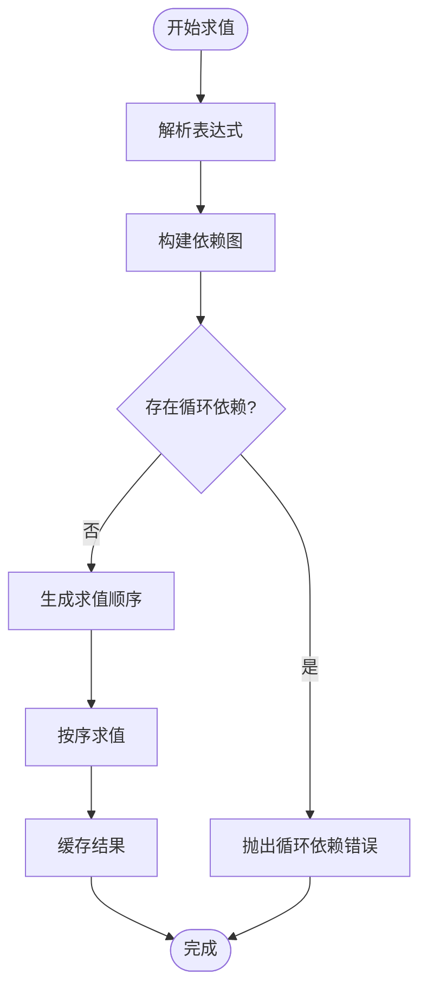
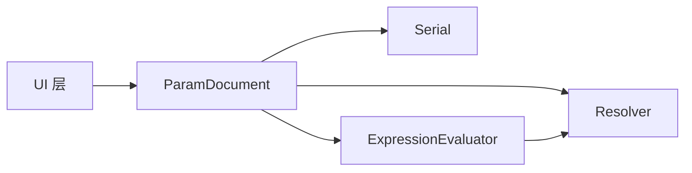

# 参数文档管理

<cite>
**本文档引用的文件**   
- [ParamDocument.h](file://src/parametric/ParamDocument.h)
- [ParamDocument.cpp](file://src/parametric/ParamDocument.cpp)
- [Variable.h](file://src/parametric/Variable.h)
- [GroupModel.h](file://src/parametric/GroupModel.h)
- [GroupModel.cpp](file://src/parametric/GroupModel.cpp)
- [Serial.h](file://src/parametric/Serial.h)
- [Serial.cpp](file://src/parametric/Serial.cpp)
- [FormulaCard.h](file://src/ui/FormulaCard.h)
- [FormulaCard.cpp](file://src/ui/FormulaCard.cpp)
- [VariablePanel.h](file://src/ui/VariablePanel.h)
- [VariablePanel.cpp](file://src/ui/VariablePanel.cpp)
- [SidePanel.h](file://src/ui/SidePanel.h)
- [SidePanel.cpp](file://src/ui/SidePanel.cpp)
- [ExpressionEvaluator.h](file://src/parametric/ExpressionEvaluator.h)
- [ExpressionEvaluator.cpp](file://src/parametric/ExpressionEvaluator.cpp)
- [Resolver.h](file://src/parametric/Resolver.h)
- [Resolver.cpp](file://src/parametric/Resolver.cpp)
</cite>

## 目录
1. [简介](#简介)
2. [项目结构](#项目结构)
3. [核心组件](#核心组件)
4. [架构总览](#架构总览)
5. [详细组件分析](#详细组件分析)
6. [依赖关系分析](#依赖关系分析)
7. [性能考虑](#性能考虑)
8. [故障排查指南](#故障排查指南)
9. [结论](#结论)
10. [附录](#附录)

## 简介
本技术文档围绕“参数文档管理系统”展开，重点解析 ParamDocument 类的核心功能与实现机制，涵盖文档的创建、加载、保存与版本管理；参数集合的管理策略；数据持久化与内存管理；以及与 UI 层的交互接口、事件处理和数据同步模式。文档同时提供实践示例路径（以源码位置引用代替代码片段），并解释文档状态管理、撤销重做机制和并发访问控制，最后给出性能优化建议与常见问题解决方案。

## 项目结构
参数文档管理系统位于 parametric 模块中，UI 层通过 SidePanel、VariablePanel、FormulaCard 等组件与 ParamDocument 交互。序列化子系统由 Serial 模块负责，表达式求值与依赖解析由 ExpressionEvaluator 与 Resolver 完成。

图表来源
- [ParamDocument.h](file://src/parametric/ParamDocument.h)
- [ParamDocument.cpp](file://src/parametric/ParamDocument.cpp)
- [Variable.h](file://src/parametric/Variable.h)
- [GroupModel.h](file://src/parametric/GroupModel.h)
- [GroupModel.cpp](file://src/parametric/GroupModel.cpp)
- [Serial.h](file://src/parametric/Serial.h)
- [Serial.cpp](file://src/parametric/Serial.cpp)
- [ExpressionEvaluator.h](file://src/parametric/ExpressionEvaluator.h)
- [ExpressionEvaluator.cpp](file://src/parametric/ExpressionEvaluator.cpp)
- [Resolver.h](file://src/parametric/Resolver.h)
- [Resolver.cpp](file://src/parametric/Resolver.cpp)
- [SidePanel.h](file://src/ui/SidePanel.h)
- [SidePanel.cpp](file://src/ui/SidePanel.cpp)
- [VariablePanel.h](file://src/ui/VariablePanel.h)
- [VariablePanel.cpp](file://src/ui/VariablePanel.cpp)
- [FormulaCard.h](file://src/ui/FormulaCard.h)
- [FormulaCard.cpp](file://src/ui/FormulaCard.cpp)

章节来源
- [ParamDocument.h](file://src/parametric/ParamDocument.h)
- [ParamDocument.cpp](file://src/parametric/ParamDocument.cpp)
- [GroupModel.h](file://src/parametric/GroupModel.h)
- [GroupModel.cpp](file://src/parametric/GroupModel.cpp)
- [Serial.h](file://src/parametric/Serial.h)
- [Serial.cpp](file://src/parametric/Serial.cpp)
- [ExpressionEvaluator.h](file://src/parametric/ExpressionEvaluator.h)
- [ExpressionEvaluator.cpp](file://src/parametric/ExpressionEvaluator.cpp)
- [Resolver.h](file://src/parametric/Resolver.h)
- [Resolver.cpp](file://src/parametric/Resolver.cpp)
- [SidePanel.h](file://src/ui/SidePanel.h)
- [SidePanel.cpp](file://src/ui/SidePanel.cpp)
- [VariablePanel.h](file://src/ui/VariablePanel.h)
- [VariablePanel.cpp](file://src/ui/VariablePanel.cpp)
- [FormulaCard.h](file://src/ui/FormulaCard.h)
- [FormulaCard.cpp](file://src/ui/FormulaCard.cpp)

## 核心组件
- ParamDocument：参数文档的核心类，负责变量集合管理、分组、表达式求值、序列化/反序列化、版本管理与状态变更通知。
- Variable：参数变量的抽象定义，包含名称、类型、默认值、表达式、可见性、约束等属性。
- GroupModel：分组模型，用于组织变量为逻辑组，支持层级结构与批量操作。
- Serial：序列化器，负责将文档状态序列化为可存储格式（如 JSON/XML）及从外部源恢复。
- ExpressionEvaluator：表达式求值引擎，支持变量引用、函数调用与条件表达式。
- Resolver：依赖解析器，维护变量间的依赖图，确保求值顺序与循环依赖检测。

章节来源
- [ParamDocument.h](file://src/parametric/ParamDocument.h)
- [ParamDocument.cpp](file://src/parametric/ParamDocument.cpp)
- [Variable.h](file://src/parametric/Variable.h)
- [GroupModel.h](file://src/parametric/GroupModel.h)
- [GroupModel.cpp](file://src/parametric/GroupModel.cpp)
- [Serial.h](file://src/parametric/Serial.h)
- [Serial.cpp](file://src/parametric/Serial.cpp)
- [ExpressionEvaluator.h](file://src/parametric/ExpressionEvaluator.h)
- [ExpressionEvaluator.cpp](file://src/parametric/ExpressionEvaluator.cpp)
- [Resolver.h](file://src/parametric/Resolver.h)
- [Resolver.cpp](file://src/parametric/Resolver.cpp)

## 架构总览
ParamDocument 作为中心协调者，向上暴露 API 给 UI 层，向下委托 Serial 进行持久化，委托 ExpressionEvaluator 与 Resolver 完成表达式求值与依赖解析。UI 层通过信号槽或回调机制订阅文档状态变化，实现双向数据绑定与增量更新。

图表来源
- [ParamDocument.h](file://src/parametric/ParamDocument.h)
- [ParamDocument.cpp](file://src/parametric/ParamDocument.cpp)
- [ExpressionEvaluator.h](file://src/parametric/ExpressionEvaluator.h)
- [ExpressionEvaluator.cpp](file://src/parametric/ExpressionEvaluator.cpp)
- [Resolver.h](file://src/parametric/Resolver.h)
- [Resolver.cpp](file://src/parametric/Resolver.cpp)
- [Serial.h](file://src/parametric/Serial.h)
- [Serial.cpp](file://src/parametric/Serial.cpp)
- [VariablePanel.h](file://src/ui/VariablePanel.h)
- [VariablePanel.cpp](file://src/ui/VariablePanel.cpp)
- [FormulaCard.h](file://src/ui/FormulaCard.h)
- [FormulaCard.cpp](file://src/ui/FormulaCard.cpp)

## 详细组件分析

### ParamDocument 类分析
- 职责
  - 文档生命周期：创建空文档、从外部源加载、保存到磁盘或内存缓冲区。
  - 变量管理：增删改查变量、设置默认值、表达式求值、可见性与约束校验。
  - 分组管理：创建/移动/合并分组，批量操作变量。
  - 版本管理：记录文档版本、迁移策略、向后兼容。
  - 状态与事件：变更通知、撤销/重做栈、并发访问控制。
- 关键流程
  - 创建：初始化变量容器、分组模型、依赖图、求值引擎。
  - 加载：反序列化数据结构，重建依赖图，验证一致性。
  - 保存：序列化当前状态，输出到目标介质。
  - 版本管理：读取/写入版本字段，执行迁移脚本。
- 内存管理
  - 使用智能指针管理变量与分组对象的生命周期。
  - 惰性求值与缓存结果，避免重复计算。
  - 清理未引用对象，防止内存泄漏。
- 并发控制
  - 读写锁保护共享状态，读多写少场景下提升吞吐。
  - 线程安全的队列用于异步求值与持久化任务。

图表来源
- [ParamDocument.h](file://src/parametric/ParamDocument.h)
- [ParamDocument.cpp](file://src/parametric/ParamDocument.cpp)
- [Variable.h](file://src/parametric/Variable.h)
- [GroupModel.h](file://src/parametric/GroupModel.h)
- [GroupModel.cpp](file://src/parametric/GroupModel.cpp)
- [Serial.h](file://src/parametric/Serial.h)
- [Serial.cpp](file://src/parametric/Serial.cpp)
- [ExpressionEvaluator.h](file://src/parametric/ExpressionEvaluator.h]
- [ExpressionEvaluator.cpp](file://src/parametric/ExpressionEvaluator.cpp)
- [Resolver.h](file://src/parametric/Resolver.h)
- [Resolver.cpp](file://src/parametric/Resolver.cpp)

章节来源
- [ParamDocument.h](file://src/parametric/ParamDocument.h)
- [ParamDocument.cpp](file://src/parametric/ParamDocument.cpp)
- [Variable.h](file://src/parametric/Variable.h)
- [GroupModel.h](file://src/parametric/GroupModel.h)
- [GroupModel.cpp](file://src/parametric/GroupModel.cpp)
- [Serial.h](file://src/parametric/Serial.h)
- [Serial.cpp](file://src/parametric/Serial.cpp)
- [ExpressionEvaluator.h](file://src/parametric/ExpressionEvaluator.h)
- [ExpressionEvaluator.cpp](file://src/parametric/ExpressionEvaluator.cpp)
- [Resolver.h](file://src/parametric/Resolver.h)
- [Resolver.cpp](file://src/parametric/Resolver.cpp)

### UI 交互与数据同步
- 交互接口
  - VariablePanel：展示变量列表，支持新增、编辑、删除、分组拖拽。
  - FormulaCard：编辑单个变量的表达式与默认值，实时预览求值结果。
  - SidePanel：聚合面板入口，切换不同视图与工具。
- 事件处理
  - UI 组件通过信号/槽或回调订阅 ParamDocument 的状态变更事件。
  - 用户输入触发变量修改，ParamDocument 更新依赖图并触发求值。
  - 求值结果回传到 UI，刷新显示与校验提示。
- 数据同步模式
  - 单向数据流：UI -> ParamDocument -> 求值引擎 -> UI。
  - 增量更新：仅刷新受影响的变量卡片，减少重绘开销。
  - 防抖与节流：对高频输入进行去抖，降低求值频率。

图表来源
- [VariablePanel.h](file://src/ui/VariablePanel.h)
- [VariablePanel.cpp](file://src/ui/VariablePanel.cpp)
- [FormulaCard.h](file://src/ui/FormulaCard.h)
- [FormulaCard.cpp](file://src/ui/FormulaCard.cpp)
- [SidePanel.h](file://src/ui/SidePanel.h)
- [SidePanel.cpp](file://src/ui/SidePanel.cpp)
- [ParamDocument.h](file://src/parametric/ParamDocument.h)
- [ParamDocument.cpp](file://src/parametric/ParamDocument.cpp)

章节来源
- [VariablePanel.h](file://src/ui/VariablePanel.h)
- [VariablePanel.cpp](file://src/ui/VariablePanel.cpp)
- [FormulaCard.h](file://src/ui/FormulaCard.h)
- [FormulaCard.cpp](file://src/ui/FormulaCard.cpp)
- [SidePanel.h](file://src/ui/SidePanel.h)
- [SidePanel.cpp](file://src/ui/SidePanel.cpp)
- [ParamDocument.h](file://src/parametric/ParamDocument.h)
- [ParamDocument.cpp](file://src/parametric/ParamDocument.cpp)

### 数据持久化与序列化
- 序列化策略
  - 结构化数据：变量、分组、版本、元数据统一序列化为 JSON/XML。
  - 增量保存：支持差异保存，减少 I/O 压力。
  - 校验与回滚：反序列化前进行结构校验，失败时回滚到上一版本。
- 版本管理
  - 文档头包含版本号，加载时根据版本选择迁移策略。
  - 支持向前/向后兼容，自动升级或降级数据结构。
- 内存管理
  - 大文档分块加载，按需解析表达式。
  - 释放不再使用的中间结果，避免内存膨胀。

图表来源
- [Serial.h](file://src/parametric/Serial.h)
- [Serial.cpp](file://src/parametric/Serial.cpp)
- [ParamDocument.h](file://src/parametric/ParamDocument.h)
- [ParamDocument.cpp](file://src/parametric/ParamDocument.cpp)

章节来源
- [Serial.h](file://src/parametric/Serial.h)
- [Serial.cpp](file://src/parametric/Serial.cpp)
- [ParamDocument.h](file://src/parametric/ParamDocument.h)
- [ParamDocument.cpp](file://src/parametric/ParamDocument.cpp)

### 表达式求值与依赖解析
- 求值引擎
  - 支持变量引用、数学运算、函数调用与条件表达式。
  - 缓存求值结果，避免重复计算。
  - 错误处理：语法错误、运行时异常、类型不匹配。
- 依赖解析
  - 构建有向无环图（DAG），检测循环依赖。
  - 生成求值顺序，保证依赖先于被依赖项计算。
  - 增量更新：仅重新计算受影响的节点。

图表来源
- [ExpressionEvaluator.h](file://src/parametric/ExpressionEvaluator.h)
- [ExpressionEvaluator.cpp](file://src/parametric/ExpressionEvaluator.cpp)
- [Resolver.h](file://src/parametric/Resolver.h)
- [Resolver.cpp](file://src/parametric/Resolver.cpp)

章节来源
- [ExpressionEvaluator.h](file://src/parametric/ExpressionEvaluator.h)
- [ExpressionEvaluator.cpp](file://src/parametric/ExpressionEvaluator.cpp)
- [Resolver.h](file://src/parametric/Resolver.h)
- [Resolver.cpp](file://src/parametric/Resolver.cpp)

## 依赖关系分析
- 组件耦合
  - ParamDocument 与 Serial、ExpressionEvaluator、Resolver 松耦合，通过接口交互。
  - UI 层仅依赖 ParamDocument 的公开 API，避免直接访问内部状态。
- 外部依赖
  - 序列化库（JSON/XML 解析）。
  - 表达式解析库（可选，若未内置）。
- 潜在循环依赖
  - 确保 Resolver 不反向依赖 ParamDocument 的具体实现。
  - UI 层不应直接依赖底层求值引擎。

图表来源
- [ParamDocument.h](file://src/parametric/ParamDocument.h)
- [ParamDocument.cpp](file://src/parametric/ParamDocument.cpp)
- [Serial.h](file://src/parametric/Serial.h)
- [Serial.cpp](file://src/parametric/Serial.cpp)
- [ExpressionEvaluator.h](file://src/parametric/ExpressionEvaluator.h)
- [ExpressionEvaluator.cpp](file://src/parametric/ExpressionEvaluator.cpp)
- [Resolver.h](file://src/parametric/Resolver.h)
- [Resolver.cpp](file://src/parametric/Resolver.cpp)

章节来源
- [ParamDocument.h](file://src/parametric/ParamDocument.h)
- [ParamDocument.cpp](file://src/parametric/ParamDocument.cpp)
- [Serial.h](file://src/parametric/Serial.h)
- [Serial.cpp](file://src/parametric/Serial.cpp)
- [ExpressionEvaluator.h](file://src/parametric/ExpressionEvaluator.h)
- [ExpressionEvaluator.cpp](file://src/parametric/ExpressionEvaluator.cpp)
- [Resolver.h](file://src/parametric/Resolver.h)
- [Resolver.cpp](file://src/parametric/Resolver.cpp)

## 性能考虑
- 求值优化
  - 使用缓存与懒加载，避免重复计算。
  - 增量更新依赖图，仅重算受影响节点。
- I/O 优化
  - 批量写入与异步持久化，减少阻塞。
  - 压缩与分块存储大文档。
- 内存优化
  - 及时释放临时对象，避免内存碎片。
  - 使用对象池复用频繁创建的对象。
- UI 优化
  - 虚拟滚动与分页加载大量变量。
  - 防抖与节流用户输入，降低事件风暴。

[本节为通用指导，无需特定文件来源]

## 故障排查指南
- 常见问题
  - 循环依赖：检查变量间引用关系，移除闭环。
  - 表达式语法错误：使用调试日志定位解析失败位置。
  - 序列化失败：验证数据结构完整性与版本兼容性。
  - 内存泄漏：使用内存分析工具定位未释放对象。
- 调试技巧
  - 启用详细日志，记录求值过程与依赖图变化。
  - 单元测试覆盖边界情况，如空表达式、非法类型。
  - 性能剖析识别热点路径，优化瓶颈。

章节来源
- [ParamDocument.h](file://src/parametric/ParamDocument.h)
- [ParamDocument.cpp](file://src/parametric/ParamDocument.cpp)
- [ExpressionEvaluator.h](file://src/parametric/ExpressionEvaluator.h)
- [ExpressionEvaluator.cpp](file://src/parametric/ExpressionEvaluator.cpp)
- [Resolver.h](file://src/parametric/Resolver.h)
- [Resolver.cpp](file://src/parametric/Resolver.cpp)
- [Serial.h](file://src/parametric/Serial.h)
- [Serial.cpp](file://src/parametric/Serial.cpp)

## 结论
ParamDocument 作为参数文档管理的核心，提供了完整的生命周期管理、变量与分组操作、表达式求值、序列化与版本控制能力。通过与 UI 层的清晰接口与事件机制，实现了高效的数据同步与用户体验。合理的内存管理、并发控制与性能优化策略确保了系统的稳定性与可扩展性。遵循本文档的实践建议，可有效提升开发效率与系统质量。

[本节为总结性内容，无需特定文件来源]

## 附录
- 实践示例路径（以源码位置引用代替代码片段）
  - 创建参数文档：参考 [ParamDocument::创建](file://src/parametric/ParamDocument.cpp)
  - 添加变量：参考 [ParamDocument::添加变量](file://src/parametric/ParamDocument.cpp)
  - 设置默认值：参考 [ParamDocument::设置默认值](file://src/parametric/ParamDocument.cpp)
  - 序列化操作：参考 [Serial::序列化](file://src/parametric/Serial.cpp)
  - 加载文档：参考 [ParamDocument::加载](file://src/parametric/ParamDocument.cpp)
  - 保存文档：参考 [ParamDocument::保存](file://src/parametric/ParamDocument.cpp)
  - 版本管理：参考 [ParamDocument::获取版本/设置版本](file://src/parametric/ParamDocument.cpp)
  - 撤销重做：参考 [ParamDocument::撤销/重做](file://src/parametric/ParamDocument.cpp)
  - 并发访问控制：参考 [ParamDocument::读写锁](file://src/parametric/ParamDocument.cpp)

章节来源
- [ParamDocument.h](file://src/parametric/ParamDocument.h)
- [ParamDocument.cpp](file://src/parametric/ParamDocument.cpp)
- [Serial.h](file://src/parametric/Serial.h)
- [Serial.cpp](file://src/parametric/Serial.cpp)