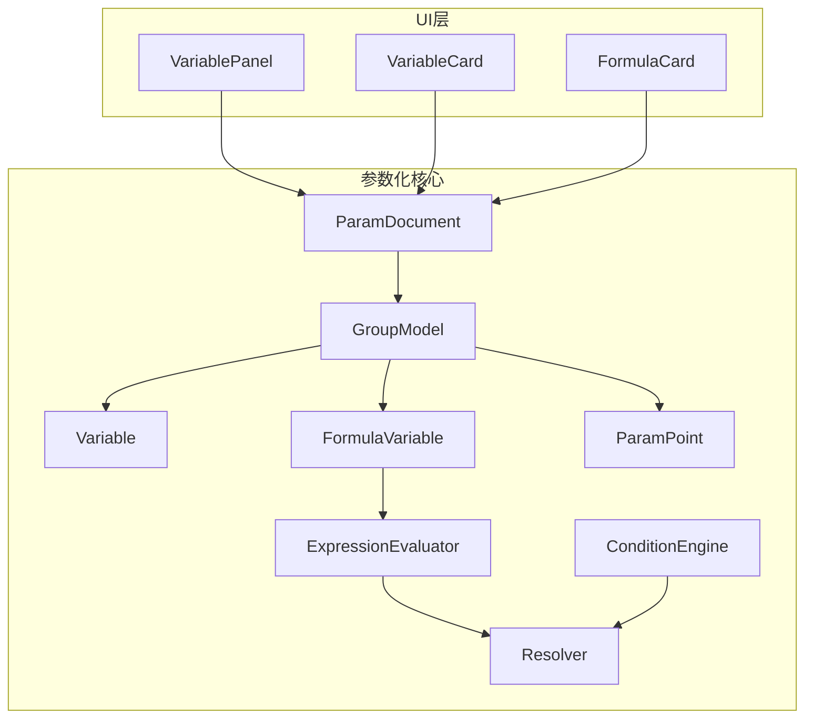
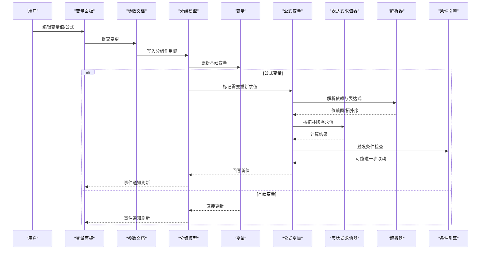
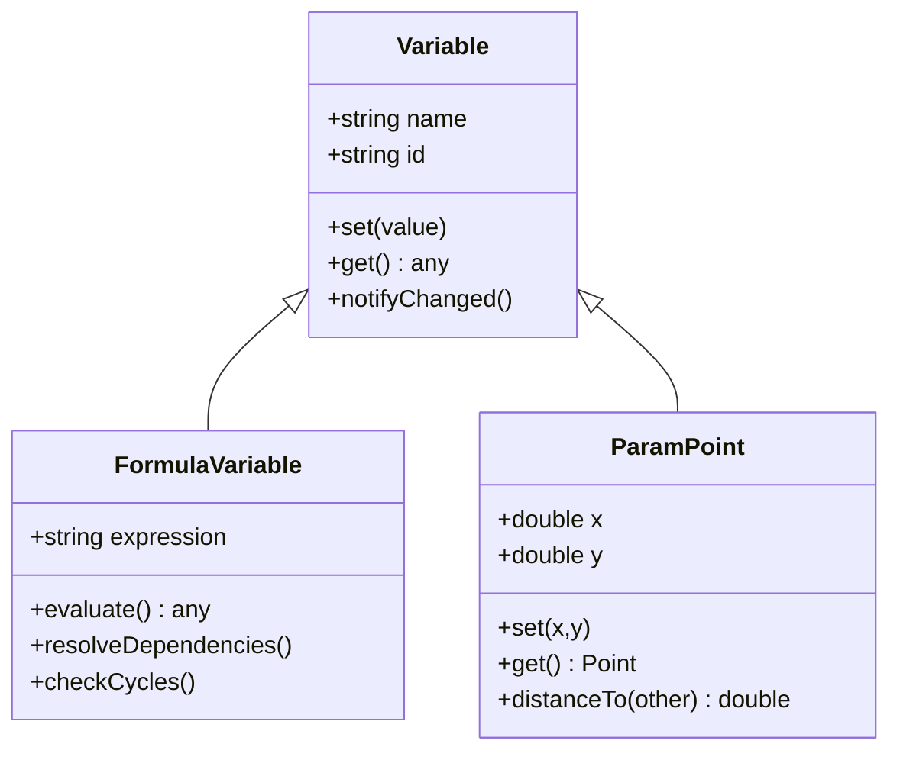
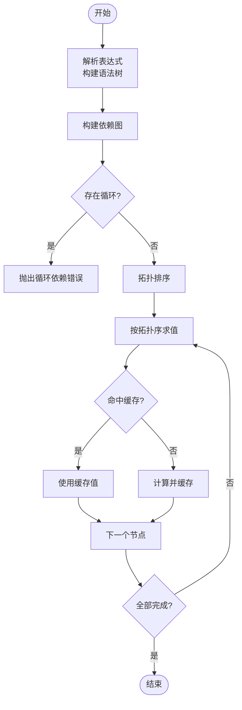
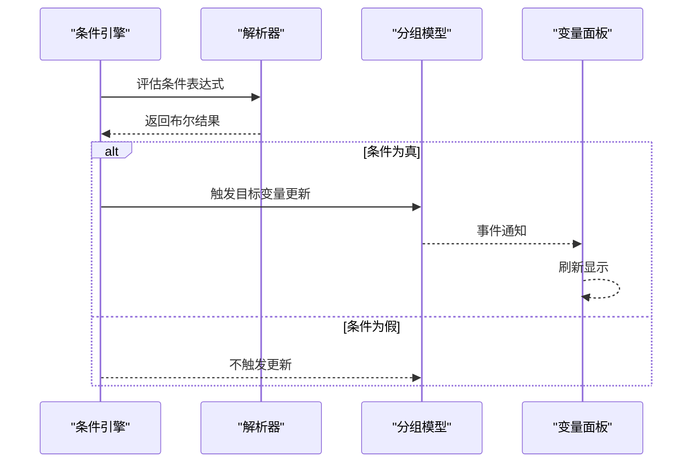
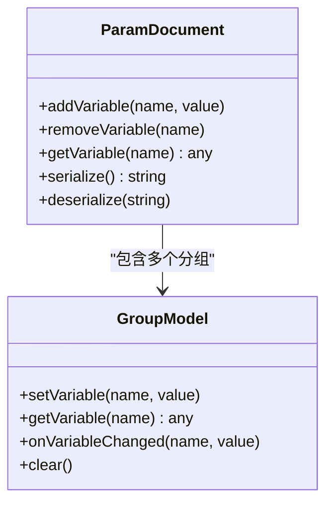
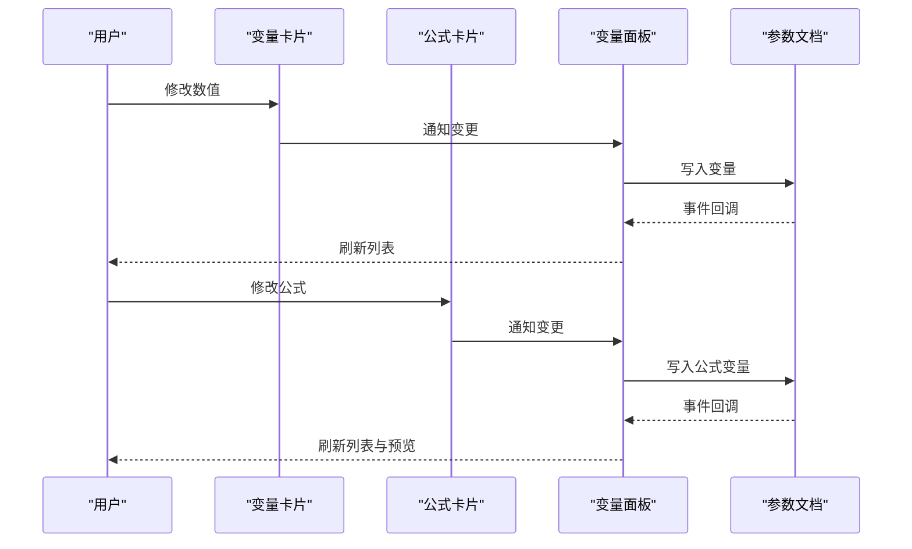
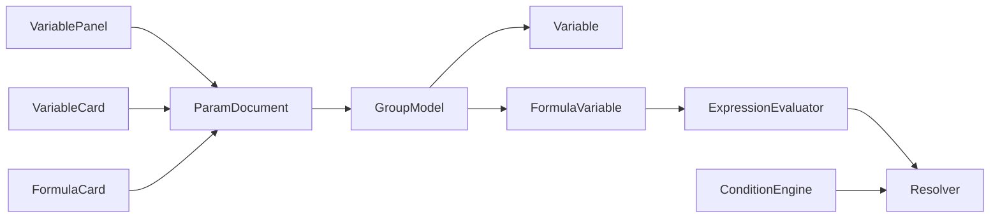

# 变量系统

<cite>
**本文引用的文件**   
- [Variable.h](file://src/parametric/Variable.h)
- [FormulaVariable.h](file://src/parametric/FormulaVariable.h)
- [ParamPoint.h](file://src/parametric/ParamPoint.h)
- [ExpressionEvaluator.h](file://src/parametric/ExpressionEvaluator.h)
- [ExpressionEvaluator.cpp](file://src/parametric/ExpressionEvaluator.cpp)
- [Resolver.h](file://src/parametric/Resolver.h)
- [Resolver.cpp](file://src/parametric/Resolver.cpp)
- [ConditionEngine.h](file://src/parametric/ConditionEngine.h)
- [ConditionEngine.cpp](file://src/parametric/ConditionEngine.cpp)
- [GroupModel.h](file://src/parametric/GroupModel.h)
- [GroupModel.cpp](file://src/parametric/GroupModel.cpp)
- [ParamDocument.h](file://src/parametric/ParamDocument.h)
- [ParamDocument.cpp](file://src/parametric/ParamDocument.cpp)
- [VariablePanel.h](file://src/ui/VariablePanel.h)
- [VariablePanel.cpp](file://src/ui/VariablePanel.cpp)
- [VariableCard.h](file://src/ui/VariableCard.h)
- [VariableCard.cpp](file://src/ui/VariableCard.cpp)
- [FormulaCard.h](file://src/ui/FormulaCard.h)
- [FormulaCard.cpp](file://src/ui/FormulaCard.cpp)
- [test_expression.cpp](file://tests/test_expression.cpp)
- [test_resolver.cpp](file://tests/test_resolver.cpp)
</cite>

## 目录
1. [简介](#简介)
2. [项目结构](#项目结构)
3. [核心组件](#核心组件)
4. [架构总览](#架构总览)
5. [详细组件分析](#详细组件分析)
6. [依赖关系分析](#依赖关系分析)
7. [性能考虑](#性能考虑)
8. [故障排查指南](#故障排查指南)
9. [结论](#结论)
10. [附录：使用示例与最佳实践](#附录使用示例与最佳实践)

## 简介
本技术文档围绕“变量系统”展开，覆盖变量的类型系统、存储机制、生命周期管理、表达式求值与解析、绑定与实时更新、事件通知机制，以及数值、点坐标和公式三类变量的特性与精度控制。文档同时提供创建、赋值、读取、删除等操作的实现要点，并给出面向开发者的最佳实践与性能优化建议。

## 项目结构
变量系统位于 parametric 模块（核心逻辑）与 ui 模块（交互界面）之间，通过文档模型与面板进行解耦。关键文件分布如下：
- 类型与数据模型：Variable.h、FormulaVariable.h、ParamPoint.h
- 表达式与解析：ExpressionEvaluator.*、Resolver.*
- 条件与联动：ConditionEngine.*
- 文档与分组：ParamDocument.*、GroupModel.*
- UI 展示与编辑：VariablePanel.*、VariableCard.*、FormulaCard.*
- 测试：test_expression.cpp、test_resolver.cpp

图表来源
- [VariablePanel.h](file://src/ui/VariablePanel.h)
- [VariablePanel.cpp](file://src/ui/VariablePanel.cpp)
- [VariableCard.h](file://src/ui/VariableCard.h)
- [VariableCard.cpp](file://src/ui/VariableCard.cpp)
- [FormulaCard.h](file://src/ui/FormulaCard.h)
- [FormulaCard.cpp](file://src/ui/FormulaCard.cpp)
- [ParamDocument.h](file://src/parametric/ParamDocument.h)
- [ParamDocument.cpp](file://src/parametric/ParamDocument.cpp)
- [GroupModel.h](file://src/parametric/GroupModel.h)
- [GroupModel.cpp](file://src/parametric/GroupModel.cpp)
- [Variable.h](file://src/parametric/Variable.h)
- [FormulaVariable.h](file://src/parametric/FormulaVariable.h)
- [ParamPoint.h](file://src/parametric/ParamPoint.h)
- [ExpressionEvaluator.h](file://src/parametric/ExpressionEvaluator.h)
- [ExpressionEvaluator.cpp](file://src/parametric/ExpressionEvaluator.cpp)
- [Resolver.h](file://src/parametric/Resolver.h)
- [Resolver.cpp](file://src/parametric/Resolver.cpp)
- [ConditionEngine.h](file://src/parametric/ConditionEngine.h)
- [ConditionEngine.cpp](file://src/parametric/ConditionEngine.cpp)

章节来源
- [ParamDocument.h](file://src/parametric/ParamDocument.h)
- [ParamDocument.cpp](file://src/parametric/ParamDocument.cpp)
- [GroupModel.h](file://src/parametric/GroupModel.h)
- [GroupModel.cpp](file://src/parametric/GroupModel.cpp)
- [Variable.h](file://src/parametric/Variable.h)
- [FormulaVariable.h](file://src/parametric/FormulaVariable.h)
- [ParamPoint.h](file://src/parametric/ParamPoint.h)
- [ExpressionEvaluator.h](file://src/parametric/ExpressionEvaluator.h)
- [ExpressionEvaluator.cpp](file://src/parametric/ExpressionEvaluator.cpp)
- [Resolver.h](file://src/parametric/Resolver.h)
- [Resolver.cpp](file://src/parametric/Resolver.cpp)
- [ConditionEngine.h](file://src/parametric/ConditionEngine.h)
- [ConditionEngine.cpp](file://src/parametric/ConditionEngine.cpp)
- [VariablePanel.h](file://src/ui/VariablePanel.h)
- [VariablePanel.cpp](file://src/ui/VariablePanel.cpp)
- [VariableCard.h](file://src/ui/VariableCard.h)
- [VariableCard.cpp](file://src/ui/VariableCard.cpp)
- [FormulaCard.h](file://src/ui/FormulaCard.h)
- [FormulaCard.cpp](file://src/ui/FormulaCard.cpp)

## 核心组件
- 变量基元与类型
  - 数值变量：用于标量计算与尺寸控制，支持精度与单位转换。
  - 点坐标变量：二维点，包含 x/y 分量，常用于几何定位与约束。
  - 公式变量：以表达式字符串形式定义，依赖解析器与求值器动态计算。
- 表达式求值与解析
  - 表达式求值器：负责将表达式转换为可执行结构并计算结果。
  - 解析器：负责变量名到值的查找、依赖图构建与循环检测。
- 条件引擎
  - 基于条件的分支或联动规则，驱动变量在特定条件下更新。
- 文档与分组
  - 文档模型维护全局变量集合与命名空间；分组模型组织局部变量与作用域。
- UI 面板与卡片
  - 变量面板提供列表视图与批量操作；变量卡片与公式卡片分别承载单变量与公式的编辑体验。

章节来源
- [Variable.h](file://src/parametric/Variable.h)
- [FormulaVariable.h](file://src/parametric/FormulaVariable.h)
- [ParamPoint.h](file://src/parametric/ParamPoint.h)
- [ExpressionEvaluator.h](file://src/parametric/ExpressionEvaluator.h)
- [ExpressionEvaluator.cpp](file://src/parametric/ExpressionEvaluator.cpp)
- [Resolver.h](file://src/parametric/Resolver.h)
- [Resolver.cpp](file://src/parametric/Resolver.cpp)
- [ConditionEngine.h](file://src/parametric/ConditionEngine.h)
- [ConditionEngine.cpp](file://src/parametric/ConditionEngine.cpp)
- [ParamDocument.h](file://src/parametric/ParamDocument.h)
- [ParamDocument.cpp](file://src/parametric/ParamDocument.cpp)
- [GroupModel.h](file://src/parametric/GroupModel.h)
- [GroupModel.cpp](file://src/parametric/GroupModel.cpp)
- [VariablePanel.h](file://src/ui/VariablePanel.h)
- [VariablePanel.cpp](file://src/ui/VariablePanel.cpp)
- [VariableCard.h](file://src/ui/VariableCard.h)
- [VariableCard.cpp](file://src/ui/VariableCard.cpp)
- [FormulaCard.h](file://src/ui/FormulaCard.h)
- [FormulaCard.cpp](file://src/ui/FormulaCard.cpp)

## 架构总览
变量系统的整体流程如下：用户在 UI 中编辑变量，面板将变更写入文档/分组模型；公式变量通过解析器与求值器计算新值；条件引擎根据规则触发联动；最终通过事件回调通知 UI 刷新显示。

图表来源
- [VariablePanel.cpp](file://src/ui/VariablePanel.cpp)
- [ParamDocument.cpp](file://src/parametric/ParamDocument.cpp)
- [GroupModel.cpp](file://src/parametric/GroupModel.cpp)
- [Variable.h](file://src/parametric/Variable.h)
- [FormulaVariable.h](file://src/parametric/FormulaVariable.h)
- [ExpressionEvaluator.cpp](file://src/parametric/ExpressionEvaluator.cpp)
- [Resolver.cpp](file://src/parametric/Resolver.cpp)
- [ConditionEngine.cpp](file://src/parametric/ConditionEngine.cpp)

## 详细组件分析

### 变量类型系统与数据结构
- 数值变量
  - 用途：尺寸、角度、比例等标量。
  - 特性：支持精度控制、单位换算、范围校验。
  - 复杂度：O(1) 读写；表达式求值时参与算术运算。
- 点坐标变量
  - 用途：二维点位置，常用于几何定位与约束。
  - 特性：x/y 分量独立更新，支持距离/角度派生计算。
  - 复杂度：O(1) 分量读写；向量运算为常数时间。
- 公式变量
  - 用途：由表达式定义的派生值，自动响应依赖变化。
  - 特性：表达式解析、依赖图构建、循环检测、增量重算。
  - 复杂度：解析 O(n log n)（n 为依赖数），求值按拓扑序 O(n)。

图表来源
- [Variable.h](file://src/parametric/Variable.h)
- [FormulaVariable.h](file://src/parametric/FormulaVariable.h)
- [ParamPoint.h](file://src/parametric/ParamPoint.h)

章节来源
- [Variable.h](file://src/parametric/Variable.h)
- [FormulaVariable.h](file://src/parametric/FormulaVariable.h)
- [ParamPoint.h](file://src/parametric/ParamPoint.h)

### 表达式求值与解析
- 解析阶段
  - 词法分析与语法树构建，识别变量引用与运算符。
  - 依赖图构建与拓扑排序，确保无环且求值顺序正确。
- 求值阶段
  - 按拓扑序依次计算各节点，缓存中间结果避免重复计算。
  - 错误处理：未定义变量、类型不匹配、除零、溢出等。
- 精度控制
  - 浮点舍入策略与有效位数配置，保证数值稳定性。

图表来源
- [ExpressionEvaluator.h](file://src/parametric/ExpressionEvaluator.h)
- [ExpressionEvaluator.cpp](file://src/parametric/ExpressionEvaluator.cpp)
- [Resolver.h](file://src/parametric/Resolver.h)
- [Resolver.cpp](file://src/parametric/Resolver.cpp)

章节来源
- [ExpressionEvaluator.h](file://src/parametric/ExpressionEvaluator.h)
- [ExpressionEvaluator.cpp](file://src/parametric/ExpressionEvaluator.cpp)
- [Resolver.h](file://src/parametric/Resolver.h)
- [Resolver.cpp](file://src/parametric/Resolver.cpp)

### 条件引擎与联动
- 条件规则
  - 基于布尔表达式或比较规则，决定变量是否更新或切换取值。
- 联动机制
  - 当条件满足时，触发目标变量更新，形成链式反应。
- 事件通知
  - 条件变化时发出事件，供 UI 与下游组件订阅刷新。

图表来源
- [ConditionEngine.h](file://src/parametric/ConditionEngine.h)
- [ConditionEngine.cpp](file://src/parametric/ConditionEngine.cpp)
- [Resolver.h](file://src/parametric/Resolver.h)
- [Resolver.cpp](file://src/parametric/Resolver.cpp)
- [GroupModel.h](file://src/parametric/GroupModel.h)
- [GroupModel.cpp](file://src/parametric/GroupModel.cpp)
- [VariablePanel.h](file://src/ui/VariablePanel.h)
- [VariablePanel.cpp](file://src/ui/VariablePanel.cpp)

章节来源
- [ConditionEngine.h](file://src/parametric/ConditionEngine.h)
- [ConditionEngine.cpp](file://src/parametric/ConditionEngine.cpp)
- [GroupModel.h](file://src/parametric/GroupModel.h)
- [GroupModel.cpp](file://src/parametric/GroupModel.cpp)
- [VariablePanel.h](file://src/ui/VariablePanel.h)
- [VariablePanel.cpp](file://src/ui/VariablePanel.cpp)

### 文档与分组模型
- 文档模型
  - 维护全局变量命名空间、版本与序列化能力。
  - 提供增删改查接口，协调分组与变量生命周期。
- 分组模型
  - 组织局部作用域，支持变量可见性与冲突解决。
  - 监听变量变更，触发依赖更新与事件传播。

图表来源
- [ParamDocument.h](file://src/parametric/ParamDocument.h)
- [ParamDocument.cpp](file://src/parametric/ParamDocument.cpp)
- [GroupModel.h](file://src/parametric/GroupModel.h)
- [GroupModel.cpp](file://src/parametric/GroupModel.cpp)

章节来源
- [ParamDocument.h](file://src/parametric/ParamDocument.h)
- [ParamDocument.cpp](file://src/parametric/ParamDocument.cpp)
- [GroupModel.h](file://src/parametric/GroupModel.h)
- [GroupModel.cpp](file://src/parametric/GroupModel.cpp)

### UI 面板与卡片
- 变量面板
  - 展示变量列表，支持搜索、排序、批量操作。
  - 与文档模型双向绑定，实时反映变更。
- 变量卡片与公式卡片
  - 变量卡片：编辑数值与精度设置。
  - 公式卡片：编辑表达式、查看依赖图、调试求值过程。

图表来源
- [VariableCard.h](file://src/ui/VariableCard.h)
- [VariableCard.cpp](file://src/ui/VariableCard.cpp)
- [FormulaCard.h](file://src/ui/FormulaCard.h)
- [FormulaCard.cpp](file://src/ui/FormulaCard.cpp)
- [VariablePanel.h](file://src/ui/VariablePanel.h)
- [VariablePanel.cpp](file://src/ui/VariablePanel.cpp)
- [ParamDocument.h](file://src/parametric/ParamDocument.h)
- [ParamDocument.cpp](file://src/parametric/ParamDocument.cpp)

章节来源
- [VariablePanel.h](file://src/ui/VariablePanel.h)
- [VariablePanel.cpp](file://src/ui/VariablePanel.cpp)
- [VariableCard.h](file://src/ui/VariableCard.h)
- [VariableCard.cpp](file://src/ui/VariableCard.cpp)
- [FormulaCard.h](file://src/ui/FormulaCard.h)
- [FormulaCard.cpp](file://src/ui/FormulaCard.cpp)

## 依赖关系分析
变量系统内部依赖清晰分层：UI 层仅与文档模型交互；文档模型管理分组与变量；公式变量依赖解析器与求值器；条件引擎通过解析器评估条件并触发联动。

图表来源
- [VariablePanel.h](file://src/ui/VariablePanel.h)
- [VariablePanel.cpp](file://src/ui/VariablePanel.cpp)
- [VariableCard.h](file://src/ui/VariableCard.h)
- [VariableCard.cpp](file://src/ui/VariableCard.cpp)
- [FormulaCard.h](file://src/ui/FormulaCard.h)
- [FormulaCard.cpp](file://src/ui/FormulaCard.cpp)
- [ParamDocument.h](file://src/parametric/ParamDocument.h)
- [ParamDocument.cpp](file://src/parametric/ParamDocument.cpp)
- [GroupModel.h](file://src/parametric/GroupModel.h)
- [GroupModel.cpp](file://src/parametric/GroupModel.cpp)
- [Variable.h](file://src/parametric/Variable.h)
- [FormulaVariable.h](file://src/parametric/FormulaVariable.h)
- [ExpressionEvaluator.h](file://src/parametric/ExpressionEvaluator.h)
- [ExpressionEvaluator.cpp](file://src/parametric/ExpressionEvaluator.cpp)
- [Resolver.h](file://src/parametric/Resolver.h)
- [Resolver.cpp](file://src/parametric/Resolver.cpp)
- [ConditionEngine.h](file://src/parametric/ConditionEngine.h)
- [ConditionEngine.cpp](file://src/parametric/ConditionEngine.cpp)

章节来源
- [ParamDocument.h](file://src/parametric/ParamDocument.h)
- [ParamDocument.cpp](file://src/parametric/ParamDocument.cpp)
- [GroupModel.h](file://src/parametric/GroupModel.h)
- [GroupModel.cpp](file://src/parametric/GroupModel.cpp)
- [Variable.h](file://src/parametric/Variable.h)
- [FormulaVariable.h](file://src/parametric/FormulaVariable.h)
- [ExpressionEvaluator.h](file://src/parametric/ExpressionEvaluator.h)
- [ExpressionEvaluator.cpp](file://src/parametric/ExpressionEvaluator.cpp)
- [Resolver.h](file://src/parametric/Resolver.h)
- [Resolver.cpp](file://src/parametric/Resolver.cpp)
- [ConditionEngine.h](file://src/parametric/ConditionEngine.h)
- [ConditionEngine.cpp](file://src/parametric/ConditionEngine.cpp)
- [VariablePanel.h](file://src/ui/VariablePanel.h)
- [VariablePanel.cpp](file://src/ui/VariablePanel.cpp)
- [VariableCard.h](file://src/ui/VariableCard.h)
- [VariableCard.cpp](file://src/ui/VariableCard.cpp)
- [FormulaCard.h](file://src/ui/FormulaCard.h)
- [FormulaCard.cpp](file://src/ui/FormulaCard.cpp)

## 性能考虑
- 表达式求值
  - 使用拓扑排序与缓存减少重复计算；对频繁更新的变量采用增量更新。
  - 限制表达式深度与复杂度，避免过深递归导致栈溢出。
- 内存与对象生命周期
  - 变量对象采用短生命周期设计，及时释放不再使用的实例。
  - 分组模型在切换作用域时清理临时依赖图。
- UI 刷新
  - 批量变更合并通知，避免频繁重绘；使用脏标记延迟刷新。
- 精度与稳定性
  - 合理设置浮点精度与舍入策略，防止累积误差影响几何计算。

[本节为通用指导，无需具体文件来源]

## 故障排查指南
- 常见错误
  - 循环依赖：解析器检测到环，需拆分表达式或引入中间变量。
  - 未定义变量：检查命名空间与作用域，确认变量已声明。
  - 类型不匹配：确保表达式中变量类型一致，必要时进行显式转换。
  - 除零与溢出：增加边界检查与异常捕获。
- 调试技巧
  - 启用表达式求值日志，观察依赖图与求值顺序。
  - 使用单元测试验证表达式与解析逻辑。
- 定位步骤
  - 从 UI 面板查看变量状态与错误提示。
  - 检查条件引擎的规则与触发路径。
  - 逐步缩小问题范围至具体变量或表达式。

章节来源
- [test_expression.cpp](file://tests/test_expression.cpp)
- [test_resolver.cpp](file://tests/test_resolver.cpp)
- [ExpressionEvaluator.cpp](file://src/parametric/ExpressionEvaluator.cpp)
- [Resolver.cpp](file://src/parametric/Resolver.cpp)
- [ConditionEngine.cpp](file://src/parametric/ConditionEngine.cpp)

## 结论
变量系统通过清晰的类型分层、稳健的解析与求值机制、灵活的条件联动与直观的 UI 交互，实现了高效可靠的参数化管理。遵循本文的最佳实践与性能建议，可在复杂设计中保持稳定的表现与良好的用户体验。

[本节为总结性内容，无需具体文件来源]

## 附录：使用示例与最佳实践
- 数值变量
  - 创建：在分组模型中添加数值变量，设置初始值与精度。
  - 赋值：直接设置数值或通过表达式派生。
  - 读取：获取当前值用于几何计算或渲染。
  - 删除：移除不再需要的变量，释放资源。
- 点坐标变量
  - 创建：初始化 x/y 分量，支持相对与绝对定位。
  - 赋值：单独更新分量或整体设置。
  - 读取：获取坐标用于绘制或约束求解。
  - 删除：清理关联的依赖与事件。
- 公式变量
  - 创建：编写表达式，引用其他变量与常量。
  - 赋值：修改表达式或依赖变量后自动重算。
  - 读取：获取计算结果，注意精度与单位。
  - 删除：移除表达式并清理依赖图。
- 绑定与实时更新
  - 使用双向绑定将 UI 控件与变量同步。
  - 监听变量变更事件，触发必要的联动与刷新。
- 最佳实践
  - 将复杂表达式拆分为多个简单变量，提升可读性与可维护性。
  - 合理使用分组与作用域，避免命名冲突。
  - 对高频更新的路径进行性能优化，如缓存与增量更新。
  - 在单元测试中覆盖典型用例与边界情况。

[本节为概念性指导，无需具体文件来源]