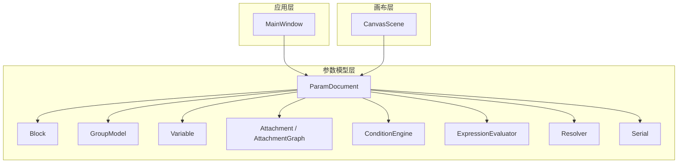
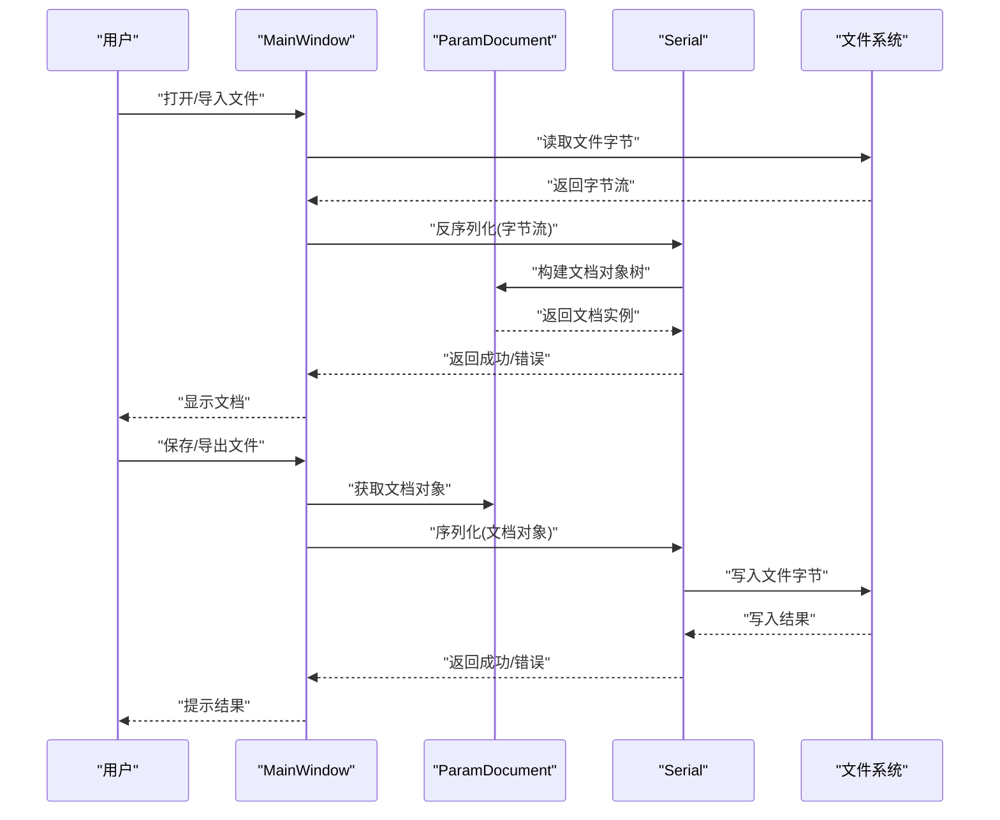
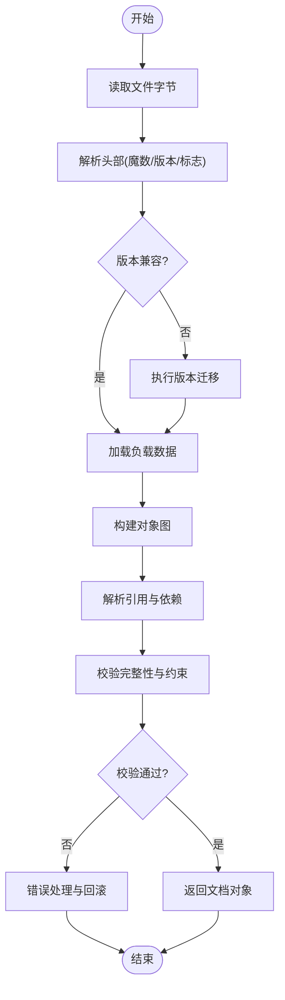
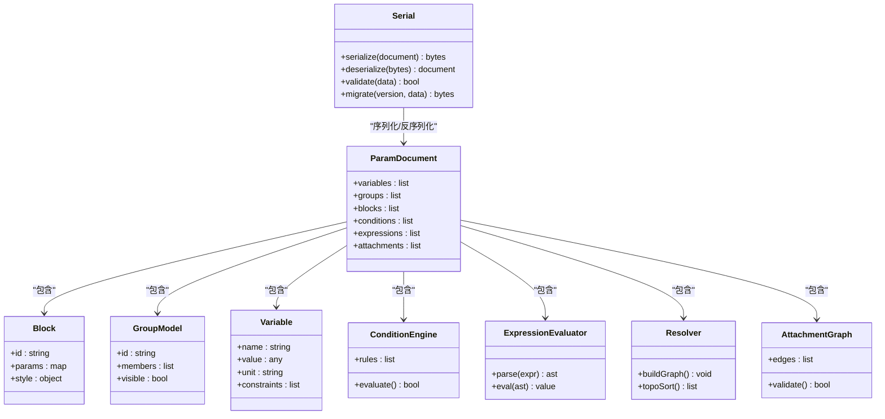

# 序列化系统

<cite>
**本文引用的文件**   
- [ParamDocument.h](file://src/parametric/ParamDocument.h)
- [ParamDocument.cpp](file://src/parametric/ParamDocument.cpp)
- [Serial.h](file://src/parametric/Serial.h)
- [Serial.cpp](file://src/parametric/Serial.cpp)
- [Block.h](file://src/parametric/Block.h)
- [Block.cpp](file://src/parametric/Block.cpp)
- [GroupModel.h](file://src/parametric/GroupModel.h)
- [GroupModel.cpp](file://src/parametric/GroupModel.cpp)
- [ConditionEngine.h](file://src/parametric/ConditionEngine.h)
- [ConditionEngine.cpp](file://src/parametric/ConditionEngine.cpp)
- [ExpressionEvaluator.h](file://src/parametric/ExpressionEvaluator.h)
- [ExpressionEvaluator.cpp](file://src/parametric/ExpressionEvaluator.cpp)
- [Resolver.h](file://src/parametric/Resolver.h)
- [Resolver.cpp](file://src/parametric/Resolver.cpp)
- [Variable.h](file://src/parametric/Variable.h)
- [Attachment.h](file://src/parametric/Attachment.h)
- [AttachmentGraph.h](file://src/parametric/AttachmentGraph.h)
- [CanvasScene.h](file://src/canvas/CanvasScene.h)
- [CanvasScene.cpp](file://src/canvas/CanvasScene.cpp)
- [MainWindow.h](file://src/app/MainWindow.h)
- [MainWindow.cpp](file://src/app/MainWindow.cpp)
- [CMakeLists.txt](file://CMakeLists.txt)
</cite>

## 目录
1. [简介](#简介)
2. [项目结构](#项目结构)
3. [核心组件](#核心组件)
4. [架构总览](#架构总览)
5. [详细组件分析](#详细组件分析)
6. [依赖关系分析](#依赖关系分析)
7. [性能考虑](#性能考虑)
8. [故障排除指南](#故障排除指南)
9. [结论](#结论)
10. [附录](#附录)

## 简介
本技术文档围绕参数化服装CAD系统的“序列化系统”展开，重点阐述参数数据的序列化格式、编码方案与版本兼容性策略；详述不同数据类型的序列化和反序列化过程；记录文件导入导出功能的实现细节、错误处理与恢复机制；并提供保存/加载参数文档、版本升级与数据迁移的具体示例。同时涵盖序列化性能优化、压缩策略与加密支持，以及数据备份恢复与故障排除指南。

## 项目结构
本项目采用分层组织：参数模型（parametric）、画布渲染（canvas）、应用界面（app）与工具（tools）。序列化系统主要位于 parametric 模块，通过 Serial 接口对 ParamDocument 及其子对象进行持久化；UI 层通过 MainWindow 提供导入/导出入口；画布层 CanvasScene 负责将参数结果可视化。

图表来源
- [MainWindow.h](file://src/app/MainWindow.h)
- [MainWindow.cpp](file://src/app/MainWindow.cpp)
- [ParamDocument.h](file://src/parametric/ParamDocument.h)
- [ParamDocument.cpp](file://src/parametric/ParamDocument.cpp)
- [Serial.h](file://src/parametric/Serial.h)
- [Serial.cpp](file://src/parametric/Serial.cpp)
- [Block.h](file://src/parametric/Block.h)
- [Block.cpp](file://src/parametric/Block.cpp)
- [GroupModel.h](file://src/parametric/GroupModel.h)
- [GroupModel.cpp](file://src/parametric/GroupModel.cpp)
- [ConditionEngine.h](file://src/parametric/ConditionEngine.h)
- [ConditionEngine.cpp](file://src/parametric/ConditionEngine.cpp)
- [ExpressionEvaluator.h](file://src/parametric/ExpressionEvaluator.h)
- [ExpressionEvaluator.cpp](file://src/parametric/ExpressionEvaluator.cpp)
- [Resolver.h](file://src/parametric/Resolver.h)
- [Resolver.cpp](file://src/parametric/Resolver.cpp)
- [Variable.h](file://src/parametric/Variable.h)
- [Attachment.h](file://src/parametric/Attachment.h)
- [AttachmentGraph.h](file://src/parametric/AttachmentGraph.h)
- [CanvasScene.h](file://src/canvas/CanvasScene.h)
- [CanvasScene.cpp](file://src/canvas/CanvasScene.cpp)

章节来源
- [CMakeLists.txt](file://CMakeLists.txt)

## 核心组件
- 参数文档 ParamDocument：承载整个参数化设计的数据根节点，包含变量、分组、块、约束与表达式等，是序列化与反序列化的核心对象。
- 序列化器 Serial：定义统一的序列化/反序列化接口，负责将内存对象转换为可存储的字节流或文本格式，并处理版本信息、校验与容错。
- 业务对象 Block、GroupModel、Variable、Attachment、ConditionEngine、ExpressionEvaluator、Resolver：各自实现序列化/反序列化逻辑，确保字段级兼容与迁移。
- 画布 CanvasScene：读取参数文档后驱动渲染，间接依赖序列化结果的正确性。
- 应用窗口 MainWindow：提供用户操作入口，触发导入/导出、保存/打开、版本检测与迁移流程。

章节来源
- [ParamDocument.h](file://src/parametric/ParamDocument.h)
- [ParamDocument.cpp](file://src/parametric/ParamDocument.cpp)
- [Serial.h](file://src/parametric/Serial.h)
- [Serial.cpp](file://src/parametric/Serial.cpp)
- [Block.h](file://src/parametric/Block.h)
- [Block.cpp](file://src/parametric/Block.cpp)
- [GroupModel.h](file://src/parametric/GroupModel.h)
- [GroupModel.cpp](file://src/parametric/GroupModel.cpp)
- [ConditionEngine.h](file://src/parametric/ConditionEngine.h)
- [ConditionEngine.cpp](file://src/parametric/ConditionEngine.cpp)
- [ExpressionEvaluator.h](file://src/parametric/ExpressionEvaluator.h)
- [ExpressionEvaluator.cpp](file://src/parametric/ExpressionEvaluator.cpp)
- [Resolver.h](file://src/parametric/Resolver.h)
- [Resolver.cpp](file://src/parametric/Resolver.cpp)
- [Variable.h](file://src/parametric/Variable.h)
- [Attachment.h](file://src/parametric/Attachment.h)
- [AttachmentGraph.h](file://src/parametric/AttachmentGraph.h)
- [CanvasScene.h](file://src/canvas/CanvasScene.h)
- [CanvasScene.cpp](file://src/canvas/CanvasScene.cpp)
- [MainWindow.h](file://src/app/MainWindow.h)
- [MainWindow.cpp](file://src/app/MainWindow.cpp)

## 架构总览
序列化系统以 ParamDocument 为中心，Serial 作为统一编解码门面，各业务对象按职责拆分序列化逻辑。导入/导出由 UI 层发起，经 ParamDocument 调用 Serial 完成读写。版本兼容在 Serial 层解析元数据，并在业务对象层执行字段级迁移。

图表来源
- [MainWindow.h](file://src/app/MainWindow.h)
- [MainWindow.cpp](file://src/app/MainWindow.cpp)
- [ParamDocument.h](file://src/parametric/ParamDocument.h)
- [ParamDocument.cpp](file://src/parametric/ParamDocument.cpp)
- [Serial.h](file://src/parametric/Serial.h)
- [Serial.cpp](file://src/parametric/Serial.cpp)

## 详细组件分析

### 序列化接口与格式（Serial）
- 接口职责
  - 定义统一的序列化/反序列化入口，接收字节流或文本，输出/输入对象图。
  - 管理版本头、校验和、可选压缩与加密标记。
  - 提供错误码与异常路径，保证失败时不破坏原数据。
- 数据格式
  - 头部：魔数、版本号、扩展标志位、长度与校验。
  - 负载：JSON/XML/二进制混合结构，按对象类型分块，便于增量迁移。
  - 尾部：完整性校验（如CRC32/SHA256），可选签名用于加密场景。
- 编码方案
  - 文本模式：UTF-8，键名稳定，数值使用标准十进制或科学计数法。
  - 二进制模式：紧凑布局，对齐规则固定，支持快速解析。
- 版本兼容
  - 向后兼容：旧版文件在新版本中应能正常加载。
  - 向前兼容：新版文件在旧版本中应给出明确降级提示。
  - 字段级迁移：新增字段默认值、废弃字段忽略或转换。

章节来源
- [Serial.h](file://src/parametric/Serial.h)
- [Serial.cpp](file://src/parametric/Serial.cpp)

### 参数文档（ParamDocument）
- 数据结构
  - 变量集合 Variable[]
  - 分组 GroupModel[]
  - 块 Block[]
  - 约束与条件 ConditionEngine
  - 表达式求值 ExpressionEvaluator
  - 依赖解析 Resolver
  - 附件关系 AttachmentGraph
- 序列化要点
  - 顶层元数据：文档名称、作者、创建时间、最后修改时间、版本。
  - 对象ID映射：确保跨文件引用一致性。
  - 依赖顺序：先序列化基础类型，再序列化复杂对象，避免循环引用。
- 反序列化要点
  - 构建对象图前先建立ID索引。
  - 延迟解析表达式与依赖，待完整图构建后再求解。

章节来源
- [ParamDocument.h](file://src/parametric/ParamDocument.h)
- [ParamDocument.cpp](file://src/parametric/ParamDocument.cpp)

### 块与分组（Block、GroupModel）
- Block
  - 字段：几何参数、尺寸、样式、可见性、锁定状态。
  - 序列化：按字段分组，保留原始单位与精度。
  - 反序列化：校验范围与约束，必要时回退到默认值。
- GroupModel
  - 字段：组名、层级、成员ID列表、可见性与选择状态。
  - 序列化：成员ID列表需与Block ID映射一致。
  - 反序列化：重建父子关系，校验循环与重复。

章节来源
- [Block.h](file://src/parametric/Block.h)
- [Block.cpp](file://src/parametric/Block.cpp)
- [GroupModel.h](file://src/parametric/GroupModel.h)
- [GroupModel.cpp](file://src/parametric/GroupModel.cpp)

### 变量与表达式（Variable、ExpressionEvaluator、Resolver）
- Variable
  - 字段：名称、类型、值、单位、约束、描述。
  - 序列化：值按类型编码，单位与约束独立存储。
- ExpressionEvaluator
  - 职责：解析与求值表达式，缓存中间结果。
  - 序列化：表达式字符串与依赖变量ID列表。
- Resolver
  - 职责：构建依赖图，解决循环与未定义引用。
  - 序列化：依赖边与拓扑排序结果。

章节来源
- [Variable.h](file://src/parametric/Variable.h)
- [ExpressionEvaluator.h](file://src/parametric/ExpressionEvaluator.h)
- [ExpressionEvaluator.cpp](file://src/parametric/ExpressionEvaluator.cpp)
- [Resolver.h](file://src/parametric/Resolver.h)
- [Resolver.cpp](file://src/parametric/Resolver.cpp)

### 约束与附件（ConditionEngine、Attachment、AttachmentGraph）
- ConditionEngine
  - 字段：条件表达式、生效范围、优先级。
  - 序列化：表达式与范围ID列表。
- Attachment / AttachmentGraph
  - 字段：连接点、偏移、方向、权重。
  - 序列化：边列表与属性，确保无环与连通性。

章节来源
- [ConditionEngine.h](file://src/parametric/ConditionEngine.h)
- [ConditionEngine.cpp](file://src/parametric/ConditionEngine.cpp)
- [Attachment.h](file://src/parametric/Attachment.h)
- [AttachmentGraph.h](file://src/parametric/AttachmentGraph.h)

### 画布与UI集成（CanvasScene、MainWindow）
- CanvasScene
  - 从 ParamDocument 读取数据，驱动绘制与交互。
  - 监听参数变更，重算并刷新视图。
- MainWindow
  - 提供“打开/保存/导出/导入”菜单与快捷键。
  - 调用 Serial 完成IO，处理错误与提示。

章节来源
- [CanvasScene.h](file://src/canvas/CanvasScene.h)
- [CanvasScene.cpp](file://src/canvas/CanvasScene.cpp)
- [MainWindow.h](file://src/app/MainWindow.h)
- [MainWindow.cpp](file://src/app/MainWindow.cpp)

### 序列化流程图（算法级）

图表来源
- [Serial.h](file://src/parametric/Serial.h)
- [Serial.cpp](file://src/parametric/Serial.cpp)
- [ParamDocument.h](file://src/parametric/ParamDocument.h)
- [ParamDocument.cpp](file://src/parametric/ParamDocument.cpp)

## 依赖关系分析
- 组件耦合
  - Serial 与 ParamDocument 强耦合，负责整体生命周期。
  - 业务对象（Block、GroupModel、Variable等）仅依赖 Serial 接口，保持低耦合。
  - CanvasScene 依赖 ParamDocument 的只读视图，避免反向依赖。
- 外部依赖
  - 文件系统IO、可选压缩库、可选加密库。
- 潜在循环
  - 依赖解析 Resolver 需避免循环引用，序列化时需输出拓扑序。

图表来源
- [Serial.h](file://src/parametric/Serial.h)
- [Serial.cpp](file://src/parametric/Serial.cpp)
- [ParamDocument.h](file://src/parametric/ParamDocument.h)
- [ParamDocument.cpp](file://src/parametric/ParamDocument.cpp)
- [Block.h](file://src/parametric/Block.h)
- [Block.cpp](file://src/parametric/Block.cpp)
- [GroupModel.h](file://src/parametric/GroupModel.h)
- [GroupModel.cpp](file://src/parametric/GroupModel.cpp)
- [Variable.h](file://src/parametric/Variable.h)
- [ConditionEngine.h](file://src/parametric/ConditionEngine.h)
- [ConditionEngine.cpp](file://src/parametric/ConditionEngine.cpp)
- [ExpressionEvaluator.h](file://src/parametric/ExpressionEvaluator.h)
- [ExpressionEvaluator.cpp](file://src/parametric/ExpressionEvaluator.cpp)
- [Resolver.h](file://src/parametric/Resolver.h)
- [Resolver.cpp](file://src/parametric/Resolver.cpp)
- [Attachment.h](file://src/parametric/Attachment.h)
- [AttachmentGraph.h](file://src/parametric/AttachmentGraph.h)

## 性能考虑
- 序列化格式选择
  - 文本格式（JSON/XML）可读性强，适合调试与小规模数据。
  - 二进制格式体积更小、解析更快，适合大规模参数与频繁IO。
- 压缩策略
  - 对文本负载使用通用压缩（如zlib/gzip），对结构化数据可使用专用压缩（如MessagePack/FlatBuffers）。
  - 增量压缩：仅序列化变更部分，结合差异快照。
- 并行与流式
  - 大对象图分块序列化，多线程写入。
  - 流式反序列化：按需加载，减少峰值内存。
- 缓存与去重
  - 表达式AST与依赖图缓存，避免重复计算。
  - 对象ID去重，减少冗余存储。
- 加密开销
  - 选择性加密敏感字段而非整包，降低CPU占用。
  - 硬件加速（AES-NI）与异步加密线程池。

[本节为通用指导，无需特定文件来源]

## 故障排除指南
- 常见错误
  - 版本不匹配：检查头部魔数与版本号，执行迁移脚本或提示用户升级。
  - 校验失败：验证CRC/SHA，定位损坏字节段，尝试从备份恢复。
  - 依赖解析失败：检查未定义变量与循环引用，输出依赖图供诊断。
  - 约束冲突：打印违反约束的字段与上下文，提供修复建议。
- 恢复机制
  - 自动备份：保存前生成临时副本，失败时回滚。
  - 断点续传：分块写入，记录已写位置，重启后继续。
  - 安全回滚：事务式提交，全部成功或全部回滚。
- 调试技巧
  - 启用详细日志：记录序列化步骤、字段名与值。
  - 导出最小复现用例：剥离无关对象，聚焦问题域。
  - 单元测试覆盖：针对边界值与异常路径编写用例。

章节来源
- [Serial.h](file://src/parametric/Serial.h)
- [Serial.cpp](file://src/parametric/Serial.cpp)
- [ParamDocument.h](file://src/parametric/ParamDocument.h)
- [ParamDocument.cpp](file://src/parametric/ParamDocument.cpp)

## 结论
本序列化系统以 ParamDocument 为核心，Serial 为统一编解码门面，配合业务对象的字段级迁移与校验，实现了高可靠、可扩展的参数化数据持久化。通过合理的格式选择、压缩与加密策略，系统在性能与安全性之间取得平衡。完善的错误处理与恢复机制保障了数据一致性，为后续功能演进与团队协作奠定基础。

[本节为总结，无需特定文件来源]

## 附录

### 保存与加载参数文档（示例流程）
- 保存流程
  - 从 UI 触发保存命令。
  - 获取当前 ParamDocument。
  - 调用 Serial.serialize() 生成字节流。
  - 写入目标文件，记录校验与版本信息。
- 加载流程
  - 从 UI 触发打开命令。
  - 读取文件字节流。
  - 调用 Serial.deserialize() 构建对象图。
  - 执行依赖解析与约束校验。
  - 返回文档并刷新画布。

章节来源
- [MainWindow.h](file://src/app/MainWindow.h)
- [MainWindow.cpp](file://src/app/MainWindow.cpp)
- [ParamDocument.h](file://src/parametric/ParamDocument.h)
- [ParamDocument.cpp](file://src/parametric/ParamDocument.cpp)
- [Serial.h](file://src/parametric/Serial.h)
- [Serial.cpp](file://src/parametric/Serial.cpp)

### 版本升级与数据迁移（示例策略）
- 版本头检测
  - 读取魔数与版本号，判断是否兼容。
- 迁移脚本
  - 字段新增：设置默认值或从旧字段推导。
  - 字段废弃：忽略或转换到新结构。
  - 结构重组：重建对象图与依赖关系。
- 回滚与验证
  - 迁移前备份，迁移后校验完整性。
  - 失败时回滚至原版本。

章节来源
- [Serial.h](file://src/parametric/Serial.h)
- [Serial.cpp](file://src/parametric/Serial.cpp)

### 数据类型序列化规范（摘要）
- 标量类型
  - 整数：有符号/无符号，定长或变长编码。
  - 浮点数：IEEE 754，保留精度与单位。
  - 布尔：单字节标志。
  - 字符串：UTF-8，长度前缀。
- 复合类型
  - 数组：长度+元素序列。
  - 字典：键值对序列，键唯一。
  - 对象：字段表+类型标签，支持缺失字段默认值。
- 特殊类型
  - 表达式：字符串+依赖ID列表。
  - 约束：类型+范围+优先级。
  - 图形关系：边列表+属性。

章节来源
- [Variable.h](file://src/parametric/Variable.h)
- [Block.h](file://src/parametric/Block.h)
- [GroupModel.h](file://src/parametric/GroupModel.h)
- [ConditionEngine.h](file://src/parametric/ConditionEngine.h)
- [ExpressionEvaluator.h](file://src/parametric/ExpressionEvaluator.h)
- [Resolver.h](file://src/parametric/Resolver.h)
- [Attachment.h](file://src/parametric/Attachment.h)
- [AttachmentGraph.h](file://src/parametric/AttachmentGraph.h)

### 备份与恢复（最佳实践）
- 自动备份
  - 保存前生成 .bak 文件，失败时替换原文件。
- 增量备份
  - 记录变更集，支持时间点恢复。
- 灾难恢复
  - 多副本存储，异地备份。
  - 定期演练恢复流程。

章节来源
- [Serial.h](file://src/parametric/Serial.h)
- [Serial.cpp](file://src/parametric/Serial.cpp)