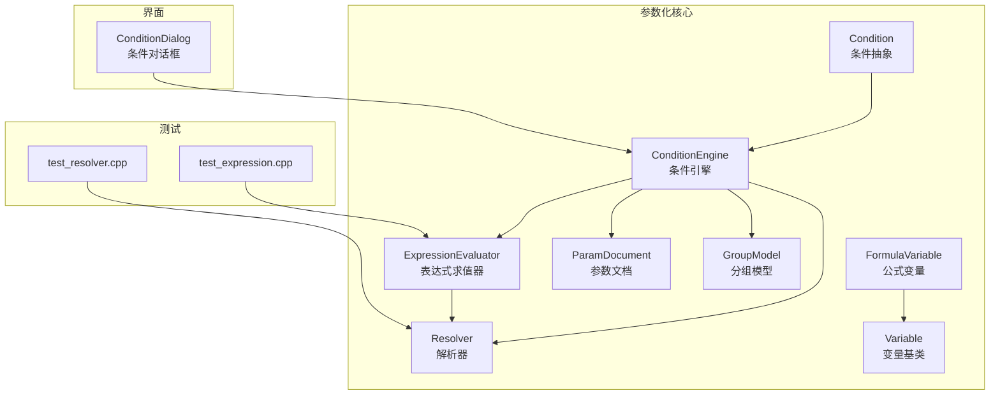
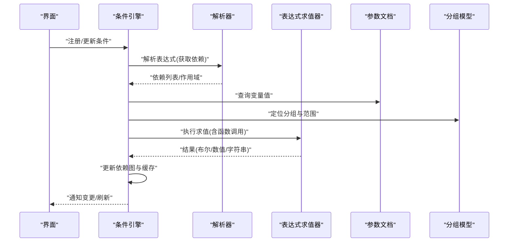
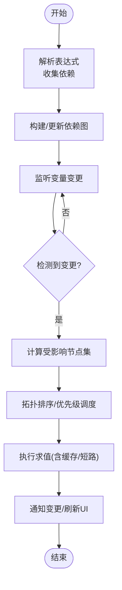
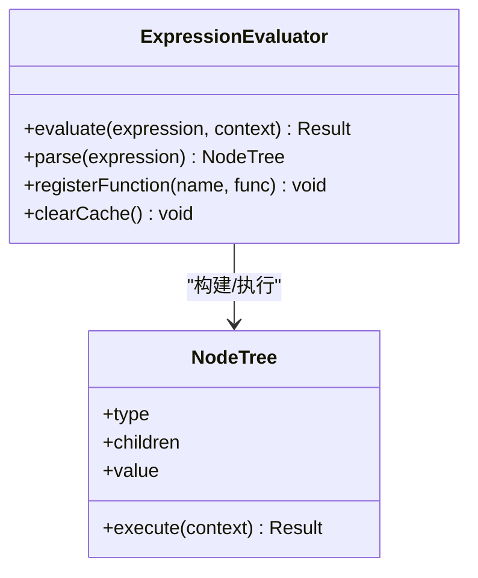
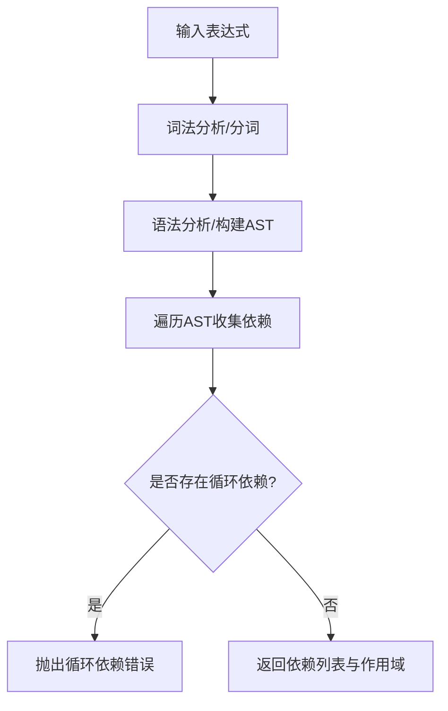
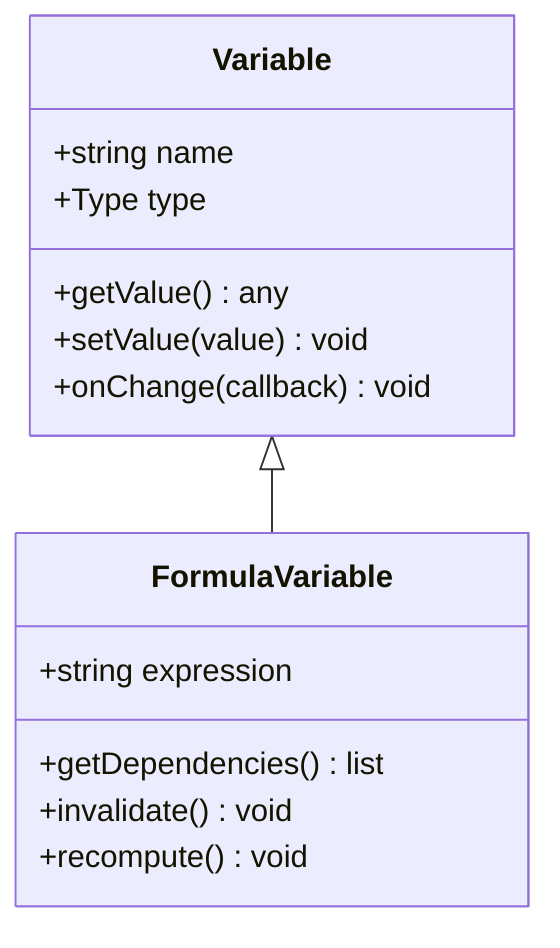
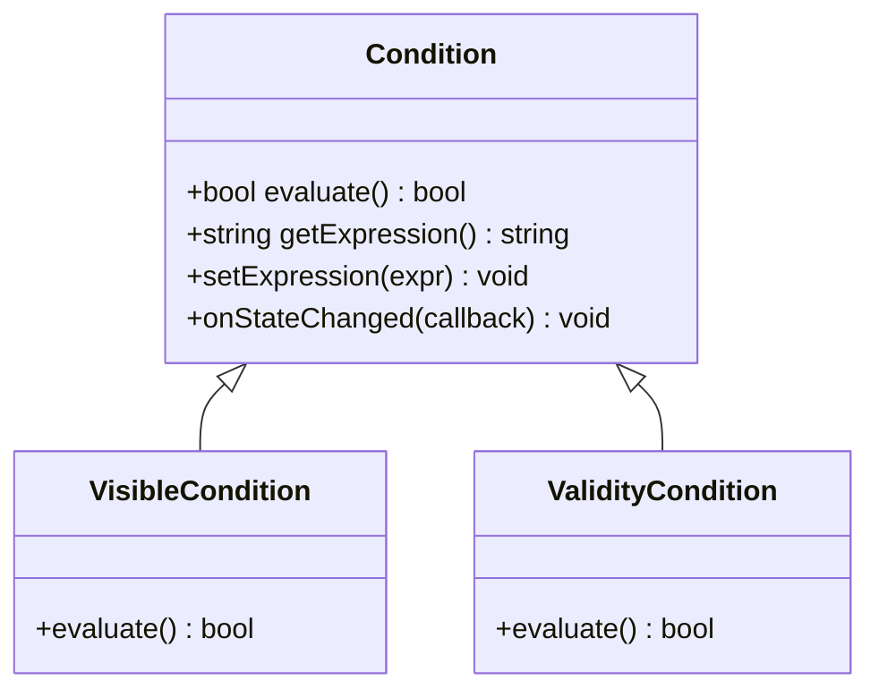
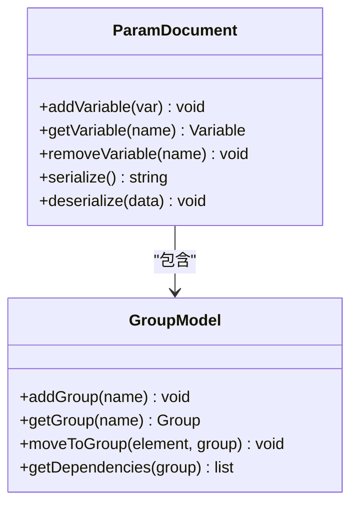
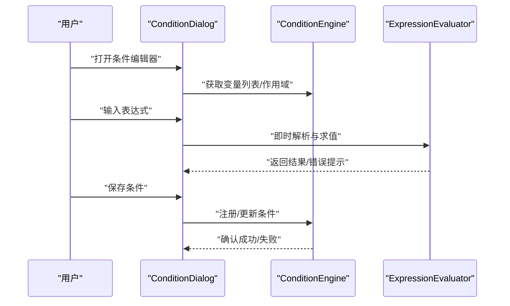
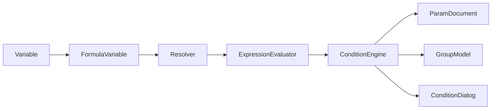

# 条件引擎

<cite>
**本文引用的文件**   
- [ConditionEngine.h](file://src/parametric/ConditionEngine.h)
- [ConditionEngine.cpp](file://src/parametric/ConditionEngine.cpp)
- [ExpressionEvaluator.h](file://src/parametric/ExpressionEvaluator.h)
- [ExpressionEvaluator.cpp](file://src/parametric/ExpressionEvaluator.cpp)
- [Resolver.h](file://src/parametric/Resolver.h)
- [Resolver.cpp](file://src/parametric/Resolver.cpp)
- [FormulaVariable.h](file://src/parametric/FormulaVariable.h)
- [Variable.h](file://src/parametric/Variable.h)
- [Condition.h](file://src/parametric/Condition.h)
- [ParamDocument.h](file://src/parametric/ParamDocument.h)
- [ParamDocument.cpp](file://src/parametric/ParamDocument.cpp)
- [GroupModel.h](file://src/parametric/GroupModel.h)
- [GroupModel.cpp](file://src/parametric/GroupModel.cpp)
- [ConditionDialog.h](file://src/ui/ConditionDialog.h)
- [ConditionDialog.cpp](file://src/ui/ConditionDialog.cpp)
- [test_expression.cpp](file://tests/test_expression.cpp)
- [test_resolver.cpp](file://tests/test_resolver.cpp)
</cite>

## 目录
1. [简介](#简介)
2. [项目结构](#项目结构)
3. [核心组件](#核心组件)
4. [架构总览](#架构总览)
5. [详细组件分析](#详细组件分析)
6. [依赖关系分析](#依赖关系分析)
7. [性能与缓存策略](#性能与缓存策略)
8. [调试与故障排除](#调试与故障排除)
9. [结论](#结论)
10. [附录：使用示例与最佳实践](#附录使用示例与最佳实践)

## 简介
本技术文档围绕“条件引擎”展开，系统性阐述条件系统的架构设计、表达式语法、解析与评估流程、执行机制、依赖关系建立与变更检测、自动更新策略、缓存与性能优化、错误处理以及调试方法。目标读者包括实现者、集成者与高级用户，既提供高层概览，也深入到代码级细节，帮助快速理解并高效使用条件引擎。

## 项目结构
条件引擎位于 parametric 模块中，核心由条件定义、表达式解析与求值、变量与公式管理、依赖图与变更传播等部分组成；UI 层提供条件编辑对话框；测试覆盖表达式求值与解析器行为。

**图示来源** 
- [ConditionEngine.h](file://src/parametric/ConditionEngine.h)
- [ExpressionEvaluator.h](file://src/parametric/ExpressionEvaluator.h)
- [Resolver.h](file://src/parametric/Resolver.h)
- [FormulaVariable.h](file://src/parametric/FormulaVariable.h)
- [Variable.h](file://src/parametric/Variable.h)
- [Condition.h](file://src/parametric/Condition.h)
- [ParamDocument.h](file://src/parametric/ParamDocument.h)
- [GroupModel.h](file://src/parametric/GroupModel.h)
- [ConditionDialog.h](file://src/ui/ConditionDialog.h)
- [test_expression.cpp](file://tests/test_expression.cpp)
- [test_resolver.cpp](file://tests/test_resolver.cpp)

**章节来源**
- [ConditionEngine.h](file://src/parametric/ConditionEngine.h)
- [ExpressionEvaluator.h](file://src/parametric/ExpressionEvaluator.h)
- [Resolver.h](file://src/parametric/Resolver.h)
- [FormulaVariable.h](file://src/parametric/FormulaVariable.h)
- [Variable.h](file://src/parametric/Variable.h)
- [Condition.h](file://src/parametric/Condition.h)
- [ParamDocument.h](file://src/parametric/ParamDocument.h)
- [GroupModel.h](file://src/parametric/GroupModel.h)
- [ConditionDialog.h](file://src/ui/ConditionDialog.h)
- [test_expression.cpp](file://tests/test_expression.cpp)
- [test_resolver.cpp](file://tests/test_resolver.cpp)

## 核心组件
- 条件引擎（ConditionEngine）：负责条件的注册、依赖图构建、变更检测、批量重算与事件通知。
- 表达式求值器（ExpressionEvaluator）：将表达式字符串解析为可执行节点树，支持数值、布尔、字符串及函数调用。
- 解析器（Resolver）：负责变量名到值的查找、作用域解析、依赖收集与循环依赖检测。
- 公式变量（FormulaVariable）：封装带表达式的变量，支持惰性求值与缓存。
- 变量基类（Variable）：统一变量接口，提供类型、名称、值访问与变更通知。
- 条件抽象（Condition）：描述条件语义（如可见性、有效性），供引擎统一调度。
- 参数文档（ParamDocument）：集中管理变量集合、命名空间与作用域。
- 分组模型（GroupModel）：组织变量与条件的分组，便于批量操作与依赖隔离。
- UI 条件对话框（ConditionDialog）：可视化编辑条件表达式与依赖。

**章节来源**
- [ConditionEngine.h](file://src/parametric/ConditionEngine.h)
- [ExpressionEvaluator.h](file://src/parametric/ExpressionEvaluator.h)
- [Resolver.h](file://src/parametric/Resolver.h)
- [FormulaVariable.h](file://src/parametric/FormulaVariable.h)
- [Variable.h](file://src/parametric/Variable.h)
- [Condition.h](file://src/parametric/Condition.h)
- [ParamDocument.h](file://src/parametric/ParamDocument.h)
- [GroupModel.h](file://src/parametric/GroupModel.h)
- [ConditionDialog.h](file://src/ui/ConditionDialog.h)

## 架构总览
条件引擎采用“解析-求值-依赖-传播”的分层架构：
- 解析层：Resolver 将表达式文本转换为 AST/节点树，收集依赖变量与作用域信息。
- 求值层：ExpressionEvaluator 基于节点树执行计算，支持内置函数库与上下文变量。
- 依赖层：ConditionEngine 维护依赖图，跟踪变量变化，触发受影响节点的增量重算。
- 应用层：ParamDocument/GroupModel 提供数据容器与分组管理；UI 层提供编辑入口。

**图示来源** 
- [ConditionEngine.cpp](file://src/parametric/ConditionEngine.cpp)
- [Resolver.cpp](file://src/parametric/Resolver.cpp)
- [ExpressionEvaluator.cpp](file://src/parametric/ExpressionEvaluator.cpp)
- [ParamDocument.cpp](file://src/parametric/ParamDocument.cpp)
- [GroupModel.cpp](file://src/parametric/GroupModel.cpp)

## 详细组件分析

### 条件引擎（ConditionEngine）
- 职责：
  - 条件生命周期管理：创建、注册、销毁。
  - 依赖图构建：根据表达式解析结果建立有向无环图（DAG）。
  - 变更检测：监听变量值变化，识别受影响节点。
  - 执行调度：按拓扑顺序或优先级进行增量重算。
  - 事件通知：向订阅者广播条件状态变化。
- 关键能力：
  - 批量更新：合并多次变量变更，减少重复计算。
  - 短路评估：对布尔表达式进行短路优化。
  - 错误隔离：单个条件失败不影响其他分支。
- 典型流程：
  - 解析表达式 → 收集依赖 → 构建/更新依赖图 → 监听变量变更 → 触发受影响条件重算 → 通知上层。

**图示来源** 
- [ConditionEngine.cpp](file://src/parametric/ConditionEngine.cpp)

**章节来源**
- [ConditionEngine.h](file://src/parametric/ConditionEngine.h)
- [ConditionEngine.cpp](file://src/parametric/ConditionEngine.cpp)

### 表达式求值器（ExpressionEvaluator）
- 职责：
  - 将表达式字符串解析为可执行节点树（AST）。
  - 支持基本运算符（算术、比较、逻辑）、函数调用、括号优先级。
  - 提供上下文变量绑定与函数库扩展点。
- 关键能力：
  - 类型安全：在求值过程中进行类型检查与转换。
  - 函数库：内置数学、字符串、日期时间等常用函数。
  - 错误诊断：返回详细的解析与求值错误信息。
- 性能特性：
  - 节点树复用：相同表达式避免重复解析。
  - 中间结果缓存：子表达式结果缓存以减少重复计算。

**图示来源** 
- [ExpressionEvaluator.h](file://src/parametric/ExpressionEvaluator.h)
- [ExpressionEvaluator.cpp](file://src/parametric/ExpressionEvaluator.cpp)

**章节来源**
- [ExpressionEvaluator.h](file://src/parametric/ExpressionEvaluator.h)
- [ExpressionEvaluator.cpp](file://src/parametric/ExpressionEvaluator.cpp)

### 解析器（Resolver）
- 职责：
  - 变量名解析：在当前作用域与父作用域中查找变量。
  - 依赖收集：从表达式中提取所有依赖变量。
  - 循环依赖检测：确保依赖图为 DAG。
- 关键能力：
  - 作用域链：支持嵌套作用域与命名空间。
  - 别名与映射：变量别名解析与映射表。
  - 错误报告：未定义变量、作用域冲突等。

**图示来源** 
- [Resolver.cpp](file://src/parametric/Resolver.cpp)

**章节来源**
- [Resolver.h](file://src/parametric/Resolver.h)
- [Resolver.cpp](file://src/parametric/Resolver.cpp)

### 公式变量与变量基类（FormulaVariable / Variable）
- Variable：
  - 统一接口：名称、类型、值访问、变更通知。
  - 观察者模式：支持订阅值变化事件。
- FormulaVariable：
  - 表达式驱动：值由表达式动态计算。
  - 惰性求值：仅在需要时计算并缓存结果。
  - 依赖追踪：自动记录表达式中的依赖变量。

**图示来源** 
- [Variable.h](file://src/parametric/Variable.h)
- [FormulaVariable.h](file://src/parametric/FormulaVariable.h)

**章节来源**
- [Variable.h](file://src/parametric/Variable.h)
- [FormulaVariable.h](file://src/parametric/FormulaVariable.h)

### 条件抽象（Condition）
- 职责：
  - 描述条件语义（如可见性、有效性、约束）。
  - 提供统一的评估接口与状态管理。
  - 支持与变量/表达式的绑定。
- 关键能力：
  - 多态评估：不同条件类型实现各自的评估逻辑。
  - 组合条件：支持 AND/OR/NOT 等复合条件。
  - 优先级：在多条件冲突时确定生效顺序。

**图示来源** 
- [Condition.h](file://src/parametric/Condition.h)

**章节来源**
- [Condition.h](file://src/parametric/Condition.h)

### 参数文档与分组模型（ParamDocument / GroupModel）
- ParamDocument：
  - 变量容器：统一管理变量集合与作用域。
  - 命名空间：支持分组命名与路径访问。
  - 序列化：保存/加载参数配置。
- GroupModel：
  - 分组管理：组织变量与条件为逻辑组。
  - 批量操作：对分组内元素进行增删改查。
  - 依赖隔离：分组间依赖边界清晰。

**图示来源** 
- [ParamDocument.h](file://src/parametric/ParamDocument.h)
- [ParamDocument.cpp](file://src/parametric/ParamDocument.cpp)
- [GroupModel.h](file://src/parametric/GroupModel.h)
- [GroupModel.cpp](file://src/parametric/GroupModel.cpp)

**章节来源**
- [ParamDocument.h](file://src/parametric/ParamDocument.h)
- [ParamDocument.cpp](file://src/parametric/ParamDocument.cpp)
- [GroupModel.h](file://src/parametric/GroupModel.h)
- [GroupModel.cpp](file://src/parametric/GroupModel.cpp)

### UI 条件对话框（ConditionDialog）
- 职责：
  - 可视化编辑条件表达式。
  - 实时预览条件结果。
  - 管理条件依赖与变量选择。
- 交互流程：
  - 打开对话框 → 选择变量/函数 → 编写表达式 → 实时验证 → 保存并同步到引擎。

**图示来源** 
- [ConditionDialog.cpp](file://src/ui/ConditionDialog.cpp)
- [ConditionDialog.h](file://src/ui/ConditionDialog.h)

**章节来源**
- [ConditionDialog.h](file://src/ui/ConditionDialog.h)
- [ConditionDialog.cpp](file://src/ui/ConditionDialog.cpp)

## 依赖关系分析
条件引擎的依赖关系遵循分层与解耦原则：
- 低层：Variable/FormulaVariable 提供基础数据与变更通知。
- 中层：Resolver/ExpressionEvaluator 提供解析与求值能力。
- 高层：ConditionEngine 编排依赖图与执行流。
- 外围：ParamDocument/GroupModel 提供数据容器与分组管理；UI 提供交互入口。

**图示来源** 
- [Variable.h](file://src/parametric/Variable.h)
- [FormulaVariable.h](file://src/parametric/FormulaVariable.h)
- [Resolver.h](file://src/parametric/Resolver.h)
- [ExpressionEvaluator.h](file://src/parametric/ExpressionEvaluator.h)
- [ConditionEngine.h](file://src/parametric/ConditionEngine.h)
- [ParamDocument.h](file://src/parametric/ParamDocument.h)
- [GroupModel.h](file://src/parametric/GroupModel.h)
- [ConditionDialog.h](file://src/ui/ConditionDialog.h)

**章节来源**
- [ConditionEngine.h](file://src/parametric/ConditionEngine.h)
- [ExpressionEvaluator.h](file://src/parametric/ExpressionEvaluator.h)
- [Resolver.h](file://src/parametric/Resolver.h)
- [FormulaVariable.h](file://src/parametric/FormulaVariable.h)
- [Variable.h](file://src/parametric/Variable.h)
- [ParamDocument.h](file://src/parametric/ParamDocument.h)
- [GroupModel.h](file://src/parametric/GroupModel.h)
- [ConditionDialog.h](file://src/ui/ConditionDialog.h)

## 性能与缓存策略
- 表达式缓存：
  - 解析结果缓存：相同表达式避免重复 AST 构建。
  - 求值结果缓存：子表达式结果缓存，减少重复计算。
- 增量重算：
  - 依赖图变更传播：仅重算受影响节点。
  - 批量更新：合并多次变量变更，减少抖动。
- 短路评估：
  - 布尔表达式短路：AND/OR 提前终止。
- 内存管理：
  - 节点树复用与释放：避免内存泄漏。
  - 大对象池：频繁创建的临时对象池化。
- 监控与调优：
  - 热点统计：记录高频求值节点。
  - 阈值控制：超过阈值的表达式拆分或优化。

[本节为通用性能指导，不直接分析具体文件]

## 调试与故障排除
- 常见问题：
  - 表达式语法错误：检查分词与语法分析日志。
  - 变量未定义：确认作用域与命名空间。
  - 循环依赖：检查依赖图是否形成环。
  - 类型不匹配：检查函数参数与返回值类型。
- 调试工具：
  - 表达式解析器测试：使用 test_expression.cpp 验证表达式行为。
  - 解析器单元测试：使用 test_resolver.cpp 验证依赖收集与作用域解析。
  - 日志输出：启用详细日志查看解析与求值过程。
- 故障排除步骤：
  - 最小化复现：剥离无关条件与变量。
  - 逐步验证：逐个表达式与函数调用验证。
  - 依赖图检查：打印依赖关系定位问题节点。
  - 缓存清理：清除缓存后重试，排除缓存污染。

**章节来源**
- [test_expression.cpp](file://tests/test_expression.cpp)
- [test_resolver.cpp](file://tests/test_resolver.cpp)

## 结论
条件引擎通过清晰的层次架构与模块化设计，实现了高效的表达式解析、求值与依赖传播。其缓存策略、增量重算与短路评估显著提升了性能；完善的错误处理与调试工具降低了开发与维护成本。在实际应用中，建议充分利用分组与作用域管理复杂条件，结合单元测试与日志进行持续优化。

[本节为总结性内容，不直接分析具体文件]

## 附录：使用示例与最佳实践
- 创建简单条件：
  - 定义变量与表达式，注册到引擎，观察结果变化。
- 嵌套条件：
  - 使用 AND/OR/NOT 组合多个表达式，注意优先级与括号。
- 动态条件：
  - 根据运行时上下文动态生成表达式，利用作用域传递参数。
- 最佳实践：
  - 保持表达式简洁，避免深层嵌套。
  - 合理使用分组与作用域，降低耦合。
  - 启用缓存与增量重算，提升性能。
  - 编写单元测试，覆盖边界与异常场景。

[本节为概念性指导，不直接分析具体文件]