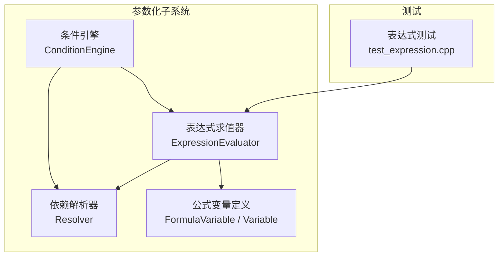
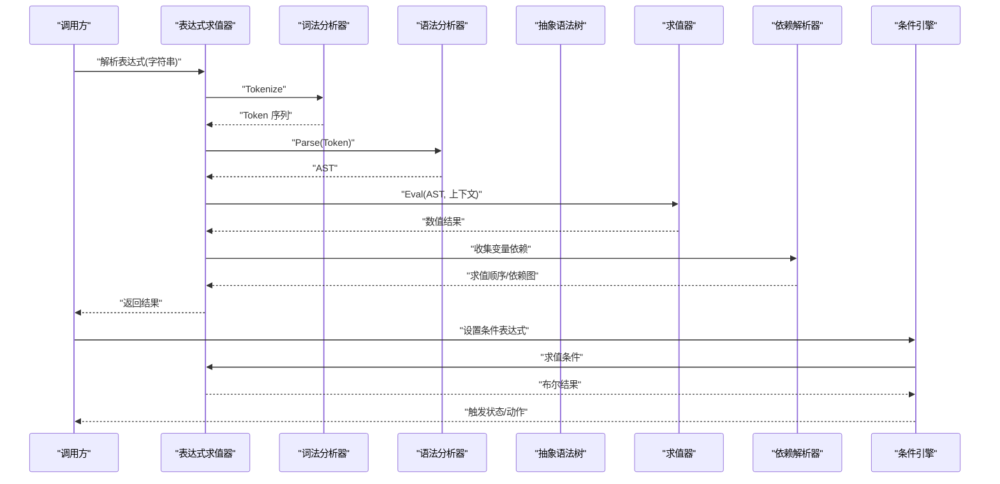
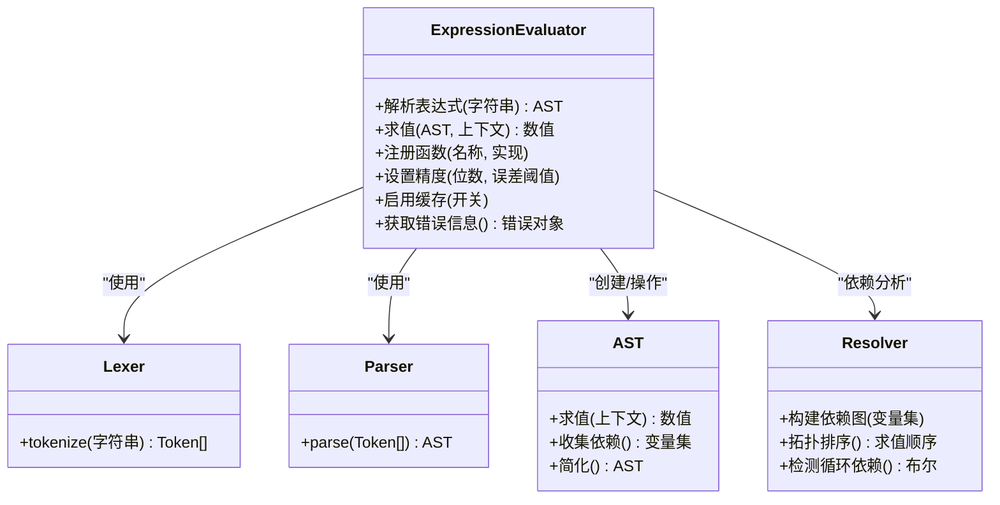
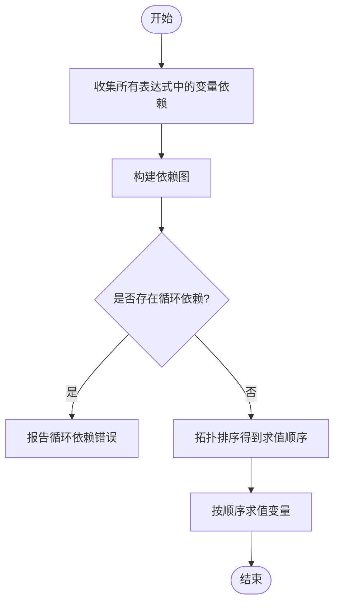
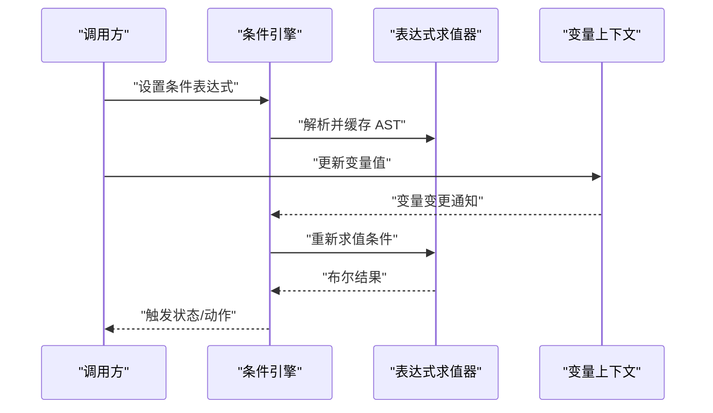
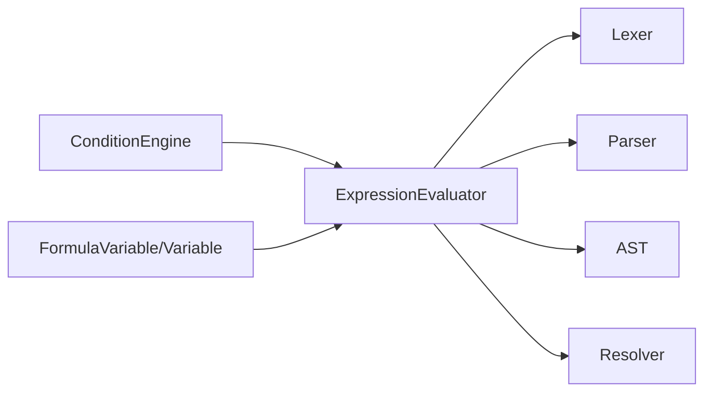

# 表达式求值器

<cite>
**本文引用的文件**   
- [ExpressionEvaluator.h](file://src/parametric/ExpressionEvaluator.h)
- [ExpressionEvaluator.cpp](file://src/parametric/ExpressionEvaluator.cpp)
- [ConditionEngine.h](file://src/parametric/ConditionEngine.h)
- [ConditionEngine.cpp](file://src/parametric/ConditionEngine.cpp)
- [Resolver.h](file://src/parametric/Resolver.h)
- [Resolver.cpp](file://src/parametric/Resolver.cpp)
- [FormulaVariable.h](file://src/parametric/FormulaVariable.h)
- [Variable.h](file://src/parametric/Variable.h)
- [test_expression.cpp](file://tests/test_expression.cpp)
</cite>

## 目录
1. [简介](#简介)
2. [项目结构](#项目结构)
3. [核心组件](#核心组件)
4. [架构总览](#架构总览)
5. [详细组件分析](#详细组件分析)
6. [依赖关系分析](#依赖关系分析)
7. [性能考虑](#性能考虑)
8. [故障排查指南](#故障排查指南)
9. [结论](#结论)
10. [附录](#附录)

## 简介
本技术文档围绕“表达式求值器”展开，系统阐述数学表达式的解析算法、词法分析与语法分析过程，说明支持的数学函数、运算符优先级与计算精度控制策略。同时记录表达式的编译优化、缓存机制与性能调优方法，并提供丰富的使用示例（通过测试用例路径引用）、自定义函数注册方式以及错误处理实践。此外，还涵盖表达式验证、安全沙箱与输入过滤机制的设计思路，并给出调试技巧与性能分析方法，帮助读者快速掌握该模块的用法与扩展点。

## 项目结构
表达式求值相关代码集中在 parametric 子系统中，包含表达式解析、变量解析、条件引擎等关键模块；测试位于 tests 目录。整体采用分层设计：
- 解析层：负责将字符串表达式转换为可执行结构（词法分析、语法分析、AST构建）。
- 求值层：对 AST 进行求值，支持内置函数、变量替换与常量折叠。
- 依赖解析层：根据变量间的依赖关系确定求值顺序，避免循环依赖。
- 条件引擎：基于表达式结果驱动 UI 或业务逻辑的状态切换。

**图表来源** 
- [ExpressionEvaluator.h](file://src/parametric/ExpressionEvaluator.h)
- [ExpressionEvaluator.cpp](file://src/parametric/ExpressionEvaluator.cpp)
- [Resolver.h](file://src/parametric/Resolver.h)
- [Resolver.cpp](file://src/parametric/Resolver.cpp)
- [ConditionEngine.h](file://src/parametric/ConditionEngine.h)
- [ConditionEngine.cpp](file://src/parametric/ConditionEngine.cpp)
- [FormulaVariable.h](file://src/parametric/FormulaVariable.h)
- [Variable.h](file://src/parametric/Variable.h)
- [test_expression.cpp](file://tests/test_expression.cpp)

**章节来源**
- [ExpressionEvaluator.h](file://src/parametric/ExpressionEvaluator.h)
- [ExpressionEvaluator.cpp](file://src/parametric/ExpressionEvaluator.cpp)
- [Resolver.h](file://src/parametric/Resolver.h)
- [Resolver.cpp](file://src/parametric/Resolver.cpp)
- [ConditionEngine.h](file://src/parametric/ConditionEngine.h)
- [ConditionEngine.cpp](file://src/parametric/ConditionEngine.cpp)
- [FormulaVariable.h](file://src/parametric/FormulaVariable.h)
- [Variable.h](file://src/parametric/Variable.h)
- [test_expression.cpp](file://tests/test_expression.cpp)

## 核心组件
- 表达式求值器（ExpressionEvaluator）
  - 职责：提供表达式解析、AST 构建、求值接口；管理内置函数、变量上下文、精度与误差阈值；可选实现编译缓存与常量折叠。
  - 关键点：词法分析（Token 流）、语法分析（递归下降或类似算法）、求值（深度优先遍历 AST）、错误定位（行号/位置信息）。
- 依赖解析器（Resolver）
  - 职责：维护变量间依赖图，生成无环求值顺序；检测循环依赖并报告错误。
  - 关键点：拓扑排序、增量更新、依赖变更触发重算。
- 条件引擎（ConditionEngine）
  - 职责：基于表达式结果驱动状态机或 UI 行为；支持多条件组合与短路求值。
  - 关键点：条件表达式缓存、变化监听、事件派发。
- 公式变量（FormulaVariable / Variable）
  - 职责：描述变量的名称、类型、默认值、取值范围与约束；参与表达式求值时的上下文绑定。
  - 关键点：类型安全、单位换算、边界校验。

**章节来源**
- [ExpressionEvaluator.h](file://src/parametric/ExpressionEvaluator.h)
- [ExpressionEvaluator.cpp](file://src/parametric/ExpressionEvaluator.cpp)
- [Resolver.h](file://src/parametric/Resolver.h)
- [Resolver.cpp](file://src/parametric/Resolver.cpp)
- [ConditionEngine.h](file://src/parametric/ConditionEngine.h)
- [ConditionEngine.cpp](file://src/parametric/ConditionEngine.cpp)
- [FormulaVariable.h](file://src/parametric/FormulaVariable.h)
- [Variable.h](file://src/parametric/Variable.h)

## 架构总览
下图展示了表达式从文本到结果的完整流程，包括词法分析、语法分析、AST 求值、依赖解析与条件引擎联动。

**图表来源** 
- [ExpressionEvaluator.h](file://src/parametric/ExpressionEvaluator.h)
- [ExpressionEvaluator.cpp](file://src/parametric/ExpressionEvaluator.cpp)
- [Resolver.h](file://src/parametric/Resolver.h)
- [Resolver.cpp](file://src/parametric/Resolver.cpp)
- [ConditionEngine.h](file://src/parametric/ConditionEngine.h)
- [ConditionEngine.cpp](file://src/parametric/ConditionEngine.cpp)

## 详细组件分析

### 表达式求值器（ExpressionEvaluator）
- 解析算法
  - 词法分析：将输入字符串切分为 Token（数字、标识符、运算符、括号、函数名等），识别关键字与函数名，输出 Token 流。
  - 语法分析：采用递归下降或 Pratt 解析，按运算符优先级与结合性构建 AST。常见节点类型包括：二元运算、一元运算、函数调用、变量引用、字面量、括号分组。
  - 错误处理：在词法与语法阶段捕获非法字符、未闭合括号、未知标识符等，返回带位置的错误信息。
- 求值与优化
  - 常量折叠：在构建 AST 时合并可静态计算的子树，减少运行时开销。
  - 表达式简化：如 x+0→x、x*1→x 等规则化简。
  - 缓存机制：对相同表达式与相同变量上下文的求值结果进行缓存，命中直接返回。
  - 精度控制：支持全局或局部精度设置（如小数位数、相对/绝对误差阈值），在比较与舍入时使用。
- 函数与变量
  - 内置函数：三角函数、指数对数、取整、绝对值、最大值最小值等；可通过 API 注册自定义函数。
  - 变量上下文：支持命名空间与层级访问，变量类型检查与单位换算。
- 安全与验证
  - 输入过滤：限制 Token 长度、禁止危险字符、白名单函数列表。
  - 沙箱模式：限制函数集合、禁用外部 IO、限制递归深度与最大节点数。
  - 表达式验证：在解析阶段进行语义检查（如除零、开方负数、类型不匹配）。

**图表来源** 
- [ExpressionEvaluator.h](file://src/parametric/ExpressionEvaluator.h)
- [ExpressionEvaluator.cpp](file://src/parametric/ExpressionEvaluator.cpp)
- [Resolver.h](file://src/parametric/Resolver.h)
- [Resolver.cpp](file://src/parametric/Resolver.cpp)

**章节来源**
- [ExpressionEvaluator.h](file://src/parametric/ExpressionEvaluator.h)
- [ExpressionEvaluator.cpp](file://src/parametric/ExpressionEvaluator.cpp)

### 依赖解析器（Resolver）
- 功能要点
  - 依赖图构建：从多个表达式中提取变量依赖，形成有向图。
  - 拓扑排序：生成无环求值顺序，确保变量在其依赖之后求值。
  - 循环依赖检测：若存在环，返回错误并指出涉及的变量。
  - 增量更新：当某个变量变化时，仅重算受影响子图。
- 复杂度分析
  - 构建依赖图：O(V+E)，V 为变量数，E 为依赖边数。
  - 拓扑排序：O(V+E)。
  - 增量更新：取决于受影响子图大小。

**图表来源** 
- [Resolver.h](file://src/parametric/Resolver.h)
- [Resolver.cpp](file://src/parametric/Resolver.cpp)

**章节来源**
- [Resolver.h](file://src/parametric/Resolver.h)
- [Resolver.cpp](file://src/parametric/Resolver.cpp)

### 条件引擎（ConditionEngine）
- 功能要点
  - 条件表达式求值：将布尔表达式结果映射到状态或动作。
  - 缓存与监听：条件表达式结果缓存，变量变化时自动重算并触发回调。
  - 短路求值：支持 AND/OR 短路，提升性能与安全性。
- 使用场景
  - UI 显示/隐藏、按钮可用性与提示文案动态切换。
  - 业务规则判定与分支逻辑。

**图表来源** 
- [ConditionEngine.h](file://src/parametric/ConditionEngine.h)
- [ConditionEngine.cpp](file://src/parametric/ConditionEngine.cpp)
- [ExpressionEvaluator.h](file://src/parametric/ExpressionEvaluator.h)
- [ExpressionEvaluator.cpp](file://src/parametric/ExpressionEvaluator.cpp)

**章节来源**
- [ConditionEngine.h](file://src/parametric/ConditionEngine.h)
- [ConditionEngine.cpp](file://src/parametric/ConditionEngine.cpp)

### 公式变量（FormulaVariable / Variable）
- 字段与约束
  - 名称、类型（数值/布尔/字符串等）、默认值、取值范围、单位。
  - 约束：非负、整数、区间限制、正则表达式等。
- 作用域与可见性
  - 支持分组与作用域隔离，避免命名冲突。
- 类型安全
  - 在表达式求值前进行类型检查，防止类型不匹配导致的运行时错误。

**章节来源**
- [FormulaVariable.h](file://src/parametric/FormulaVariable.h)
- [Variable.h](file://src/parametric/Variable.h)

## 依赖关系分析
- 组件耦合
  - ExpressionEvaluator 依赖 Lexer、Parser、AST、Resolver；ConditionEngine 依赖 ExpressionEvaluator 与 Resolver。
  - FormulaVariable/Variable 被 ExpressionEvaluator 用于上下文绑定与类型检查。
- 外部依赖
  - 数学库（三角函数、指数对数等）、容器与数据结构（哈希表、队列等）。
- 潜在循环依赖
  - 通过 Resolver 的依赖图与拓扑排序避免循环；在模块层面保持单向依赖。

**图表来源** 
- [ExpressionEvaluator.h](file://src/parametric/ExpressionEvaluator.h)
- [ExpressionEvaluator.cpp](file://src/parametric/ExpressionEvaluator.cpp)
- [Resolver.h](file://src/parametric/Resolver.h)
- [Resolver.cpp](file://src/parametric/Resolver.cpp)
- [ConditionEngine.h](file://src/parametric/ConditionEngine.h)
- [ConditionEngine.cpp](file://src/parametric/ConditionEngine.cpp)
- [FormulaVariable.h](file://src/parametric/FormulaVariable.h)
- [Variable.h](file://src/parametric/Variable.h)

**章节来源**
- [ExpressionEvaluator.h](file://src/parametric/ExpressionEvaluator.h)
- [ExpressionEvaluator.cpp](file://src/parametric/ExpressionEvaluator.cpp)
- [Resolver.h](file://src/parametric/Resolver.h)
- [Resolver.cpp](file://src/parametric/Resolver.cpp)
- [ConditionEngine.h](file://src/parametric/ConditionEngine.h)
- [ConditionEngine.cpp](file://src/parametric/ConditionEngine.cpp)
- [FormulaVariable.h](file://src/parametric/FormulaVariable.h)
- [Variable.h](file://src/parametric/Variable.h)

## 性能考虑
- 解析优化
  - 预编译表达式：将常用表达式提前解析为 AST，避免重复解析开销。
  - 常量折叠与简化：在构建 AST 时尽可能减少节点数量。
- 求值优化
  - 结果缓存：基于表达式哈希与变量上下文哈希进行缓存命中。
  - 增量重算：依赖解析后仅重算受影响的子树。
  - 精度权衡：合理设置误差阈值，避免不必要的浮点比较开销。
- 内存与并发
  - 复用 AST 与 Token 缓冲区，减少分配。
  - 线程安全：保证表达式求值的并发访问安全（读写锁或不可变 AST）。
- 监控与剖析
  - 统计解析/求值耗时、缓存命中率、AST 节点数。
  - 使用性能剖析工具定位热点函数与瓶颈。

[本节为通用指导，无需特定文件来源]

## 故障排查指南
- 常见问题
  - 语法错误：未闭合括号、非法字符、未知函数名。
  - 语义错误：除零、开方负数、类型不匹配、变量未定义。
  - 性能问题：表达式过于复杂、缺少缓存、频繁重建 AST。
- 诊断步骤
  - 启用详细日志：输出 Token 流、AST 结构与求值路径。
  - 检查依赖图：确认无循环依赖，查看求值顺序是否合理。
  - 验证输入：对输入进行白名单过滤与长度限制。
  - 单元测试：参考测试用例覆盖边界情况与异常路径。
- 错误恢复
  - 回退到默认值或上次有效结果。
  - 提供用户友好的错误消息与修复建议。

**章节来源**
- [test_expression.cpp](file://tests/test_expression.cpp)

## 结论
表达式求值器通过词法分析、语法分析与 AST 求值实现了灵活且高效的数学表达式处理能力。配合依赖解析与条件引擎，可在 UI 与业务逻辑中实现动态、响应式的行为。通过常量折叠、缓存与增量重算等优化手段，系统在性能与准确性之间取得平衡。建议在扩展时遵循白名单与沙箱策略，确保安全性与稳定性。

[本节为总结，无需特定文件来源]

## 附录
- 使用示例（通过测试用例路径引用）
  - 基础算术表达式求值：参见 [test_expression.cpp](file://tests/test_expression.cpp)
  - 函数调用与变量替换：参见 [test_expression.cpp](file://tests/test_expression.cpp)
  - 自定义函数注册与错误处理：参见 [test_expression.cpp](file://tests/test_expression.cpp)
- 最佳实践
  - 预编译常用表达式，启用缓存。
  - 设置合理的精度与误差阈值。
  - 使用白名单函数与输入过滤，启用沙箱模式。
  - 定期监控性能指标，持续优化表达式复杂度。

[本节为补充信息，无需特定文件来源]