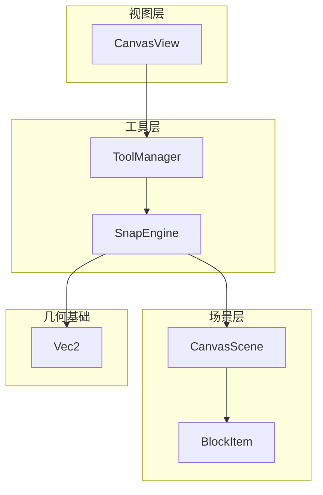
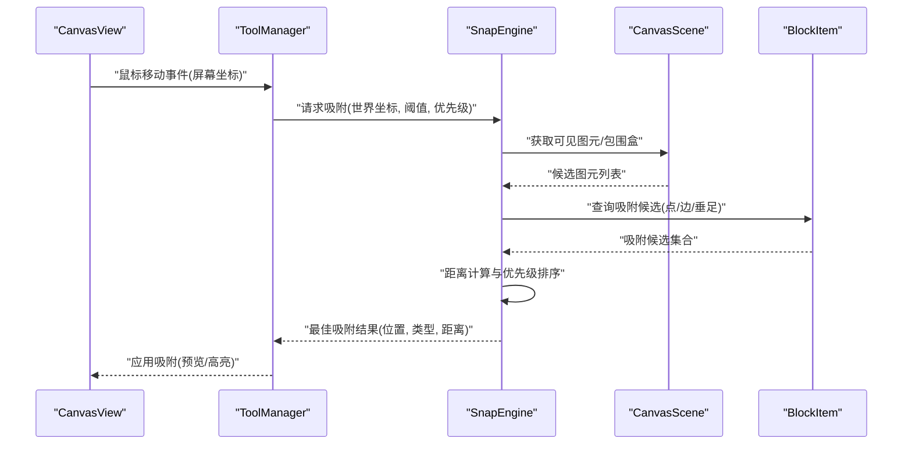
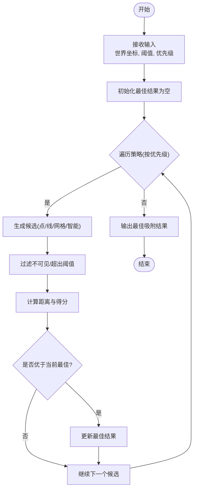
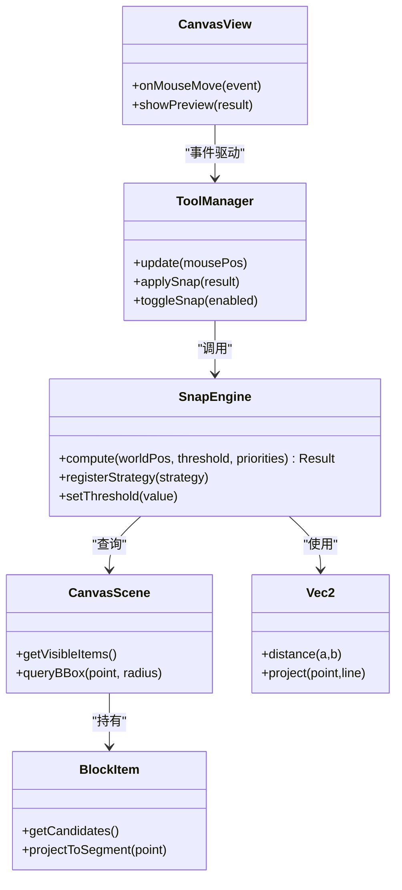

# 吸附引擎

<cite>
**本文引用的文件**   
- [SnapEngine.h](file://src/tools/SnapEngine.h)
- [SnapEngine.cpp](file://src/tools/SnapEngine.cpp)
- [ToolManager.h](file://src/tools/ToolManager.h)
- [ToolManager.cpp](file://src/tools/ToolManager.cpp)
- [CanvasScene.h](file://src/canvas/CanvasScene.h)
- [CanvasScene.cpp](file://src/canvas/CanvasScene.cpp)
- [CanvasView.h](file://src/canvas/CanvasView.h)
- [CanvasView.cpp](file://src/canvas/CanvasView.cpp)
- [BlockItem.h](file://src/canvas/BlockItem.h)
- [BlockItem.cpp](file://src/canvas/BlockItem.cpp)
- [Vec2.h](file://src/geometry/Vec2.h)
</cite>

## 目录
1. [简介](#简介)
2. [项目结构](#项目结构)
3. [核心组件](#核心组件)
4. [架构总览](#架构总览)
5. [详细组件分析](#详细组件分析)
6. [依赖关系分析](#依赖关系分析)
7. [性能考量](#性能考量)
8. [故障排查指南](#故障排查指南)
9. [结论](#结论)
10. [附录](#附录)

## 简介
本文件为“吸附引擎”提供系统化、可操作的技术文档，覆盖点吸附、线吸附、网格吸附与智能吸附策略的实现思路与集成方式。文档重点包括：
- 吸附算法与数据结构设计
- 配置项说明（吸附距离阈值、吸附类型优先级、性能优化开关）
- 与用户输入事件（鼠标移动、拖拽等）的实时联动
- 复杂图形环境下的准确性与性能平衡策略
- 自定义吸附规则与检测点的扩展方法

## 项目结构
吸附相关代码主要位于 tools 与 canvas 子模块中：
- tools/SnapEngine.*：吸附引擎核心实现与策略接口
- tools/ToolManager.*：工具管理器，负责将吸附结果注入到当前工具流程
- canvas/CanvasScene.*：场景层，提供几何查询与可见性过滤
- canvas/CanvasView.*：视图层，处理输入事件并驱动吸附反馈
- canvas/BlockItem.*：图元对象，暴露吸附候选点/边
- geometry/Vec2.h：二维向量基础类型

图表来源
- [SnapEngine.h](file://src/tools/SnapEngine.h)
- [SnapEngine.cpp](file://src/tools/SnapEngine.cpp)
- [ToolManager.h](file://src/tools/ToolManager.h)
- [ToolManager.cpp](file://src/tools/ToolManager.cpp)
- [CanvasScene.h](file://src/canvas/CanvasScene.h)
- [CanvasScene.cpp](file://src/canvas/CanvasScene.cpp)
- [CanvasView.h](file://src/canvas/CanvasView.h)
- [CanvasView.cpp](file://src/canvas/CanvasView.cpp)
- [BlockItem.h](file://src/canvas/BlockItem.h)
- [BlockItem.cpp](file://src/canvas/BlockItem.cpp)
- [Vec2.h](file://src/geometry/Vec2.h)

章节来源
- [SnapEngine.h](file://src/tools/SnapEngine.h)
- [SnapEngine.cpp](file://src/tools/SnapEngine.cpp)
- [ToolManager.h](file://src/tools/ToolManager.h)
- [ToolManager.cpp](file://src/tools/ToolManager.cpp)
- [CanvasScene.h](file://src/canvas/CanvasScene.h)
- [CanvasScene.cpp](file://src/canvas/CanvasScene.cpp)
- [CanvasView.h](file://src/canvas/CanvasView.h)
- [CanvasView.cpp](file://src/canvas/CanvasView.cpp)
- [BlockItem.h](file://src/canvas/BlockItem.h)
- [BlockItem.cpp](file://src/canvas/BlockItem.cpp)
- [Vec2.h](file://src/geometry/Vec2.h)

## 核心组件
- 吸附引擎 SnapEngine
  - 职责：聚合多种吸附策略（点、线、网格、智能），计算最近吸附候选，返回统一结果
  - 关键能力：距离阈值控制、优先级排序、可见性与选中状态过滤、增量更新
- 工具管理器 ToolManager
  - 职责：在工具生命周期内调用吸附引擎，将吸附结果应用到当前绘制/编辑流程
- 场景 CanvasScene
  - 职责：提供图元集合、可见性判断、空间查询（如包围盒、线段投影）
- 视图 CanvasView
  - 职责：捕获鼠标移动/点击事件，驱动吸附反馈（预览线、高亮吸附点）
- 图元 BlockItem
  - 职责：暴露吸附候选（顶点、边中点、垂足等）与几何信息
- 向量 Vec2
  - 职责：二维坐标运算（距离、投影、归一化）

章节来源
- [SnapEngine.h](file://src/tools/SnapEngine.h)
- [SnapEngine.cpp](file://src/tools/SnapEngine.cpp)
- [ToolManager.h](file://src/tools/ToolManager.h)
- [ToolManager.cpp](file://src/tools/ToolManager.cpp)
- [CanvasScene.h](file://src/canvas/CanvasScene.h)
- [CanvasScene.cpp](file://src/canvas/CanvasScene.cpp)
- [CanvasView.h](file://src/canvas/CanvasView.h)
- [CanvasView.cpp](file://src/canvas/CanvasView.cpp)
- [BlockItem.h](file://src/canvas/BlockItem.h)
- [BlockItem.cpp](file://src/canvas/BlockItem.cpp)
- [Vec2.h](file://src/geometry/Vec2.h)

## 架构总览
吸附引擎采用“策略+调度”的架构：
- 策略层：点吸附、线吸附、网格吸附、智能吸附各自独立实现
- 调度层：按优先级顺序收集候选，合并去重，选择最优解
- 数据层：通过场景与图元获取几何信息；通过视图层进行交互反馈

图表来源
- [CanvasView.cpp](file://src/canvas/CanvasView.cpp)
- [ToolManager.cpp](file://src/tools/ToolManager.cpp)
- [SnapEngine.cpp](file://src/tools/SnapEngine.cpp)
- [CanvasScene.cpp](file://src/canvas/CanvasScene.cpp)
- [BlockItem.cpp](file://src/canvas/BlockItem.cpp)

## 详细组件分析

### 吸附引擎 SnapEngine
- 设计要点
  - 统一的吸附结果结构：包含吸附位置、吸附类型（点/线/网格/智能）、匹配距离、关联图元ID
  - 策略注册与优先级：支持动态添加策略，按优先级从高到低执行
  - 距离阈值：超过阈值的候选直接丢弃，减少无效计算
  - 可见性与选中过滤：仅对可见且符合条件的图元进行吸附
- 核心流程
  - 输入：鼠标位置（世界坐标）、吸附阈值、策略优先级列表
  - 候选生成：遍历策略，从场景与图元中提取候选
  - 评分与选择：基于距离与优先级计算得分，选择最优
  - 输出：吸附结果与调试信息（可选）

图表来源
- [SnapEngine.cpp](file://src/tools/SnapEngine.cpp)
- [SnapEngine.h](file://src/tools/SnapEngine.h)

章节来源
- [SnapEngine.h](file://src/tools/SnapEngine.h)
- [SnapEngine.cpp](file://src/tools/SnapEngine.cpp)

### 工具管理器 ToolManager
- 职责
  - 在工具运行期间周期性或事件驱动地调用吸附引擎
  - 将吸附结果应用到当前工具的绘制/编辑逻辑（如约束对齐、路径修正）
  - 管理吸附状态的切换（开启/关闭、临时禁用）
- 与视图集成
  - 接收来自 CanvasView 的鼠标事件，转换为世界坐标后传入引擎
  - 根据吸附结果更新预览元素（如辅助线、吸附点高亮）

章节来源
- [ToolManager.h](file://src/tools/ToolManager.h)
- [ToolManager.cpp](file://src/tools/ToolManager.cpp)

### 场景 CanvasScene 与图元 BlockItem
- 场景
  - 维护图元集合，提供可见性过滤与快速包围盒查询
  - 支持批量查询以减少遍历开销
- 图元
  - 暴露吸附候选：顶点、边中点、垂足、端点等
  - 提供几何方法：点到线段投影、线段相交、距离计算

章节来源
- [CanvasScene.h](file://src/canvas/CanvasScene.h)
- [CanvasScene.cpp](file://src/canvas/CanvasScene.cpp)
- [BlockItem.h](file://src/canvas/BlockItem.h)
- [BlockItem.cpp](file://src/canvas/BlockItem.cpp)

### 视图 CanvasView
- 职责
  - 捕获鼠标移动/点击事件，转换为世界坐标
  - 驱动吸附预览：显示吸附点、吸附线、距离提示
  - 与 ToolManager 协作，将吸附结果应用到当前工具

章节来源
- [CanvasView.h](file://src/canvas/CanvasView.h)
- [CanvasView.cpp](file://src/canvas/CanvasView.cpp)

### 几何基础 Vec2
- 职责
  - 提供二维向量运算：距离、点积、叉积、投影、归一化
  - 支撑吸附算法中的距离计算与投影求解

章节来源
- [Vec2.h](file://src/geometry/Vec2.h)

## 依赖关系分析
- 耦合关系
  - ToolManager 依赖 SnapEngine 进行吸附计算
  - SnapEngine 依赖 CanvasScene 获取图元与几何信息
  - CanvasView 依赖 ToolManager 传递输入事件与吸附反馈
- 外部依赖
  - 几何库（Vec2）用于基础数学运算
  - UI框架（Qt）用于事件与渲染（由视图层封装）

图表来源
- [ToolManager.h](file://src/tools/ToolManager.h)
- [SnapEngine.h](file://src/tools/SnapEngine.h)
- [CanvasScene.h](file://src/canvas/CanvasScene.h)
- [BlockItem.h](file://src/canvas/BlockItem.h)
- [CanvasView.h](file://src/canvas/CanvasView.h)
- [Vec2.h](file://src/geometry/Vec2.h)

章节来源
- [ToolManager.h](file://src/tools/ToolManager.h)
- [SnapEngine.h](file://src/tools/SnapEngine.h)
- [CanvasScene.h](file://src/canvas/CanvasScene.h)
- [BlockItem.h](file://src/canvas/BlockItem.h)
- [CanvasView.h](file://src/canvas/CanvasView.h)
- [Vec2.h](file://src/geometry/Vec2.h)

## 性能考量
- 候选裁剪
  - 使用包围盒与视口裁剪，避免全量遍历
  - 对每个图元的候选集合进行预计算与缓存
- 距离计算优化
  - 优先使用平方距离比较，避免开方
  - 对近距离候选进行精细计算，远距离候选快速丢弃
- 增量更新
  - 仅在鼠标移动超过阈值时重新计算吸附
  - 对未变化的候选复用上次结果
- 多线程与异步
  - 将重型几何计算放入后台线程，主线程仅做结果合并与UI更新
- 可视化反馈节流
  - 限制预览更新频率，避免频繁重绘

[本节为通用性能建议，不直接分析具体文件]

## 故障排查指南
- 吸附不准确
  - 检查世界坐标转换是否正确
  - 确认吸附阈值设置是否合理
  - 验证图元可见性与选中状态过滤逻辑
- 性能卡顿
  - 检查候选数量是否过大，考虑增加包围盒过滤
  - 确认是否存在重复计算或未缓存的几何操作
- 吸附类型冲突
  - 调整优先级顺序，确保期望类型优先
  - 增加距离容差，避免相近候选误判

章节来源
- [SnapEngine.cpp](file://src/tools/SnapEngine.cpp)
- [ToolManager.cpp](file://src/tools/ToolManager.cpp)
- [CanvasScene.cpp](file://src/canvas/CanvasScene.cpp)
- [CanvasView.cpp](file://src/canvas/CanvasView.cpp)

## 结论
吸附引擎通过策略化设计与优先级调度，实现了灵活、可扩展的吸附能力。结合场景与图元的几何信息，能够在复杂图形环境中提供准确的吸附体验。通过合理的性能优化与事件集成，可实现流畅的实时吸附反馈。未来可进一步引入自适应阈值、机器学习辅助的智能吸附等增强功能。

[本节为总结性内容，不直接分析具体文件]

## 附录
- 配置项建议
  - 吸附距离阈值：默认值建议为像素级单位，支持缩放适配
  - 吸附类型优先级：点 > 线 > 网格 > 智能（可按需调整）
  - 性能开关：启用/禁用包围盒缓存、增量更新、后台计算
- 自定义吸附规则
  - 实现策略接口：定义候选生成与距离计算
  - 注册到引擎：指定优先级与适用条件
  - 测试与调优：使用边界用例验证准确性与性能

[本节为补充说明，不直接分析具体文件]