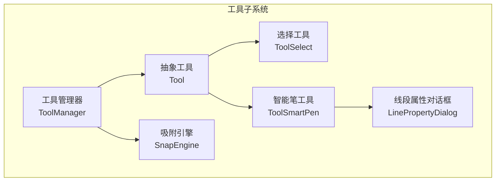
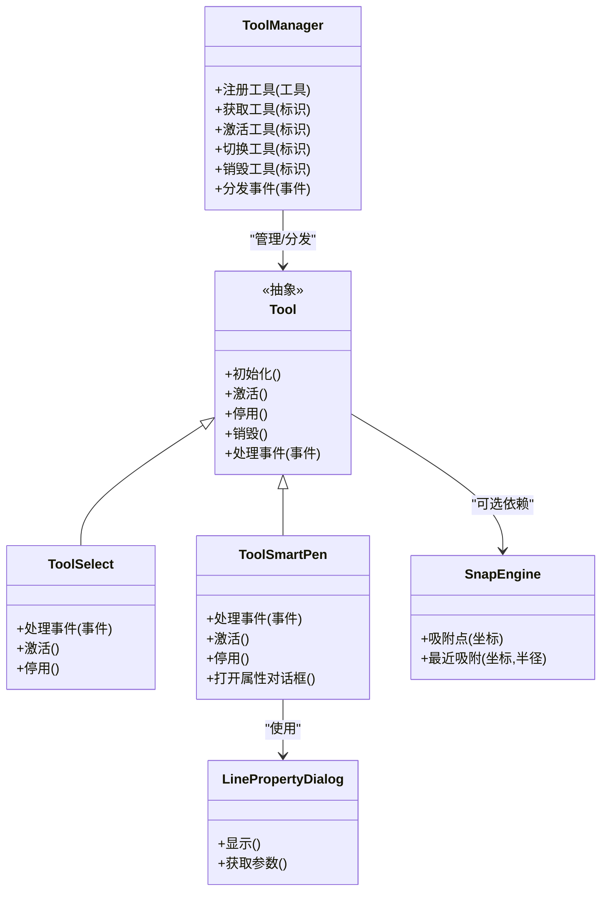
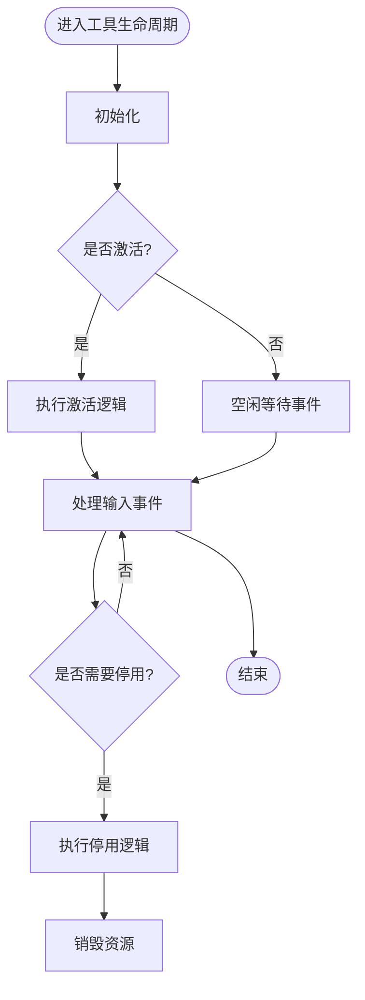
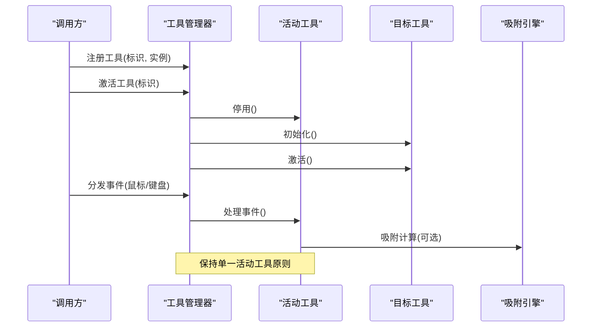
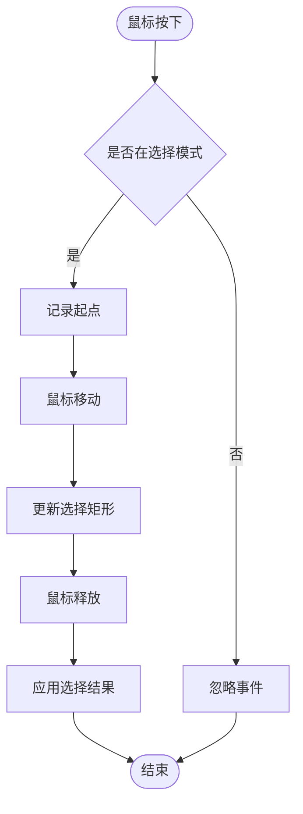
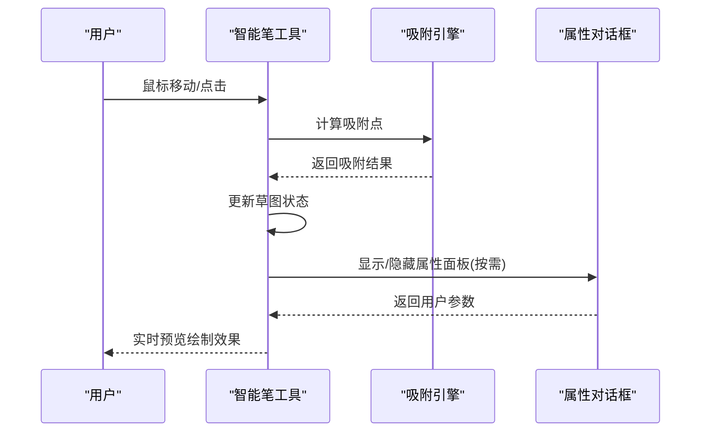
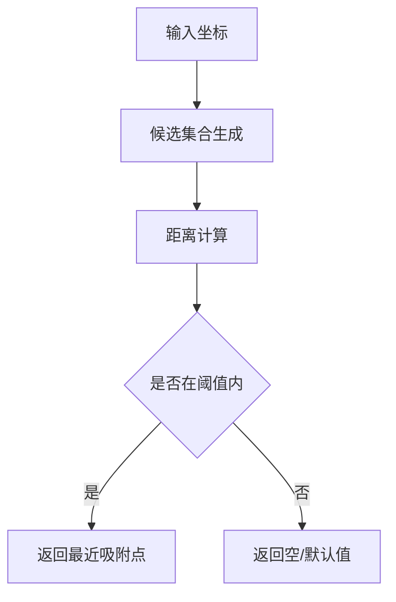
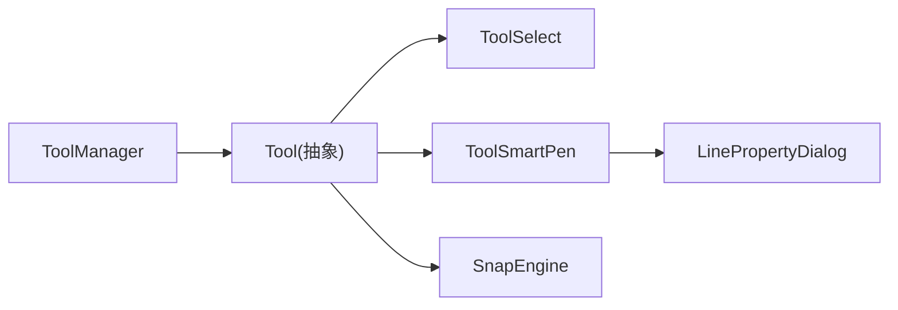

# 工具管理器

<cite>
**本文引用的文件**   
- [Tool.h](file://src/tools/Tool.h)
- [ToolManager.h](file://src/tools/ToolManager.h)
- [ToolManager.cpp](file://src/tools/ToolManager.cpp)
- [ToolSelect.h](file://src/tools/ToolSelect.h)
- [ToolSelect.cpp](file://src/tools/ToolSelect.cpp)
- [ToolSmartPen.h](file://src/tools/ToolSmartPen.h)
- [ToolSmartPen.cpp](file://src/tools/ToolSmartPen.cpp)
- [SnapEngine.h](file://src/tools/SnapEngine.h)
- [SnapEngine.cpp](file://src/tools/SnapEngine.cpp)
- [LinePropertyDialog.h](file://src/tools/LinePropertyDialog.h)
- [LinePropertyDialog.cpp](file://src/tools/LinePropertyDialog.cpp)
</cite>

## 目录
1. [简介](#简介)
2. [项目结构](#项目结构)
3. [核心组件](#核心组件)
4. [架构总览](#架构总览)
5. [详细组件分析](#详细组件分析)
6. [依赖关系分析](#依赖关系分析)
7. [性能考量](#性能考量)
8. [故障排查指南](#故障排查指南)
9. [结论](#结论)
10. [附录](#附录) 

## 简介
本文件面向“工具管理器”子系统，系统性阐述其核心职责与实现思路：工具的注册、激活、切换与生命周期管理；不同工具之间的状态协调与事件处理；以及扩展机制、冲突解决策略与性能优化建议。文档以代码级分析为基础，辅以架构图、时序图与流程图，帮助开发者快速理解并正确扩展该子系统。

## 项目结构
工具管理器位于 src/tools 目录下，围绕抽象基类 Tool 与具体工具（如选择工具、智能笔工具）构建，并由 ToolManager 统一编排生命周期与事件分发。辅助模块包括吸附引擎 SnapEngine 与属性对话框 LinePropertyDialog，用于增强交互体验。

**图示来源** 
- [Tool.h](file://src/tools/Tool.h)
- [ToolManager.h](file://src/tools/ToolManager.h)
- [ToolSelect.h](file://src/tools/ToolSelect.h)
- [ToolSmartPen.h](file://src/tools/ToolSmartPen.h)
- [SnapEngine.h](file://src/tools/SnapEngine.h)
- [LinePropertyDialog.h](file://src/tools/LinePropertyDialog.h)

**章节来源**
- [Tool.h](file://src/tools/Tool.h)
- [ToolManager.h](file://src/tools/ToolManager.h)
- [ToolSelect.h](file://src/tools/ToolSelect.h)
- [ToolSmartPen.h](file://src/tools/ToolSmartPen.h)
- [SnapEngine.h](file://src/tools/SnapEngine.h)
- [LinePropertyDialog.h](file://src/tools/LinePropertyDialog.h)

## 核心组件
- 抽象工具 Tool：定义工具的统一接口与生命周期钩子，作为所有具体工具的基类。
- 工具管理器 ToolManager：负责工具的注册、查找、激活、切换与销毁；维护当前活动工具；协调事件分发与状态同步。
- 具体工具：
  - ToolSelect：选择模式下的交互逻辑。
  - ToolSmartPen：智能绘制模式下的交互与几何计算。
- 辅助组件：
  - SnapEngine：提供吸附能力，供工具在鼠标移动/点击时进行对齐。
  - LinePropertyDialog：为线段相关操作提供参数配置界面。

**章节来源**
- [Tool.h](file://src/tools/Tool.h)
- [ToolManager.h](file://src/tools/ToolManager.h)
- [ToolManager.cpp](file://src/tools/ToolManager.cpp)
- [ToolSelect.h](file://src/tools/ToolSelect.h)
- [ToolSelect.cpp](file://src/tools/ToolSelect.cpp)
- [ToolSmartPen.h](file://src/tools/ToolSmartPen.h)
- [ToolSmartPen.cpp](file://src/tools/ToolSmartPen.cpp)
- [SnapEngine.h](file://src/tools/SnapEngine.h)
- [SnapEngine.cpp](file://src/tools/SnapEngine.cpp)
- [LinePropertyDialog.h](file://src/tools/LinePropertyDialog.h)
- [LinePropertyDialog.cpp](file://src/tools/LinePropertyDialog.cpp)

## 架构总览
工具管理器采用“抽象基类 + 管理器编排”的模式：
- 抽象基类封装通用行为与生命周期钩子，具体工具仅关注自身交互细节。
- 管理器集中持有工具集合与当前活动工具指针，对外暴露注册、激活、切换等 API。
- 事件流由管理器统一接收并转发给活动工具，必要时借助吸附引擎或 UI 对话框完成复杂交互。

**图示来源** 
- [Tool.h](file://src/tools/Tool.h)
- [ToolManager.h](file://src/tools/ToolManager.h)
- [ToolSelect.h](file://src/tools/ToolSelect.h)
- [ToolSmartPen.h](file://src/tools/ToolSmartPen.h)
- [SnapEngine.h](file://src/tools/SnapEngine.h)
- [LinePropertyDialog.h](file://src/tools/LinePropertyDialog.h)

## 详细组件分析

### 抽象工具 Tool
- 职责：定义工具的生命周期与事件处理契约，确保所有工具具备一致的激活/停用/销毁流程。
- 关键点：
  - 生命周期钩子：初始化、激活、停用、销毁。
  - 事件处理：统一的输入事件入口，便于管理器分发。
  - 可插拔性：通过虚函数或策略接口允许子类定制行为。

**图示来源** 
- [Tool.h](file://src/tools/Tool.h)

**章节来源**
- [Tool.h](file://src/tools/Tool.h)

### 工具管理器 ToolManager
- 职责：集中管理工具集合、当前活动工具、事件分发与生命周期调度。
- 关键能力：
  - 注册：将新工具加入内部容器，建立标识到实例的映射。
  - 激活/切换：停止当前工具，激活目标工具，更新状态。
  - 销毁：释放指定工具资源，清理映射。
  - 事件分发：将输入事件路由至活动工具，必要时调用吸附引擎或弹出对话框。

**图示来源** 
- [ToolManager.h](file://src/tools/ToolManager.h)
- [ToolManager.cpp](file://src/tools/ToolManager.cpp)
- [SnapEngine.h](file://src/tools/SnapEngine.h)

**章节来源**
- [ToolManager.h](file://src/tools/ToolManager.h)
- [ToolManager.cpp](file://src/tools/ToolManager.cpp)

### 选择工具 ToolSelect
- 职责：实现选择模式下的交互，如框选、单选、多选等。
- 关键点：
  - 事件处理：响应鼠标按下、移动、释放，维护选择集。
  - 状态管理：记录拖拽起始点、选择范围、选中项集合。
  - 协作：可与吸附引擎配合提升选择精度。

**图示来源** 
- [ToolSelect.h](file://src/tools/ToolSelect.h)
- [ToolSelect.cpp](file://src/tools/ToolSelect.cpp)

**章节来源**
- [ToolSelect.h](file://src/tools/ToolSelect.h)
- [ToolSelect.cpp](file://src/tools/ToolSelect.cpp)

### 智能笔工具 ToolSmartPen
- 职责：实现智能绘制模式，支持自动补全、约束求解、吸附对齐等。
- 关键点：
  - 事件处理：响应绘制过程中的连续输入，增量更新草图。
  - 交互增强：可弹出属性对话框调整线段参数。
  - 协作：频繁调用吸附引擎进行端点/中点/切线对齐。

**图示来源** 
- [ToolSmartPen.h](file://src/tools/ToolSmartPen.h)
- [ToolSmartPen.cpp](file://src/tools/ToolSmartPen.cpp)
- [SnapEngine.h](file://src/tools/SnapEngine.h)
- [LinePropertyDialog.h](file://src/tools/LinePropertyDialog.h)

**章节来源**
- [ToolSmartPen.h](file://src/tools/ToolSmartPen.h)
- [ToolSmartPen.cpp](file://src/tools/ToolSmartPen.cpp)
- [LinePropertyDialog.h](file://src/tools/LinePropertyDialog.h)
- [LinePropertyDialog.cpp](file://src/tools/LinePropertyDialog.cpp)

### 吸附引擎 SnapEngine
- 职责：提供几何吸附能力，供工具在交互过程中获得更精确的对齐。
- 关键点：
  - 最近点搜索：基于距离阈值与空间索引优化。
  - 多类型吸附：端点、中点、切线、垂直/水平对齐等。
  - 性能：缓存最近查询结果，减少重复计算。

**图示来源** 
- [SnapEngine.h](file://src/tools/SnapEngine.h)
- [SnapEngine.cpp](file://src/tools/SnapEngine.cpp)

**章节来源**
- [SnapEngine.h](file://src/tools/SnapEngine.h)
- [SnapEngine.cpp](file://src/tools/SnapEngine.cpp)

### 线段属性对话框 LinePropertyDialog
- 职责：为线段相关操作提供参数配置界面，如长度、角度、偏移等。
- 关键点：
  - 数据绑定：与工具状态双向绑定，实时更新预览。
  - 校验：对输入进行合法性检查，防止非法几何。
  - 回调：确认后向工具回传参数，触发重绘。

**章节来源**
- [LinePropertyDialog.h](file://src/tools/LinePropertyDialog.h)
- [LinePropertyDialog.cpp](file://src/tools/LinePropertyDialog.cpp)

## 依赖关系分析
- 松耦合设计：Tool 抽象层隔离了具体工具实现，ToolManager 仅依赖抽象接口。
- 可选依赖：工具可选择性地依赖 SnapEngine 与 UI 组件，避免强耦合。
- 事件驱动：通过管理器统一分发事件，降低组件间直接调用。

**图示来源** 
- [ToolManager.h](file://src/tools/ToolManager.h)
- [Tool.h](file://src/tools/Tool.h)
- [ToolSelect.h](file://src/tools/ToolSelect.h)
- [ToolSmartPen.h](file://src/tools/ToolSmartPen.h)
- [SnapEngine.h](file://src/tools/SnapEngine.h)
- [LinePropertyDialog.h](file://src/tools/LinePropertyDialog.h)

**章节来源**
- [ToolManager.h](file://src/tools/ToolManager.h)
- [Tool.h](file://src/tools/Tool.h)
- [ToolSelect.h](file://src/tools/ToolSelect.h)
- [ToolSmartPen.h](file://src/tools/ToolSmartPen.h)
- [SnapEngine.h](file://src/tools/SnapEngine.h)
- [LinePropertyDialog.h](file://src/tools/LinePropertyDialog.h)

## 性能考量
- 事件分发批处理：在高频率输入场景下，合并多次事件以减少状态抖动。
- 吸附计算优化：
  - 使用空间索引（如四叉树/网格）加速最近点搜索。
  - 缓存最近查询结果，设置合理失效时间。
- 工具切换开销：
  - 懒加载：仅在首次激活时初始化重型资源。
  - 预分配：为常用工具预分配缓冲区，避免频繁内存分配。
- UI 更新节流：对话框与预览渲染采用帧率限制，避免阻塞主循环。

[本节为通用指导，不直接分析具体文件]

## 故障排查指南
- 工具未激活：
  - 检查注册流程是否正确，标识是否唯一。
  - 确认激活顺序，避免重复激活同一工具。
- 事件未响应：
  - 验证事件分发路径，确保活动工具已设置。
  - 检查事件过滤与优先级设置。
- 吸附不准确：
  - 调整吸附阈值与候选集合生成策略。
  - 检查空间索引更新是否及时。
- 内存泄漏：
  - 确保工具销毁时释放所有动态资源。
  - 使用智能指针或 RAII 管理对象生命周期。

**章节来源**
- [ToolManager.cpp](file://src/tools/ToolManager.cpp)
- [ToolSelect.cpp](file://src/tools/ToolSelect.cpp)
- [ToolSmartPen.cpp](file://src/tools/ToolSmartPen.cpp)
- [SnapEngine.cpp](file://src/tools/SnapEngine.cpp)
- [LinePropertyDialog.cpp](file://src/tools/LinePropertyDialog.cpp)

## 结论
工具管理器通过抽象基类与集中式编排，实现了工具注册、激活、切换与生命周期的统一管理。结合吸附引擎与属性对话框，提供了良好的交互体验与扩展能力。遵循松耦合、事件驱动与性能优化原则，可有效支撑复杂 CAD 工具生态的演进。

[本节为总结性内容，不直接分析具体文件]

## 附录
- 扩展新工具步骤：
  - 继承抽象工具基类，实现生命周期钩子与事件处理。
  - 在管理器中注册新工具，并提供唯一标识。
  - 在需要时集成吸附引擎与 UI 组件。
- 最佳实践：
  - 保持工具无状态或最小化状态，避免跨工具共享可变状态。
  - 使用常量标识符与枚举管理工具类型，避免字符串比较开销。
  - 对耗时操作异步化，确保 UI 响应性。

[本节为补充说明，不直接分析具体文件]