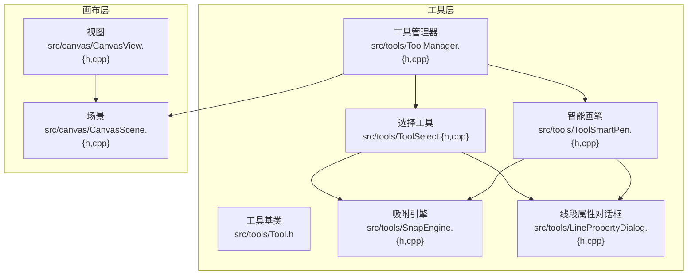
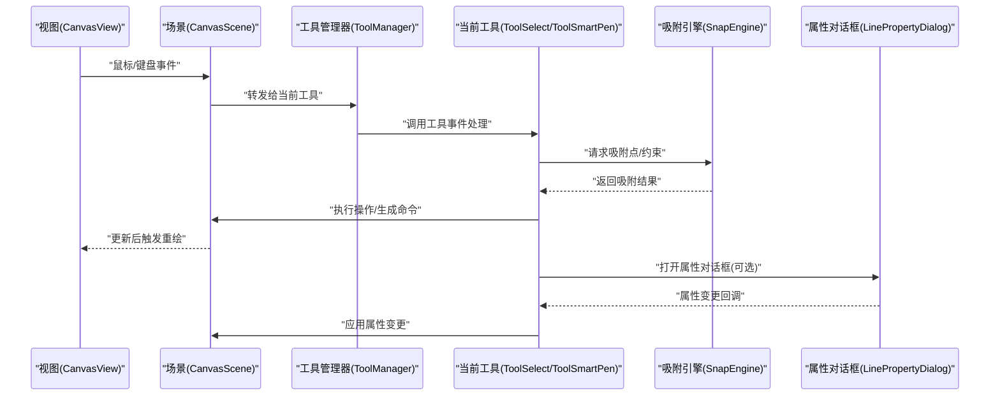
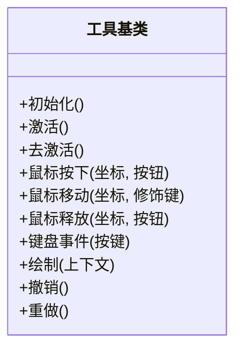
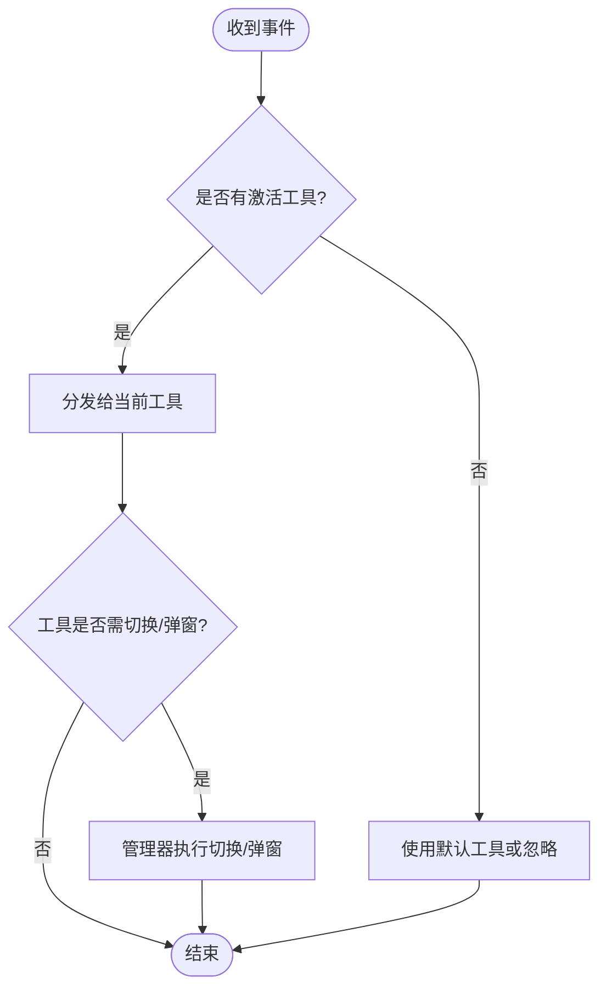
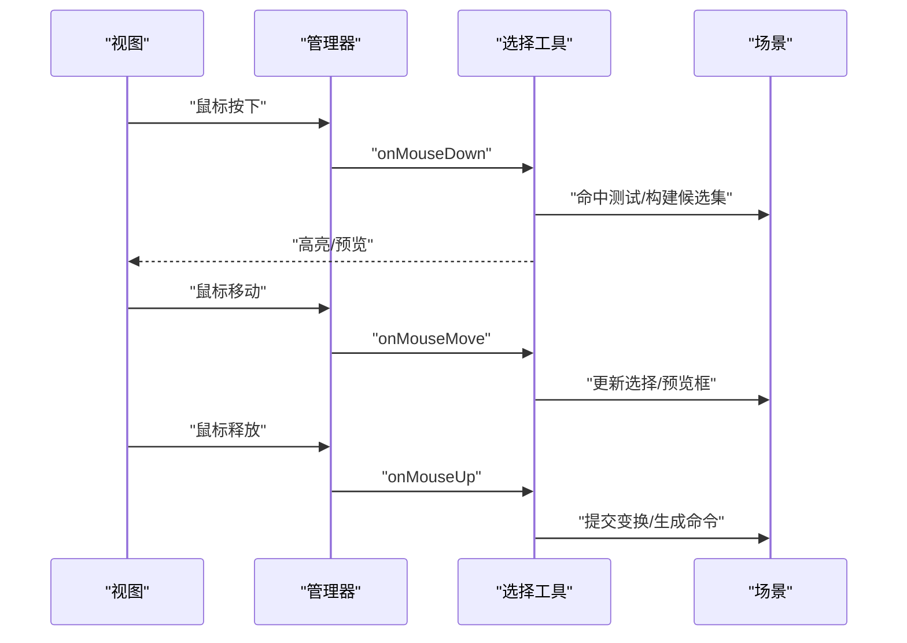
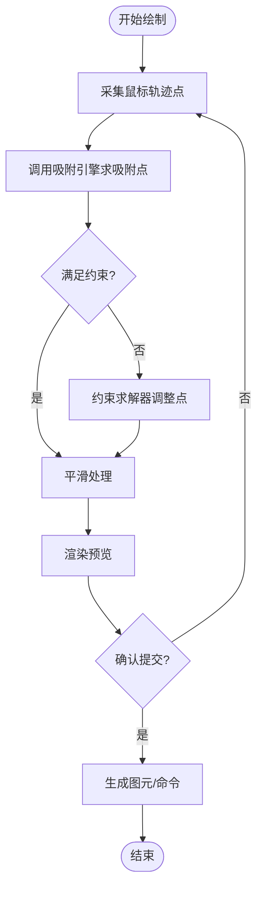
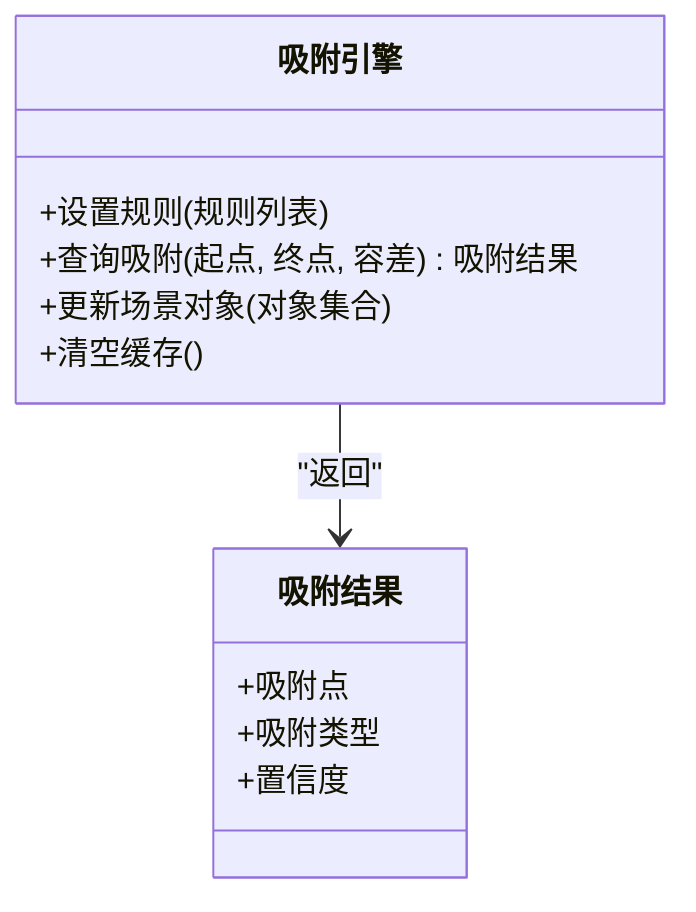
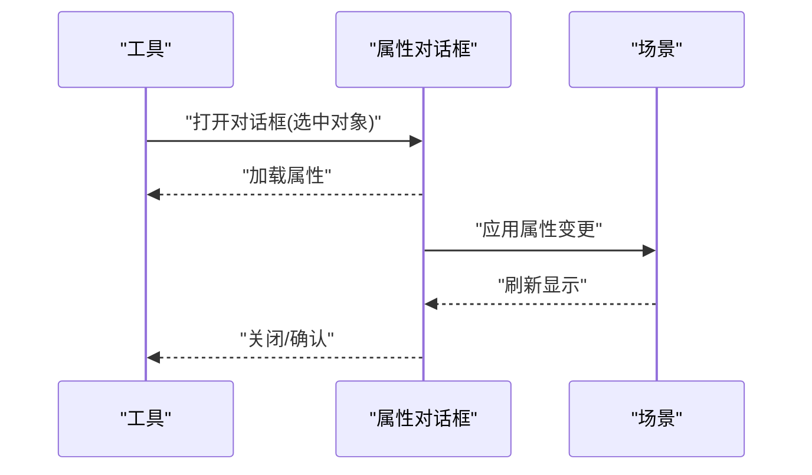
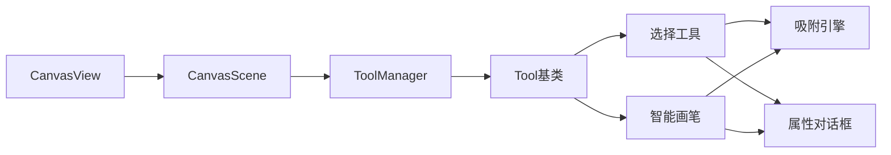

# 工具系统

<cite>
**本文引用的文件**   
- [Tool.h](file://src/tools/Tool.h)
- [ToolManager.cpp](file://src/tools/ToolManager.cpp)
- [ToolManager.h](file://src/tools/ToolManager.h)
- [ToolSelect.cpp](file://src/tools/ToolSelect.cpp)
- [ToolSelect.h](file://src/tools/ToolSelect.h)
- [ToolSmartPen.cpp](file://src/tools/ToolSmartPen.cpp)
- [ToolSmartPen.h](file://src/tools/ToolSmartPen.h)
- [SnapEngine.cpp](file://src/tools/SnapEngine.cpp)
- [SnapEngine.h](file://src/tools/SnapEngine.h)
- [LinePropertyDialog.cpp](file://src/tools/LinePropertyDialog.cpp)
- [LinePropertyDialog.h](file://src/tools/LinePropertyDialog.h)
- [CanvasScene.cpp](file://src/canvas/CanvasScene.cpp)
- [CanvasScene.h](file://src/canvas/CanvasScene.h)
- [CanvasView.cpp](file://src/canvas/CanvasView.cpp)
- [CanvasView.h](file://src/canvas/CanvasView.h)
</cite>

## 目录
1. [简介](#简介)
2. [项目结构](#项目结构)
3. [核心组件](#核心组件)
4. [架构总览](#架构总览)
5. [详细组件分析](#详细组件分析)
6. [依赖关系分析](#依赖关系分析)
7. [性能考量](#性能考量)
8. [故障排查指南](#故障排查指南)
9. [结论](#结论)
10. [附录：扩展开发指南与最佳实践](#附录扩展开发指南与最佳实践)

## 简介
本文件面向“工具系统”的开发者与使用者，系统性阐述工具管理器、选择工具、智能画笔、吸附引擎与属性对话框的实现细节。内容覆盖工具的注册机制、事件处理流程、用户交互路径、工具间协作与状态管理，并提供扩展开发与常见问题的解决方案。文档以代码级分析与可视化图示为主，帮助读者快速理解并高效扩展工具系统。

## 项目结构
工具系统位于 src/tools 目录，围绕“工具基类—工具管理器—具体工具—吸附引擎—属性对话框”分层组织；与画布子系统（CanvasScene/CanvasView）通过事件与数据接口协作。

**图表来源** 
- [Tool.h](file://src/tools/Tool.h)
- [ToolManager.h](file://src/tools/ToolManager.h)
- [ToolManager.cpp](file://src/tools/ToolManager.cpp)
- [ToolSelect.h](file://src/tools/ToolSelect.h)
- [ToolSelect.cpp](file://src/tools/ToolSelect.cpp)
- [ToolSmartPen.h](file://src/tools/ToolSmartPen.h)
- [ToolSmartPen.cpp](file://src/tools/ToolSmartPen.cpp)
- [SnapEngine.h](file://src/tools/SnapEngine.h)
- [SnapEngine.cpp](file://src/tools/SnapEngine.cpp)
- [LinePropertyDialog.h](file://src/tools/LinePropertyDialog.h)
- [LinePropertyDialog.cpp](file://src/tools/LinePropertyDialog.cpp)
- [CanvasScene.h](file://src/canvas/CanvasScene.h)
- [CanvasScene.cpp](file://src/canvas/CanvasScene.cpp)
- [CanvasView.h](file://src/canvas/CanvasView.h)
- [CanvasView.cpp](file://src/canvas/CanvasView.cpp)

**章节来源**
- [ToolManager.h](file://src/tools/ToolManager.h)
- [ToolManager.cpp](file://src/tools/ToolManager.cpp)
- [CanvasScene.h](file://src/canvas/CanvasScene.h)
- [CanvasView.h](file://src/canvas/CanvasView.h)

## 核心组件
- 工具基类：定义工具的统一接口与生命周期钩子，包括鼠标事件、键盘事件、绘制回调、状态切换等。
- 工具管理器：负责工具的注册、激活、去激活、事件分发与全局状态协调。
- 选择工具：实现对象拾取、框选、移动、旋转缩放等选择相关交互。
- 智能画笔：提供曲线绘制、自动平滑、端点吸附、约束对齐等智能绘制能力。
- 吸附引擎：集中计算几何吸附（端点、中点、垂足、切线、网格等），为上层工具提供统一吸附结果。
- 属性对话框：针对特定图元（如线段）的属性编辑与批量修改。

**章节来源**
- [Tool.h](file://src/tools/Tool.h)
- [ToolManager.h](file://src/tools/ToolManager.h)
- [ToolSelect.h](file://src/tools/ToolSelect.h)
- [ToolSmartPen.h](file://src/tools/ToolSmartPen.h)
- [SnapEngine.h](file://src/tools/SnapEngine.h)
- [LinePropertyDialog.h](file://src/tools/LinePropertyDialog.h)

## 架构总览
工具系统与画布子系统通过“事件—命令—重绘”的闭环协作：视图捕获输入，交给当前激活工具处理；工具调用吸附引擎获得精确位置；工具生成命令或修改场景数据；场景通知视图重绘。

**图表来源** 
- [CanvasView.h](file://src/canvas/CanvasView.h)
- [CanvasScene.h](file://src/canvas/CanvasScene.h)
- [ToolManager.h](file://src/tools/ToolManager.h)
- [ToolSelect.h](file://src/tools/ToolSelect.h)
- [ToolSmartPen.h](file://src/tools/ToolSmartPen.h)
- [SnapEngine.h](file://src/tools/SnapEngine.h)
- [LinePropertyDialog.h](file://src/tools/LinePropertyDialog.h)

## 详细组件分析

### 工具基类与生命周期
- 职责：定义统一的输入处理接口（鼠标按下/移动/释放、键盘）、绘制钩子、状态切换钩子、撤销/重做支持。
- 关键点：
  - 事件入口：将原始坐标转换为场景坐标，再交由具体工具处理。
  - 状态机：空闲、拖拽中、编辑中等状态转换由工具内部维护。
  - 撤销/重做：工具产生的可逆操作应封装为命令，便于统一管理。

**图表来源** 
- [Tool.h](file://src/tools/Tool.h)

**章节来源**
- [Tool.h](file://src/tools/Tool.h)

### 工具管理器：注册、激活与事件分发
- 职责：维护工具集合、当前激活工具、工具切换逻辑、全局事件路由。
- 关键点：
  - 注册机制：工具在启动时向管理器注册，管理器建立ID到实例的映射。
  - 激活/去激活：切换工具时，先对旧工具去激活，再对新工具激活，确保状态一致性。
  - 事件分发：视图事件经管理器转发至当前工具；工具可请求管理器切换工具或弹出对话框。

**图表来源** 
- [ToolManager.h](file://src/tools/ToolManager.h)
- [ToolManager.cpp](file://src/tools/ToolManager.cpp)

**章节来源**
- [ToolManager.h](file://src/tools/ToolManager.h)
- [ToolManager.cpp](file://src/tools/ToolManager.cpp)

### 选择工具：拾取、框选与变换
- 职责：实现对象拾取、框选、移动、旋转/缩放等选择相关交互。
- 关键点：
  - 拾取策略：按命中测试顺序（图层、可见性、深度）确定目标对象。
  - 框选算法：矩形区域筛选候选对象，支持部分包含与完全包含模式。
  - 变换流程：记录初始状态，增量更新，支持撤销/重做。

**图表来源** 
- [ToolSelect.h](file://src/tools/ToolSelect.h)
- [ToolSelect.cpp](file://src/tools/ToolSelect.cpp)
- [CanvasScene.h](file://src/canvas/CanvasScene.h)

**章节来源**
- [ToolSelect.h](file://src/tools/ToolSelect.h)
- [ToolSelect.cpp](file://src/tools/ToolSelect.cpp)

### 智能画笔：绘制、吸附与约束
- 职责：提供曲线绘制、自动平滑、端点/边吸附、角度/长度约束等智能绘制能力。
- 关键点：
  - 绘制管线：采样点→吸附→约束求解→平滑→渲染预览。
  - 吸附集成：实时调用吸附引擎获取最近吸附点与方向信息。
  - 约束求解：根据角度、长度、平行/垂直等约束调整控制点。

**图表来源** 
- [ToolSmartPen.h](file://src/tools/ToolSmartPen.h)
- [ToolSmartPen.cpp](file://src/tools/ToolSmartPen.cpp)
- [SnapEngine.h](file://src/tools/SnapEngine.h)
- [SnapEngine.cpp](file://src/tools/SnapEngine.cpp)

**章节来源**
- [ToolSmartPen.h](file://src/tools/ToolSmartPen.h)
- [ToolSmartPen.cpp](file://src/tools/ToolSmartPen.cpp)
- [SnapEngine.h](file://src/tools/SnapEngine.h)
- [SnapEngine.cpp](file://src/tools/SnapEngine.cpp)

### 吸附引擎：几何计算与性能优化
- 职责：集中实现各类吸附规则（端点、中点、垂足、切线、网格、对齐等），对外暴露统一查询接口。
- 关键点：
  - 数据结构：空间索引（如四叉树/网格哈希）加速近邻搜索。
  - 查询接口：给定起点/终点与容差半径，返回最优吸附点及类型。
  - 性能优化：增量更新、缓存最近查询结果、按需启用吸附规则。

**图表来源** 
- [SnapEngine.h](file://src/tools/SnapEngine.h)
- [SnapEngine.cpp](file://src/tools/SnapEngine.cpp)

**章节来源**
- [SnapEngine.h](file://src/tools/SnapEngine.h)
- [SnapEngine.cpp](file://src/tools/SnapEngine.cpp)

### 属性对话框：参数编辑与批量修改
- 职责：为特定图元（如线段）提供属性面板，支持单条与批量修改，变更后即时生效。
- 关键点：
  - 数据绑定：对话框字段与图元属性双向绑定。
  - 批量模式：多选对象时，显示公共属性或范围值。
  - 撤销/重做：属性变更封装为命令，纳入撤销栈。

**图表来源** 
- [LinePropertyDialog.h](file://src/tools/LinePropertyDialog.h)
- [LinePropertyDialog.cpp](file://src/tools/LinePropertyDialog.cpp)
- [CanvasScene.h](file://src/canvas/CanvasScene.h)

**章节来源**
- [LinePropertyDialog.h](file://src/tools/LinePropertyDialog.h)
- [LinePropertyDialog.cpp](file://src/tools/LinePropertyDialog.cpp)

## 依赖关系分析
- 松耦合设计：工具仅依赖抽象的工具基类与吸附引擎接口，不直接耦合具体图元实现。
- 事件驱动：视图→管理器→工具→场景→视图的重绘链路清晰，避免循环依赖。
- 可扩展性：新增工具只需实现基类接口并向管理器注册；新增吸附规则只需扩展吸附引擎。

**图表来源** 
- [CanvasView.h](file://src/canvas/CanvasView.h)
- [CanvasScene.h](file://src/canvas/CanvasScene.h)
- [ToolManager.h](file://src/tools/ToolManager.h)
- [Tool.h](file://src/tools/Tool.h)
- [ToolSelect.h](file://src/tools/ToolSelect.h)
- [ToolSmartPen.h](file://src/tools/ToolSmartPen.h)
- [SnapEngine.h](file://src/tools/SnapEngine.h)
- [LinePropertyDialog.h](file://src/tools/LinePropertyDialog.h)

**章节来源**
- [ToolManager.h](file://src/tools/ToolManager.h)
- [ToolManager.cpp](file://src/tools/ToolManager.cpp)
- [CanvasScene.h](file://src/canvas/CanvasScene.h)
- [CanvasView.h](file://src/canvas/CanvasView.h)

## 性能考量
- 吸附查询优化：
  - 使用空间索引减少近邻搜索复杂度。
  - 合理设置容差半径，避免过多候选。
  - 增量更新吸附索引，仅在对象变化时重建。
- 事件处理优化：
  - 合并高频鼠标移动事件，降低重绘频率。
  - 延迟计算非关键路径（如复杂约束求解）。
- 渲染优化：
  - 区分预览与最终渲染，预览阶段简化样式。
  - 使用脏矩形或增量更新减少重绘区域。

[本节为通用指导，无需引用具体文件]

## 故障排查指南
- 工具未响应事件：
  - 检查管理器是否正确激活当前工具。
  - 确认视图事件已转发至管理器且未被拦截。
- 吸附不准确：
  - 检查吸附规则优先级与容差设置。
  - 验证场景对象的空间索引是否同步更新。
- 属性对话框无效：
  - 确认数据绑定是否正确，字段名称一致。
  - 检查批量模式下是否存在冲突属性。
- 撤销/重做失效：
  - 确认工具生成的命令实现了撤销/重做接口。
  - 检查命令入栈时机与状态一致性。

**章节来源**
- [ToolManager.h](file://src/tools/ToolManager.h)
- [ToolManager.cpp](file://src/tools/ToolManager.cpp)
- [SnapEngine.h](file://src/tools/SnapEngine.h)
- [SnapEngine.cpp](file://src/tools/SnapEngine.cpp)
- [LinePropertyDialog.h](file://src/tools/LinePropertyDialog.h)
- [LinePropertyDialog.cpp](file://src/tools/LinePropertyDialog.cpp)

## 结论
工具系统以清晰的层次与事件驱动架构，实现了可扩展、高性能的交互能力。通过统一的工具基类与吸附引擎，选择工具与智能画笔能够复用核心能力并保持低耦合。属性对话框完善了参数编辑体验。遵循本文档的扩展指南与最佳实践，可快速开发新工具并融入现有生态。

[本节为总结，无需引用具体文件]

## 附录：扩展开发指南与最佳实践
- 开发新工具步骤：
  1. 继承工具基类，实现必要的事件处理与绘制钩子。
  2. 在工具管理器中注册新工具，分配唯一ID。
  3. 如需吸附，调用吸附引擎接口；如需属性编辑，集成属性对话框。
  4. 将可逆操作封装为命令，支持撤销/重做。
- 事件处理建议：
  - 明确状态机，避免状态不一致导致的异常行为。
  - 合理使用修饰键（Shift/Ctrl/Alt）扩展功能。
- 吸附规则扩展：
  - 新增规则实现统一接口，并在引擎中注册。
  - 为规则配置优先级与容差，避免冲突。
- 性能最佳实践：
  - 避免在高频事件中执行耗时计算。
  - 使用增量更新与缓存机制。
- 常见问题与解决：
  - 多工具冲突：通过管理器统一调度，必要时限制并发。
  - 内存泄漏：确保工具销毁时清理资源与订阅。
  - 跨线程问题：UI事件应在主线程处理，后台计算异步进行。

[本节为通用指导，无需引用具体文件]