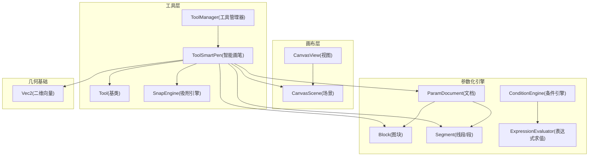
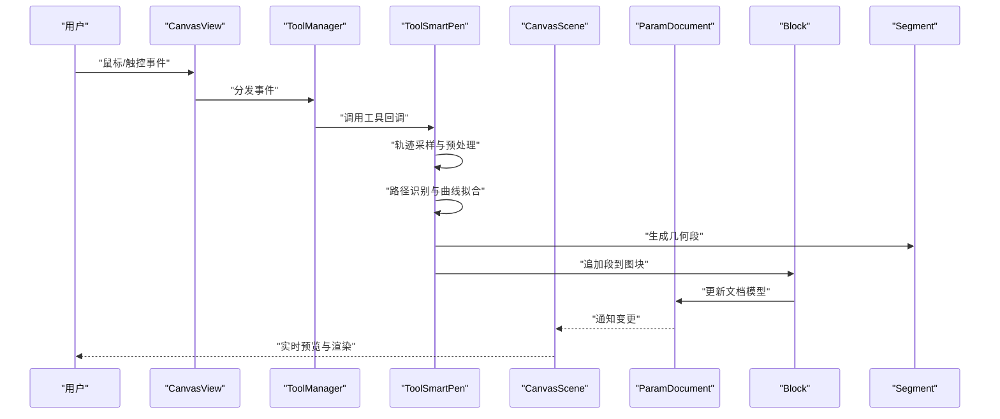
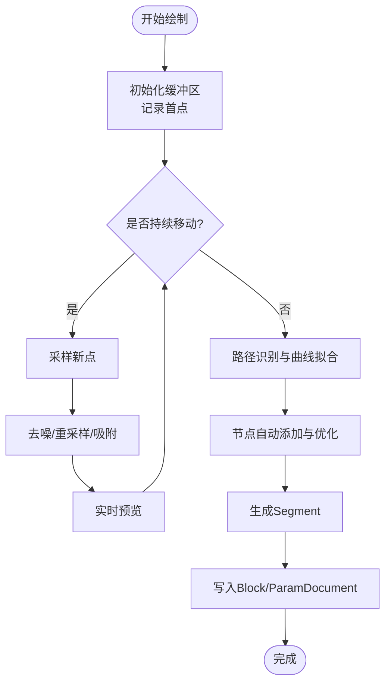
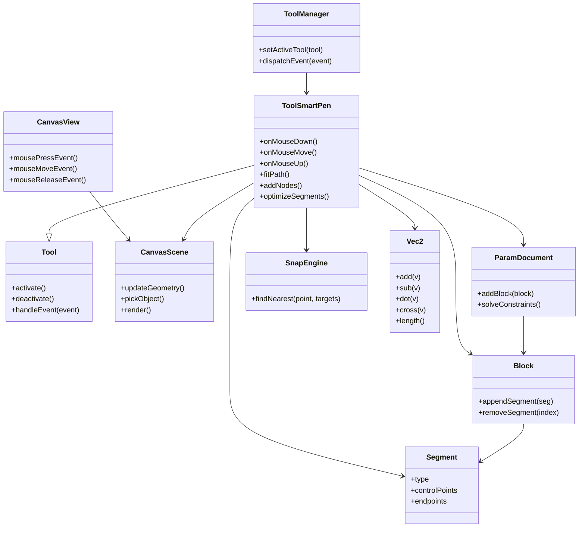

# 智能画笔工具

<cite>
**本文引用的文件**   
- [ToolSmartPen.h](file://src/tools/ToolSmartPen.h)
- [ToolSmartPen.cpp](file://src/tools/ToolSmartPen.cpp)
- [ToolManager.h](file://src/tools/ToolManager.h)
- [ToolManager.cpp](file://src/tools/ToolManager.cpp)
- [Tool.h](file://src/tools/Tool.h)
- [CanvasScene.h](file://src/canvas/CanvasScene.h)
- [CanvasScene.cpp](file://src/canvas/CanvasScene.cpp)
- [CanvasView.h](file://src/canvas/CanvasView.h)
- [CanvasView.cpp](file://src/canvas/CanvasView.cpp)
- [Block.h](file://src/parametric/Block.h)
- [ParamDocument.h](file://src/parametric/ParamDocument.h)
- [Segment.h](file://src/parametric/Segment.h)
- [ConditionEngine.h](file://src/parametric/ConditionEngine.h)
- [ExpressionEvaluator.h](file://src/parametric/ExpressionEvaluator.h)
- [SnapEngine.h](file://src/tools/SnapEngine.h)
- [Vec2.h](file://src/geometry/Vec2.h)
</cite>

## 目录
1. [简介](#简介)
2. [项目结构](#项目结构)
3. [核心组件](#核心组件)
4. [架构总览](#架构总览)
5. [详细组件分析](#详细组件分析)
6. [依赖关系分析](#依赖关系分析)
7. [性能考量](#性能考量)
8. [故障排查指南](#故障排查指南)
9. [结论](#结论)
10. [附录](#附录)

## 简介
本文件面向“智能画笔工具”的实现与使用，系统性阐述其核心算法（路径识别、曲线拟合、节点自动添加与优化）、用户交互流程（绘制手势识别、实时预览、编辑能力），以及与参数化引擎的集成方式（将手绘路径转换为可编辑几何数据）。同时给出性能优化建议与常见问题排查方法，帮助开发者快速理解并扩展该功能。

## 项目结构
智能画笔相关代码主要分布在以下模块：
- 工具层：ToolSmartPen（智能画笔实现）、ToolManager（工具调度）、Tool（工具基类）
- 画布层：CanvasScene（场景管理）、CanvasView（视图与事件处理）
- 参数化引擎：ParamDocument、Block、Segment、ConditionEngine、ExpressionEvaluator
- 几何基础：Vec2（二维向量）
- 吸附辅助：SnapEngine（用于对齐与吸附）

图表来源
- [ToolSmartPen.h](file://src/tools/ToolSmartPen.h)
- [ToolManager.h](file://src/tools/ToolManager.h)
- [CanvasScene.h](file://src/canvas/CanvasScene.h)
- [CanvasView.h](file://src/canvas/CanvasView.h)
- [Block.h](file://src/parametric/Block.h)
- [ParamDocument.h](file://src/parametric/ParamDocument.h)
- [Segment.h](file://src/parametric/Segment.h)
- [ConditionEngine.h](file://src/parametric/ConditionEngine.h)
- [ExpressionEvaluator.h](file://src/parametric/ExpressionEvaluator.h)
- [SnapEngine.h](file://src/tools/SnapEngine.h)
- [Vec2.h](file://src/geometry/Vec2.h)

章节来源
- [ToolSmartPen.h](file://src/tools/ToolSmartPen.h)
- [ToolManager.h](file://src/tools/ToolManager.h)
- [CanvasScene.h](file://src/canvas/CanvasScene.h)
- [CanvasView.h](file://src/canvas/CanvasView.h)
- [Block.h](file://src/parametric/Block.h)
- [ParamDocument.h](file://src/parametric/ParamDocument.h)
- [Segment.h](file://src/parametric/Segment.h)
- [ConditionEngine.h](file://src/parametric/ConditionEngine.h)
- [ExpressionEvaluator.h](file://src/parametric/ExpressionEvaluator.h)
- [SnapEngine.h](file://src/tools/SnapEngine.h)
- [Vec2.h](file://src/geometry/Vec2.h)

## 核心组件
- 智能画笔（ToolSmartPen）
  - 负责接收鼠标/触控输入，进行手势识别与采样，执行路径平滑与曲线拟合，生成贝塞尔或折线片段，维护节点集合，提供编辑接口（增删改点、调整曲率等）。
  - 与参数化引擎协作，将生成的几何段（Segment）写入 Block，并通过 ParamDocument 统一管理。
- 工具管理器（ToolManager）
  - 负责工具的创建、激活、切换与生命周期管理，确保同一时间仅有一个活跃工具。
- 画布场景（CanvasScene）
  - 管理图形对象、渲染与选择状态，为工具提供坐标变换、拾取与更新接口。
- 视图（CanvasView）
  - 捕获用户输入事件（按下、移动、释放），转发给当前激活的工具。
- 参数化引擎（ParamDocument/Block/Segment）
  - 提供可编辑的几何数据结构与约束求解能力，支持表达式驱动的尺寸与形状变化。
- 吸附引擎（SnapEngine）
  - 在绘制过程中提供网格、端点、中点等吸附能力，提升绘制精度。
- 几何基础（Vec2）
  - 提供二维点与向量的基本运算，支撑距离、角度、投影等计算。

章节来源
- [ToolSmartPen.h](file://src/tools/ToolSmartPen.h)
- [ToolSmartPen.cpp](file://src/tools/ToolSmartPen.cpp)
- [ToolManager.h](file://src/tools/ToolManager.h)
- [ToolManager.cpp](file://src/tools/ToolManager.cpp)
- [CanvasScene.h](file://src/canvas/CanvasScene.h)
- [CanvasScene.cpp](file://src/canvas/CanvasScene.cpp)
- [CanvasView.h](file://src/canvas/CanvasView.h)
- [CanvasView.cpp](file://src/canvas/CanvasView.cpp)
- [ParamDocument.h](file://src/parametric/ParamDocument.h)
- [Block.h](file://src/parametric/Block.h)
- [Segment.h](file://src/parametric/Segment.h)
- [SnapEngine.h](file://src/tools/SnapEngine.h)
- [Vec2.h](file://src/geometry/Vec2.h)

## 架构总览
智能画笔的整体数据流如下：
- 用户在 CanvasView 上产生输入事件；
- ToolManager 将事件路由到当前激活的 ToolSmartPen；
- ToolSmartPen 对原始轨迹进行预处理（去噪、重采样、吸附），随后进行路径识别与曲线拟合；
- 拟合结果被封装为 Segment，并写入 Block，由 ParamDocument 管理；
- CanvasScene 根据最新数据进行渲染与交互反馈（实时预览、选中态、编辑手柄等）。

图表来源
- [CanvasView.h](file://src/canvas/CanvasView.h)
- [ToolManager.h](file://src/tools/ToolManager.h)
- [ToolSmartPen.h](file://src/tools/ToolSmartPen.h)
- [CanvasScene.h](file://src/canvas/CanvasScene.h)
- [ParamDocument.h](file://src/parametric/ParamDocument.h)
- [Block.h](file://src/parametric/Block.h)
- [Segment.h](file://src/parametric/Segment.h)

## 详细组件分析

### 智能画笔（ToolSmartPen）
- 职责
  - 输入采集与手势识别：区分直线、圆弧、自由曲线等；
  - 轨迹预处理：去噪、重采样、自适应抽稀；
  - 曲线拟合：基于最小二乘或样条拟合，输出贝塞尔控制点；
  - 节点管理：自动添加关键节点，支持手动增删改；
  - 与参数化引擎集成：生成 Segment，写入 Block，触发约束求解。
- 关键流程
  - 绘制开始：初始化缓冲区，记录首点；
  - 绘制中：增量采样，应用吸附与平滑，实时更新预览；
  - 绘制结束：执行路径识别与拟合，生成最终几何，提交到文档。
- 编辑能力
  - 拖拽节点调整位置；
  - 调整控制柄改变曲率；
  - 插入新节点、删除冗余节点；
  - 撤销/重做（通过命令模式或文档历史）。

图表来源
- [ToolSmartPen.h](file://src/tools/ToolSmartPen.h)
- [ToolSmartPen.cpp](file://src/tools/ToolSmartPen.cpp)
- [SnapEngine.h](file://src/tools/SnapEngine.h)
- [ParamDocument.h](file://src/parametric/ParamDocument.h)
- [Block.h](file://src/parametric/Block.h)
- [Segment.h](file://src/parametric/Segment.h)

章节来源
- [ToolSmartPen.h](file://src/tools/ToolSmartPen.h)
- [ToolSmartPen.cpp](file://src/tools/ToolSmartPen.cpp)

### 工具管理器（ToolManager）
- 职责
  - 工具注册与实例化；
  - 激活/切换工具；
  - 事件分发与生命周期管理。
- 设计要点
  - 单一活跃工具原则，避免冲突；
  - 工具间解耦，通过统一接口通信；
  - 支持工具状态持久化（如最近使用的参数）。

章节来源
- [ToolManager.h](file://src/tools/ToolManager.h)
- [ToolManager.cpp](file://src/tools/ToolManager.cpp)
- [Tool.h](file://src/tools/Tool.h)

### 画布场景（CanvasScene）与视图（CanvasView）
- CanvasView
  - 捕获用户输入事件，转换屏幕坐标到场景坐标；
  - 将事件分发给当前工具。
- CanvasScene
  - 管理图形对象的显示与选择；
  - 提供拾取、更新、渲染接口；
  - 响应文档变更，刷新视图。

章节来源
- [CanvasView.h](file://src/canvas/CanvasView.h)
- [CanvasView.cpp](file://src/canvas/CanvasView.cpp)
- [CanvasScene.h](file://src/canvas/CanvasScene.h)
- [CanvasScene.cpp](file://src/canvas/CanvasScene.cpp)

### 参数化引擎（ParamDocument/Block/Segment）
- ParamDocument
  - 管理多个 Block 与变量、约束；
  - 提供一致性检查与求解入口。
- Block
  - 包含若干 Segment 与几何实体；
  - 支持按组组织与批量操作。
- Segment
  - 表示一段几何（直线、圆弧、贝塞尔等）；
  - 暴露控制点与端点，便于编辑与约束。

章节来源
- [ParamDocument.h](file://src/parametric/ParamDocument.h)
- [Block.h](file://src/parametric/Block.h)
- [Segment.h](file://src/parametric/Segment.h)

### 吸附引擎（SnapEngine）
- 职责
  - 提供网格、端点、中点、切点等吸附目标；
  - 在绘制过程中实时计算最近吸附点，提升精度。
- 集成点
  - 在 ToolSmartPen 的预处理阶段调用，替换或修正采样点。

章节来源
- [SnapEngine.h](file://src/tools/SnapEngine.h)

### 几何基础（Vec2）
- 职责
  - 二维点与向量的加减、点积、叉积、长度、归一化等；
  - 距离与角度计算，支撑拟合与优化算法。

章节来源
- [Vec2.h](file://src/geometry/Vec2.h)

## 依赖关系分析
- ToolSmartPen 依赖 CanvasScene（渲染与拾取）、ParamDocument/Block/Segment（几何建模）、SnapEngine（吸附）、Vec2（几何计算）。
- ToolManager 依赖 Tool 基类与具体工具（ToolSmartPen）。
- CanvasView 依赖 CanvasScene 进行坐标转换与事件分发。
- 参数化引擎内部：ParamDocument 聚合 Block，Block 包含 Segment；ConditionEngine 与 ExpressionEvaluator 提供约束与表达式求解。

图表来源
- [Tool.h](file://src/tools/Tool.h)
- [ToolSmartPen.h](file://src/tools/ToolSmartPen.h)
- [ToolManager.h](file://src/tools/ToolManager.h)
- [CanvasView.h](file://src/canvas/CanvasView.h)
- [CanvasScene.h](file://src/canvas/CanvasScene.h)
- [ParamDocument.h](file://src/parametric/ParamDocument.h)
- [Block.h](file://src/parametric/Block.h)
- [Segment.h](file://src/parametric/Segment.h)
- [SnapEngine.h](file://src/tools/SnapEngine.h)
- [Vec2.h](file://src/geometry/Vec2.h)

章节来源
- [Tool.h](file://src/tools/Tool.h)
- [ToolSmartPen.h](file://src/tools/ToolSmartPen.h)
- [ToolManager.h](file://src/tools/ToolManager.h)
- [CanvasView.h](file://src/canvas/CanvasView.h)
- [CanvasScene.h](file://src/canvas/CanvasScene.h)
- [ParamDocument.h](file://src/parametric/ParamDocument.h)
- [Block.h](file://src/parametric/Block.h)
- [Segment.h](file://src/parametric/Segment.h)
- [SnapEngine.h](file://src/tools/SnapEngine.h)
- [Vec2.h](file://src/geometry/Vec2.h)

## 性能考量
- 绘制精度与响应速度
  - 自适应重采样：根据曲率与速度动态调整采样密度，减少冗余点；
  - 增量拟合：仅在新增点超过阈值时局部重拟合，降低计算开销；
  - 吸附预计算：缓存常用吸附目标，加速最近点查找。
- 内存管理
  - 环形缓冲区存储原始轨迹，限制最大长度；
  - 分段存储 Segment，按需加载与销毁；
  - 避免频繁分配，复用临时对象。
- 渲染优化
  - 只重绘受影响区域（脏矩形）；
  - 使用 GPU 加速绘制贝塞尔曲线（若可用）。
- 约束求解
  - 延迟求解：仅在必要时机触发；
  - 增量更新：局部重新计算受影响的变量与段。

[本节为通用指导，不直接分析具体文件]

## 故障排查指南
- 绘制抖动或断点
  - 检查去噪与重采样参数；
  - 确认吸附引擎配置是否正确；
  - 查看轨迹采样频率是否过低。
- 拟合失败或节点异常
  - 验证输入点数量与分布；
  - 检查曲率阈值与容差设置；
  - 调试 Segment 生成逻辑与控制点范围。
- 与参数化引擎集成问题
  - 确认 Segment 类型与属性完整；
  - 检查 Block 与 ParamDocument 的更新顺序；
  - 查看约束求解日志与错误码。
- 性能问题
  - 监控内存占用与峰值；
  - 分析 CPU 热点（拟合、吸附、渲染）；
  - 评估重绘频率与区域大小。

章节来源
- [ToolSmartPen.cpp](file://src/tools/ToolSmartPen.cpp)
- [SnapEngine.h](file://src/tools/SnapEngine.h)
- [ParamDocument.h](file://src/parametric/ParamDocument.h)
- [Block.h](file://src/parametric/Block.h)
- [Segment.h](file://src/parametric/Segment.h)

## 结论
智能画笔工具通过输入采集、轨迹预处理、路径识别与曲线拟合，将手绘轨迹高效转化为可编辑的几何数据，并与参数化引擎无缝集成。合理的性能策略与完善的故障排查手段，能够保障绘制体验的流畅性与稳定性。建议在后续迭代中持续优化拟合算法与渲染管线，进一步提升精度与响应速度。

[本节为总结性内容，不直接分析具体文件]

## 附录
- 术语表
  - 路径识别：从离散点序列推断几何意图（直线、圆弧、曲线）；
  - 曲线拟合：用数学曲线（如贝塞尔）逼近原始轨迹；
  - 节点优化：自动增删关键点以平衡精度与复杂度；
  - 参数化引擎：基于变量与约束的几何建模系统。
- 参考实现路径
  - 智能画笔主逻辑：[ToolSmartPen.h](file://src/tools/ToolSmartPen.h)、[ToolSmartPen.cpp](file://src/tools/ToolSmartPen.cpp)
  - 工具调度：[ToolManager.h](file://src/tools/ToolManager.h)、[ToolManager.cpp](file://src/tools/ToolManager.cpp)
  - 画布交互：[CanvasView.h](file://src/canvas/CanvasView.h)、[CanvasView.cpp](file://src/canvas/CanvasView.cpp)、[CanvasScene.h](file://src/canvas/CanvasScene.h)、[CanvasScene.cpp](file://src/canvas/CanvasScene.cpp)
  - 参数化建模：[ParamDocument.h](file://src/parametric/ParamDocument.h)、[Block.h](file://src/parametric/Block.h)、[Segment.h](file://src/parametric/Segment.h)
  - 吸附与几何：[SnapEngine.h](file://src/tools/SnapEngine.h)、[Vec2.h](file://src/geometry/Vec2.h)

[本节为补充信息，不直接分析具体文件]