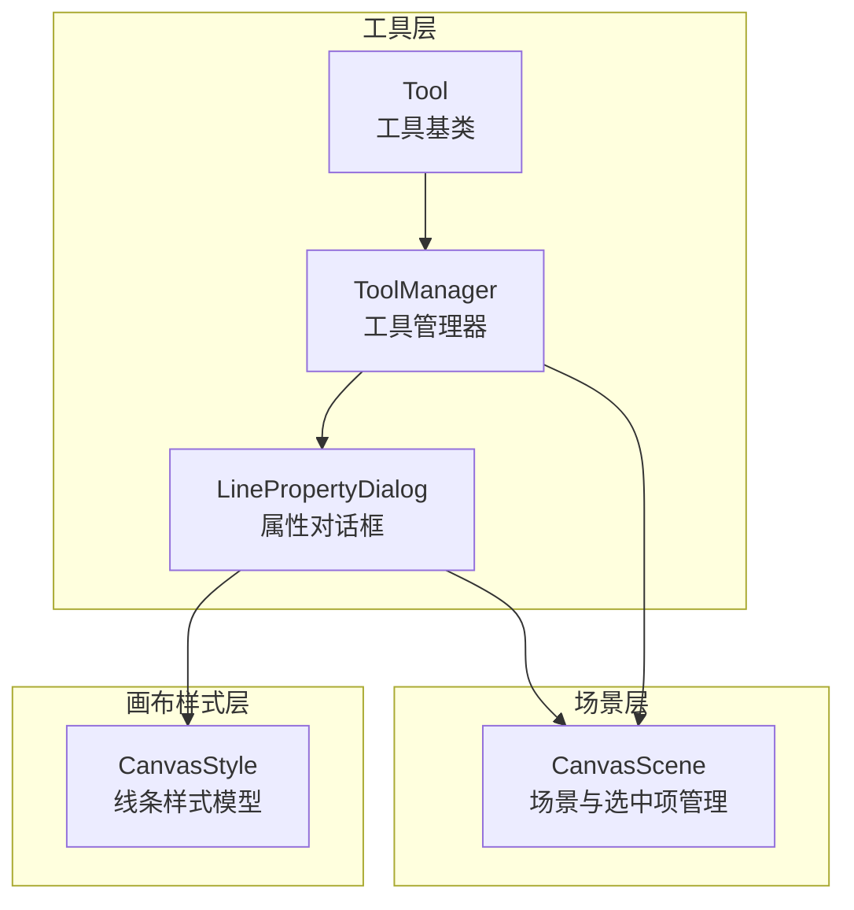
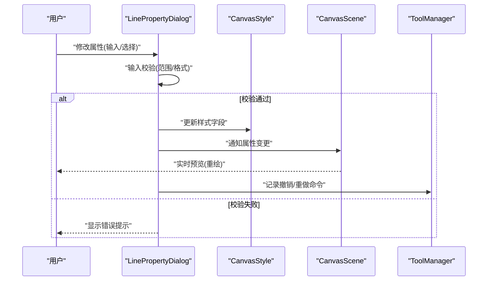
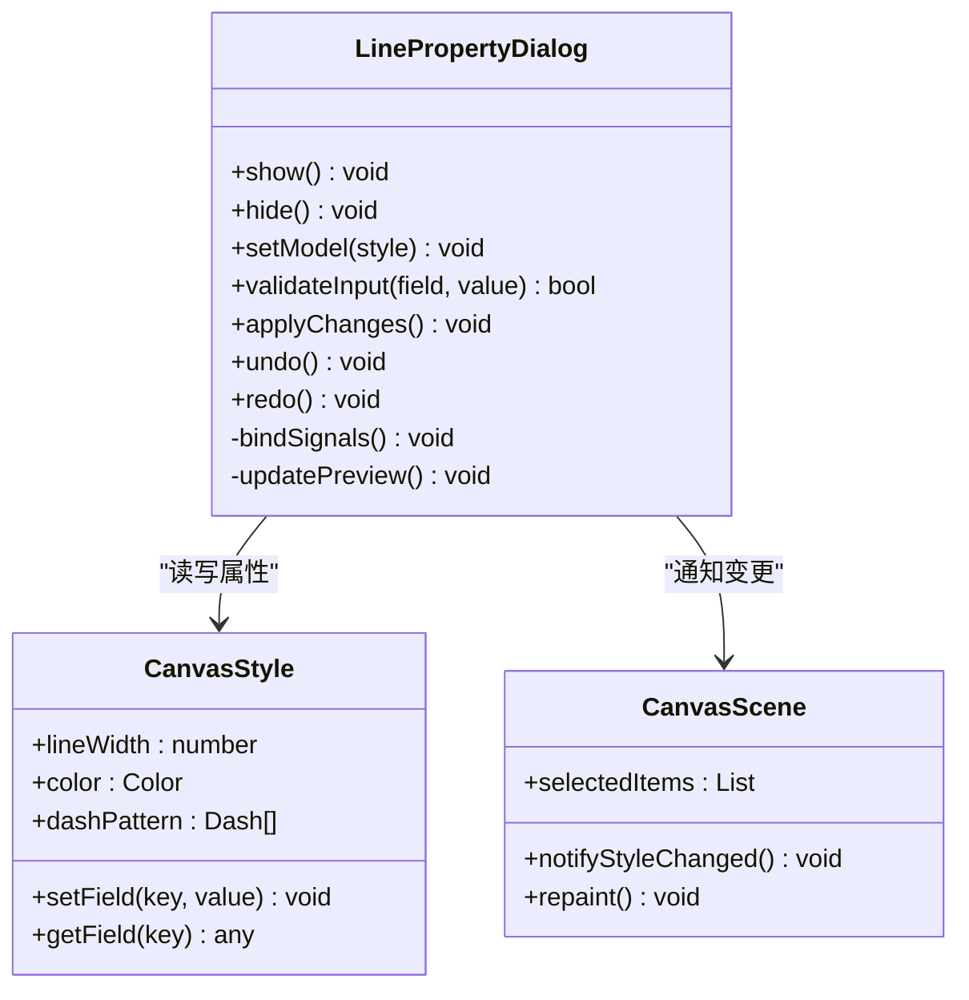
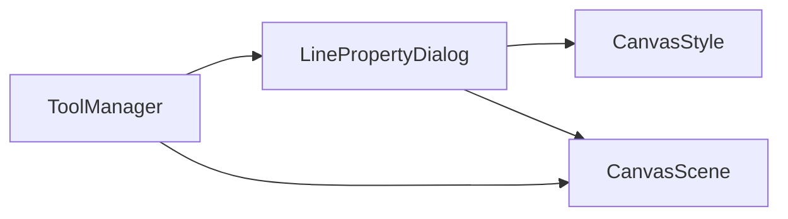
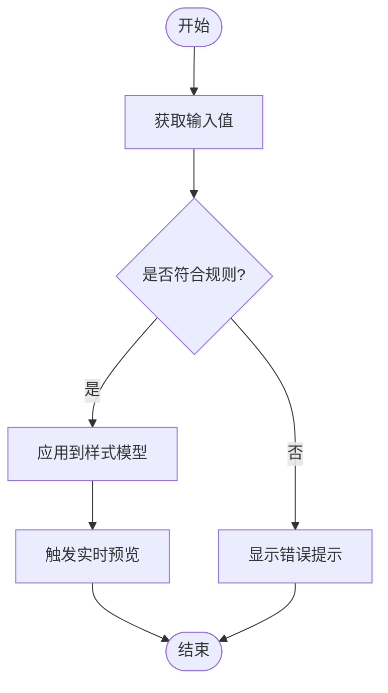

# 线条属性对话框

<cite>
**本文引用的文件**   
- [LinePropertyDialog.h](file://src/tools/LinePropertyDialog.h)
- [LinePropertyDialog.cpp](file://src/tools/LinePropertyDialog.cpp)
- [ToolManager.h](file://src/tools/ToolManager.h)
- [ToolManager.cpp](file://src/tools/ToolManager.cpp)
- [CanvasStyle.h](file://src/canvas/CanvasStyle.h)
- [CanvasStyle.cpp](file://src/canvas/CanvasStyle.cpp)
- [CanvasScene.h](file://src/canvas/CanvasScene.h)
- [CanvasScene.cpp](file://src/canvas/CanvasScene.cpp)
- [Tool.h](file://src/tools/Tool.h)
</cite>

## 目录
1. [简介](#简介)
2. [项目结构](#项目结构)
3. [核心组件](#核心组件)
4. [架构总览](#架构总览)
5. [详细组件分析](#详细组件分析)
6. [依赖关系分析](#依赖关系分析)
7. [性能考虑](#性能考虑)
8. [故障排查指南](#故障排查指南)
9. [结论](#结论)
10. [附录](#附录)

## 简介
本文件为“线条属性对话框”的完整技术文档，面向开发者与使用者，系统阐述该对话框的UI设计、交互逻辑、数据绑定、实时预览、输入验证、撤销重做机制、多语言支持与界面适配策略。同时提供扩展新线条属性与自定义验证规则的具体方法，并说明与工具系统的集成方式及事件处理流程。

## 项目结构
围绕线条属性对话框的相关代码主要分布在以下模块：
- 工具层：对话框实现与工具管理器
- 画布样式层：线条样式数据模型
- 场景层：选中对象管理与渲染更新
- 通用工具接口：工具基类定义

图表来源
- [LinePropertyDialog.h](file://src/tools/LinePropertyDialog.h)
- [LinePropertyDialog.cpp](file://src/tools/LinePropertyDialog.cpp)
- [ToolManager.h](file://src/tools/ToolManager.h)
- [ToolManager.cpp](file://src/tools/ToolManager.cpp)
- [CanvasStyle.h](file://src/canvas/CanvasStyle.h)
- [CanvasScene.h](file://src/canvas/CanvasScene.h)
- [Tool.h](file://src/tools/Tool.h)

章节来源
- [LinePropertyDialog.h](file://src/tools/LinePropertyDialog.h)
- [LinePropertyDialog.cpp](file://src/tools/LinePropertyDialog.cpp)
- [ToolManager.h](file://src/tools/ToolManager.h)
- [ToolManager.cpp](file://src/tools/ToolManager.cpp)
- [CanvasStyle.h](file://src/canvas/CanvasStyle.h)
- [CanvasScene.h](file://src/canvas/CanvasScene.h)
- [Tool.h](file://src/tools/Tool.h)

## 核心组件
- 线条属性对话框（LinePropertyDialog）
  - 负责展示和编辑线条相关属性（如线宽、颜色、虚线样式等），并提供输入校验与实时预览。
  - 通过信号槽或回调与场景/样式进行双向数据绑定。
- 画布样式（CanvasStyle）
  - 封装线条的视觉属性，作为对话框与渲染之间的数据契约。
- 场景（CanvasScene）
  - 维护当前选中的线条对象，响应属性变更并触发重绘。
- 工具管理器（ToolManager）
  - 管理工具生命周期与激活状态，协调对话框与工具行为。

章节来源
- [LinePropertyDialog.h](file://src/tools/LinePropertyDialog.h)
- [LinePropertyDialog.cpp](file://src/tools/LinePropertyDialog.cpp)
- [CanvasStyle.h](file://src/canvas/CanvasStyle.h)
- [CanvasScene.h](file://src/canvas/CanvasScene.h)
- [ToolManager.h](file://src/tools/ToolManager.h)

## 架构总览
下图展示了从用户操作到渲染更新的端到端流程，包括属性输入、验证、预览、数据同步与撤销重做。

图表来源
- [LinePropertyDialog.cpp](file://src/tools/LinePropertyDialog.cpp)
- [CanvasStyle.h](file://src/canvas/CanvasStyle.h)
- [CanvasScene.h](file://src/canvas/CanvasScene.h)
- [ToolManager.h](file://src/tools/ToolManager.h)

## 详细组件分析

### 线条属性对话框（LinePropertyDialog）
- UI设计要点
  - 分组布局：将线宽、颜色、虚线等属性按语义分组，提升可读性。
  - 控件类型：数值输入框、颜色选择器、下拉列表、复选框等。
  - 即时反馈：输入时即进行校验并给出提示，避免无效提交。
- 交互逻辑
  - 输入验证：对数值范围、单位、格式进行校验；非法输入阻止更新。
  - 实时预览：通过样式对象与场景联动，立即反映在画布上。
  - 数据绑定：使用双向绑定或信号槽机制，确保UI与模型一致。
- 撤销重做
  - 每次有效属性变更生成一个命令对象，推入撤销栈。
  - 支持批量撤销（如一次打开对话框的所有变更）。
- 多语言与适配
  - 文本资源通过国际化框架加载，支持运行时切换语言。
  - 布局采用弹性容器，适配不同分辨率与缩放比例。

图表来源
- [LinePropertyDialog.h](file://src/tools/LinePropertyDialog.h)
- [LinePropertyDialog.cpp](file://src/tools/LinePropertyDialog.cpp)
- [CanvasStyle.h](file://src/canvas/CanvasStyle.h)
- [CanvasScene.h](file://src/canvas/CanvasScene.h)

章节来源
- [LinePropertyDialog.h](file://src/tools/LinePropertyDialog.h)
- [LinePropertyDialog.cpp](file://src/tools/LinePropertyDialog.cpp)
- [CanvasStyle.h](file://src/canvas/CanvasStyle.h)
- [CanvasScene.h](file://src/canvas/CanvasScene.h)

### 画布样式（CanvasStyle）
- 数据结构
  - 包含线条宽度、颜色、虚线模式等字段，提供统一的get/set接口。
- 复杂度与性能
  - 字段访问为O(1)，适合高频更新。
  - 建议在批量更新时使用事务式接口减少重绘次数。
- 扩展点
  - 新增属性需同步更新UI映射与验证规则。

章节来源
- [CanvasStyle.h](file://src/canvas/CanvasStyle.h)
- [CanvasStyle.cpp](file://src/canvas/CanvasStyle.cpp)

### 场景（CanvasScene）
- 职责
  - 管理选中对象集合，监听样式变更并触发重绘。
- 事件流
  - 接收来自对话框的变更通知，更新对应对象的样式缓存，然后调用重绘。
- 撤销重做协作
  - 与工具管理器协作，将样式变更包装为可撤销命令。

章节来源
- [CanvasScene.h](file://src/canvas/CanvasScene.h)
- [CanvasScene.cpp](file://src/canvas/CanvasScene.cpp)

### 工具管理器（ToolManager）
- 职责
  - 管理工具实例与激活状态，协调对话框的显示与隐藏。
- 与对话框集成
  - 当激活“线条属性”工具时，创建或复用对话框实例，并注入当前选中对象。
- 撤销重做
  - 统一注册撤销/重做命令，保证跨工具的撤销一致性。

章节来源
- [ToolManager.h](file://src/tools/ToolManager.h)
- [ToolManager.cpp](file://src/tools/ToolManager.cpp)
- [Tool.h](file://src/tools/Tool.h)

## 依赖关系分析
- 耦合度
  - 对话框与样式、场景存在直接依赖，但通过接口隔离，保持良好内聚。
- 外部依赖
  - 国际化库用于多语言文本；UI框架用于控件与布局。
- 潜在循环依赖
  - 对话框不应反向依赖场景的绘制细节，仅通过通知接口解耦。

图表来源
- [LinePropertyDialog.h](file://src/tools/LinePropertyDialog.h)
- [CanvasStyle.h](file://src/canvas/CanvasStyle.h)
- [CanvasScene.h](file://src/canvas/CanvasScene.h)
- [ToolManager.h](file://src/tools/ToolManager.h)

章节来源
- [LinePropertyDialog.h](file://src/tools/LinePropertyDialog.h)
- [CanvasStyle.h](file://src/canvas/CanvasStyle.h)
- [CanvasScene.h](file://src/canvas/CanvasScene.h)
- [ToolManager.h](file://src/tools/ToolManager.h)

## 性能考虑
- 防抖与节流
  - 对频繁输入（如拖动滑块）进行防抖，降低重绘频率。
- 批量更新
  - 使用样式的事务接口一次性应用多个字段变更，减少中间状态。
- 增量重绘
  - 仅在选中对象范围内重绘，避免全量刷新。
- 内存与对象池
  - 对话框实例可复用，避免频繁创建销毁。

[本节为通用指导，不直接分析具体文件]

## 故障排查指南
- 常见问题
  - 输入未生效：检查输入校验逻辑与样式字段映射是否正确。
  - 预览延迟：确认是否启用了防抖或批量更新。
  - 撤销失效：核对命令是否被正确压栈与执行。
- 调试建议
  - 打印关键信号与事件流，定位断点位置。
  - 使用单元测试覆盖验证规则与边界条件。

章节来源
- [LinePropertyDialog.cpp](file://src/tools/LinePropertyDialog.cpp)
- [ToolManager.cpp](file://src/tools/ToolManager.cpp)

## 结论
线条属性对话框通过清晰的UI分层、严格的输入验证、实时的数据绑定与预览、以及完善的撤销重做机制，提供了稳定高效的线条属性编辑体验。借助工具管理器与场景的协作，实现了与整体工具链的无缝集成。未来可扩展更多线条属性与验证规则，并保持向后兼容与良好的性能表现。

[本节为总结性内容，不直接分析具体文件]

## 附录

### 扩展新线条属性的步骤
- 在样式模型中新增字段与访问方法。
- 在对话框中添加对应控件，并建立数据绑定。
- 编写输入验证规则，确保数据合法性。
- 在场景重绘路径中确保新字段参与渲染。
- 为撤销重做添加相应命令实现。

章节来源
- [CanvasStyle.h](file://src/canvas/CanvasStyle.h)
- [LinePropertyDialog.h](file://src/tools/LinePropertyDialog.h)
- [LinePropertyDialog.cpp](file://src/tools/LinePropertyDialog.cpp)
- [CanvasScene.h](file://src/canvas/CanvasScene.h)

### 自定义验证规则示例（概念流程）

[本图为概念流程图，不直接映射具体源码文件]

### 多语言支持与界面适配要点
- 文本资源集中管理，使用键值对替换UI字符串。
- 动态切换语言时刷新所有标签与提示。
- 使用自适应布局与字体缩放，适配不同屏幕密度。

[本节为通用指导，不直接分析具体文件]