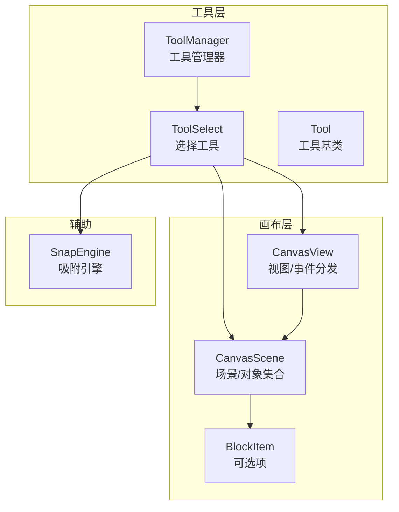
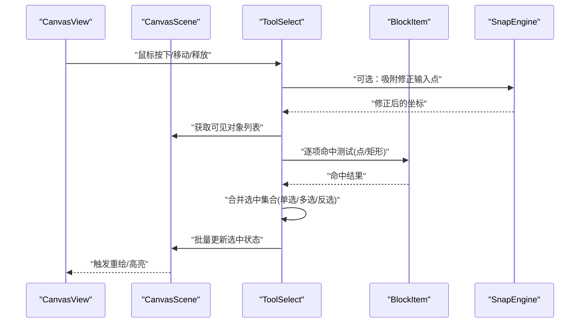
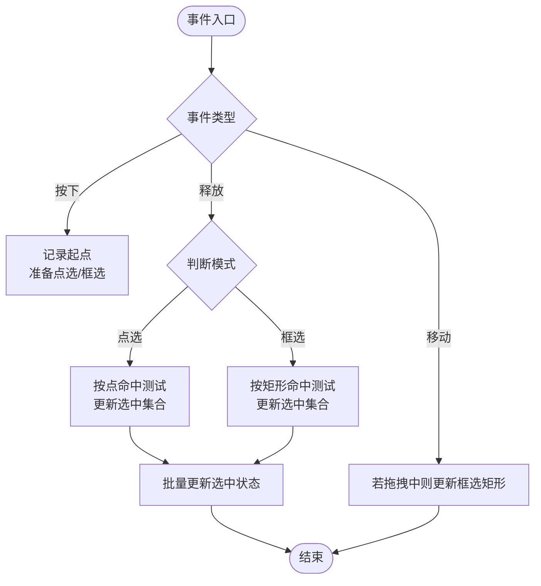
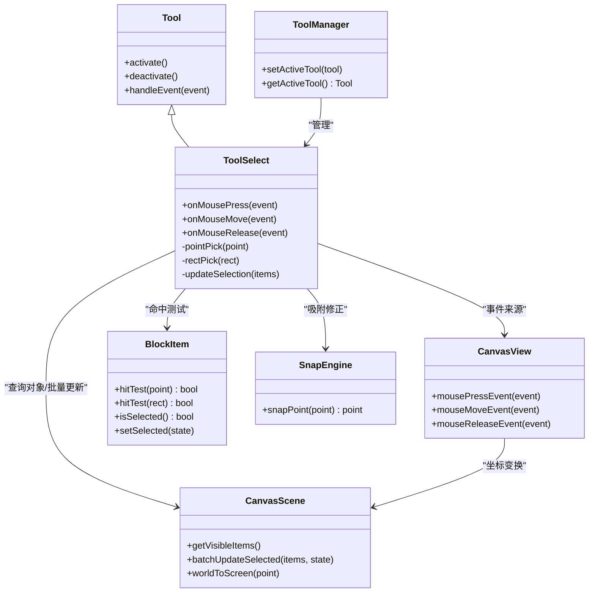

# 选择工具

<cite>
**本文引用的文件**   
- [ToolSelect.h](file://src/tools/ToolSelect.h)
- [ToolSelect.cpp](file://src/tools/ToolSelect.cpp)
- [Tool.h](file://src/tools/Tool.h)
- [ToolManager.h](file://src/tools/ToolManager.h)
- [ToolManager.cpp](file://src/tools/ToolManager.cpp)
- [CanvasScene.h](file://src/canvas/CanvasScene.h)
- [CanvasScene.cpp](file://src/canvas/CanvasScene.cpp)
- [CanvasView.h](file://src/canvas/CanvasView.h)
- [CanvasView.cpp](file://src/canvas/CanvasView.cpp)
- [BlockItem.h](file://src/canvas/BlockItem.h)
- [BlockItem.cpp](file://src/canvas/BlockItem.cpp)
- [SnapEngine.h](file://src/tools/SnapEngine.h)
- [SnapEngine.cpp](file://src/tools/SnapEngine.cpp)
</cite>

## 目录
1. [简介](#简介)
2. [项目结构](#项目结构)
3. [核心组件](#核心组件)
4. [架构总览](#架构总览)
5. [详细组件分析](#详细组件分析)
6. [依赖关系分析](#依赖关系分析)
7. [性能考量](#性能考量)
8. [故障排查指南](#故障排查指南)
9. [结论](#结论)
10. [附录](#附录)

## 简介
本文件为“选择工具”的完整技术文档，面向实现与使用者两类读者。内容涵盖：
- 对象选择算法（点选、框选、多选）
- 边界检测与命中判定
- 交互反馈（高亮、选中状态）
- 事件处理机制（鼠标点击、拖拽、框选）
- 与画布系统的集成方式
- 复杂场景下的性能优化策略与准确性保障
- 自定义选择逻辑的实现要点与示例路径

## 项目结构
选择工具位于 tools 模块，与 canvas 模块中的场景和视图紧密协作，并通过 ToolManager 进行生命周期管理。关键文件组织如下：
- 工具层：ToolSelect（选择工具）、Tool（基类）、ToolManager（工具管理器）
- 画布层：CanvasScene（场景与对象集合）、CanvasView（视图与事件分发）、BlockItem（可选择的图形项）
- 辅助：SnapEngine（吸附引擎，影响命中精度）

图表来源
- [ToolSelect.h](file://src/tools/ToolSelect.h)
- [Tool.h](file://src/tools/Tool.h)
- [ToolManager.h](file://src/tools/ToolManager.h)
- [CanvasScene.h](file://src/canvas/CanvasScene.h)
- [CanvasView.h](file://src/canvas/CanvasView.h)
- [BlockItem.h](file://src/canvas/BlockItem.h)
- [SnapEngine.h](file://src/tools/SnapEngine.h)

章节来源
- [ToolSelect.h](file://src/tools/ToolSelect.h)
- [ToolSelect.cpp](file://src/tools/ToolSelect.cpp)
- [Tool.h](file://src/tools/Tool.h)
- [ToolManager.h](file://src/tools/ToolManager.h)
- [ToolManager.cpp](file://src/tools/ToolManager.cpp)
- [CanvasScene.h](file://src/canvas/CanvasScene.h)
- [CanvasScene.cpp](file://src/canvas/CanvasScene.cpp)
- [CanvasView.h](file://src/canvas/CanvasView.h)
- [CanvasView.cpp](file://src/canvas/CanvasView.cpp)
- [BlockItem.h](file://src/canvas/BlockItem.h)
- [BlockItem.cpp](file://src/canvas/BlockItem.cpp)
- [SnapEngine.h](file://src/tools/SnapEngine.h)
- [SnapEngine.cpp](file://src/tools/SnapEngine.cpp)

## 核心组件
- ToolSelect：选择工具的核心实现，负责解析用户输入、计算命中、维护选中集合、驱动视觉反馈。
- CanvasScene：提供对象集合、坐标变换、可见性过滤、批量更新接口。
- CanvasView：接收鼠标事件，转换为场景坐标并转发给当前激活的工具。
- BlockItem：每个可被选择的图形项，提供命中测试与选中状态。
- ToolManager：工具切换与生命周期管理，确保选择工具正确初始化与释放。
- SnapEngine：在命中前对输入点进行吸附修正，提升选择精度。

章节来源
- [ToolSelect.h](file://src/tools/ToolSelect.h)
- [ToolSelect.cpp](file://src/tools/ToolSelect.cpp)
- [CanvasScene.h](file://src/canvas/CanvasScene.h)
- [CanvasScene.cpp](file://src/canvas/CanvasScene.cpp)
- [CanvasView.h](file://src/canvas/CanvasView.h)
- [CanvasView.cpp](file://src/canvas/CanvasView.cpp)
- [BlockItem.h](file://src/canvas/BlockItem.h)
- [BlockItem.cpp](file://src/canvas/BlockItem.cpp)
- [ToolManager.h](file://src/tools/ToolManager.h)
- [ToolManager.cpp](file://src/tools/ToolManager.cpp)
- [SnapEngine.h](file://src/tools/SnapEngine.h)
- [SnapEngine.cpp](file://src/tools/SnapEngine.cpp)

## 架构总览
选择工具采用“视图-场景-工具”分层架构：
- 视图层（CanvasView）捕获鼠标事件，转换为场景坐标后交给当前工具。
- 工具层（ToolSelect）根据事件类型执行不同策略：单击点选、拖拽框选、多选组合。
- 场景层（CanvasScene）提供对象遍历、可见性过滤、批量更新。
- 项层（BlockItem）实现具体几何命中测试与选中状态。

图表来源
- [CanvasView.h](file://src/canvas/CanvasView.h)
- [CanvasScene.h](file://src/canvas/CanvasScene.h)
- [ToolSelect.h](file://src/tools/ToolSelect.h)
- [BlockItem.h](file://src/canvas/BlockItem.h)
- [SnapEngine.h](file://src/tools/SnapEngine.h)

## 详细组件分析

### ToolSelect：选择工具
职责
- 解析鼠标事件（按下、移动、释放）
- 支持单击点选、拖拽框选、Shift/Ctrl 多选
- 调用场景获取候选对象，执行命中测试
- 维护选中集合，驱动视觉反馈（高亮/选中态）
- 与吸附引擎协作提升命中精度

关键流程
- 按下：记录起始点，进入拖拽或点选分支
- 移动：若处于拖拽状态，计算框选矩形；否则忽略
- 释放：根据模式执行点选或框选，更新选中集合

图表来源
- [ToolSelect.cpp](file://src/tools/ToolSelect.cpp)
- [ToolSelect.h](file://src/tools/ToolSelect.h)

章节来源
- [ToolSelect.h](file://src/tools/ToolSelect.h)
- [ToolSelect.cpp](file://src/tools/ToolSelect.cpp)

### CanvasScene：场景与对象集合
职责
- 维护所有图形项（BlockItem）
- 提供可见性过滤与遍历接口
- 提供批量更新选中状态的接口
- 提供坐标变换（视图到场景）

关键点
- 遍历顺序影响命中优先级（通常后绘制者优先）
- 可见性过滤减少无效命中测试
- 批量更新避免频繁重绘

章节来源
- [CanvasScene.h](file://src/canvas/CanvasScene.h)
- [CanvasScene.cpp](file://src/canvas/CanvasScene.cpp)

### CanvasView：视图与事件分发
职责
- 捕获鼠标事件（按下、移动、释放）
- 将屏幕坐标转换为场景坐标
- 将事件转发给当前激活的工具（ToolSelect）

关键点
- 坐标转换需考虑缩放和平移
- 事件节流与防抖可减少不必要的计算

章节来源
- [CanvasView.h](file://src/canvas/CanvasView.h)
- [CanvasView.cpp](file://src/canvas/CanvasView.cpp)

### BlockItem：可选项
职责
- 实现具体的命中测试（点/矩形）
- 维护选中状态与高亮样式
- 提供边界信息用于框选判断

关键点
- 命中测试应使用高效的几何方法（如 AABB、多边形包含）
- 选中状态变更应触发轻量级重绘

章节来源
- [BlockItem.h](file://src/canvas/BlockItem.h)
- [BlockItem.cpp](file://src/canvas/BlockItem.cpp)

### ToolManager：工具管理器
职责
- 管理工具的创建、切换与销毁
- 确保选择工具在激活时正确初始化

关键点
- 工具切换时应清理上一工具的状态
- 选择工具激活时需重置选中集合

章节来源
- [ToolManager.h](file://src/tools/ToolManager.h)
- [ToolManager.cpp](file://src/tools/ToolManager.cpp)

### SnapEngine：吸附引擎
职责
- 对输入点进行吸附修正，提高选择精度
- 与选择工具协作，在命中测试前修正坐标

关键点
- 吸附阈值需可调
- 吸附失败时回退原始坐标

章节来源
- [SnapEngine.h](file://src/tools/SnapEngine.h)
- [SnapEngine.cpp](file://src/tools/SnapEngine.cpp)

## 依赖关系分析
选择工具依赖链清晰，耦合度低：
- ToolSelect 依赖 CanvasScene（对象集合）、CanvasView（事件源）、BlockItem（命中项）、SnapEngine（吸附）
- CanvasScene 依赖 BlockItem（项集合）
- CanvasView 依赖 CanvasScene（坐标变换）
- ToolManager 依赖 ToolSelect（工具实例）

图表来源
- [Tool.h](file://src/tools/Tool.h)
- [ToolSelect.h](file://src/tools/ToolSelect.h)
- [CanvasScene.h](file://src/canvas/CanvasScene.h)
- [CanvasView.h](file://src/canvas/CanvasView.h)
- [BlockItem.h](file://src/canvas/BlockItem.h)
- [SnapEngine.h](file://src/tools/SnapEngine.h)
- [ToolManager.h](file://src/tools/ToolManager.h)

章节来源
- [ToolSelect.h](file://src/tools/ToolSelect.h)
- [ToolSelect.cpp](file://src/tools/ToolSelect.cpp)
- [CanvasScene.h](file://src/canvas/CanvasScene.h)
- [CanvasScene.cpp](file://src/canvas/CanvasScene.cpp)
- [CanvasView.h](file://src/canvas/CanvasView.h)
- [CanvasView.cpp](file://src/canvas/CanvasView.cpp)
- [BlockItem.h](file://src/canvas/BlockItem.h)
- [BlockItem.cpp](file://src/canvas/BlockItem.cpp)
- [SnapEngine.h](file://src/tools/SnapEngine.h)
- [SnapEngine.cpp](file://src/tools/SnapEngine.cpp)
- [ToolManager.h](file://src/tools/ToolManager.h)
- [ToolManager.cpp](file://src/tools/ToolManager.cpp)

## 性能考量
- 命中测试优化
  - 先做粗筛（如 AABB），再做细测（多边形/曲线）
  - 利用可见性过滤减少遍历数量
- 批量更新
  - 收集需要更新的项，统一调用批量更新接口，减少重绘次数
- 事件节流
  - 在拖拽过程中降低计算频率，避免卡顿
- 吸附阈值
  - 合理设置吸附阈值，平衡精度与性能
- 内存与对象池
  - 复用临时对象，减少分配开销

[本节为通用指导，不直接分析具体文件]

## 故障排查指南
常见问题与定位思路
- 无法选中对象
  - 检查可见性过滤是否排除了目标项
  - 验证命中测试逻辑（点/矩形）是否正确
  - 确认坐标转换（视图到场景）无误
- 多选失效
  - 检查 Shift/Ctrl 键状态处理
  - 确认选中集合合并逻辑（追加/替换/反选）
- 框选不准确
  - 检查吸附引擎阈值设置
  - 验证框选矩形计算与命中测试一致性
- 性能问题
  - 统计命中测试次数，优化粗筛策略
  - 检查批量更新是否生效，避免频繁重绘

章节来源
- [ToolSelect.cpp](file://src/tools/ToolSelect.cpp)
- [CanvasScene.cpp](file://src/canvas/CanvasScene.cpp)
- [CanvasView.cpp](file://src/canvas/CanvasView.cpp)
- [BlockItem.cpp](file://src/canvas/BlockItem.cpp)
- [SnapEngine.cpp](file://src/tools/SnapEngine.cpp)

## 结论
选择工具通过清晰的层次结构与明确的职责划分，实现了可靠的点选、框选与多选功能。借助吸附引擎与批量更新机制，在保证精度的同时兼顾了性能。开发者可通过扩展 BlockItem 的命中测试与 ToolSelect 的选择策略，灵活定制选择行为。

[本节为总结，不直接分析具体文件]

## 附录
- 自定义选择逻辑实现要点
  - 在 BlockItem 中实现自定义命中测试（如基于轮廓或属性）
  - 在 ToolSelect 中扩展选择策略（如按属性筛选、按层级过滤）
  - 使用 ToolManager 切换工具以适配不同工作流
- 参考实现路径
  - 选择工具主逻辑：[ToolSelect.cpp](file://src/tools/ToolSelect.cpp)
  - 场景对象集合与批量更新：[CanvasScene.cpp](file://src/canvas/CanvasScene.cpp)
  - 视图事件分发与坐标转换：[CanvasView.cpp](file://src/canvas/CanvasView.cpp)
  - 项命中测试与选中状态：[BlockItem.cpp](file://src/canvas/BlockItem.cpp)
  - 吸附引擎修正输入点：[SnapEngine.cpp](file://src/tools/SnapEngine.cpp)