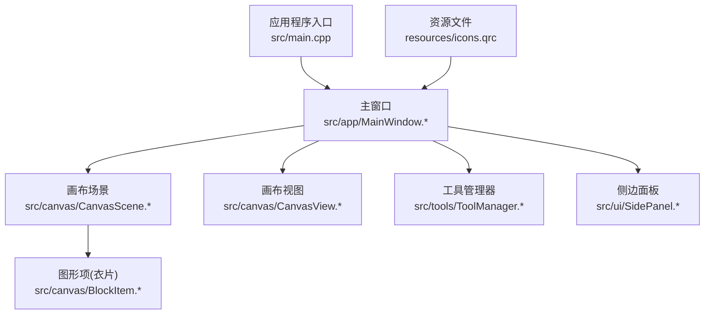
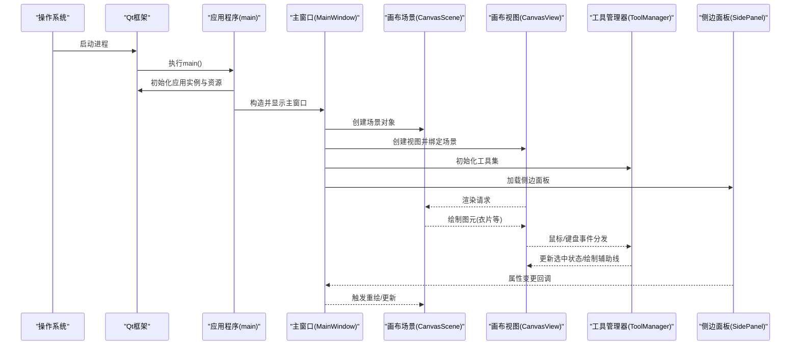
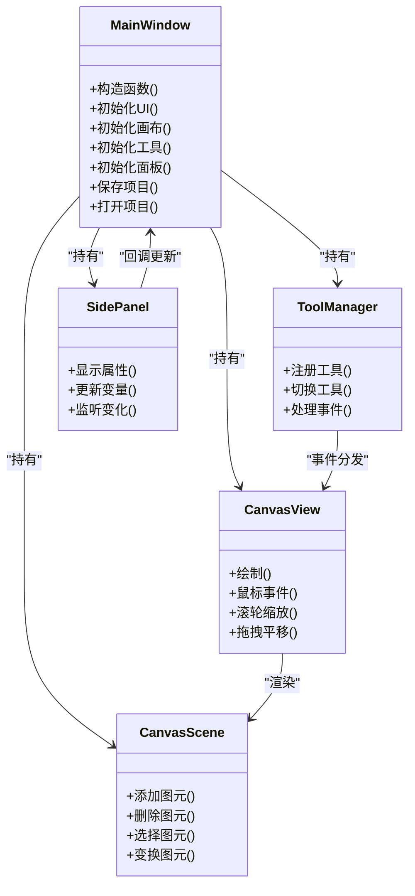
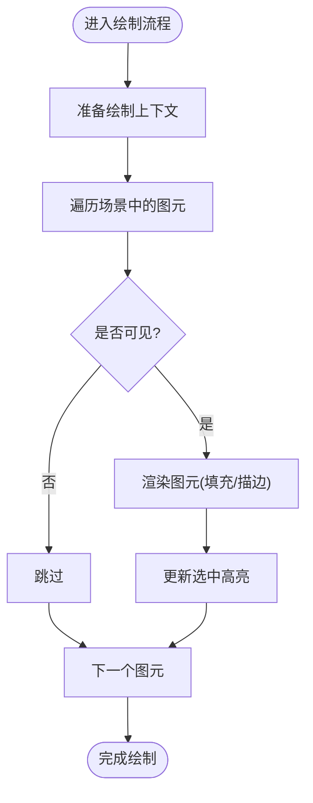
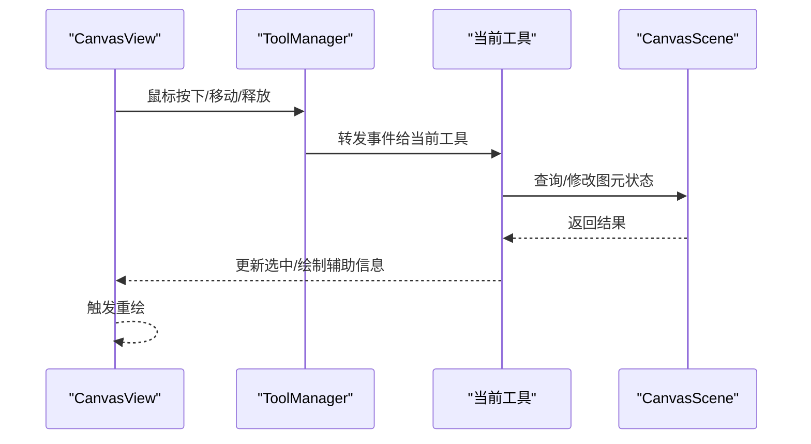
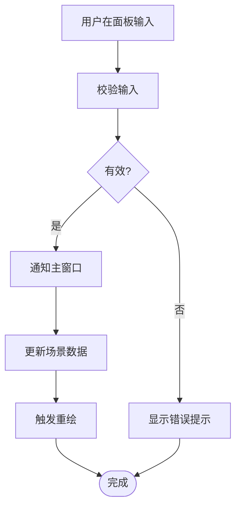
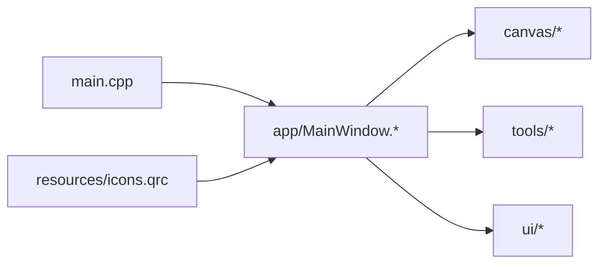

# 快速开始

<cite>
**本文档引用的文件**   
- [CMakeLists.txt](file://CMakeLists.txt)
- [CMakePresets.json](file://CMakePresets.json)
- [src/main.cpp](file://src/main.cpp)
- [src/app/MainWindow.h](file://src/app/MainWindow.h)
- [src/app/MainWindow.cpp](file://src/app/MainWindow.cpp)
- [src/canvas/CanvasScene.h](file://src/canvas/CanvasScene.h)
- [src/canvas/CanvasView.h](file://src/canvas/CanvasView.h)
- [src/canvas/BlockItem.h](file://src/canvas/BlockItem.h)
- [src/tools/ToolManager.h](file://src/tools/ToolManager.h)
- [src/ui/SidePanel.h](file://src/ui/SidePanel.h)
- [resources/icons.qrc](file://resources/icons.qrc)
</cite>

## 目录
1. [简介](#简介)
2. [项目结构](#项目结构)
3. [核心组件](#核心组件)
4. [架构总览](#架构总览)
5. [详细组件分析](#详细组件分析)
6. [依赖关系分析](#依赖关系分析)
7. [性能注意事项](#性能注意事项)
8. [故障排除指南](#故障排除指南)
9. [结论](#结论)
10. [附录](#附录)

## 简介
本快速开始指南面向首次接触服装CAD项目的开发者与用户，提供从零开始的完整环境搭建、构建与运行流程。内容涵盖：
- 环境与工具要求（Qt版本、编译器）
- 依赖安装与CMake配置
- 项目编译与运行
- 基本使用方法与第一个简单操作演示
- 常见问题排查与优化建议

目标是让初学者也能顺利上手，同时为有经验的开发者提供足够的技术细节。

## 项目结构
本项目采用基于功能的模块化组织方式，核心目录说明如下：
- src：源代码主目录
  - app：应用入口与主窗口逻辑
  - canvas：绘图场景、视图与图形项
  - tools：工具集与工具管理器
  - ui：侧边栏、面板等界面组件
  - main.cpp：程序入口
- resources：资源文件（图标等）
- CMakeLists.txt：顶层构建脚本
- CMakePresets.json：CMake预设（用于简化构建配置）

图表来源
- [src/main.cpp](file://src/main.cpp)
- [src/app/MainWindow.h](file://src/app/MainWindow.h)
- [src/app/MainWindow.cpp](file://src/app/MainWindow.cpp)
- [src/canvas/CanvasScene.h](file://src/canvas/CanvasScene.h)
- [src/canvas/CanvasView.h](file://src/canvas/CanvasView.h)
- [src/canvas/BlockItem.h](file://src/canvas/BlockItem.h)
- [src/tools/ToolManager.h](file://src/tools/ToolManager.h)
- [src/ui/SidePanel.h](file://src/ui/SidePanel.h)
- [resources/icons.qrc](file://resources/icons.qrc)

章节来源
- [CMakeLists.txt](file://CMakeLists.txt)
- [CMakePresets.json](file://CMakePresets.json)
- [src/main.cpp](file://src/main.cpp)

## 核心组件
- 应用入口与主窗口
  - 负责初始化Qt应用、加载资源、创建并显示主窗口
  - 主窗口集成画布、工具栏与侧边面板
- 画布子系统
  - CanvasScene：管理图形项、坐标系统、选择与变换
  - CanvasView：渲染与交互事件处理（缩放、平移、绘制）
  - BlockItem：表示衣片/图元的基本图形项
- 工具系统
  - ToolManager：统一注册、切换与调度工具（如选择、智能笔）
- UI面板
  - SidePanel：属性面板、变量与公式编辑入口

章节来源
- [src/app/MainWindow.h](file://src/app/MainWindow.h)
- [src/app/MainWindow.cpp](file://src/app/MainWindow.cpp)
- [src/canvas/CanvasScene.h](file://src/canvas/CanvasScene.h)
- [src/canvas/CanvasView.h](file://src/canvas/CanvasView.h)
- [src/canvas/BlockItem.h](file://src/canvas/BlockItem.h)
- [src/tools/ToolManager.h](file://src/tools/ToolManager.h)
- [src/ui/SidePanel.h](file://src/ui/SidePanel.h)

## 架构总览
下图展示了从应用启动到主界面渲染的关键调用链与模块协作关系。

图表来源
- [src/main.cpp](file://src/main.cpp)
- [src/app/MainWindow.h](file://src/app/MainWindow.h)
- [src/app/MainWindow.cpp](file://src/app/MainWindow.cpp)
- [src/canvas/CanvasScene.h](file://src/canvas/CanvasScene.h)
- [src/canvas/CanvasView.h](file://src/canvas/CanvasView.h)
- [src/tools/ToolManager.h](file://src/tools/ToolManager.h)
- [src/ui/SidePanel.h](file://src/ui/SidePanel.h)

## 详细组件分析

### 应用入口与主窗口
- 职责
  - 初始化Qt应用、加载资源、创建主窗口并进入事件循环
  - 主窗口承载画布、工具栏与侧边面板
- 关键点
  - 资源加载路径与QRC文件关联
  - 主窗口尺寸与默认布局
  - 与画布、工具、面板的集成点

图表来源
- [src/app/MainWindow.h](file://src/app/MainWindow.h)
- [src/app/MainWindow.cpp](file://src/app/MainWindow.cpp)
- [src/canvas/CanvasScene.h](file://src/canvas/CanvasScene.h)
- [src/canvas/CanvasView.h](file://src/canvas/CanvasView.h)
- [src/tools/ToolManager.h](file://src/tools/ToolManager.h)
- [src/ui/SidePanel.h](file://src/ui/SidePanel.h)

章节来源
- [src/app/MainWindow.h](file://src/app/MainWindow.h)
- [src/app/MainWindow.cpp](file://src/app/MainWindow.cpp)

### 画布子系统
- CanvasScene
  - 维护图元集合、坐标系、选择状态与变换矩阵
  - 提供添加/删除/选择/移动/旋转等操作接口
- CanvasView
  - 处理渲染管线与用户交互（鼠标、滚轮、键盘）
  - 实现缩放、平移、吸附、网格显示等功能
- BlockItem
  - 表示衣片或基础几何图元的绘制与命中检测

图表来源
- [src/canvas/CanvasScene.h](file://src/canvas/CanvasScene.h)
- [src/canvas/CanvasView.h](file://src/canvas/CanvasView.h)
- [src/canvas/BlockItem.h](file://src/canvas/BlockItem.h)

章节来源
- [src/canvas/CanvasScene.h](file://src/canvas/CanvasScene.h)
- [src/canvas/CanvasView.h](file://src/canvas/CanvasView.h)
- [src/canvas/BlockItem.h](file://src/canvas/BlockItem.h)

### 工具系统与交互
- ToolManager
  - 统一管理工具生命周期与当前激活工具
  - 将输入事件分发给当前工具进行处理
- 典型工具
  - 选择工具：框选、单选、多选
  - 智能笔：自动对齐、吸附、约束

图表来源
- [src/tools/ToolManager.h](file://src/tools/ToolManager.h)
- [src/canvas/CanvasView.h](file://src/canvas/CanvasView.h)
- [src/canvas/CanvasScene.h](file://src/canvas/CanvasScene.h)

章节来源
- [src/tools/ToolManager.h](file://src/tools/ToolManager.h)

### UI面板与数据绑定
- SidePanel
  - 展示当前选中对象的属性
  - 提供变量与公式编辑入口，联动场景更新
- 数据流
  - 用户在面板中修改参数 -> 通知主窗口 -> 更新场景 -> 重绘

图表来源
- [src/ui/SidePanel.h](file://src/ui/SidePanel.h)
- [src/app/MainWindow.h](file://src/app/MainWindow.h)
- [src/canvas/CanvasScene.h](file://src/canvas/CanvasScene.h)

章节来源
- [src/ui/SidePanel.h](file://src/ui/SidePanel.h)

## 依赖关系分析
- 构建系统
  - CMakeLists.txt：定义目标、依赖库、包含路径、资源文件
  - CMakePresets.json：提供常用构建预设（Debug/Release、多平台）
- 外部依赖
  - Qt框架（GUI、Core、Widgets、Svg等）
  - 可选：第三方数学库、序列化库（视具体实现而定）
- 内部依赖
  - app依赖canvas、tools、ui模块
  - canvas依赖geometry与parametric（若存在）
  - tools依赖canvas与scene
  - ui依赖app与scene

图表来源
- [CMakeLists.txt](file://CMakeLists.txt)
- [CMakePresets.json](file://CMakePresets.json)
- [src/main.cpp](file://src/main.cpp)
- [resources/icons.qrc](file://resources/icons.qrc)

章节来源
- [CMakeLists.txt](file://CMakeLists.txt)
- [CMakePresets.json](file://CMakePresets.json)

## 性能注意事项
- 渲染优化
  - 使用视口裁剪减少不必要的绘制
  - 批量更新场景后统一触发重绘
- 交互响应
  - 将耗时计算放入后台线程，通过信号槽更新UI
- 内存管理
  - 及时释放不再使用的图元与临时对象
  - 避免在事件处理中进行深拷贝

[本节为通用指导，不直接分析具体文件]

## 故障排除指南
- 无法找到Qt库或头文件
  - 检查Qt安装路径与CMake配置是否正确
  - 确认环境变量已设置（如QTDIR、PATH）
- 资源未加载（图标缺失）
  - 确保QRC文件被正确包含并生成
  - 检查资源路径与命名空间
- 运行时崩溃或无响应
  - 启用调试符号并在IDE中附加调试器
  - 逐步定位异常位置（断点、日志）
- 构建失败（链接错误）
  - 核对CMakeLists.txt中的依赖声明
  - 清理构建目录后重新生成

章节来源
- [CMakeLists.txt](file://CMakeLists.txt)
- [CMakePresets.json](file://CMakePresets.json)
- [resources/icons.qrc](file://resources/icons.qrc)

## 结论
通过本指南，您应能顺利完成环境搭建、项目构建与基本运行，并理解核心组件的职责与交互方式。建议在熟悉基础流程后，进一步阅读各模块源码以深化对服装CAD系统的理解与扩展能力。

[本节为总结性内容，不直接分析具体文件]

## 附录

### 环境要求与安装步骤
- 推荐环境
  - 操作系统：Windows 10/11、macOS、Linux
  - 编译器：MSVC（Windows）、Clang/GCC（macOS/Linux）
  - Qt版本：建议使用Qt 5.15+或Qt 6.x（根据CMake配置确定）
  - CMake：3.16+
- 安装依赖
  - 安装Qt（含开发包与工具链）
  - 安装CMake与对应平台工具链
  - 配置环境变量（如Qt路径、CMake路径）
- 克隆与配置
  - 克隆仓库到本地目录
  - 使用CMake预设或命令行配置构建类型与Qt路径
- 构建与运行
  - 生成构建文件并编译
  - 运行可执行程序，验证界面与基本功能

章节来源
- [CMakeLists.txt](file://CMakeLists.txt)
- [CMakePresets.json](file://CMakePresets.json)

### 第一次运行示例与简单操作
- 启动应用
  - 双击生成的可执行文件或通过IDE运行
- 基本操作
  - 使用选择工具点击图元进行选中
  - 拖动图元进行移动
  - 滚轮缩放画布，按住中键平移
  - 在侧边面板修改属性，观察实时变化
- 保存与打开
  - 使用菜单或快捷键保存当前项目
  - 打开已有项目恢复工作区

章节来源
- [src/app/MainWindow.h](file://src/app/MainWindow.h)
- [src/app/MainWindow.cpp](file://src/app/MainWindow.cpp)
- [src/canvas/CanvasView.h](file://src/canvas/CanvasView.h)
- [src/ui/SidePanel.h](file://src/ui/SidePanel.h)