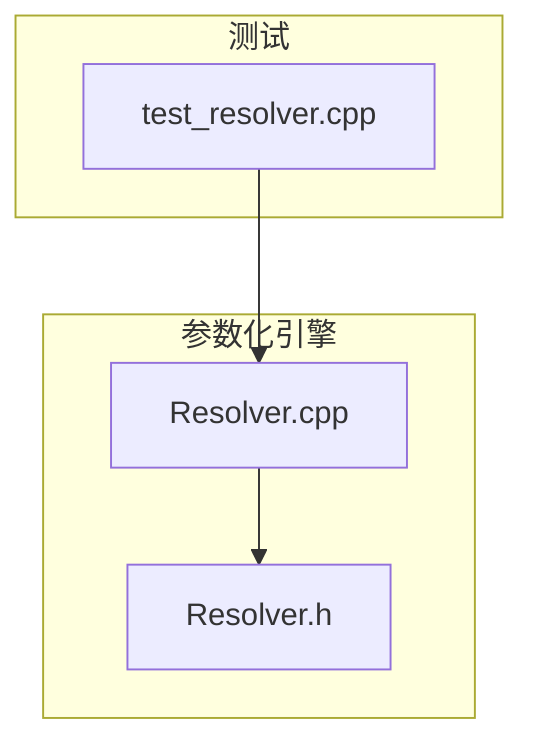
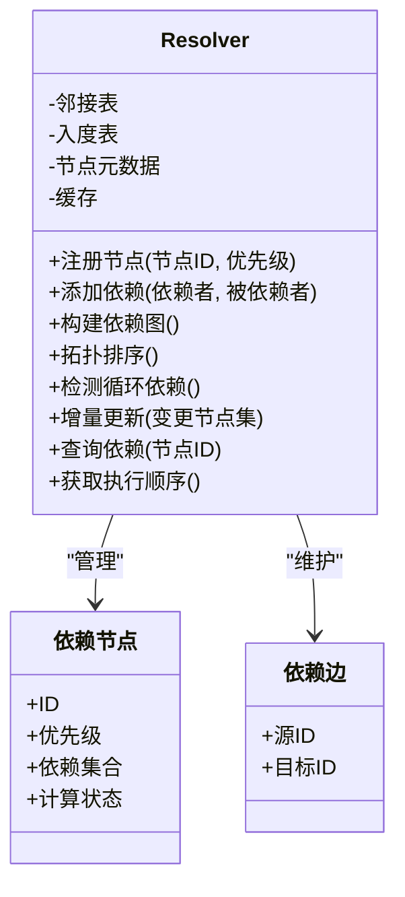
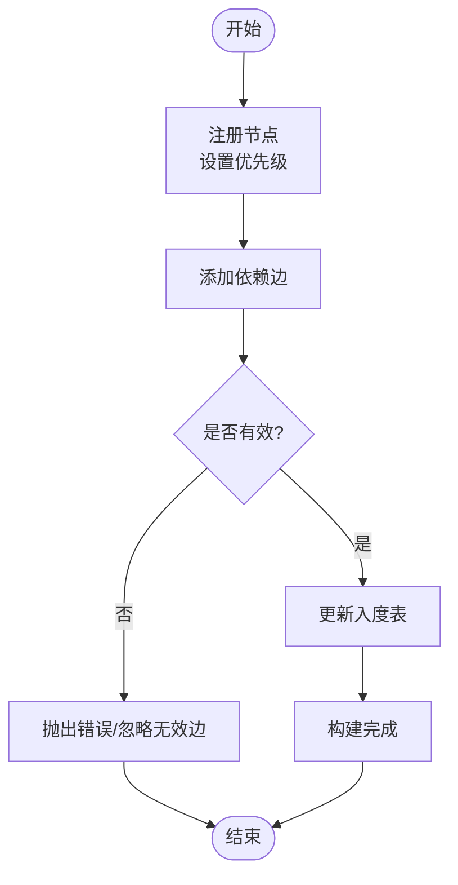
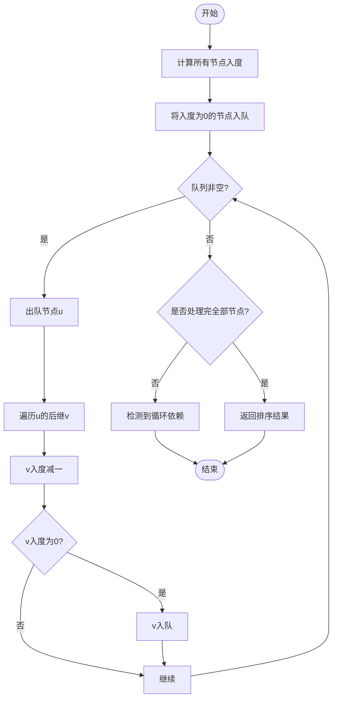
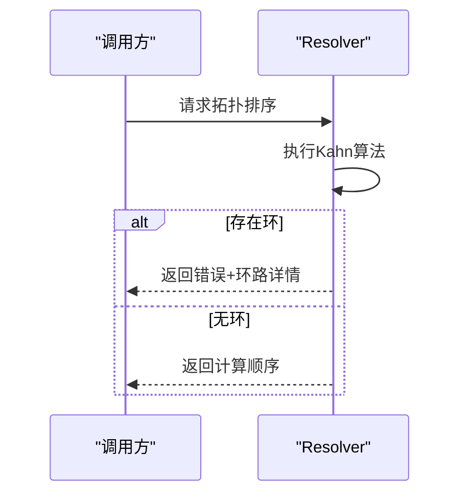
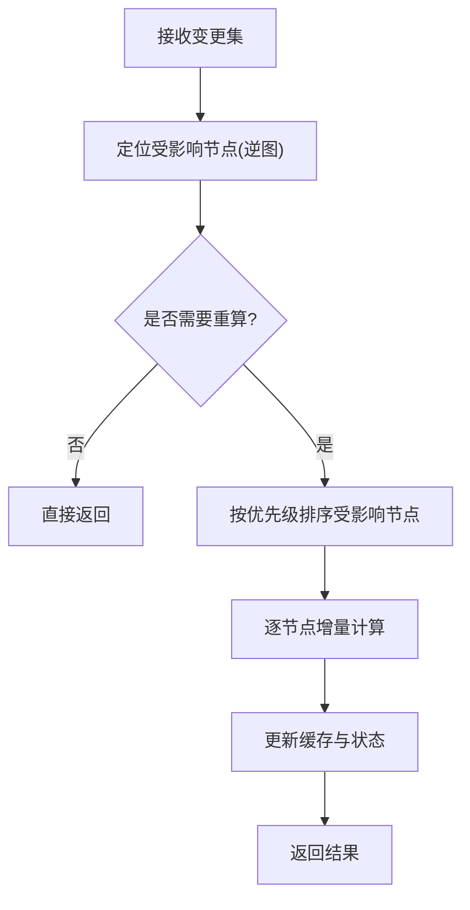
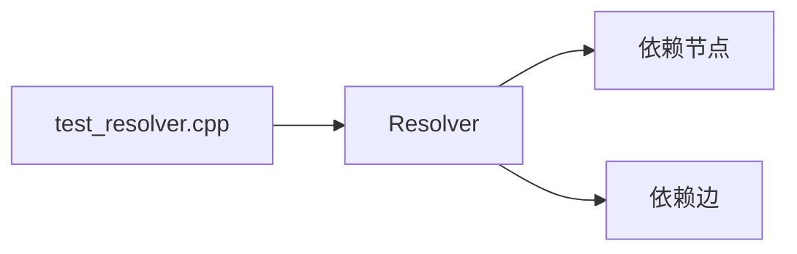

# 依赖解析器

<cite>
**本文档引用的文件**   
- [Resolver.h](file://src/parametric/Resolver.h)
- [Resolver.cpp](file://src/parametric/Resolver.cpp)
- [test_resolver.cpp](file://tests/test_resolver.cpp)
</cite>

## 目录
1. [简介](#简介)
2. [项目结构](#项目结构)
3. [核心组件](#核心组件)
4. [架构总览](#架构总览)
5. [详细组件分析](#详细组件分析)
6. [依赖关系分析](#依赖关系分析)
7. [性能考虑](#性能考虑)
8. [故障排查指南](#故障排查指南)
9. [结论](#结论)
10. [附录](#附录)

## 简介
本文件为参数化引擎中的依赖解析器提供系统化文档，聚焦 Resolver 类的依赖图构建算法、拓扑排序实现、循环依赖检测与处理策略、增量更新与优化机制、依赖优先级与冲突解决规则、查询与分析接口，以及可视化与调试工具。目标是帮助开发者快速理解并高效使用依赖解析能力，同时为后续扩展与维护提供清晰指引。

## 项目结构
与依赖解析器相关的代码主要位于 parametric 模块中，测试用例位于 tests 目录：
- src/parametric/Resolver.h：定义 Resolver 的接口与数据结构
- src/parametric/Resolver.cpp：实现依赖图构建、拓扑排序、循环依赖检测、增量更新等核心逻辑
- tests/test_resolver.cpp：覆盖关键场景的单元测试，用于验证正确性与回归保护

图表来源
- [Resolver.h](file://src/parametric/Resolver.h)
- [Resolver.cpp](file://src/parametric/Resolver.cpp)
- [test_resolver.cpp](file://tests/test_resolver.cpp)

章节来源
- [Resolver.h](file://src/parametric/Resolver.h)
- [Resolver.cpp](file://src/parametric/Resolver.cpp)
- [test_resolver.cpp](file://tests/test_resolver.cpp)

## 核心组件
- Resolver：依赖解析的核心类，负责维护依赖图、执行拓扑排序、检测循环依赖、支持增量更新与查询分析。
- 依赖节点：表示一个可被解析的参数或表达式，包含其依赖集合、计算状态、优先级等信息。
- 依赖边：表示两个节点之间的依赖关系，方向由“被依赖者”指向“依赖者”。

章节来源
- [Resolver.h](file://src/parametric/Resolver.h)
- [Resolver.cpp](file://src/parametric/Resolver.cpp)

## 架构总览
Resolver 内部维护有向无环图（DAG）以表达参数间的依赖关系。典型流程包括：
- 构建阶段：注册节点、添加依赖边、校验一致性
- 排序阶段：基于入度进行拓扑排序，生成可安全计算的顺序
- 执行阶段：按序计算节点值，缓存结果并支持增量重算
- 诊断阶段：检测环路、输出依赖路径、统计复杂度

图表来源
- [Resolver.h](file://src/parametric/Resolver.h)
- [Resolver.cpp](file://src/parametric/Resolver.cpp)

## 详细组件分析

### 依赖图构建算法
- 节点注册：为每个参数创建节点，记录优先级与初始依赖集合
- 边添加：根据依赖声明建立从“被依赖者”到“依赖者”的有向边
- 一致性校验：确保重复边去重、自依赖检查、类型兼容（如适用）
- 入度维护：在添加边时同步更新入度表，便于后续拓扑排序

图表来源
- [Resolver.cpp](file://src/parametric/Resolver.cpp)

章节来源
- [Resolver.cpp](file://src/parametric/Resolver.cpp)

### 拓扑排序实现
- 算法选择：Kahn 算法（基于入度的队列法），时间复杂度 O(V+E)
- 初始化：将所有入度为 0 的节点加入队列
- 迭代过程：弹出节点，将其后继节点的入度减一；若后继入度为 0 则入队
- 结果收集：弹出的顺序即为合法的计算顺序
- 失败条件：若最终未处理全部节点，说明存在环

图表来源
- [Resolver.cpp](file://src/parametric/Resolver.cpp)

章节来源
- [Resolver.cpp](file://src/parametric/Resolver.cpp)

### 循环依赖的检测与处理策略
- 检测时机：拓扑排序完成后若仍有未处理节点，即存在环
- 定位策略：通过回溯依赖链或强连通分量分析，输出最小环或关键路径
- 处理策略：
  - 阻断模式：拒绝构建，返回错误信息并提示具体环路
  - 降级模式：标记受影响节点为“不可计算”，跳过执行并记录警告
  - 隔离模式：将环内节点放入独立子图，允许外部依赖正常计算
- 用户反馈：提供清晰的错误消息与依赖路径，辅助快速修复

图表来源
- [Resolver.cpp](file://src/parametric/Resolver.cpp)

章节来源
- [Resolver.cpp](file://src/parametric/Resolver.cpp)

### 增量更新与优化机制
- 变更识别：仅对受影响的节点及其下游依赖进行重算
- 影响范围：基于反向依赖图（逆图）快速定位受影响节点集合
- 优先级调度：优先更新高优先级节点，保证关键路径尽早可用
- 缓存策略：对已计算且未失效的节点结果进行复用
- 批量更新：合并多次变更，减少重复扫描与重建开销

图表来源
- [Resolver.cpp](file://src/parametric/Resolver.cpp)

章节来源
- [Resolver.cpp](file://src/parametric/Resolver.cpp)

### 依赖优先级与冲突解决规则
- 优先级定义：为节点分配数值型优先级，越大越优先（或反之，依实现而定）
- 排序稳定：在拓扑排序基础上引入优先级作为次级排序键，保证确定性
- 冲突场景：
  - 多源依赖：同一节点被多处修改，采用最后写入或最高优先级策略
  - 循环优先级：当环内节点优先级不一致时，优先满足更高优先级分支
- 策略配置：可通过 API 切换“严格/宽松”冲突处理模式

章节来源
- [Resolver.h](file://src/parametric/Resolver.h)
- [Resolver.cpp](file://src/parametric/Resolver.cpp)

### 依赖查询与分析接口
- 查询接口：
  - 获取某节点的所有直接/间接依赖
  - 获取某节点的被依赖者集合
  - 判断两节点是否存在依赖路径
- 分析接口：
  - 统计图的规模（节点数、边数、最大入度/出度）
  - 输出关键路径与瓶颈节点
  - 导出依赖图结构（供可视化或外部工具使用）

章节来源
- [Resolver.h](file://src/parametric/Resolver.h)
- [Resolver.cpp](file://src/parametric/Resolver.cpp)

### 依赖图可视化与调试工具
- 导出格式：支持 JSON、Graphviz DOT 等通用格式
- 可视化建议：
  - 节点颜色区分状态（就绪/计算中/失败）
  - 边粗细表示依赖强度或频率
  - 交互功能：点击节点高亮依赖路径
- 调试输出：打印拓扑顺序、入度变化、环检测详情

章节来源
- [Resolver.cpp](file://src/parametric/Resolver.cpp)

## 依赖关系分析
- 耦合性：Resolver 与节点/边结构紧密耦合，但通过抽象接口降低对外部模块的影响
- 内聚性：依赖图构建、排序、检测、增量更新等功能集中在 Resolver，职责清晰
- 外部依赖：单元测试通过 test_resolver.cpp 验证行为，不引入运行时耦合

图表来源
- [Resolver.h](file://src/parametric/Resolver.h)
- [Resolver.cpp](file://src/parametric/Resolver.cpp)
- [test_resolver.cpp](file://tests/test_resolver.cpp)

章节来源
- [Resolver.h](file://src/parametric/Resolver.h)
- [Resolver.cpp](file://src/parametric/Resolver.cpp)
- [test_resolver.cpp](file://tests/test_resolver.cpp)

## 性能考虑
- 时间复杂度：
  - 构建：O(V+E)
  - 拓扑排序：O(V+E)
  - 增量更新：O(k)，k 为受影响节点数量
- 空间复杂度：O(V+E) 存储图结构
- 优化建议：
  - 使用邻接表与入度数组避免重复计算
  - 批量操作合并多次变更
  - 缓存热点节点结果，减少重复计算
  - 限制图规模，拆分大图为子图

[本节为通用性能指导，无需特定文件引用]

## 故障排查指南
- 常见错误：
  - 循环依赖：检查新增依赖是否形成环，查看错误消息中的路径
  - 未注册节点：确保所有参与计算的节点均已注册
  - 优先级冲突：确认优先级策略与预期一致
- 调试步骤：
  - 启用详细日志，观察入度变化与排序过程
  - 导出依赖图，人工核对关键路径
  - 运行单元测试，定位回归问题

章节来源
- [Resolver.cpp](file://src/parametric/Resolver.cpp)
- [test_resolver.cpp](file://tests/test_resolver.cpp)

## 结论
Resolver 提供了完整的依赖解析能力，涵盖图构建、拓扑排序、循环检测、增量更新与查询分析。通过清晰的接口设计与高效的算法实现，能够支撑复杂参数化场景下的稳定计算。建议在大规模图中采用分块与缓存策略，并结合可视化工具提升可观测性。

[本节为总结性内容，无需特定文件引用]

## 附录
- 术语表：
  - 依赖节点：可被解析的参数或表达式实体
  - 依赖边：表示节点间的依赖方向
  - 拓扑排序：线性排列节点以满足依赖约束
  - 循环依赖：依赖图中存在闭合回路
- 参考测试：
  - 基础构建与排序
  - 循环依赖检测
  - 增量更新场景

章节来源
- [test_resolver.cpp](file://tests/test_resolver.cpp)