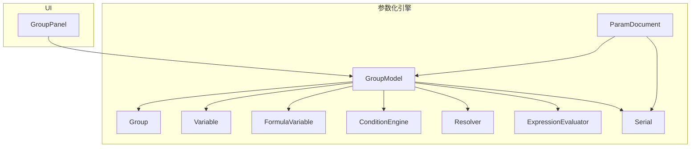
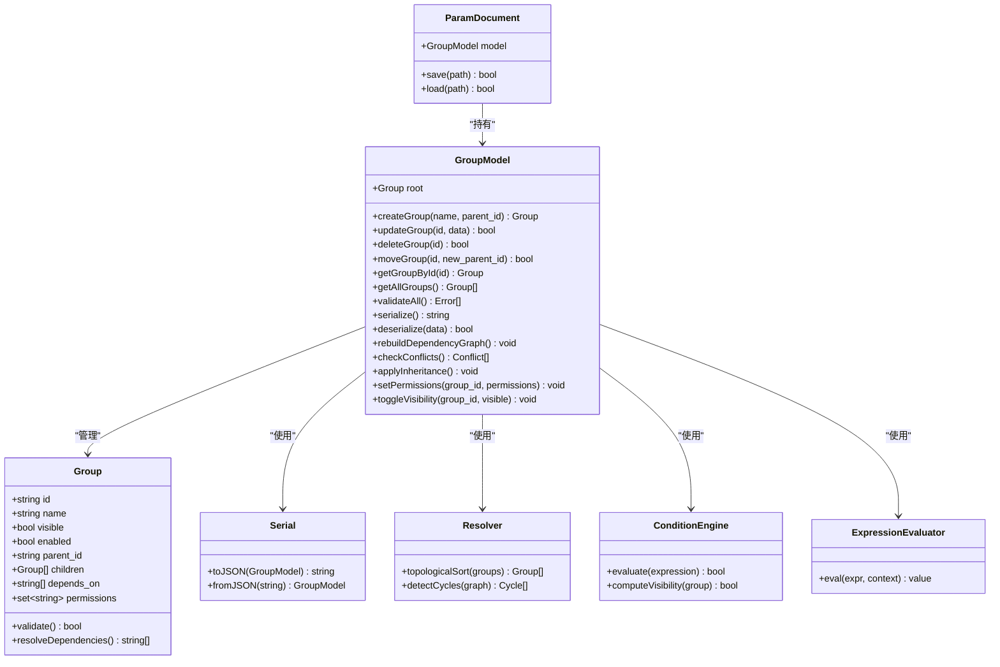
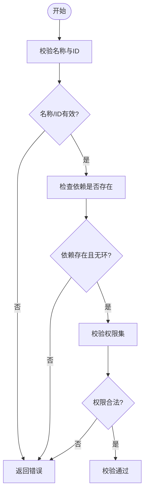
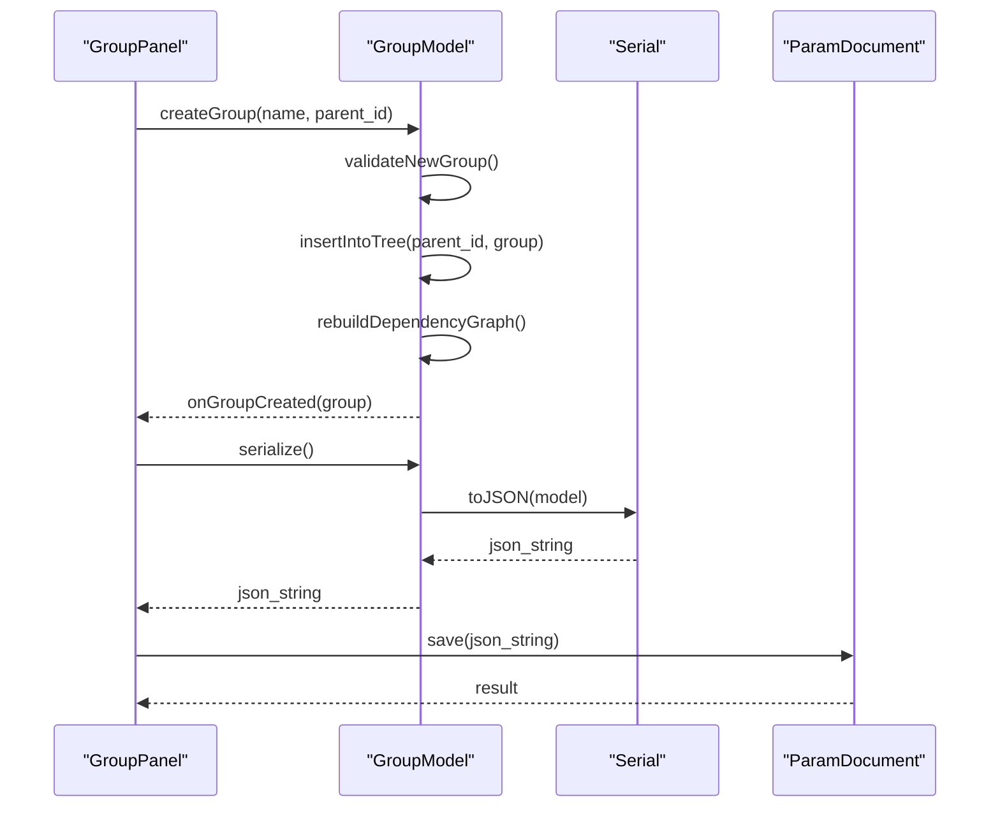
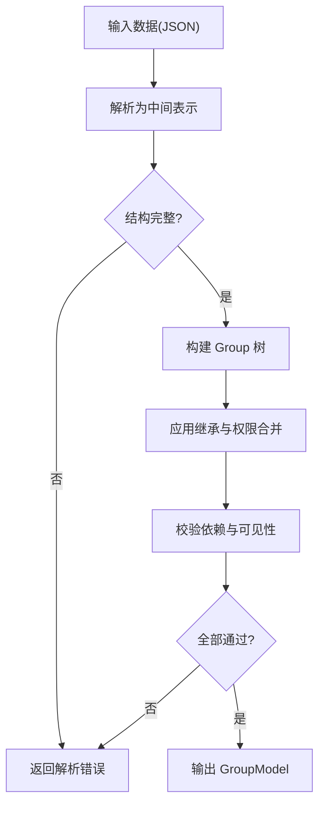
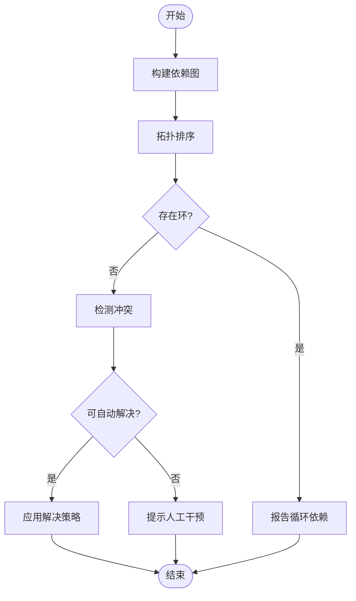
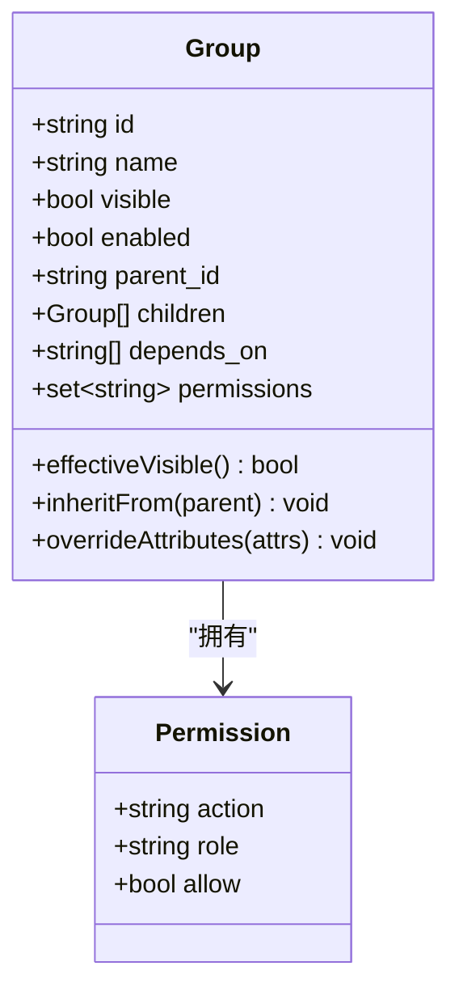
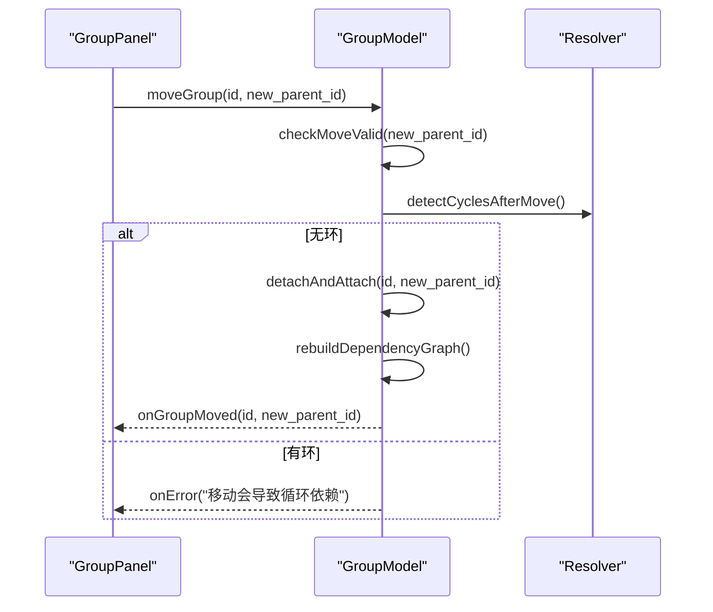
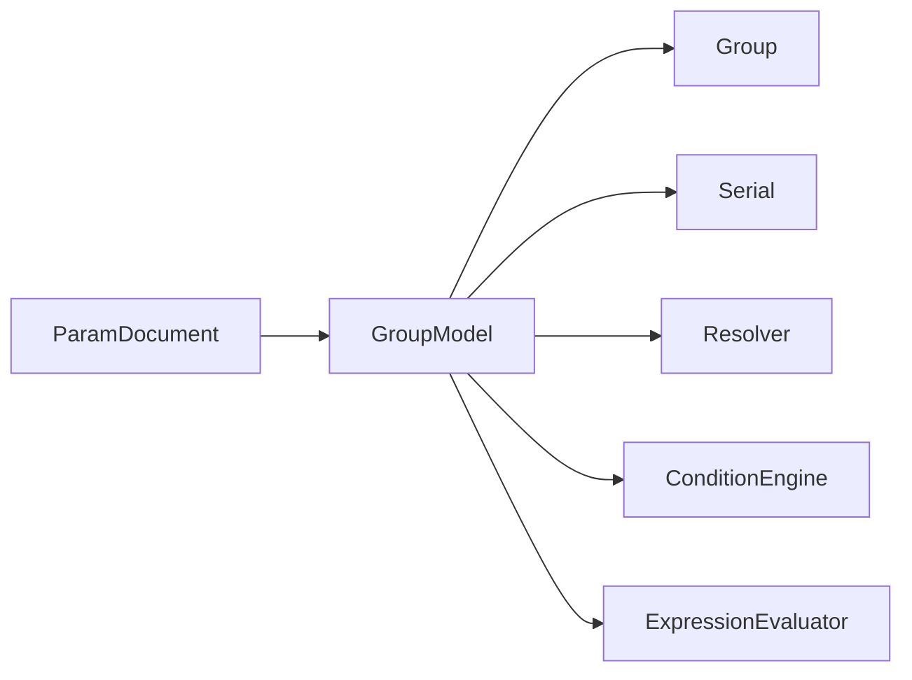

# 分组模型系统

<cite>
**本文引用的文件**   
- [GroupModel.h](file://src/parametric/GroupModel.h)
- [GroupModel.cpp](file://src/parametric/GroupModel.cpp)
- [Group.h](file://src/parametric/Group.h)
- [Serial.h](file://src/parametric/Serial.h)
- [Serial.cpp](file://src/parametric/Serial.cpp)
- [ParamDocument.h](file://src/parametric/ParamDocument.h)
- [ParamDocument.cpp](file://src/parametric/ParamDocument.cpp)
- [Variable.h](file://src/parametric/Variable.h)
- [ConditionEngine.h](file://src/parametric/ConditionEngine.h)
- [ConditionEngine.cpp](file://src/parametric/ConditionEngine.cpp)
- [Resolver.h](file://src/parametric/Resolver.h)
- [Resolver.cpp](file://src/parametric/Resolver.cpp)
- [FormulaVariable.h](file://src/parametric/FormulaVariable.h)
- [ExpressionEvaluator.h](file://src/parametric/ExpressionEvaluator.h)
- [ExpressionEvaluator.cpp](file://src/parametric/ExpressionEvaluator.cpp)
- [GroupPanel.h](file://src/ui/GroupPanel.h)
- [GroupPanel.cpp](file://src/ui/GroupPanel.cpp)
</cite>

## 目录
1. [简介](#简介)
2. [项目结构](#项目结构)
3. [核心组件](#核心组件)
4. [架构总览](#架构总览)
5. [详细组件分析](#详细组件分析)
6. [依赖关系分析](#依赖关系分析)
7. [性能考虑](#性能考虑)
8. [故障排查指南](#故障排查指南)
9. [结论](#结论)
10. [附录](#附录)

## 简介
本文件面向参数化引擎的“分组模型系统”，聚焦 GroupModel 类如何管理参数的分组结构与层次关系，并围绕 Group 的定义与属性配置展开。文档涵盖分组的嵌套、继承与权限控制、分组间的依赖与冲突解决机制、动态创建/修改/删除操作，以及分组数据的序列化与反序列化支持。同时给出分组模型的验证规则与约束检查策略，帮助读者全面理解该子系统的设计与实现。

## 项目结构
分组模型系统位于 parametric 模块中，核心由 GroupModel、Group、序列化器 Serial、文档容器 ParamDocument 以及解析与表达式求值相关组件构成。UI 层通过 GroupPanel 对分组进行可视化编辑与交互。

图表来源
- [GroupModel.h](file://src/parametric/GroupModel.h)
- [GroupModel.cpp](file://src/parametric/GroupModel.cpp)
- [Group.h](file://src/parametric/Group.h)
- [Serial.h](file://src/parametric/Serial.h)
- [Serial.cpp](file://src/parametric/Serial.cpp)
- [ParamDocument.h](file://src/parametric/ParamDocument.h)
- [ParamDocument.cpp](file://src/parametric/ParamDocument.cpp)
- [Variable.h](file://src/parametric/Variable.h)
- [ConditionEngine.h](file://src/parametric/ConditionEngine.h)
- [ConditionEngine.cpp](file://src/parametric/ConditionEngine.cpp)
- [Resolver.h](file://src/parametric/Resolver.h)
- [Resolver.cpp](file://src/parametric/Resolver.cpp)
- [FormulaVariable.h](file://src/parametric/FormulaVariable.h)
- [ExpressionEvaluator.h](file://src/parametric/ExpressionEvaluator.h)
- [ExpressionEvaluator.cpp](file://src/parametric/ExpressionEvaluator.cpp)
- [GroupPanel.h](file://src/ui/GroupPanel.h)
- [GroupPanel.cpp](file://src/ui/GroupPanel.cpp)

章节来源
- [GroupModel.h](file://src/parametric/GroupModel.h)
- [GroupModel.cpp](file://src/parametric/GroupModel.cpp)
- [Group.h](file://src/parametric/Group.h)
- [Serial.h](file://src/parametric/Serial.h)
- [Serial.cpp](file://src/parametric/Serial.cpp)
- [ParamDocument.h](file://src/parametric/ParamDocument.h)
- [ParamDocument.cpp](file://src/parametric/ParamDocument.cpp)
- [Variable.h](file://src/parametric/Variable.h)
- [ConditionEngine.h](file://src/parametric/ConditionEngine.h)
- [ConditionEngine.cpp](file://src/parametric/ConditionEngine.cpp)
- [Resolver.h](file://src/parametric/Resolver.h)
- [Resolver.cpp](file://src/parametric/Resolver.cpp)
- [FormulaVariable.h](file://src/parametric/FormulaVariable.h)
- [ExpressionEvaluator.h](file://src/parametric/ExpressionEvaluator.h)
- [ExpressionEvaluator.cpp](file://src/parametric/ExpressionEvaluator.cpp)
- [GroupPanel.h](file://src/ui/GroupPanel.h)
- [GroupPanel.cpp](file://src/ui/GroupPanel.cpp)

## 核心组件
- GroupModel：分组树的管理者，负责增删改查、层级维护、依赖与冲突检测、可见性与权限控制、事件通知、序列化接口等。
- Group：分组节点的数据与行为定义，包含名称、标识、可见性、继承关系、权限、子分组集合、父引用等。
- Variable/FormulaVariable：变量与公式变量，可被分组组织与管理。
- Serial：分组与变量的序列化和反序列化能力。
- ParamDocument：文档级容器，持有 GroupModel 并提供持久化入口。
- ConditionEngine/Resolver/ExpressionEvaluator：条件引擎、依赖解析与表达式求值，支撑分组可见性、依赖与冲突判定。
- GroupPanel：UI 侧对分组模型的可视化编辑与交互。

章节来源
- [GroupModel.h](file://src/parametric/GroupModel.h)
- [GroupModel.cpp](file://src/parametric/GroupModel.cpp)
- [Group.h](file://src/parametric/Group.h)
- [Variable.h](file://src/parametric/Variable.h)
- [FormulaVariable.h](file://src/parametric/FormulaVariable.h)
- [Serial.h](file://src/parametric/Serial.h)
- [Serial.cpp](file://src/parametric/Serial.cpp)
- [ParamDocument.h](file://src/parametric/ParamDocument.h)
- [ParamDocument.cpp](file://src/parametric/ParamDocument.cpp)
- [ConditionEngine.h](file://src/parametric/ConditionEngine.h)
- [ConditionEngine.cpp](file://src/parametric/ConditionEngine.cpp)
- [Resolver.h](file://src/parametric/Resolver.h)
- [Resolver.cpp](file://src/parametric/Resolver.cpp)
- [ExpressionEvaluator.h](file://src/parametric/ExpressionEvaluator.h)
- [ExpressionEvaluator.cpp](file://src/parametric/ExpressionEvaluator.cpp)
- [GroupPanel.h](file://src/ui/GroupPanel.h)
- [GroupPanel.cpp](file://src/ui/GroupPanel.cpp)

## 架构总览
分组模型系统采用“模型-视图-工具”分层：
- 模型层：GroupModel + Group + Variable/FormulaVariable，提供数据与业务规则。
- 工具层：Serial、Resolver、ConditionEngine、ExpressionEvaluator，提供序列化、依赖解析、条件计算与表达式求值。
- 视图层：GroupPanel，基于 Qt 的 UI 组件，驱动用户操作并调用 GroupModel API。

图表来源
- [GroupModel.h](file://src/parametric/GroupModel.h)
- [GroupModel.cpp](file://src/parametric/GroupModel.cpp)
- [Group.h](file://src/parametric/Group.h)
- [Serial.h](file://src/parametric/Serial.h)
- [Serial.cpp](file://src/parametric/Serial.cpp)
- [ParamDocument.h](file://src/parametric/ParamDocument.h)
- [ParamDocument.cpp](file://src/parametric/ParamDocument.cpp)
- [Resolver.h](file://src/parametric/Resolver.h)
- [Resolver.cpp](file://src/parametric/Resolver.cpp)
- [ConditionEngine.h](file://src/parametric/ConditionEngine.h]
- [ConditionEngine.cpp](file://src/parametric/ConditionEngine.cpp)
- [ExpressionEvaluator.h](file://src/parametric/ExpressionEvaluator.h)
- [ExpressionEvaluator.cpp](file://src/parametric/ExpressionEvaluator.cpp)

## 详细组件分析

### Group 类与属性配置
- 标识与名称：id、name，用于唯一识别与显示。
- 层级关系：parent_id、children，形成树形结构。
- 可见性与启用：visible、enabled，控制渲染与参与计算的开关。
- 依赖声明：depends_on，声明对其他分组或变量的依赖。
- 权限控制：permissions，限制访问与修改范围。
- 继承语义：通过父组属性合并与覆盖实现（如默认值、可见性、权限）。
- 校验方法：validate，检查命名规范、依赖存在性、循环依赖等。
- 依赖解析：resolveDependencies，返回按拓扑序排列的依赖链。

图表来源
- [Group.h](file://src/parametric/Group.h)

章节来源
- [Group.h](file://src/parametric/Group.h)

### GroupModel 管理器
- 分组生命周期：createGroup、updateGroup、deleteGroup、moveGroup。
- 查询与遍历：getGroupById、getAllGroups、findAncestors、findDescendants。
- 依赖与冲突：rebuildDependencyGraph、checkConflicts、resolveTopologicalOrder。
- 继承与权限：applyInheritance、setPermissions、mergeAttributes。
- 可见性：toggleVisibility、computeEffectiveVisibility。
- 序列化：serialize、deserialize，与 Serial 协作完成 JSON/XML 转换。
- 事件通知：onGroupChanged、onDependencyChanged，供 UI 刷新。

图表来源
- [GroupModel.h](file://src/parametric/GroupModel.h)
- [GroupModel.cpp](file://src/parametric/GroupModel.cpp)
- [Serial.h](file://src/parametric/Serial.h)
- [Serial.cpp](file://src/parametric/Serial.cpp)
- [ParamDocument.h](file://src/parametric/ParamDocument.h)
- [ParamDocument.cpp](file://src/parametric/ParamDocument.cpp)

章节来源
- [GroupModel.h](file://src/parametric/GroupModel.h)
- [GroupModel.cpp](file://src/parametric/GroupModel.cpp)
- [Serial.h](file://src/parametric/Serial.h)
- [Serial.cpp](file://src/parametric/Serial.cpp)
- [ParamDocument.h](file://src/parametric/ParamDocument.h)
- [ParamDocument.cpp](file://src/parametric/ParamDocument.cpp)

### 序列化与反序列化
- Serial::toJSON：将 GroupModel 树转换为 JSON，包括分组元数据、依赖、权限、可见性等。
- Serial::fromJSON：从 JSON 重建 GroupModel，执行完整性校验与依赖修复。
- 版本兼容：支持字段迁移与默认值填充。
- 错误处理：解析失败时返回结构化错误信息，便于定位问题。

图表来源
- [Serial.h](file://src/parametric/Serial.h)
- [Serial.cpp](file://src/parametric/Serial.cpp)

章节来源
- [Serial.h](file://src/parametric/Serial.h)
- [Serial.cpp](file://src/parametric/Serial.cpp)

### 依赖关系与冲突解决
- 依赖图构建：根据 depends_on 建立有向图，记录分组间依赖。
- 拓扑排序：Resolver::topologicalSort 保证计算顺序正确。
- 环检测：Resolver::detectCycles 发现并报告循环依赖。
- 冲突检测：checkConflicts 比较同名变量、权限冲突、可见性矛盾等。
- 冲突解决策略：优先最近祖先、显式覆盖、权限拒绝、回退到默认值。

图表来源
- [Resolver.h](file://src/parametric/Resolver.h)
- [Resolver.cpp](file://src/parametric/Resolver.cpp)
- [GroupModel.h](file://src/parametric/GroupModel.h)
- [GroupModel.cpp](file://src/parametric/GroupModel.cpp)

章节来源
- [Resolver.h](file://src/parametric/Resolver.h)
- [Resolver.cpp](file://src/parametric/Resolver.cpp)
- [GroupModel.h](file://src/parametric/GroupModel.h)
- [GroupModel.cpp](file://src/parametric/GroupModel.cpp)

### 继承与权限控制
- 继承：子组继承父组的默认值、可见性、权限；子组可覆盖父组设置。
- 权限：permissions 控制读/写/删除等操作权限，结合角色或上下文生效。
- 可见性：visible 受父组与条件表达式影响，最终 effectiveVisible 由 ConditionEngine 计算。
- 合并策略：自顶向下合并，显式设置优先于继承值。

图表来源
- [Group.h](file://src/parametric/Group.h)

章节来源
- [Group.h](file://src/parametric/Group.h)

### 动态创建、修改与删除
- 创建：createGroup(name, parent_id) 校验名称与父节点存在，插入树并更新依赖图。
- 修改：updateGroup(id, data) 支持更新名称、依赖、权限、可见性等，触发增量重算。
- 删除：deleteGroup(id) 级联删除子节点，清理依赖与缓存。
- 移动：moveGroup(id, new_parent_id) 重新挂载节点，避免环依赖。

图表来源
- [GroupModel.h](file://src/parametric/GroupModel.h)
- [GroupModel.cpp](file://src/parametric/GroupModel.cpp)
- [Resolver.h](file://src/parametric/Resolver.h)
- [Resolver.cpp](file://src/parametric/Resolver.cpp)

章节来源
- [GroupModel.h](file://src/parametric/GroupModel.h)
- [GroupModel.cpp](file://src/parametric/GroupModel.cpp)
- [Resolver.h](file://src/parametric/Resolver.h)
- [Resolver.cpp](file://src/parametric/Resolver.cpp)

### 验证规则与约束检查
- 基本约束：id 唯一、name 非空、parent_id 存在或为空根。
- 依赖约束：depends_on 指向的分组必须存在，且不构成环。
- 权限约束：permissions 中的动作与角色需合法。
- 可见性约束：effectiveVisible 需与父组一致或满足条件表达式。
- 变量约束：分组内变量名不冲突，公式变量可求值。

章节来源
- [Group.h](file://src/parametric/Group.h)
- [GroupModel.h](file://src/parametric/GroupModel.h)
- [GroupModel.cpp](file://src/parametric/GroupModel.cpp)
- [Variable.h](file://src/parametric/Variable.h)
- [FormulaVariable.h](file://src/parametric/FormulaVariable.h)

### UI 集成与交互
- GroupPanel 提供分组树展示、拖拽移动、批量选择、属性编辑。
- 用户操作转化为 GroupModel API 调用，实时反馈状态变化。
- 错误与警告在 UI 层以消息提示，引导用户修正。

章节来源
- [GroupPanel.h](file://src/ui/GroupPanel.h)
- [GroupPanel.cpp](file://src/ui/GroupPanel.cpp)

## 依赖关系分析
- 低耦合：GroupModel 通过接口与 Serial、Resolver、ConditionEngine、ExpressionEvaluator 协作，降低内部复杂度。
- 高内聚：Group 封装自身属性与校验逻辑，职责清晰。
- 外部依赖：ParamDocument 作为文档容器，统一加载/保存流程。
- 潜在循环：依赖图构建与环检测确保运行时安全。

图表来源
- [GroupModel.h](file://src/parametric/GroupModel.h)
- [GroupModel.cpp](file://src/parametric/GroupModel.cpp)
- [Group.h](file://src/parametric/Group.h)
- [Serial.h](file://src/parametric/Serial.h)
- [Serial.cpp](file://src/parametric/Serial.cpp)
- [ParamDocument.h](file://src/parametric/ParamDocument.h)
- [ParamDocument.cpp](file://src/parametric/ParamDocument.cpp)
- [Resolver.h](file://src/parametric/Resolver.h)
- [Resolver.cpp](file://src/parametric/Resolver.cpp)
- [ConditionEngine.h](file://src/parametric/ConditionEngine.h)
- [ConditionEngine.cpp](file://src/parametric/ConditionEngine.cpp)
- [ExpressionEvaluator.h](file://src/parametric/ExpressionEvaluator.h)
- [ExpressionEvaluator.cpp](file://src/parametric/ExpressionEvaluator.cpp)

章节来源
- [GroupModel.h](file://src/parametric/GroupModel.h)
- [GroupModel.cpp](file://src/parametric/GroupModel.cpp)
- [Group.h](file://src/parametric/Group.h)
- [Serial.h](file://src/parametric/Serial.h)
- [Serial.cpp](file://src/parametric/Serial.cpp)
- [ParamDocument.h](file://src/parametric/ParamDocument.h)
- [ParamDocument.cpp](file://src/parametric/ParamDocument.cpp)
- [Resolver.h](file://src/parametric/Resolver.h)
- [Resolver.cpp](file://src/parametric/Resolver.cpp)
- [ConditionEngine.h](file://src/parametric/ConditionEngine.h)
- [ConditionEngine.cpp](file://src/parametric/ConditionEngine.cpp)
- [ExpressionEvaluator.h](file://src/parametric/ExpressionEvaluator.h)
- [ExpressionEvaluator.cpp](file://src/parametric/ExpressionEvaluator.cpp)

## 性能考虑
- 增量更新：updateGroup 仅重算受影响分支，避免全量重建。
- 缓存策略：依赖图与可见性结果缓存，减少重复计算。
- 批量操作：支持批量创建/删除，合并事件通知，降低 UI 刷新开销。
- 异步解析：Resolver 与 ConditionEngine 可在后台线程运行，避免阻塞主线程。

[本节为通用指导，无需具体文件来源]

## 故障排查指南
- 循环依赖：查看 Resolver::detectCycles 输出，调整 depends_on 或分组层级。
- 权限不足：检查 permissions 配置与当前角色，确认允许的动作。
- 可见性异常：调试 ConditionEngine 的条件表达式，确认父组可见性与继承链。
- 序列化失败：核对 JSON 结构，确保必填字段与类型正确。
- 变量求值错误：检查 FormulaVariable 表达式语法与上下文变量。

章节来源
- [Resolver.h](file://src/parametric/Resolver.h)
- [Resolver.cpp](file://src/parametric/Resolver.cpp)
- [ConditionEngine.h](file://src/parametric/ConditionEngine.h)
- [ConditionEngine.cpp](file://src/parametric/ConditionEngine.cpp)
- [Serial.h](file://src/parametric/Serial.h)
- [Serial.cpp](file://src/parametric/Serial.cpp)
- [FormulaVariable.h](file://src/parametric/FormulaVariable.h)
- [ExpressionEvaluator.h](file://src/parametric/ExpressionEvaluator.h)
- [ExpressionEvaluator.cpp](file://src/parametric/ExpressionEvaluator.cpp)

## 结论
分组模型系统以 GroupModel 为核心，围绕 Group 的层次结构、依赖与权限控制，提供了完整的动态管理与序列化能力。通过 Resolver、ConditionEngine、ExpressionEvaluator 等工具组件，实现了稳健的依赖解析、条件计算与表达式求值。系统设计兼顾可扩展性与性能，适合复杂参数化场景下的分组组织与管控。

[本节为总结性内容，无需具体文件来源]

## 附录
- 术语表：
  - 分组（Group）：参数的逻辑集合，支持嵌套与继承。
  - 依赖（depends_on）：分组间的数据或计算依赖。
  - 权限（permissions）：访问与操作的授权控制。
  - 可见性（visible/effectiveVisible）：是否参与渲染与计算。
- 最佳实践：
  - 合理划分分组层级，避免过深嵌套。
  - 显式声明依赖，减少隐式耦合。
  - 使用权限最小化原则，提升安全性。
  - 批量操作时合并事件，优化 UI 响应。

[本节为概念性内容，无需具体文件来源]