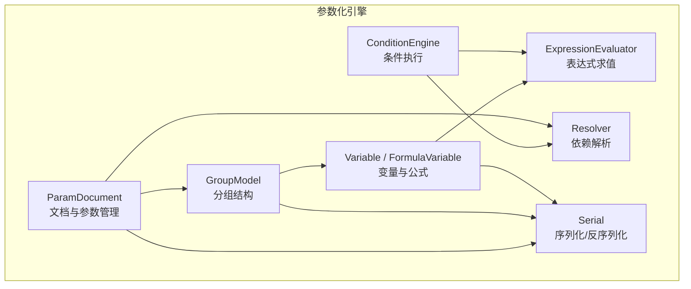
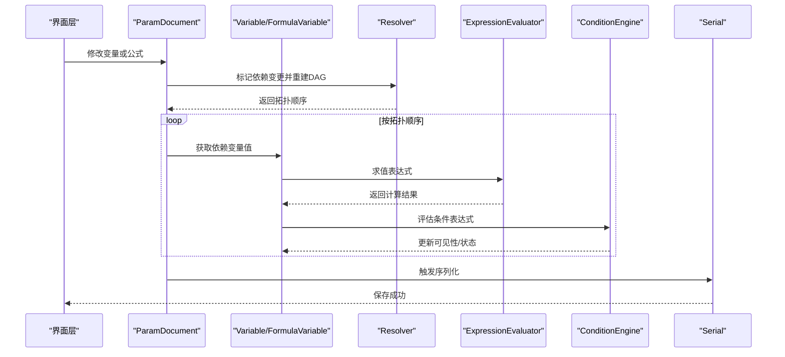
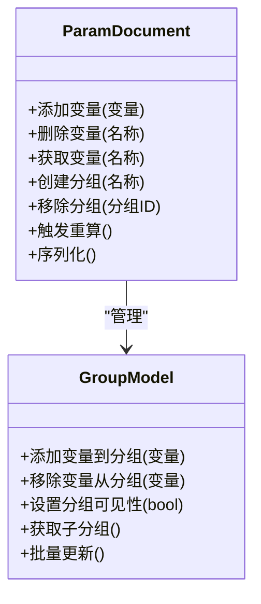
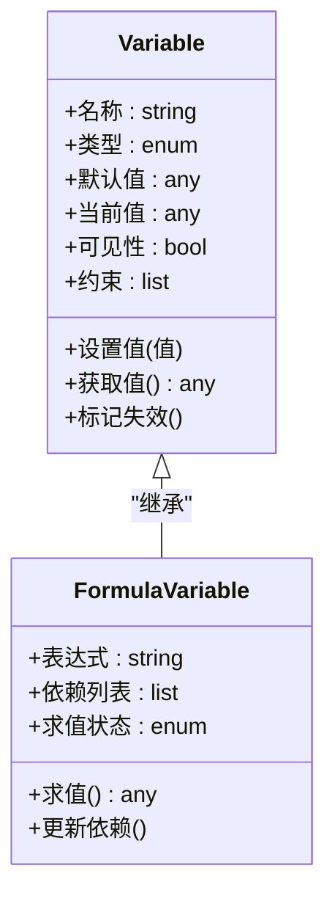
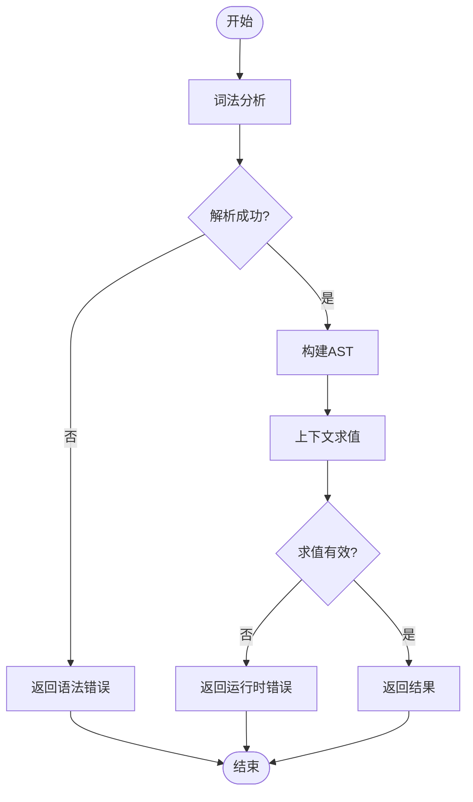
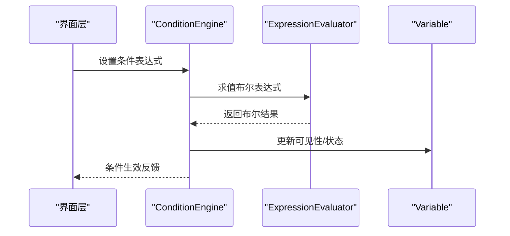
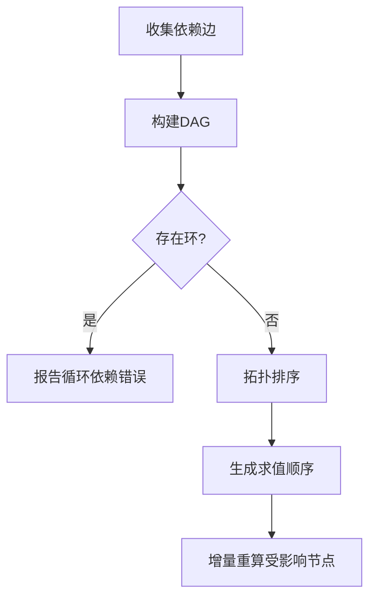
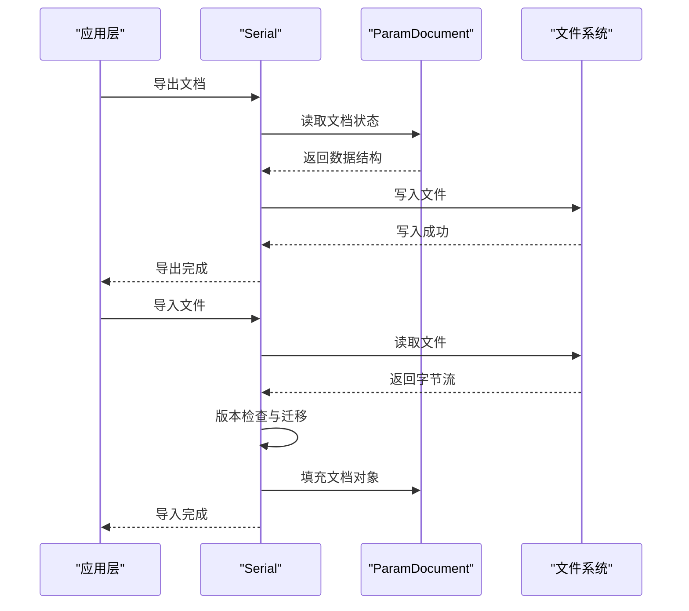
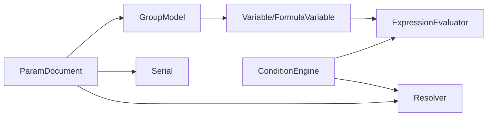

# 参数化引擎架构

<cite>
**本文档引用的文件**   
- [ParamDocument.h](file://src/parametric/ParamDocument.h)
- [ParamDocument.cpp](file://src/parametric/ParamDocument.cpp)
- [GroupModel.h](file://src/parametric/GroupModel.h)
- [GroupModel.cpp](file://src/parametric/GroupModel.cpp)
- [Variable.h](file://src/parametric/Variable.h)
- [FormulaVariable.h](file://src/parametric/FormulaVariable.h)
- [ConditionEngine.h](file://src/parametric/ConditionEngine.h)
- [ConditionEngine.cpp](file://src/parametric/ConditionEngine.cpp)
- [ExpressionEvaluator.h](file://src/parametric/ExpressionEvaluator.h)
- [ExpressionEvaluator.cpp](file://src/parametric/ExpressionEvaluator.cpp)
- [Resolver.h](file://src/parametric/Resolver.h)
- [Resolver.cpp](file://src/parametric/Resolver.cpp)
- [Serial.h](file://src/parametric/Serial.h)
- [Serial.cpp](file://src/parametric/Serial.cpp)
- [test_expression.cpp](file://tests/test_expression.cpp)
- [test_resolver.cpp](file://tests/test_resolver.cpp)
</cite>

## 目录
1. [简介](#简介)
2. [项目结构](#项目结构)
3. [核心组件](#核心组件)
4. [架构总览](#架构总览)
5. [详细组件分析](#详细组件分析)
6. [依赖关系分析](#依赖关系分析)
7. [性能考虑](#性能考虑)
8. [故障排查指南](#故障排查指南)
9. [结论](#结论)
10. [附录](#附录)

## 简介
本文件面向服装CAD系统的参数化引擎，系统化阐述参数化设计的核心概念与数据模型，包括文档级参数管理、分组结构与变量定义；条件引擎的执行机制与表达式求值原理；依赖解析算法与版本控制策略；序列化机制与文件格式支持；以及规则扩展方法与自定义函数注册。同时给出性能优化与缓存策略建议，帮助开发者快速理解并高效扩展该引擎。

## 项目结构
参数化引擎位于 src/parametric 目录下，围绕“文档-分组-变量-表达式-条件-依赖-序列化”的主线组织：
- 文档与分组：ParamDocument、GroupModel
- 变量与公式：Variable、FormulaVariable
- 表达式与条件：ExpressionEvaluator、ConditionEngine
- 依赖解析：Resolver
- 序列化：Serial
- 测试：tests 下的表达式与解析器用例

图表来源
- [ParamDocument.h](file://src/parametric/ParamDocument.h)
- [GroupModel.h](file://src/parametric/GroupModel.h)
- [Variable.h](file://src/parametric/Variable.h)
- [FormulaVariable.h](file://src/parametric/FormulaVariable.h)
- [ExpressionEvaluator.h](file://src/parametric/ExpressionEvaluator.h)
- [ConditionEngine.h](file://src/parametric/ConditionEngine.h)
- [Resolver.h](file://src/parametric/Resolver.h)
- [Serial.h](file://src/parametric/Serial.h)

章节来源
- [ParamDocument.h](file://src/parametric/ParamDocument.h)
- [GroupModel.h](file://src/parametric/GroupModel.h)
- [Variable.h](file://src/parametric/Variable.h)
- [FormulaVariable.h](file://src/parametric/FormulaVariable.h)
- [ExpressionEvaluator.h](file://src/parametric/ExpressionEvaluator.h)
- [ConditionEngine.h](file://src/parametric/ConditionEngine.h)
- [Resolver.h](file://src/parametric/Resolver.h)
- [Serial.h](file://src/parametric/Serial.h)

## 核心组件
- ParamDocument：参数化文档的根容器，负责全局变量集合、分组树、版本元数据、变更事件与重算调度。对外暴露添加/删除变量、查询与批量更新接口，并与 Resolver 协作触发依赖图重建与增量计算。
- GroupModel：分组模型，维护分组的层级结构与成员变量引用，提供分组级别的可见性、作用域与批量操作能力。
- Variable / FormulaVariable：变量抽象与公式变量实现，包含名称、类型、默认值、当前值、依赖列表、可见性与约束等属性。
- ExpressionEvaluator：表达式求值器，负责词法分析、语法解析与数值计算，支持内置函数与运算符，提供上下文绑定（变量查找）与错误诊断。
- ConditionEngine：条件引擎，解析并执行布尔表达式，驱动变量的可见性或分支逻辑，基于求值器与依赖图进行联动更新。
- Resolver：依赖解析器，构建变量间的有向无环图（DAG），进行拓扑排序与增量重算，保证循环依赖检测与稳定求值顺序。
- Serial：序列化模块，支持将文档、分组与变量持久化为指定格式（如JSON或二进制），并提供版本兼容与迁移策略。

章节来源
- [ParamDocument.h](file://src/parametric/ParamDocument.h)
- [ParamDocument.cpp](file://src/parametric/ParamDocument.cpp)
- [GroupModel.h](file://src/parametric/GroupModel.h)
- [GroupModel.cpp](file://src/parametric/GroupModel.cpp)
- [Variable.h](file://src/parametric/Variable.h)
- [FormulaVariable.h](file://src/parametric/FormulaVariable.h)
- [ExpressionEvaluator.h](file://src/parametric/ExpressionEvaluator.h)
- [ExpressionEvaluator.cpp](file://src/parametric/ExpressionEvaluator.cpp)
- [ConditionEngine.h](file://src/parametric/ConditionEngine.h)
- [ConditionEngine.cpp](file://src/parametric/ConditionEngine.cpp)
- [Resolver.h](file://src/parametric/Resolver.h)
- [Resolver.cpp](file://src/parametric/Resolver.cpp)
- [Serial.h](file://src/parametric/Serial.h)
- [Serial.cpp](file://src/parametric/Serial.cpp)

## 架构总览
参数化引擎采用“文档-分组-变量”三层数据模型，配合“表达式-条件-依赖-序列化”四大子系统协同工作。用户通过 UI 修改变量或编辑公式，引擎在 Resolver 中重建依赖图，由 ExpressionEvaluator 计算表达式结果，ConditionEngine 根据布尔表达式驱动可见性与分支，最终通过 Serial 完成持久化。

图表来源
- [ParamDocument.cpp](file://src/parametric/ParamDocument.cpp)
- [Resolver.cpp](file://src/parametric/Resolver.cpp)
- [ExpressionEvaluator.cpp](file://src/parametric/ExpressionEvaluator.cpp)
- [ConditionEngine.cpp](file://src/parametric/ConditionEngine.cpp)
- [Serial.cpp](file://src/parametric/Serial.cpp)

## 详细组件分析

### 文档与分组：ParamDocument 与 GroupModel
- ParamDocument 负责：
  - 全局变量索引与命名空间隔离
  - 分组树的创建、遍历与批量操作
  - 变更事件派发与重算调度
  - 与 Resolver 集成，触发依赖图重建
- GroupModel 负责：
  - 分组层级与成员变量引用
  - 分组级可见性与作用域控制
  - 批量导入/导出与快照

图表来源
- [ParamDocument.h](file://src/parametric/ParamDocument.h)
- [GroupModel.h](file://src/parametric/GroupModel.h)

章节来源
- [ParamDocument.h](file://src/parametric/ParamDocument.h)
- [ParamDocument.cpp](file://src/parametric/ParamDocument.cpp)
- [GroupModel.h](file://src/parametric/GroupModel.h)
- [GroupModel.cpp](file://src/parametric/GroupModel.cpp)

### 变量与公式：Variable 与 FormulaVariable
- Variable 抽象了参数的基本属性：名称、类型、默认值、当前值、可见性、约束等。
- FormulaVariable 继承自 Variable，增加表达式字符串、依赖列表与求值状态。
- 变量生命周期包括创建、赋值、求值、校验与失效通知。

图表来源
- [Variable.h](file://src/parametric/Variable.h)
- [FormulaVariable.h](file://src/parametric/FormulaVariable.h)

章节来源
- [Variable.h](file://src/parametric/Variable.h)
- [FormulaVariable.h](file://src/parametric/FormulaVariable.h)

### 表达式求值器：ExpressionEvaluator
- 功能要点：
  - 词法分析：识别数字、标识符、运算符与函数名
  - 语法解析：构建表达式AST（抽象语法树）
  - 语义求值：在给定上下文中计算数值结果
  - 错误诊断：定位语法与运行时错误
- 扩展点：
  - 注册自定义函数与运算符
  - 注入变量上下文与常量表

图表来源
- [ExpressionEvaluator.h](file://src/parametric/ExpressionEvaluator.h)
- [ExpressionEvaluator.cpp](file://src/parametric/ExpressionEvaluator.cpp)

章节来源
- [ExpressionEvaluator.h](file://src/parametric/ExpressionEvaluator.h)
- [ExpressionEvaluator.cpp](file://src/parametric/ExpressionEvaluator.cpp)
- [test_expression.cpp](file://tests/test_expression.cpp)

### 条件引擎：ConditionEngine
- 功能要点：
  - 解析布尔表达式（支持比较、逻辑运算与函数调用）
  - 基于表达式求值器得到布尔结果
  - 驱动变量可见性、分组显示与分支逻辑
- 执行流程：
  - 输入：条件表达式与变量上下文
  - 处理：求值布尔表达式
  - 输出：布尔结果与副作用（如隐藏/显示变量）

图表来源
- [ConditionEngine.h](file://src/parametric/ConditionEngine.h)
- [ConditionEngine.cpp](file://src/parametric/ConditionEngine.cpp)
- [ExpressionEvaluator.cpp](file://src/parametric/ExpressionEvaluator.cpp)

章节来源
- [ConditionEngine.h](file://src/parametric/ConditionEngine.h)
- [ConditionEngine.cpp](file://src/parametric/ConditionEngine.cpp)

### 依赖解析：Resolver
- 功能要点：
  - 构建变量依赖的有向无环图（DAG）
  - 拓扑排序确定求值顺序
  - 循环依赖检测与报错
  - 增量更新：仅重算受影响的节点
- 关键流程：
  - 收集变量依赖边
  - 构建邻接表与入度表
  - 执行Kahn算法或DFS拓扑排序
  - 维护脏标记与队列进行增量重算

图表来源
- [Resolver.h](file://src/parametric/Resolver.h)
- [Resolver.cpp](file://src/parametric/Resolver.cpp)

章节来源
- [Resolver.h](file://src/parametric/Resolver.h)
- [Resolver.cpp](file://src/parametric/Resolver.cpp)
- [test_resolver.cpp](file://tests/test_resolver.cpp)

### 序列化与版本控制：Serial
- 功能要点：
  - 将文档、分组与变量序列化为结构化格式（如JSON）
  - 支持字段级版本兼容与迁移
  - 提供导入/导出接口与错误回滚
- 版本控制策略：
  - 文档头包含版本号与兼容性矩阵
  - 迁移脚本按版本递增应用
  - 向后兼容读取旧格式，向前写入新格式

图表来源
- [Serial.h](file://src/parametric/Serial.h)
- [Serial.cpp](file://src/parametric/Serial.cpp)

章节来源
- [Serial.h](file://src/parametric/Serial.h)
- [Serial.cpp](file://src/parametric/Serial.cpp)

## 依赖关系分析
参数化引擎各组件之间的耦合关系如下：
- ParamDocument 依赖 GroupModel、Resolver、Serial
- GroupModel 依赖 Variable/FormulaVariable
- FormulaVariable 依赖 ExpressionEvaluator
- ConditionEngine 依赖 ExpressionEvaluator
- Resolver 依赖 Variable 的依赖信息
- Serial 依赖 ParamDocument、GroupModel、Variable

图表来源
- [ParamDocument.h](file://src/parametric/ParamDocument.h)
- [GroupModel.h](file://src/parametric/GroupModel.h)
- [Variable.h](file://src/parametric/Variable.h)
- [FormulaVariable.h](file://src/parametric/FormulaVariable.h)
- [ExpressionEvaluator.h](file://src/parametric/ExpressionEvaluator.h)
- [ConditionEngine.h](file://src/parametric/ConditionEngine.h)
- [Resolver.h](file://src/parametric/Resolver.h)
- [Serial.h](file://src/parametric/Serial.h)

章节来源
- [ParamDocument.h](file://src/parametric/ParamDocument.h)
- [GroupModel.h](file://src/parametric/GroupModel.h)
- [Variable.h](file://src/parametric/Variable.h)
- [FormulaVariable.h](file://src/parametric/FormulaVariable.h)
- [ExpressionEvaluator.h](file://src/parametric/ExpressionEvaluator.h)
- [ConditionEngine.h](file://src/parametric/ConditionEngine.h)
- [Resolver.h](file://src/parametric/Resolver.h)
- [Serial.h](file://src/parametric/Serial.h)

## 性能考虑
- 依赖图增量更新：仅在变量变更时标记受影响节点，避免全量重算
- 表达式缓存：对相同表达式与上下文的结果进行缓存，减少重复求值
- 惰性求值：按需计算变量值，避免不必要的中间结果
- 批量操作：合并多次变量更新为一次重算，降低锁竞争与事件风暴
- 内存管理：复用AST与解析器实例，减少分配开销
- I/O优化：序列化时使用缓冲与流式写入，避免大对象拷贝

[本节为通用性能指导，不直接分析具体文件]

## 故障排查指南
- 表达式解析失败：检查语法是否正确，确认函数名与运算符是否已注册
- 循环依赖错误：查看变量依赖图，消除闭环引用
- 条件不生效：验证条件表达式返回值与变量可见性设置
- 序列化异常：确认版本兼容性与字段完整性，必要时回滚到上一版本
- 性能退化：启用增量重算与表达式缓存，监控依赖图大小

章节来源
- [ExpressionEvaluator.cpp](file://src/parametric/ExpressionEvaluator.cpp)
- [Resolver.cpp](file://src/parametric/Resolver.cpp)
- [ConditionEngine.cpp](file://src/parametric/ConditionEngine.cpp)
- [Serial.cpp](file://src/parametric/Serial.cpp)

## 结论
参数化引擎以清晰的文档-分组-变量模型为基础，结合表达式求值、条件执行、依赖解析与序列化，形成完整的参数化设计闭环。通过增量更新、缓存与惰性求值等策略，确保在高复杂度场景下的性能与稳定性。开发者可通过扩展表达式函数与自定义条件逻辑，灵活适配服装CAD中的多样化参数化需求。

[本节为总结性内容，不直接分析具体文件]

## 附录
- 扩展方法：
  - 在 ExpressionEvaluator 中注册自定义函数与运算符
  - 在 ConditionEngine 中扩展布尔表达式语法
  - 在 Resolver 中定制依赖收集与冲突解决策略
  - 在 Serial 中新增字段与版本迁移脚本
- 最佳实践：
  - 保持变量命名规范与作用域清晰
  - 避免深层嵌套的复杂表达式
  - 使用分组管理大型参数集
  - 定期清理未使用的变量与分组

[本节为补充说明，不直接分析具体文件]