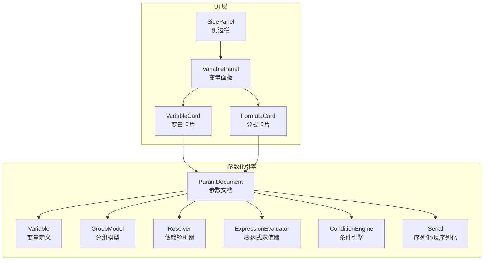
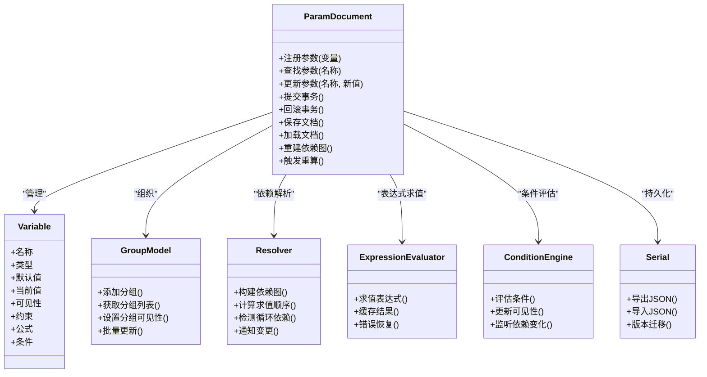
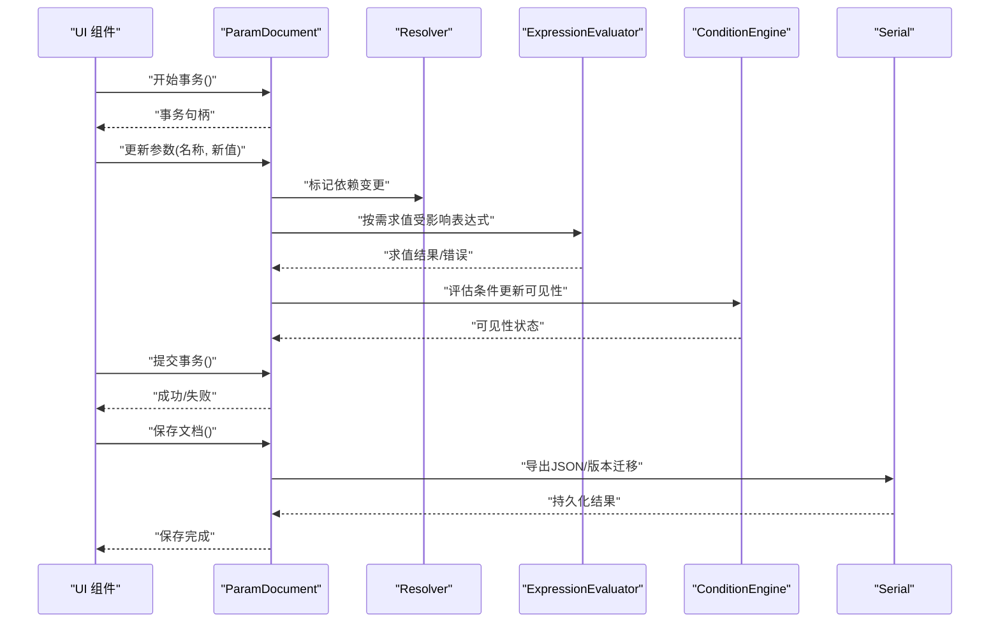
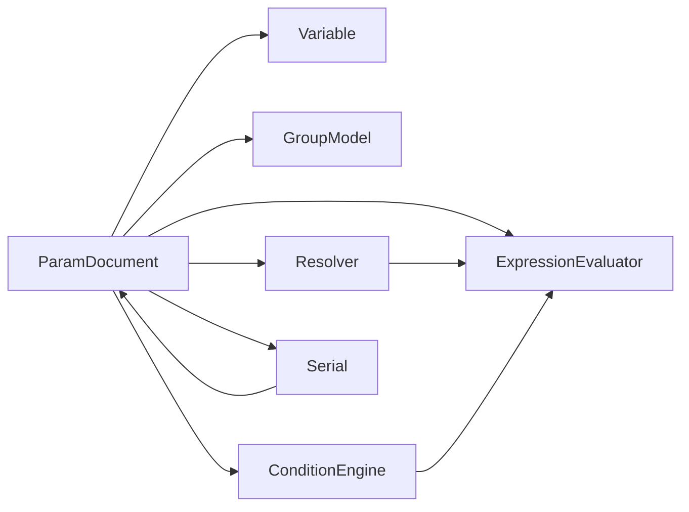

# 参数文档管理

<cite>
**本文档引用的文件**   
- [ParamDocument.h](file://src/parametric/ParamDocument.h)
- [ParamDocument.cpp](file://src/parametric/ParamDocument.cpp)
- [Variable.h](file://src/parametric/Variable.h)
- [GroupModel.h](file://src/parametric/GroupModel.h)
- [GroupModel.cpp](file://src/parametric/GroupModel.cpp)
- [Resolver.h](file://src/parametric/Resolver.h)
- [Resolver.cpp](file://src/parametric/Resolver.cpp)
- [Serial.h](file://src/parametric/Serial.h)
- [Serial.cpp](file://src/parametric/Serial.cpp)
- [ExpressionEvaluator.h](file://src/parametric/ExpressionEvaluator.h)
- [ExpressionEvaluator.cpp](file://src/parametric/ExpressionEvaluator.cpp)
- [ConditionEngine.h](file://src/parametric/ConditionEngine.h)
- [ConditionEngine.cpp](file://src/parametric/ConditionEngine.cpp)
- [FormulaVariable.h](file://src/parametric/FormulaVariable.h)
- [Group.h](file://src/parametric/Group.h)
- [SidePanel.h](file://src/ui/SidePanel.h)
- [VariablePanel.h](file://src/ui/VariablePanel.h)
- [VariableCard.h](file://src/ui/VariableCard.h)
- [FormulaCard.h](file://src/ui/FormulaCard.h)
</cite>

## 目录
1. [简介](#简介)
2. [项目结构](#项目结构)
3. [核心组件](#核心组件)
4. [架构总览](#架构总览)
5. [详细组件分析](#详细组件分析)
6. [依赖关系分析](#依赖关系分析)
7. [性能考虑](#性能考虑)
8. [故障排查指南](#故障排查指南)
9. [结论](#结论)
10. [附录](#附录)

## 简介
本文件面向参数化引擎的“参数文档管理系统”，围绕 ParamDocument 类的设计模式与核心功能展开，系统阐述参数的注册、查找、更新与生命周期管理；说明文档的创建、保存、加载与版本控制机制；解释参数依赖关系的建立与维护策略；详述事务处理与回滚机制的实现要点；给出参数验证规则与错误处理策略；并梳理与 UI 层的交互接口和数据绑定机制。目标是帮助开发者快速理解并高效扩展该子系统。

## 项目结构
参数文档管理位于 parametric 模块中，以 ParamDocument 为核心，配合变量模型、解析器、表达式求值器、条件引擎以及序列化组件，形成完整的参数化数据管理与计算管线。UI 层通过面板与卡片组件与文档进行交互，实现可视化编辑与实时反馈。

图表来源
- [ParamDocument.h](file://src/parametric/ParamDocument.h)
- [ParamDocument.cpp](file://src/parametric/ParamDocument.cpp)
- [Variable.h](file://src/parametric/Variable.h)
- [GroupModel.h](file://src/parametric/GroupModel.h)
- [GroupModel.cpp](file://src/parametric/GroupModel.cpp)
- [Resolver.h](file://src/parametric/Resolver.h)
- [Resolver.cpp](file://src/parametric/Resolver.cpp)
- [ExpressionEvaluator.h](file://src/parametric/ExpressionEvaluator.h)
- [ExpressionEvaluator.cpp](file://src/parametric/ExpressionEvaluator.cpp)
- [ConditionEngine.h](file://src/parametric/ConditionEngine.h)
- [ConditionEngine.cpp](file://src/parametric/ConditionEngine.cpp)
- [Serial.h](file://src/parametric/Serial.h)
- [Serial.cpp](file://src/parametric/Serial.cpp)
- [SidePanel.h](file://src/ui/SidePanel.h)
- [VariablePanel.h](file://src/ui/VariablePanel.h)
- [VariableCard.h](file://src/ui/VariableCard.h)
- [FormulaCard.h](file://src/ui/FormulaCard.h)

章节来源
- [ParamDocument.h](file://src/parametric/ParamDocument.h)
- [ParamDocument.cpp](file://src/parametric/ParamDocument.cpp)
- [GroupModel.h](file://src/parametric/GroupModel.h)
- [GroupModel.cpp](file://src/parametric/GroupModel.cpp)
- [Resolver.h](file://src/parametric/Resolver.h)
- [Resolver.cpp](file://src/parametric/Resolver.cpp)
- [Serial.h](file://src/parametric/Serial.h)
- [Serial.cpp](file://src/parametric/Serial.cpp)
- [ExpressionEvaluator.h](file://src/parametric/ExpressionEvaluator.h)
- [ExpressionEvaluator.cpp](file://src/parametric/ExpressionEvaluator.cpp)
- [ConditionEngine.h](file://src/parametric/ConditionEngine.h)
- [ConditionEngine.cpp](file://src/parametric/ConditionEngine.cpp)
- [Variable.h](file://src/parametric/Variable.h)
- [FormulaVariable.h](file://src/parametric/FormulaVariable.h)
- [Group.h](file://src/parametric/Group.h)
- [SidePanel.h](file://src/ui/SidePanel.h)
- [VariablePanel.h](file://src/ui/VariablePanel.h)
- [VariableCard.h](file://src/ui/VariableCard.h)
- [FormulaCard.h](file://src/ui/FormulaCard.h)

## 核心组件
- ParamDocument：参数文档的核心控制器，负责参数（变量）的注册、查找、更新、生命周期管理，协调依赖解析、表达式求值、条件评估与序列化/反序列化，并提供事务与回滚能力。
- Variable：参数实体，包含名称、类型、默认值、当前值、可见性、约束等元数据，支持公式与条件。
- GroupModel：分组模型，组织参数为逻辑组，提供分组级别的可见性与批量操作。
- Resolver：依赖解析器，维护参数间的依赖图，计算求值顺序，检测循环依赖。
- ExpressionEvaluator：表达式求值器，安全地执行参数表达式，支持函数与常量。
- ConditionEngine：条件引擎，基于布尔表达式控制参数可见性或有效性。
- Serial：序列化组件，负责文档的持久化（创建、保存、加载）与版本兼容。

章节来源
- [ParamDocument.h](file://src/parametric/ParamDocument.h)
- [ParamDocument.cpp](file://src/parametric/ParamDocument.cpp)
- [Variable.h](file://src/parametric/Variable.h)
- [GroupModel.h](file://src/parametric/GroupModel.h)
- [GroupModel.cpp](file://src/parametric/GroupModel.cpp)
- [Resolver.h](file://src/parametric/Resolver.h)
- [Resolver.cpp](file://src/parametric/Resolver.cpp)
- [ExpressionEvaluator.h](file://src/parametric/ExpressionEvaluator.h)
- [ExpressionEvaluator.cpp](file://src/parametric/ExpressionEvaluator.cpp)
- [ConditionEngine.h](file://src/parametric/ConditionEngine.h)
- [ConditionEngine.cpp](file://src/parametric/ConditionEngine.cpp)
- [Serial.h](file://src/parametric/Serial.h)
- [Serial.cpp](file://src/parametric/Serial.cpp)

## 架构总览
ParamDocument 作为中枢，将参数模型、依赖解析、表达式求值、条件评估与序列化整合在一起，形成“数据—计算—持久化”闭环。UI 层通过事件与信号槽与 ParamDocument 交互，实现双向数据绑定与即时刷新。

图表来源
- [ParamDocument.h](file://src/parametric/ParamDocument.h)
- [ParamDocument.cpp](file://src/parametric/ParamDocument.cpp)
- [Variable.h](file://src/parametric/Variable.h)
- [GroupModel.h](file://src/parametric/GroupModel.h)
- [GroupModel.cpp](file://src/parametric/GroupModel.cpp)
- [Resolver.h](file://src/parametric/Resolver.h)
- [Resolver.cpp](file://src/parametric/Resolver.cpp)
- [ExpressionEvaluator.h](file://src/parametric/ExpressionEvaluator.h)
- [ExpressionEvaluator.cpp](file://src/parametric/ExpressionEvaluator.cpp)
- [ConditionEngine.h](file://src/parametric/ConditionEngine.h)
- [ConditionEngine.cpp](file://src/parametric/ConditionEngine.cpp)
- [Serial.h](file://src/parametric/Serial.h)
- [Serial.cpp](file://src/parametric/Serial.cpp)

## 详细组件分析

### ParamDocument 设计与核心功能
- 设计模式
  - 门面模式：对外暴露统一的参数注册、查找、更新、保存、加载接口，隐藏内部复杂流程。
  - 观察者模式：参数变更时发出信号，驱动 UI 与下游计算。
  - 命令/事务模式：批量修改通过事务封装，支持提交与回滚。
- 核心功能
  - 参数注册：校验唯一性、类型、默认值与约束，初始化可见性与状态。
  - 参数查找：按名称或分组定位，返回可观察引用。
  - 参数更新：写入新值后触发依赖解析与表达式求值，必要时更新可见性。
  - 生命周期管理：创建、激活、冻结、销毁阶段钩子，确保资源清理与一致性。
  - 依赖维护：增量更新依赖图，避免全量重算。
  - 事务与回滚：记录快照，提交时应用变更，回滚时恢复状态。
  - 持久化：序列化文档结构与参数状态，支持版本迁移。

图表来源
- [ParamDocument.h](file://src/parametric/ParamDocument.h)
- [ParamDocument.cpp](file://src/parametric/ParamDocument.cpp)
- [Resolver.h](file://src/parametric/Resolver.h)
- [Resolver.cpp](file://src/parametric/Resolver.cpp)
- [ExpressionEvaluator.h](file://src/parametric/ExpressionEvaluator.h)
- [ExpressionEvaluator.cpp](file://src/parametric/ExpressionEvaluator.cpp)
- [ConditionEngine.h](file://src/parametric/ConditionEngine.h)
- [ConditionEngine.cpp](file://src/parametric/ConditionEngine.cpp)
- [Serial.h](file://src/parametric/Serial.h)
- [Serial.cpp](file://src/parametric/Serial.cpp)

章节来源
- [ParamDocument.h](file://src/parametric/ParamDocument.h)
- [ParamDocument.cpp](file://src/parametric/ParamDocument.cpp)

### 参数注册、查找、更新与生命周期
- 注册流程
  - 校验名称唯一性、类型合法性、默认值范围与约束。
  - 初始化可见性（基于初始条件）、状态（有效/无效/冻结）。
  - 加入分组模型，建立分组索引。
- 查找策略
  - 按名称精确匹配，支持前缀模糊搜索。
  - 按分组过滤，返回可观察引用以便 UI 绑定。
- 更新策略
  - 写入新值后，标记受影响的依赖节点。
  - 触发表达式求值与条件评估，更新可见性与有效性。
  - 若处于事务中，暂存变更快照；提交时批量应用。
- 生命周期
  - 创建：分配内存、注册到全局索引、初始化依赖图。
  - 激活：启用求值与条件评估。
  - 冻结：暂停自动重算，允许批量修改。
  - 销毁：释放资源、移除依赖边、清理缓存。

章节来源
- [ParamDocument.h](file://src/parametric/ParamDocument.h)
- [ParamDocument.cpp](file://src/parametric/ParamDocument.cpp)
- [Variable.h](file://src/parametric/Variable.h)
- [GroupModel.h](file://src/parametric/GroupModel.h)
- [GroupModel.cpp](file://src/parametric/GroupModel.cpp)

### 文档创建、保存、加载与版本控制
- 创建
  - 初始化空文档结构，设置默认分组与命名空间。
  - 生成唯一文档 ID，准备版本元数据。
- 保存
  - 序列化参数集合、分组结构、条件与公式。
  - 写入版本信息，生成校验和。
- 加载
  - 读取 JSON/XML，校验版本兼容性。
  - 执行版本迁移脚本，补齐缺失字段。
  - 重建依赖图与求值缓存。
- 版本控制
  - 语义化版本号，向后兼容策略。
  - 迁移路径：旧版本→新版本逐步升级。
  - 冲突解决：字段重命名、类型转换、默认值填充。

章节来源
- [Serial.h](file://src/parametric/Serial.h)
- [Serial.cpp](file://src/parametric/Serial.cpp)
- [ParamDocument.h](file://src/parametric/ParamDocument.h)
- [ParamDocument.cpp](file://src/parametric/ParamDocument.cpp)

### 参数依赖关系的建立与维护
- 依赖建模
  - 有向无环图（DAG），节点为参数，边表示依赖关系。
  - 支持多对多依赖，跨分组引用。
- 建立策略
  - 解析表达式中的变量引用，动态构建边。
  - 条件表达式影响可见性依赖。
- 维护策略
  - 增量更新：仅重新计算受影响子树。
  - 循环依赖检测：拓扑排序失败时报错。
  - 缓存失效：参数变更使下游缓存失效。

章节来源
- [Resolver.h](file://src/parametric/Resolver.h)
- [Resolver.cpp](file://src/parametric/Resolver.cpp)
- [ExpressionEvaluator.h](file://src/parametric/ExpressionEvaluator.h)
- [ExpressionEvaluator.cpp](file://src/parametric/ExpressionEvaluator.cpp)
- [ConditionEngine.h](file://src/parametric/ConditionEngine.h)
- [ConditionEngine.cpp](file://src/parametric/ConditionEngine.cpp)

### 事务处理与回滚机制
- 事务模型
  - 开始事务：创建快照、禁用自动重算。
  - 批量更新：记录变更日志，累积依赖变更。
  - 提交事务：应用变更、重建依赖、触发求值。
  - 回滚事务：恢复快照、撤销变更、恢复状态。
- 实现要点
  - 深拷贝关键数据结构（参数值、可见性、依赖边）。
  - 原子性：提交或回滚保证一致状态。
  - 并发安全：线程锁保护共享状态。

章节来源
- [ParamDocument.h](file://src/parametric/ParamDocument.h)
- [ParamDocument.cpp](file://src/parametric/ParamDocument.cpp)

### 参数验证规则与错误处理策略
- 验证规则
  - 类型检查：数值、字符串、布尔、枚举等。
  - 范围约束：最小值、最大值、步长。
  - 格式校验：正则表达式、单位换算。
  - 依赖约束：必填项、互斥项、联动项。
- 错误处理
  - 局部错误：单个参数失败不影响整体事务。
  - 全局错误：依赖冲突、循环依赖导致回滚。
  - 用户提示：错误消息本地化，定位问题参数。

章节来源
- [ParamDocument.h](file://src/parametric/ParamDocument.h)
- [ParamDocument.cpp](file://src/parametric/ParamDocument.cpp)
- [ExpressionEvaluator.h](file://src/parametric/ExpressionEvaluator.h)
- [ExpressionEvaluator.cpp](file://src/parametric/ExpressionEvaluator.cpp)
- [ConditionEngine.h](file://src/parametric/ConditionEngine.h)
- [ConditionEngine.cpp](file://src/parametric/ConditionEngine.cpp)

### 与 UI 层的交互接口与数据绑定
- 交互接口
  - 信号槽：参数变更、可见性变化、错误状态。
  - 命令模式：UI 发起编辑命令，由 ParamDocument 执行。
- 数据绑定
  - 单向绑定：文档→UI 显示。
  - 双向绑定：UI 输入→文档更新→重算→UI 刷新。
- UI 组件
  - SidePanel：容器，承载 VariablePanel。
  - VariablePanel：展示参数列表，支持分组筛选。
  - VariableCard：单参数编辑卡片，显示值、约束、错误。
  - FormulaCard：公式编辑器，支持语法高亮与预览。

章节来源
- [SidePanel.h](file://src/ui/SidePanel.h)
- [VariablePanel.h](file://src/ui/VariablePanel.h)
- [VariableCard.h](file://src/ui/VariableCard.h)
- [FormulaCard.h](file://src/ui/FormulaCard.h)
- [ParamDocument.h](file://src/parametric/ParamDocument.h)
- [ParamDocument.cpp](file://src/parametric/ParamDocument.cpp)

## 依赖关系分析
ParamDocument 与各组件之间的耦合度较低，职责清晰，便于独立测试与替换实现。Resolver 与 ExpressionEvaluator 解耦，前者负责顺序，后者专注求值。ConditionEngine 独立评估条件，不干扰主计算流。Serial 提供纯数据交换，不侵入业务逻辑。

图表来源
- [ParamDocument.h](file://src/parametric/ParamDocument.h)
- [ParamDocument.cpp](file://src/parametric/ParamDocument.cpp)
- [Variable.h](file://src/parametric/Variable.h)
- [GroupModel.h](file://src/parametric/GroupModel.h)
- [GroupModel.cpp](file://src/parametric/GroupModel.cpp)
- [Resolver.h](file://src/parametric/Resolver.h)
- [Resolver.cpp](file://src/parametric/Resolver.cpp)
- [ExpressionEvaluator.h](file://src/parametric/ExpressionEvaluator.h)
- [ExpressionEvaluator.cpp](file://src/parametric/ExpressionEvaluator.cpp)
- [ConditionEngine.h](file://src/parametric/ConditionEngine.h)
- [ConditionEngine.cpp](file://src/parametric/ConditionEngine.cpp)
- [Serial.h](file://src/parametric/Serial.h)
- [Serial.cpp](file://src/parametric/Serial.cpp)

章节来源
- [ParamDocument.h](file://src/parametric/ParamDocument.h)
- [ParamDocument.cpp](file://src/parametric/ParamDocument.cpp)
- [Resolver.h](file://src/parametric/Resolver.h)
- [Resolver.cpp](file://src/parametric/Resolver.cpp)
- [ExpressionEvaluator.h](file://src/parametric/ExpressionEvaluator.h)
- [ExpressionEvaluator.cpp](file://src/parametric/ExpressionEvaluator.cpp)
- [ConditionEngine.h](file://src/parametric/ConditionEngine.h)
- [ConditionEngine.cpp](file://src/parametric/ConditionEngine.cpp)
- [Serial.h](file://src/parametric/Serial.h)
- [Serial.cpp](file://src/parametric/Serial.cpp)

## 性能考虑
- 增量重算：仅更新受影响参数，避免全量遍历。
- 缓存策略：表达式结果缓存，依赖变更时失效。
- 懒加载：大文档分块加载，按需解析依赖。
- 异步求值：后台线程执行复杂表达式，UI 不阻塞。
- 内存管理：对象池复用频繁创建的对象，减少 GC 压力。

[本节为通用指导，不直接分析具体文件]

## 故障排查指南
- 常见问题
  - 循环依赖：检查表达式引用链，使用拓扑排序工具定位环。
  - 表达式求值失败：查看错误日志，确认变量存在且类型正确。
  - 条件不可见：调试条件表达式，打印中间变量。
  - 序列化失败：校验 JSON 结构，检查版本迁移脚本。
- 调试技巧
  - 启用详细日志，记录依赖变更与求值过程。
  - 使用断点跟踪事务提交与回滚路径。
  - 单元测试覆盖边界条件与异常分支。

章节来源
- [ParamDocument.h](file://src/parametric/ParamDocument.h)
- [ParamDocument.cpp](file://src/parametric/ParamDocument.cpp)
- [Resolver.h](file://src/parametric/Resolver.h)
- [Resolver.cpp](file://src/parametric/Resolver.cpp)
- [ExpressionEvaluator.h](file://src/parametric/ExpressionEvaluator.h)
- [ExpressionEvaluator.cpp](file://src/parametric/ExpressionEvaluator.cpp)
- [ConditionEngine.h](file://src/parametric/ConditionEngine.h)
- [ConditionEngine.cpp](file://src/parametric/ConditionEngine.cpp)
- [Serial.h](file://src/parametric/Serial.h)
- [Serial.cpp](file://src/parametric/Serial.cpp)

## 结论
ParamDocument 通过清晰的分层与模块化设计，实现了参数化引擎的高效、可靠与可扩展的参数管理。其事务与回滚机制保障了数据一致性，依赖解析与表达式求值确保了计算的准确性，序列化与版本控制支撑了文档的持久化与演进。结合 UI 层的双向绑定，提供了友好的用户体验。建议在实际使用中遵循验证规则与错误处理策略，充分利用增量重算与缓存优化性能。

[本节为总结性内容，不直接分析具体文件]

## 附录
- 术语表
  - 参数：可配置的值，支持公式与条件。
  - 依赖：参数之间的引用关系。
  - 事务：一组原子操作的集合。
  - 序列化：将内存对象转换为可存储格式。
- 最佳实践
  - 合理划分分组，提升可维护性。
  - 避免深层嵌套依赖，保持 DAG 扁平化。
  - 使用事务批量更新，减少重算开销。
  - 编写单元测试，覆盖异常路径。

[本节为补充信息，不直接分析具体文件]