# 变量系统

<cite>
**本文引用的文件**   
- [Variable.h](file://src/parametric/Variable.h)
- [FormulaVariable.h](file://src/parametric/FormulaVariable.h)
- [ParamPoint.h](file://src/parametric/ParamPoint.h)
- [Resolver.h](file://src/parametric/Resolver.h)
- [ExpressionEvaluator.h](file://src/parametric/ExpressionEvaluator.h)
- [Serial.h](file://src/parametric/Serial.h)
- [Serial.cpp](file://src/parametric/Serial.cpp)
- [ConditionEngine.h](file://src/parametric/ConditionEngine.h)
- [ConditionEngine.cpp](file://src/parametric/ConditionEngine.cpp)
- [GroupModel.h](file://src/parametric/GroupModel.h)
- [GroupModel.cpp](file://src/parametric/GroupModel.cpp)
- [VariablePanel.h](file://src/ui/VariablePanel.h)
- [VariableCard.h](file://src/ui/VariableCard.h)
- [FormulaCard.h](file://src/ui/FormulaCard.h)
</cite>

## 目录
1. [简介](#简介)
2. [项目结构](#项目结构)
3. [核心组件](#核心组件)
4. [架构总览](#架构总览)
5. [详细组件分析](#详细组件分析)
6. [依赖关系分析](#依赖关系分析)
7. [性能考虑](#性能考虑)
8. [故障排查指南](#故障排查指南)
9. [结论](#结论)
10. [附录](#附录)

## 简介
本文件面向参数化引擎的“变量系统”，系统性阐述 Variable 基类设计、变量类型层次结构，以及 FormulaVariable（计算型变量）与 ParamPoint（几何点变量）的实现要点。文档覆盖变量的作用域、可见性与生命周期管理；值的获取、设置与监听机制；类型转换与校验规则；依赖关系的自动更新与通知；以及序列化与持久化支持。目标是帮助开发者快速理解并正确使用该变量系统，同时为后续扩展与维护提供权威参考。

## 项目结构
变量系统主要位于 parametric 模块中，UI 层通过面板和卡片对变量进行编辑与展示。关键文件分布如下：
- 变量基类与具体类型：Variable.h、FormulaVariable.h、ParamPoint.h
- 解析与表达式求值：Resolver.h、ExpressionEvaluator.h
- 条件与约束引擎：ConditionEngine.h/.cpp
- 分组模型与作用域：GroupModel.h/.cpp
- 序列化与持久化：Serial.h/.cpp
- UI 交互：VariablePanel.h、VariableCard.h、FormulaCard.h

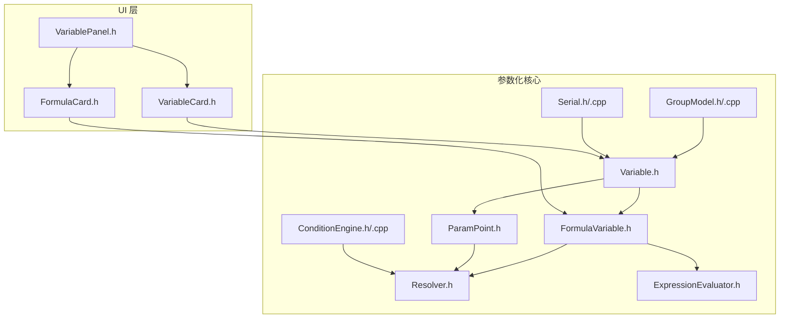

图表来源
- [Variable.h](file://src/parametric/Variable.h)
- [FormulaVariable.h](file://src/parametric/FormulaVariable.h)
- [ParamPoint.h](file://src/parametric/ParamPoint.h)
- [Resolver.h](file://src/parametric/Resolver.h)
- [ExpressionEvaluator.h](file://src/parametric/ExpressionEvaluator.h)
- [ConditionEngine.h](file://src/parametric/ConditionEngine.h)
- [ConditionEngine.cpp](file://src/parametric/ConditionEngine.cpp)
- [GroupModel.h](file://src/parametric/GroupModel.h)
- [GroupModel.cpp](file://src/parametric/GroupModel.cpp)
- [Serial.h](file://src/parametric/Serial.h)
- [Serial.cpp](file://src/parametric/Serial.cpp)
- [VariablePanel.h](file://src/ui/VariablePanel.h)
- [VariableCard.h](file://src/ui/VariableCard.h)
- [FormulaCard.h](file://src/ui/FormulaCard.h)

章节来源
- [Variable.h](file://src/parametric/Variable.h)
- [FormulaVariable.h](file://src/parametric/FormulaVariable.h)
- [ParamPoint.h](file://src/parametric/ParamPoint.h)
- [Resolver.h](file://src/parametric/Resolver.h)
- [ExpressionEvaluator.h](file://src/parametric/ExpressionEvaluator.h)
- [ConditionEngine.h](file://src/parametric/ConditionEngine.h)
- [ConditionEngine.cpp](file://src/parametric/ConditionEngine.cpp)
- [GroupModel.h](file://src/parametric/GroupModel.h)
- [GroupModel.cpp](file://src/parametric/GroupModel.cpp)
- [Serial.h](file://src/parametric/Serial.h)
- [Serial.cpp](file://src/parametric/Serial.cpp)
- [VariablePanel.h](file://src/ui/VariablePanel.h)
- [VariableCard.h](file://src/ui/VariableCard.h)
- [FormulaCard.h](file://src/ui/FormulaCard.h)

## 核心组件
- Variable 基类
  - 职责：定义所有变量的统一抽象，包括标识、名称、类型、可见性、作用域、变更通知、值访问与设置、依赖管理等。
  - 关键点：统一的接口用于派生类型（如 FormulaVariable、ParamPoint），并提供事件机制以驱动依赖图更新。
- FormulaVariable（计算变量）
  - 职责：基于表达式的计算型变量，维护表达式文本与依赖集合，在依赖变化时重新求值。
  - 关键点：表达式解析、求值缓存、错误传播、类型转换与校验。
- ParamPoint（几何点变量）
  - 职责：表示二维几何点，通常由 x/y 分量组成，支持坐标变换与几何约束。
  - 关键点：分量级读写、单位处理、几何一致性校验。
- Resolver（解析器）
  - 职责：负责变量名到实例的查找、作用域内可见性判定、循环依赖检测等。
- ExpressionEvaluator（表达式求值器）
  - 职责：将表达式字符串转换为可执行形式并求值，返回数值或几何结果。
- ConditionEngine（条件引擎）
  - 职责：评估条件表达式，影响变量的有效性或可见性，触发重算。
- GroupModel（分组模型）
  - 职责：组织变量的分组与作用域，控制可见性与批量操作。
- Serial（序列化）
  - 职责：将变量及其状态序列化为文档格式，支持导入导出与版本兼容。

章节来源
- [Variable.h](file://src/parametric/Variable.h)
- [FormulaVariable.h](file://src/parametric/FormulaVariable.h)
- [ParamPoint.h](file://src/parametric/ParamPoint.h)
- [Resolver.h](file://src/parametric/Resolver.h)
- [ExpressionEvaluator.h](file://src/parametric/ExpressionEvaluator.h)
- [ConditionEngine.h](file://src/parametric/ConditionEngine.h)
- [ConditionEngine.cpp](file://src/parametric/ConditionEngine.cpp)
- [GroupModel.h](file://src/parametric/GroupModel.h)
- [GroupModel.cpp](file://src/parametric/GroupModel.cpp)
- [Serial.h](file://src/parametric/Serial.h)
- [Serial.cpp](file://src/parametric/Serial.cpp)

## 架构总览
变量系统的核心是“变量—解析—求值—条件—分组—序列化”的协作链。Variable 作为基类提供统一接口；FormulaVariable 与 ParamPoint 实现具体语义；Resolver 与 ExpressionEvaluator 支撑表达式求值；ConditionEngine 驱动条件逻辑；GroupModel 管理作用域与可见性；Serial 完成持久化。

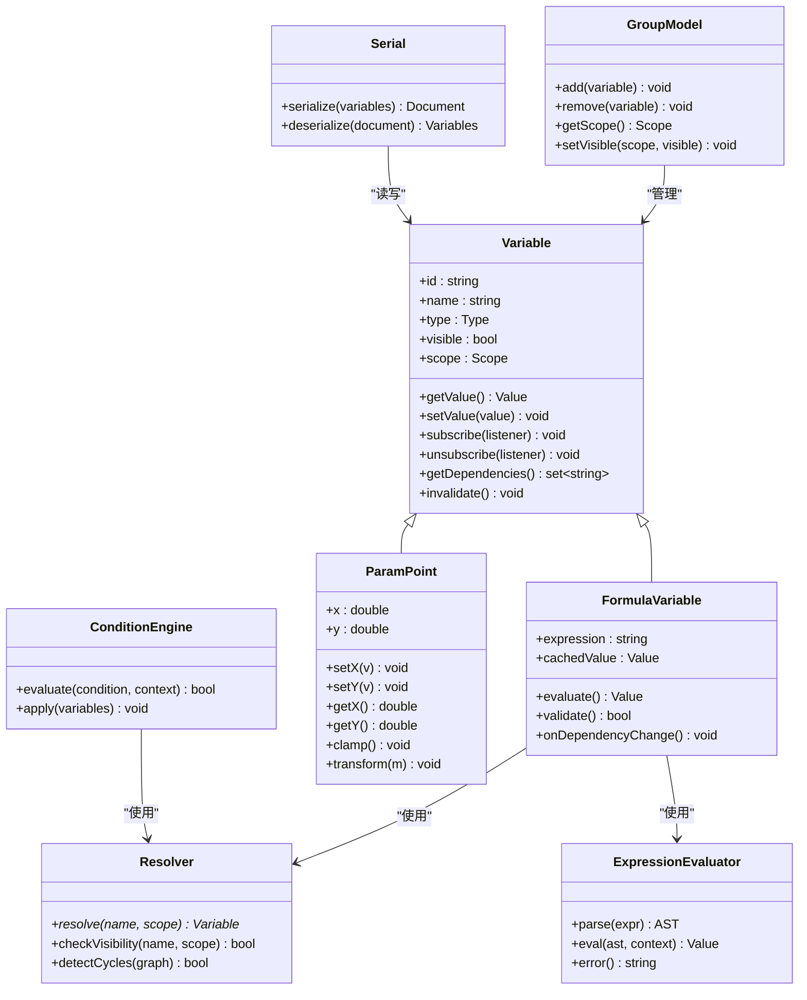

图表来源
- [Variable.h](file://src/parametric/Variable.h)
- [FormulaVariable.h](file://src/parametric/FormulaVariable.h)
- [ParamPoint.h](file://src/parametric/ParamPoint.h)
- [Resolver.h](file://src/parametric/Resolver.h)
- [ExpressionEvaluator.h](file://src/parametric/ExpressionEvaluator.h)
- [ConditionEngine.h](file://src/parametric/ConditionEngine.h)
- [ConditionEngine.cpp](file://src/parametric/ConditionEngine.cpp)
- [GroupModel.h](file://src/parametric/GroupModel.h)
- [GroupModel.cpp](file://src/parametric/GroupModel.cpp)
- [Serial.h](file://src/parametric/Serial.h)
- [Serial.cpp](file://src/parametric/Serial.cpp)

## 详细组件分析

### Variable 基类设计与层次结构
- 设计要点
  - 统一标识与命名：每个变量具备唯一 id 与可读 name，便于 UI 显示与调试。
  - 类型系统：Type 枚举区分数值、几何点、布尔、字符串等，决定取值与转换策略。
  - 作用域与可见性：Scope 限定变量可见范围；visible 标志控制是否参与计算与显示。
  - 变更通知：通过订阅者模式暴露 subscribe/unsubscribe，供 UI 与依赖图更新使用。
  - 依赖管理：getDependencies 返回直接依赖集合，invalidate 触发重算。
- 层次结构
  - Variable 为抽象基类，FormulaVariable 与 ParamPoint 继承自它，分别承载表达式与几何语义。

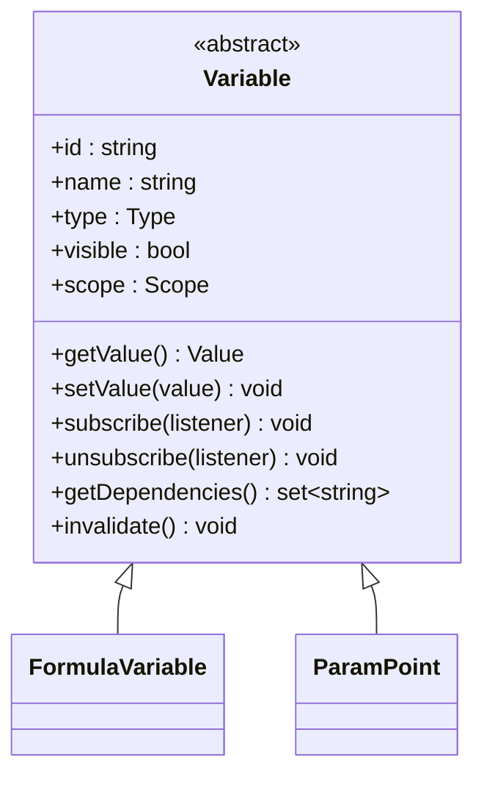

图表来源
- [Variable.h](file://src/parametric/Variable.h)
- [FormulaVariable.h](file://src/parametric/FormulaVariable.h)
- [ParamPoint.h](file://src/parametric/ParamPoint.h)

章节来源
- [Variable.h](file://src/parametric/Variable.h)

### FormulaVariable 计算变量实现细节
- 表达式与依赖
  - expression 保存原始表达式文本；解析阶段构建依赖集合，记录引用到的变量名。
  - evaluate 根据当前上下文求值，并将结果缓存于 cachedValue，避免重复计算。
- 类型转换与校验
  - validate 检查表达式语法与类型兼容性；若失败则标记无效，并通过通知机制上报错误。
  - setValue 仅允许对常量型变量赋值；对表达式变量应拒绝或转为常量。
- 依赖更新与通知
  - onDependencyChange 在依赖变量失效时被调用，触发重新解析与求值。
  - 通过 subscribe 向 UI 推送值变化，保证界面实时刷新。

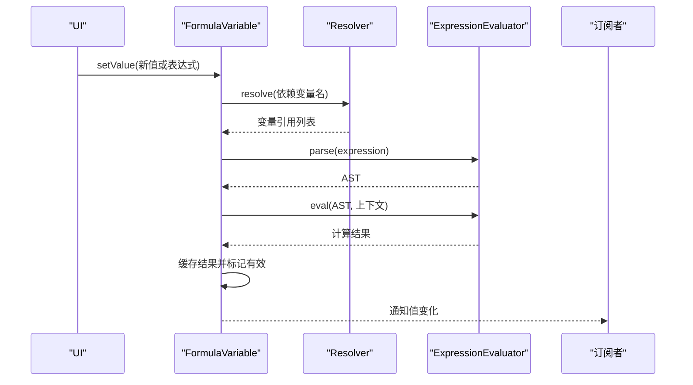

图表来源
- [FormulaVariable.h](file://src/parametric/FormulaVariable.h)
- [Resolver.h](file://src/parametric/Resolver.h)
- [ExpressionEvaluator.h](file://src/parametric/ExpressionEvaluator.h)

章节来源
- [FormulaVariable.h](file://src/parametric/FormulaVariable.h)
- [Resolver.h](file://src/parametric/Resolver.h)
- [ExpressionEvaluator.h](file://src/parametric/ExpressionEvaluator.h)

### ParamPoint 几何点变量实现细节
- 数据结构
  - 包含 x、y 两个分量，支持单位换算与坐标变换。
- 行为特性
  - setX/setY 提供分量级写入；getX/getY 读取当前值。
  - clamp 确保坐标落在合理范围内；transform 应用仿射变换矩阵。
- 与解析器的协作
  - 当表达式引用 ParamPoint 的分量时，Resolver 需能定位到对应变量与字段。
  - 分量变化触发 invalidate，带动依赖该点的表达式重算。

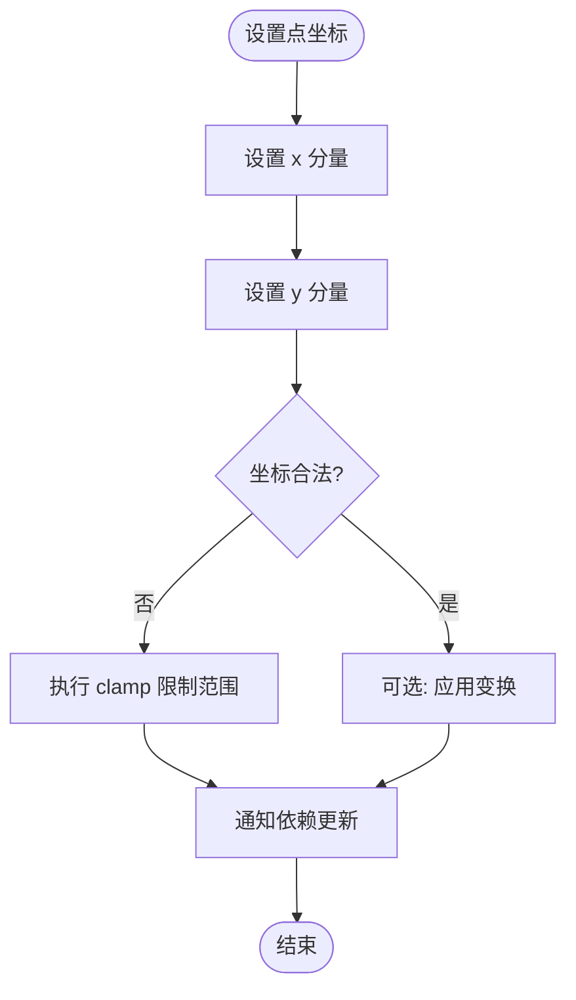

图表来源
- [ParamPoint.h](file://src/parametric/ParamPoint.h)
- [Resolver.h](file://src/parametric/Resolver.h)

章节来源
- [ParamPoint.h](file://src/parametric/ParamPoint.h)
- [Resolver.h](file://src/parametric/Resolver.h)

### 作用域、可见性与生命周期管理
- 作用域（Scope）
  - 由 GroupModel 管理，变量加入分组后获得作用域；跨作用域的访问需显式引用或通过全局可见性。
- 可见性（Visible）
  - visible 标志控制变量是否参与计算与 UI 展示；ConditionEngine 可根据条件动态调整可见性。
- 生命周期
  - 创建：注册到 GroupModel，分配 id/name，初始化默认值。
  - 运行：响应依赖变化，执行求值与通知。
  - 销毁：从分组移除，取消订阅，释放资源。

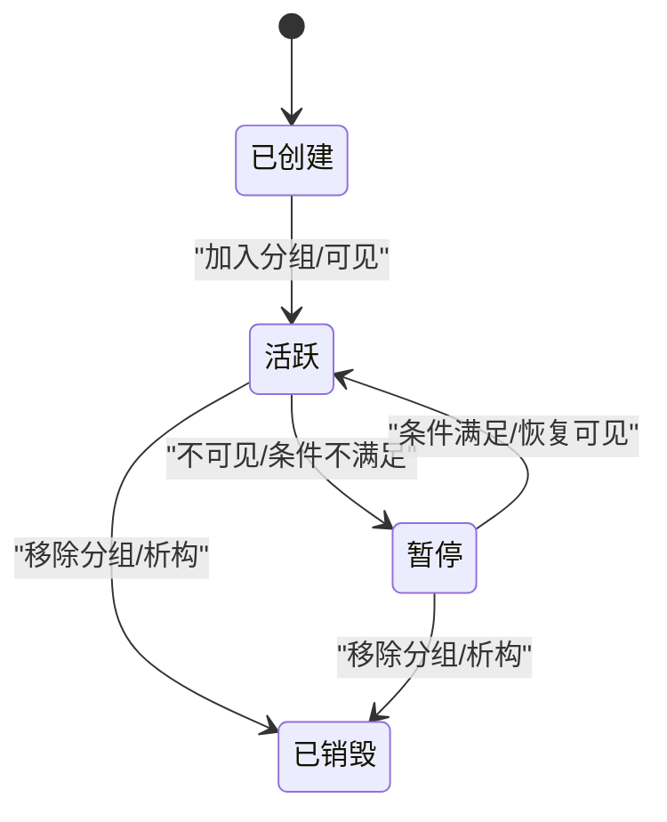

图表来源
- [GroupModel.h](file://src/parametric/GroupModel.h)
- [GroupModel.cpp](file://src/parametric/GroupModel.cpp)
- [ConditionEngine.h](file://src/parametric/ConditionEngine.h)
- [ConditionEngine.cpp](file://src/parametric/ConditionEngine.cpp)

章节来源
- [GroupModel.h](file://src/parametric/GroupModel.h)
- [GroupModel.cpp](file://src/parametric/GroupModel.cpp)
- [ConditionEngine.h](file://src/parametric/ConditionEngine.h)
- [ConditionEngine.cpp](file://src/parametric/ConditionEngine.cpp)

### 值的获取、设置与监听机制
- 获取与设置
  - getValue/setValue 提供统一接口；FormulaVariable 的 setValue 可能受限于只读表达式。
  - ParamPoint 提供分量级 setter，便于细粒度更新。
- 监听机制
  - subscribe/unsubscribe 允许 UI 或其他组件订阅变量变化；内部通过事件队列派发，避免递归更新。
  - 条件引擎与分组模型也可作为监听者，驱动可见性与有效性更新。

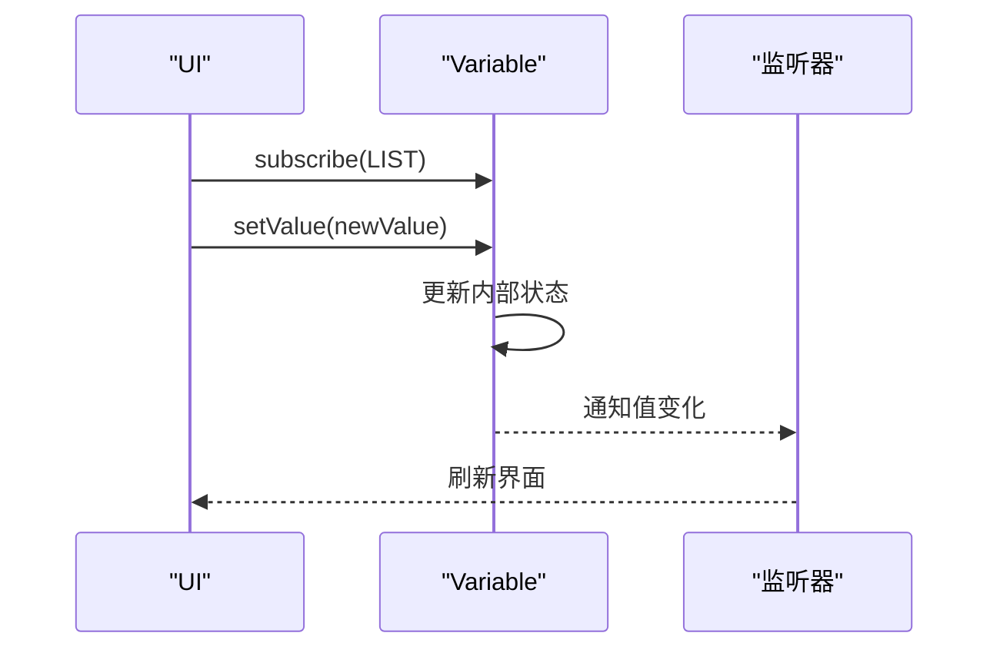

图表来源
- [Variable.h](file://src/parametric/Variable.h)
- [VariableCard.h](file://src/ui/VariableCard.h)
- [FormulaCard.h](file://src/ui/FormulaCard.h)

章节来源
- [Variable.h](file://src/parametric/Variable.h)
- [VariableCard.h](file://src/ui/VariableCard.h)
- [FormulaCard.h](file://src/ui/FormulaCard.h)

### 类型转换与验证规则
- 类型系统
  - Type 枚举涵盖数值、几何点、布尔、字符串等；不同类别具有不同的转换策略。
- 转换规则
  - 数值到几何点：按分量映射；几何点到数值：取模长或投影。
  - 字符串到数值：解析数字；失败则报错并标记无效。
- 验证流程
  - FormulaVariable.validate 检查表达式合法性与类型匹配；ParamPoint.clamp 确保坐标范围。
  - 验证失败时，通过通知机制告知 UI 与依赖方。

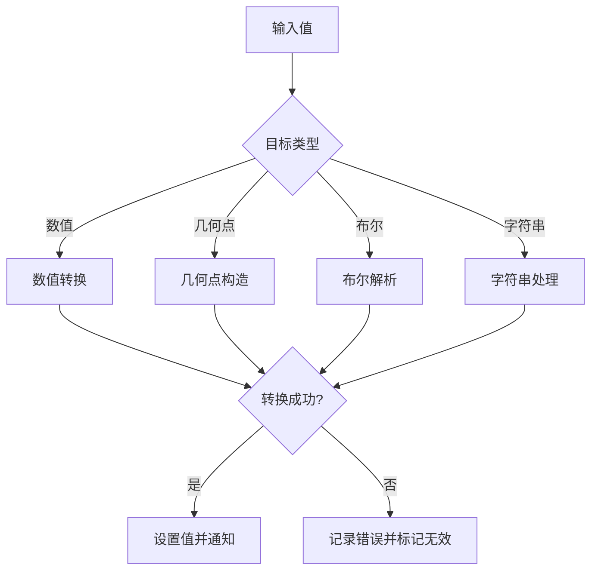

图表来源
- [Variable.h](file://src/parametric/Variable.h)
- [FormulaVariable.h](file://src/parametric/FormulaVariable.h)
- [ParamPoint.h](file://src/parametric/ParamPoint.h)

章节来源
- [Variable.h](file://src/parametric/Variable.h)
- [FormulaVariable.h](file://src/parametric/FormulaVariable.h)
- [ParamPoint.h](file://src/parametric/ParamPoint.h)

### 依赖关系的自动更新与通知机制
- 依赖收集
  - FormulaVariable 在解析表达式时收集依赖变量名；Resolver 将其映射为实际变量指针。
- 更新策略
  - 依赖变量 invalidate 时，FormulaVariable 被标记脏数据；下次求值前重新计算。
  - 条件引擎评估条件后，可能改变变量可见性或有效性，触发连锁更新。
- 通知路径
  - 变量值变化 -> 订阅者回调 -> UI 刷新；条件变化 -> 可见性更新 -> 分组模型同步。

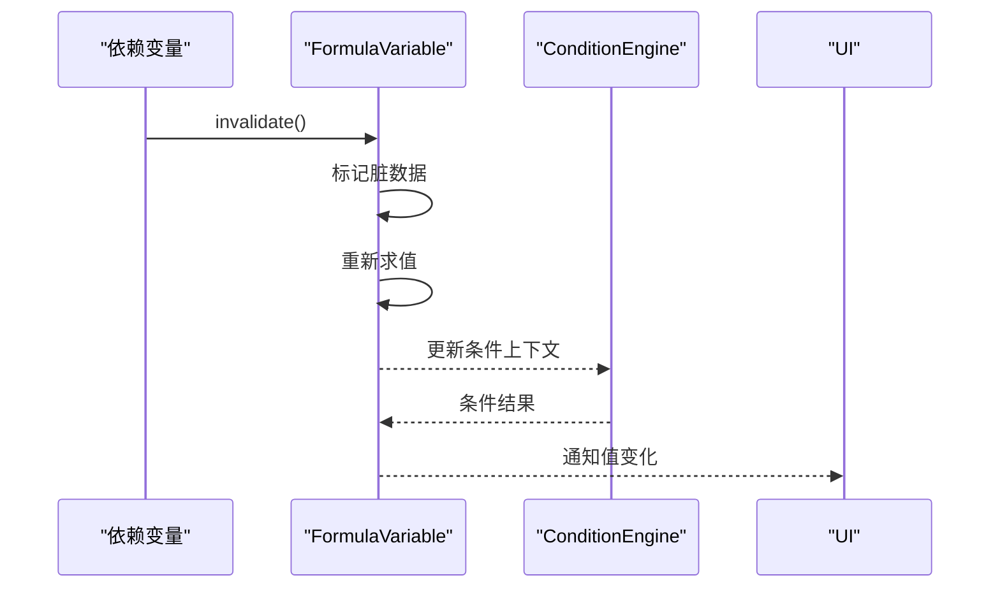

图表来源
- [FormulaVariable.h](file://src/parametric/FormulaVariable.h)
- [ConditionEngine.h](file://src/parametric/ConditionEngine.h)
- [ConditionEngine.cpp](file://src/parametric/ConditionEngine.cpp)

章节来源
- [FormulaVariable.h](file://src/parametric/FormulaVariable.h)
- [ConditionEngine.h](file://src/parametric/ConditionEngine.h)
- [ConditionEngine.cpp](file://src/parametric/ConditionEngine.cpp)

### 序列化与持久化支持
- 序列化内容
  - 变量 id、name、type、value、expression（如适用）、visible、scope 引用等。
- 版本兼容
  - Serial 支持字段增删与类型迁移；旧文档导入时进行适配。
- 导入导出流程
  - 导出：遍历分组中的变量，生成文档结构；导入：解析文档，重建变量与依赖图。

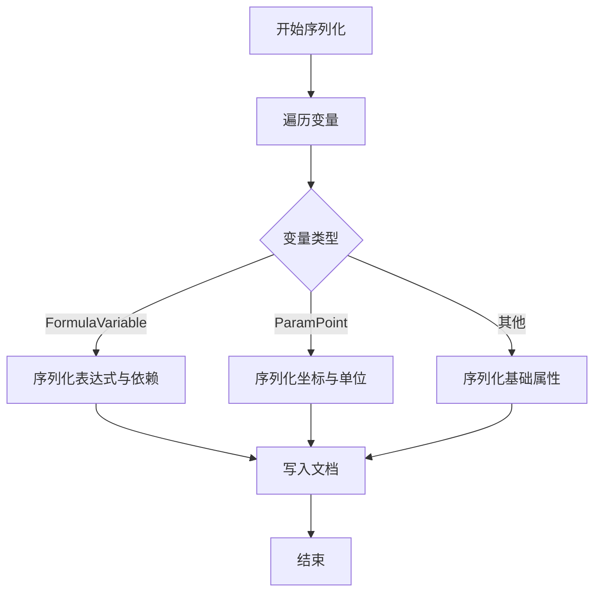

图表来源
- [Serial.h](file://src/parametric/Serial.h)
- [Serial.cpp](file://src/parametric/Serial.cpp)
- [GroupModel.h](file://src/parametric/GroupModel.h)

章节来源
- [Serial.h](file://src/parametric/Serial.h)
- [Serial.cpp](file://src/parametric/Serial.cpp)
- [GroupModel.h](file://src/parametric/GroupModel.h)

## 依赖关系分析
变量系统的关键依赖如下：
- FormulaVariable 依赖 Resolver 与 ExpressionEvaluator 完成表达式解析与求值。
- ParamPoint 依赖 Resolver 进行分量引用解析。
- ConditionEngine 依赖 Resolver 获取上下文变量，影响变量可见性与有效性。
- GroupModel 管理变量集合与作用域，控制可见性与批量操作。
- Serial 依赖变量接口进行序列化与反序列化。

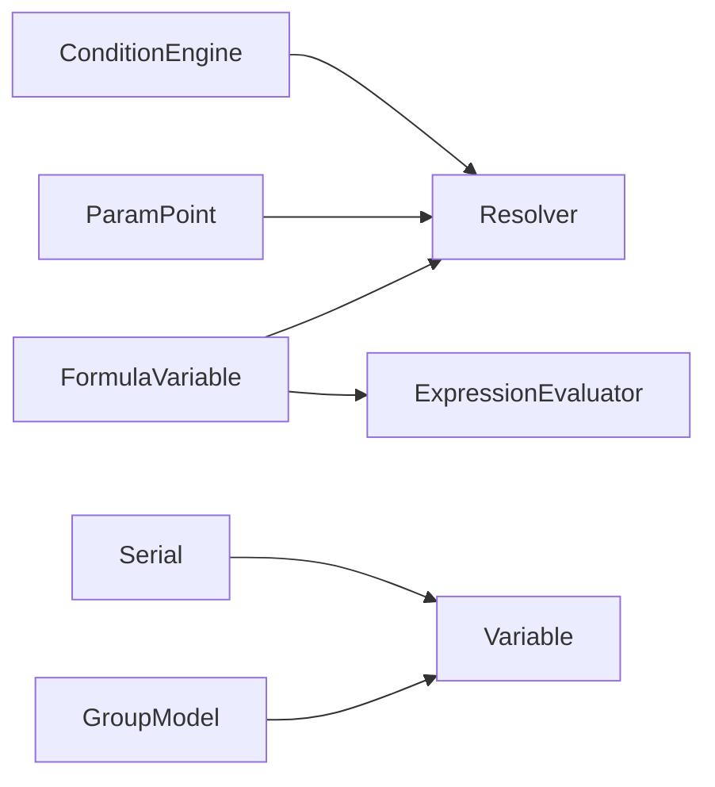

图表来源
- [FormulaVariable.h](file://src/parametric/FormulaVariable.h)
- [ParamPoint.h](file://src/parametric/ParamPoint.h)
- [Resolver.h](file://src/parametric/Resolver.h)
- [ExpressionEvaluator.h](file://src/parametric/ExpressionEvaluator.h)
- [ConditionEngine.h](file://src/parametric/ConditionEngine.h)
- [GroupModel.h](file://src/parametric/GroupModel.h)
- [Serial.h](file://src/parametric/Serial.h)

章节来源
- [FormulaVariable.h](file://src/parametric/FormulaVariable.h)
- [ParamPoint.h](file://src/parametric/ParamPoint.h)
- [Resolver.h](file://src/parametric/Resolver.h)
- [ExpressionEvaluator.h](file://src/parametric/ExpressionEvaluator.h)
- [ConditionEngine.h](file://src/parametric/ConditionEngine.h)
- [GroupModel.h](file://src/parametric/GroupModel.h)
- [Serial.h](file://src/parametric/Serial.h)

## 性能考虑
- 求值缓存：FormulaVariable 缓存最近一次求值结果，减少重复计算。
- 增量更新：仅对脏标记的变量进行重算，避免全量刷新。
- 订阅去抖：UI 订阅者在高频更新场景下合并通知，降低渲染压力。
- 解析优化：表达式 AST 复用，避免频繁解析相同表达式。
- 内存管理：及时释放不再使用的变量与订阅者，防止内存泄漏。

[本节为通用指导，无需特定文件来源]

## 故障排查指南
- 常见问题
  - 表达式解析失败：检查语法与变量名拼写；查看错误信息并修正。
  - 循环依赖：Resolver 检测到环时阻止求值；重构依赖图消除环。
  - 类型不匹配：确认表达式返回值与目标变量类型一致；必要时添加转换。
  - 可见性问题：检查条件引擎与分组模型的可见性设置。
- 调试建议
  - 启用日志输出，跟踪变量变化与求值过程。
  - 使用 UI 面板（VariablePanel、VariableCard、FormulaCard）观察变量状态。
  - 逐步缩小问题范围，隔离单个变量进行验证。

章节来源
- [VariablePanel.h](file://src/ui/VariablePanel.h)
- [VariableCard.h](file://src/ui/VariableCard.h)
- [FormulaCard.h](file://src/ui/FormulaCard.h)
- [Resolver.h](file://src/parametric/Resolver.h)
- [ConditionEngine.h](file://src/parametric/ConditionEngine.h)

## 结论
变量系统以 Variable 基类为核心，通过 FormulaVariable 与 ParamPoint 实现计算与几何语义，结合 Resolver、ExpressionEvaluator、ConditionEngine、GroupModel 与 Serial 形成完整的参数化引擎支撑。其设计强调统一接口、清晰的作用域与可见性、高效的依赖更新与通知机制，以及完善的序列化支持。遵循本文档的实践建议，可有效提升开发效率与系统稳定性。

[本节为总结，无需特定文件来源]

## 附录
- 术语表
  - 作用域（Scope）：变量可见与访问的范围。
  - 可见性（Visible）：变量是否参与计算与显示。
  - 依赖（Dependency）：变量之间因表达式或几何关系形成的引用。
  - 订阅（Subscribe）：监听变量变化的机制。
  - 序列化（Serialize）：将变量状态转换为可存储格式。

[本节为概念说明，无需特定文件来源]