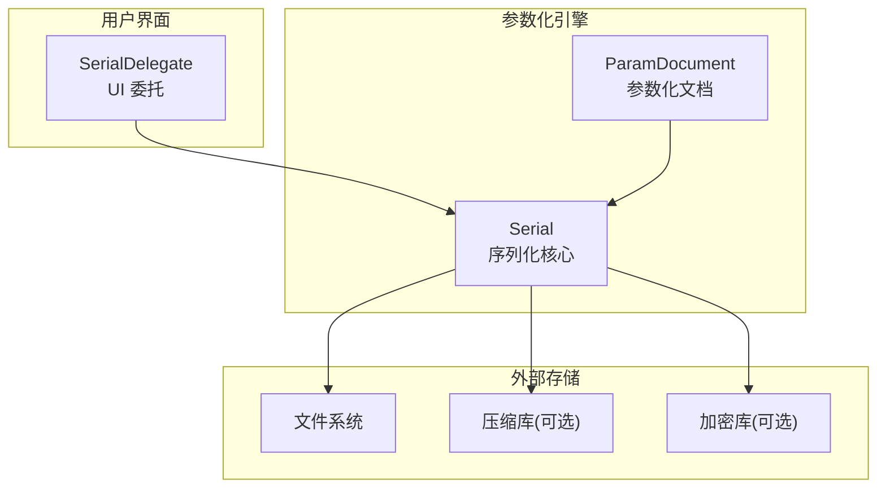
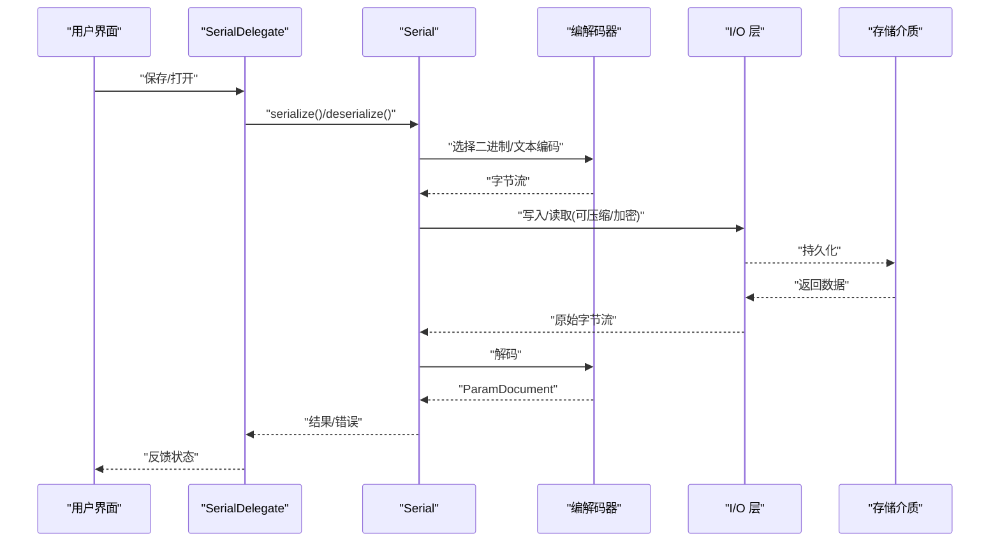
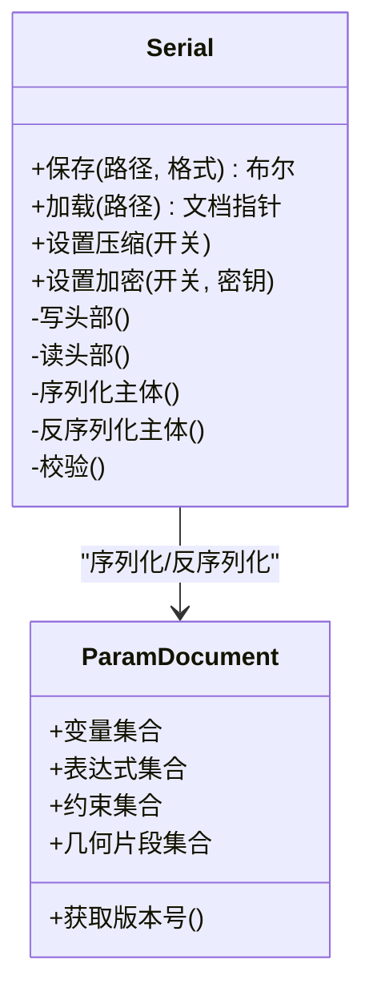
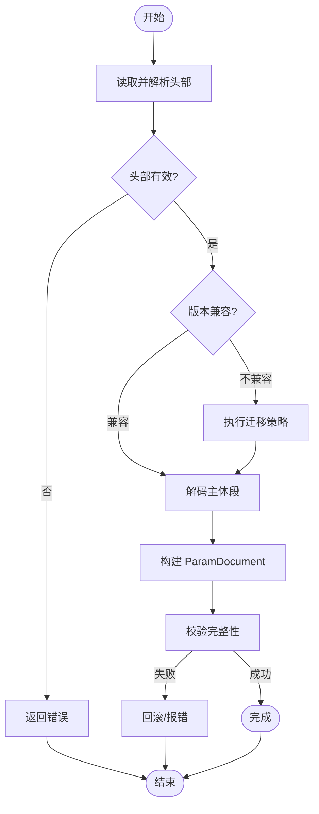
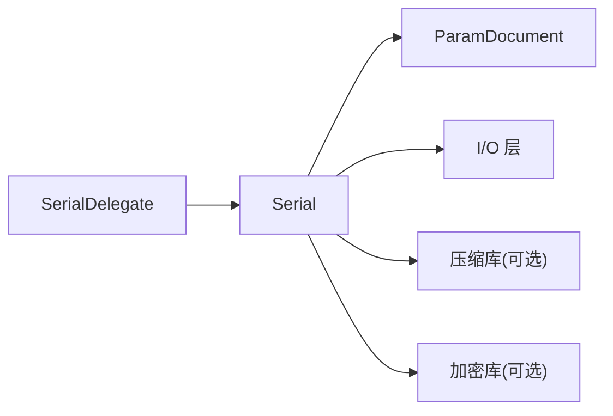

# 序列化系统

<cite>
**本文档引用的文件**   
- [Serial.h](file://src/parametric/Serial.h)
- [Serial.cpp](file://src/parametric/Serial.cpp)
- [ParamDocument.h](file://src/parametric/ParamDocument.h)
- [ParamDocument.cpp](file://src/parametric/ParamDocument.cpp)
- [SerialDelegate.h](file://src/ui/SerialDelegate.h)
- [SerialDelegate.cpp](file://src/ui/SerialDelegate.cpp)
</cite>

## 目录
1. [简介](#简介)
2. [项目结构](#项目结构)
3. [核心组件](#核心组件)
4. [架构总览](#架构总览)
5. [详细组件分析](#详细组件分析)
6. [依赖关系分析](#依赖关系分析)
7. [性能考量](#性能考量)
8. [故障排查指南](#故障排查指南)
9. [结论](#结论)
10. [附录](#附录)

## 简介
本文件为参数化引擎的序列化系统提供系统化文档，重点围绕 Serial 类的数据格式设计、文件 I/O 操作、参数化文档的序列化和反序列化流程、版本兼容性与迁移策略、二进制与文本格式支持、数据压缩与加密选项、错误处理与恢复机制，以及大文件的流式处理与内存优化进行说明。目标是帮助开发者快速理解并正确使用该序列化子系统，同时为后续扩展与维护提供清晰的技术依据。

## 项目结构
与序列化系统直接相关的代码主要位于 parametric 与 ui 两个模块：
- parametric/Serial.*：定义与实现序列化核心逻辑（数据格式、编解码、I/O、压缩/加密接口等）
- parametric/ParamDocument.*：参数化文档模型，提供序列化入口与元数据（如版本号）
- ui/SerialDelegate.*：UI 层对序列化的委托封装，便于界面交互触发保存/加载

图表来源 
- [Serial.h](file://src/parametric/Serial.h)
- [Serial.cpp](file://src/parametric/Serial.cpp)
- [ParamDocument.h](file://src/parametric/ParamDocument.h)
- [ParamDocument.cpp](file://src/parametric/ParamDocument.cpp)
- [SerialDelegate.h](file://src/ui/SerialDelegate.h)
- [SerialDelegate.cpp](file://src/ui/SerialDelegate.cpp)

章节来源
- [Serial.h](file://src/parametric/Serial.h)
- [Serial.cpp](file://src/parametric/Serial.cpp)
- [ParamDocument.h](file://src/parametric/ParamDocument.h)
- [ParamDocument.cpp](file://src/parametric/ParamDocument.cpp)
- [SerialDelegate.h](file://src/ui/SerialDelegate.h)
- [SerialDelegate.cpp](file://src/ui/SerialDelegate.cpp)

## 核心组件
- Serial：序列化核心类，负责将 ParamDocument 对象序列化为二进制或文本格式，并提供反序列化能力；支持压缩与加密通道；暴露统一的 I/O 接口。
- ParamDocument：参数化文档的数据模型，包含变量、表达式、约束、图形元素等，是序列化的根节点。
- SerialDelegate：UI 层的序列化委托，封装了文件对话框、进度提示、错误弹窗等交互逻辑，调用 Serial 完成实际读写。

章节来源
- [Serial.h](file://src/parametric/Serial.h)
- [Serial.cpp](file://src/parametric/Serial.cpp)
- [ParamDocument.h](file://src/parametric/ParamDocument.h)
- [ParamDocument.cpp](file://src/parametric/ParamDocument.cpp)
- [SerialDelegate.h](file://src/ui/SerialDelegate.h)
- [SerialDelegate.cpp](file://src/ui/SerialDelegate.cpp)

## 架构总览
序列化系统的整体交互如下：
- UI 通过 SerialDelegate 发起“保存/打开”操作
- SerialDelegate 调用 Serial 的对应方法
- Serial 根据目标格式选择二进制或文本编码器/解码器
- 可选地启用压缩与加密管道
- 最终通过 I/O 层写入文件或从文件读取

图表来源 
- [Serial.h](file://src/parametric/Serial.h)
- [Serial.cpp](file://src/parametric/Serial.cpp)
- [ParamDocument.h](file://src/parametric/ParamDocument.h)
- [ParamDocument.cpp](file://src/parametric/ParamDocument.cpp)
- [SerialDelegate.h](file://src/ui/SerialDelegate.h)
- [SerialDelegate.cpp](file://src/ui/SerialDelegate.cpp)

## 详细组件分析

### Serial 类：数据格式设计与 I/O
- 数据格式设计
  - 头部字段：包含魔数、版本号、格式标识（二进制/文本）、标志位（是否压缩、是否加密）
  - 主体段：按顺序序列化 ParamDocument 的各个子图元（变量、表达式、约束、几何片段等）
  - 校验段：可选 CRC/哈希用于完整性校验
- 文件格式
  - 二进制格式：紧凑、高效，适合大文件与频繁读写
  - 文本格式：可读、易调试，适合版本对比与人工编辑
- I/O 操作
  - 统一接口：save/load 抽象出路径与格式
  - 流式处理：分块读写，避免一次性加载整个文件到内存
  - 压缩/加密：在 I/O 层插入压缩与加密管道，透明处理字节流

图表来源 
- [Serial.h](file://src/parametric/Serial.h)
- [Serial.cpp](file://src/parametric/Serial.cpp)
- [ParamDocument.h](file://src/parametric/ParamDocument.h)
- [ParamDocument.cpp](file://src/parametric/ParamDocument.cpp)

章节来源
- [Serial.h](file://src/parametric/Serial.h)
- [Serial.cpp](file://src/parametric/Serial.cpp)

### 参数化文档的序列化与反序列化流程
- 序列化流程
  - 生成头部（魔数、版本、格式、标志位）
  - 遍历 ParamDocument 的子图元，依次写入字段长度与值
  - 计算校验和并写入尾部
  - 可选压缩与加密后输出
- 反序列化流程
  - 读取并验证头部
  - 根据版本选择对应的解码策略
  - 逐段解码子图元，构建 ParamDocument
  - 校验完整性，失败则回滚或抛出错误

图表来源 
- [Serial.cpp](file://src/parametric/Serial.cpp)
- [ParamDocument.cpp](file://src/parametric/ParamDocument.cpp)

章节来源
- [Serial.cpp](file://src/parametric/Serial.cpp)
- [ParamDocument.cpp](file://src/parametric/ParamDocument.cpp)

### 版本兼容性与迁移策略
- 版本管理
  - 头部中的版本号用于识别文件格式
  - 向后兼容：新版本能读取旧版本文件
  - 向前兼容：旧版本拒绝读取新版本文件（或降级处理）
- 迁移策略
  - 增量迁移：仅应用必要的字段映射与默认值填充
  - 安全回滚：迁移失败时保留原文件并报告错误
  - 迁移日志：记录迁移步骤以便审计与排错

章节来源
- [Serial.h](file://src/parametric/Serial.h)
- [Serial.cpp](file://src/parametric/Serial.cpp)
- [ParamDocument.h](file://src/parametric/ParamDocument.h)
- [ParamDocument.cpp](file://src/parametric/ParamDocument.cpp)

### 二进制与文本格式支持
- 二进制格式
  - 优点：体积小、读写快
  - 适用场景：生产环境、大文件、高频读写
- 文本格式
  - 优点：可读性强、便于调试与版本对比
  - 适用场景：开发阶段、人工维护、协作审查

章节来源
- [Serial.h](file://src/parametric/Serial.h)
- [Serial.cpp](file://src/parametric/Serial.cpp)

### 数据压缩与加密选项
- 压缩
  - 可选压缩算法（如 zlib/lz4），在 I/O 管道中透明处理
  - 权衡：CPU 开销 vs 存储空间节省
- 加密
  - 可选对称加密（如 AES），保护敏感数据
  - 密钥管理：建议由上层配置注入，避免硬编码

章节来源
- [Serial.h](file://src/parametric/Serial.h)
- [Serial.cpp](file://src/parametric/Serial.cpp)

### 错误处理与恢复机制
- 错误分类
  - 文件 I/O 错误：权限不足、磁盘满、路径无效
  - 格式错误：魔数不匹配、版本不兼容、校验失败
  - 数据损坏：截断、乱码、字段缺失
- 恢复策略
  - 自动回滚：反序列化失败时丢弃已构建的部分对象
  - 备份恢复：保存前创建临时备份，失败时回退
  - 用户提示：清晰的错误信息与修复建议

章节来源
- [Serial.cpp](file://src/parametric/Serial.cpp)
- [SerialDelegate.cpp](file://src/ui/SerialDelegate.cpp)

### 大文件的流式处理与内存优化
- 流式读写
  - 分块读取/写入，避免一次性加载全部数据
  - 使用缓冲池减少内存分配开销
- 内存优化
  - 延迟加载：按需加载子图元
  - 对象复用：重用临时对象降低 GC/分配压力
  - 内存映射：对超大文件采用 mmap（平台相关）

章节来源
- [Serial.cpp](file://src/parametric/Serial.cpp)

### UI 委托 SerialDelegate
- 职责
  - 封装文件对话框、进度条、错误弹窗
  - 调用 Serial 完成实际的序列化/反序列化
  - 提供撤销/重做所需的快照（可选）
- 集成点
  - 与主窗口工具栏/菜单联动
  - 与文档状态同步（脏标记、最近文件列表）

章节来源
- [SerialDelegate.h](file://src/ui/SerialDelegate.h)
- [SerialDelegate.cpp](file://src/ui/SerialDelegate.cpp)

## 依赖关系分析
- 内部依赖
  - Serial 依赖 ParamDocument 的数据结构与版本信息
  - SerialDelegate 依赖 Serial 的 API 与错误类型
- 外部依赖
  - I/O 层：标准库或跨平台文件访问
  - 压缩库：可选，需链接相应库
  - 加密库：可选，需链接相应库

图表来源 
- [SerialDelegate.h](file://src/ui/SerialDelegate.h)
- [SerialDelegate.cpp](file://src/ui/SerialDelegate.cpp)
- [Serial.h](file://src/parametric/Serial.h)
- [Serial.cpp](file://src/parametric/Serial.cpp)
- [ParamDocument.h](file://src/parametric/ParamDocument.h)
- [ParamDocument.cpp](file://src/parametric/ParamDocument.cpp)

章节来源
- [SerialDelegate.h](file://src/ui/SerialDelegate.h)
- [SerialDelegate.cpp](file://src/ui/SerialDelegate.cpp)
- [Serial.h](file://src/parametric/Serial.h)
- [Serial.cpp](file://src/parametric/Serial.cpp)
- [ParamDocument.h](file://src/parametric/ParamDocument.h)
- [ParamDocument.cpp](file://src/parametric/ParamDocument.cpp)

## 性能考量
- 序列化/反序列化性能
  - 二进制格式优于文本格式
  - 压缩率与 CPU 开销需权衡
- 内存占用
  - 流式处理显著降低峰值内存
  - 对象复用与延迟加载进一步优化
- I/O 吞吐
  - 合理设置缓冲区大小
  - 避免频繁小文件读写

[本节为通用指导，无需特定文件引用]

## 故障排查指南
- 常见问题
  - 无法打开文件：检查路径与权限
  - 版本不兼容：确认文件格式与当前程序版本
  - 校验失败：文件可能损坏，尝试恢复备份
- 诊断步骤
  - 启用详细日志，定位错误阶段（头部/主体/校验）
  - 使用文本格式导出，人工检查关键字段
  - 逐步禁用压缩/加密以隔离问题

章节来源
- [Serial.cpp](file://src/parametric/Serial.cpp)
- [SerialDelegate.cpp](file://src/ui/SerialDelegate.cpp)

## 结论
本序列化系统以 Serial 为核心，提供统一、可扩展的文件 I/O 能力，支持二进制与文本格式、可选压缩与加密、完善的版本管理与错误恢复机制，并通过流式处理与大对象优化保障性能与稳定性。配合 UI 委托 SerialDelegate，形成完整的保存/打开工作流，满足参数化引擎在生产与开发环境中的多样化需求。

[本节为总结性内容，无需特定文件引用]

## 附录
- 术语表
  - 魔数：文件头部的固定标识，用于快速识别格式
  - 版本：文件格式的版本号，用于兼容性判断
  - 校验：完整性校验，确保数据未被篡改或损坏
- 最佳实践
  - 优先使用二进制格式提升性能
  - 开启压缩以减小体积，注意 CPU 开销
  - 对敏感数据启用加密
  - 保持向后兼容，谨慎推进版本升级

[本节为补充信息，无需特定文件引用]