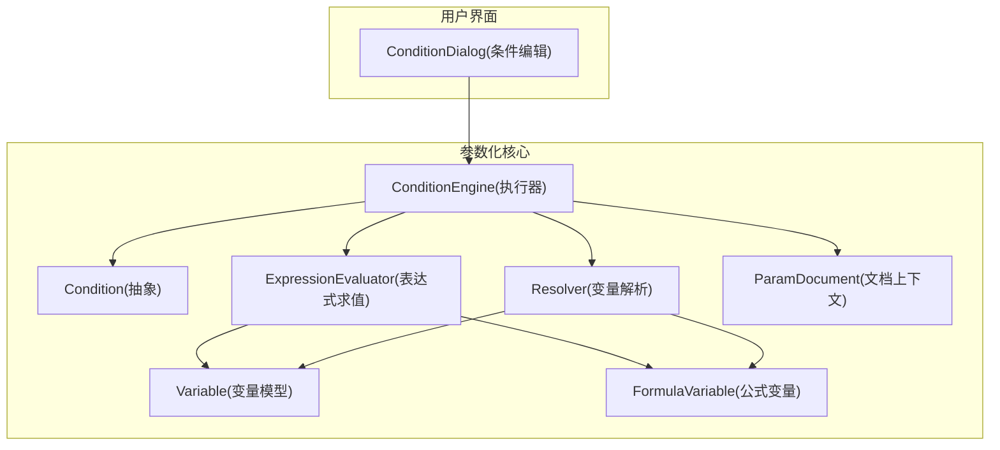
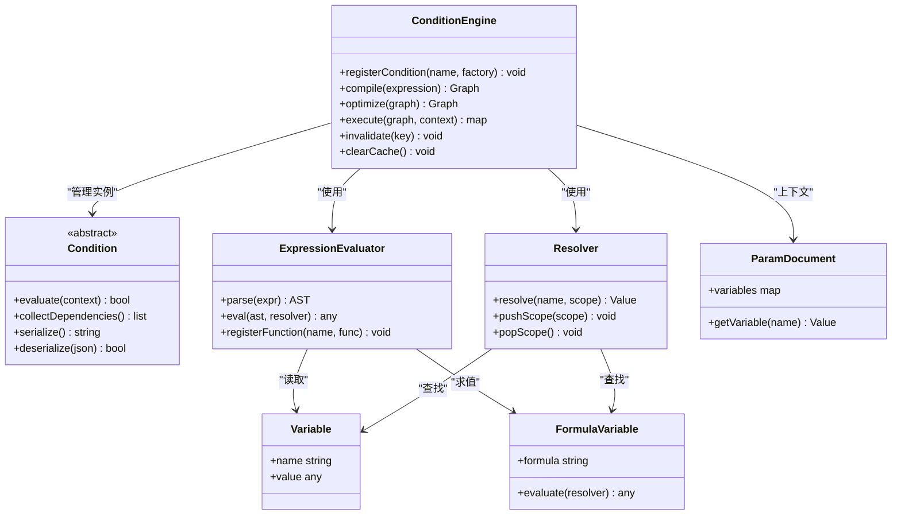
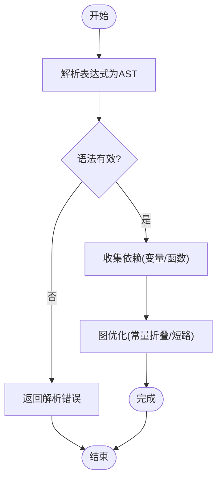
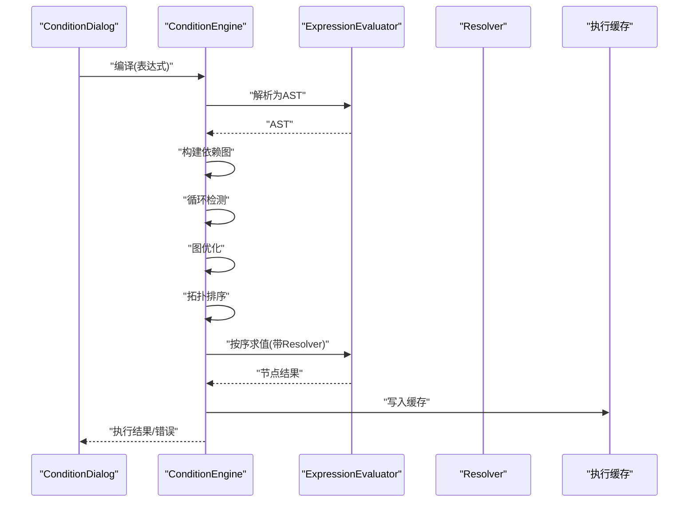
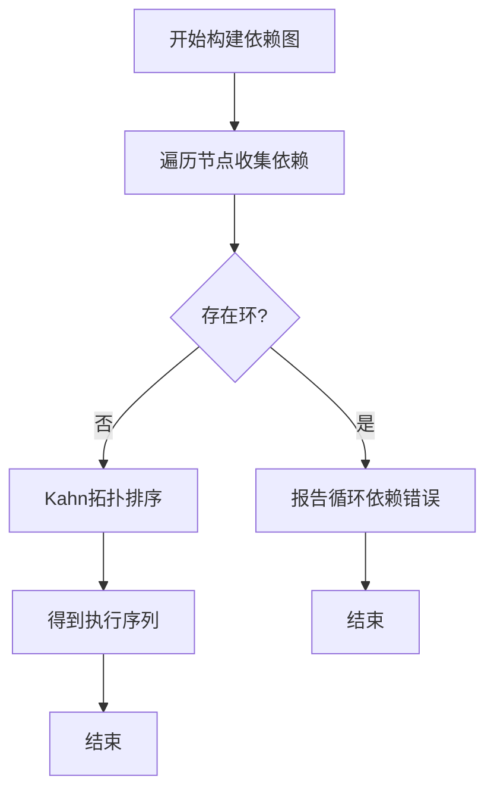
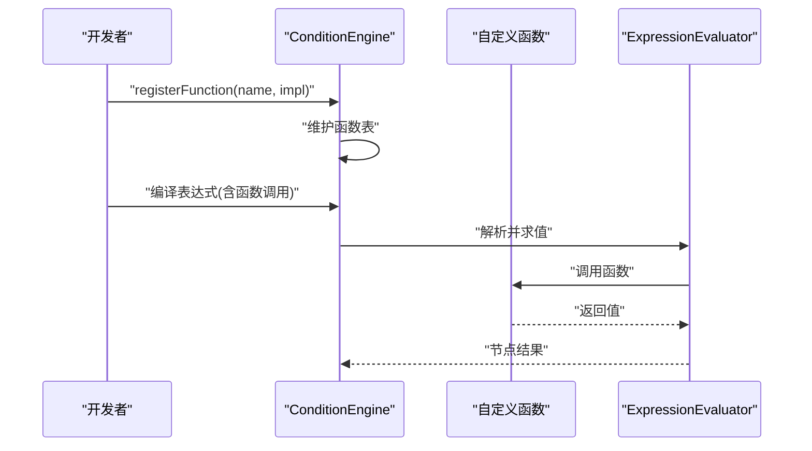
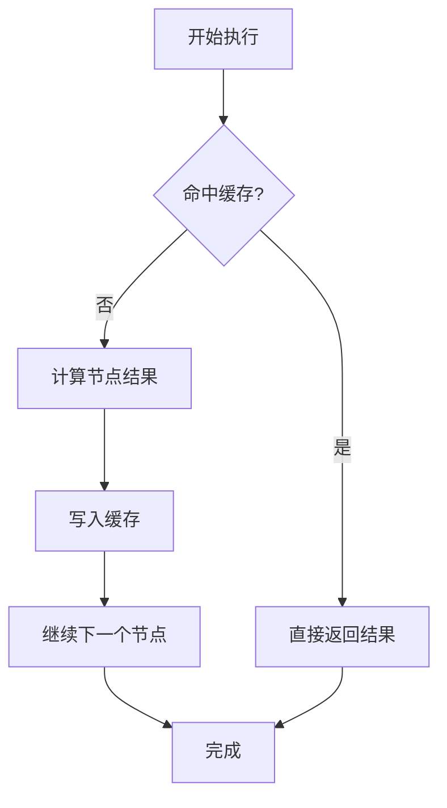
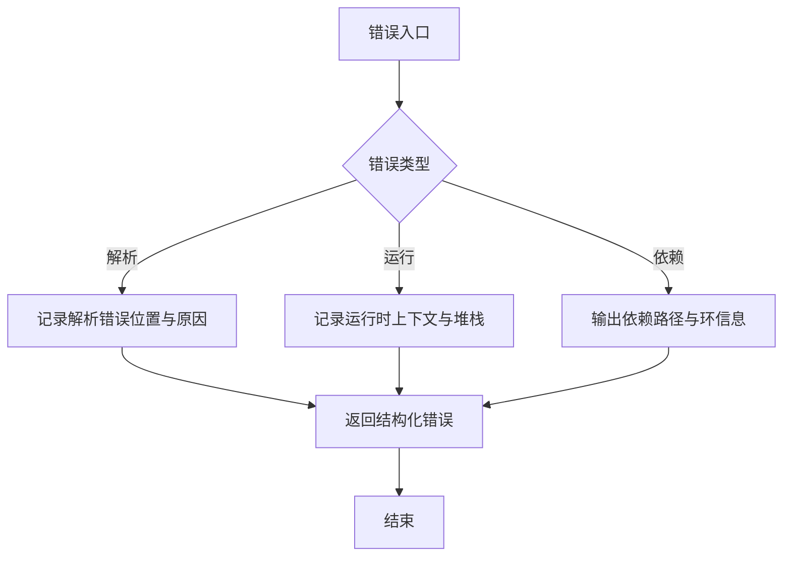
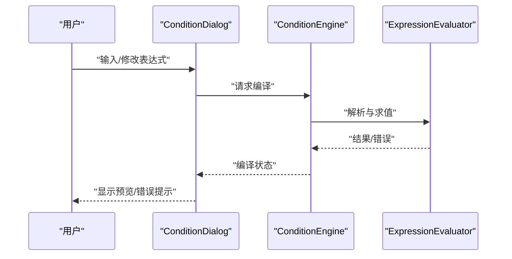
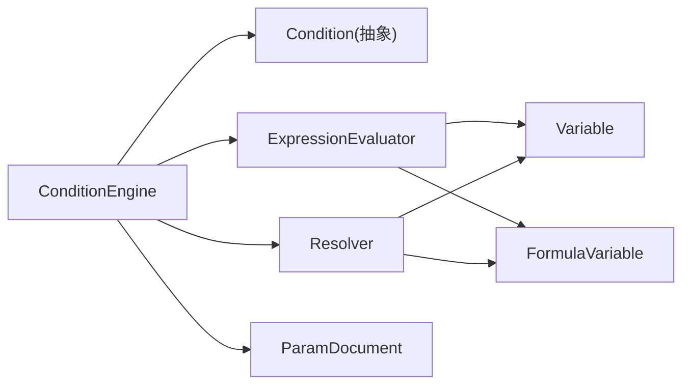

# 条件引擎

<cite>
**本文引用的文件**   
- [Condition.h](file://src/parametric/Condition.h)
- [ConditionEngine.cpp](file://src/parametric/ConditionEngine.cpp)
- [ConditionEngine.h](file://src/parametric/ConditionEngine.h)
- [ExpressionEvaluator.cpp](file://src/parametric/ExpressionEvaluator.cpp)
- [ExpressionEvaluator.h](file://src/parametric/ExpressionEvaluator.h)
- [Resolver.cpp](file://src/parametric/Resolver.cpp)
- [Resolver.h](file://src/parametric/Resolver.h)
- [Variable.h](file://src/parametric/Variable.h)
- [FormulaVariable.h](file://src/parametric/FormulaVariable.h)
- [ParamDocument.h](file://src/parametric/ParamDocument.h)
- [ConditionDialog.cpp](file://src/ui/ConditionDialog.cpp)
- [ConditionDialog.h](file://src/ui/ConditionDialog.h)
</cite>

## 目录
1. [简介](#简介)
2. [项目结构](#项目结构)
3. [核心组件](#核心组件)
4. [架构总览](#架构总览)
5. [详细组件分析](#详细组件分析)
6. [依赖关系分析](#依赖关系分析)
7. [性能考虑](#性能考虑)
8. [故障排查指南](#故障排查指南)
9. [结论](#结论)
10. [附录](#附录)

## 简介
本文件为参数化引擎中的“条件引擎”提供系统化、可操作的文档。重点覆盖：
- ConditionEngine 类的逻辑执行机制与条件判断算法
- Condition 基类设计与条件表达式语法结构
- 条件的编译、优化与执行流程
- 条件依赖图的构建与循环检测机制
- 自定义条件函数的注册与扩展方法
- 条件执行的缓存策略与性能优化
- 错误处理与调试信息输出

该文档面向具备不同技术背景的读者，既提供高层概览，也给出代码级细节与图示，帮助快速理解与扩展条件引擎。

## 项目结构
条件引擎位于 parametric 模块中，围绕 Condition 抽象、ConditionEngine 执行器、表达式求值器 ExpressionEvaluator 以及变量解析 Resolver 等组件协作完成。UI 层通过 ConditionDialog 提供条件编辑能力。

**图表来源** 
- [Condition.h](file://src/parametric/Condition.h)
- [ConditionEngine.h](file://src/parametric/ConditionEngine.h)
- [ConditionEngine.cpp](file://src/parametric/ConditionEngine.cpp)
- [ExpressionEvaluator.h](file://src/parametric/ExpressionEvaluator.h)
- [ExpressionEvaluator.cpp](file://src/parametric/ExpressionEvaluator.cpp)
- [Resolver.h](file://src/parametric/Resolver.h)
- [Resolver.cpp](file://src/parametric/Resolver.cpp)
- [Variable.h](file://src/parametric/Variable.h)
- [FormulaVariable.h](file://src/parametric/FormulaVariable.h)
- [ParamDocument.h](file://src/parametric/ParamDocument.h)
- [ConditionDialog.h](file://src/ui/ConditionDialog.h)
- [ConditionDialog.cpp](file://src/ui/ConditionDialog.cpp)

**章节来源**
- [Condition.h](file://src/parametric/Condition.h)
- [ConditionEngine.h](file://src/parametric/ConditionEngine.h)
- [ConditionEngine.cpp](file://src/parametric/ConditionEngine.cpp)
- [ExpressionEvaluator.h](file://src/parametric/ExpressionEvaluator.h)
- [ExpressionEvaluator.cpp](file://src/parametric/ExpressionEvaluator.cpp)
- [Resolver.h](file://src/parametric/Resolver.h)
- [Resolver.cpp](file://src/parametric/Resolver.cpp)
- [Variable.h](file://src/parametric/Variable.h)
- [FormulaVariable.h](file://src/parametric/FormulaVariable.h)
- [ParamDocument.h](file://src/parametric/ParamDocument.h)
- [ConditionDialog.h](file://src/ui/ConditionDialog.h)
- [ConditionDialog.cpp](file://src/ui/ConditionDialog.cpp)

## 核心组件
- Condition（抽象基类）
  - 定义条件表达式的统一接口，包括求值、依赖收集、序列化/反序列化等能力。
  - 子类实现具体条件类型（如比较、逻辑组合、函数调用等）。
- ConditionEngine（执行器）
  - 负责将条件表达式编译为可执行图，构建依赖关系，进行循环检测，按拓扑序执行并缓存结果。
  - 提供条件注册、批量评估、增量更新等能力。
- ExpressionEvaluator（表达式求值器）
  - 解析并求值表达式，支持数值、布尔、字符串等类型，以及内置函数与运算符。
- Resolver（变量解析器）
  - 根据名称解析变量或公式变量，支持作用域与文档上下文。
- Variable / FormulaVariable（变量模型）
  - 表示基础变量与由公式驱动的变量，供表达式求值使用。
- ParamDocument（文档上下文）
  - 提供全局变量集合、命名空间与生命周期管理。
- ConditionDialog（条件编辑 UI）
  - 提供可视化编辑、预览与校验能力，驱动引擎进行编译与测试。

**章节来源**
- [Condition.h](file://src/parametric/Condition.h)
- [ConditionEngine.h](file://src/parametric/ConditionEngine.h)
- [ConditionEngine.cpp](file://src/parametric/ConditionEngine.cpp)
- [ExpressionEvaluator.h](file://src/parametric/ExpressionEvaluator.h)
- [ExpressionEvaluator.cpp](file://src/parametric/ExpressionEvaluator.cpp)
- [Resolver.h](file://src/parametric/Resolver.h)
- [Resolver.cpp](file://src/parametric/Resolver.cpp)
- [Variable.h](file://src/parametric/Variable.h)
- [FormulaVariable.h](file://src/parametric/FormulaVariable.h)
- [ParamDocument.h](file://src/parametric/ParamDocument.h)
- [ConditionDialog.h](file://src/ui/ConditionDialog.h)
- [ConditionDialog.cpp](file://src/ui/ConditionDialog.cpp)

## 架构总览
条件引擎采用“抽象条件 + 执行器 + 表达式求值 + 变量解析”的分层设计。UI 层通过对话框创建/编辑条件，引擎负责编译、优化、执行与缓存；底层由表达式求值器与变量解析器支撑数据流。

**图表来源** 
- [Condition.h](file://src/parametric/Condition.h)
- [ConditionEngine.h](file://src/parametric/ConditionEngine.h)
- [ConditionEngine.cpp](file://src/parametric/ConditionEngine.cpp)
- [ExpressionEvaluator.h](file://src/parametric/ExpressionEvaluator.h)
- [ExpressionEvaluator.cpp](file://src/parametric/ExpressionEvaluator.cpp)
- [Resolver.h](file://src/parametric/Resolver.h)
- [Resolver.cpp](file://src/parametric/Resolver.cpp)
- [Variable.h](file://src/parametric/Variable.h)
- [FormulaVariable.h](file://src/parametric/FormulaVariable.h)
- [ParamDocument.h](file://src/parametric/ParamDocument.h)

## 详细组件分析

### Condition 基类与条件表达式语法
- 设计要点
  - 抽象接口：统一 evaluate、依赖收集、序列化/反序列化。
  - 可扩展性：通过工厂注册新条件类型，避免修改核心逻辑。
  - 依赖语义：每个条件需声明其依赖的变量/子条件，便于构建依赖图。
- 表达式语法
  - 支持基本字面量（数值、布尔、字符串）、变量引用、函数调用、运算符与括号分组。
  - 条件表达式最终被解析为 AST，并由 ExpressionEvaluator 求值。
  - 复合条件（如 AND/OR/NOT）通过嵌套表达式或专用节点表示。

**图表来源** 
- [Condition.h](file://src/parametric/Condition.h)
- [ExpressionEvaluator.h](file://src/parametric/ExpressionEvaluator.h)
- [ExpressionEvaluator.cpp](file://src/parametric/ExpressionEvaluator.cpp)

**章节来源**
- [Condition.h](file://src/parametric/Condition.h)
- [ExpressionEvaluator.h](file://src/parametric/ExpressionEvaluator.h)
- [ExpressionEvaluator.cpp](file://src/parametric/ExpressionEvaluator.cpp)

### ConditionEngine 执行机制与条件判断算法
- 编译阶段
  - 将条件表达式解析为 AST，再转换为可执行图（节点=条件/操作，边=依赖）。
  - 收集所有依赖（变量、公式变量、子条件），建立依赖映射。
- 优化阶段
  - 常量折叠：对可静态求值的子树进行预计算。
  - 短路优化：基于逻辑运算符特性跳过不必要分支。
  - 死代码消除：移除无依赖且不可达节点。
- 执行阶段
  - 拓扑排序确保依赖先于消费者执行。
  - 逐节点求值，记录中间结果到缓存。
  - 遇到错误立即短路并返回诊断信息。
- 缓存与失效
  - 以键（条件ID或表达式指纹）缓存结果。
  - 当依赖变量变化时，标记相关节点失效并增量重算。

**图表来源** 
- [ConditionEngine.h](file://src/parametric/ConditionEngine.h)
- [ConditionEngine.cpp](file://src/parametric/ConditionEngine.cpp)
- [ExpressionEvaluator.h](file://src/parametric/ExpressionEvaluator.h)
- [ExpressionEvaluator.cpp](file://src/parametric/ExpressionEvaluator.cpp)
- [Resolver.h](file://src/parametric/Resolver.h)
- [Resolver.cpp](file://src/parametric/Resolver.cpp)

**章节来源**
- [ConditionEngine.h](file://src/parametric/ConditionEngine.h)
- [ConditionEngine.cpp](file://src/parametric/ConditionEngine.cpp)
- [ExpressionEvaluator.h](file://src/parametric/ExpressionEvaluator.h)
- [ExpressionEvaluator.cpp](file://src/parametric/ExpressionEvaluator.cpp)
- [Resolver.h](file://src/parametric/Resolver.h)
- [Resolver.cpp](file://src/parametric/Resolver.cpp)

### 依赖图构建与循环检测
- 依赖图构建
  - 遍历 AST/条件节点，收集变量名、公式变量名与子条件引用。
  - 生成有向边：子依赖 -> 父节点。
- 循环检测
  - 使用深度优先搜索（DFS）着色法检测环。
  - 若发现回边，抛出循环依赖错误，并附带路径信息以便定位。
- 拓扑排序
  - 在确认无环后，执行 Kahn 算法或 DFS 逆序得到执行顺序。

**图表来源** 
- [ConditionEngine.cpp](file://src/parametric/ConditionEngine.cpp)
- [Resolver.h](file://src/parametric/Resolver.h)
- [Resolver.cpp](file://src/parametric/Resolver.cpp)

**章节来源**
- [ConditionEngine.cpp](file://src/parametric/ConditionEngine.cpp)
- [Resolver.h](file://src/parametric/Resolver.h)
- [Resolver.cpp](file://src/parametric/Resolver.cpp)

### 自定义条件函数的注册与扩展
- 注册机制
  - 通过引擎提供的注册接口，将函数名与实现绑定。
  - 支持多态签名（参数数量、类型）与重载。
- 扩展步骤
  - 实现函数接口（输入参数列表，返回值）。
  - 在初始化阶段注册到引擎。
  - 在表达式中使用函数名调用。
- 安全与调试
  - 限制函数访问范围，防止越权读取敏感变量。
  - 提供日志钩子，记录函数调用与异常。

**图表来源** 
- [ConditionEngine.h](file://src/parametric/ConditionEngine.h)
- [ConditionEngine.cpp](file://src/parametric/ConditionEngine.cpp)
- [ExpressionEvaluator.h](file://src/parametric/ExpressionEvaluator.h)
- [ExpressionEvaluator.cpp](file://src/parametric/ExpressionEvaluator.cpp)

**章节来源**
- [ConditionEngine.h](file://src/parametric/ConditionEngine.h)
- [ConditionEngine.cpp](file://src/parametric/ConditionEngine.cpp)
- [ExpressionEvaluator.h](file://src/parametric/ExpressionEvaluator.h)
- [ExpressionEvaluator.cpp](file://src/parametric/ExpressionEvaluator.cpp)

### 条件执行的缓存策略与性能优化
- 缓存粒度
  - 节点级缓存：每个条件/操作的结果缓存，键为表达式指纹与输入快照。
  - 会话级缓存：一次编译后的图可在多次执行间复用。
- 失效策略
  - 变量变更触发受影响节点的脏标记。
  - 增量重算：仅重算依赖链上的节点。
- 优化手段
  - 常量折叠、短路求值、死代码消除。
  - 惰性求值：仅在需要时计算子表达式。
  - 并行化：无依赖的子树可并发执行（视引擎配置而定）。

**图表来源** 
- [ConditionEngine.cpp](file://src/parametric/ConditionEngine.cpp)
- [ExpressionEvaluator.cpp](file://src/parametric/ExpressionEvaluator.cpp)

**章节来源**
- [ConditionEngine.cpp](file://src/parametric/ConditionEngine.cpp)
- [ExpressionEvaluator.cpp](file://src/parametric/ExpressionEvaluator.cpp)

### 错误处理与调试信息输出
- 错误分类
  - 解析错误：语法不合法、未知标识符、类型不匹配。
  - 运行时错误：除零、空引用、函数参数错误。
  - 依赖错误：循环依赖、未解析变量。
- 处理策略
  - 早期失败：编译期尽可能捕获错误。
  - 短路返回：执行期遇到错误立即中断，返回结构化错误对象。
- 调试输出
  - 打印 AST、依赖图、执行序列与中间结果。
  - 提供开关控制日志级别，便于生产环境关闭。

**图表来源** 
- [ConditionEngine.cpp](file://src/parametric/ConditionEngine.cpp)
- [ExpressionEvaluator.cpp](file://src/parametric/ExpressionEvaluator.cpp)
- [Resolver.cpp](file://src/parametric/Resolver.cpp)

**章节来源**
- [ConditionEngine.cpp](file://src/parametric/ConditionEngine.cpp)
- [ExpressionEvaluator.cpp](file://src/parametric/ExpressionEvaluator.cpp)
- [Resolver.cpp](file://src/parametric/Resolver.cpp)

### UI 集成：ConditionDialog
- 功能
  - 提供条件表达式编辑器、实时预览与校验。
  - 驱动引擎进行编译与测试，展示错误与警告。
- 交互流程
  - 用户输入表达式 -> 引擎编译 -> 显示结果/错误 -> 用户修正。

**图表来源** 
- [ConditionDialog.h](file://src/ui/ConditionDialog.h)
- [ConditionDialog.cpp](file://src/ui/ConditionDialog.cpp)
- [ConditionEngine.h](file://src/parametric/ConditionEngine.h)
- [ConditionEngine.cpp](file://src/parametric/ConditionEngine.cpp)
- [ExpressionEvaluator.h](file://src/parametric/ExpressionEvaluator.h)
- [ExpressionEvaluator.cpp](file://src/parametric/ExpressionEvaluator.cpp)

**章节来源**
- [ConditionDialog.h](file://src/ui/ConditionDialog.h)
- [ConditionDialog.cpp](file://src/ui/ConditionDialog.cpp)
- [ConditionEngine.h](file://src/parametric/ConditionEngine.h)
- [ConditionEngine.cpp](file://src/parametric/ConditionEngine.cpp)
- [ExpressionEvaluator.h](file://src/parametric/ExpressionEvaluator.h)
- [ExpressionEvaluator.cpp](file://src/parametric/ExpressionEvaluator.cpp)

## 依赖关系分析
条件引擎内部组件之间的依赖关系如下：

**图表来源** 
- [ConditionEngine.h](file://src/parametric/ConditionEngine.h)
- [ConditionEngine.cpp](file://src/parametric/ConditionEngine.cpp)
- [Condition.h](file://src/parametric/Condition.h)
- [ExpressionEvaluator.h](file://src/parametric/ExpressionEvaluator.h)
- [ExpressionEvaluator.cpp](file://src/parametric/ExpressionEvaluator.cpp)
- [Resolver.h](file://src/parametric/Resolver.h)
- [Resolver.cpp](file://src/parametric/Resolver.cpp)
- [Variable.h](file://src/parametric/Variable.h)
- [FormulaVariable.h](file://src/parametric/FormulaVariable.h)
- [ParamDocument.h](file://src/parametric/ParamDocument.h)

**章节来源**
- [ConditionEngine.h](file://src/parametric/ConditionEngine.h)
- [ConditionEngine.cpp](file://src/parametric/ConditionEngine.cpp)
- [Condition.h](file://src/parametric/Condition.h)
- [ExpressionEvaluator.h](file://src/parametric/ExpressionEvaluator.h)
- [ExpressionEvaluator.cpp](file://src/parametric/ExpressionEvaluator.cpp)
- [Resolver.h](file://src/parametric/Resolver.h)
- [Resolver.cpp](file://src/parametric/Resolver.cpp)
- [Variable.h](file://src/parametric/Variable.h)
- [FormulaVariable.h](file://src/parametric/FormulaVariable.h)
- [ParamDocument.h](file://src/parametric/ParamDocument.h)

## 性能考虑
- 编译期优化
  - 常量折叠、短路求值、死代码消除，减少运行时开销。
- 执行期优化
  - 节点级缓存与增量重算，避免重复计算。
  - 惰性求值与并行执行（可选）提升吞吐。
- 内存管理
  - 重用 AST 与图结构，降低分配频率。
  - 及时释放不再使用的中间结果。
- I/O 与日志
  - 控制日志级别，避免频繁磁盘写入。
  - 批量化错误收集，减少 IO 次数。

[本节为通用指导，无需特定文件来源]

## 故障排查指南
- 常见问题
  - 循环依赖：检查变量/子条件引用是否形成环。
  - 未解析变量：确认变量名与作用域是否正确。
  - 类型不匹配：检查函数参数与字面量类型。
- 定位方法
  - 启用详细日志，查看 AST、依赖图与执行序列。
  - 逐步缩小表达式范围，隔离问题节点。
  - 使用单元测试验证自定义函数与条件。
- 恢复建议
  - 修正表达式语法与作用域。
  - 调整依赖关系，消除环。
  - 增加边界检查与默认值。

**章节来源**
- [ConditionEngine.cpp](file://src/parametric/ConditionEngine.cpp)
- [ExpressionEvaluator.cpp](file://src/parametric/ExpressionEvaluator.cpp)
- [Resolver.cpp](file://src/parametric/Resolver.cpp)

## 结论
条件引擎通过抽象条件、执行器、表达式求值与变量解析的清晰分层，实现了高效、可扩展的条件计算体系。其编译-优化-执行流水线结合依赖图与缓存策略，在保证正确性的同时显著提升性能。通过统一的注册机制与完善的错误处理，开发者可以便捷地扩展条件能力并快速定位问题。

[本节为总结性内容，无需特定文件来源]

## 附录
- 术语
  - AST：抽象语法树
  - 依赖图：描述节点间依赖关系的有向图
  - 拓扑排序：保证依赖先于消费者的线性序列
- 最佳实践
  - 尽量将复杂逻辑拆分为多个简单条件，便于调试与维护。
  - 合理使用缓存与增量更新，避免全量重算。
  - 在 UI 层提供即时反馈，提升用户体验。

[本节为补充信息，无需特定文件来源]