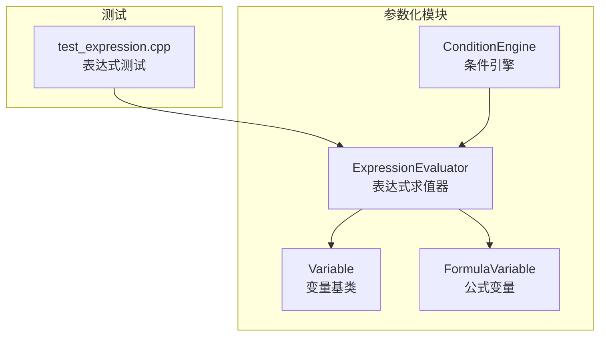
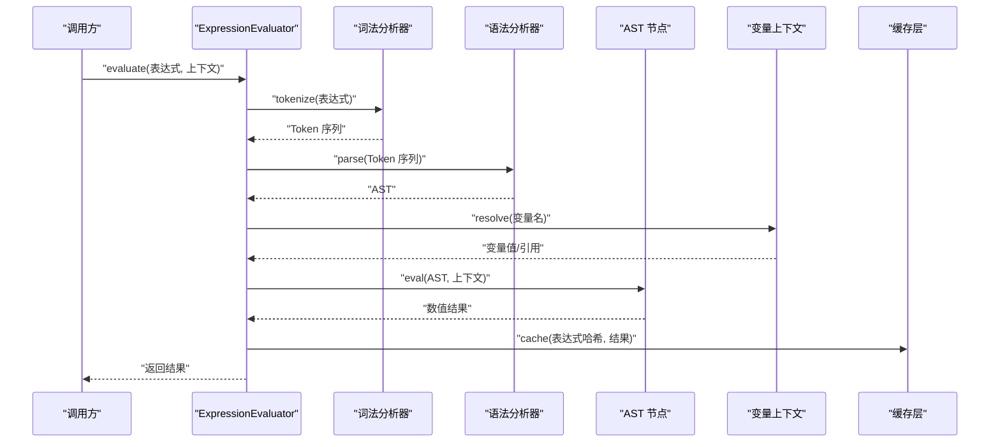
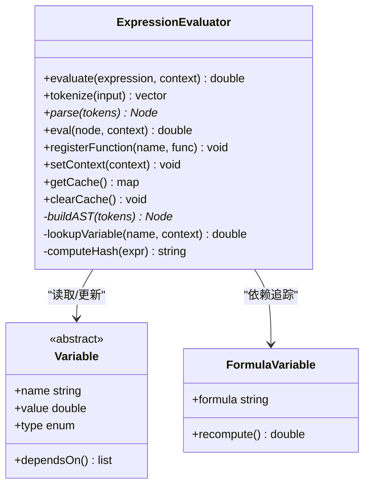
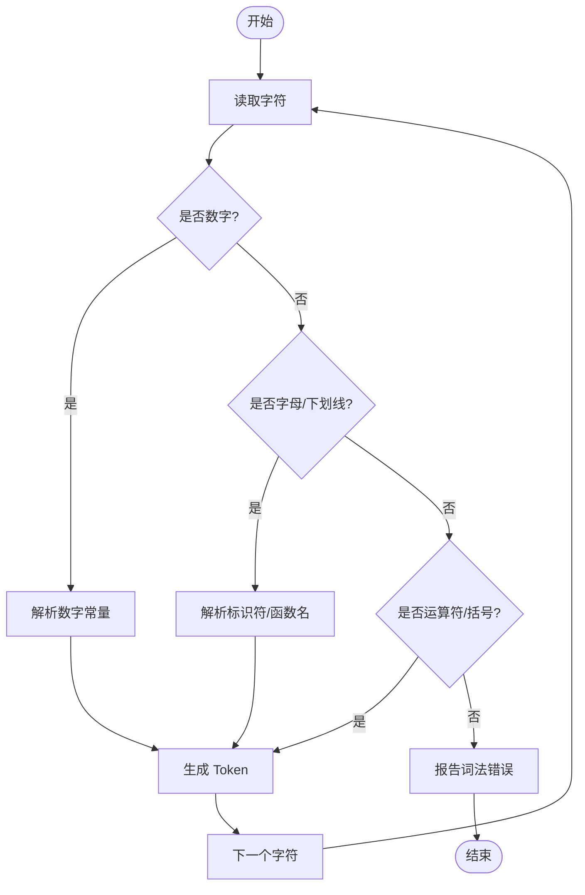
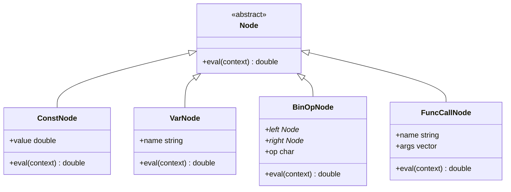
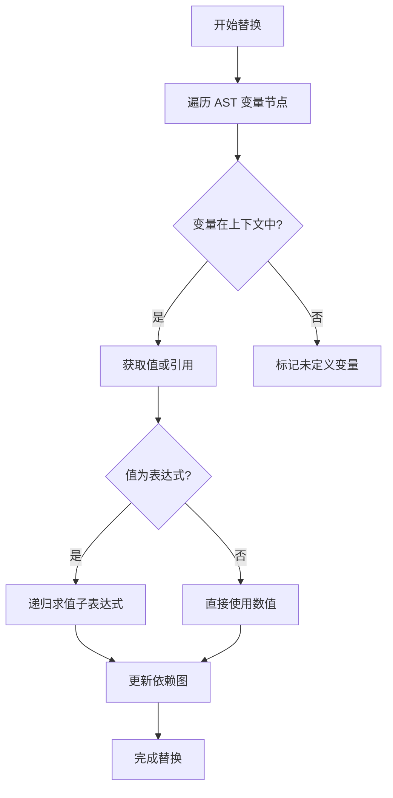
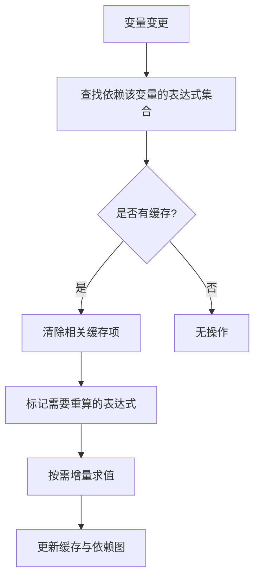
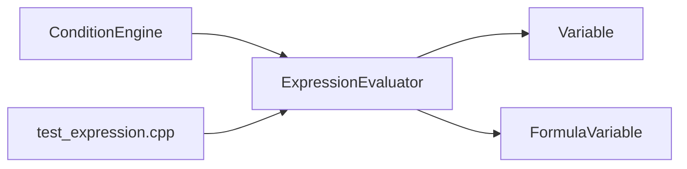

# 表达式求值器

<cite>
**本文引用的文件**   
- [ExpressionEvaluator.h](file://src/parametric/ExpressionEvaluator.h)
- [ExpressionEvaluator.cpp](file://src/parametric/ExpressionEvaluator.cpp)
- [Variable.h](file://src/parametric/Variable.h)
- [FormulaVariable.h](file://src/parametric/FormulaVariable.h)
- [ConditionEngine.h](file://src/parametric/ConditionEngine.h)
- [ConditionEngine.cpp](file://src/parametric/ConditionEngine.cpp)
- [test_expression.cpp](file://tests/test_expression.cpp)
</cite>

## 目录
1. [简介](#简介)
2. [项目结构](#项目结构)
3. [核心组件](#核心组件)
4. [架构总览](#架构总览)
5. [详细组件分析](#详细组件分析)
6. [依赖关系分析](#依赖关系分析)
7. [性能考虑](#性能考虑)
8. [故障排查指南](#故障排查指南)
9. [结论](#结论)
10. [附录](#附录)

## 简介
本文件为参数化引擎中的“表达式求值器”提供系统化、可操作的技术文档。重点围绕 ExpressionEvaluator 类，阐述其数学表达式的解析与计算原理，包括词法分析、语法分析、抽象语法树（AST）构建、变量替换与上下文绑定、内置运算符与函数、自定义函数注册与扩展、表达式缓存与增量求值优化，以及错误处理与异常恢复策略。文档面向不同技术背景的读者，既提供高层概览，也给出代码级细节与图示。

## 项目结构
表达式求值器位于 parametric 模块中，相关文件如下：
- 头文件与实现：ExpressionEvaluator.h、ExpressionEvaluator.cpp
- 变量模型：Variable.h、FormulaVariable.h
- 条件引擎集成：ConditionEngine.h、ConditionEngine.cpp
- 测试用例：tests/test_expression.cpp

图表来源
- [ExpressionEvaluator.h](file://src/parametric/ExpressionEvaluator.h)
- [ExpressionEvaluator.cpp](file://src/parametric/ExpressionEvaluator.cpp)
- [Variable.h](file://src/parametric/Variable.h)
- [FormulaVariable.h](file://src/parametric/FormulaVariable.h)
- [ConditionEngine.h](file://src/parametric/ConditionEngine.h)
- [ConditionEngine.cpp](file://src/parametric/ConditionEngine.cpp)
- [test_expression.cpp](file://tests/test_expression.cpp)

章节来源
- [ExpressionEvaluator.h](file://src/parametric/ExpressionEvaluator.h)
- [ExpressionEvaluator.cpp](file://src/parametric/ExpressionEvaluator.cpp)
- [Variable.h](file://src/parametric/Variable.h)
- [FormulaVariable.h](file://src/parametric/FormulaVariable.h)
- [ConditionEngine.h](file://src/parametric/ConditionEngine.h)
- [ConditionEngine.cpp](file://src/parametric/ConditionEngine.cpp)
- [test_expression.cpp](file://tests/test_expression.cpp)

## 核心组件
- ExpressionEvaluator：负责表达式解析、AST 构建、求值、缓存与增量更新、错误报告。
- Variable / FormulaVariable：变量抽象与公式变量实现，支持类型、取值与依赖追踪。
- ConditionEngine：条件引擎，可能通过表达式驱动条件判断，并与求值器协作。
- 测试用例：覆盖常见表达式场景，验证解析与求值的正确性。

章节来源
- [ExpressionEvaluator.h](file://src/parametric/ExpressionEvaluator.h)
- [ExpressionEvaluator.cpp](file://src/parametric/ExpressionEvaluator.cpp)
- [Variable.h](file://src/parametric/Variable.h)
- [FormulaVariable.h](file://src/parametric/FormulaVariable.h)
- [ConditionEngine.h](file://src/parametric/ConditionEngine.h)
- [ConditionEngine.cpp](file://src/parametric/ConditionEngine.cpp)

## 架构总览
表达式求值器的整体流程从输入字符串开始，经过词法分析生成 Token 序列，再由语法分析构建 AST，最后进行求值。变量在上下文中被解析并替换，结果可缓存并在依赖变化时增量更新。

图表来源
- [ExpressionEvaluator.h](file://src/parametric/ExpressionEvaluator.h)
- [ExpressionEvaluator.cpp](file://src/parametric/ExpressionEvaluator.cpp)

## 详细组件分析

### ExpressionEvaluator 类分析
- 职责
  - 表达式解析：将字符串转换为 Token 序列，再构建 AST。
  - 求值：对 AST 执行求值，支持二元/一元运算符、函数调用、括号优先级等。
  - 变量替换：从上下文获取变量值，支持嵌套表达式与引用。
  - 缓存与增量：基于表达式哈希缓存结果；当依赖变量变化时触发增量重算。
  - 错误处理：捕获词法/语法错误并提供定位信息，支持恢复与重试。
- 关键接口（概念性说明）
  - evaluate(expression, context)：主入口，返回数值或错误。
  - tokenize(input)：词法分析，输出 Token 列表。
  - parse(tokens)：语法分析，输出 AST。
  - eval(node, context)：对 AST 节点求值。
  - registerFunction(name, func)：注册自定义函数。
  - setContext(context)：设置变量上下文。
  - getCache() / clearCache()：访问与清理缓存。
- 设计要点
  - 分离关注点：词法、语法、求值分层清晰，便于扩展与维护。
  - 上下文隔离：每次求值使用独立上下文快照，避免副作用。
  - 可扩展性：函数注册机制允许动态扩展内置能力。

图表来源
- [ExpressionEvaluator.h](file://src/parametric/ExpressionEvaluator.h)
- [ExpressionEvaluator.cpp](file://src/parametric/ExpressionEvaluator.cpp)
- [Variable.h](file://src/parametric/Variable.h)
- [FormulaVariable.h](file://src/parametric/FormulaVariable.h)

章节来源
- [ExpressionEvaluator.h](file://src/parametric/ExpressionEvaluator.h)
- [ExpressionEvaluator.cpp](file://src/parametric/ExpressionEvaluator.cpp)
- [Variable.h](file://src/parametric/Variable.h)
- [FormulaVariable.h](file://src/parametric/FormulaVariable.h)

### 词法分析与语法分析
- 词法分析
  - 识别数字、标识符、运算符、括号、函数名、分隔符等 Token。
  - 处理空格与注释（如有），跳过无效字符。
  - 错误定位：记录行号与列号，便于调试。
- 语法分析
  - 自顶向下或递归下降解析，构建 AST。
  - 支持优先级与结合性规则，确保表达式语义正确。
  - 错误恢复：遇到非法 Token 时尝试回退或跳过，继续解析尽可能多的部分。

图表来源
- [ExpressionEvaluator.cpp](file://src/parametric/ExpressionEvaluator.cpp)

章节来源
- [ExpressionEvaluator.cpp](file://src/parametric/ExpressionEvaluator.cpp)

### 抽象语法树（AST）与求值
- AST 节点类型
  - 常量节点、变量节点、二元运算节点、一元运算节点、函数调用节点、括号节点。
- 求值过程
  - 遍历 AST，按节点类型执行相应计算。
  - 变量节点从上下文查找值，若为公式变量则触发重新计算。
  - 函数节点根据注册表查找实现并调用。
- 复杂度
  - 构建 AST：O(n)，n 为 Token 数量。
  - 求值：O(m)，m 为 AST 节点数。

图表来源
- [ExpressionEvaluator.cpp](file://src/parametric/ExpressionEvaluator.cpp)

章节来源
- [ExpressionEvaluator.cpp](file://src/parametric/ExpressionEvaluator.cpp)

### 变量替换与上下文绑定
- 上下文结构
  - 键值映射：变量名到值或引用。
  - 依赖图：记录变量间的依赖关系，用于增量更新。
- 替换机制
  - 解析阶段收集变量名，求值阶段从上下文获取值。
  - 支持嵌套表达式：变量值本身可为子表达式，需递归求值。
- 安全边界
  - 循环依赖检测：防止无限递归。
  - 未定义变量处理：返回错误或默认值。

图表来源
- [ExpressionEvaluator.cpp](file://src/parametric/ExpressionEvaluator.cpp)
- [Variable.h](file://src/parametric/Variable.h)
- [FormulaVariable.h](file://src/parametric/FormulaVariable.h)

章节来源
- [ExpressionEvaluator.cpp](file://src/parametric/ExpressionEvaluator.cpp)
- [Variable.h](file://src/parametric/Variable.h)
- [FormulaVariable.h](file://src/parametric/FormulaVariable.h)

### 支持的运算符、函数与数据类型
- 运算符
  - 算术：加、减、乘、除、取模、幂等。
  - 比较：等于、不等于、大于、小于、大于等于、小于等于。
  - 逻辑：与、或、非（如适用）。
  - 一元：正负号、取绝对值等。
- 函数
  - 数学函数：三角函数、指数、对数、舍入等。
  - 条件函数：如 if-then-else。
  - 自定义函数：通过注册接口扩展。
- 数据类型
  - 数值类型：浮点数、整数（必要时转换）。
  - 布尔类型：用于条件判断。
  - 字符串类型：用于函数参数或格式化（可选）。

章节来源
- [ExpressionEvaluator.cpp](file://src/parametric/ExpressionEvaluator.cpp)

### 自定义函数注册与扩展
- 注册接口
  - 提供统一函数签名，支持可变参数与类型检查。
  - 维护函数名到实现的映射表。
- 扩展方法
  - 新增函数无需修改解析器，仅注册即可生效。
  - 支持重载（同名不同参数个数或类型）。
- 安全性
  - 限制危险操作，避免内存越界与除零等。

章节来源
- [ExpressionEvaluator.cpp](file://src/parametric/ExpressionEvaluator.cpp)

### 表达式缓存与增量求值优化
- 缓存策略
  - 以表达式字符串或其哈希为键，存储求值结果。
  - 支持 TTL（生存时间）或失效策略。
- 增量更新
  - 维护依赖图，当变量值变化时，仅重算受影响表达式。
  - 懒加载：首次访问才构建依赖图，减少开销。
- 性能收益
  - 重复表达式直接命中缓存，避免重复解析与求值。
  - 大规模参数化场景中显著降低 CPU 占用。

图表来源
- [ExpressionEvaluator.cpp](file://src/parametric/ExpressionEvaluator.cpp)

章节来源
- [ExpressionEvaluator.cpp](file://src/parametric/ExpressionEvaluator.cpp)

### 错误处理与异常恢复策略
- 词法错误
  - 非法字符、未终止字符串、数字格式错误等。
  - 提供位置信息与可读消息。
- 语法错误
  - 不匹配的括号、缺少操作数、非法函数调用等。
  - 尝试恢复：跳过错误 Token，继续解析剩余部分。
- 运行时错误
  - 除零、类型不匹配、未定义变量、循环依赖。
  - 抛出结构化异常，包含上下文快照以便调试。
- 恢复策略
  - 失败回退：回滚部分状态，保证一致性。
  - 降级模式：返回默认值或占位值，不影响整体流程。

章节来源
- [ExpressionEvaluator.cpp](file://src/parametric/ExpressionEvaluator.cpp)

## 依赖关系分析
ExpressionEvaluator 依赖变量模型与条件引擎，形成松耦合的模块化结构。

图表来源
- [ExpressionEvaluator.h](file://src/parametric/ExpressionEvaluator.h)
- [ExpressionEvaluator.cpp](file://src/parametric/ExpressionEvaluator.cpp)
- [Variable.h](file://src/parametric/Variable.h)
- [FormulaVariable.h](file://src/parametric/FormulaVariable.h)
- [ConditionEngine.h](file://src/parametric/ConditionEngine.h)
- [ConditionEngine.cpp](file://src/parametric/ConditionEngine.cpp)
- [test_expression.cpp](file://tests/test_expression.cpp)

章节来源
- [ExpressionEvaluator.h](file://src/parametric/ExpressionEvaluator.h)
- [ExpressionEvaluator.cpp](file://src/parametric/ExpressionEvaluator.cpp)
- [Variable.h](file://src/parametric/Variable.h)
- [FormulaVariable.h](file://src/parametric/FormulaVariable.h)
- [ConditionEngine.h](file://src/parametric/ConditionEngine.h)
- [ConditionEngine.cpp](file://src/parametric/ConditionEngine.cpp)
- [test_expression.cpp](file://tests/test_expression.cpp)

## 性能考虑
- 解析优化
  - 预编译常用表达式，复用 AST。
  - 惰性解析：仅在首次求值时构建 AST。
- 求值优化
  - 常量折叠：在构建 AST 时简化常量表达式。
  - 短路求值：逻辑运算提前终止。
- 缓存优化
  - 多级缓存：L1 局部缓存、L2 全局缓存。
  - 并发安全：读写锁保护缓存访问。
- 内存管理
  - 对象池复用 AST 节点，减少分配开销。
  - 及时释放不再使用的上下文快照。

[本节为通用指导，不直接分析具体文件]

## 故障排查指南
- 常见问题
  - 表达式解析失败：检查语法与关键字拼写。
  - 变量未定义：确认上下文已注入且名称一致。
  - 循环依赖：检查变量间引用关系，打破环。
  - 性能瓶颈：启用缓存，减少重复求值。
- 调试技巧
  - 打印 Token 序列与 AST 结构。
  - 启用详细日志，记录变量依赖与缓存命中。
  - 使用最小复现用例定位问题。

章节来源
- [ExpressionEvaluator.cpp](file://src/parametric/ExpressionEvaluator.cpp)
- [test_expression.cpp](file://tests/test_expression.cpp)

## 结论
ExpressionEvaluator 作为参数化引擎的核心，提供了完整的表达式解析、求值、缓存与增量更新能力。通过清晰的架构设计与可扩展的接口，能够灵活支持多种运算符、函数与数据类型，并在复杂场景中保持高性能与稳定性。建议在实际使用中结合测试用例与调试工具，持续优化表达式结构与依赖关系，以获得最佳性能与可维护性。

[本节为总结，不直接分析具体文件]

## 附录
- 术语表
  - Token：词法单元，如数字、标识符、运算符等。
  - AST：抽象语法树，表达式的树形结构表示。
  - 上下文：变量名到值的映射，供求值时使用。
  - 依赖图：记录变量间的依赖关系，用于增量更新。
- 参考实现
  - 测试用例展示了典型用法与边界情况，可作为扩展参考。

[本节为补充信息，不直接分析具体文件]