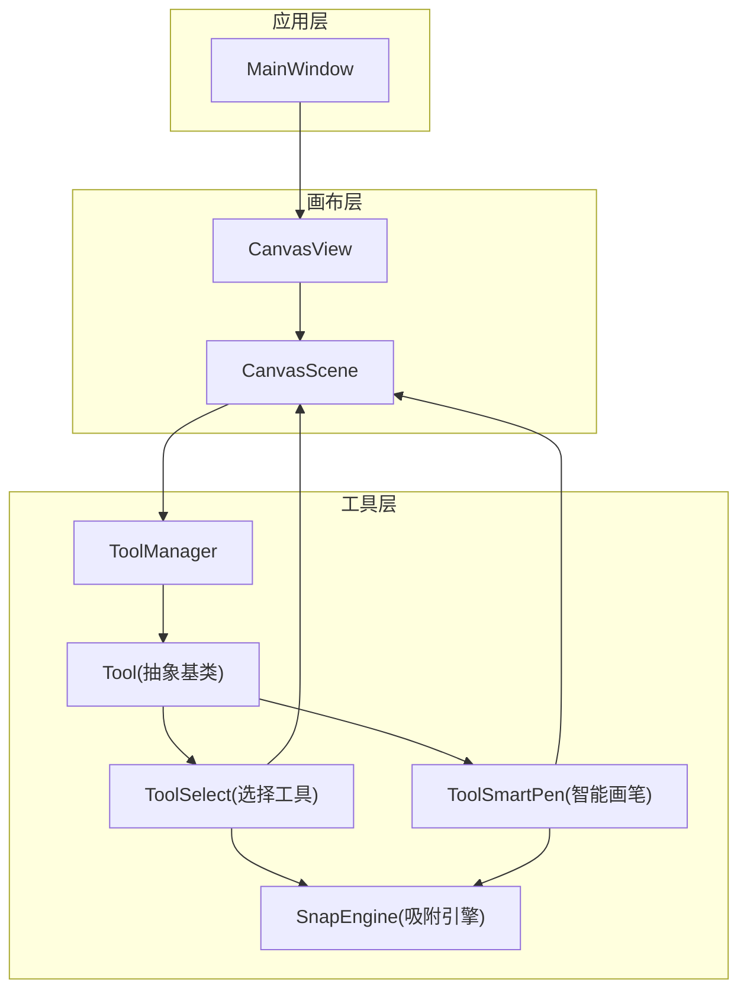
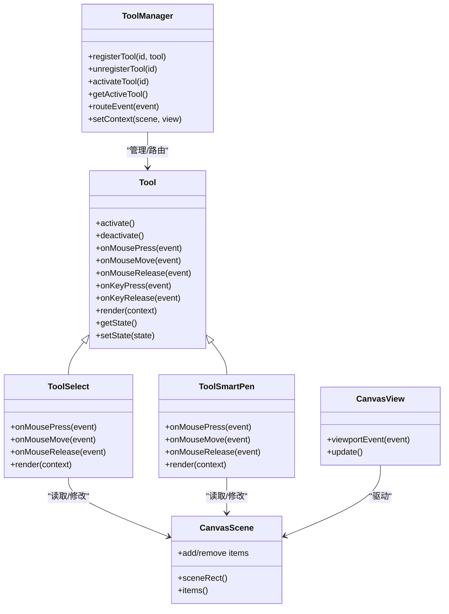
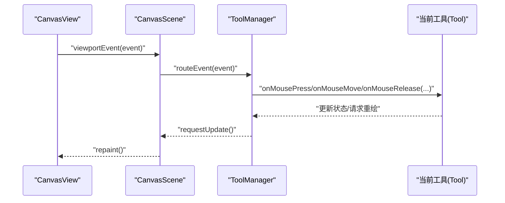
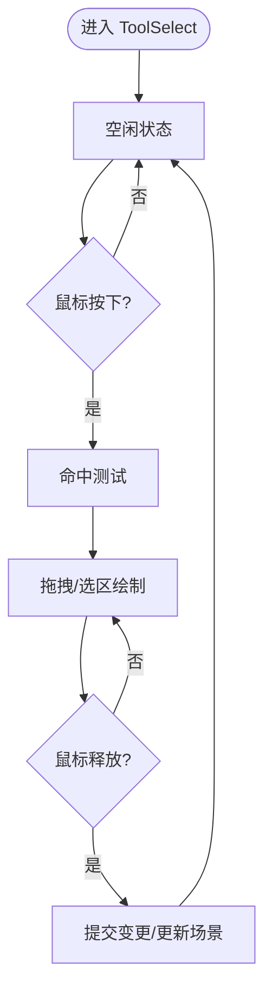
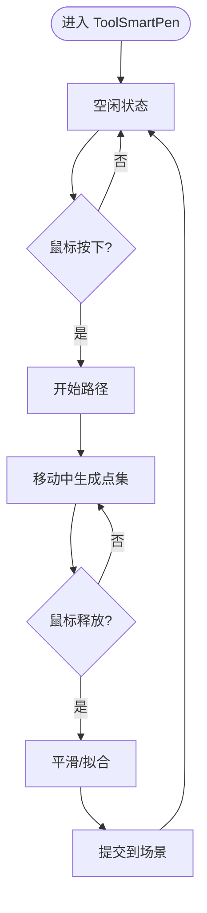
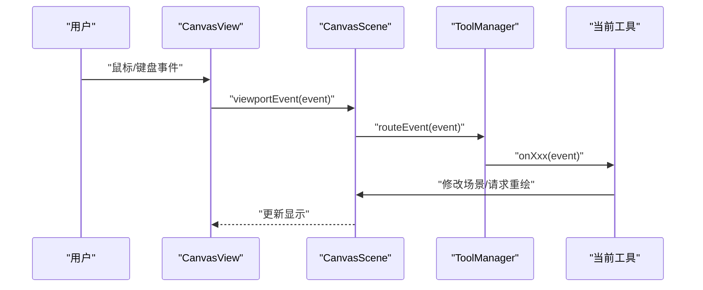
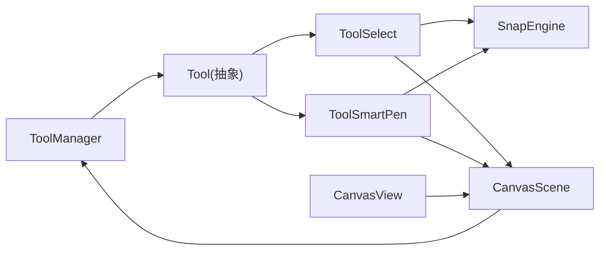

# 工具系统架构

<cite>
**本文引用的文件**   
- [Tool.h](file://src/tools/Tool.h)
- [ToolManager.h](file://src/tools/ToolManager.h)
- [ToolManager.cpp](file://src/tools/ToolManager.cpp)
- [ToolSelect.h](file://src/tools/ToolSelect.h)
- [ToolSelect.cpp](file://src/tools/ToolSelect.cpp)
- [ToolSmartPen.h](file://src/tools/ToolSmartPen.h)
- [ToolSmartPen.cpp](file://src/tools/ToolSmartPen.cpp)
- [CanvasScene.h](file://src/canvas/CanvasScene.h)
- [CanvasView.h](file://src/canvas/CanvasView.h)
- [MainWindow.h](file://src/app/MainWindow.h)
- [SnapEngine.h](file://src/tools/SnapEngine.h)
</cite>

## 目录
1. [简介](#简介)
2. [项目结构](#项目结构)
3. [核心组件](#核心组件)
4. [架构总览](#架构总览)
5. [详细组件分析](#详细组件分析)
6. [依赖关系分析](#依赖关系分析)
7. [性能考虑](#性能考虑)
8. [故障排查指南](#故障排查指南)
9. [结论](#结论)
10. [附录：新工具创建指南与最佳实践](#附录新工具创建指南与最佳实践)

## 简介
本文件面向服装CAD系统的“工具系统”模块，系统性阐述工具管理器 ToolManager 的工具注册、激活与切换机制；抽象工具类 Tool 的设计模式与具体实现（选择工具、智能画笔等）；工具状态管理、事件分发与用户交互处理；插件化架构与动态加载机制；以及工具配置与持久化存储方案。文档兼顾技术深度与可读性，帮助读者快速理解并扩展工具系统。

## 项目结构
工具系统位于 src/tools 目录，围绕抽象基类 Tool 和工具管理器 ToolManager 构建，配合画布场景 CanvasScene 与视图 CanvasView 完成事件转发与渲染交互。主窗口 MainWindow 负责初始化与界面集成。

图表来源 
- [MainWindow.h](file://src/app/MainWindow.h)
- [CanvasView.h](file://src/canvas/CanvasView.h)
- [CanvasScene.h](file://src/canvas/CanvasScene.h)
- [ToolManager.h](file://src/tools/ToolManager.h)
- [Tool.h](file://src/tools/Tool.h)
- [ToolSelect.h](file://src/tools/ToolSelect.h)
- [ToolSmartPen.h](file://src/tools/ToolSmartPen.h)
- [SnapEngine.h](file://src/tools/SnapEngine.h)

章节来源
- [MainWindow.h](file://src/app/MainWindow.h)
- [CanvasView.h](file://src/canvas/CanvasView.h)
- [CanvasScene.h](file://src/canvas/CanvasScene.h)
- [ToolManager.h](file://src/tools/ToolManager.h)
- [Tool.h](file://src/tools/Tool.h)
- [ToolSelect.h](file://src/tools/ToolSelect.h)
- [ToolSmartPen.h](file://src/tools/ToolSmartPen.h)
- [SnapEngine.h](file://src/tools/SnapEngine.h)

## 核心组件
- 抽象工具类 Tool：定义工具的统一接口，包括生命周期钩子、鼠标/键盘事件处理、绘制回调、状态切换等。
- 工具管理器 ToolManager：维护工具集合、注册/注销、激活/切换、当前工具引用、事件路由。
- 具体工具实现：
  - ToolSelect：用于选择与编辑图形元素。
  - ToolSmartPen：智能画笔，提供路径绘制与智能修正能力。
- 辅助子系统：
  - SnapEngine：吸附计算，为工具提供几何对齐能力。
  - CanvasScene/CanvasView：事件源与渲染目标，承载工具交互上下文。

章节来源
- [Tool.h](file://src/tools/Tool.h)
- [ToolManager.h](file://src/tools/ToolManager.h)
- [ToolManager.cpp](file://src/tools/ToolManager.cpp)
- [ToolSelect.h](file://src/tools/ToolSelect.h)
- [ToolSelect.cpp](file://src/tools/ToolSelect.cpp)
- [ToolSmartPen.h](file://src/tools/ToolSmartPen.h)
- [ToolSmartPen.cpp](file://src/tools/ToolSmartPen.cpp)
- [SnapEngine.h](file://src/tools/SnapEngine.h)
- [CanvasScene.h](file://src/canvas/CanvasScene.h)
- [CanvasView.h](file://src/canvas/CanvasView.h)

## 架构总览
工具系统采用“抽象基类 + 管理器调度”的架构模式。ToolManager 作为单例或全局控制器，集中管理工具的生命周期与事件分发；各具体工具通过继承 Tool 实现差异化行为；画布场景与视图将输入事件统一转交给当前激活工具处理，形成清晰的分层与解耦。

图表来源 
- [Tool.h](file://src/tools/Tool.h)
- [ToolManager.h](file://src/tools/ToolManager.h)
- [ToolSelect.h](file://src/tools/ToolSelect.h)
- [ToolSmartPen.h](file://src/tools/ToolSmartPen.h)
- [CanvasScene.h](file://src/canvas/CanvasScene.h)
- [CanvasView.h](file://src/canvas/CanvasView.h)

## 详细组件分析

### 抽象工具类 Tool 设计模式
- 设计模式：模板方法 + 策略模式。Tool 定义统一的接口与默认行为，具体工具通过重写事件处理与渲染方法实现差异逻辑。
- 关键职责：
  - 生命周期：激活/停用钩子，便于资源申请与释放。
  - 事件处理：鼠标/键盘事件入口，确保工具对输入有明确响应。
  - 渲染：在画布上下文中绘制工具反馈（如选框、预览线）。
  - 状态管理：内部状态机（如 idle/dragging/drawing），保证交互一致性。

章节来源
- [Tool.h](file://src/tools/Tool.h)

### 工具管理器 ToolManager：注册、激活与切换
- 工具注册：支持按唯一标识注册工具实例，内部维护映射表。
- 激活与切换：设置当前激活工具，触发旧工具的停用与新工具的激活钩子。
- 事件路由：从 CanvasView/CanvasScene 接收事件，分发给当前激活工具。
- 上下文注入：持有 CanvasScene/CanvasView 引用，供工具访问场景数据与刷新视图。

图表来源 
- [ToolManager.h](file://src/tools/ToolManager.h)
- [ToolManager.cpp](file://src/tools/ToolManager.cpp)
- [CanvasView.h](file://src/canvas/CanvasView.h)
- [CanvasScene.h](file://src/canvas/CanvasScene.h)

章节来源
- [ToolManager.h](file://src/tools/ToolManager.h)
- [ToolManager.cpp](file://src/tools/ToolManager.cpp)

### 选择工具 ToolSelect
- 功能要点：
  - 鼠标按下检测命中项，移动时拖拽选区或移动选中项，释放时确认操作。
  - 渲染选框与高亮效果。
  - 与 SnapEngine 协作，提供吸附对齐。
- 状态流转：空闲 -> 按下 -> 拖拽 -> 释放 -> 空闲。

图表来源 
- [ToolSelect.h](file://src/tools/ToolSelect.h)
- [ToolSelect.cpp](file://src/tools/ToolSelect.cpp)
- [SnapEngine.h](file://src/tools/SnapEngine.h)
- [CanvasScene.h](file://src/canvas/CanvasScene.h)

章节来源
- [ToolSelect.h](file://src/tools/ToolSelect.h)
- [ToolSelect.cpp](file://src/tools/ToolSelect.cpp)

### 智能画笔 ToolSmartPen
- 功能要点：
  - 按下开始绘制路径，移动过程中实时生成平滑曲线或折线。
  - 释放时提交路径到场景，支持撤销/重做（由上层命令系统管理）。
  - 与 SnapEngine 协作，自动吸附关键点。
- 状态流转：空闲 -> 按下 -> 绘制中 -> 释放 -> 空闲。

图表来源 
- [ToolSmartPen.h](file://src/tools/ToolSmartPen.h)
- [ToolSmartPen.cpp](file://src/tools/ToolSmartPen.cpp)
- [SnapEngine.h](file://src/tools/SnapEngine.h)
- [CanvasScene.h](file://src/canvas/CanvasScene.h)

章节来源
- [ToolSmartPen.h](file://src/tools/ToolSmartPen.h)
- [ToolSmartPen.cpp](file://src/tools/ToolSmartPen.cpp)

### 事件分发与用户交互处理
- 事件源：CanvasView 捕获用户输入，转发至 CanvasScene。
- 路由中心：ToolManager 根据当前激活工具进行事件分发。
- 工具内处理：具体工具实现事件回调，更新自身状态并请求重绘。
- 场景更新：工具通过 CanvasScene 修改模型，再由视图刷新。

图表来源 
- [CanvasView.h](file://src/canvas/CanvasView.h)
- [CanvasScene.h](file://src/canvas/CanvasScene.h)
- [ToolManager.h](file://src/tools/ToolManager.h)
- [Tool.h](file://src/tools/Tool.h)

章节来源
- [CanvasView.h](file://src/canvas/CanvasView.h)
- [CanvasScene.h](file://src/canvas/CanvasScene.h)
- [ToolManager.h](file://src/tools/ToolManager.h)
- [Tool.h](file://src/tools/Tool.h)

## 依赖关系分析
- 松耦合：Tool 仅依赖抽象接口与场景访问能力，不直接耦合 UI 框架细节。
- 管理器集中：ToolManager 统一管理工具生命周期与事件路由，降低调用方复杂度。
- 场景依赖：工具通过 CanvasScene 读写图形元素，避免与具体渲染管线耦合。
- 吸附引擎：SnapEngine 被多个工具复用，提升一致性与性能。

图表来源 
- [ToolManager.h](file://src/tools/ToolManager.h)
- [Tool.h](file://src/tools/Tool.h)
- [ToolSelect.h](file://src/tools/ToolSelect.h)
- [ToolSmartPen.h](file://src/tools/ToolSmartPen.h)
- [CanvasScene.h](file://src/canvas/CanvasScene.h)
- [CanvasView.h](file://src/canvas/CanvasView.h)
- [SnapEngine.h](file://src/tools/SnapEngine.h)

章节来源
- [ToolManager.h](file://src/tools/ToolManager.h)
- [Tool.h](file://src/tools/Tool.h)
- [ToolSelect.h](file://src/tools/ToolSelect.h)
- [ToolSmartPen.h](file://src/tools/ToolSmartPen.h)
- [CanvasScene.h](file://src/canvas/CanvasScene.h)
- [CanvasView.h](file://src/canvas/CanvasView.h)
- [SnapEngine.h](file://src/tools/SnapEngine.h)

## 性能考虑
- 事件节流：在高频率鼠标移动事件中，使用采样或合并策略减少计算量。
- 命中测试优化：对大量图形元素使用空间索引（如四叉树/网格）加速命中检测。
- 渲染批处理：将工具预览绘制与场景绘制分离，仅在必要时重绘受影响区域。
- 吸附缓存：对常用参考点进行缓存，避免重复计算。
- 工具状态最小化：保持工具状态对象轻量，避免频繁分配与拷贝。

[本节为通用指导，不涉及具体文件]

## 故障排查指南
- 工具未响应事件：
  - 检查 ToolManager 是否正确设置当前激活工具。
  - 确认 CanvasView/CanvasScene 的事件转发链是否完整。
- 绘制异常：
  - 验证工具 render 回调中的上下文有效性。
  - 检查场景更新后是否触发了视图刷新。
- 吸附不准确：
  - 调整 SnapEngine 的阈值与容差参数。
  - 确认坐标变换与单位换算正确。
- 内存泄漏：
  - 确保工具 deactivate 时释放临时资源。
  - 检查工具实例生命周期与注册/注销匹配。

章节来源
- [ToolManager.h](file://src/tools/ToolManager.h)
- [ToolManager.cpp](file://src/tools/ToolManager.cpp)
- [Tool.h](file://src/tools/Tool.h)
- [CanvasView.h](file://src/canvas/CanvasView.h)
- [CanvasScene.h](file://src/canvas/CanvasScene.h)
- [SnapEngine.h](file://src/tools/SnapEngine.h)

## 结论
工具系统以抽象基类与管理器为核心，实现了清晰的职责划分与可扩展的插件化架构。通过统一的事件分发与状态管理，选择工具与智能画笔等具体工具能够稳定工作并与画布场景良好协作。遵循本文档的最佳实践，可高效扩展新工具并保持系统性能与可维护性。

[本节为总结，不涉及具体文件]

## 附录：新工具创建指南与最佳实践
- 步骤概览：
  1. 新建工具类继承 Tool，实现必要的事件处理与渲染方法。
  2. 在 ToolManager 中注册工具，并提供唯一标识。
  3. 在主界面或菜单中提供切换入口，调用激活接口。
  4. 如需吸附能力，集成 SnapEngine 并合理设置阈值。
  5. 实现工具状态机，确保交互流程清晰且可恢复。
- 最佳实践：
  - 保持工具无副作用：避免在事件回调中执行耗时操作，必要时异步处理。
  - 合理使用撤销/重做：将工具产生的变更封装为命令，交由上层管理。
  - 配置与持久化：将工具偏好（如吸附阈值、笔刷大小）序列化到配置文件或数据库，启动时加载。
  - 单元测试：为工具的状态转换与边界条件编写测试用例。
- 配置与持久化建议：
  - 使用键值对存储工具配置，包含默认值与校验规则。
  - 提供导入/导出功能，便于团队协作与版本迁移。
  - 敏感信息加密存储，保障数据安全。

[本节为通用指导，不涉及具体文件]