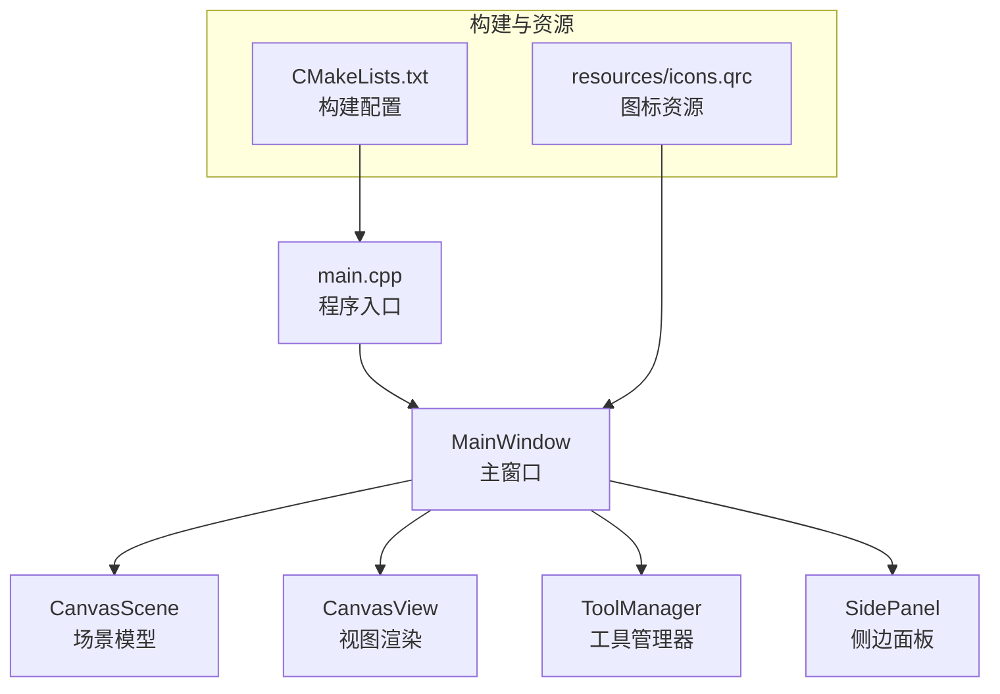
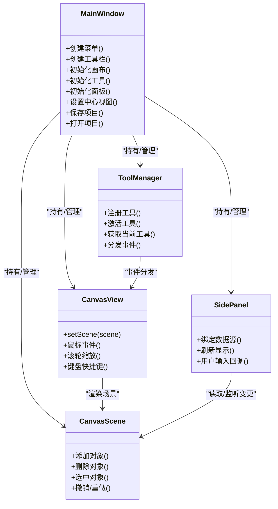
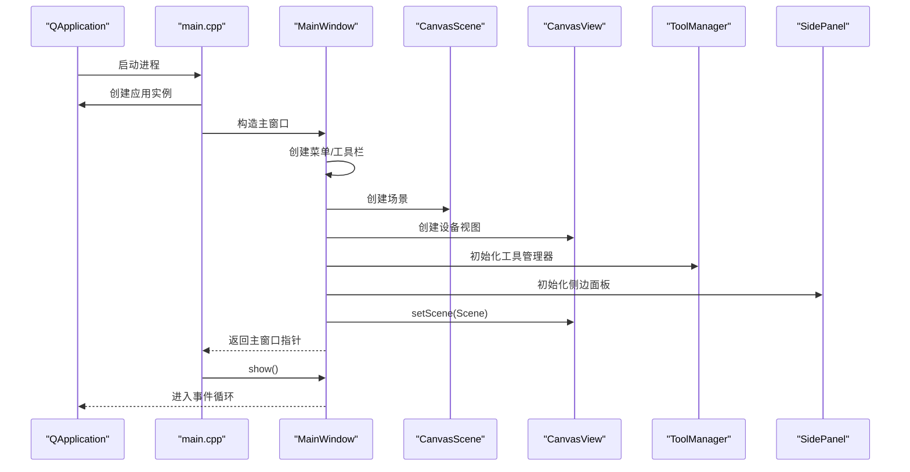
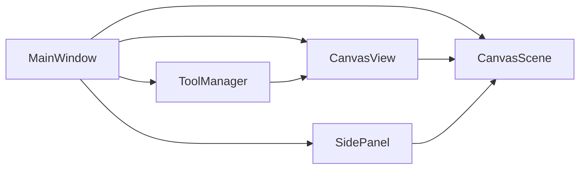

# 应用层架构

<cite>
**本文引用的文件**   
- [main.cpp](file://src/main.cpp)
- [MainWindow.h](file://src/app/MainWindow.h)
- [MainWindow.cpp](file://src/app/MainWindow.cpp)
- [CMakeLists.txt](file://CMakeLists.txt)
- [CanvasScene.h](file://src/canvas/CanvasScene.h)
- [CanvasView.h](file://src/canvas/CanvasView.h)
- [ToolManager.h](file://src/tools/ToolManager.h)
- [SidePanel.h](file://src/ui/SidePanel.h)
</cite>

## 目录
1. [简介](#简介)
2. [项目结构](#项目结构)
3. [核心组件](#核心组件)
4. [架构总览](#架构总览)
5. [详细组件分析](#详细组件分析)
6. [依赖关系分析](#依赖关系分析)
7. [性能考量](#性能考量)
8. [故障排查指南](#故障排查指南)
9. [结论](#结论)
10. [附录](#附录)

## 简介
本文件面向服装CAD系统的应用层架构，重点围绕主窗口 MainWindow 的设计模式、生命周期管理、与其他组件的集成方式展开。文档涵盖应用程序启动流程、初始化顺序与依赖注入机制；解释选择 Qt 作为 UI 框架的原因与技术决策；并详细说明窗口管理、菜单系统、工具栏配置和用户交互处理。此外，提供主窗口的扩展点与自定义方法，以及错误处理策略和资源管理机制，帮助开发者快速理解并扩展应用层能力。

## 项目结构
应用层位于 src/app，主入口为 src/main.cpp，UI 相关组件分布在 src/ui 和 src/canvas，工具子系统在 src/tools。构建系统使用 CMake（见 CMakeLists.txt），资源通过 Qt 资源系统组织。

图示来源
- [main.cpp](file://src/main.cpp)
- [MainWindow.h](file://src/app/MainWindow.h)
- [CMakeLists.txt](file://CMakeLists.txt)

章节来源
- [CMakeLists.txt](file://CMakeLists.txt)

## 核心组件
- 主窗口 MainWindow：承载应用界面、菜单、工具栏、状态栏及子视图容器，协调 CanvasScene、CanvasView、ToolManager、SidePanel 等模块。
- 画布子系统：CanvasScene 负责几何数据与对象管理，CanvasView 负责绘制与交互事件转发。
- 工具子系统：ToolManager 统一管理工具生命周期、激活切换与命令派发。
- UI 面板：SidePanel 等用于展示变量、公式、分组等编辑信息。

章节来源
- [MainWindow.h](file://src/app/MainWindow.h)
- [CanvasScene.h](file://src/canvas/CanvasScene.h)
- [CanvasView.h](file://src/canvas/CanvasView.h)
- [ToolManager.h](file://src/tools/ToolManager.h)
- [SidePanel.h](file://src/ui/SidePanel.h)

## 架构总览
应用采用“主窗口协调 + 模块化子系统”的分层架构。主窗口作为门面，负责装配各子系统并提供用户交互入口；子系统之间通过接口或信号槽松耦合通信。Qt 的信号槽机制贯穿 UI 事件、工具切换、面板更新等关键路径。

图示来源
- [MainWindow.h](file://src/app/MainWindow.h)
- [CanvasScene.h](file://src/canvas/CanvasScene.h)
- [CanvasView.h](file://src/canvas/CanvasView.h)
- [ToolManager.h](file://src/tools/ToolManager.h)
- [SidePanel.h](file://src/ui/SidePanel.h)

## 详细组件分析

### 主窗口 MainWindow：设计模式与生命周期
- 设计模式
  - 门面模式：MainWindow 对外暴露统一的初始化与操作接口，屏蔽子系统细节。
  - 观察者模式：通过 Qt 信号槽实现 UI 状态、工具切换、面板更新的解耦通知。
  - 工厂/注册模式：工具由 ToolManager 统一注册与激活，便于扩展新工具。
- 生命周期
  - 构造阶段：创建菜单、工具栏、状态栏、中心视图容器。
  - 初始化阶段：实例化 CanvasScene、CanvasView、ToolManager、SidePanel，完成绑定与装配。
  - 运行阶段：响应用户交互、工具切换、文件操作、撤销重做等。
  - 析构阶段：释放资源、断开连接、持久化状态。
- 依赖注入
  - 通过构造函数或 setter 注入 CanvasScene、CanvasView、ToolManager、SidePanel 等依赖，便于测试替换与插件化。

章节来源
- [MainWindow.h](file://src/app/MainWindow.h)
- [MainWindow.cpp](file://src/app/MainWindow.cpp)

### 应用程序启动流程与初始化顺序
- 启动入口 main.cpp 创建 QApplication，加载样式与全局配置。
- 实例化 MainWindow，触发其内部初始化序列：
  1) 创建并组装菜单与工具栏
  2) 创建 CanvasScene 与 CanvasView，设置为中心视图
  3) 初始化 ToolManager，注册默认工具
  4) 初始化 SidePanel，绑定数据源与信号槽
  5) 恢复上次会话状态（如最近文件、窗口布局）
- 调用 show() 显示主窗口，进入事件循环。

图示来源
- [main.cpp](file://src/main.cpp)
- [MainWindow.h](file://src/app/MainWindow.h)
- [CanvasScene.h](file://src/canvas/CanvasScene.h)
- [CanvasView.h](file://src/canvas/CanvasView.h)
- [ToolManager.h](file://src/tools/ToolManager.h)
- [SidePanel.h](file://src/ui/SidePanel.h)

章节来源
- [main.cpp](file://src/main.cpp)
- [MainWindow.cpp](file://src/app/MainWindow.cpp)

### UI 框架选择：Qt 的技术决策
- 跨平台 GUI：Windows/macOS/Linux 一致体验，降低移植成本。
- 信号槽机制：天然的事件驱动与解耦通信，适合 CAD 复杂交互。
- 图形栈：QGraphicsView/Scene 提供高性能矢量绘制与碰撞检测。
- 资源系统：qrc 集中管理图标与资源，便于打包与版本控制。
- 生态完善：CMake 集成良好，单元测试与调试工具链成熟。

章节来源
- [CMakeLists.txt](file://CMakeLists.txt)

### 窗口管理、菜单系统与工具栏配置
- 窗口管理
  - 主窗口作为顶层容器，支持停靠面板、分割器、最小化/最大化、全屏切换。
  - 通过 QSettings 或配置文件持久化窗口布局与状态。
- 菜单系统
  - 文件菜单：新建、打开、保存、导出、退出。
  - 编辑菜单：撤销、重做、复制、粘贴、查找替换。
  - 视图菜单：缩放、网格、吸附、图层管理。
  - 工具菜单：按类别组织工具命令，支持快捷键映射。
- 工具栏配置
  - 常用命令以按钮形式呈现，支持拖拽排序与隐藏。
  - 动态启用/禁用基于当前工具与选中对象状态。

章节来源
- [MainWindow.h](file://src/app/MainWindow.h)
- [MainWindow.cpp](file://src/app/MainWindow.cpp)

### 用户交互处理
- 鼠标事件：CanvasView 捕获点击、拖拽、滚轮缩放，转发至 ToolManager 与 CanvasScene。
- 键盘事件：快捷键触发菜单命令或工具切换。
- 工具切换：ToolManager 根据当前激活工具决定事件处理策略。
- 面板联动：SidePanel 监听场景变更，实时更新变量、公式与分组信息。

章节来源
- [CanvasView.h](file://src/canvas/CanvasView.h)
- [ToolManager.h](file://src/tools/ToolManager.h)
- [SidePanel.h](file://src/ui/SidePanel.h)

### 主窗口扩展点与自定义方法
- 扩展点
  - 新增菜单项：在对应菜单组插入动作，绑定槽函数。
  - 新增工具：在 ToolManager 中注册工具类，定义事件处理逻辑。
  - 新增面板：继承 SidePanel 基类，绑定数据源与信号槽。
  - 主题与样式：通过样式表或资源替换图标。
- 自定义方法
  - 覆盖初始化钩子：重写特定初始化步骤以注入业务逻辑。
  - 事件过滤器：拦截或增强特定控件行为。
  - 插件接口：预留插件加载入口，按需扩展功能。

章节来源
- [MainWindow.h](file://src/app/MainWindow.h)
- [MainWindow.cpp](file://src/app/MainWindow.cpp)

### 错误处理策略
- 异常与返回值：对 I/O、解析失败等使用明确的错误码与异常类型。
- 用户提示：通过消息框或状态栏提示错误原因与解决建议。
- 回滚与恢复：关键操作前保存快照，失败时自动回滚。
- 日志记录：记录关键路径与异常堆栈，便于定位问题。

章节来源
- [MainWindow.cpp](file://src/app/MainWindow.cpp)

### 资源管理机制
- 资源文件：icons.qrc 集中管理图标与媒体资源，编译期打包。
- 内存管理：Qt 父子对象树自动释放，避免手动 delete。
- 大对象缓存：对频繁使用的几何数据进行轻量缓存，减少重复计算。
- 配置持久化：使用 QSettings 或 JSON 文件保存用户偏好。

章节来源
- [CMakeLists.txt](file://CMakeLists.txt)

## 依赖关系分析
- 内聚性
  - MainWindow 高内聚于界面装配与协调，低内聚于具体业务逻辑。
  - CanvasScene/CanvasView 专注数据与渲染，职责清晰。
- 耦合度
  - 通过信号槽与接口降低模块间耦合，避免循环依赖。
- 外部依赖
  - Qt 框架、CMake 构建系统、可选第三方库（如数学库）。

图示来源
- [MainWindow.h](file://src/app/MainWindow.h)
- [CanvasScene.h](file://src/canvas/CanvasScene.h)
- [CanvasView.h](file://src/canvas/CanvasView.h)
- [ToolManager.h](file://src/tools/ToolManager.h)
- [SidePanel.h](file://src/ui/SidePanel.h)

章节来源
- [MainWindow.h](file://src/app/MainWindow.h)
- [CanvasScene.h](file://src/canvas/CanvasScene.h)
- [CanvasView.h](file://src/canvas/CanvasView.h)
- [ToolManager.h](file://src/tools/ToolManager.h)
- [SidePanel.h](file://src/ui/SidePanel.h)

## 性能考量
- 渲染优化
  - 使用 QGraphicsView 的视口裁剪与增量更新。
  - 合并绘制批次，减少状态切换。
- 事件处理
  - 延迟计算与异步任务，避免阻塞 UI 线程。
  - 节流高频事件（如滚轮缩放、拖动）。
- 内存占用
  - 懒加载大型资源，及时释放不再使用的对象。
  - 使用共享指针与对象池减少分配开销。

[本节为通用指导，不直接分析具体文件]

## 故障排查指南
- 常见问题
  - 菜单/工具栏未显示：检查 QAction 是否添加到菜单/工具栏，并确保可见性设置正确。
  - 工具无响应：确认 ToolManager 已注册并激活相应工具，事件转发链路完整。
  - 面板数据不同步：检查信号槽绑定是否正确，数据源是否更新。
  - 资源缺失：确认 qrc 包含所需图标，构建产物中包含资源。
- 诊断步骤
  - 启用调试输出与断点，跟踪关键函数调用链。
  - 使用 Qt Creator 的调试器与性能分析工具定位瓶颈。
  - 逐步隔离模块，验证最小可复现用例。

章节来源
- [MainWindow.cpp](file://src/app/MainWindow.cpp)

## 结论
本应用层以 MainWindow 为核心协调者，结合 Qt 的信号槽与 QGraphicsView/Scene 架构，实现了可扩展、易维护的 CAD 界面与交互体系。通过清晰的初始化顺序、依赖注入与模块化设计，开发者可以便捷地扩展菜单、工具与面板，同时保持系统的稳定性与性能。建议在后续迭代中持续完善错误处理、日志与性能监控，以提升用户体验与开发效率。

## 附录
- 术语
  - 主窗口：应用的顶层窗口，承载菜单、工具栏、状态栏与子视图。
  - 场景：存储几何对象与关系的模型层。
  - 视图：负责渲染与用户交互的界面层。
  - 工具：封装特定交互行为的处理器。
  - 面板：辅助编辑与展示的 UI 组件。
- 参考
  - Qt 官方文档：QMainWindow、QGraphicsView、QAction、QToolBar、QSettings
  - CMake 构建系统：目标、依赖、资源打包

[本节为概念性内容，不直接分析具体文件]