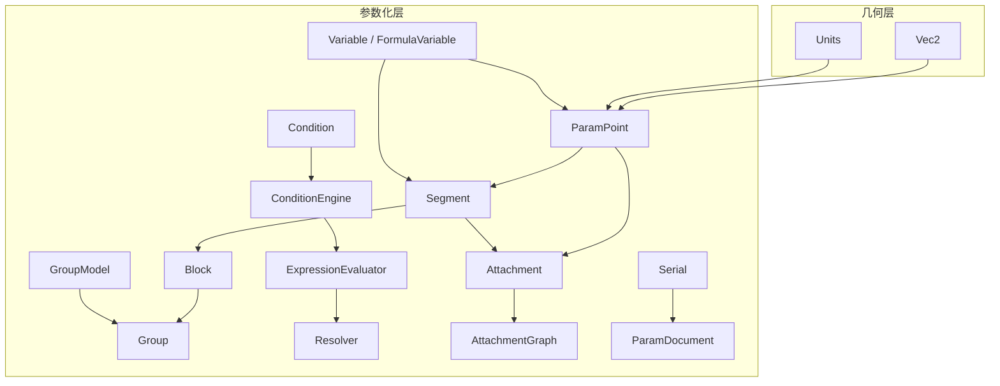
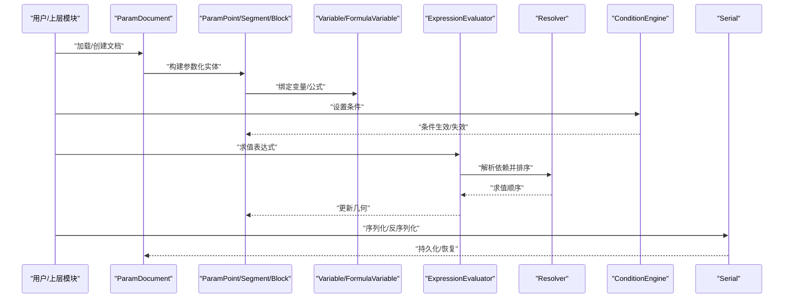
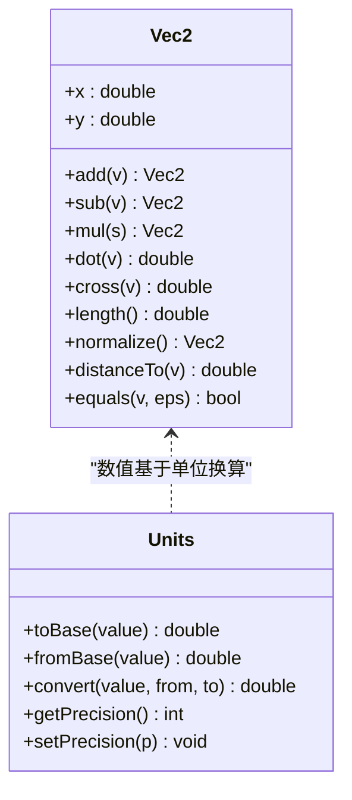
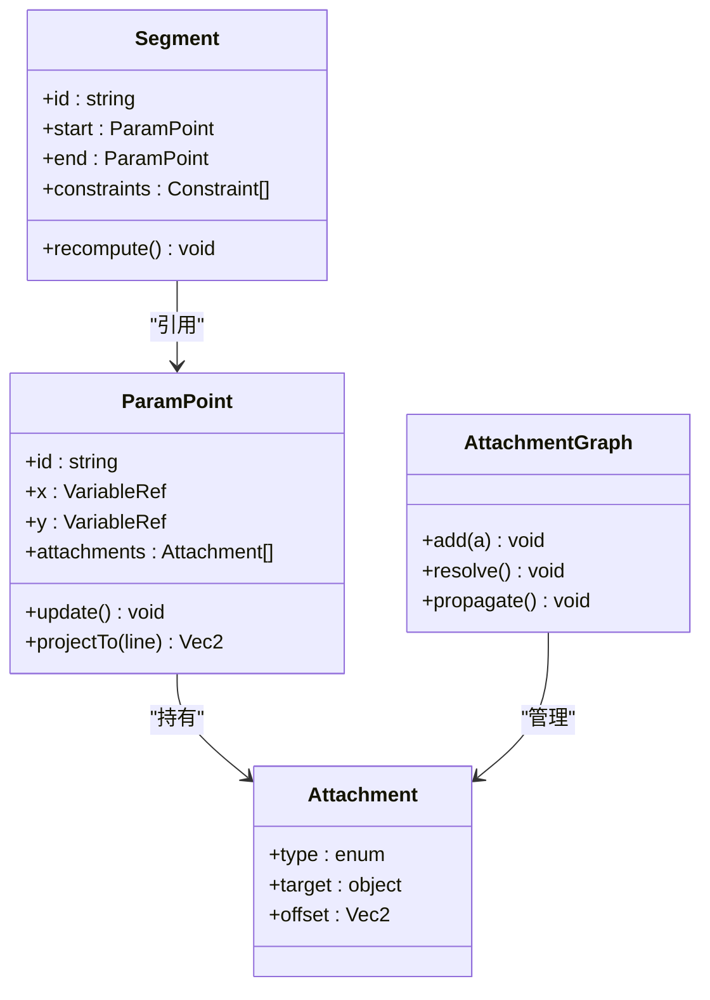
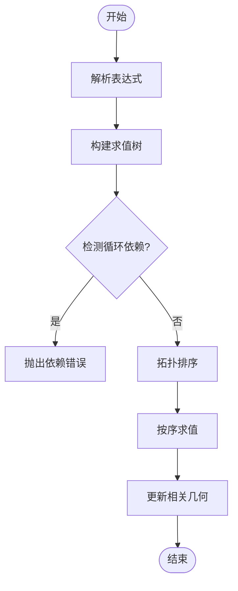
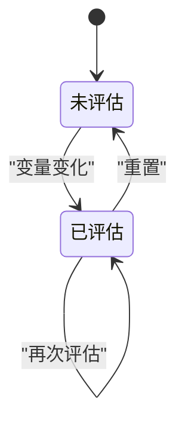
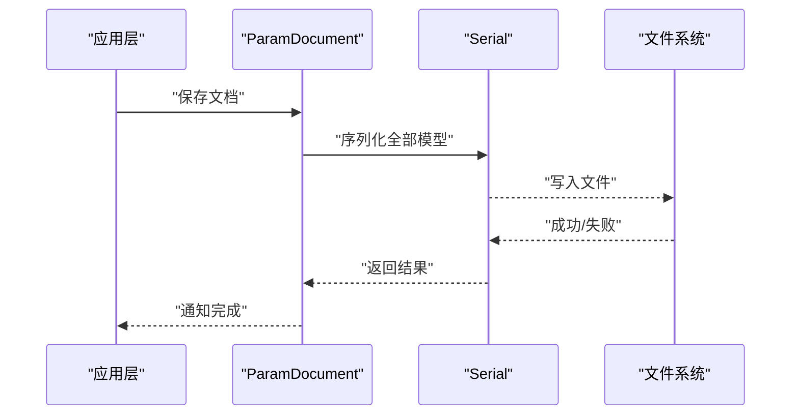
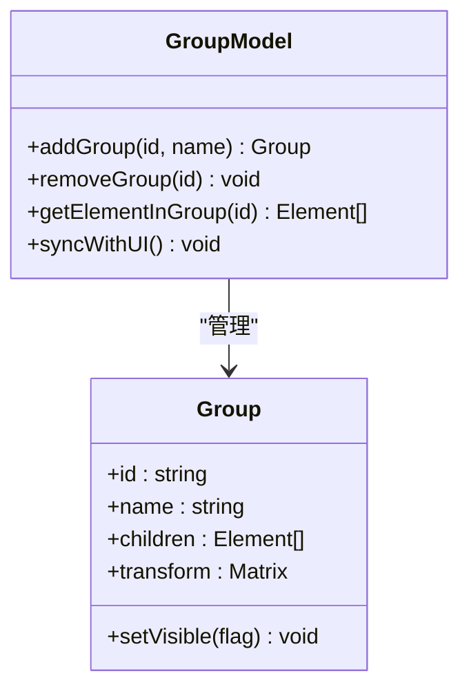
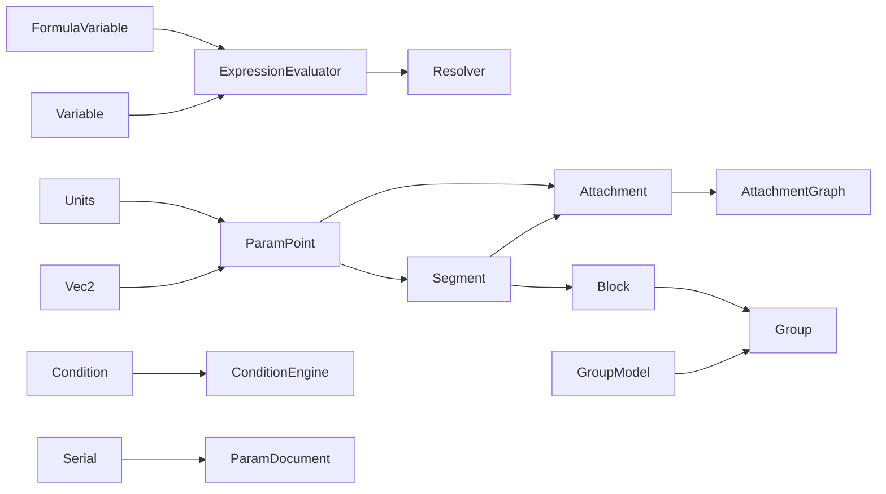

# 数据模型架构

<cite>
**本文引用的文件**   
- [Vec2.h](file://src/geometry/Vec2.h)
- [Units.h](file://src/geometry/Units.h)
- [ParamPoint.h](file://src/parametric/ParamPoint.h)
- [Segment.h](file://src/parametric/Segment.h)
- [Block.h](file://src/parametric/Block.h)
- [Group.h](file://src/parametric/Group.h)
- [Variable.h](file://src/parametric/Variable.h)
- [FormulaVariable.h](file://src/parametric/FormulaVariable.h)
- [Condition.h](file://src/parametric/Condition.h)
- [ConditionEngine.h](file://src/parametric/ConditionEngine.h)
- [ExpressionEvaluator.h](file://src/parametric/ExpressionEvaluator.h)
- [Resolver.h](file://src/parametric/Resolver.h)
- [Attachment.h](file://src/parametric/Attachment.h)
- [AttachmentGraph.h](file://src/parametric/AttachmentGraph.h)
- [Serial.h](file://src/parametric/Serial.h)
- [Serial.cpp](file://src/parametric/Serial.cpp)
- [ParamDocument.h](file://src/parametric/ParamDocument.h)
- [ParamDocument.cpp](file://src/parametric/ParamDocument.cpp)
- [GroupModel.h](file://src/parametric/GroupModel.h)
- [GroupModel.cpp](file://src/parametric/GroupModel.cpp)
</cite>

## 目录
1. [简介](#简介)
2. [项目结构](#项目结构)
3. [核心组件](#核心组件)
4. [架构总览](#架构总览)
5. [详细组件分析](#详细组件分析)
6. [依赖关系分析](#依赖关系分析)
7. [性能与内存管理](#性能与内存管理)
8. [故障排查指南](#故障排查指南)
9. [结论](#结论)
10. [附录](#附录)

## 简介
本文件面向服装CAD系统的数据模型架构，聚焦几何基础类型、参数化实体、约束与表达式引擎、序列化机制以及扩展能力。文档旨在帮助开发者理解：
- 几何基础类型 Vec2 与 Units 的设计理念与精度控制策略
- 参数化数据模型 ParamPoint、Segment 等核心实体的关系与约束
- 数据验证规则与业务逻辑封装
- 数据序列化和反序列化机制
- 模型的扩展方法与自定义类型定义
- 内存管理与性能优化策略

## 项目结构
本项目采用分层组织方式：
- geometry：几何基础类型（二维向量、单位系统）
- parametric：参数化数据模型、表达式与约束、图结构与序列化
- ui/tools/canvas/app：上层交互、工具与视图层（不在本文重点范围）

**图表来源** 
- [Vec2.h](file://src/geometry/Vec2.h)
- [Units.h](file://src/geometry/Units.h)
- [ParamPoint.h](file://src/parametric/ParamPoint.h)
- [Segment.h](file://src/parametric/Segment.h)
- [Block.h](file://src/parametric/Block.h)
- [Group.h](file://src/parametric/Group.h)
- [Variable.h](file://src/parametric/Variable.h)
- [FormulaVariable.h](file://src/parametric/FormulaVariable.h)
- [Condition.h](file://src/parametric/Condition.h)
- [ConditionEngine.h](file://src/parametric/ConditionEngine.h)
- [ExpressionEvaluator.h](file://src/parametric/ExpressionEvaluator.h)
- [Resolver.h](file://src/parametric/Resolver.h)
- [Attachment.h](file://src/parametric/Attachment.h)
- [AttachmentGraph.h](file://src/parametric/AttachmentGraph.h)
- [Serial.h](file://src/parametric/Serial.h)
- [ParamDocument.h](file://src/parametric/ParamDocument.h)
- [GroupModel.h](file://src/parametric/GroupModel.h)

**章节来源**
- [Vec2.h](file://src/geometry/Vec2.h)
- [Units.h](file://src/geometry/Units.h)
- [ParamPoint.h](file://src/parametric/ParamPoint.h)
- [Segment.h](file://src/parametric/Segment.h)
- [Block.h](file://src/parametric/Block.h)
- [Group.h](file://src/parametric/Group.h)
- [Variable.h](file://src/parametric/Variable.h)
- [FormulaVariable.h](file://src/parametric/FormulaVariable.h)
- [Condition.h](file://src/parametric/Condition.h)
- [ConditionEngine.h](file://src/parametric/ConditionEngine.h)
- [ExpressionEvaluator.h](file://src/parametric/ExpressionEvaluator.h)
- [Resolver.h](file://src/parametric/Resolver.h)
- [Attachment.h](file://src/parametric/Attachment.h)
- [AttachmentGraph.h](file://src/parametric/AttachmentGraph.h)
- [Serial.h](file://src/parametric/Serial.h)
- [ParamDocument.h](file://src/parametric/ParamDocument.h)
- [GroupModel.h](file://src/parametric/GroupModel.h)

## 核心组件
本节概述几何基础类型与参数化核心实体的职责与协作关系。

- 几何基础类型
  - Vec2：二维点/向量的基本运算与比较，提供精度容差与单位转换接口
  - Units：单位系统与换算，确保数值在不同单位间一致性与精度可控
- 参数化实体
  - ParamPoint：参数化点，支持坐标由变量或表达式驱动，具备约束与附着点能力
  - Segment：参数化线段，端点由 ParamPoint 驱动，长度/角度可由公式约束
  - Block：包含若干几何元素的块级容器，用于装配与复用
  - Group：对多个 Block/元素进行分组管理，便于批量操作
- 变量与表达式
  - Variable/FormulaVariable：命名变量与公式变量，参与表达式求值
  - ExpressionEvaluator：表达式解析与求值
  - Resolver：依赖解析与拓扑排序，保证求值顺序正确
- 约束与条件
  - Condition：布尔条件，用于动态显示/隐藏或激活/禁用某些约束
  - ConditionEngine：条件引擎，维护条件状态并触发更新
- 附着与图结构
  - Attachment：附着点描述，用于点与线之间的几何依附关系
  - AttachmentGraph：附着图，维护附着关系的连通性，支撑联动更新
- 序列化与文档
  - Serial：数据序列化/反序列化接口与实现
  - ParamDocument：参数化文档，聚合所有模型对象并提供持久化入口
  - GroupModel：组模型，负责组的增删改查与同步

**章节来源**
- [Vec2.h](file://src/geometry/Vec2.h)
- [Units.h](file://src/geometry/Units.h)
- [ParamPoint.h](file://src/parametric/ParamPoint.h)
- [Segment.h](file://src/parametric/Segment.h)
- [Block.h](file://src/parametric/Block.h)
- [Group.h](file://src/parametric/Group.h)
- [Variable.h](file://src/parametric/Variable.h)
- [FormulaVariable.h](file://src/parametric/FormulaVariable.h)
- [Condition.h](file://src/parametric/Condition.h)
- [ConditionEngine.h](file://src/parametric/ConditionEngine.h)
- [ExpressionEvaluator.h](file://src/parametric/ExpressionEvaluator.h)
- [Resolver.h](file://src/parametric/Resolver.h)
- [Attachment.h](file://src/parametric/Attachment.h)
- [AttachmentGraph.h](file://src/parametric/AttachmentGraph.h)
- [Serial.h](file://src/parametric/Serial.h)
- [ParamDocument.h](file://src/parametric/ParamDocument.h)
- [GroupModel.h](file://src/parametric/GroupModel.h)

## 架构总览
下图展示了从几何基础到参数化模型、再到表达式与约束的完整数据流与控制流。

**图表来源** 
- [ParamDocument.h](file://src/parametric/ParamDocument.h)
- [ParamDocument.cpp](file://src/parametric/ParamDocument.cpp)
- [ParamPoint.h](file://src/parametric/ParamPoint.h)
- [Segment.h](file://src/parametric/Segment.h)
- [Variable.h](file://src/parametric/Variable.h)
- [FormulaVariable.h](file://src/parametric/FormulaVariable.h)
- [ExpressionEvaluator.h](file://src/parametric/ExpressionEvaluator.h)
- [Resolver.h](file://src/parametric/Resolver.h)
- [ConditionEngine.h](file://src/parametric/ConditionEngine.h)
- [Serial.h](file://src/parametric/Serial.h)
- [Serial.cpp](file://src/parametric/Serial.cpp)

## 详细组件分析

### 几何基础类型：Vec2 与 Units
- 设计理念
  - Vec2 作为统一的二维几何基元，提供加减乘除、点积叉积、距离、角度、投影等常用运算，并内置精度容差比较，避免浮点误差导致的误判
  - Units 抽象单位系统，支持毫米、厘米、英寸等单位的换算，所有几何计算在内部统一为基准单位，输出时按需转换
- 精度控制
  - 使用 epsilon 容差进行相等性判断与几何判定
  - 单位换算保留足够小数位，避免累积误差
  - 关键几何判定（如共线、相交）提供阈值配置
- 扩展建议
  - 可引入 Vec3 以支持厚度方向建模
  - 为 Units 增加自定义单位注册机制

**图表来源** 
- [Vec2.h](file://src/geometry/Vec2.h)
- [Units.h](file://src/geometry/Units.h)

**章节来源**
- [Vec2.h](file://src/geometry/Vec2.h)
- [Units.h](file://src/geometry/Units.h)

### 参数化核心实体：ParamPoint 与 Segment
- ParamPoint
  - 坐标可由变量或表达式驱动，支持绝对/相对定位
  - 支持附着点（Attachment），与其他几何元素建立约束关系
  - 提供几何属性查询（如到线的投影、到点的距离）
- Segment
  - 两端点由 ParamPoint 驱动，长度/角度可由公式约束
  - 支持折线分段与平滑过渡
  - 与附着图联动，当端点变化时自动重算
- 关系与约束
  - 通过 Variable/FormulaVariable 将几何与参数关联
  - 通过 Attachment/AttachmentGraph 维护几何间的依附关系
  - 通过 Condition/ConditionEngine 控制约束的启用/禁用

**图表来源** 
- [ParamPoint.h](file://src/parametric/ParamPoint.h)
- [Segment.h](file://src/parametric/Segment.h)
- [Attachment.h](file://src/parametric/Attachment.h)
- [AttachmentGraph.h](file://src/parametric/AttachmentGraph.h)

**章节来源**
- [ParamPoint.h](file://src/parametric/ParamPoint.h)
- [Segment.h](file://src/parametric/Segment.h)
- [Attachment.h](file://src/parametric/Attachment.h)
- [AttachmentGraph.h](file://src/parametric/AttachmentGraph.h)

### 变量、表达式与求解器：Variable、FormulaVariable、ExpressionEvaluator、Resolver
- Variable/FormulaVariable
  - 命名变量与公式变量，支持作用域与可见性控制
  - 公式变量可引用其他变量，形成依赖图
- ExpressionEvaluator
  - 解析表达式字符串，生成可执行求值树
  - 支持常见数学函数与运算符
- Resolver
  - 对变量依赖进行拓扑排序，避免循环依赖
  - 提供增量更新能力，仅重算受影响节点

**图表来源** 
- [Variable.h](file://src/parametric/Variable.h)
- [FormulaVariable.h](file://src/parametric/FormulaVariable.h)
- [ExpressionEvaluator.h](file://src/parametric/ExpressionEvaluator.h)
- [Resolver.h](file://src/parametric/Resolver.h)

**章节来源**
- [Variable.h](file://src/parametric/Variable.h)
- [FormulaVariable.h](file://src/parametric/FormulaVariable.h)
- [ExpressionEvaluator.h](file://src/parametric/ExpressionEvaluator.h)
- [Resolver.h](file://src/parametric/Resolver.h)

### 条件与引擎：Condition 与 ConditionEngine
- Condition
  - 布尔表达式，可基于变量值、几何状态或外部输入
  - 支持组合条件（与/或/非）
- ConditionEngine
  - 维护条件状态机，监听变量变化并重新评估
  - 触发回调以更新 UI 或几何可见性

**图表来源** 
- [Condition.h](file://src/parametric/Condition.h)
- [ConditionEngine.h](file://src/parametric/ConditionEngine.h)

**章节来源**
- [Condition.h](file://src/parametric/Condition.h)
- [ConditionEngine.h](file://src/parametric/ConditionEngine.h)

### 序列化与文档：Serial 与 ParamDocument
- Serial
  - 提供 JSON/XML/二进制等格式的序列化/反序列化接口
  - 支持版本兼容与字段迁移
- ParamDocument
  - 聚合所有模型对象（点、线、块、组、变量等）
  - 提供保存/打开、撤销/重做、批量更新等能力

**图表来源** 
- [Serial.h](file://src/parametric/Serial.h)
- [Serial.cpp](file://src/parametric/Serial.cpp)
- [ParamDocument.h](file://src/parametric/ParamDocument.h)
- [ParamDocument.cpp](file://src/parametric/ParamDocument.cpp)

**章节来源**
- [Serial.h](file://src/parametric/Serial.h)
- [Serial.cpp](file://src/parametric/Serial.cpp)
- [ParamDocument.h](file://src/parametric/ParamDocument.h)
- [ParamDocument.cpp](file://src/parametric/ParamDocument.cpp)

### 组与模型：Group 与 GroupModel
- Group
  - 对多个 Block/元素进行分组，支持层级结构
  - 提供批量变换、可见性控制、选择集管理
- GroupModel
  - 管理组的增删改查，维护组与元素的双向映射
  - 与 UI 层同步，响应选择与编辑事件

**图表来源** 
- [Group.h](file://src/parametric/Group.h)
- [GroupModel.h](file://src/parametric/GroupModel.h)
- [GroupModel.cpp](file://src/parametric/GroupModel.cpp)

**章节来源**
- [Group.h](file://src/parametric/Group.h)
- [GroupModel.h](file://src/parametric/GroupModel.h)
- [GroupModel.cpp](file://src/parametric/GroupModel.cpp)

## 依赖关系分析
参数化数据模型的核心依赖如下：
- ParamPoint/Segment 依赖 Vec2/Units 进行几何计算
- 变量与表达式依赖 Resolver 进行依赖解析
- 条件引擎依赖变量与表达式引擎
- 附着图依赖 ParamPoint/Segment 的附着点信息
- 序列化依赖所有模型对象的序列化接口
- 文档聚合所有对象并提供持久化入口

**图表来源** 
- [Vec2.h](file://src/geometry/Vec2.h)
- [Units.h](file://src/geometry/Units.h)
- [ParamPoint.h](file://src/parametric/ParamPoint.h)
- [Segment.h](file://src/parametric/Segment.h)
- [Block.h](file://src/parametric/Block.h)
- [Group.h](file://src/parametric/Group.h)
- [Variable.h](file://src/parametric/Variable.h)
- [FormulaVariable.h](file://src/parametric/FormulaVariable.h)
- [ExpressionEvaluator.h](file://src/parametric/ExpressionEvaluator.h)
- [Resolver.h](file://src/parametric/Resolver.h)
- [Condition.h](file://src/parametric/Condition.h)
- [ConditionEngine.h](file://src/parametric/ConditionEngine.h)
- [Attachment.h](file://src/parametric/Attachment.h)
- [AttachmentGraph.h](file://src/parametric/AttachmentGraph.h)
- [Serial.h](file://src/parametric/Serial.h)
- [ParamDocument.h](file://src/parametric/ParamDocument.h)
- [GroupModel.h](file://src/parametric/GroupModel.h)

**章节来源**
- [Vec2.h](file://src/geometry/Vec2.h)
- [Units.h](file://src/geometry/Units.h)
- [ParamPoint.h](file://src/parametric/ParamPoint.h)
- [Segment.h](file://src/parametric/Segment.h)
- [Block.h](file://src/parametric/Block.h)
- [Group.h](file://src/parametric/Group.h)
- [Variable.h](file://src/parametric/Variable.h)
- [FormulaVariable.h](file://src/parametric/FormulaVariable.h)
- [ExpressionEvaluator.h](file://src/parametric/ExpressionEvaluator.h)
- [Resolver.h](file://src/parametric/Resolver.h)
- [Condition.h](file://src/parametric/Condition.h)
- [ConditionEngine.h](file://src/parametric/ConditionEngine.h)
- [Attachment.h](file://src/parametric/Attachment.h)
- [AttachmentGraph.h](file://src/parametric/AttachmentGraph.h)
- [Serial.h](file://src/parametric/Serial.h)
- [ParamDocument.h](file://src/parametric/ParamDocument.h)
- [GroupModel.h](file://src/parametric/GroupModel.h)

## 性能与内存管理
- 内存管理
  - 使用智能指针管理对象生命周期，避免悬空引用
  - 对频繁创建的临时对象采用对象池或栈分配
  - 大数组（如顶点缓冲）使用连续内存布局以提升缓存命中率
- 性能优化
  - 表达式求值采用增量更新，仅重算受影响的变量与几何
  - 拓扑排序缓存依赖图，减少重复解析开销
  - 几何计算中合理使用近似算法与阈值，降低浮点误差带来的分支抖动
  - 序列化采用流式写入，避免一次性构建大型中间结构
- 精度控制
  - 全局 epsilon 配置，支持不同场景下的精度需求
  - 单位换算在边界处进行舍入，防止累积误差
  - 关键几何判定提供可配置的容差参数

[本节为通用指导，不直接分析具体文件]

## 故障排查指南
- 常见问题
  - 循环依赖：检查变量/公式变量的引用关系，确保无环
  - 精度问题：调整 epsilon 与单位换算精度，检查浮点比较
  - 附着关系异常：确认 Attachment 的目标与偏移量是否正确
  - 条件未生效：检查 ConditionEngine 的状态与监听器是否注册
  - 序列化失败：确认版本兼容与字段完整性
- 调试建议
  - 打印依赖图与求值顺序，定位瓶颈
  - 记录关键几何变更前后状态，对比差异
  - 使用最小复现用例隔离问题

[本节为通用指导，不直接分析具体文件]

## 结论
本数据模型架构以 Vec2/Units 为基础，结合参数化实体、表达式与约束引擎，实现了灵活且可扩展的服装CAD几何建模能力。通过清晰的依赖解析、条件控制与序列化机制，系统在易用性与性能之间取得平衡。未来可在三维扩展、更丰富的约束类型与更高效的求解器方面持续演进。

[本节为总结，不直接分析具体文件]

## 附录
- 扩展方法
  - 自定义几何类型：继承 Vec2 或新增 Vec3，实现必要运算与序列化
  - 自定义单位：在 Units 中注册新单位与换算规则
  - 自定义约束：实现新的 Constraint 类型并接入 AttachmentGraph
  - 自定义序列化格式：扩展 Serial 接口，支持新格式
- 最佳实践
  - 保持变量作用域清晰，避免全局污染
  - 合理拆分复杂表达式，提升可读性与可维护性
  - 对关键路径进行性能剖析，优先优化热点代码

[本节为补充说明，不直接分析具体文件]