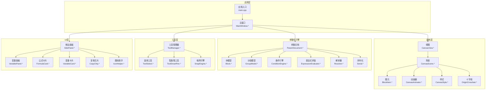
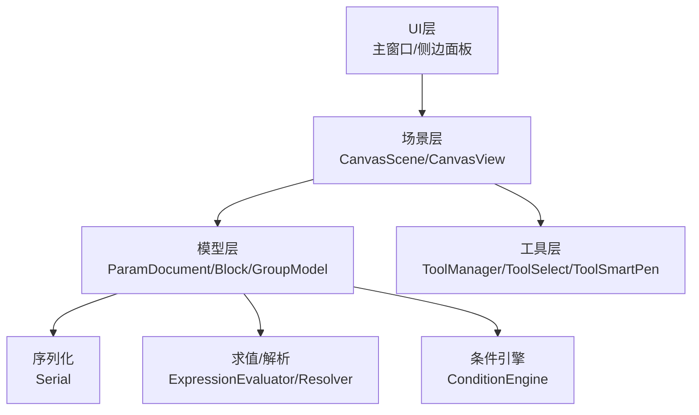
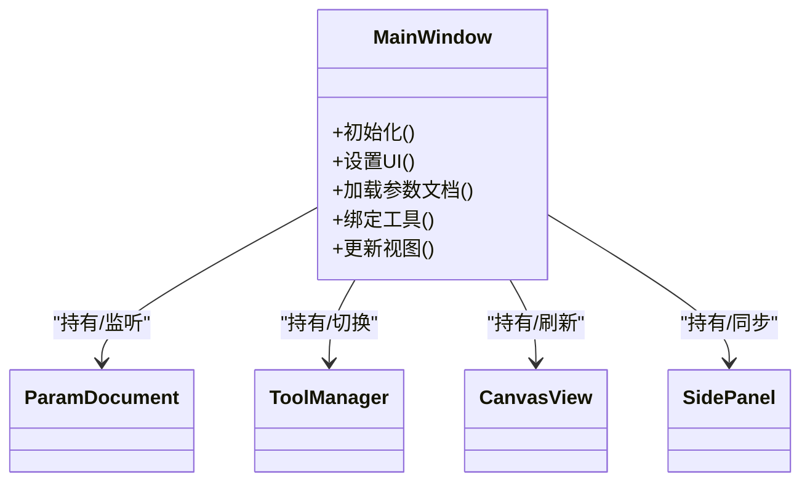
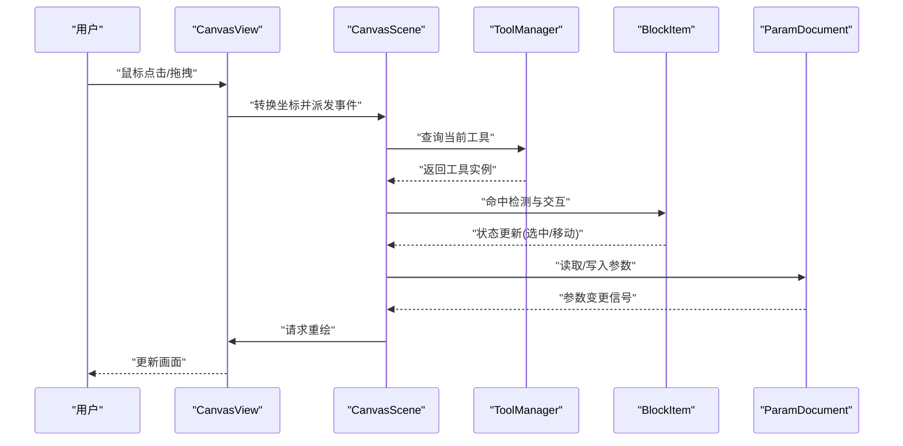
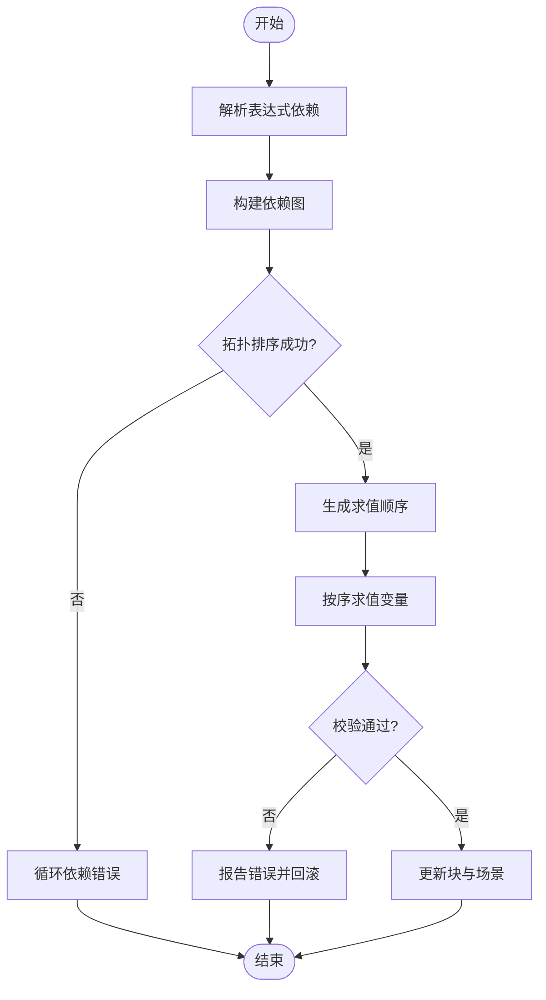
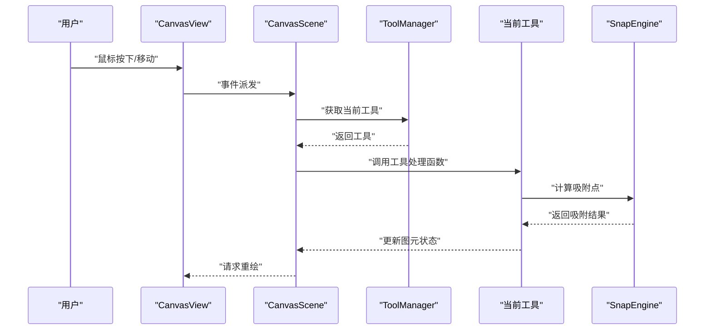
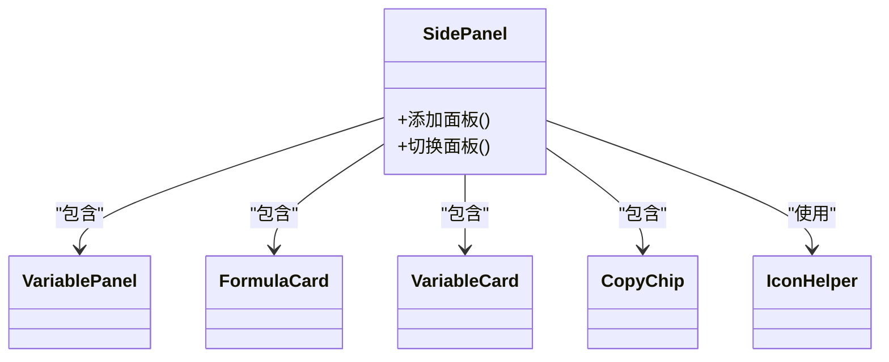
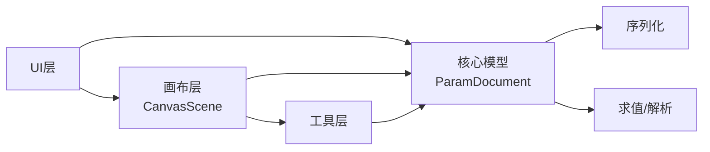

# 核心架构

<cite>
**本文引用的文件**   
- [main.cpp](file://src/main.cpp)
- [MainWindow.h](file://src/app/MainWindow.h)
- [MainWindow.cpp](file://src/app/MainWindow.cpp)
- [CanvasScene.h](file://src/canvas/CanvasScene.h)
- [CanvasScene.cpp](file://src/canvas/CanvasScene.cpp)
- [CanvasView.h](file://src/canvas/CanvasView.h)
- [CanvasView.cpp](file://src/canvas/CanvasView.cpp)
- [BlockItem.h](file://src/canvas/BlockItem.h)
- [BlockItem.cpp](file://src/canvas/BlockItem.cpp)
- [CanvasAnimator.h](file://src/canvas/CanvasAnimator.h)
- [CanvasAnimator.cpp](file://src/canvas/CanvasAnimator.cpp)
- [CanvasStyle.h](file://src/canvas/CanvasStyle.h)
- [CanvasStyle.cpp](file://src/canvas/CanvasStyle.cpp)
- [OriginCrosshair.h](file://src/canvas/OriginCrosshair.h)
- [OriginCrosshair.cpp](file://src/canvas/OriginCrosshair.cpp)
- [ParamDocument.h](file://src/parametric/ParamDocument.h)
- [ParamDocument.cpp](file://src/parametric/ParamDocument.cpp)
- [Block.h](file://src/parametric/Block.h)
- [Block.cpp](file://src/parametric/Block.cpp)
- [GroupModel.h](file://src/parametric/GroupModel.h)
- [GroupModel.cpp](file://src/parametric/GroupModel.cpp)
- [ConditionEngine.h](file://src/parametric/ConditionEngine.h)
- [ConditionEngine.cpp](file://src/parametric/ConditionEngine.cpp)
- [ExpressionEvaluator.h](file://src/parametric/ExpressionEvaluator.h)
- [ExpressionEvaluator.cpp](file://src/parametric/ExpressionEvaluator.cpp)
- [Resolver.h](file://src/parametric/Resolver.h)
- [Resolver.cpp](file://src/parametric/Resolver.cpp)
- [Serial.h](file://src/parametric/Serial.h)
- [Serial.cpp](file://src/parametric/Serial.cpp)
- [ToolManager.h](file://src/tools/ToolManager.h)
- [ToolManager.cpp](file://src/tools/ToolManager.cpp)
- [Tool.h](file://src/tools/Tool.h)
- [ToolSelect.h](file://src/tools/ToolSelect.h)
- [ToolSelect.cpp](file://src/tools/ToolSelect.cpp)
- [ToolSmartPen.h](file://src/tools/ToolSmartPen.h)
- [ToolSmartPen.cpp](file://src/tools/ToolSmartPen.cpp)
- [SnapEngine.h](file://src/tools/SnapEngine.h)
- [SnapEngine.cpp](file://src/tools/SnapEngine.cpp)
- [SidePanel.h](file://src/ui/SidePanel.h)
- [SidePanel.cpp](file://src/ui/SidePanel.cpp)
- [VariablePanel.h](file://src/ui/VariablePanel.h)
- [VariablePanel.cpp](file://src/ui/VariablePanel.cpp)
- [FormulaCard.h](file://src/ui/FormulaCard.h)
- [FormulaCard.cpp](file://src/ui/FormulaCard.cpp)
- [VariableCard.h](file://src/ui/VariableCard.h)
- [VariableCard.cpp](file://src/ui/VariableCard.cpp)
- [CopyChip.h](file://src/ui/CopyChip.h)
- [CopyChip.cpp](file://src/ui/CopyChip.cpp)
- [IconHelper.h](file://src/ui/IconHelper.h)
- [IconHelper.cpp](file://src/ui/IconHelper.cpp)
- [CMakeLists.txt](file://CMakeLists.txt)
- [CMakePresets.json](file://CMakePresets.json)
</cite>

## 目录
1. [简介](#简介)
2. [项目结构](#项目结构)
3. [核心组件](#核心组件)
4. [架构总览](#架构总览)
5. [详细组件分析](#详细组件分析)
6. [依赖关系分析](#依赖关系分析)
7. [性能考量](#性能考量)
8. [故障排查指南](#故障排查指南)
9. [结论](#结论)
10. [附录](#附录)

## 简介
本架构文档面向服装CAD系统的核心设计，聚焦高层架构、模式与边界，记录主窗口、画布场景、参数文档与工具管理器等关键组件的交互、数据流与集成方式。文档同时覆盖技术决策、权衡与约束，基础设施需求、可扩展性与部署拓扑，以及安全性、监控与灾难恢复等横切关注点。目标是帮助读者快速理解系统全貌并指导后续扩展与维护。

## 项目结构
仓库采用分层与按功能域组织相结合的结构：
- src/app: 应用入口与主窗口
- src/canvas: 基于Qt Graphics View的画布渲染与动画
- src/parametric: 参数化建模引擎（表达式、条件、变量、序列化）
- src/tools: 工具集与吸附引擎
- src/ui: 侧边面板、公式卡片、变量卡片等UI控件
- resources: 图标资源
- tests: 单元测试
- CMakeLists.txt / CMakePresets.json: 构建配置

**图表来源** 
- [main.cpp](file://src/main.cpp)
- [MainWindow.h](file://src/app/MainWindow.h)
- [CanvasView.h](file://src/canvas/CanvasView.h)
- [CanvasScene.h](file://src/canvas/CanvasScene.h)
- [BlockItem.h](file://src/canvas/BlockItem.h)
- [CanvasAnimator.h](file://src/canvas/CanvasAnimator.h)
- [CanvasStyle.h](file://src/canvas/CanvasStyle.h)
- [OriginCrosshair.h](file://src/canvas/OriginCrosshair.h)
- [ParamDocument.h](file://src/parametric/ParamDocument.h)
- [Block.h](file://src/parametric/Block.h)
- [GroupModel.h](file://src/parametric/GroupModel.h)
- [ConditionEngine.h](file://src/parametric/ConditionEngine.h)
- [ExpressionEvaluator.h](file://src/parametric/ExpressionEvaluator.h)
- [Resolver.h](file://src/parametric/Resolver.h)
- [Serial.h](file://src/parametric/Serial.h)
- [ToolManager.h](file://src/tools/ToolManager.h)
- [ToolSelect.h](file://src/tools/ToolSelect.h)
- [ToolSmartPen.h](file://src/tools/ToolSmartPen.h)
- [SnapEngine.h](file://src/tools/SnapEngine.h)
- [SidePanel.h](file://src/ui/SidePanel.h)
- [VariablePanel.h](file://src/ui/VariablePanel.h)
- [FormulaCard.h](file://src/ui/FormulaCard.h)
- [VariableCard.h](file://src/ui/VariableCard.h)
- [CopyChip.h](file://src/ui/CopyChip.h)
- [IconHelper.h](file://src/ui/IconHelper.h)

**章节来源**
- [CMakeLists.txt](file://CMakeLists.txt)
- [CMakePresets.json](file://CMakePresets.json)

## 核心组件
- 主窗口（MainWindow）：应用装配与协调者，负责初始化UI、加载参数文档、绑定工具与画布事件、维护状态切换。
- 画布场景（CanvasScene）：承载图形项、处理坐标变换、绘制网格/参考线、响应鼠标/键盘输入、驱动重绘与动画。
- 参数文档（ParamDocument）：参数化建模的核心，维护变量、表达式、条件与块模型，提供求值、解析与序列化能力。
- 工具管理器（ToolManager）：统一注册、激活与调度工具（如选择、智能笔），与画布输入事件协作，实现多工具切换与上下文管理。

这些组件通过信号/槽或回调机制解耦，保证UI与业务逻辑分离，便于测试与扩展。

**章节来源**
- [MainWindow.h](file://src/app/MainWindow.h)
- [MainWindow.cpp](file://src/app/MainWindow.cpp)
- [CanvasScene.h](file://src/canvas/CanvasScene.h)
- [CanvasScene.cpp](file://src/canvas/CanvasScene.cpp)
- [ParamDocument.h](file://src/parametric/ParamDocument.h)
- [ParamDocument.cpp](file://src/parametric/ParamDocument.cpp)
- [ToolManager.h](file://src/tools/ToolManager.h)
- [ToolManager.cpp](file://src/tools/ToolManager.cpp)

## 架构总览
系统采用“UI-场景-模型”三层分离与“命令/工具”横向扩展的模式：
- UI层：主窗口与侧边面板负责用户交互与展示
- 场景层：Graphics View场景负责渲染与交互分发
- 模型层：参数化文档与几何图元负责数据与计算
- 工具层：工具管理器抽象操作行为，注入到场景交互中

**图表来源** 
- [MainWindow.h](file://src/app/MainWindow.h)
- [CanvasScene.h](file://src/canvas/CanvasScene.h)
- [ParamDocument.h](file://src/parametric/ParamDocument.h)
- [ToolManager.h](file://src/tools/ToolManager.h)

## 详细组件分析

### 主窗口（MainWindow）
职责：
- 应用启动与生命周期管理
- 初始化并装配UI、画布、参数文档与工具管理器
- 绑定菜单/工具栏动作与工具切换
- 监听参数变更并触发画布更新

交互要点：
- 通过信号/槽将参数文档变化通知到画布与侧边面板
- 工具管理器激活当前工具，转发鼠标/键盘事件至对应工具

**图表来源** 
- [MainWindow.h](file://src/app/MainWindow.h)
- [MainWindow.cpp](file://src/app/MainWindow.cpp)
- [ParamDocument.h](file://src/parametric/ParamDocument.h)
- [ToolManager.h](file://src/tools/ToolManager.h)
- [CanvasView.h](file://src/canvas/CanvasView.h)
- [SidePanel.h](file://src/ui/SidePanel.h)

**章节来源**
- [MainWindow.h](file://src/app/MainWindow.h)
- [MainWindow.cpp](file://src/app/MainWindow.cpp)

### 画布场景（CanvasScene/CanvasView/BlockItem）
职责：
- CanvasView：视图窗口，处理缩放、平移、视口裁剪
- CanvasScene：场景容器，管理图元集合、坐标系、网格与参考线、输入事件分发
- BlockItem：服装块图元，封装几何形状、样式与选中态

数据流：
- 用户输入 -> CanvasView -> CanvasScene -> 工具/图元
- 参数变更 -> ParamDocument -> CanvasScene重绘 -> CanvasView显示

**图表来源** 
- [CanvasView.h](file://src/canvas/CanvasView.h)
- [CanvasScene.h](file://src/canvas/CanvasScene.h)
- [BlockItem.h](file://src/canvas/BlockItem.h)
- [ToolManager.h](file://src/tools/ToolManager.h)
- [ParamDocument.h](file://src/parametric/ParamDocument.h)

**章节来源**
- [CanvasView.h](file://src/canvas/CanvasView.h)
- [CanvasView.cpp](file://src/canvas/CanvasView.cpp)
- [CanvasScene.h](file://src/canvas/CanvasScene.h)
- [CanvasScene.cpp](file://src/canvas/CanvasScene.cpp)
- [BlockItem.h](file://src/canvas/BlockItem.h)
- [BlockItem.cpp](file://src/canvas/BlockItem.cpp)

### 参数文档（ParamDocument/Block/GroupModel/ConditionEngine/ExpressionEvaluator/Resolver/Serial）
职责：
- ParamDocument：全局参数容器，维护变量、表达式、条件与块集合，提供求值与一致性校验
- Block：服装块的几何与属性定义
- GroupModel：分组与层级管理
- ConditionEngine：条件规则评估与触发
- ExpressionEvaluator：表达式求值引擎
- Resolver：依赖解析与求值顺序确定
- Serial：参数文档的序列化和反序列化

算法流程（表达式求值与依赖解析）：

**图表来源** 
- [ParamDocument.h](file://src/parametric/ParamDocument.h)
- [ParamDocument.cpp](file://src/parametric/ParamDocument.cpp)
- [ExpressionEvaluator.h](file://src/parametric/ExpressionEvaluator.h)
- [Resolver.h](file://src/parametric/Resolver.h)
- [ConditionEngine.h](file://src/parametric/ConditionEngine.h)
- [Serial.h](file://src/parametric/Serial.h)

**章节来源**
- [ParamDocument.h](file://src/parametric/ParamDocument.h)
- [ParamDocument.cpp](file://src/parametric/ParamDocument.cpp)
- [Block.h](file://src/parametric/Block.h)
- [Block.cpp](file://src/parametric/Block.cpp)
- [GroupModel.h](file://src/parametric/GroupModel.h)
- [GroupModel.cpp](file://src/parametric/GroupModel.cpp)
- [ConditionEngine.h](file://src/parametric/ConditionEngine.h)
- [ConditionEngine.cpp](file://src/parametric/ConditionEngine.cpp)
- [ExpressionEvaluator.h](file://src/parametric/ExpressionEvaluator.h)
- [ExpressionEvaluator.cpp](file://src/parametric/ExpressionEvaluator.cpp)
- [Resolver.h](file://src/parametric/Resolver.h)
- [Resolver.cpp](file://src/parametric/Resolver.cpp)
- [Serial.h](file://src/parametric/Serial.h)
- [Serial.cpp](file://src/parametric/Serial.cpp)

### 工具管理器（ToolManager/ToolSelect/ToolSmartPen/SnapEngine）
职责：
- ToolManager：工具注册、激活、切换与事件路由
- ToolSelect：选择与编辑图元
- ToolSmartPen：智能笔画绘制与路径拟合
- SnapEngine：吸附到网格、端点、中点等参考

交互时序：

**图表来源** 
- [ToolManager.h](file://src/tools/ToolManager.h)
- [ToolManager.cpp](file://src/tools/ToolManager.cpp)
- [ToolSelect.h](file://src/tools/ToolSelect.h)
- [ToolSmartPen.h](file://src/tools/ToolSmartPen.h)
- [SnapEngine.h](file://src/tools/SnapEngine.h)

**章节来源**
- [ToolManager.h](file://src/tools/ToolManager.h)
- [ToolManager.cpp](file://src/tools/ToolManager.cpp)
- [Tool.h](file://src/tools/Tool.h)
- [ToolSelect.h](file://src/tools/ToolSelect.h)
- [ToolSelect.cpp](file://src/tools/ToolSelect.cpp)
- [ToolSmartPen.h](file://src/tools/ToolSmartPen.h)
- [ToolSmartPen.cpp](file://src/tools/ToolSmartPen.cpp)
- [SnapEngine.h](file://src/tools/SnapEngine.h)
- [SnapEngine.cpp](file://src/tools/SnapEngine.cpp)

### UI侧边面板（SidePanel/VariablePanel/FormulaCard/VariableCard/CopyChip/IconHelper）
职责：
- SidePanel：容纳各子面板，管理布局与可见性
- VariablePanel：变量列表与编辑
- FormulaCard：单个公式的编辑与预览
- VariableCard：变量卡片展示与交互
- CopyChip：快捷复制/粘贴片段
- IconHelper：图标资源管理与加载

数据流：
- 用户在侧边面板修改变量/公式 -> 触发ParamDocument更新 -> 通知CanvasScene重绘

**图表来源** 
- [SidePanel.h](file://src/ui/SidePanel.h)
- [VariablePanel.h](file://src/ui/VariablePanel.h)
- [FormulaCard.h](file://src/ui/FormulaCard.h)
- [VariableCard.h](file://src/ui/VariableCard.h)
- [CopyChip.h](file://src/ui/CopyChip.h)
- [IconHelper.h](file://src/ui/IconHelper.h)

**章节来源**
- [SidePanel.h](file://src/ui/SidePanel.h)
- [SidePanel.cpp](file://src/ui/SidePanel.cpp)
- [VariablePanel.h](file://src/ui/VariablePanel.h)
- [VariablePanel.cpp](file://src/ui/VariablePanel.cpp)
- [FormulaCard.h](file://src/ui/FormulaCard.h)
- [FormulaCard.cpp](file://src/ui/FormulaCard.cpp)
- [VariableCard.h](file://src/ui/VariableCard.h)
- [VariableCard.cpp](file://src/ui/VariableCard.cpp)
- [CopyChip.h](file://src/ui/CopyChip.h)
- [CopyChip.cpp](file://src/ui/CopyChip.cpp)
- [IconHelper.h](file://src/ui/IconHelper.h)
- [IconHelper.cpp](file://src/ui/IconHelper.cpp)

## 依赖关系分析
- 松耦合：UI与模型通过信号/槽或回调通信，避免直接依赖
- 内聚性：每个模块职责单一，例如工具管理器仅负责工具生命周期与事件路由
- 外部依赖：Qt框架（GUI、事件、Graphics View）、CMake构建系统
- 潜在循环依赖：需确保参数文档不反向依赖UI；场景不直接依赖具体工具实现

**图表来源** 
- [ParamDocument.h](file://src/parametric/ParamDocument.h)
- [CanvasScene.h](file://src/canvas/CanvasScene.h)
- [ToolManager.h](file://src/tools/ToolManager.h)
- [Serial.h](file://src/parametric/Serial.h)
- [ExpressionEvaluator.h](file://src/parametric/ExpressionEvaluator.h)

**章节来源**
- [CMakeLists.txt](file://CMakeLists.txt)
- [CMakePresets.json](file://CMakePresets.json)

## 性能考量
- 渲染优化：CanvasScene按需重绘、视口裁剪、批量更新图元状态
- 动画平滑：CanvasAnimator使用定时器插值，避免阻塞UI线程
- 参数求值：Resolver进行依赖排序，减少重复计算；缓存中间结果
- 内存管理：图元对象池与延迟加载，降低大场景内存占用
- I/O优化：Serial异步读写，避免界面卡顿

[本节为通用指导，无需特定文件引用]

## 故障排查指南
常见问题与定位方法：
- 表达式循环依赖：检查Resolver输出与依赖图，确认无环
- 吸附异常：验证SnapEngine阈值与参考点计算
- 渲染闪烁：检查重绘区域与动画帧率
- 工具冲突：确认ToolManager当前工具唯一性与事件优先级
- 序列化失败：核对Serial版本兼容与字段完整性

建议日志与断点：
- 在ParamDocument求值前后打印变量状态
- 在CanvasScene事件分发处记录坐标与命中结果
- 在ToolManager切换工具时记录上下文

**章节来源**
- [Resolver.h](file://src/parametric/Resolver.h)
- [SnapEngine.h](file://src/tools/SnapEngine.h)
- [CanvasScene.h](file://src/canvas/CanvasScene.h)
- [ToolManager.h](file://src/tools/ToolManager.h)
- [Serial.h](file://src/parametric/Serial.h)

## 结论
本架构以清晰的层次划分与模块化设计支撑服装CAD的核心功能。主窗口作为装配中心，画布场景负责渲染与交互，参数文档提供强大的参数化能力，工具管理器实现灵活的交互扩展。通过信号/槽与依赖解析，系统在可维护性、可扩展性与性能之间取得平衡。未来可在插件化工具、GPU加速渲染与分布式协同方面进一步演进。

[本节为总结性内容，无需特定文件引用]

## 附录

### 技术栈与第三方依赖
- GUI框架：Qt（Widgets/Graphics View）
- 构建系统：CMake（含预设）
- 语言：C++
- 测试：单元测试（tests目录）

**章节来源**
- [CMakeLists.txt](file://CMakeLists.txt)
- [CMakePresets.json](file://CMakePresets.json)

### 基础设施需求
- 操作系统：Windows/Linux/macOS（取决于Qt支持）
- 编译器：C++17及以上
- 依赖库：Qt核心、Widgets、Graphics View
- 磁盘与内存：根据场景复杂度动态调整

[本节为通用指导，无需特定文件引用]

### 部署拓扑
- 单机桌面应用：主进程运行UI与渲染，参数文档与工具在同一进程内
- 可选服务化：将参数文档与求值引擎抽取为独立服务，通过IPC与UI通信（未来扩展）

[本节为概念性说明，无需特定文件引用]

### 横切关注点
- 安全性：输入校验（表达式语法、变量范围）、权限控制（未来扩展）
- 监控：性能计数器（FPS、求值耗时）、错误日志聚合
- 灾难恢复：自动保存与版本快照、崩溃后恢复最近状态

[本节为通用指导，无需特定文件引用]