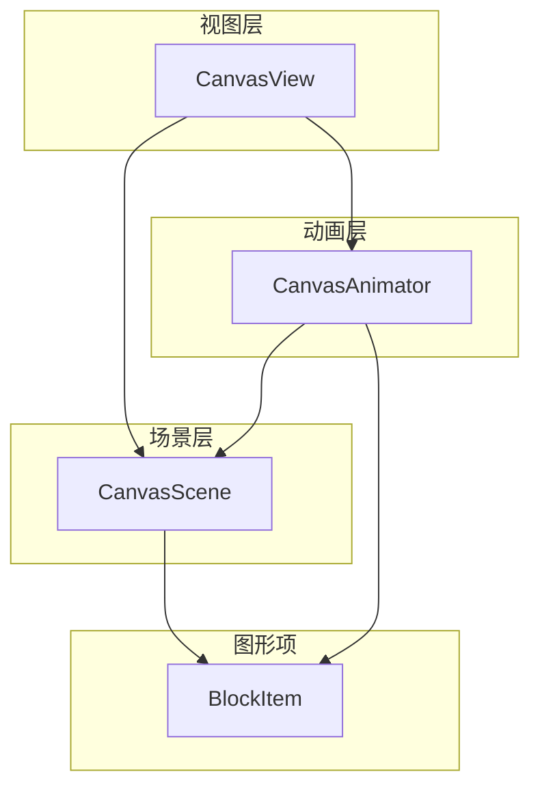
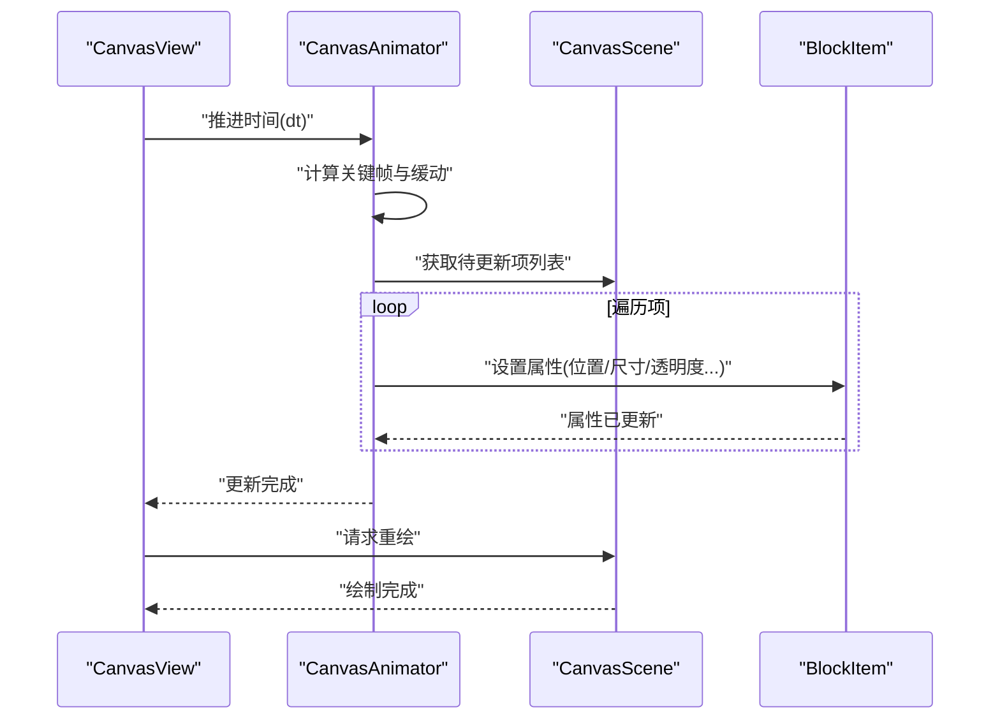
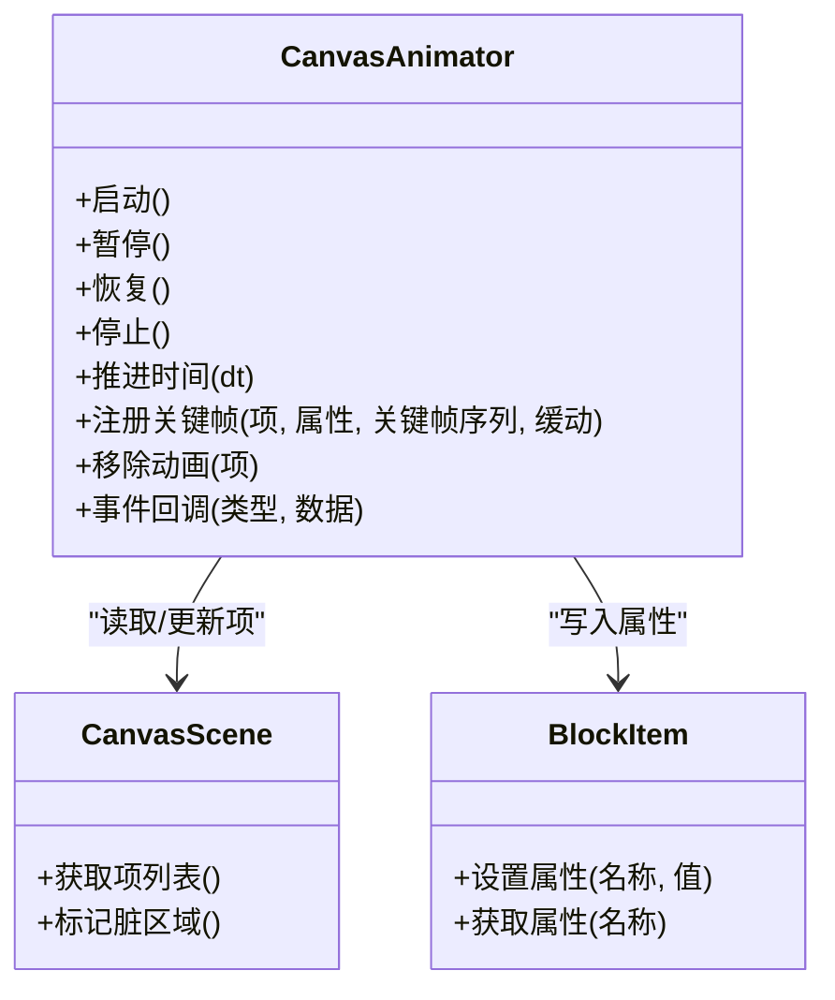
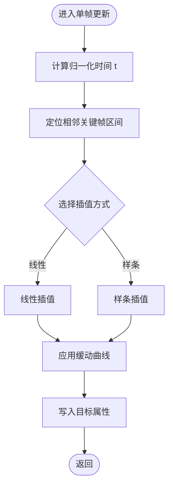
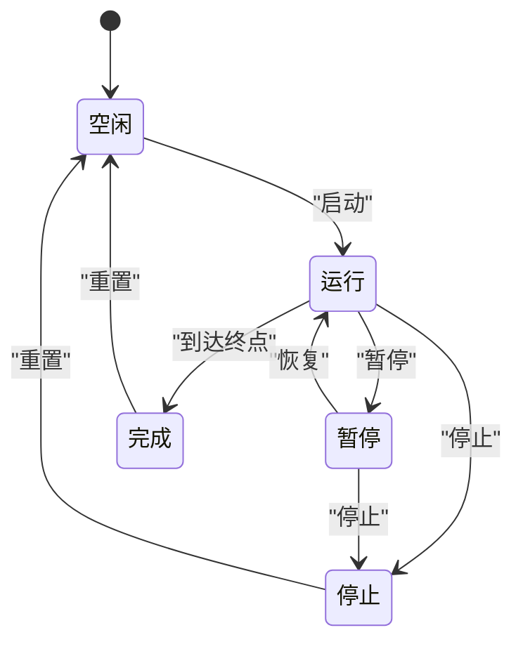
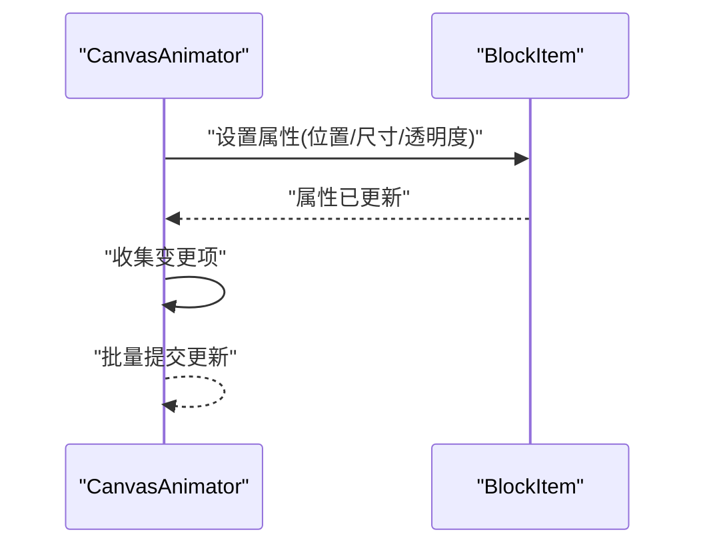
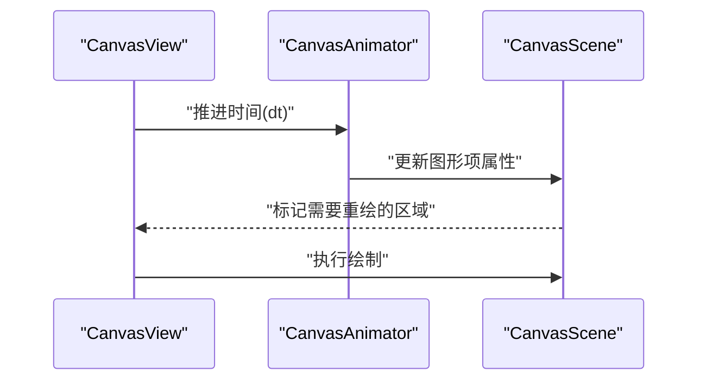

# 动画系统

<cite>
**本文引用的文件**   
- [CanvasAnimator.h](file://src/canvas/CanvasAnimator.h)
- [CanvasAnimator.cpp](file://src/canvas/CanvasAnimator.cpp)
- [CanvasScene.h](file://src/canvas/CanvasScene.h)
- [CanvasScene.cpp](file://src/canvas/CanvasScene.cpp)
- [CanvasView.h](file://src/canvas/CanvasView.h)
- [CanvasView.cpp](file://src/canvas/CanvasView.cpp)
- [BlockItem.h](file://src/canvas/BlockItem.h)
- [BlockItem.cpp](file://src/canvas/BlockItem.cpp)
</cite>

## 目录
1. [简介](#简介)
2. [项目结构](#项目结构)
3. [核心组件](#核心组件)
4. [架构总览](#架构总览)
5. [详细组件分析](#详细组件分析)
6. [依赖关系分析](#依赖关系分析)
7. [性能考量](#性能考量)
8. [故障排查指南](#故障排查指南)
9. [结论](#结论)
10. [附录](#附录)

## 简介
本文件为 CanvasAnimator 动画系统的技术文档，面向开发者与使用者，系统性阐述以下方面：
- 动画框架设计与职责划分
- 关键帧插值与缓动函数实现思路
- 动画状态管理与时间控制机制
- 与图形项（如 BlockItem）的集成方式
- 动画事件处理与回调机制
- 动画序列编排、混合效果与过渡动画
- 调试工具与性能分析方法

该文档以代码为依据，结合架构图与时序图帮助理解整体流程，并提供可操作的优化建议与排错指引。

## 项目结构
动画相关代码集中在 src/canvas 目录中，核心包括：
- CanvasAnimator：动画引擎，负责时间推进、关键帧计算、缓动与状态更新
- CanvasScene：场景层，持有图形项集合，提供渲染与交互上下文
- CanvasView：视图层，驱动刷新循环，协调动画与绘制
- BlockItem：图形项，暴露可动画属性接口，供动画系统写入

图表来源
- [CanvasView.h](file://src/canvas/CanvasView.h)
- [CanvasView.cpp](file://src/canvas/CanvasView.cpp)
- [CanvasScene.h](file://src/canvas/CanvasScene.h)
- [CanvasScene.cpp](file://src/canvas/CanvasScene.cpp)
- [CanvasAnimator.h](file://src/canvas/CanvasAnimator.h)
- [CanvasAnimator.cpp](file://src/canvas/CanvasAnimator.cpp)
- [BlockItem.h](file://src/canvas/BlockItem.h)
- [BlockItem.cpp](file://src/canvas/BlockItem.cpp)

章节来源
- [CanvasAnimator.h](file://src/canvas/CanvasAnimator.h)
- [CanvasAnimator.cpp](file://src/canvas/CanvasAnimator.cpp)
- [CanvasScene.h](file://src/canvas/CanvasScene.h)
- [CanvasScene.cpp](file://src/canvas/CanvasScene.cpp)
- [CanvasView.h](file://src/canvas/CanvasView.h)
- [CanvasView.cpp](file://src/canvas/CanvasView.cpp)
- [BlockItem.h](file://src/canvas/BlockItem.h)
- [BlockItem.cpp](file://src/canvas/BlockItem.cpp)

## 核心组件
- CanvasAnimator
  - 职责：管理动画生命周期、时间推进、关键帧插值、缓动函数应用、状态机切换、事件派发与回调
  - 关键能力：按帧或按时推进、批量更新图形项属性、支持多动画并行与优先级
- CanvasScene
  - 职责：维护图形项集合、提供查询与遍历、承载渲染上下文
  - 与动画协作：接收动画更新指令，触发重绘
- CanvasView
  - 职责：驱动主循环/刷新事件、协调动画步进与绘制
  - 与动画协作：定时调用动画器更新，必要时节流/限帧
- BlockItem
  - 职责：表示可动画的图形项，暴露属性读写接口（如位置、尺寸、透明度等）
  - 与动画协作：被动画器直接修改属性，内部触发必要的重绘或通知

章节来源
- [CanvasAnimator.h](file://src/canvas/CanvasAnimator.h)
- [CanvasAnimator.cpp](file://src/canvas/CanvasAnimator.cpp)
- [CanvasScene.h](file://src/canvas/CanvasScene.h)
- [CanvasScene.cpp](file://src/canvas/CanvasScene.cpp)
- [CanvasView.h](file://src/canvas/CanvasView.h)
- [CanvasView.cpp](file://src/canvas/CanvasView.cpp)
- [BlockItem.h](file://src/canvas/BlockItem.h)
- [BlockItem.cpp](file://src/canvas/BlockItem.cpp)

## 架构总览
动画系统采用“视图驱动 + 动画器集中管理”的分层架构：
- 视图层（CanvasView）负责刷新循环，周期性请求动画器推进时间
- 动画层（CanvasAnimator）根据当前时间与关键帧计算目标值，并应用到场景中的图形项
- 场景层（CanvasScene）组织图形项，并在属性变更后进行增量更新与渲染

图表来源
- [CanvasView.h](file://src/canvas/CanvasView.h)
- [CanvasView.cpp](file://src/canvas/CanvasView.cpp)
- [CanvasAnimator.h](file://src/canvas/CanvasAnimator.h)
- [CanvasAnimator.cpp](file://src/canvas/CanvasAnimator.cpp)
- [CanvasScene.h](file://src/canvas/CanvasScene.h)
- [CanvasScene.cpp](file://src/canvas/CanvasScene.cpp)
- [BlockItem.h](file://src/canvas/BlockItem.h)
- [BlockItem.cpp](file://src/canvas/BlockItem.cpp)

## 详细组件分析

### CanvasAnimator：动画引擎
- 设计要点
  - 时间推进：基于固定步长或累计时间，保证跨平台一致性
  - 关键帧插值：线性/样条插值，支持多段关键帧拼接
  - 缓动函数：内置常用曲线（如 ease-in/out），可扩展自定义曲线
  - 状态管理：运行/暂停/停止/完成等状态，支持优先级与队列
  - 事件与回调：开始、每帧、结束、错误等回调点
- 数据流
  - 输入：时间增量、关键帧定义、缓动配置、目标项集合
  - 处理：插值计算、属性映射、状态机转换
  - 输出：对图形项属性的批量写入、事件派发

图表来源
- [CanvasAnimator.h](file://src/canvas/CanvasAnimator.h)
- [CanvasAnimator.cpp](file://src/canvas/CanvasAnimator.cpp)
- [CanvasScene.h](file://src/canvas/CanvasScene.h)
- [CanvasScene.cpp](file://src/canvas/CanvasScene.cpp)
- [BlockItem.h](file://src/canvas/BlockItem.h)
- [BlockItem.cpp](file://src/canvas/BlockItem.cpp)

章节来源
- [CanvasAnimator.h](file://src/canvas/CanvasAnimator.h)
- [CanvasAnimator.cpp](file://src/canvas/CanvasAnimator.cpp)

### 关键帧插值与缓动函数
- 关键帧模型
  - 每个属性对应一个关键帧序列，包含时间点与目标值
  - 支持分段与重复模式，便于复杂时序编排
- 插值算法
  - 线性插值：适用于简单过渡
  - 样条插值：平滑过渡，减少突变
- 缓动函数
  - 将归一化时间 t∈[0,1] 映射为非线性曲线，增强表现力
  - 提供扩展点以接入自定义曲线

图表来源
- [CanvasAnimator.h](file://src/canvas/CanvasAnimator.h)
- [CanvasAnimator.cpp](file://src/canvas/CanvasAnimator.cpp)

章节来源
- [CanvasAnimator.h](file://src/canvas/CanvasAnimator.h)
- [CanvasAnimator.cpp](file://src/canvas/CanvasAnimator.cpp)

### 动画状态管理与时间控制
- 状态机
  - 状态包括：空闲、运行、暂停、停止、完成
  - 状态转换受外部命令与内部条件（如到达终点）驱动
- 时间控制
  - 支持固定步长与可变步长两种模式
  - 提供时间缩放（加速/减速）与对齐到帧边界的能力
- 并发与优先级
  - 多动画并行执行，通过优先级决定更新顺序
  - 冲突属性合并策略（后写覆盖或加权平均）

图表来源
- [CanvasAnimator.h](file://src/canvas/CanvasAnimator.h)
- [CanvasAnimator.cpp](file://src/canvas/CanvasAnimator.cpp)

章节来源
- [CanvasAnimator.h](file://src/canvas/CanvasAnimator.h)
- [CanvasAnimator.cpp](file://src/canvas/CanvasAnimator.cpp)

### 与图形项的集成（BlockItem）
- 集成方式
  - BlockItem 暴露统一的属性接口，动画器通过属性名写入数值
  - 图形项在属性变更后触发局部重绘或无效区域更新
- 性能优化
  - 批量写入属性，减少重绘次数
  - 按需更新：仅标记变更项，避免全量刷新

图表来源
- [CanvasAnimator.h](file://src/canvas/CanvasAnimator.h)
- [CanvasAnimator.cpp](file://src/canvas/CanvasAnimator.cpp)
- [BlockItem.h](file://src/canvas/BlockItem.h)
- [BlockItem.cpp](file://src/canvas/BlockItem.cpp)

章节来源
- [BlockItem.h](file://src/canvas/BlockItem.h)
- [BlockItem.cpp](file://src/canvas/BlockItem.cpp)
- [CanvasAnimator.h](file://src/canvas/CanvasAnimator.h)
- [CanvasAnimator.cpp](file://src/canvas/CanvasAnimator.cpp)

### 动画事件处理与回调机制
- 事件类型
  - 开始、每帧、结束、错误等
- 回调设计
  - 支持注册/注销回调，避免内存泄漏
  - 异步回调时注意线程安全与生命周期管理
- 使用建议
  - 在每帧回调中进行轻量操作，避免阻塞主循环
  - 在结束回调中清理资源或释放引用

章节来源
- [CanvasAnimator.h](file://src/canvas/CanvasAnimator.h)
- [CanvasAnimator.cpp](file://src/canvas/CanvasAnimator.cpp)

### 动画序列编排、混合效果与过渡动画
- 序列编排
  - 支持串联（顺序播放）、并联（同时播放）、条件分支
  - 提供延迟、循环、反向播放等常见模式
- 混合效果
  - 多属性混合：不同属性可使用不同缓动与时长
  - 多动画叠加：权重混合或最后写入优先
- 过渡动画
  - 场景切换时的淡入淡出、位移过渡
  - 基于关键帧的平滑过渡，避免硬切

章节来源
- [CanvasAnimator.h](file://src/canvas/CanvasAnimator.h)
- [CanvasAnimator.cpp](file://src/canvas/CanvasAnimator.cpp)

### 与视图和场景的协作
- CanvasView
  - 驱动刷新循环，定期调用动画器推进时间
  - 控制帧率上限与节流策略
- CanvasScene
  - 维护图形项集合，提供查询与遍历
  - 接收动画器的更新指令，触发增量渲染

图表来源
- [CanvasView.h](file://src/canvas/CanvasView.h)
- [CanvasView.cpp](file://src/canvas/CanvasView.cpp)
- [CanvasScene.h](file://src/canvas/CanvasScene.h)
- [CanvasScene.cpp](file://src/canvas/CanvasScene.cpp)
- [CanvasAnimator.h](file://src/canvas/CanvasAnimator.h)
- [CanvasAnimator.cpp](file://src/canvas/CanvasAnimator.cpp)

章节来源
- [CanvasView.h](file://src/canvas/CanvasView.h)
- [CanvasView.cpp](file://src/canvas/CanvasView.cpp)
- [CanvasScene.h](file://src/canvas/CanvasScene.h)
- [CanvasScene.cpp](file://src/canvas/CanvasScene.cpp)

## 依赖关系分析
- 耦合度
  - CanvasAnimator 与 CanvasScene、BlockItem 存在强依赖（读写属性）
  - CanvasView 与 CanvasAnimator 松耦合（仅调用推进接口）
- 外部依赖
  - 图形库（用于绘制与无效区域管理）
  - 数学库（向量、矩阵、插值与缓动计算）
- 潜在循环依赖
  - 确保动画器不反向依赖视图层，避免循环

图表来源
- [CanvasView.h](file://src/canvas/CanvasView.h)
- [CanvasView.cpp](file://src/canvas/CanvasView.cpp)
- [CanvasAnimator.h](file://src/canvas/CanvasAnimator.h)
- [CanvasAnimator.cpp](file://src/canvas/CanvasAnimator.cpp)
- [CanvasScene.h](file://src/canvas/CanvasScene.h)
- [CanvasScene.cpp](file://src/canvas/CanvasScene.cpp)
- [BlockItem.h](file://src/canvas/BlockItem.h)
- [BlockItem.cpp](file://src/canvas/BlockItem.cpp)

章节来源
- [CanvasAnimator.h](file://src/canvas/CanvasAnimator.h)
- [CanvasAnimator.cpp](file://src/canvas/CanvasAnimator.cpp)
- [CanvasScene.h](file://src/canvas/CanvasScene.h)
- [CanvasScene.cpp](file://src/canvas/CanvasScene.cpp)
- [CanvasView.h](file://src/canvas/CanvasView.h)
- [CanvasView.cpp](file://src/canvas/CanvasView.cpp)
- [BlockItem.h](file://src/canvas/BlockItem.h)
- [BlockItem.cpp](file://src/canvas/BlockItem.cpp)

## 性能考量
- 时间推进
  - 使用固定步长避免抖动；大 dt 时分段推进防止跳帧
- 插值与缓动
  - 预计算常用缓动表，减少运行时开销
  - 对高频属性（如位置）采用向量化计算
- 批量更新
  - 合并同一帧的属性写入，减少重绘次数
  - 使用脏矩形或增量更新，避免全量重绘
- 帧率控制
  - 限制最大帧率，降低 CPU/GPU 压力
  - 在后台线程计算动画，主线程仅做合成与绘制
- 内存与对象生命周期
  - 及时释放不再使用的动画实例
  - 避免在回调中创建临时对象

章节来源
- [CanvasAnimator.h](file://src/canvas/CanvasAnimator.h)
- [CanvasAnimator.cpp](file://src/canvas/CanvasAnimator.cpp)
- [CanvasView.h](file://src/canvas/CanvasView.h)
- [CanvasView.cpp](file://src/canvas/CanvasView.cpp)

## 故障排查指南
- 常见问题
  - 动画卡顿：检查时间推进步长与帧率限制
  - 属性未更新：确认属性名与类型匹配，检查批量提交逻辑
  - 回调未触发：验证事件注册与生命周期管理
  - 内存泄漏：确保取消注册回调与释放动画实例
- 调试手段
  - 打印关键帧与缓动参数，核对预期值
  - 记录每帧耗时，定位瓶颈
  - 可视化动画路径与属性变化曲线
- 日志与断点
  - 在推进时间、插值计算、属性写入处设置断点
  - 输出动画状态机转换日志

章节来源
- [CanvasAnimator.h](file://src/canvas/CanvasAnimator.h)
- [CanvasAnimator.cpp](file://src/canvas/CanvasAnimator.cpp)
- [CanvasView.h](file://src/canvas/CanvasView.h)
- [CanvasView.cpp](file://src/canvas/CanvasView.cpp)

## 结论
CanvasAnimator 动画系统通过分层架构与清晰的职责划分，实现了高效、可扩展的动画能力。关键帧插值与缓动函数提供了丰富的表现力，状态管理与时间控制保证了稳定性与可控性。与图形项的集成简洁且性能友好，适合在 CAD 类应用中实现流畅的用户交互与视觉反馈。建议在开发中遵循批量更新、帧率控制与资源管理等最佳实践，以获得更优的性能与体验。

## 附录
- 术语表
  - 关键帧：指定时间点与目标值的离散样本
  - 缓动函数：将线性时间映射为非线性曲线的函数
  - 脏区域：需要重新绘制的屏幕区域
- 参考实现路径
  - 动画器核心逻辑：[CanvasAnimator.cpp](file://src/canvas/CanvasAnimator.cpp)
  - 场景与项管理：[CanvasScene.cpp](file://src/canvas/CanvasScene.cpp)、[BlockItem.cpp](file://src/canvas/BlockItem.cpp)
  - 视图驱动与刷新：[CanvasView.cpp](file://src/canvas/CanvasView.cpp)