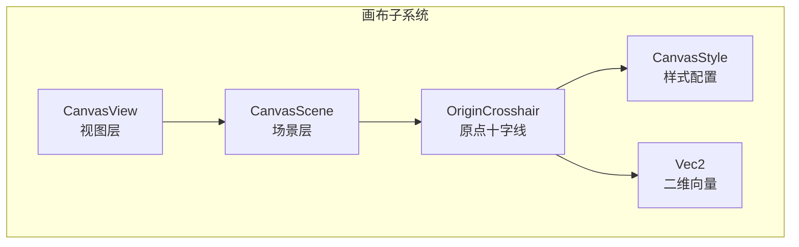
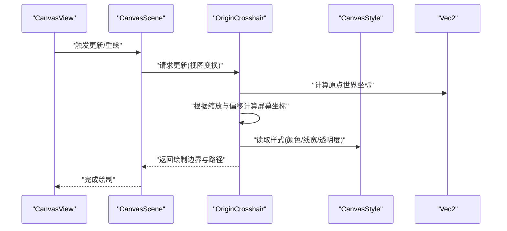
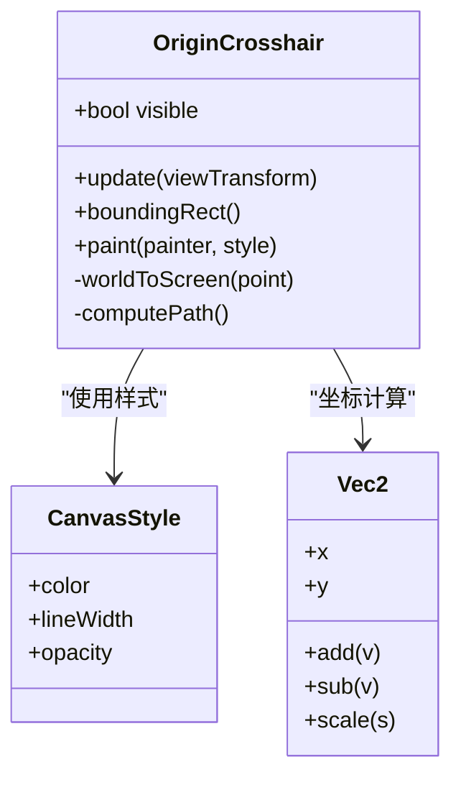
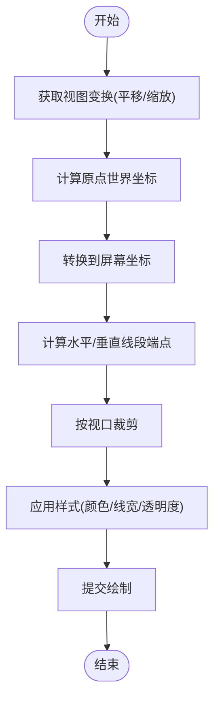
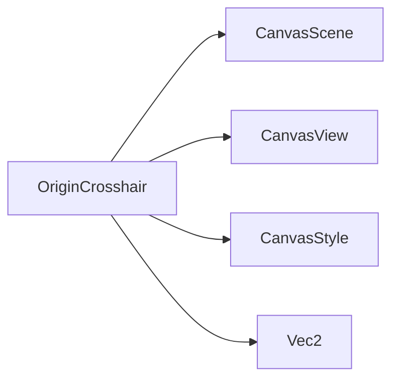

# 原点十字线

<cite>
**本文引用的文件**   
- [OriginCrosshair.h](file://src/canvas/OriginCrosshair.h)
- [OriginCrosshair.cpp](file://src/canvas/OriginCrosshair.cpp)
- [CanvasScene.h](file://src/canvas/CanvasScene.h)
- [CanvasScene.cpp](file://src/canvas/CanvasScene.cpp)
- [CanvasView.h](file://src/canvas/CanvasView.h)
- [CanvasView.cpp](file://src/canvas/CanvasView.cpp)
- [CanvasStyle.h](file://src/canvas/CanvasStyle.h)
- [CanvasStyle.cpp](file://src/canvas/CanvasStyle.cpp)
- [Vec2.h](file://src/geometry/Vec2.h)
</cite>

## 目录
1. [简介](#简介)
2. [项目结构](#项目结构)
3. [核心组件](#核心组件)
4. [架构总览](#架构总览)
5. [详细组件分析](#详细组件分析)
6. [依赖关系分析](#依赖关系分析)
7. [性能考虑](#性能考虑)
8. [故障排查指南](#故障排查指南)
9. [结论](#结论)
10. [附录](#附录)

## 简介
本文件为 OriginCrosshair（原点十字线）组件提供系统化、可操作的技术文档。内容覆盖：
- 十字线的绘制算法与定位逻辑
- 自适应显示策略（缩放适配、高精度显示）
- 与坐标系统的集成方式
- 可见性控制、样式定制与交互处理
- 与其他画布元素的冲突避免与渲染顺序
- 性能优化建议与常见问题排查

## 项目结构
OriginCrosshair 位于 canvas 模块，与 CanvasScene、CanvasView、CanvasStyle 等协同工作，负责在视口中以原点为中心绘制水平与垂直参考线，并随视图变换进行自适应更新。

图表来源
- [CanvasView.h](file://src/canvas/CanvasView.h)
- [CanvasScene.h](file://src/canvas/CanvasScene.h)
- [OriginCrosshair.h](file://src/canvas/OriginCrosshair.h)
- [CanvasStyle.h](file://src/canvas/CanvasStyle.h)
- [Vec2.h](file://src/geometry/Vec2.h)

章节来源
- [OriginCrosshair.h](file://src/canvas/OriginCrosshair.h)
- [OriginCrosshair.cpp](file://src/canvas/OriginCrosshair.cpp)
- [CanvasScene.h](file://src/canvas/CanvasScene.h)
- [CanvasView.h](file://src/canvas/CanvasView.h)
- [CanvasStyle.h](file://src/canvas/CanvasStyle.h)
- [Vec2.h](file://src/geometry/Vec2.h)

## 核心组件
- OriginCrosshair：负责原点十字线的创建、更新、绘制与可见性控制。
- CanvasScene：管理场景中的图形项，协调视图变换与重绘。
- CanvasView：处理用户输入与视图变换（平移、缩放），驱动场景更新。
- CanvasStyle：集中管理十字线颜色、线宽、透明度等样式属性。
- Vec2：提供二维向量运算，用于坐标转换与精度控制。

章节来源
- [OriginCrosshair.h](file://src/canvas/OriginCrosshair.h)
- [OriginCrosshair.cpp](file://src/canvas/OriginCrosshair.cpp)
- [CanvasScene.h](file://src/canvas/CanvasScene.h)
- [CanvasView.h](file://src/canvas/CanvasView.h)
- [CanvasStyle.h](file://src/canvas/CanvasStyle.h)
- [Vec2.h](file://src/geometry/Vec2.h)

## 架构总览
OriginCrosshair 作为场景中的一个“参考线”项，受 CanvasScene 管理，并在 CanvasView 的视图变换下自动更新位置与尺寸。其绘制过程遵循“先计算世界坐标，再转换为屏幕坐标”的流程，确保在不同缩放级别下的视觉一致性。

图表来源
- [CanvasView.cpp](file://src/canvas/CanvasView.cpp)
- [CanvasScene.cpp](file://src/canvas/CanvasScene.cpp)
- [OriginCrosshair.cpp](file://src/canvas/OriginCrosshair.cpp)
- [CanvasStyle.cpp](file://src/canvas/CanvasStyle.cpp)
- [Vec2.h](file://src/geometry/Vec2.h)

## 详细组件分析

### OriginCrosshair 类设计
OriginCrosshair 封装了十字线的状态与行为，包括：
- 可见性开关
- 样式引用或内联样式
- 绘制路径生成与边界计算
- 与视图变换的同步更新

图表来源
- [OriginCrosshair.h](file://src/canvas/OriginCrosshair.h)
- [CanvasStyle.h](file://src/canvas/CanvasStyle.h)
- [Vec2.h](file://src/geometry/Vec2.h)

章节来源
- [OriginCrosshair.h](file://src/canvas/OriginCrosshair.h)
- [OriginCrosshair.cpp](file://src/canvas/OriginCrosshair.cpp)
- [CanvasStyle.h](file://src/canvas/CanvasStyle.h)
- [Vec2.h](file://src/geometry/Vec2.h)

### 绘制算法与定位逻辑
- 世界坐标到屏幕坐标的转换：基于当前视图的平移与缩放矩阵，将原点 (0,0) 映射至屏幕空间。
- 十字线路径：由两条无限延伸线段组成，实际绘制时裁剪至视口边界，保证性能与正确性。
- 边界计算：根据屏幕坐标与线宽计算包围盒，便于碰撞检测与渲染剔除。

图表来源
- [OriginCrosshair.cpp](file://src/canvas/OriginCrosshair.cpp)
- [CanvasView.cpp](file://src/canvas/CanvasView.cpp)
- [CanvasScene.cpp](file://src/canvas/CanvasScene.cpp)

章节来源
- [OriginCrosshair.cpp](file://src/canvas/OriginCrosshair.cpp)
- [CanvasView.cpp](file://src/canvas/CanvasView.cpp)
- [CanvasScene.cpp](file://src/canvas/CanvasScene.cpp)

### 与坐标系统的集成与缩放适配
- 坐标系统：统一使用世界坐标系，原点固定于 (0,0)，通过视图变换实现平移与缩放。
- 缩放适配：屏幕坐标 = 世界坐标 × 缩放 + 平移；绘制时使用浮点精度，避免累积误差。
- 高精度显示：在极小或极大缩放级别下，保持线条宽度与对齐精度，必要时启用抗锯齿。

章节来源
- [OriginCrosshair.cpp](file://src/canvas/OriginCrosshair.cpp)
- [CanvasView.cpp](file://src/canvas/CanvasView.cpp)
- [Vec2.h](file://src/geometry/Vec2.h)

### 可见性控制与样式定制
- 可见性：通过布尔标志控制是否参与绘制与更新，支持运行时切换。
- 样式：颜色、线宽、透明度由 CanvasStyle 统一管理，支持动态修改与主题切换。
- 层级：十字线通常置于背景层，避免遮挡前景元素。

章节来源
- [OriginCrosshair.h](file://src/canvas/OriginCrosshair.h)
- [CanvasStyle.h](file://src/canvas/CanvasStyle.h)
- [CanvasStyle.cpp](file://src/canvas/CanvasStyle.cpp)

### 与其他画布元素的交互与冲突避免
- 渲染顺序：十字线优先绘制，后续元素在其之上渲染，避免被误遮挡。
- 碰撞检测：十字线不参与选择与拖拽，仅作为参考线存在。
- 事件穿透：鼠标事件直接穿透十字线，交由底层元素处理。

章节来源
- [CanvasScene.cpp](file://src/canvas/CanvasScene.cpp)
- [CanvasView.cpp](file://src/canvas/CanvasView.cpp)

## 依赖关系分析
OriginCrosshair 依赖 CanvasScene 的管理与 CanvasView 的视图变换，同时使用 CanvasStyle 提供的样式与 Vec2 的数学运算。

图表来源
- [OriginCrosshair.h](file://src/canvas/OriginCrosshair.h)
- [CanvasScene.h](file://src/canvas/CanvasScene.h)
- [CanvasView.h](file://src/canvas/CanvasView.h)
- [CanvasStyle.h](file://src/canvas/CanvasStyle.h)
- [Vec2.h](file://src/geometry/Vec2.h)

章节来源
- [OriginCrosshair.h](file://src/canvas/OriginCrosshair.h)
- [CanvasScene.h](file://src/canvas/CanvasScene.h)
- [CanvasView.h](file://src/canvas/CanvasView.h)
- [CanvasStyle.h](file://src/canvas/CanvasStyle.h)
- [Vec2.h](file://src/geometry/Vec2.h)

## 性能考虑
- 增量更新：仅在视图变换或样式变化时重新计算路径与边界。
- 裁剪优化：将线段裁剪至视口范围，减少多余绘制。
- 内存与对象复用：避免频繁分配临时对象，重用路径与缓冲区。
- 绘制批次：与背景层合并绘制，降低状态切换开销。

[本节为通用指导，不直接分析具体文件]

## 故障排查指南
- 十字线不显示
  - 检查可见性标志是否为真
  - 确认样式颜色与透明度有效
  - 验证视图变换未将原点移出视口
- 十字线错位或抖动
  - 核对世界坐标到屏幕坐标的转换公式
  - 检查缩放与平移的数值范围与精度
- 性能下降
  - 确认是否启用了不必要的重绘
  - 检查是否存在频繁的样式或可见性切换

章节来源
- [OriginCrosshair.cpp](file://src/canvas/OriginCrosshair.cpp)
- [CanvasView.cpp](file://src/canvas/CanvasView.cpp)
- [CanvasStyle.cpp](file://src/canvas/CanvasStyle.cpp)

## 结论
OriginCrosshair 通过清晰的坐标转换与高效的绘制流程，实现了稳定、精确且高性能的原点十字线显示。其与 CanvasScene、CanvasView、CanvasStyle 的协作确保了良好的可扩展性与可维护性。在实际使用中，应关注可见性控制、样式管理与性能优化，以获得最佳的用户体验。

[本节为总结性内容，不直接分析具体文件]

## 附录
- 术语说明
  - 世界坐标：模型空间的统一坐标系，原点固定
  - 屏幕坐标：设备像素坐标，受视图变换影响
  - 视图变换：包含平移与缩放的仿射变换
- 相关接口路径
  - 十字线更新接口：参见 [OriginCrosshair.cpp](file://src/canvas/OriginCrosshair.cpp)
  - 视图变换接口：参见 [CanvasView.cpp](file://src/canvas/CanvasView.cpp)
  - 样式访问接口：参见 [CanvasStyle.cpp](file://src/canvas/CanvasStyle.cpp)

[本节为补充信息，不直接分析具体文件]