# 图形项系统

<cite>
**本文档引用的文件**   
- [BlockItem.h](file://src/canvas/BlockItem.h)
- [BlockItem.cpp](file://src/canvas/BlockItem.cpp)
- [CanvasScene.h](file://src/canvas/CanvasScene.h)
- [CanvasScene.cpp](file://src/canvas/CanvasScene.cpp)
- [CanvasView.h](file://src/canvas/CanvasView.h)
- [CanvasView.cpp](file://src/canvas/CanvasView.cpp)
- [CanvasStyle.h](file://src/canvas/CanvasStyle.h)
- [CanvasStyle.cpp](file://src/canvas/CanvasStyle.cpp)
- [CanvasAnimator.h](file://src/canvas/CanvasAnimator.h)
- [CanvasAnimator.cpp](file://src/canvas/CanvasAnimator.cpp)
- [ToolSelect.h](file://src/tools/ToolSelect.h)
- [ToolSelect.cpp](file://src/tools/ToolSelect.cpp)
- [SnapEngine.h](file://src/tools/SnapEngine.h)
- [SnapEngine.cpp](file://src/tools/SnapEngine.cpp)
- [Vec2.h](file://src/geometry/Vec2.h)
- [Units.h](file://src/geometry/Units.h)
</cite>

## 目录
1. [简介](#简介)
2. [项目结构](#项目结构)
3. [核心组件](#核心组件)
4. [架构总览](#架构总览)
5. [详细组件分析](#详细组件分析)
6. [依赖关系分析](#依赖关系分析)
7. [性能考量](#性能考量)
8. [故障排查指南](#故障排查指南)
9. [结论](#结论)
10. [附录](#附录)

## 简介
本文件为 BlockItem 图形项系统的权威文档，面向二次开发与集成使用者。内容覆盖：
- 图形项基类设计与继承体系（绘制、边界计算、变换处理）
- 属性系统与样式设置
- 动画支持
- 序列化、克隆与组合模式
- 碰撞检测、选择高亮与编辑手柄
- 自定义图形项开发指南与最佳实践

目标是帮助读者快速理解并扩展 BlockItem 体系，构建高性能、可维护的图形编辑能力。

## 项目结构
本项目采用分层组织方式，图形项系统位于 canvas 层，工具层提供交互与吸附，几何层提供基础向量与单位转换。

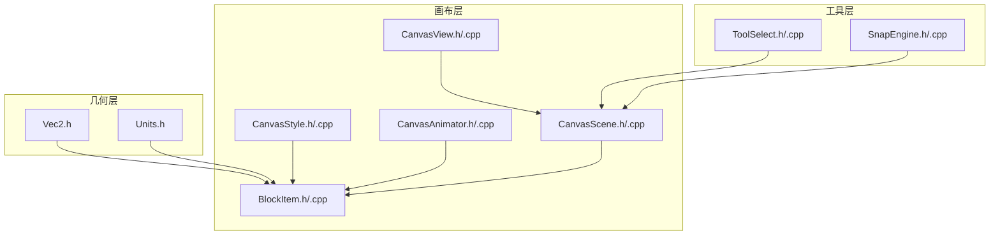

图表来源
- [BlockItem.h](file://src/canvas/BlockItem.h)
- [CanvasScene.h](file://src/canvas/CanvasScene.h)
- [CanvasView.h](file://src/canvas/CanvasView.h)
- [CanvasStyle.h](file://src/canvas/CanvasStyle.h)
- [CanvasAnimator.h](file://src/canvas/CanvasAnimator.h)
- [ToolSelect.h](file://src/tools/ToolSelect.h)
- [SnapEngine.h](file://src/tools/SnapEngine.h)
- [Vec2.h](file://src/geometry/Vec2.h)
- [Units.h](file://src/geometry/Units.h)

章节来源
- [BlockItem.h](file://src/canvas/BlockItem.h)
- [CanvasScene.h](file://src/canvas/CanvasScene.h)
- [CanvasView.h](file://src/canvas/CanvasView.h)
- [CanvasStyle.h](file://src/canvas/CanvasStyle.h)
- [CanvasAnimator.h](file://src/canvas/CanvasAnimator.h)
- [ToolSelect.h](file://src/tools/ToolSelect.h)
- [SnapEngine.h](file://src/tools/SnapEngine.h)
- [Vec2.h](file://src/geometry/Vec2.h)
- [Units.h](file://src/geometry/Units.h)

## 核心组件
- BlockItem：图形项抽象与实现，负责绘制、边界、变换、选中态、编辑手柄等
- CanvasScene：场景管理，持有图形项集合、事件分发、选择与拖拽逻辑
- CanvasView：视图层，负责渲染上下文、坐标变换、缩放平移
- CanvasStyle：样式系统，统一颜色、线宽、填充、阴影等
- CanvasAnimator：动画引擎，驱动属性变化与帧更新
- ToolSelect：选择工具，处理点击命中、多选、框选
- SnapEngine：吸附引擎，辅助对齐与网格吸附
- Vec2/Units：二维向量与单位换算

章节来源
- [BlockItem.h](file://src/canvas/BlockItem.h)
- [CanvasScene.h](file://src/canvas/CanvasScene.h)
- [CanvasView.h](file://src/canvas/CanvasView.h)
- [CanvasStyle.h](file://src/canvas/CanvasStyle.h)
- [CanvasAnimator.h](file://src/canvas/CanvasAnimator.h)
- [ToolSelect.h](file://src/tools/ToolSelect.h)
- [SnapEngine.h](file://src/tools/SnapEngine.h)
- [Vec2.h](file://src/geometry/Vec2.h)
- [Units.h](file://src/geometry/Units.h)

## 架构总览
下图展示图形项在场景中的交互流程：视图接收用户输入，转交场景进行命中测试与状态更新，场景调用图形项的绘制与边界方法完成渲染与交互。

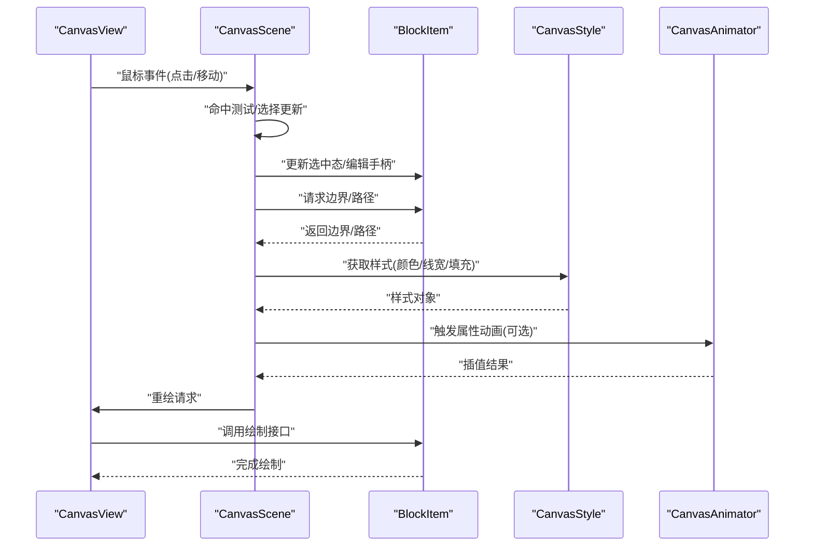

图表来源
- [CanvasView.h](file://src/canvas/CanvasView.h)
- [CanvasScene.h](file://src/canvas/CanvasScene.h)
- [BlockItem.h](file://src/canvas/BlockItem.h)
- [CanvasStyle.h](file://src/canvas/CanvasStyle.h)
- [CanvasAnimator.h](file://src/canvas/CanvasAnimator.h)

## 详细组件分析

### BlockItem 图形项基类与继承体系
- 职责
  - 绘制：提供统一的绘制入口，子类实现具体形状绘制
  - 边界：计算包围盒，用于命中测试与布局
  - 变换：位置、旋转、缩放、锚点
  - 选中态与编辑手柄：选中边框、角点/边中点手柄
  - 序列化/克隆：导出/导入数据，深拷贝
  - 组合：父子节点、层级与可见性
- 关键设计
  - 虚函数接口分离绘制、边界、命中、序列化
  - 属性系统通过键值对或枚举暴露可配置项
  - 样式解耦，由 CanvasStyle 统一管理
  - 动画通过 CanvasAnimator 驱动属性变化

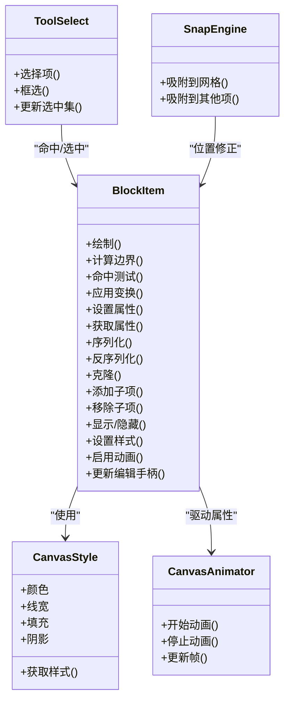

图表来源
- [BlockItem.h](file://src/canvas/BlockItem.h)
- [CanvasStyle.h](file://src/canvas/CanvasStyle.h)
- [CanvasAnimator.h](file://src/canvas/CanvasAnimator.h)
- [ToolSelect.h](file://src/tools/ToolSelect.h)
- [SnapEngine.h](file://src/tools/SnapEngine.h)

章节来源
- [BlockItem.h](file://src/canvas/BlockItem.h)
- [BlockItem.cpp](file://src/canvas/BlockItem.cpp)
- [CanvasStyle.h](file://src/canvas/CanvasStyle.h)
- [CanvasAnimator.h](file://src/canvas/CanvasAnimator.h)
- [ToolSelect.h](file://src/tools/ToolSelect.h)
- [SnapEngine.h](file://src/tools/SnapEngine.h)

### 绘制方法与边界计算
- 绘制流程
  - 视图调用 BlockItem::绘制，内部根据当前样式与变换矩阵生成路径或图元
  - 支持路径、多边形、曲线、位图等
- 边界计算
  - 基于路径或几何图元计算 AABB/OBB
  - 考虑描边宽度与阴影扩展
- 命中测试
  - 将屏幕坐标转换为图形局部坐标后判断是否在路径内
  - 优化：先做粗包围盒判断，再做精细命中

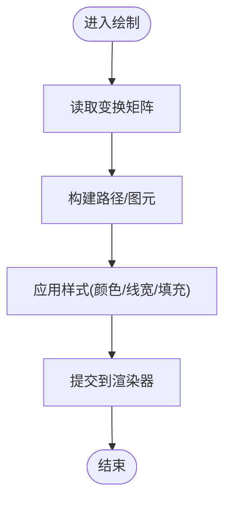

图表来源
- [BlockItem.h](file://src/canvas/BlockItem.h)
- [CanvasStyle.h](file://src/canvas/CanvasStyle.h)

章节来源
- [BlockItem.h](file://src/canvas/BlockItem.h)
- [BlockItem.cpp](file://src/canvas/BlockItem.cpp)
- [CanvasStyle.h](file://src/canvas/CanvasStyle.h)

### 变换处理与坐标系
- 支持的变换：平移、旋转、缩放、锚点偏移
- 坐标空间：世界坐标、视图坐标、图形局部坐标
- 变换顺序：通常按“缩放→旋转→平移”组合，避免非均匀缩放导致的旋转异常

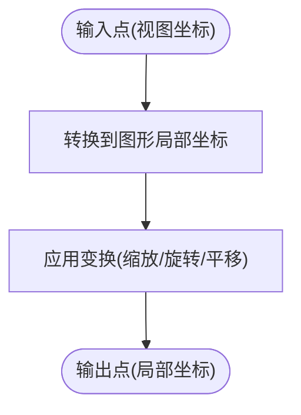

图表来源
- [BlockItem.h](file://src/canvas/BlockItem.h)
- [CanvasView.h](file://src/canvas/CanvasView.h)

章节来源
- [BlockItem.h](file://src/canvas/BlockItem.h)
- [CanvasView.h](file://src/canvas/CanvasView.h)

### 属性系统与样式设置
- 属性系统
  - 以键值形式存储可配置项（如尺寸、角度、圆角、透明度）
  - 支持默认值、范围校验、变更通知
- 样式设置
  - 颜色、线宽、填充、阴影、渐变等
  - 支持主题切换与动态更新

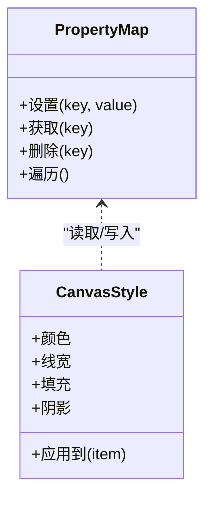

图表来源
- [CanvasStyle.h](file://src/canvas/CanvasStyle.h)
- [BlockItem.h](file://src/canvas/BlockItem.h)

章节来源
- [CanvasStyle.h](file://src/canvas/CanvasStyle.h)
- [CanvasStyle.cpp](file://src/canvas/CanvasStyle.cpp)
- [BlockItem.h](file://src/canvas/BlockItem.h)

### 动画支持
- 驱动方式：基于时间步长的属性插值（线性、缓动）
- 支持属性：位置、旋转、缩放、透明度、样式参数
- 生命周期：开始、暂停、恢复、停止、回调

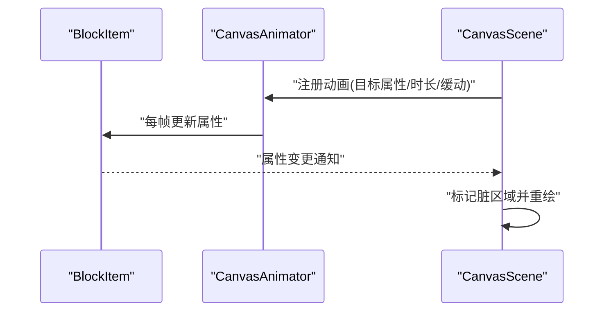

图表来源
- [CanvasAnimator.h](file://src/canvas/CanvasAnimator.h)
- [BlockItem.h](file://src/canvas/BlockItem.h)
- [CanvasScene.h](file://src/canvas/CanvasScene.h)

章节来源
- [CanvasAnimator.h](file://src/canvas/CanvasAnimator.h)
- [CanvasAnimator.cpp](file://src/canvas/CanvasAnimator.cpp)
- [BlockItem.h](file://src/canvas/BlockItem.h)

### 序列化、克隆与组合模式
- 序列化
  - 导出为结构化数据（JSON/XML），包含类型、属性、样式、子项
  - 反序列化为运行时对象，重建层级关系
- 克隆
  - 深拷贝，独立于原对象，保持样式与属性一致
- 组合模式
  - 父项持有子项集合，支持层级变换与可见性传播
  - 批量操作（移动、旋转、缩放）作用于父项时自动传递

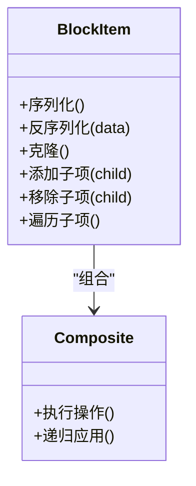

图表来源
- [BlockItem.h](file://src/canvas/BlockItem.h)

章节来源
- [BlockItem.h](file://src/canvas/BlockItem.h)
- [BlockItem.cpp](file://src/canvas/BlockItem.cpp)

### 碰撞检测、选择高亮与编辑手柄
- 碰撞检测
  - 基于边界与路径的命中测试，支持多选与框选
- 选择高亮
  - 选中边框、虚线、发光效果
- 编辑手柄
  - 角点、边中点、旋转手柄
  - 拖拽更新属性（尺寸、角度、位置）

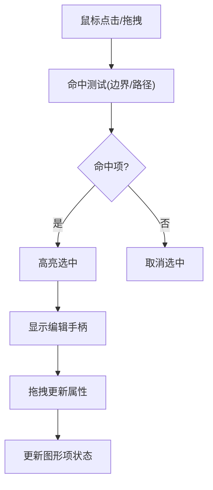

图表来源
- [ToolSelect.h](file://src/tools/ToolSelect.h)
- [BlockItem.h](file://src/canvas/BlockItem.h)

章节来源
- [ToolSelect.h](file://src/tools/ToolSelect.h)
- [ToolSelect.cpp](file://src/tools/ToolSelect.cpp)
- [BlockItem.h](file://src/canvas/BlockItem.h)

### 吸附与对齐
- 网格吸附：按固定间距对齐
- 对象吸附：与其他图形项边缘/中心对齐
- 智能吸附：结合距离阈值与优先级

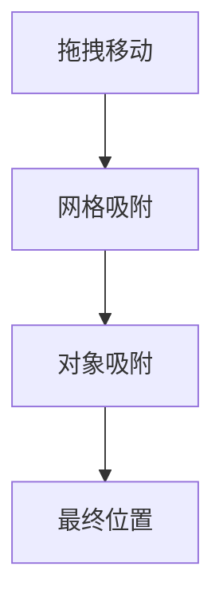

图表来源
- [SnapEngine.h](file://src/tools/SnapEngine.h)
- [BlockItem.h](file://src/canvas/BlockItem.h)

章节来源
- [SnapEngine.h](file://src/tools/SnapEngine.h)
- [SnapEngine.cpp](file://src/tools/SnapEngine.cpp)
- [BlockItem.h](file://src/canvas/BlockItem.h)

### 自定义图形项开发指南与最佳实践
- 步骤
  - 继承 BlockItem，重写绘制、边界、命中方法
  - 定义属性键与默认值，接入属性系统
  - 实现序列化/反序列化，保证数据一致性
  - 如需交互，提供编辑手柄与拖拽逻辑
- 最佳实践
  - 边界计算尽量精确且高效，必要时缓存
  - 命中测试分两步：粗包围盒+精细路径
  - 样式与逻辑解耦，便于主题化
  - 动画只驱动属性，不直接修改几何
  - 合理使用组合模式，减少重复代码

章节来源
- [BlockItem.h](file://src/canvas/BlockItem.h)
- [CanvasStyle.h](file://src/canvas/CanvasStyle.h)
- [CanvasAnimator.h](file://src/canvas/CanvasAnimator.h)
- [ToolSelect.h](file://src/tools/ToolSelect.h)
- [SnapEngine.h](file://src/tools/SnapEngine.h)

## 依赖关系分析
- 模块耦合
  - BlockItem 依赖 CanvasStyle、CanvasAnimator
  - CanvasScene 聚合多个 BlockItem，协调事件与渲染
  - ToolSelect 与 SnapEngine 与 BlockItem 交互但不侵入其内部实现
- 外部依赖
  - 几何库 Vec2/Units 提供基础数学与单位换算

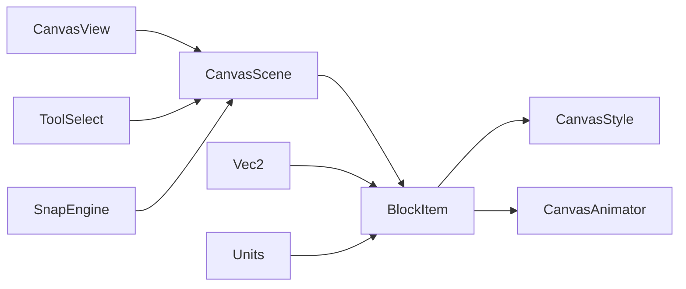

图表来源
- [BlockItem.h](file://src/canvas/BlockItem.h)
- [CanvasScene.h](file://src/canvas/CanvasScene.h)
- [CanvasView.h](file://src/canvas/CanvasView.h)
- [CanvasStyle.h](file://src/canvas/CanvasStyle.h)
- [CanvasAnimator.h](file://src/canvas/CanvasAnimator.h)
- [ToolSelect.h](file://src/tools/ToolSelect.h)
- [SnapEngine.h](file://src/tools/SnapEngine.h)
- [Vec2.h](file://src/geometry/Vec2.h)
- [Units.h](file://src/geometry/Units.h)

章节来源
- [BlockItem.h](file://src/canvas/BlockItem.h)
- [CanvasScene.h](file://src/canvas/CanvasScene.h)
- [CanvasView.h](file://src/canvas/CanvasView.h)
- [CanvasStyle.h](file://src/canvas/CanvasStyle.h)
- [CanvasAnimator.h](file://src/canvas/CanvasAnimator.h)
- [ToolSelect.h](file://src/tools/ToolSelect.h)
- [SnapEngine.h](file://src/tools/SnapEngine.h)
- [Vec2.h](file://src/geometry/Vec2.h)
- [Units.h](file://src/geometry/Units.h)

## 性能考量
- 渲染优化
  - 使用路径缓存与增量重绘
  - 合理设置视口裁剪区域
- 命中测试优化
  - 先做 AABB 快速剔除，再路径命中
  - 对复杂图形使用简化轮廓
- 动画性能
  - 合并属性更新，减少抖动
  - 使用固定时间步长与插值平滑
- 内存管理
  - 避免频繁分配/释放临时对象
  - 重用样式与路径资源

[本节为通用指导，无需特定文件引用]

## 故障排查指南
- 常见问题
  - 命中不准：检查坐标转换与边界计算
  - 样式不生效：确认样式是否应用到绘制阶段
  - 动画卡顿：检查插值频率与渲染开销
  - 序列化失败：核对属性键名与数据类型
- 调试建议
  - 打印边界与命中区域
  - 开启吸附可视化
  - 记录属性变更日志

章节来源
- [BlockItem.h](file://src/canvas/BlockItem.h)
- [CanvasStyle.h](file://src/canvas/CanvasStyle.h)
- [CanvasAnimator.h](file://src/canvas/CanvasAnimator.h)
- [ToolSelect.h](file://src/tools/ToolSelect.h)
- [SnapEngine.h](file://src/tools/SnapEngine.h)

## 结论
BlockItem 图形项系统通过清晰的职责划分与模块化设计，实现了可扩展的绘制、交互与动画能力。遵循本文档的设计与实践建议，开发者可以快速构建稳定高效的图形编辑功能。

[本节为总结，无需特定文件引用]

## 附录
- 术语
  - 图形项：可绘制、可交互的几何实体
  - 场景：管理所有图形项与事件的分发器
  - 视图：负责渲染与用户输入的界面层
  - 样式：外观相关配置的集合
  - 动画：驱动属性随时间变化的机制
- 参考
  - 几何库：Vec2、Units
  - 工具：ToolSelect、SnapEngine

[本节为补充信息，无需特定文件引用]