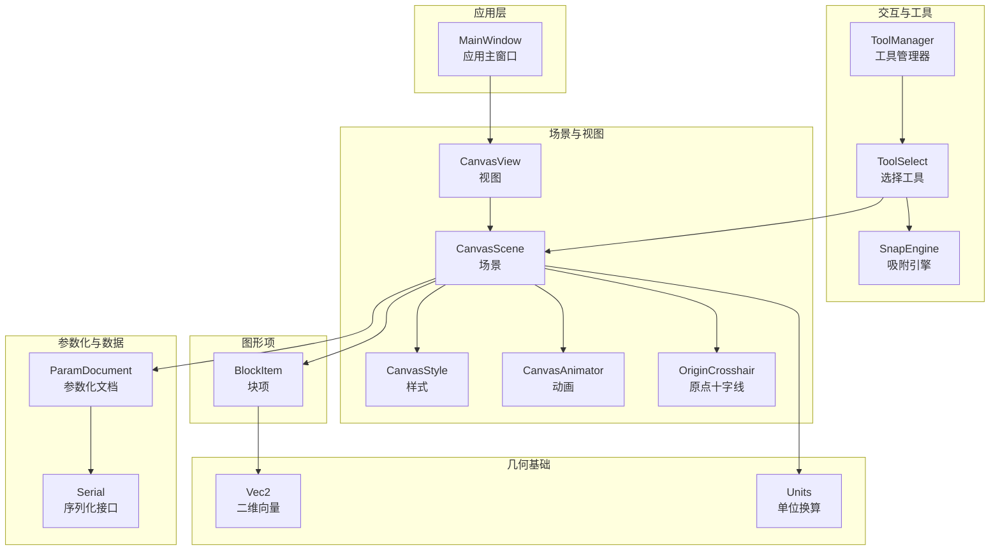
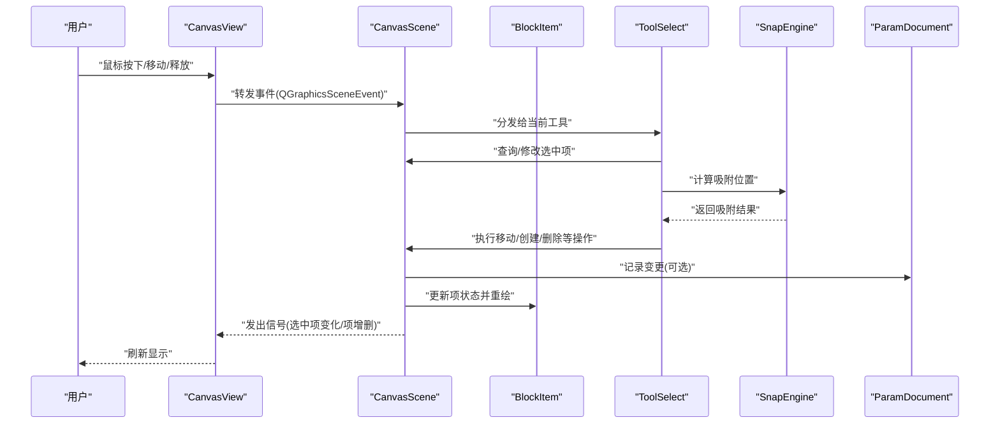
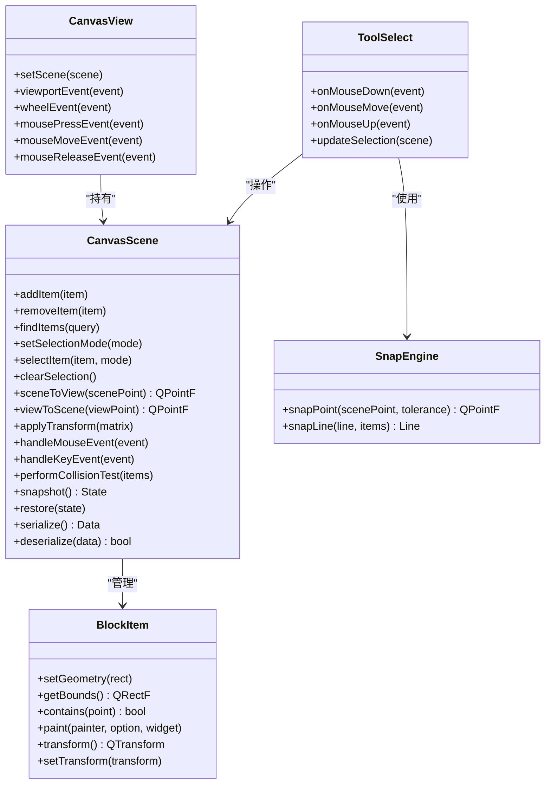
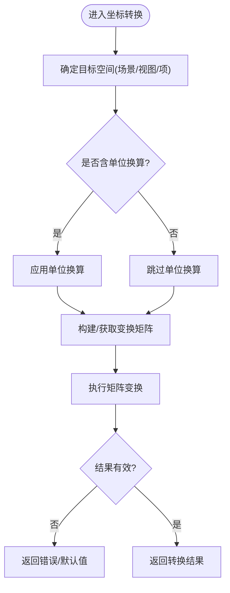
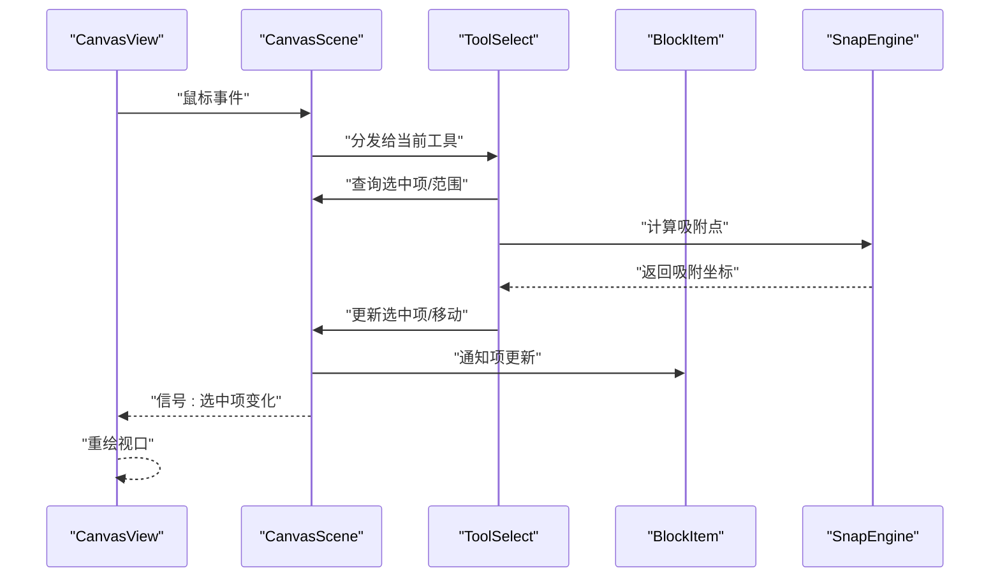
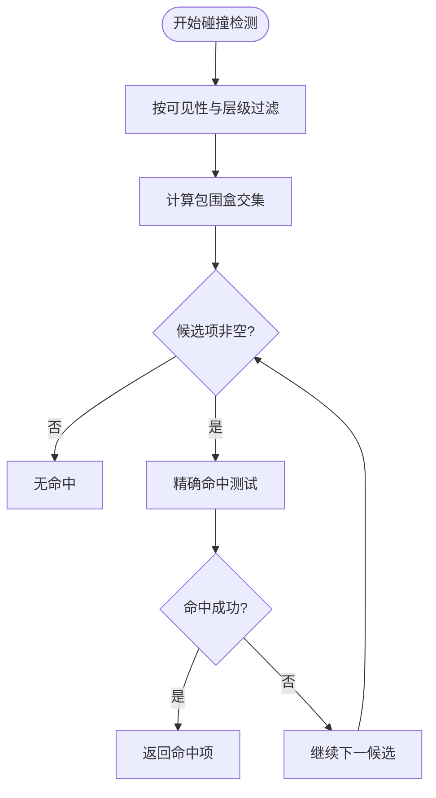
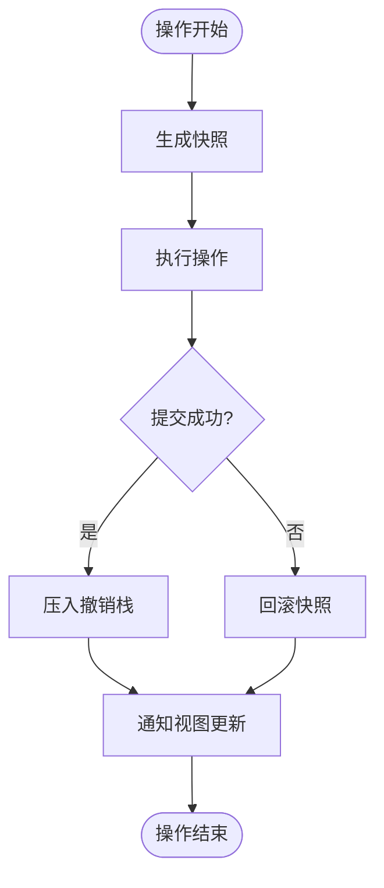
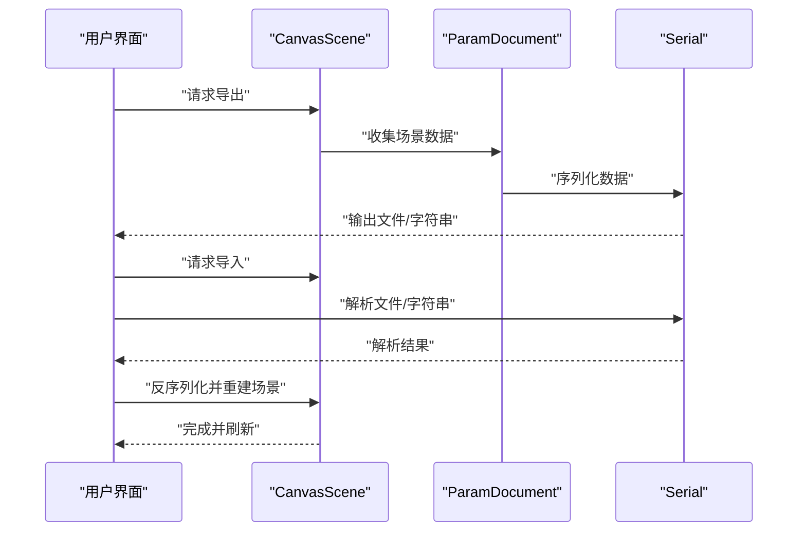
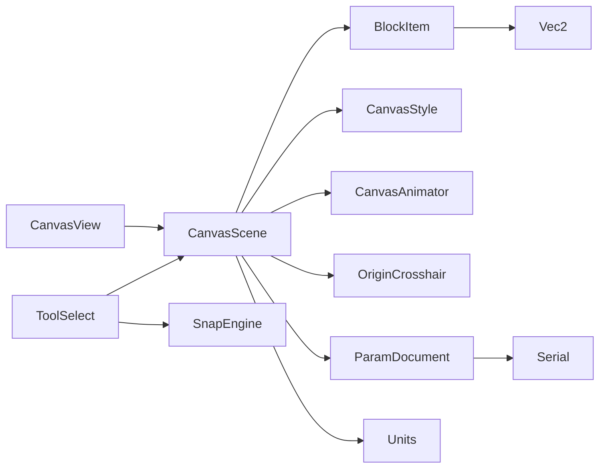

# 场景管理系统

<cite>
**本文档引用的文件**   
- [CanvasScene.h](file://src/canvas/CanvasScene.h)
- [CanvasScene.cpp](file://src/canvas/CanvasScene.cpp)
- [CanvasView.h](file://src/canvas/CanvasView.h)
- [CanvasView.cpp](file://src/canvas/CanvasView.cpp)
- [BlockItem.h](file://src/canvas/BlockItem.h)
- [BlockItem.cpp](file://src/canvas/BlockItem.cpp)
- [CanvasStyle.h](file://src/canvas/CanvasStyle.h)
- [CanvasStyle.cpp](file://src/canvas/CanvasStyle.cpp)
- [CanvasAnimator.h](file://src/canvas/CanvasAnimator.h)
- [CanvasAnimator.cpp](file://src/canvas/CanvasAnimator.cpp)
- [OriginCrosshair.h](file://src/canvas/OriginCrosshair.h)
- [OriginCrosshair.cpp](file://src/canvas/OriginCrosshair.cpp)
- [ToolSelect.h](file://src/tools/ToolSelect.h)
- [ToolSelect.cpp](file://src/tools/ToolSelect.cpp)
- [ToolManager.h](file://src/tools/ToolManager.h)
- [ToolManager.cpp](file://src/tools/ToolManager.cpp)
- [SnapEngine.h](file://src/tools/SnapEngine.h)
- [SnapEngine.cpp](file://src/tools/SnapEngine.cpp)
- [ParamDocument.h](file://src/parametric/ParamDocument.h)
- [ParamDocument.cpp](file://src/parametric/ParamDocument.cpp)
- [Serial.h](file://src/parametric/Serial.h)
- [Serial.cpp](file://src/parametric/Serial.cpp)
- [Vec2.h](file://src/geometry/Vec2.h)
- [Units.h](file://src/geometry/Units.h)
</cite>

## 目录
1. [简介](#简介)
2. [项目结构](#项目结构)
3. [核心组件](#核心组件)
4. [架构总览](#架构总览)
5. [详细组件分析](#详细组件分析)
6. [依赖关系分析](#依赖关系分析)
7. [性能考量](#性能考量)
8. [故障排查指南](#故障排查指南)
9. [结论](#结论)
10. [附录](#附录)

## 简介
本文件系统性地梳理并文档化基于 Qt Graphics View Framework 的 CanvasScene 场景管理系统。内容涵盖图形项的添加、删除与生命周期管理；坐标系统转换、变换矩阵操作与渲染优化；事件分发机制、选择系统与碰撞检测实现；场景状态管理、撤销重做支持与性能监控；以及场景序列化与反序列化的方法与实践建议。文档面向不同技术背景的读者，提供从概览到代码级细节的分层说明，并辅以可视化图示帮助理解。

## 项目结构
本项目采用按功能域划分的模块化组织方式：
- src/canvas：场景视图、场景、图形项、样式与动画等核心渲染相关模块
- src/tools：工具链（选择、智能笔、吸附引擎）与工具管理器
- src/parametric：参数化文档、表达式、解析器与序列化
- src/geometry：几何基础类型（向量、单位）
- src/app：应用入口与主窗口
- resources：资源文件（图标等）

图表来源
- [CanvasScene.h](file://src/canvas/CanvasScene.h)
- [CanvasView.h](file://src/canvas/CanvasView.h)
- [BlockItem.h](file://src/canvas/BlockItem.h)
- [CanvasStyle.h](file://src/canvas/CanvasStyle.h)
- [CanvasAnimator.h](file://src/canvas/CanvasAnimator.h)
- [OriginCrosshair.h](file://src/canvas/OriginCrosshair.h)
- [ToolSelect.h](file://src/tools/ToolSelect.h)
- [ToolManager.h](file://src/tools/ToolManager.h)
- [SnapEngine.h](file://src/tools/SnapEngine.h)
- [ParamDocument.h](file://src/parametric/ParamDocument.h)
- [Serial.h](file://src/parametric/Serial.h)
- [Vec2.h](file://src/geometry/Vec2.h)
- [Units.h](file://src/geometry/Units.h)

章节来源
- [CanvasScene.h](file://src/canvas/CanvasScene.h)
- [CanvasView.h](file://src/canvas/CanvasView.h)
- [BlockItem.h](file://src/canvas/BlockItem.h)
- [CanvasStyle.h](file://src/canvas/CanvasStyle.h)
- [CanvasAnimator.h](file://src/canvas/CanvasAnimator.h)
- [OriginCrosshair.h](file://src/canvas/OriginCrosshair.h)
- [ToolSelect.h](file://src/tools/ToolSelect.h)
- [ToolManager.h](file://src/tools/ToolManager.h)
- [SnapEngine.h](file://src/tools/SnapEngine.h)
- [ParamDocument.h](file://src/parametric/ParamDocument.h)
- [Serial.h](file://src/parametric/Serial.h)
- [Vec2.h](file://src/geometry/Vec2.h)
- [Units.h](file://src/geometry/Units.h)

## 核心组件
- CanvasScene：基于 QGraphicsScene 的场景容器，负责图形项的生命周期、坐标系统、事件路由、选择状态、撤销重做与序列化。
- CanvasView：基于 QGraphicsView 的视图，负责视口变换、缩放平移、渲染策略与鼠标滚轮交互。
- BlockItem：自定义图形项，承载业务语义（如服装纸样块），实现绘制、命中测试、变换与属性更新。
- CanvasStyle：统一样式管理，控制颜色、线宽、网格、背景等视觉表现。
- CanvasAnimator：动画驱动，支持平滑过渡与帧更新回调。
- OriginCrosshair：原点十字线辅助显示，随视图变换同步更新。
- ToolManager/ToolSelect：工具管理与选择工具，处理用户输入、选择集与拖拽。
- SnapEngine：吸附引擎，在移动/放置时进行对齐与吸附计算。
- ParamDocument/Serial：参数化文档与序列化接口，支撑场景数据的持久化与恢复。
- Vec2/Units：几何与单位基础类型，贯穿坐标与尺寸计算。

章节来源
- [CanvasScene.h](file://src/canvas/CanvasScene.h)
- [CanvasView.h](file://src/canvas/CanvasView.h)
- [BlockItem.h](file://src/canvas/BlockItem.h)
- [CanvasStyle.h](file://src/canvas/CanvasStyle.h)
- [CanvasAnimator.h](file://src/canvas/CanvasAnimator.h)
- [OriginCrosshair.h](file://src/canvas/OriginCrosshair.h)
- [ToolSelect.h](file://src/tools/ToolSelect.h)
- [ToolManager.h](file://src/tools/ToolManager.h)
- [SnapEngine.h](file://src/tools/SnapEngine.h)
- [ParamDocument.h](file://src/parametric/ParamDocument.h)
- [Serial.h](file://src/parametric/Serial.h)
- [Vec2.h](file://src/geometry/Vec2.h)
- [Units.h](file://src/geometry/Units.h)

## 架构总览
CanvasScene 作为场景中枢，协调视图、图形项、工具与数据模型之间的交互。视图负责呈现与用户输入，场景负责逻辑与状态，工具负责行为编排，数据模型负责参数化与持久化。

图表来源
- [CanvasView.cpp](file://src/canvas/CanvasView.cpp)
- [CanvasScene.cpp](file://src/canvas/CanvasScene.cpp)
- [ToolSelect.cpp](file://src/tools/ToolSelect.cpp)
- [SnapEngine.cpp](file://src/tools/SnapEngine.cpp)
- [ParamDocument.cpp](file://src/parametric/ParamDocument.cpp)

## 详细组件分析

### CanvasScene：场景架构与生命周期
- 图形项管理：提供添加、移除、查找与批量操作接口；维护项的父子关系与可见性。
- 坐标系统：封装 scene-to-view、view-to-scene、item-to-scene 等转换；支持单位换算与像素精度控制。
- 变换矩阵：对项或场景整体进行平移、旋转、缩放；提供矩阵组合与逆运算。
- 事件分发：拦截鼠标、键盘、焦点事件，按优先级分发给工具与项；支持事件过滤与传播控制。
- 选择系统：维护选中集合、单选/多选模式、框选与穿透选择；支持选择高亮与边界框。
- 碰撞检测：基于项的包围盒与形状进行快速筛选与精确检测；支持层级与可见性过滤。
- 状态管理：保存/恢复场景快照；与撤销重做栈集成，支持事务性操作。
- 渲染优化：启用项缓存、增量更新、视口裁剪与延迟加载；减少不必要的重绘。
- 序列化：将场景图导出为结构化数据；支持版本兼容与字段扩展。

图表来源
- [CanvasScene.h](file://src/canvas/CanvasScene.h)
- [BlockItem.h](file://src/canvas/BlockItem.h)
- [CanvasView.h](file://src/canvas/CanvasView.h)
- [ToolSelect.h](file://src/tools/ToolSelect.h)
- [SnapEngine.h](file://src/tools/SnapEngine.h)

章节来源
- [CanvasScene.h](file://src/canvas/CanvasScene.h)
- [CanvasScene.cpp](file://src/canvas/CanvasScene.cpp)
- [BlockItem.h](file://src/canvas/BlockItem.h)
- [BlockItem.cpp](file://src/canvas/BlockItem.cpp)
- [CanvasView.h](file://src/canvas/CanvasView.h)
- [CanvasView.cpp](file://src/canvas/CanvasView.cpp)
- [ToolSelect.h](file://src/tools/ToolSelect.h)
- [ToolSelect.cpp](file://src/tools/ToolSelect.cpp)
- [SnapEngine.h](file://src/tools/SnapEngine.h)
- [SnapEngine.cpp](file://src/tools/SnapEngine.cpp)

### 坐标系统与变换矩阵
- 坐标空间：场景坐标、视图坐标、项本地坐标三者分离；通过 QTransform 进行映射。
- 单位换算：基于 Units 将毫米/英寸等物理单位转换为像素，保证打印与屏幕一致性。
- 变换组合：支持平移、旋转、缩放的顺序与叠加；提供逆变换用于命中测试。
- 性能要点：避免频繁重建矩阵；复用变换对象；仅在必要时触发重绘。

图表来源
- [CanvasScene.cpp](file://src/canvas/CanvasScene.cpp)
- [Units.h](file://src/geometry/Units.h)
- [Vec2.h](file://src/geometry/Vec2.h)

章节来源
- [CanvasScene.cpp](file://src/canvas/CanvasScene.cpp)
- [Units.h](file://src/geometry/Units.h)
- [Vec2.h](file://src/geometry/Vec2.h)

### 事件分发机制与选择系统
- 事件流：CanvasView 捕获用户输入，转发至 CanvasScene；Scene 根据当前工具与项状态进行分发。
- 选择模式：支持点击选择、框选、穿透选择；维护选中集合与高亮状态。
- 工具协作：ToolSelect 响应事件，调用 Scene 的选择与移动 API；SnapEngine 提供吸附点。
- 键盘交互：快捷键切换工具、撤销重做、批量操作。

图表来源
- [CanvasView.cpp](file://src/canvas/CanvasView.cpp)
- [CanvasScene.cpp](file://src/canvas/CanvasScene.cpp)
- [ToolSelect.cpp](file://src/tools/ToolSelect.cpp)
- [SnapEngine.cpp](file://src/tools/SnapEngine.cpp)

章节来源
- [CanvasView.cpp](file://src/canvas/CanvasView.cpp)
- [CanvasScene.cpp](file://src/canvas/CanvasScene.cpp)
- [ToolSelect.cpp](file://src/tools/ToolSelect.cpp)
- [SnapEngine.cpp](file://src/tools/SnapEngine.cpp)

### 碰撞检测与命中测试
- 快速筛选：基于包围盒与可见性进行初步过滤。
- 精确检测：针对复杂形状进行逐像素或路径相交判断。
- 层级与排序：考虑 z-order 与透明度，确保命中正确性。
- 性能优化：缓存命中区域、按需计算、限制检测范围。

图表来源
- [CanvasScene.cpp](file://src/canvas/CanvasScene.cpp)
- [BlockItem.cpp](file://src/canvas/BlockItem.cpp)

章节来源
- [CanvasScene.cpp](file://src/canvas/CanvasScene.cpp)
- [BlockItem.cpp](file://src/canvas/BlockItem.cpp)

### 场景状态管理与撤销重做
- 快照机制：在关键操作前保存场景状态（项集合、属性、选择集）。
- 命令模式：将增删改封装为可撤销/重做的命令对象。
- 事务性：批量操作合并为一个撤销单元，提升用户体验。
- 内存管理：及时释放历史快照，避免内存膨胀。

图表来源
- [CanvasScene.cpp](file://src/canvas/CanvasScene.cpp)
- [ParamDocument.cpp](file://src/parametric/ParamDocument.cpp)

章节来源
- [CanvasScene.cpp](file://src/canvas/CanvasScene.cpp)
- [ParamDocument.cpp](file://src/parametric/ParamDocument.cpp)

### 渲染优化策略
- 项缓存：启用 QGraphicsItem::setItemIndexMethod 与缓存位图。
- 增量更新：仅重绘受影响区域，避免全量刷新。
- 视口裁剪：利用 QGraphicsView 的视口矩形裁剪不可见项。
- 延迟加载：按需加载大图或复杂项，降低初始开销。
- 动画节流：CanvasAnimator 控制帧率与插值，避免卡顿。

章节来源
- [CanvasScene.cpp](file://src/canvas/CanvasScene.cpp)
- [CanvasView.cpp](file://src/canvas/CanvasView.cpp)
- [CanvasAnimator.cpp](file://src/canvas/CanvasAnimator.cpp)

### 场景序列化与反序列化
- 数据结构：定义场景图的 JSON/XML 表示，包含项类型、属性、变换与层级。
- 版本兼容：支持字段扩展与降级读取。
- 校验与容错：解析失败时回退到安全状态。
- 性能：流式读写大文件，避免一次性加载。

图表来源
- [CanvasScene.cpp](file://src/canvas/CanvasScene.cpp)
- [ParamDocument.cpp](file://src/parametric/ParamDocument.cpp)
- [Serial.cpp](file://src/parametric/Serial.cpp)

章节来源
- [CanvasScene.cpp](file://src/canvas/CanvasScene.cpp)
- [ParamDocument.cpp](file://src/parametric/ParamDocument.cpp)
- [Serial.cpp](file://src/parametric/Serial.cpp)

## 依赖关系分析
CanvasScene 与视图、图形项、工具、数据模型之间存在清晰的依赖关系，遵循低耦合高内聚原则。

图表来源
- [CanvasView.h](file://src/canvas/CanvasView.h)
- [CanvasScene.h](file://src/canvas/CanvasScene.h)
- [BlockItem.h](file://src/canvas/BlockItem.h)
- [CanvasStyle.h](file://src/canvas/CanvasStyle.h)
- [CanvasAnimator.h](file://src/canvas/CanvasAnimator.h)
- [OriginCrosshair.h](file://src/canvas/OriginCrosshair.h)
- [ToolSelect.h](file://src/tools/ToolSelect.h)
- [SnapEngine.h](file://src/tools/SnapEngine.h)
- [ParamDocument.h](file://src/parametric/ParamDocument.h)
- [Serial.h](file://src/parametric/Serial.h)
- [Vec2.h](file://src/geometry/Vec2.h)
- [Units.h](file://src/geometry/Units.h)

章节来源
- [CanvasView.h](file://src/canvas/CanvasView.h)
- [CanvasScene.h](file://src/canvas/CanvasScene.h)
- [BlockItem.h](file://src/canvas/BlockItem.h)
- [CanvasStyle.h](file://src/canvas/CanvasStyle.h)
- [CanvasAnimator.h](file://src/canvas/CanvasAnimator.h)
- [OriginCrosshair.h](file://src/canvas/OriginCrosshair.h)
- [ToolSelect.h](file://src/tools/ToolSelect.h)
- [SnapEngine.h](file://src/tools/SnapEngine.h)
- [ParamDocument.h](file://src/parametric/ParamDocument.h)
- [Serial.h](file://src/parametric/Serial.h)
- [Vec2.h](file://src/geometry/Vec2.h)
- [Units.h](file://src/geometry/Units.h)

## 性能考量
- 渲染路径优化：启用项缓存、视口裁剪与增量更新，减少 CPU/GPU 压力。
- 事件处理节流：合并高频事件（如鼠标移动），避免过多重绘。
- 碰撞检测分级：先包围盒后精确检测，限制检测范围与候选数量。
- 内存管理：及时释放历史快照与大对象，避免峰值内存过高。
- 动画帧率：限制最大帧率与插值步长，保证流畅度与功耗平衡。

[本节为通用指导，不直接分析具体文件]

## 故障排查指南
- 事件未分发：检查 CanvasView 的事件转发与 CanvasScene 的事件过滤器配置。
- 选择异常：确认选择模式、穿透设置与项可见性；验证命中测试逻辑。
- 坐标错位：核对单位换算与变换矩阵顺序；检查 scene/view/item 坐标转换。
- 渲染卡顿：查看项缓存与视口裁剪是否生效；减少复杂绘制与频繁重绘。
- 序列化失败：检查数据结构版本兼容性；增加解析容错与回退策略。

章节来源
- [CanvasView.cpp](file://src/canvas/CanvasView.cpp)
- [CanvasScene.cpp](file://src/canvas/CanvasScene.cpp)
- [BlockItem.cpp](file://src/canvas/BlockItem.cpp)
- [ParamDocument.cpp](file://src/parametric/ParamDocument.cpp)
- [Serial.cpp](file://src/parametric/Serial.cpp)

## 结论
CanvasScene 场景管理系统以 Qt Graphics View Framework 为基础，构建了可扩展、高性能且易用的图形编辑环境。通过清晰的坐标系统、完善的变换矩阵、健壮的事件分发与选择机制、高效的碰撞检测与渲染优化，以及强大的状态管理与序列化能力，满足了复杂图形应用的开发需求。建议在后续迭代中持续优化性能与可用性，完善工具链与数据模型，提升用户体验与开发效率。

[本节为总结性内容，不直接分析具体文件]

## 附录
- 术语表：场景、视图、图形项、变换矩阵、事件分发、选择系统、碰撞检测、序列化等。
- 最佳实践：合理拆分模块、避免循环依赖、使用常量与枚举、编写单元测试与性能基准。
- 参考资源：Qt Graphics View Framework 官方文档、几何与单位换算规范、序列化格式约定。

[本节为补充信息，不直接分析具体文件]