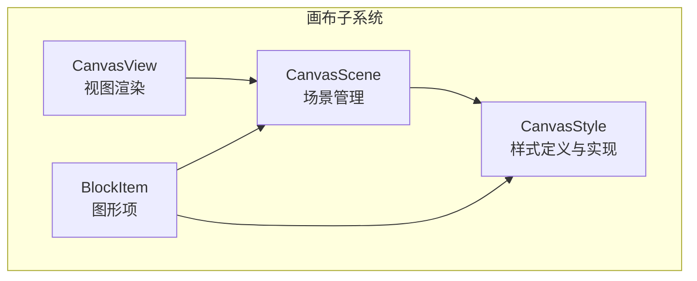
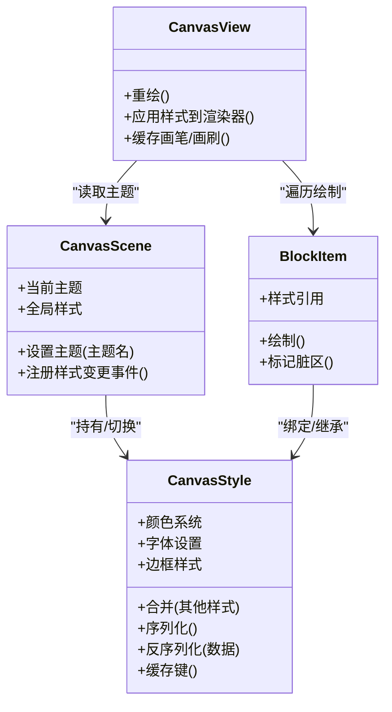
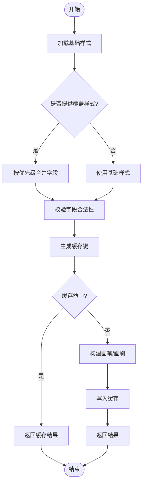
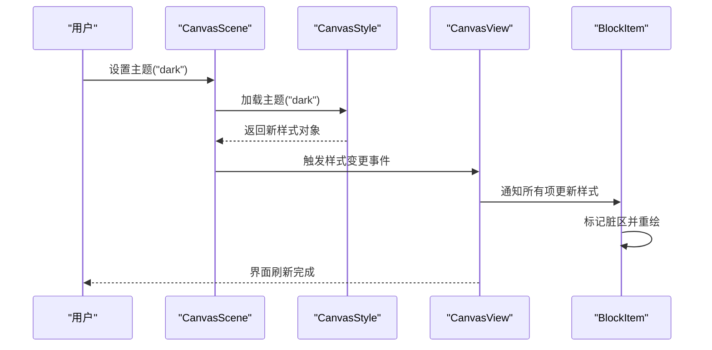
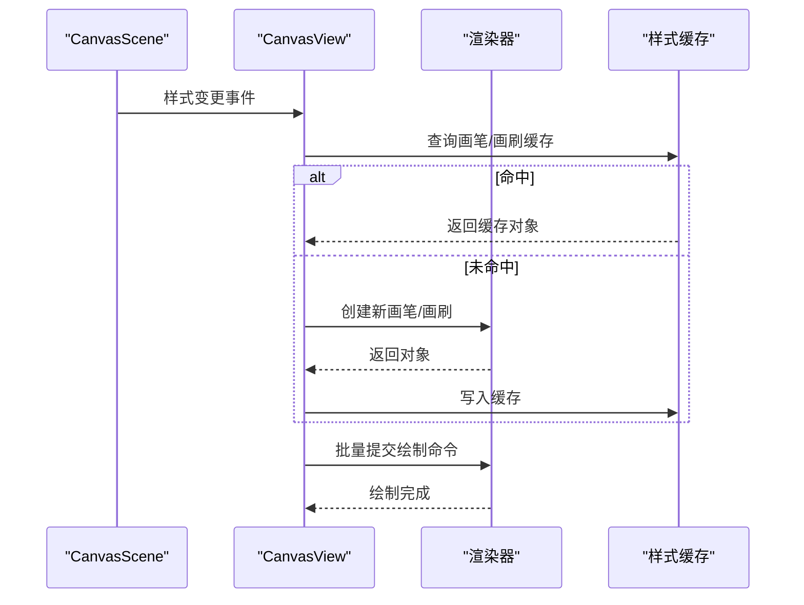
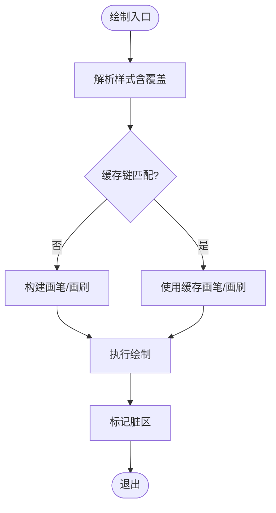
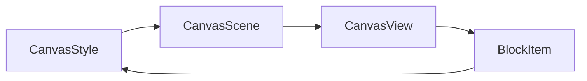

# 样式系统

<cite>
**本文引用的文件**   
- [CanvasStyle.h](file://src/canvas/CanvasStyle.h)
- [CanvasStyle.cpp](file://src/canvas/CanvasStyle.cpp)
- [CanvasScene.h](file://src/canvas/CanvasScene.h)
- [CanvasScene.cpp](file://src/canvas/CanvasScene.cpp)
- [CanvasView.h](file://src/canvas/CanvasView.h)
- [CanvasView.cpp](file://src/canvas/CanvasView.cpp)
- [BlockItem.h](file://src/canvas/BlockItem.h)
- [BlockItem.cpp](file://src/canvas/BlockItem.cpp)
</cite>

## 目录
1. [简介](#简介)
2. [项目结构](#项目结构)
3. [核心组件](#核心组件)
4. [架构总览](#架构总览)
5. [详细组件分析](#详细组件分析)
6. [依赖关系分析](#依赖关系分析)
7. [性能考虑](#性能考虑)
8. [故障排查指南](#故障排查指南)
9. [结论](#结论)
10. [附录](#附录)

## 简介
本文件面向 CanvasStyle 样式系统，系统化说明样式配置结构、主题管理与继承机制，覆盖颜色系统、字体设置与边框样式定义；解释样式与图形项的绑定关系、动态更新流程与缓存策略；并给出样式序列化、预设管理与自定义样式开发方法，以及调试与性能优化建议。文档力求对非专业读者友好，同时为开发者提供深入的技术细节。

## 项目结构
与样式系统直接相关的代码集中在 canvas 模块中：
- 样式定义与实现：CanvasStyle.h/.cpp
- 场景与视图层：CanvasScene.h/.cpp、CanvasView.h/.cpp
- 图形项：BlockItem.h/.cpp（示例图形项）

图表来源
- [CanvasStyle.h](file://src/canvas/CanvasStyle.h)
- [CanvasStyle.cpp](file://src/canvas/CanvasStyle.cpp)
- [CanvasScene.h](file://src/canvas/CanvasScene.h)
- [CanvasScene.cpp](file://src/canvas/CanvasScene.cpp)
- [CanvasView.h](file://src/canvas/CanvasView.h)
- [CanvasView.cpp](file://src/canvas/CanvasView.cpp)
- [BlockItem.h](file://src/canvas/BlockItem.h)
- [BlockItem.cpp](file://src/canvas/BlockItem.cpp)

章节来源
- [CanvasStyle.h](file://src/canvas/CanvasStyle.h)
- [CanvasStyle.cpp](file://src/canvas/CanvasStyle.cpp)
- [CanvasScene.h](file://src/canvas/CanvasScene.h)
- [CanvasScene.cpp](file://src/canvas/CanvasScene.cpp)
- [CanvasView.h](file://src/canvas/CanvasView.h)
- [CanvasView.cpp](file://src/canvas/CanvasView.cpp)
- [BlockItem.h](file://src/canvas/BlockItem.h)
- [BlockItem.cpp](file://src/canvas/BlockItem.cpp)

## 核心组件
- 样式对象（CanvasStyle）
  - 职责：封装颜色、字体、边框等视觉属性，提供默认值、合并与继承能力，支持序列化与预设加载。
  - 关键能力：
    - 颜色系统：主色、强调色、背景色、文本色、描边色等。
    - 字体设置：字号、字重、行高、字体族。
    - 边框样式：宽度、样式（实线/虚线）、圆角半径。
    - 继承与合并：基于层级或优先级进行样式叠加。
    - 缓存：对计算结果（如最终颜色、合成画笔）进行缓存以减少重复计算。
    - 序列化：JSON 或二进制格式导出/导入，便于持久化与传输。
    - 预设管理：内置主题与用户自定义主题的切换与保存。

- 场景（CanvasScene）
  - 职责：维护当前主题与全局样式上下文，向图形项分发样式变更通知。
  - 关键能力：
    - 主题切换：切换后广播事件，触发视图重绘。
    - 样式作用域：为不同图层或分组提供局部样式覆盖。

- 视图（CanvasView）
  - 职责：响应样式变化，调用绘制管线应用最新样式。
  - 关键能力：
    - 增量重绘：仅重绘受影响的区域。
    - 样式缓存命中：优先使用缓存的画笔/画刷。

- 图形项（BlockItem）
  - 职责：持有自身样式引用，根据样式绘制几何体。
  - 关键能力：
    - 样式绑定：从场景获取当前样式或局部覆盖。
    - 动态更新：监听样式变更并标记脏区。

章节来源
- [CanvasStyle.h](file://src/canvas/CanvasStyle.h)
- [CanvasStyle.cpp](file://src/canvas/CanvasStyle.cpp)
- [CanvasScene.h](file://src/canvas/CanvasScene.h)
- [CanvasScene.cpp](file://src/canvas/CanvasScene.cpp)
- [CanvasView.h](file://src/canvas/CanvasView.h)
- [CanvasView.cpp](file://src/canvas/CanvasView.cpp)
- [BlockItem.h](file://src/canvas/BlockItem.h)
- [BlockItem.cpp](file://src/canvas/BlockItem.cpp)

## 架构总览
样式系统采用“集中式样式 + 分层继承”的架构：场景持有主题与全局样式，图形项通过引用或拷贝获得最终样式，视图负责渲染与缓存命中。

图表来源
- [CanvasStyle.h](file://src/canvas/CanvasStyle.h)
- [CanvasStyle.cpp](file://src/canvas/CanvasStyle.cpp)
- [CanvasScene.h](file://src/canvas/CanvasScene.h)
- [CanvasScene.cpp](file://src/canvas/CanvasScene.cpp)
- [CanvasView.h](file://src/canvas/CanvasView.h)
- [CanvasView.cpp](file://src/canvas/CanvasView.cpp)
- [BlockItem.h](file://src/canvas/BlockItem.h)
- [BlockItem.cpp](file://src/canvas/BlockItem.cpp)

## 详细组件分析

### 样式对象（CanvasStyle）
- 设计要点
  - 颜色系统：以命名色板为主，支持透明度与混合模式。
  - 字体设置：统一字体描述结构，包含族名、大小、粗细、行高等。
  - 边框样式：宽度、线型、端点样式、连接样式、圆角半径。
  - 继承与合并：按优先级从高到低合并，冲突字段由高层覆盖。
  - 缓存策略：对合成后的画笔/画刷生成稳定键，避免重复创建。
  - 序列化：提供 to_json/from_json 接口，用于主题文件与用户配置。
  - 预设管理：内置主题列表与用户主题路径管理。

- 复杂度与性能
  - 合并操作时间复杂度 O(n)，n 为样式字段数量。
  - 缓存命中率直接影响渲染性能，建议在样式不变时复用缓存键。

图表来源
- [CanvasStyle.h](file://src/canvas/CanvasStyle.h)
- [CanvasStyle.cpp](file://src/canvas/CanvasStyle.cpp)

章节来源
- [CanvasStyle.h](file://src/canvas/CanvasStyle.h)
- [CanvasStyle.cpp](file://src/canvas/CanvasStyle.cpp)

### 场景（CanvasScene）
- 职责
  - 维护当前主题与全局样式上下文。
  - 提供样式变更事件，驱动视图与图形项刷新。
  - 支持局部样式作用域（例如按图层或分组）。

- 关键流程
  - 主题切换：验证主题存在 -> 替换全局样式 -> 广播事件 -> 视图重绘。
  - 样式作用域：在特定范围内覆盖全局样式，退出范围恢复。

图表来源
- [CanvasScene.h](file://src/canvas/CanvasScene.h)
- [CanvasScene.cpp](file://src/canvas/CanvasScene.cpp)
- [CanvasView.h](file://src/canvas/CanvasView.h)
- [CanvasView.cpp](file://src/canvas/CanvasView.cpp)
- [BlockItem.h](file://src/canvas/BlockItem.h)
- [BlockItem.cpp](file://src/canvas/BlockItem.cpp)

章节来源
- [CanvasScene.h](file://src/canvas/CanvasScene.h)
- [CanvasScene.cpp](file://src/canvas/CanvasScene.cpp)
- [CanvasView.h](file://src/canvas/CanvasView.h)
- [CanvasView.cpp](file://src/canvas/CanvasView.cpp)
- [BlockItem.h](file://src/canvas/BlockItem.h)
- [BlockItem.cpp](file://src/canvas/BlockItem.cpp)

### 视图（CanvasView）
- 职责
  - 接收样式变更事件，组织增量重绘。
  - 应用样式到渲染器，优先使用缓存的画笔/画刷。
  - 管理绘制队列与批处理，减少状态切换开销。

- 关键流程
  - 收到样式变更 -> 收集受影响项 -> 批量更新渲染状态 -> 提交绘制命令。

图表来源
- [CanvasView.h](file://src/canvas/CanvasView.h)
- [CanvasView.cpp](file://src/canvas/CanvasView.cpp)
- [CanvasStyle.h](file://src/canvas/CanvasStyle.h)
- [CanvasStyle.cpp](file://src/canvas/CanvasStyle.cpp)

章节来源
- [CanvasView.h](file://src/canvas/CanvasView.h)
- [CanvasView.cpp](file://src/canvas/CanvasView.cpp)

### 图形项（BlockItem）
- 职责
  - 绑定样式引用，依据样式绘制几何体。
  - 监听样式变更，标记脏区并请求重绘。
  - 支持局部样式覆盖（如选中态、悬停态）。

- 关键流程
  - 绘制前解析样式 -> 应用填充/描边 -> 执行几何绘制 -> 更新缓存键。

图表来源
- [BlockItem.h](file://src/canvas/BlockItem.h)
- [BlockItem.cpp](file://src/canvas/BlockItem.cpp)
- [CanvasStyle.h](file://src/canvas/CanvasStyle.h)
- [CanvasStyle.cpp](file://src/canvas/CanvasStyle.cpp)

章节来源
- [BlockItem.h](file://src/canvas/BlockItem.h)
- [BlockItem.cpp](file://src/canvas/BlockItem.cpp)

## 依赖关系分析
- 组件耦合
  - CanvasScene 依赖 CanvasStyle 提供主题与样式对象。
  - CanvasView 依赖 CanvasScene 获取主题与样式变更事件。
  - BlockItem 依赖 CanvasStyle 进行绘制，依赖 CanvasScene 获取作用域样式。

- 外部依赖
  - 渲染后端（如 Qt Graphics/OpenGL）通过 CanvasView 接入。
  - 序列化格式（JSON）用于主题文件与用户配置。

图表来源
- [CanvasStyle.h](file://src/canvas/CanvasStyle.h)
- [CanvasStyle.cpp](file://src/canvas/CanvasStyle.cpp)
- [CanvasScene.h](file://src/canvas/CanvasScene.h)
- [CanvasScene.cpp](file://src/canvas/CanvasScene.cpp)
- [CanvasView.h](file://src/canvas/CanvasView.h)
- [CanvasView.cpp](file://src/canvas/CanvasView.cpp)
- [BlockItem.h](file://src/canvas/BlockItem.h)
- [BlockItem.cpp](file://src/canvas/BlockItem.cpp)

章节来源
- [CanvasStyle.h](file://src/canvas/CanvasStyle.h)
- [CanvasStyle.cpp](file://src/canvas/CanvasStyle.cpp)
- [CanvasScene.h](file://src/canvas/CanvasScene.h)
- [CanvasScene.cpp](file://src/canvas/CanvasScene.cpp)
- [CanvasView.h](file://src/canvas/CanvasView.h)
- [CanvasView.cpp](file://src/canvas/CanvasView.cpp)
- [BlockItem.h](file://src/canvas/BlockItem.h)
- [BlockItem.cpp](file://src/canvas/BlockItem.cpp)

## 性能考虑
- 样式缓存
  - 为每个样式组合生成稳定缓存键，避免重复创建画笔/画刷。
  - 在视图层维护 LRU 缓存，限制最大条目数，防止内存膨胀。

- 增量重绘
  - 仅在样式变更时标记受影响项的脏区，减少全量重绘。
  - 合并相邻绘制命令，降低状态切换次数。

- 合并与继承
  - 合并操作尽量浅拷贝不可变字段，避免深拷贝开销。
  - 对高频字段（如颜色、线宽）建立索引加速查找。

- 序列化
  - 使用流式读写大主题文件，避免一次性加载导致卡顿。
  - 对常用主题进行预编译或缓存，缩短启动时间。

[本节为通用性能建议，不直接分析具体文件]

## 故障排查指南
- 常见问题
  - 样式未生效：检查样式作用域是否正确，确认事件已广播且视图已重绘。
  - 渲染异常：核对颜色/字体/边框字段合法性，确保序列化/反序列化一致。
  - 性能下降：查看缓存命中率，检查是否存在频繁样式重建。

- 调试技巧
  - 启用样式变更日志，记录主题切换与覆盖顺序。
  - 输出缓存键与命中情况，定位重复创建问题。
  - 使用帧率统计工具观察重绘频率与耗时。

章节来源
- [CanvasStyle.h](file://src/canvas/CanvasStyle.h)
- [CanvasStyle.cpp](file://src/canvas/CanvasStyle.cpp)
- [CanvasScene.h](file://src/canvas/CanvasScene.h)
- [CanvasScene.cpp](file://src/canvas/CanvasScene.cpp)
- [CanvasView.h](file://src/canvas/CanvasView.h)
- [CanvasView.cpp](file://src/canvas/CanvasView.cpp)
- [BlockItem.h](file://src/canvas/BlockItem.h)
- [BlockItem.cpp](file://src/canvas/BlockItem.cpp)

## 结论
CanvasStyle 样式系统通过集中式样式对象、分层继承与缓存机制，实现了高效、可维护的视觉表现管理。配合场景与视图的事件驱动，能够灵活支持主题切换、动态更新与序列化持久化。遵循本文的性能与调试建议，可在复杂场景中保持流畅体验与良好扩展性。

[本节为总结性内容，不直接分析具体文件]

## 附录
- 样式配置结构建议
  - 颜色：主色、强调色、背景色、文本色、描边色、透明度。
  - 字体：族名、字号、字重、行高、对齐方式。
  - 边框：宽度、线型、端点、连接、圆角半径。
  - 元数据：版本、作者、描述、适用主题。

- 预设管理
  - 内置主题：提供多套开箱即用配色与字体组合。
  - 用户主题：支持导入/导出 JSON 配置文件，允许用户自定义。

- 自定义样式开发
  - 新增样式字段：在样式对象中声明字段，并在合并逻辑中处理优先级。
  - 扩展序列化：确保新字段在 to_json/from_json 中正确读写。
  - 测试用例：覆盖合并、缓存、序列化与渲染一致性。

[本节为概念性内容，不直接分析具体文件]