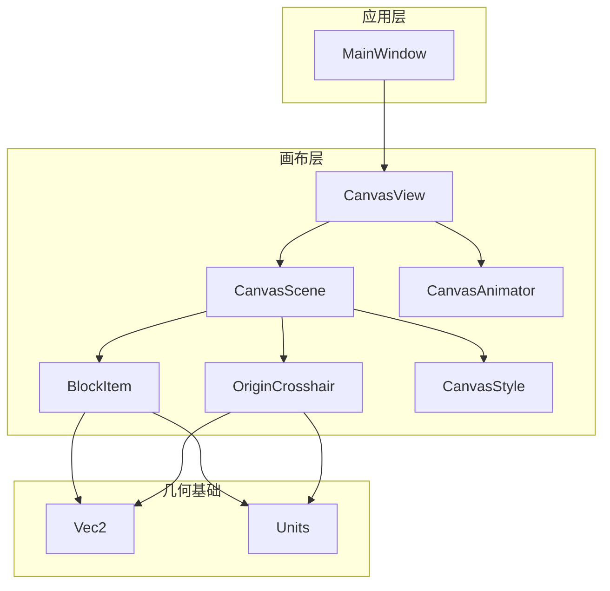
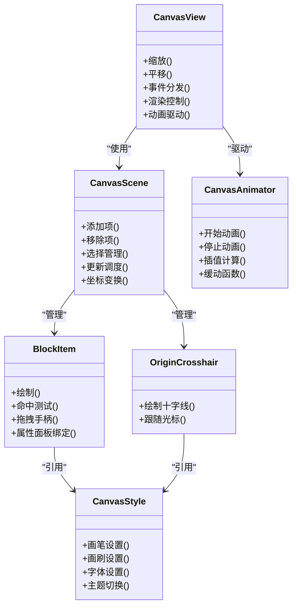
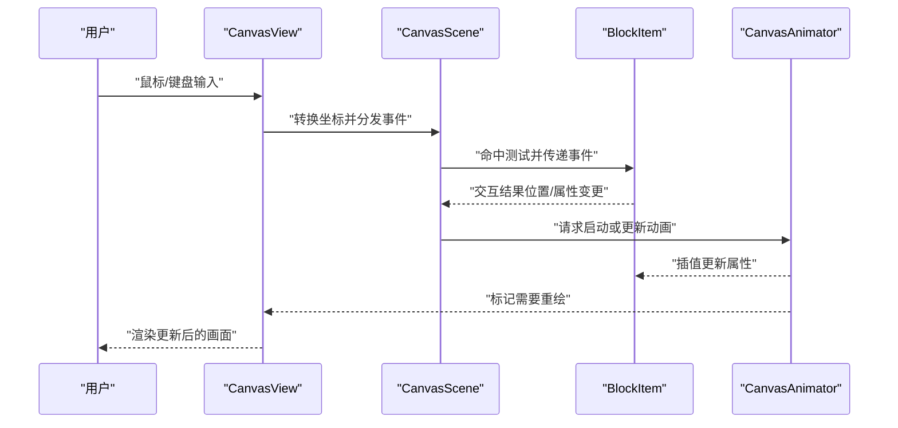
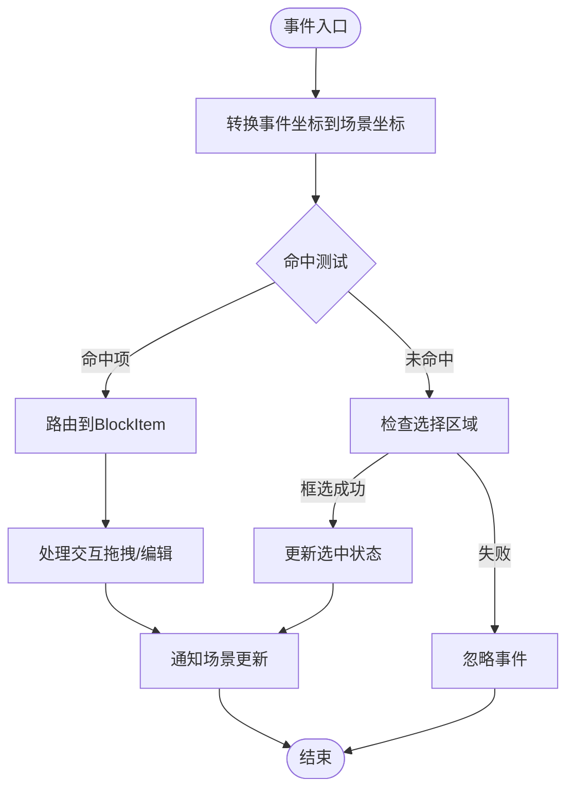
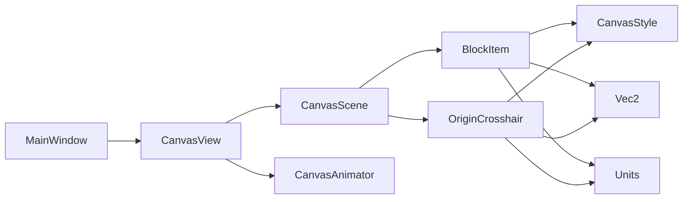

# 画布系统架构

<cite>
**本文引用的文件**   
- [CanvasScene.h](file://src/canvas/CanvasScene.h)
- [CanvasScene.cpp](file://src/canvas/CanvasScene.cpp)
- [CanvasView.h](file://src/canvas/CanvasView.h)
- [CanvasView.cpp](file://src/canvas/CanvasView.cpp)
- [BlockItem.h](file://src/canvas/BlockItem.h)
- [BlockItem.cpp](file://src/canvas/BlockItem.cpp)
- [CanvasAnimator.h](file://src/canvas/CanvasAnimator.h)
- [CanvasAnimator.cpp](file://src/canvas/CanvasAnimator.cpp)
- [CanvasStyle.h](file://src/canvas/CanvasStyle.h)
- [CanvasStyle.cpp](file://src/canvas/CanvasStyle.cpp)
- [OriginCrosshair.h](file://src/canvas/OriginCrosshair.h)
- [OriginCrosshair.cpp](file://src/canvas/OriginCrosshair.cpp)
- [MainWindow.h](file://src/app/MainWindow.h)
- [MainWindow.cpp](file://src/app/MainWindow.cpp)
- [Vec2.h](file://src/geometry/Vec2.h)
- [Units.h](file://src/geometry/Units.h)
</cite>

## 目录
1. [简介](#简介)
2. [项目结构](#项目结构)
3. [核心组件](#核心组件)
4. [架构总览](#架构总览)
5. [详细组件分析](#详细组件分析)
6. [依赖关系分析](#依赖关系分析)
7. [性能考量](#性能考量)
8. [故障排查指南](#故障排查指南)
9. [结论](#结论)
10. [附录](#附录)

## 简介
本文件为服装CAD系统的“画布系统”提供系统化、可落地的技术文档。该画布基于Qt Graphics View Framework，采用Scene-View-Item三层架构：CanvasScene负责场景与对象管理，CanvasView负责视图控制与交互，BlockItem作为图形项承载服装裁片等元素的绘制与交互。此外，文档还涵盖动画系统CanvasAnimator的实现原理与优化策略，坐标系统与变换矩阵模型，渲染管线要点，以及扩展点与新图形元素添加方法。最后给出事件处理机制与交互逻辑说明，帮助开发者快速理解并扩展画布能力。

## 项目结构
画布相关代码集中在src/canvas目录，配合几何基础类型（src/geometry）与应用主窗口（src/app）完成集成。整体组织遵循职责分离：场景、视图、图形项、样式与辅助项各自独立，便于维护与扩展。

图表来源
- [MainWindow.h](file://src/app/MainWindow.h)
- [MainWindow.cpp](file://src/app/MainWindow.cpp)
- [CanvasView.h](file://src/canvas/CanvasView.h)
- [CanvasView.cpp](file://src/canvas/CanvasView.cpp)
- [CanvasScene.h](file://src/canvas/CanvasScene.h)
- [CanvasScene.cpp](file://src/canvas/CanvasScene.cpp)
- [BlockItem.h](file://src/canvas/BlockItem.h)
- [BlockItem.cpp](file://src/canvas/BlockItem.cpp)
- [OriginCrosshair.h](file://src/canvas/OriginCrosshair.h)
- [OriginCrosshair.cpp](file://src/canvas/OriginCrosshair.cpp)
- [CanvasAnimator.h](file://src/canvas/CanvasAnimator.h)
- [CanvasAnimator.cpp](file://src/canvas/CanvasAnimator.cpp)
- [CanvasStyle.h](file://src/canvas/CanvasStyle.h)
- [CanvasStyle.cpp](file://src/canvas/CanvasStyle.cpp)
- [Vec2.h](file://src/geometry/Vec2.h)
- [Units.h](file://src/geometry/Units.h)

章节来源
- [CanvasScene.h](file://src/canvas/CanvasScene.h)
- [CanvasScene.cpp](file://src/canvas/CanvasScene.cpp)
- [CanvasView.h](file://src/canvas/CanvasView.h)
- [CanvasView.cpp](file://src/canvas/CanvasView.cpp)
- [BlockItem.h](file://src/canvas/BlockItem.h)
- [BlockItem.cpp](file://src/canvas/BlockItem.cpp)
- [CanvasAnimator.h](file://src/canvas/CanvasAnimator.h)
- [CanvasAnimator.cpp](file://src/canvas/CanvasAnimator.cpp)
- [CanvasStyle.h](file://src/canvas/CanvasStyle.h)
- [CanvasStyle.cpp](file://src/canvas/CanvasStyle.cpp)
- [OriginCrosshair.h](file://src/canvas/OriginCrosshair.h)
- [OriginCrosshair.cpp](file://src/canvas/OriginCrosshair.cpp)
- [MainWindow.h](file://src/app/MainWindow.h)
- [MainWindow.cpp](file://src/app/MainWindow.cpp)
- [Vec2.h](file://src/geometry/Vec2.h)
- [Units.h](file://src/geometry/Units.h)

## 核心组件
- CanvasScene：场景容器，管理所有图形项的增删改查、选择状态、可见性、层级与更新调度；提供统一的坐标空间与变换上下文。
- CanvasView：视图控制器，封装缩放、平移、视口裁剪、鼠标/键盘事件分发、动画驱动刷新；与QGraphicsView对齐。
- BlockItem：裁片图形项，封装路径、轮廓、标注、吸附点、拖拽手柄、选中态绘制；实现自定义绘制与命中测试。
- CanvasAnimator：动画引擎，统一驱动场景内对象的过渡动画（如移动、旋转、淡入淡出），支持关键帧与缓动函数。
- CanvasStyle：样式中心，集中管理画笔、画刷、字体、线宽、颜色等视觉资源，保证风格一致与批量更新。
- OriginCrosshair：原点十字线辅助项，用于定位与对齐参考。

章节来源
- [CanvasScene.h](file://src/canvas/CanvasScene.h)
- [CanvasScene.cpp](file://src/canvas/CanvasScene.cpp)
- [CanvasView.h](file://src/canvas/CanvasView.h)
- [CanvasView.cpp](file://src/canvas/CanvasView.cpp)
- [BlockItem.h](file://src/canvas/BlockItem.h)
- [BlockItem.cpp](file://src/canvas/BlockItem.cpp)
- [CanvasAnimator.h](file://src/canvas/CanvasAnimator.h)
- [CanvasAnimator.cpp](file://src/canvas/CanvasAnimator.cpp)
- [CanvasStyle.h](file://src/canvas/CanvasStyle.h)
- [CanvasStyle.cpp](file://src/canvas/CanvasStyle.cpp)
- [OriginCrosshair.h](file://src/canvas/OriginCrosshair.h)
- [OriginCrosshair.cpp](file://src/canvas/OriginCrosshair.cpp)

## 架构总览
画布系统严格遵循Qt Graphics View的Scene-View-Item模式：
- Scene（CanvasScene）持有Item集合，负责数据与状态。
- View（CanvasView）负责投影变换、视口裁剪、事件路由与渲染调度。
- Item（BlockItem、OriginCrosshair等）负责自身绘制与局部交互。

图表来源
- [CanvasScene.h](file://src/canvas/CanvasScene.h)
- [CanvasScene.cpp](file://src/canvas/CanvasScene.cpp)
- [CanvasView.h](file://src/canvas/CanvasView.h)
- [CanvasView.cpp](file://src/canvas/CanvasView.cpp)
- [BlockItem.h](file://src/canvas/BlockItem.h)
- [BlockItem.cpp](file://src/canvas/BlockItem.cpp)
- [CanvasAnimator.h](file://src/canvas/CanvasAnimator.h)
- [CanvasAnimator.cpp](file://src/canvas/CanvasAnimator.cpp)
- [CanvasStyle.h](file://src/canvas/CanvasStyle.h)
- [CanvasStyle.cpp](file://src/canvas/CanvasStyle.cpp)
- [OriginCrosshair.h](file://src/canvas/OriginCrosshair.h)
- [OriginCrosshair.cpp](file://src/canvas/OriginCrosshair.cpp)

## 详细组件分析

### CanvasScene：场景管理与数据层
- 职责
  - 管理BlockItem与辅助项的生命周期与可见性。
  - 维护选择集、层级顺序、更新区域与脏矩形合并。
  - 提供统一的坐标空间与变换接口，供视图与项使用。
- 关键点
  - 增量更新：通过脏矩形与可见性判断减少重绘范围。
  - 选择与高亮：维护选中项列表，响应视图事件进行状态切换。
  - 事件转发：将鼠标/键盘事件分发给命中项，支持多选与框选。
- 扩展点
  - 新增项类型：继承通用基类并在场景注册创建工厂。
  - 自定义布局：在场景层实现自动排列或网格对齐。

章节来源
- [CanvasScene.h](file://src/canvas/CanvasScene.h)
- [CanvasScene.cpp](file://src/canvas/CanvasScene.cpp)

### CanvasView：视图控制与交互中枢
- 职责
  - 封装缩放、平移、旋转等视图变换。
  - 处理鼠标滚轮、拖拽、点击、双击、键盘快捷键。
  - 协调CanvasAnimator驱动刷新，避免过度重绘。
- 关键点
  - 变换矩阵：维护视图到场景的映射矩阵，确保事件坐标正确转换。
  - 视口裁剪：仅渲染可见区域，提升大场景性能。
  - 事件优先级：先捕获工具级事件，再下沉至场景与项。
- 扩展点
  - 自定义工具：通过工具管理器注入新的交互流程。
  - 自定义渲染：重写绘制钩子以叠加网格、标尺或水印。

章节来源
- [CanvasView.h](file://src/canvas/CanvasView.h)
- [CanvasView.cpp](file://src/canvas/CanvasView.cpp)

### BlockItem：裁片图形项设计
- 职责
  - 绘制裁片轮廓、内部标注、尺寸线与吸附点。
  - 实现命中测试与拖拽手柄，支持编辑与变形。
  - 与属性面板联动，双向同步参数。
- 关键点
  - 绘制优化：缓存路径与形状，按需重绘。
  - 命中测试：基于边界框与多边形近似，提高交互精度。
  - 交互反馈：选中态、悬停态、编辑态的视觉区分。
- 扩展点
  - 新图形元素：继承BlockItem或通用基类，实现绘制与交互逻辑。
  - 自定义手柄：增加旋转、缩放、切角等编辑手柄。

章节来源
- [BlockItem.h](file://src/canvas/BlockItem.h)
- [BlockItem.cpp](file://src/canvas/BlockItem.cpp)

### CanvasAnimator：动画系统与性能优化
- 职责
  - 统一管理场景内对象的过渡动画（位置、角度、透明度等）。
  - 提供关键帧与缓动函数，支持链式动画与回调。
- 关键点
  - 时间驱动：基于固定时间步长推进，保证平滑与稳定。
  - 批量更新：合并多个对象的插值计算，减少CPU抖动。
  - 渲染节流：与视图刷新频率对齐，避免重复绘制。
- 扩展点
  - 自定义缓动：注册新的缓动曲线。
  - 动画组合：支持序列与并行动画编排。

章节来源
- [CanvasAnimator.h](file://src/canvas/CanvasAnimator.h)
- [CanvasAnimator.cpp](file://src/canvas/CanvasAnimator.cpp)

### CanvasStyle：样式中心
- 职责
  - 集中管理画笔、画刷、字体、线宽、颜色等视觉资源。
  - 提供主题切换与批量更新能力。
- 关键点
  - 资源复用：避免频繁创建QPen/QBrush，降低内存分配。
  - 主题一致性：全局样式变更即时生效。

章节来源
- [CanvasStyle.h](file://src/canvas/CanvasStyle.h)
- [CanvasStyle.cpp](file://src/canvas/CanvasStyle.cpp)

### OriginCrosshair：原点十字线辅助项
- 职责
  - 绘制原点十字线，随光标或视图变化更新位置。
  - 提供对齐参考，辅助精确绘图。
- 关键点
  - 轻量绘制：仅在必要时更新，避免影响性能。
  - 坐标同步：与视图坐标系保持一致。

章节来源
- [OriginCrosshair.h](file://src/canvas/OriginCrosshair.h)
- [OriginCrosshair.cpp](file://src/canvas/OriginCrosshair.cpp)

### 坐标系统、变换矩阵与渲染管线
- 坐标系统
  - 视图坐标：屏幕像素坐标，受缩放与平移影响。
  - 场景坐标：业务逻辑坐标，单位由Units定义，保持物理一致性。
  - 项坐标：BlockItem局部坐标，便于独立变换与绘制。
- 变换矩阵
  - 视图到场景的映射矩阵由CanvasView维护，事件坐标需经逆变换得到场景坐标。
  - 项级变换：BlockItem可独立设置位移、旋转、缩放，最终合成到场景坐标。
- 渲染管线
  - 视图触发重绘时，CanvasScene计算可见项与脏矩形。
  - 各Item按层级顺序调用绘制接口，CanvasStyle提供统一画笔与画刷。
  - 动画系统驱动插值结果写入项属性，下一帧参与渲染。

章节来源
- [CanvasView.h](file://src/canvas/CanvasView.h)
- [CanvasView.cpp](file://src/canvas/CanvasView.cpp)
- [CanvasScene.h](file://src/canvas/CanvasScene.h)
- [CanvasScene.cpp](file://src/canvas/CanvasScene.cpp)
- [BlockItem.h](file://src/canvas/BlockItem.h)
- [BlockItem.cpp](file://src/canvas/BlockItem.cpp)
- [CanvasAnimator.h](file://src/canvas/CanvasAnimator.h)
- [CanvasAnimator.cpp](file://src/canvas/CanvasAnimator.cpp)
- [CanvasStyle.h](file://src/canvas/CanvasStyle.h)
- [CanvasStyle.cpp](file://src/canvas/CanvasStyle.cpp)
- [Units.h](file://src/geometry/Units.h)

### 事件处理机制与交互逻辑
- 事件流
  - 用户输入进入CanvasView，转换为场景坐标后下发至CanvasScene。
  - CanvasScene根据命中测试将事件路由至具体BlockItem。
  - BlockItem处理交互（拖拽、编辑），并通过信号通知CanvasScene更新状态。
- 典型交互
  - 框选：记录起点与终点，计算选择区域，批量更新选中状态。
  - 拖拽：按下时记录偏移，移动时更新项位置，释放时提交变更。
  - 双击：进入编辑模式，显示手柄与属性面板。
- 工具集成
  - ToolManager注入不同工具（选择、智能笔等），改变事件处理策略。

章节来源
- [CanvasView.h](file://src/canvas/CanvasView.h)
- [CanvasView.cpp](file://src/canvas/CanvasView.cpp)
- [CanvasScene.h](file://src/canvas/CanvasScene.h)
- [CanvasScene.cpp](file://src/canvas/CanvasScene.cpp)
- [BlockItem.h](file://src/canvas/BlockItem.h)
- [BlockItem.cpp](file://src/canvas/BlockItem.cpp)

### 动画流程时序

图表来源
- [CanvasView.h](file://src/canvas/CanvasView.h)
- [CanvasView.cpp](file://src/canvas/CanvasView.cpp)
- [CanvasScene.h](file://src/canvas/CanvasScene.h)
- [CanvasScene.cpp](file://src/canvas/CanvasScene.cpp)
- [BlockItem.h](file://src/canvas/BlockItem.h)
- [BlockItem.cpp](file://src/canvas/BlockItem.cpp)
- [CanvasAnimator.h](file://src/canvas/CanvasAnimator.h)
- [CanvasAnimator.cpp](file://src/canvas/CanvasAnimator.cpp)

### 复杂逻辑流程图：命中测试与选择

图表来源
- [CanvasView.h](file://src/canvas/CanvasView.h)
- [CanvasView.cpp](file://src/canvas/CanvasView.cpp)
- [CanvasScene.h](file://src/canvas/CanvasScene.h)
- [CanvasScene.cpp](file://src/canvas/CanvasScene.cpp)
- [BlockItem.h](file://src/canvas/BlockItem.h)
- [BlockItem.cpp](file://src/canvas/BlockItem.cpp)

### 概念总览：扩展点与新图形元素添加方法
- 扩展点
  - 场景层：注册新项类型、自定义布局算法、批量操作接口。
  - 视图层：注入新工具、自定义渲染钩子、事件拦截器。
  - 项层：继承BlockItem或通用基类，实现绘制与交互。
  - 动画层：注册新缓动曲线、组合动画编排。
  - 样式层：主题切换、批量样式更新。
- 添加新图形元素步骤
  - 定义新项类，实现绘制与命中测试。
  - 在场景注册创建工厂，支持从数据源实例化。
  - 在视图层配置工具与事件处理策略。
  - 在样式中心注册视觉资源，确保风格一致。
  - 如需动画，接入CanvasAnimator驱动过渡效果。

[本节为概念性内容，不直接分析具体文件]

## 依赖关系分析
画布系统内部依赖清晰，外部依赖主要为Qt Graphics View框架与几何基础库。

图表来源
- [MainWindow.h](file://src/app/MainWindow.h)
- [MainWindow.cpp](file://src/app/MainWindow.cpp)
- [CanvasView.h](file://src/canvas/CanvasView.h)
- [CanvasView.cpp](file://src/canvas/CanvasView.cpp)
- [CanvasScene.h](file://src/canvas/CanvasScene.h)
- [CanvasScene.cpp](file://src/canvas/CanvasScene.cpp)
- [BlockItem.h](file://src/canvas/BlockItem.h)
- [BlockItem.cpp](file://src/canvas/BlockItem.cpp)
- [OriginCrosshair.h](file://src/canvas/OriginCrosshair.h)
- [OriginCrosshair.cpp](file://src/canvas/OriginCrosshair.cpp)
- [CanvasAnimator.h](file://src/canvas/CanvasAnimator.h)
- [CanvasAnimator.cpp](file://src/canvas/CanvasAnimator.cpp)
- [CanvasStyle.h](file://src/canvas/CanvasStyle.h)
- [CanvasStyle.cpp](file://src/canvas/CanvasStyle.cpp)
- [Vec2.h](file://src/geometry/Vec2.h)
- [Units.h](file://src/geometry/Units.h)

章节来源
- [CanvasScene.h](file://src/canvas/CanvasScene.h)
- [CanvasScene.cpp](file://src/canvas/CanvasScene.cpp)
- [CanvasView.h](file://src/canvas/CanvasView.h)
- [CanvasView.cpp](file://src/canvas/CanvasView.cpp)
- [BlockItem.h](file://src/canvas/BlockItem.h)
- [BlockItem.cpp](file://src/canvas/BlockItem.cpp)
- [CanvasAnimator.h](file://src/canvas/CanvasAnimator.h)
- [CanvasAnimator.cpp](file://src/canvas/CanvasAnimator.cpp)
- [CanvasStyle.h](file://src/canvas/CanvasStyle.h)
- [CanvasStyle.cpp](file://src/canvas/CanvasStyle.cpp)
- [OriginCrosshair.h](file://src/canvas/OriginCrosshair.h)
- [OriginCrosshair.cpp](file://src/canvas/OriginCrosshair.cpp)
- [MainWindow.h](file://src/app/MainWindow.h)
- [MainWindow.cpp](file://src/app/MainWindow.cpp)
- [Vec2.h](file://src/geometry/Vec2.h)
- [Units.h](file://src/geometry/Units.h)

## 性能考量
- 渲染优化
  - 视口裁剪：仅渲染可见区域，减少绘制开销。
  - 脏矩形合并：合并相邻更新区域，降低重绘次数。
  - 路径缓存：BlockItem缓存绘制路径与形状，避免重复计算。
- 动画优化
  - 固定时间步长：保证动画稳定性，避免帧率波动影响。
  - 批量插值：合并多个对象的插值计算，减少CPU抖动。
  - 渲染节流：与视图刷新频率对齐，避免多余绘制。
- 内存与资源
  - 样式资源复用：CanvasStyle集中管理画笔与画刷，减少分配。
  - 项生命周期：及时销毁不可见项，释放占用资源。
- 事件处理
  - 命中测试优化：优先使用边界框快速剔除，再进行精细测试。
  - 事件优先级：工具级事件优先处理，减少不必要的下沉。

[本节提供一般性指导，不直接分析具体文件]

## 故障排查指南
- 常见问题
  - 坐标错位：检查视图到场景的变换矩阵是否正确，事件坐标是否经过逆变换。
  - 绘制异常：确认BlockItem的绘制路径与样式资源是否有效，是否存在空指针。
  - 动画卡顿：检查动画时间步长与插值计算是否合理，是否存在阻塞操作。
  - 选择失效：验证命中测试逻辑与选择区域计算是否正确。
- 调试建议
  - 启用日志：在CanvasScene与CanvasView的关键路径输出调试信息。
  - 可视化辅助：显示边界框、命中区域与变换矩阵，辅助定位问题。
  - 单元测试：对坐标转换、命中测试与动画插值编写单测用例。

章节来源
- [CanvasView.h](file://src/canvas/CanvasView.h)
- [CanvasView.cpp](file://src/canvas/CanvasView.cpp)
- [CanvasScene.h](file://src/canvas/CanvasScene.h)
- [CanvasScene.cpp](file://src/canvas/CanvasScene.cpp)
- [BlockItem.h](file://src/canvas/BlockItem.h)
- [BlockItem.cpp](file://src/canvas/BlockItem.cpp)
- [CanvasAnimator.h](file://src/canvas/CanvasAnimator.h)
- [CanvasAnimator.cpp](file://src/canvas/CanvasAnimator.cpp)

## 结论
本画布系统基于Qt Graphics View Framework，采用清晰的Scene-View-Item三层架构，实现了高效的场景管理、灵活的视图控制与可扩展的图形项体系。CanvasAnimator提供了稳定的动画驱动与优化策略，CanvasStyle确保了视觉一致性。通过明确的扩展点与事件处理机制，开发者可以快速添加新图形元素与交互逻辑，满足服装CAD系统的复杂需求。

[本节为总结性内容，不直接分析具体文件]

## 附录
- 术语表
  - 场景：承载所有图形项的数据与状态层。
  - 视图：负责投影变换、事件分发与渲染调度的界面层。
  - 图形项：独立的绘制与交互单元，如BlockItem。
  - 动画：对象属性的过渡效果，由CanvasAnimator驱动。
  - 样式：统一的视觉资源管理，包括画笔、画刷与字体。
- 最佳实践
  - 保持项的绘制轻量，避免在绘制中进行耗时计算。
  - 合理使用缓存与增量更新，减少重绘范围。
  - 明确事件优先级，避免冲突与死锁。
  - 通过样式中心统一管理视觉资源，便于主题切换。

[本节为补充性内容，不直接分析具体文件]