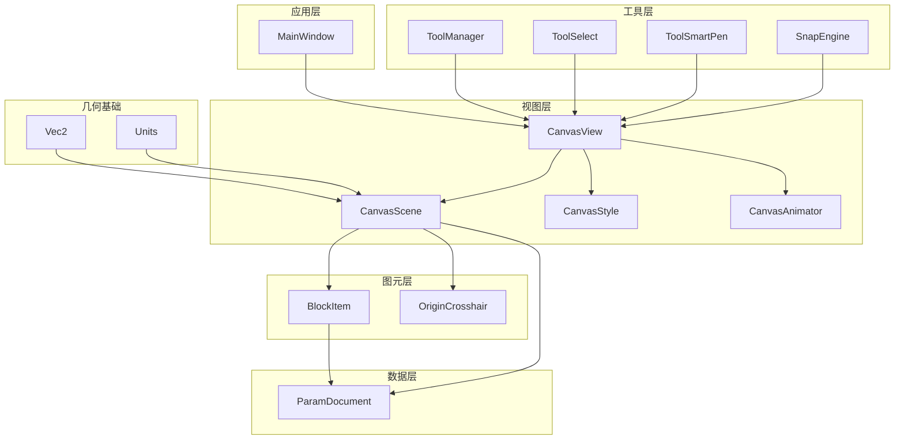
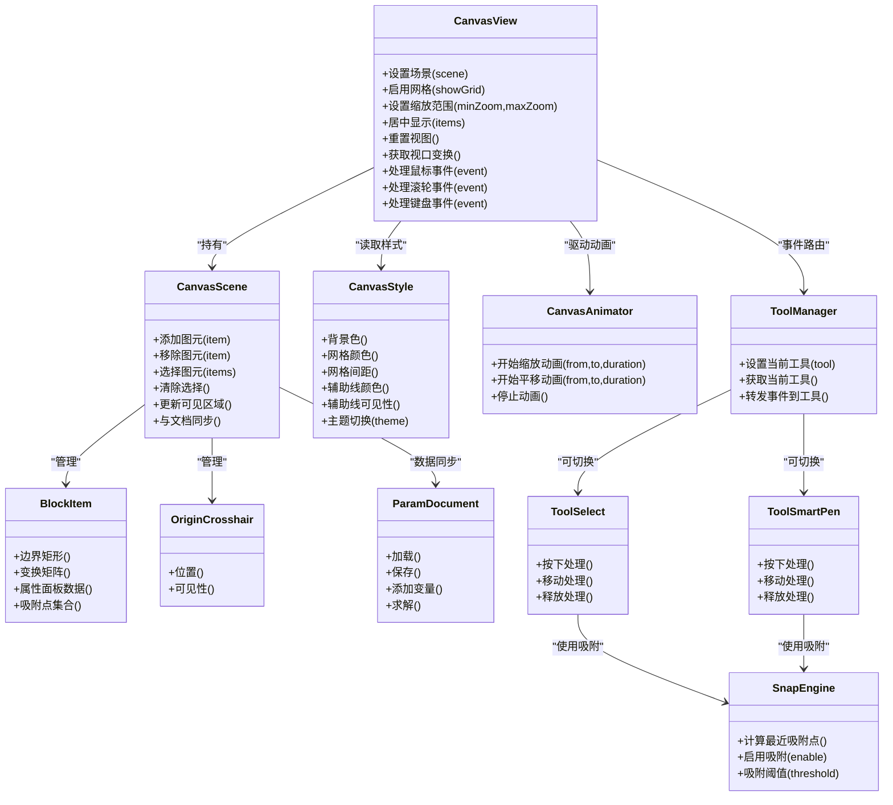
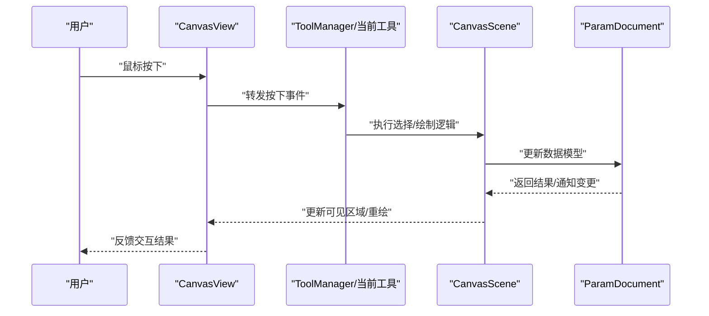
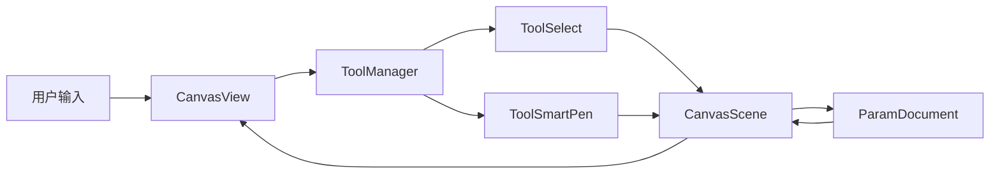

# 视图控制系统

<cite>
**本文引用的文件**   
- [CanvasView.h](file://src/canvas/CanvasView.h)
- [CanvasView.cpp](file://src/canvas/CanvasView.cpp)
- [CanvasScene.h](file://src/canvas/CanvasScene.h)
- [CanvasScene.cpp](file://src/canvas/CanvasScene.cpp)
- [CanvasStyle.h](file://src/canvas/CanvasStyle.h)
- [CanvasStyle.cpp](file://src/canvas/CanvasStyle.cpp)
- [BlockItem.h](file://src/canvas/BlockItem.h)
- [BlockItem.cpp](file://src/canvas/BlockItem.cpp)
- [OriginCrosshair.h](file://src/canvas/OriginCrosshair.h)
- [OriginCrosshair.cpp](file://src/canvas/OriginCrosshair.cpp)
- [CanvasAnimator.h](file://src/canvas/CanvasAnimator.h)
- [CanvasAnimator.cpp](file://src/canvas/CanvasAnimator.cpp)
- [MainWindow.h](file://src/app/MainWindow.h)
- [MainWindow.cpp](file://src/app/MainWindow.cpp)
- [ToolManager.h](file://src/tools/ToolManager.h)
- [ToolManager.cpp](file://src/tools/ToolManager.cpp)
- [ToolSelect.h](file://src/tools/ToolSelect.h)
- [ToolSelect.cpp](file://src/tools/ToolSelect.cpp)
- [ToolSmartPen.h](file://src/tools/ToolSmartPen.h)
- [ToolSmartPen.cpp](file://src/tools/ToolSmartPen.cpp)
- [SnapEngine.h](file://src/tools/SnapEngine.h)
- [SnapEngine.cpp](file://src/tools/SnapEngine.cpp)
- [ParamDocument.h](file://src/parametric/ParamDocument.h)
- [ParamDocument.cpp](file://src/parametric/ParamDocument.cpp)
- [Units.h](file://src/geometry/Units.h)
- [Vec2.h](file://src/geometry/Vec2.h)
</cite>

## 目录
1. [简介](#简介)
2. [项目结构](#项目结构)
3. [核心组件](#核心组件)
4. [架构总览](#架构总览)
5. [详细组件分析](#详细组件分析)
6. [依赖关系分析](#依赖关系分析)
7. [性能考虑](#性能考虑)
8. [故障排查指南](#故障排查指南)
9. [结论](#结论)
10. [附录](#附录)

## 简介
本文件为 CanvasView 视图控制系统的技术文档，面向服装 CAD 的图形编辑场景。内容覆盖：
- 视图与场景的绑定关系、视口管理与缩放平移
- 鼠标事件处理、键盘快捷键与用户交互逻辑
- 视图样式配置、网格显示与辅助线功能
- 视图状态保存与恢复、多视图支持与窗口管理
- 自定义视图行为与扩展点

该文档旨在帮助开发者快速理解并扩展视图子系统，同时为使用者提供清晰的交互说明与排错指引。

## 项目结构
CanvasView 相关代码集中在 src/canvas 目录，配合工具栏与主窗口完成整体交互。关键模块如下：
- 视图层：CanvasView（Qt Graphics View 封装）
- 场景层：CanvasScene（QGraphicsScene 封装，承载图元）
- 样式层：CanvasStyle（主题、网格、辅助线等视觉配置）
- 图元层：BlockItem、OriginCrosshair（业务图元与十字准线）
- 动画层：CanvasAnimator（平滑过渡与动画效果）
- 工具层：ToolManager、ToolSelect、ToolSmartPen、SnapEngine（选择、绘制、吸附）
- 应用层：MainWindow（主窗口、菜单、工具栏、多视图容器）
- 数据层：ParamDocument（参数化文档模型）
- 几何基础：Vec2、Units（向量与单位换算）

图表来源
- [CanvasView.h](file://src/canvas/CanvasView.h)
- [CanvasScene.h](file://src/canvas/CanvasScene.h)
- [CanvasStyle.h](file://src/canvas/CanvasStyle.h)
- [BlockItem.h](file://src/canvas/BlockItem.h)
- [OriginCrosshair.h](file://src/canvas/OriginCrosshair.h)
- [CanvasAnimator.h](file://src/canvas/CanvasAnimator.h)
- [ToolManager.h](file://src/tools/ToolManager.h)
- [ToolSelect.h](file://src/tools/ToolSelect.h)
- [ToolSmartPen.h](file://src/tools/ToolSmartPen.h)
- [SnapEngine.h](file://src/tools/SnapEngine.h)
- [ParamDocument.h](file://src/parametric/ParamDocument.h)
- [Vec2.h](file://src/geometry/Vec2.h)
- [Units.h](file://src/geometry/Units.h)

章节来源
- [CanvasView.h](file://src/canvas/CanvasView.h)
- [CanvasScene.h](file://src/canvas/CanvasScene.h)
- [CanvasStyle.h](file://src/canvas/CanvasStyle.h)
- [BlockItem.h](file://src/canvas/BlockItem.h)
- [OriginCrosshair.h](file://src/canvas/OriginCrosshair.h)
- [CanvasAnimator.h](file://src/canvas/CanvasAnimator.h)
- [ToolManager.h](file://src/tools/ToolManager.h)
- [ToolSelect.h](file://src/tools/ToolSelect.h)
- [ToolSmartPen.h](file://src/tools/ToolSmartPen.h)
- [SnapEngine.h](file://src/tools/SnapEngine.h)
- [ParamDocument.h](file://src/parametric/ParamDocument.h)
- [Vec2.h](file://src/geometry/Vec2.h)
- [Units.h](file://src/geometry/Units.h)

## 核心组件
- CanvasView：负责视口渲染、坐标变换、鼠标/滚轮/键盘事件分发、拖拽平移、滚轮缩放、选中框选择、右键菜单、视图状态同步。
- CanvasScene：管理图元集合、选择状态、撤销/重做命令集成、渲染优化（如可见性裁剪）、与 ParamDocument 的数据同步。
- CanvasStyle：集中管理背景色、网格颜色/间距、辅助线颜色/可见性、光标样式、主题切换。
- BlockItem：服装纸样块面图元，支持属性编辑、变换、吸附对齐、与参数模型的关联。
- OriginCrosshair：原点十字准线，用于定位与参考。
- CanvasAnimator：基于 Qt 动画框架的平滑缩放/平移过渡，提升交互体验。
- ToolManager：当前工具生命周期管理、工具间切换、事件路由。
- ToolSelect / ToolSmartPen：选择工具与智能画笔工具的具体交互逻辑。
- SnapEngine：吸附引擎，计算最近点/边/端点，驱动对齐与捕捉。
- ParamDocument：参数化文档，维护变量、公式、约束与图元数据。
- Vec2 / Units：二维向量与单位换算，支撑几何计算与像素/毫米转换。

章节来源
- [CanvasView.cpp](file://src/canvas/CanvasView.cpp)
- [CanvasScene.cpp](file://src/canvas/CanvasScene.cpp)
- [CanvasStyle.cpp](file://src/canvas/CanvasStyle.cpp)
- [BlockItem.cpp](file://src/canvas/BlockItem.cpp)
- [OriginCrosshair.cpp](file://src/canvas/OriginCrosshair.cpp)
- [CanvasAnimator.cpp](file://src/canvas/CanvasAnimator.cpp)
- [ToolManager.cpp](file://src/tools/ToolManager.cpp)
- [ToolSelect.cpp](file://src/tools/ToolSelect.cpp)
- [ToolSmartPen.cpp](file://src/tools/ToolSmartPen.cpp)
- [SnapEngine.cpp](file://src/tools/SnapEngine.cpp)
- [ParamDocument.cpp](file://src/parametric/ParamDocument.cpp)
- [Vec2.h](file://src/geometry/Vec2.h)
- [Units.h](file://src/geometry/Units.h)

## 架构总览
CanvasView 采用“视图-场景”分离架构，结合工具链与样式系统，形成高内聚、低耦合的图形编辑环境。

图表来源
- [CanvasView.h](file://src/canvas/CanvasView.h)
- [CanvasScene.h](file://src/canvas/CanvasScene.h)
- [CanvasStyle.h](file://src/canvas/CanvasStyle.h)
- [BlockItem.h](file://src/canvas/BlockItem.h)
- [OriginCrosshair.h](file://src/canvas/OriginCrosshair.h)
- [CanvasAnimator.h](file://src/canvas/CanvasAnimator.h)
- [ToolManager.h](file://src/tools/ToolManager.h)
- [ToolSelect.h](file://src/tools/ToolSelect.h)
- [ToolSmartPen.h](file://src/tools/ToolSmartPen.h)
- [SnapEngine.h](file://src/tools/SnapEngine.h)
- [ParamDocument.h](file://src/parametric/ParamDocument.h)

## 详细组件分析

### CanvasView：视口与交互中枢
- 视口管理
  - 通过 QGraphicsView 的变换矩阵实现缩放和平移；支持最小/最大缩放限制、中心点缩放、滚轮缩放、拖拽平移。
  - 提供重置视图、居中显示选定图元、适配画布等功能。
- 事件处理
  - 鼠标按下/移动/释放：根据当前工具进行不同处理（选择、绘制、框选）。
  - 滚轮事件：以光标位置为中心进行缩放，保持视觉一致性。
  - 键盘事件：快捷键（如 Ctrl+Z 撤销、Ctrl+Y 重做、Delete 删除、空格切换工具等），以及方向键微调。
- 视图样式
  - 网格显示开关、网格间距与颜色、背景色、辅助线可见性与颜色。
  - 主题切换时统一刷新样式。
- 状态保存与恢复
  - 记录视口变换（平移/缩放）、选中项、工具状态、样式配置，便于会话恢复或快照。
- 多视图支持
  - 支持在同一窗口中创建多个 CanvasView，分别绑定不同 CanvasScene，实现分屏对比或布局管理。
- 扩展点
  - 重写事件处理函数以实现自定义交互；注册新工具类；扩展样式主题；接入新的图元类型。

图表来源
- [CanvasView.cpp](file://src/canvas/CanvasView.cpp)
- [ToolManager.cpp](file://src/tools/ToolManager.cpp)
- [CanvasScene.cpp](file://src/canvas/CanvasScene.cpp)
- [ParamDocument.cpp](file://src/parametric/ParamDocument.cpp)

章节来源
- [CanvasView.cpp](file://src/canvas/CanvasView.cpp)
- [CanvasView.h](file://src/canvas/CanvasView.h)

### CanvasScene：图元管理与数据同步
- 图元管理
  - 增删改查图元、选择集管理、可见性裁剪、渲染顺序。
- 数据同步
  - 与 ParamDocument 双向同步：修改图元属性触发文档更新；文档变化回推至图元。
- 撤销/重做
  - 集成命令模式，将图元操作包装为可撤销命令，支持批量操作。
- 性能优化
  - 仅更新可见区域、延迟重绘、批量更新。

章节来源
- [CanvasScene.cpp](file://src/canvas/CanvasScene.cpp)
- [CanvasScene.h](file://src/canvas/CanvasScene.h)

### CanvasStyle：样式与主题
- 样式项
  - 背景色、网格颜色/间距、辅助线颜色/可见性、光标样式、选中高亮色。
- 主题切换
  - 提供浅色/深色主题，切换后全局刷新视图与图元样式。
- 配置持久化
  - 保存用户偏好设置，启动时自动加载。

章节来源
- [CanvasStyle.cpp](file://src/canvas/CanvasStyle.cpp)
- [CanvasStyle.h](file://src/canvas/CanvasStyle.h)

### BlockItem 与 OriginCrosshair：图元与辅助线
- BlockItem
  - 表示服装纸样块面，支持边界矩形、变换矩阵、属性面板数据、吸附点集合。
  - 与 ParamDocument 关联，支持参数化尺寸与约束。
- OriginCrosshair
  - 原点十字准线，用于定位与参考，可随视口移动。

章节来源
- [BlockItem.cpp](file://src/canvas/BlockItem.cpp)
- [BlockItem.h](file://src/canvas/BlockItem.h)
- [OriginCrosshair.cpp](file://src/canvas/OriginCrosshair.cpp)
- [OriginCrosshair.h](file://src/canvas/OriginCrosshair.h)

### CanvasAnimator：平滑动画
- 功能
  - 缩放/平移动画，支持起止值、时长、缓动曲线。
- 使用场景
  - 双击放大到图元、居中显示、平滑过渡到目标视图状态。

章节来源
- [CanvasAnimator.cpp](file://src/canvas/CanvasAnimator.cpp)
- [CanvasAnimator.h](file://src/canvas/CanvasAnimator.h)

### ToolManager 与工具：事件路由与交互
- ToolManager
  - 管理当前工具、切换工具、将事件转发给当前工具。
- ToolSelect
  - 选择图元、框选、多选、移动选中项。
- ToolSmartPen
  - 智能画笔：绘制路径、自动吸附、实时预览。
- 事件流
  - 视图捕获输入事件，交由 ToolManager 路由到具体工具，工具再与场景交互。

章节来源
- [ToolManager.cpp](file://src/tools/ToolManager.cpp)
- [ToolManager.h](file://src/tools/ToolManager.h)
- [ToolSelect.cpp](file://src/tools/ToolSelect.cpp)
- [ToolSelect.h](file://src/tools/ToolSelect.h)
- [ToolSmartPen.cpp](file://src/tools/ToolSmartPen.cpp)
- [ToolSmartPen.h](file://src/tools/ToolSmartPen.h)

### SnapEngine：吸附引擎
- 功能
  - 计算最近吸附点/边/端点，支持阈值配置。
- 集成
  - 被选择与绘制工具调用，确保对齐与精准编辑。

章节来源
- [SnapEngine.cpp](file://src/tools/SnapEngine.cpp)
- [SnapEngine.h](file://src/tools/SnapEngine.h)

### MainWindow：窗口管理与多视图
- 功能
  - 主窗口布局、菜单、工具栏、状态栏。
  - 多视图容器：创建/销毁 CanvasView，绑定不同 CanvasScene。
  - 视图状态持久化：保存/恢复视口、选中项、工具状态。

章节来源
- [MainWindow.cpp](file://src/app/MainWindow.cpp)
- [MainWindow.h](file://src/app/MainWindow.h)

### 几何基础：Vec2 与 Units
- Vec2
  - 二维向量运算，用于坐标变换、距离计算、方向判断。
- Units
  - 单位换算（像素/毫米），保证设计精度与屏幕显示一致。

章节来源
- [Vec2.h](file://src/geometry/Vec2.h)
- [Units.h](file://src/geometry/Units.h)

## 依赖关系分析
- 松耦合设计
  - CanvasView 仅依赖抽象接口（工具、样式、动画），便于替换与扩展。
- 数据流向
  - 用户输入 → CanvasView → ToolManager → 工具 → CanvasScene → ParamDocument → 视图更新。
- 潜在循环依赖
  - 避免图元直接依赖视图层，通过信号/槽或回调解耦。

图表来源
- [CanvasView.cpp](file://src/canvas/CanvasView.cpp)
- [ToolManager.cpp](file://src/tools/ToolManager.cpp)
- [CanvasScene.cpp](file://src/canvas/CanvasScene.cpp)
- [ParamDocument.cpp](file://src/parametric/ParamDocument.cpp)

章节来源
- [CanvasView.cpp](file://src/canvas/CanvasView.cpp)
- [ToolManager.cpp](file://src/tools/ToolManager.cpp)
- [CanvasScene.cpp](file://src/canvas/CanvasScene.cpp)
- [ParamDocument.cpp](file://src/parametric/ParamDocument.cpp)

## 性能考虑
- 渲染优化
  - 仅更新可见区域，避免全量重绘；批量更新图元属性。
- 事件节流
  - 高频滚轮/移动事件进行节流或合并，减少不必要的计算。
- 吸附计算
  - 使用空间索引（如四叉树）加速最近点查询。
- 动画平滑
  - 合理设置动画时长与帧率，避免卡顿。

[本节为通用指导，不直接分析具体文件]

## 故障排查指南
- 视图无响应
  - 检查 CanvasView 是否正确绑定 CanvasScene；确认事件过滤器未拦截输入。
- 缩放异常
  - 验证最小/最大缩放限制；检查滚轮事件处理逻辑。
- 网格/辅助线不显示
  - 确认 CanvasStyle 中对应开关与颜色配置；检查视口变换是否超出渲染范围。
- 吸附不准确
  - 调整吸附阈值；检查图元吸附点集合是否正确生成。
- 多视图冲突
  - 确保每个 CanvasView 绑定独立 CanvasScene；避免共享状态未加锁。

章节来源
- [CanvasView.cpp](file://src/canvas/CanvasView.cpp)
- [CanvasStyle.cpp](file://src/canvas/CanvasStyle.cpp)
- [SnapEngine.cpp](file://src/tools/SnapEngine.cpp)
- [MainWindow.cpp](file://src/app/MainWindow.cpp)

## 结论
CanvasView 视图控制系统以“视图-场景”为核心，结合工具链与样式系统，提供了完整的图形编辑能力。通过模块化设计与清晰的职责划分，系统具备良好的可扩展性与可维护性。建议在实际使用中遵循以下最佳实践：
- 明确工具职责，避免在视图层处理复杂业务逻辑。
- 使用样式系统统一管理视觉配置，便于主题切换。
- 利用动画提升用户体验，但注意性能影响。
- 通过 ParamDocument 保持数据一致性，避免视图与模型脱节。

[本节为总结，不直接分析具体文件]

## 附录
- 常用快捷键
  - Ctrl+Z：撤销
  - Ctrl+Y：重做
  - Delete：删除选中
  - 空格：切换工具
  - 滚轮：缩放
  - 左键拖拽：平移
- 扩展点清单
  - 自定义工具：继承工具基类并注册到 ToolManager。
  - 自定义图元：实现 BlockItem 接口并加入 CanvasScene。
  - 自定义样式：扩展 CanvasStyle 并提供主题切换方法。
  - 自定义吸附规则：扩展 SnapEngine 的吸附算法。

[本节为补充信息，不直接分析具体文件]